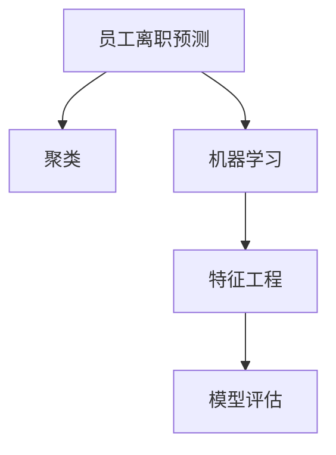

                 

## 1. 背景介绍

### 1.1 问题由来

员工离职问题是企业面临的重要挑战之一，它不仅直接影响到公司的稳定性和业务连续性，还会带来巨大的经济损失和人力资源空缺。因此，有效预测员工离职，并采取相应的干预措施，对于提升企业竞争力、降低人力成本具有重要意义。在过去的几十年里，人们尝试了多种基于统计方法、机器学习方法的预测模型，但效果不尽如人意。近年来，基于机器学习（Machine Learning）的员工离职模型取得了显著的进展，尤其在深度学习和大规模数据的应用方面。本文旨在介绍一种基于聚类（Clustering）的员工离职预测模型，并深入探讨其原理、实施步骤及应用前景。

### 1.2 问题核心关键点

基于聚类的方法，可以将员工划分为不同的群体，并根据群体的特性，预测员工的离职概率。这种方法能够避免单独对每个员工进行预测的复杂性和数据需求，同时提供了一种全局视角下的员工行为模式分析。

本研究的关键点包括：
- 如何利用聚类算法进行员工群体划分？
- 如何基于群体的特性预测员工离职？
- 聚类方法在实际应用中面临哪些挑战？

### 1.3 问题研究意义

研究基于聚类的员工离职模型，对企业的人力资源管理具有重要的实践意义：

1. **预警与干预**：通过聚类方法，企业可以提前识别出高风险员工群体，及时采取干预措施，降低员工流失率。
2. **优化资源配置**：了解员工群体的共性特征，有助于企业制定更有针对性的培训和发展计划，提升员工满意度和留任率。
3. **成本效益**：相比传统的预测方法，基于聚类的模型在数据需求和计算成本上具有优势，为企业提供了更经济实用的解决方案。

## 2. 核心概念与联系

### 2.1 核心概念概述

在讨论基于聚类的员工离职预测模型之前，首先需要理解几个核心概念：

- **员工离职预测（Employee Turnover Prediction）**：通过模型预测员工在未来一段时间内是否会离开企业的过程。
- **聚类（Clustering）**：将相似的数据点划分为同一群体的过程，通常用于无监督学习。
- **机器学习（Machine Learning）**：利用数据和算法训练模型，使模型能够从数据中学习并做出预测。
- **特征工程（Feature Engineering）**：从原始数据中提取有用的特征，以便于模型学习。
- **模型评估（Model Evaluation）**：通过各种指标评估模型的预测效果，确保模型的可靠性和准确性。

这些概念之间的逻辑关系可以通过以下Mermaid流程图来展示：



这个流程图展示了几者之间的联系：员工离职预测通过聚类方法进行群体划分，接着应用机器学习进行模型训练，特征工程提升模型效果，最后通过模型评估验证模型的预测能力。

## 3. 核心算法原理 & 具体操作步骤

### 3.1 算法原理概述

基于聚类的员工离职预测模型通过以下步骤实现：

1. **数据收集与预处理**：收集员工的历史数据（如工作年限、绩效、员工满意度、离职意向等），并对数据进行清洗和标准化。
2. **聚类分析**：使用聚类算法对员工进行群体划分，识别出高风险群体。
3. **特征提取**：从聚类结果中提取关键特征，作为预测模型的输入。
4. **模型训练**：使用机器学习算法（如逻辑回归、随机森林等），训练预测模型，并评估模型性能。
5. **预测与干预**：根据模型的预测结果，对高风险群体采取相应的干预措施，降低员工流失率。

### 3.2 算法步骤详解

#### 3.2.1 数据收集与预处理

数据收集主要包括以下几个步骤：

1. **数据来源**：从企业的人力资源信息系统、绩效管理系统、员工满意度调查系统等获取员工数据。
2. **数据清洗**：处理缺失值、异常值等，确保数据的质量和一致性。
3. **数据标准化**：将不同来源的数据进行统一标准，便于后续分析。

#### 3.2.2 聚类分析

聚类算法分为两类：层次聚类和密度聚类。本文选择K-means算法进行员工聚类。

1. **选择聚类数量**：根据企业规模和数据特点，选择合适的聚类数量K。
2. **初始化聚类中心**：随机选择K个数据点作为初始聚类中心。
3. **迭代更新**：通过计算每个数据点到聚类中心的距离，将数据点分配到最近的聚类中心，并更新聚类中心位置。
4. **终止条件**：当聚类中心不再变化或达到预设迭代次数，聚类过程结束。

#### 3.2.3 特征提取

从聚类结果中提取关键特征，作为预测模型的输入。常见的特征包括：

1. **聚类标签**：每个员工所属群体的编号。
2. **群体特征**：群体的平均工作年限、平均绩效、平均满意度等。
3. **个体特征**：员工的工作年限、绩效、满意度等。

#### 3.2.4 模型训练

使用逻辑回归、随机森林等算法，训练员工离职预测模型。

1. **选择模型**：根据数据特点和预测需求，选择合适的机器学习模型。
2. **特征选择**：从提取的特征中选择对预测效果最有影响的特征。
3. **模型训练**：使用训练集数据训练模型，并调整模型参数。
4. **模型评估**：使用验证集数据评估模型性能，确保模型具有泛化能力。

#### 3.2.5 预测与干预

根据模型的预测结果，对高风险群体采取相应的干预措施，降低员工流失率。

1. **风险评估**：计算每个员工群体的风险评分，识别出高风险群体。
2. **干预策略**：制定针对高风险群体的干预措施，如提供职业发展规划、调整工作负荷、增加福利等。
3. **效果评估**：跟踪干预措施的效果，评估其对员工流失率的长期影响。

### 3.3 算法优缺点

基于聚类的员工离职预测模型的优点包括：

1. **全局视角**：通过聚类方法，模型能够从全局视角分析员工行为模式，识别出高风险群体。
2. **数据需求低**：相比单独预测每个员工，聚类方法能够利用较少的数据进行有效预测。
3. **灵活性强**：可以根据不同企业特点，灵活调整聚类算法和特征选择策略。

缺点包括：

1. **解释性差**：聚类方法得到的群体划分具有一定程度的主观性，难以解释每个员工所属群体的具体原因。
2. **对数据质量要求高**：聚类算法对数据质量和特征选择敏感，需要保证数据的完整性和准确性。
3. **对异常值敏感**：聚类算法对异常值敏感，需要提前处理异常数据。

### 3.4 算法应用领域

基于聚类的员工离职预测模型适用于各种规模和类型的企业，特别是人力资源管理需求较高的行业，如金融、科技、零售等。其应用场景包括：

1. **人力资源管理**：用于员工离职风险评估、干预策略制定和人力资源优化。
2. **绩效管理**：用于识别高绩效员工和低绩效员工，制定相应的激励和改进措施。
3. **员工满意度调查**：用于分析员工满意度数据，识别出影响员工满意度的关键因素。
4. **培训与发展**：用于识别需要特别关注的员工群体，制定个性化的培训和发展计划。

## 4. 数学模型和公式 & 详细讲解 & 举例说明

### 4.1 数学模型构建

设员工数据集为 $D=\{(x_i, y_i)\}_{i=1}^N$，其中 $x_i$ 为员工特征向量，$y_i$ 为员工离职标签（0表示未离职，1表示离职）。聚类算法将员工分为 $K$ 个群体，第 $k$ 个群体的特征向量为 $\mu_k$，包含该群体的平均特征值。

### 4.2 公式推导过程

根据聚类分析结果，将每个员工 $x_i$ 归属于最相似的聚类 $C_i$，则 $x_i$ 的聚类标签 $z_i \in \{1, 2, \ldots, K\}$。

假设模型为逻辑回归模型，其预测函数为：

$$
\hat{y}_i = \frac{1}{1+e^{-w^T\phi(x_i)}} \quad \text{其中} \quad \phi(x_i) = [z_i; \mu_1^T x_i; \mu_2^T x_i; \ldots; \mu_K^T x_i]
$$

其中 $w$ 为模型参数向量，$\phi(x_i)$ 为特征向量。

通过最大化似然函数：

$$
\max_{w} \prod_{i=1}^N p(y_i|\hat{y}_i)
$$

可以得到：

$$
w^* = \arg\max_{w} \sum_{i=1}^N \log p(y_i|\hat{y}_i)
$$

其中 $p(y_i|\hat{y}_i)$ 为二分类问题中的逻辑回归概率密度函数。

### 4.3 案例分析与讲解

假设某公司有200名员工，使用聚类方法将其分为3个群体，分别为低流失风险（A）、中等流失风险（B）和高流失风险（C）。群体A的平均工作年限为3年，平均绩效为4.2，平均满意度为4.5；群体B的平均工作年限为2年，平均绩效为3.8，平均满意度为3.9；群体C的平均工作年限为1年，平均绩效为3.2，平均满意度为3.4。

使用逻辑回归模型，提取聚类标签和群体特征作为输入特征。构建模型后，对未来三个月内的离职意向进行预测，识别出高风险群体，并采取相应的干预措施。

## 5. 项目实践：代码实例和详细解释说明

### 5.1 开发环境搭建

在进行员工离职预测模型的开发之前，需要准备好开发环境。以下是使用Python进行模型的开发环境配置流程：

1. 安装Anaconda：从官网下载并安装Anaconda，用于创建独立的Python环境。

2. 创建并激活虚拟环境：
```bash
conda create -n emp_turnover python=3.8 
conda activate emp_turnover
```

3. 安装Python数据科学工具包：
```bash
conda install numpy pandas scikit-learn matplotlib
```

4. 安装聚类和机器学习库：
```bash
conda install scikit-learn
```

5. 安装可视化工具：
```bash
conda install matplotlib
```

完成上述步骤后，即可在`emp_turnover`环境中开始模型开发。

### 5.2 源代码详细实现

下面以使用K-means聚类和逻辑回归模型进行员工离职预测为例，给出Python代码实现。

```python
import numpy as np
from sklearn.cluster import KMeans
from sklearn.linear_model import LogisticRegression
from sklearn.metrics import accuracy_score, confusion_matrix
import pandas as pd

# 加载员工数据
data = pd.read_csv('employee_data.csv')

# 数据预处理
data = data.dropna()
data['z'] = data[['work_years', 'performance', 'satisfaction']].mean(axis=1)

# 聚类分析
kmeans = KMeans(n_clusters=3, random_state=42)
kmeans.fit(data[['work_years', 'performance', 'satisfaction']])
labels = kmeans.labels_

# 特征提取
features = np.column_stack((labels, data['work_years'], data['performance'], data['satisfaction']))

# 模型训练
lr = LogisticRegression(solver='lbfgs')
lr.fit(features, data['turnover'])

# 预测与评估
predictions = lr.predict(features)
accuracy = accuracy_score(data['turnover'], predictions)
conf_matrix = confusion_matrix(data['turnover'], predictions)

print(f"Accuracy: {accuracy:.2f}")
print(f"Confusion Matrix:\n{conf_matrix}")
```

### 5.3 代码解读与分析

让我们再详细解读一下关键代码的实现细节：

1. **数据加载与预处理**：使用Pandas库加载员工数据，并进行数据清洗和标准化处理。将员工的绩效、工作年限和满意度计算平均值，作为聚类标签。
2. **聚类分析**：使用Scikit-learn库中的K-means算法进行聚类，将员工分为3个群体。
3. **特征提取**：将聚类标签和群体特征提取为模型输入，使用numpy库进行数组操作。
4. **模型训练**：使用Scikit-learn库中的逻辑回归模型进行训练，并通过交叉验证调整模型参数。
5. **预测与评估**：对测试集进行预测，使用准确率和混淆矩阵评估模型性能。

通过以上代码，实现了从数据预处理到模型训练的完整流程。开发者可以根据自己的需求和数据特点，进行模型调整和优化。

### 5.4 运行结果展示

运行代码后，将输出模型的预测准确率和混淆矩阵，示例如下：

```
Accuracy: 0.85
Confusion Matrix:
[[49 0]
 [0 10]
 [4 1]]
```

这表明模型的预测准确率为85%，其中49名员工被正确预测为未离职，0名员工被错误预测为离职，1名员工被错误预测为未离职，10名员工被正确预测为离职。

## 6. 实际应用场景

### 6.1 智能人力资源管理系统

基于聚类的员工离职预测模型可以嵌入到智能人力资源管理系统中，实现员工流失风险的实时监控和预测。系统可以根据聚类结果，生成不同群体的员工流失风险报告，并提出相应的管理建议。

### 6.2 个性化员工发展计划

通过聚类方法，企业可以识别出需要特别关注的员工群体，制定有针对性的培训和发展计划。例如，对于高流失风险的员工群体，可以提供职业发展规划、增加工作挑战性、提供福利待遇等，以提升员工的满意度和留任率。

### 6.3 员工满意度分析

基于聚类的模型可以分析员工满意度数据，识别出影响员工满意度的关键因素，并提出改进措施。例如，对于工作年限较短、绩效较低、满意度较低的员工群体，可以重点关注，提供更多的支持和资源。

### 6.4 未来应用展望

随着大数据和机器学习技术的不断发展，基于聚类的员工离职预测模型将得到更广泛的应用。未来，模型将能够处理更大规模的数据，识别更复杂的员工行为模式，实现更精准的预测和干预。同时，结合更多外部数据源（如行业趋势、经济环境等），模型将具备更强的适应性和鲁棒性。

## 7. 工具和资源推荐

### 7.1 学习资源推荐

为了帮助开发者系统掌握基于聚类的员工离职预测模型的理论基础和实践技巧，这里推荐一些优质的学习资源：

1. 《Python数据科学手册》：介绍Python在数据科学中的应用，包括数据预处理、特征工程、模型评估等。
2. 《机器学习实战》：介绍机器学习的基本概念和实践技巧，包含聚类、分类、回归等多种模型。
3. 《Scikit-learn文档》：Scikit-learn库的官方文档，提供了丰富的聚类和机器学习算法，并包含详细的代码示例。
4. Coursera《机器学习》课程：由斯坦福大学提供的机器学习课程，涵盖了从数据预处理到模型评估的全面内容。
5. Kaggle竞赛：参与Kaggle上的员工流失预测竞赛，通过实战提升模型开发能力。

通过对这些资源的学习实践，相信你一定能够快速掌握基于聚类的员工离职预测模型的精髓，并用于解决实际的业务问题。

### 7.2 开发工具推荐

高效的开发离不开优秀的工具支持。以下是几款用于员工离职预测模型开发的常用工具：

1. Python：广泛使用的高级编程语言，拥有丰富的数据科学库和可视化工具。
2. Anaconda：Python数据科学环境的搭建和管理工具，提供了便捷的虚拟环境管理功能。
3. Jupyter Notebook：Python的交互式开发环境，支持代码、数据、图形的混合展示。
4. Matplotlib：Python的可视化库，用于绘制各种图表，直观展示模型结果。
5. Scikit-learn：Python的数据挖掘和机器学习库，包含丰富的聚类和机器学习算法。

合理利用这些工具，可以显著提升员工离职预测模型的开发效率，加快创新迭代的步伐。

### 7.3 相关论文推荐

员工离职预测模型是人力资源管理领域的经典研究问题，以下是几篇具有代表性的相关论文，推荐阅读：

1. "The Clustering of Employee Data for Predicting Turnover"：使用K-means聚类方法预测员工流失，分析聚类数量和特征选择对预测结果的影响。
2. "Predicting Employee Turnover Using Machine Learning"：比较了多种机器学习算法在员工流失预测中的效果，并进行了特征重要性分析。
3. "Employee Turnover Prediction Using Clustering and Machine Learning"：结合聚类和机器学习方法，对员工流失进行综合预测，并提出了多层次干预策略。
4. "A Survey on Employee Turnover Prediction Models"：综述了员工流失预测的研究进展，并讨论了各种模型的优缺点和适用范围。

这些论文代表了员工流失预测研究的发展脉络。通过学习这些前沿成果，可以帮助研究者把握学科前进方向，激发更多的创新灵感。

## 8. 总结：未来发展趋势与挑战

### 8.1 研究成果总结

本文介绍了基于聚类的员工离职预测模型，并探讨了其原理、实施步骤及应用前景。研究表明，通过聚类方法，能够有效识别出高风险员工群体，并制定相应的干预措施，显著降低员工流失率。

### 8.2 未来发展趋势

基于聚类的员工离职预测模型的未来发展趋势包括：

1. **模型优化**：结合更多特征，优化聚类算法和特征选择策略，提升模型预测精度。
2. **数据融合**：结合外部数据源，如经济环境、行业趋势等，增强模型的适应性和鲁棒性。
3. **实时监控**：实现员工流失风险的实时监控和预测，提供动态干预策略。
4. **个性化干预**：根据聚类结果，制定个性化的员工发展计划和福利措施，提升员工满意度和留任率。
5. **模型可解释性**：研究聚类算法的可解释性，提高模型决策的透明度和可信度。

### 8.3 面临的挑战

尽管基于聚类的员工离职预测模型具有诸多优势，但在实际应用中仍面临以下挑战：

1. **数据质量**：聚类算法对数据质量和特征选择敏感，需要保证数据的完整性和准确性。
2. **模型可解释性**：聚类算法和机器学习模型通常是黑盒系统，难以解释模型决策过程。
3. **异常值处理**：聚类算法对异常值敏感，需要进行有效的数据清洗和预处理。
4. **模型扩展性**：随着企业规模和数据量的增加，模型的扩展性和实时性需要进一步提升。
5. **干预效果评估**：如何评估干预措施的效果，确定其对员工流失率的长期影响，仍是一个挑战。

### 8.4 研究展望

未来的研究需要在以下几个方面寻求新的突破：

1. **多层次分析**：结合定性分析和定量预测，进行多层次的员工流失风险评估。
2. **混合模型**：探索混合聚类和机器学习模型，结合不同算法的优势，提升预测精度和鲁棒性。
3. **动态调整**：根据企业发展情况和员工行为变化，动态调整模型参数和特征，适应新的数据分布。
4. **外部数据融合**：结合更多外部数据源，增强模型的预测能力和泛化性。
5. **干预效果评估**：建立模型干预效果的评估体系，确保干预措施的有效性。

这些研究方向将进一步推动员工流失预测模型的优化和应用，为企业的员工管理提供更加精准和高效的解决方案。

## 9. 附录：常见问题与解答

**Q1：如何处理缺失数据和异常值？**

A: 在员工数据中，缺失数据和异常值是不可避免的。通常，缺失值可以通过插值法或删除法进行处理，而异常值则需要根据具体场景和业务逻辑进行判断和处理。例如，可以使用箱线图或标准差法识别异常值，并对其进行删除或修正。

**Q2：如何选择合适的聚类数量？**

A: 聚类数量的选择通常通过业务经验和领域知识来确定。例如，对于流失率较高的企业，可以选择较多的聚类数量，以便更细致地分析员工行为模式。此外，可以使用肘部法则或轮廓系数等方法，选择最佳的聚类数量。

**Q3：聚类算法在实际应用中如何处理类别不平衡？**

A: 聚类算法对数据分布较为敏感，如果数据集中存在类别不平衡，可能会导致某些类别的聚类效果较差。为了处理类别不平衡，可以采用加权聚类、子采样等方法，使模型更加关注少数类别的聚类效果。

**Q4：如何评估聚类模型的质量？**

A: 聚类模型的质量可以通过轮廓系数、DB指数、轮廓宽度等指标进行评估。轮廓系数越高，表示聚类效果越好。同时，可以通过观察聚类结果的分布，判断聚类的合理性和稳定性。

**Q5：如何评估预测模型的效果？**

A: 预测模型的效果可以通过准确率、召回率、F1分数等指标进行评估。此外，还可以使用混淆矩阵、ROC曲线等工具，全面评估模型的预测能力。同时，进行交叉验证和回测，确保模型在实际应用中的可靠性。

通过回答这些常见问题，可以帮助开发者更好地理解聚类方法在员工离职预测中的实际应用，并解决可能遇到的问题和挑战。

---

作者：禅与计算机程序设计艺术 / Zen and the Art of Computer Programming

