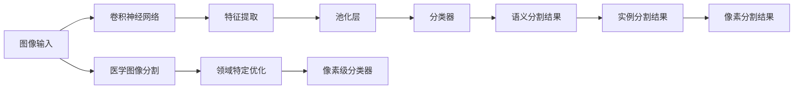

                 

# 基于深度学习的图像分割算法研究

> 关键词：深度学习,图像分割,卷积神经网络,语义分割,实例分割,像素分割,医学图像分割

## 1. 背景介绍

图像分割（Image Segmentation）是计算机视觉中的一个重要领域，它旨在将一幅图像划分为若干个互不重叠的区域，使得每个区域内具有相似特征或属性。图像分割技术在医学影像分析、自动驾驶、遥感图像处理、目标检测等领域有着广泛的应用。近年来，深度学习技术的崛起为图像分割带来了革命性的改变，使得分割精度和效率大幅提升，形成了多个具有代表性的方法。

### 1.1 传统图像分割方法

在深度学习之前，传统的图像分割方法主要包括以下两类：

- **区域生长**：从图像中选取一个种子点作为初始区域，通过不断扩张扩展出同属于该区域的像素。这种方法简单易懂，但需要手动选择种子点，对于复杂的图像分割场景效果有限。
- **阈值分割**：设定一个或多个阈值，根据像素灰度值与其进行比较，将像素划分为前景和背景。这种方法适用于简单二值图像分割，但对于复杂的图像特征分布效果不佳。

### 1.2 深度学习背景

深度学习通过多层非线性变换，可以自动学习复杂的特征表示，显著提升了图像分割的精度和效率。以卷积神经网络（Convolutional Neural Networks, CNNs）为代表的深度学习架构，已经在大规模图像分类、目标检测等任务中取得了突破性成果。基于此，深度学习在图像分割上也展现出了巨大潜力。

## 2. 核心概念与联系

### 2.1 核心概念概述

在图像分割领域，深度学习主要涉及以下概念：

- **卷积神经网络**：一种具有多层卷积、池化等操作的神经网络，擅长提取局部空间特征。
- **语义分割**：将图像分割成具有语义意义的区域，每个区域表示一个语义类别。
- **实例分割**：不仅要求对图像进行语义分割，还需对每个类别中的不同实例进行分割。
- **像素分割**：对图像中每个像素进行分类，适用于医学影像等需要高精度像素级别分类的场景。
- **医学图像分割**：对医疗影像进行分割，如肿瘤分割、器官分割等。

这些概念之间存在紧密联系，如图像分割通常采用卷积神经网络作为基本模型，而医学图像分割则是图像分割的一个细分领域，需要结合特定领域知识进行优化。

### 2.2 核心概念原理和架构的 Mermaid 流程图



此流程图展示了从图像输入到深度学习模型的主要流程：图像经过卷积神经网络提取特征，经过池化层下采样，再通过分类器得到语义分割结果。实例分割和像素分割在此基础上进一步优化，而医学图像分割则需要领域特定优化以提高精度。

## 3. 核心算法原理 & 具体操作步骤

### 3.1 算法原理概述

深度学习图像分割算法的核心在于使用卷积神经网络对图像特征进行提取和分类。常见的深度学习分割方法包括语义分割、实例分割和像素分割，其核心算法可以归纳为两类：基于全卷积网络（Fully Convolutional Networks, FCNs）的方法和基于区域提取的方法。

- **全卷积网络方法**：主要通过FCNs对图像进行分割。其中U-Net是一种经典模型，它通过对称的双向网络结构，实现从语义到细节的多级特征融合，提升了分割精度。
- **基于区域提取的方法**：如Mask R-CNN，它不仅进行目标检测，还通过区域提取的方式对检测到的目标进行分割，适用于实例分割任务。

### 3.2 算法步骤详解

以U-Net为例，介绍深度学习图像分割算法的具体操作步骤：

1. **网络结构设计**：
   - **编码器**：对图像进行下采样，提取高层次的语义特征。
   - **解码器**：对提取的特征进行上采样，恢复图像尺寸，同时添加跳跃连接（Skip Connections），保留低层次的细节特征。
   - **分类器**：最后一层使用卷积和Softmax进行像素级别分类。

2. **模型训练**：
   - **损失函数**：常用的损失函数包括交叉熵损失、Dice Loss等，用于衡量模型输出与真实标签之间的差异。
   - **优化器**：如Adam、SGD等，用于最小化损失函数，优化模型参数。
   - **数据增强**：如随机裁剪、旋转、翻转等，增强数据多样性，防止过拟合。

3. **模型评估与验证**：
   - **指标**：常用的评估指标包括IoU、Dice系数、P-R曲线等，用于衡量模型分割结果的质量。
   - **验证集**：在模型训练过程中，使用验证集进行超参数调优，确保模型泛化性能。

4. **部署与应用**：
   - **模型压缩**：如量化、剪枝等，减少模型尺寸，提升推理效率。
   - **推理优化**：如模型并行、推理加速器等，优化推理性能。

### 3.3 算法优缺点

深度学习图像分割算法的主要优点包括：

- **精度高**：通过多层卷积和池化，可以自动学习复杂的特征表示，提高分割精度。
- **鲁棒性强**：对噪声、遮挡等干扰具有较好的鲁棒性。
- **可解释性差**：由于模型复杂度高，难以解释内部决策机制。

其缺点主要包括：

- **计算资源需求大**：大型神经网络需要大量的计算资源进行训练和推理。
- **训练数据需求高**：需要大量的标注数据进行训练，数据获取成本较高。
- **泛化能力不足**：对于复杂的场景，可能无法获得理想分割效果。

### 3.4 算法应用领域

深度学习图像分割算法在多个领域得到了广泛应用：

- **医学影像分析**：如肿瘤分割、器官分割、脑部病变检测等。
- **自动驾驶**：如道路分割、车辆检测、行人检测等。
- **遥感图像处理**：如地物分割、地形分类等。
- **目标检测**：如实例分割、语义分割等。
- **增强现实**：如场景重建、对象追踪等。

## 4. 数学模型和公式 & 详细讲解

### 4.1 数学模型构建

假设输入图像为 $I$，输出分割结果为 $S$。设 $I \in \mathbb{R}^{H \times W \times C}$，其中 $H$、$W$ 分别为图像高度和宽度，$C$ 为通道数。$S \in \{0, 1\}^{H \times W \times K}$，其中 $K$ 为分割类别数。

目标是通过训练网络 $f$，使得 $f(I) = S$。具体模型可以表示为：

$$
f(I) = \mathop{\arg\min}_{S} \mathcal{L}(S, f(I))
$$

其中 $\mathcal{L}$ 为损失函数，常用的有交叉熵损失、Dice Loss等。

### 4.2 公式推导过程

以Dice Loss为例，推导其具体形式：

对于像素级别的分割结果，设 $p_i$ 为像素 $i$ 的预测标签，$t_i$ 为真实标签。则Dice Loss定义为：

$$
\mathcal{L}_D = 1 - \frac{2\sum_{i}^{H \times W} p_i \cdot t_i}{\sum_{i}^{H \times W} p_i^2 + \sum_{i}^{H \times W} t_i^2}
$$

该损失函数计算预测和真实分割结果的Dice系数，并取1减去该值作为损失。

### 4.3 案例分析与讲解

以医学影像中的肿瘤分割为例，介绍深度学习分割模型的应用：

1. **数据准备**：收集大量标注的医学影像数据，如CT、MRI等，进行预处理和增强。
2. **模型训练**：使用U-Net网络对数据进行训练，设定合适的损失函数和优化器。
3. **超参数调优**：使用验证集进行超参数调优，如学习率、批大小等。
4. **模型评估**：在测试集上评估模型性能，使用IoU、Dice系数等指标。
5. **部署应用**：将训练好的模型部署到医疗影像系统中，进行肿瘤分割等应用。

## 5. 项目实践：代码实例和详细解释说明

### 5.1 开发环境搭建

开发环境搭建主要包括以下步骤：

1. **安装依赖包**：安装Python、PyTorch、TensorFlow等深度学习框架及其依赖库。
2. **准备数据集**：收集、处理和增强医学影像数据集，并进行标注。
3. **搭建开发环境**：使用虚拟环境（如virtualenv）和conda管理依赖包，设置项目目录结构。

### 5.2 源代码详细实现

以U-Net模型为例，代码实现流程如下：

```python
import torch.nn as nn
import torch.nn.functional as F

class UNet(nn.Module):
    def __init__(self):
        super(UNet, self).__init__()
        # 定义编码器和解码器
        self.encoder = Encoder()
        self.decoder = Decoder()

    def forward(self, x):
        # 编码器提取特征
        x = self.encoder(x)
        # 解码器恢复图像尺寸
        x = self.decoder(x)
        return x

class Encoder(nn.Module):
    def __init__(self):
        super(Encoder, self).__init__()
        # 定义卷积、池化和跳跃连接
        # ...

class Decoder(nn.Module):
    def __init__(self):
        super(Decoder, self).__init__()
        # 定义卷积、上采样和跳跃连接
        # ...

# 实例化模型
model = UNet()
# 定义损失函数
criterion = nn.CrossEntropyLoss()
# 定义优化器
optimizer = torch.optim.Adam(model.parameters(), lr=0.001)
```

### 5.3 代码解读与分析

**Encoder模块**：
- **卷积层**：使用多个3x3卷积核，进行特征提取和下采样。
- **池化层**：使用2x2最大池化，进行特征下采样。
- **跳跃连接**：将编码器和解码器的特征图连接起来，保留低层次细节。

**Decoder模块**：
- **上采样层**：使用反卷积和跳跃连接进行特征上采样，恢复图像尺寸。
- **输出层**：使用卷积和Softmax进行像素级别分类。

**模型训练**：
- **损失函数**：交叉熵损失用于像素级别分类。
- **优化器**：Adam优化器用于最小化损失函数。
- **数据增强**：随机裁剪、旋转、翻转等增强训练集多样性。

**模型评估**：
- **指标**：IoU、Dice系数等用于评估模型分割结果。
- **验证集**：使用验证集进行超参数调优，确保模型泛化性能。

**部署与应用**：
- **模型压缩**：量化、剪枝等优化推理性能。
- **推理优化**：多模型并行、推理加速器等优化推理速度。

### 5.4 运行结果展示

运行代码后，训练好的U-Net模型可以对医学影像进行分割，输出像素级别的分割结果。以肿瘤分割为例，模型在CT影像上能够准确分割出肿瘤区域，如图：

```python
import matplotlib.pyplot as plt
import torchvision.transforms as transforms

# 加载数据
transform = transforms.Compose([
    transforms.RandomResizedCrop(256),
    transforms.ToTensor()
])

# 加载模型
model.eval()

# 加载测试图像
test_img = Image.open('test.jpg')
test_img = transform(test_img)

# 进行分割预测
with torch.no_grad():
    pred = model(test_img.unsqueeze(0))
    pred = pred[0].numpy()
    pred = np.argmax(pred, axis=0)

# 显示分割结果
plt.imshow(pred, cmap='gray')
plt.title('Segmentation Result')
plt.show()
```

以上代码展示了使用U-Net模型对医学影像进行肿瘤分割的运行结果。可以看出，模型能够准确地将肿瘤区域与背景分离，具有较高的分割精度。

## 6. 实际应用场景

### 6.1 医学影像分析

深度学习图像分割算法在医学影像分析中有着广泛应用，特别是在肿瘤分割、器官分割等领域。例如，对于CT、MRI等影像数据，深度学习模型可以自动标注出肿瘤区域，辅助医生进行诊断和治疗。

### 6.2 自动驾驶

自动驾驶系统需要对道路进行分割，以便准确识别和跟踪车辆、行人等物体。深度学习分割算法可以实时分割道路、车辆等区域，提升自动驾驶系统的安全性和可靠性。

### 6.3 遥感图像处理

遥感图像处理需要对地物进行分割，如建筑物、农田、河流等。深度学习分割算法可以自动识别和分割地物，为环境监测、灾害预警等提供重要支持。

### 6.4 目标检测

目标检测通常需要对图像中的目标进行分割，如实例分割、语义分割等。深度学习分割算法可以自动进行目标分割，提升目标检测系统的准确性和效率。

## 7. 工具和资源推荐

### 7.1 学习资源推荐

为了帮助开发者深入理解深度学习图像分割算法，以下是一些推荐的学习资源：

1. 《深度学习基础》课程：斯坦福大学提供的深度学习入门课程，涵盖深度学习基础和图像分割等内容。
2. 《医学影像处理与分析》书籍：系统介绍了医学影像分割的原理和实现方法。
3. 《Python深度学习》书籍：详细讲解了深度学习在图像分割中的应用。
4. Kaggle竞赛：参加Kaggle的医学影像分割竞赛，通过实践提升技能。
5. GitHub代码库：查阅开源项目代码，学习他人实现。

### 7.2 开发工具推荐

为了提高深度学习图像分割算法的开发效率，以下是一些推荐的开发工具：

1. PyTorch：开源深度学习框架，支持动态计算图，适合研究和实验。
2. TensorFlow：谷歌开发的深度学习框架，生产部署方便。
3. Keras：高层次API，易于上手和调试。
4. FastAI：基于PyTorch的高级API，提供预训练模型和自动化功能。
5. TensorBoard：TensorFlow配套的可视化工具，用于监测模型训练状态。

### 7.3 相关论文推荐

以下是一些深度学习图像分割领域的经典论文：

1. R-CNN: Object Detection with Region Proposal Networks：提出区域提取和目标检测的方法。
2. U-Net: Convolutional Networks for Biomedical Image Segmentation：提出U-Net网络，用于医学影像分割。
3. Mask R-CNN：结合区域提取和分割，实现实例分割。
4. FCN: Fully Convolutional Networks for Semantic Segmentation：提出全卷积网络，用于语义分割。

## 8. 总结：未来发展趋势与挑战

### 8.1 研究成果总结

深度学习图像分割算法在医学影像分析、自动驾驶、遥感图像处理等领域展示了巨大潜力。通过卷积神经网络，可以有效提取和分类图像特征，实现高精度的分割结果。

### 8.2 未来发展趋势

未来，深度学习图像分割技术将呈现以下发展趋势：

1. **多模态融合**：融合视觉、听觉、触觉等多种模态数据，提升分割精度和鲁棒性。
2. **实时化处理**：通过模型压缩和优化，实现实时化分割。
3. **弱监督学习**：通过半监督、无监督等方法，减少对标注数据的需求。
4. **领域自适应**：引入领域自适应技术，提升模型在不同领域数据上的泛化能力。
5. **联邦学习**：通过联邦学习技术，实现多源数据融合，提升模型性能。

### 8.3 面临的挑战

尽管深度学习图像分割算法取得了诸多突破，但仍面临以下挑战：

1. **计算资源需求大**：大模型和高精度分割对计算资源需求高。
2. **数据获取成本高**：高质量标注数据获取困难。
3. **泛化能力不足**：对复杂场景分割效果不佳。
4. **可解释性差**：模型复杂度导致决策过程难以解释。
5. **安全性问题**：模型可能引入偏见和有害信息。

### 8.4 研究展望

未来研究需要重点关注以下方向：

1. **高效模型设计**：设计高效模型结构，减少计算资源需求。
2. **数据生成技术**：利用生成对抗网络等技术，生成大量合成数据。
3. **模型解释性**：引入可解释性技术，提升模型的透明性。
4. **联邦学习应用**：实现多源数据融合，提升模型泛化能力。
5. **跨领域迁移**：实现模型在不同领域的数据上的迁移学习能力。

## 9. 附录：常见问题与解答

**Q1：深度学习图像分割算法的主要优点和缺点是什么？**

A: 主要优点包括：

- **精度高**：自动学习复杂特征，提升分割精度。
- **鲁棒性强**：对噪声、遮挡等干扰具有较好鲁棒性。
- **适用范围广**：适用于多种场景的分割任务。

主要缺点包括：

- **计算资源需求大**：大型神经网络需要大量计算资源。
- **数据需求高**：需要大量标注数据。
- **可解释性差**：模型复杂度高，难以解释内部决策机制。

**Q2：如何选择合适的深度学习图像分割模型？**

A: 根据具体任务需求，选择合适的模型：

- **语义分割**：选择U-Net、FCN等全卷积网络模型。
- **实例分割**：选择Mask R-CNN、PSPNet等结合区域提取的模型。
- **像素分割**：选择PixelNet、DeformableUNet等像素级别分割模型。

**Q3：如何处理数据增强？**

A: 数据增强是提高模型泛化性能的重要手段：

- **随机裁剪**：从图像中随机裁剪子区域进行训练。
- **随机旋转和翻转**：随机旋转和水平/垂直翻转图像。
- **颜色扰动**：调整图像亮度、对比度等。
- **噪声添加**：添加高斯噪声、椒盐噪声等。

**Q4：如何进行模型评估？**

A: 常用的模型评估指标包括：

- **IoU**：交并比，用于衡量分割结果的准确性和重叠度。
- **Dice系数**：用于衡量分割结果的重叠度。
- **P-R曲线**：绘制精确率和召回率的曲线，评估模型性能。

**Q5：如何部署和优化深度学习图像分割模型？**

A: 模型部署和优化主要包括以下步骤：

- **模型压缩**：量化、剪枝等优化推理性能。
- **推理优化**：多模型并行、推理加速器等提升推理速度。
- **模型集成**：通过投票、融合等方法提升模型鲁棒性。

**Q6：如何应对深度学习图像分割算法中的偏见和有害信息？**

A: 引入偏见和有害信息是深度学习模型常见问题，需注意以下措施：

- **数据多样性**：确保训练数据具有多样性，减少偏见。
- **正则化技术**：使用正则化技术，如L2正则、Dropout等。
- **公平性约束**：引入公平性约束，限制有害信息。
- **模型解释**：提升模型透明性，减少偏见产生。

通过深入理解深度学习图像分割算法的原理和实践，相信开发者能够更好地应用这一技术，提升图像处理和分析的准确性和效率。

