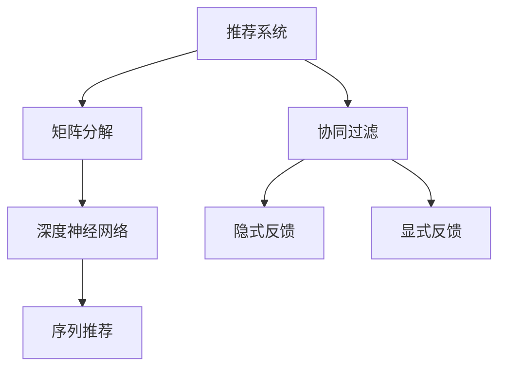

                 

# 基于深度学习的推荐系统设计与实现

> 关键词：推荐系统,深度学习,协同过滤,矩阵分解,序列推荐,深度神经网络,推荐算法,用户行为分析,模型训练

## 1. 背景介绍

### 1.1 问题由来

推荐系统（Recommendation System）是当前互联网领域最具代表性的技术之一，旨在通过个性化推荐算法帮助用户快速获取感兴趣的信息或商品，提升用户体验，增加用户粘性。在电商、视频、社交网络等众多应用场景中，推荐系统已经成为不可或缺的组成部分。

然而，随着数据量和用户规模的不断增长，传统推荐算法在处理海量数据和高维度稀疏矩阵时，面临着计算复杂度高、特征表示能力有限等挑战。深度学习（Deep Learning）技术的兴起，为推荐系统带来了新的突破。

深度学习通过构建深层神经网络模型，自动学习和挖掘用户和物品之间的复杂关联，具备更强的表达能力和泛化能力，成为推荐系统中的新一代技术范式。在实际应用中，深度学习推荐系统已经在Amazon、Netflix、Spotify等顶级互联网平台大放异彩，推动了推荐技术的飞速发展。

### 1.2 问题核心关键点

深度学习推荐系统主要解决两个核心问题：

1. **用户表示学习**：如何通过深度学习模型自动学习用户的高维稀疏特征表示，避免传统方法中手工特征工程的繁琐和冗余。
2. **协同过滤和矩阵分解**：如何基于用户和物品的隐式反馈信息，构建深层神经网络模型，实现对用户行为和物品属性的综合建模。

深度学习推荐系统通过融合用户表示学习、协同过滤、矩阵分解等方法，实现了对用户行为的高效建模和推荐精度的大幅提升，为推荐系统研究与开发提供了全新的思路和技术手段。

## 2. 核心概念与联系

### 2.1 核心概念概述

为更好地理解深度学习推荐系统的设计和实现，本节将介绍几个关键的概念：

- **推荐系统**：通过分析用户的历史行为和偏好，推荐出用户可能感兴趣的商品、文章、视频等信息的系统。推荐系统是现代互联网中用户交互的核心工具之一，广泛应用于电商、视频、社交网络等领域。
- **协同过滤（Collaborative Filtering, CF）**：通过分析用户和物品的隐式反馈信息，推断用户对未见过的物品的偏好，实现个性化推荐。协同过滤是推荐系统中最经典的技术之一。
- **矩阵分解**：将用户和物品的隐式反馈信息表示为矩阵，通过矩阵分解算法挖掘矩阵中的潜在因子，以低维向量表示用户和物品的特征。矩阵分解是协同过滤的核心方法之一。
- **深度神经网络（Deep Neural Network, DNN）**：由多个深度非线性变换层堆叠组成的网络模型，具备强大的特征表示能力。深度神经网络在推荐系统中被广泛用于用户表示学习、协同过滤和矩阵分解等方面。
- **序列推荐（Sequential Recommendation）**：通过建模用户行为的时间序列，实现对用户未来兴趣的预测和推荐。序列推荐在动态交互推荐系统中具有重要应用价值。

这些核心概念之间的逻辑关系可以通过以下Mermaid流程图来展示：



这个流程图展示了一系列推荐系统设计中的核心概念及其之间的关系：

1. 推荐系统通过分析用户历史行为和偏好，推荐出用户可能感兴趣的信息。
2. 协同过滤通过用户和物品的隐式反馈信息，推断用户对未见过的物品的偏好。
3. 矩阵分解将用户和物品的隐式反馈信息表示为矩阵，并通过矩阵分解算法挖掘潜在因子。
4. 深度神经网络通过多层非线性变换，自动学习用户和物品的高维稀疏特征表示。
5. 序列推荐通过建模用户行为的时间序列，实现对用户未来兴趣的预测和推荐。

这些概念共同构成了推荐系统的设计框架，使其能够高效处理海量数据，提供精准的个性化推荐。

## 3. 核心算法原理 & 具体操作步骤
### 3.1 算法原理概述

深度学习推荐系统的核心算法包括协同过滤、矩阵分解、深度神经网络等，其基本原理如下：

1. **协同过滤**：通过用户和物品的隐式反馈信息，推断用户对未见过的物品的偏好。协同过滤分为基于用户的协同过滤和基于物品的协同过滤。
2. **矩阵分解**：将用户和物品的隐式反馈信息表示为矩阵，通过矩阵分解算法挖掘矩阵中的潜在因子，以低维向量表示用户和物品的特征。
3. **深度神经网络**：通过多层非线性变换，自动学习用户和物品的高维稀疏特征表示。深度神经网络在推荐系统中被广泛用于用户表示学习、协同过滤和矩阵分解等方面。
4. **序列推荐**：通过建模用户行为的时间序列，实现对用户未来兴趣的预测和推荐。序列推荐在动态交互推荐系统中具有重要应用价值。

### 3.2 算法步骤详解

深度学习推荐系统的设计和实现流程主要包括以下几个关键步骤：

**Step 1: 数据预处理**

- 收集用户行为数据：包括点击、浏览、购买、评分等行为。
- 数据清洗和归一化：去除噪音数据、填补缺失值、归一化处理等。
- 构建用户-物品矩阵：将用户行为数据表示为用户-物品矩阵 $R \in \mathbb{R}^{N \times M}$，其中 $N$ 为用户数，$M$ 为物品数。

**Step 2: 用户表示学习**

- 选择合适的深度神经网络模型，如全连接神经网络、卷积神经网络、递归神经网络等。
- 将用户行为数据输入神经网络，学习用户的高维稀疏特征表示 $\mathbf{u} \in \mathbb{R}^{d_u}$。

**Step 3: 物品表示学习**

- 与用户表示学习类似，通过深度神经网络学习物品的高维稀疏特征表示 $\mathbf{v} \in \mathbb{R}^{d_v}$。

**Step 4: 协同过滤**

- 基于用户和物品的特征表示，使用协同过滤算法预测用户对未见过的物品的评分 $r_{ui}$。

**Step 5: 矩阵分解**

- 将用户和物品的评分数据表示为矩阵 $R \in \mathbb{R}^{N \times M}$。
- 使用矩阵分解算法（如ALS、SVD等）挖掘矩阵中的潜在因子，得到用户-物品矩阵的低秩分解。
- 通过低秩分解得到的用户和物品的低维特征表示，用于协同过滤和序列推荐。

**Step 6: 序列推荐**

- 将用户的行为序列输入深度神经网络，学习用户兴趣的时间序列表示。
- 基于时间序列表示，使用LSTM、GRU等序列模型预测用户未来的兴趣，实现动态推荐。

**Step 7: 推荐结果排序**

- 将协同过滤、矩阵分解和序列推荐的预测结果进行加权融合，得到最终的推荐结果。
- 根据推荐结果的评分或概率进行排序，返回前 $k$ 个推荐物品。

### 3.3 算法优缺点

深度学习推荐系统的优点包括：

1. 特征表示能力强：深度神经网络能够自动学习高维稀疏特征表示，避免了手工特征工程的繁琐和冗余。
2. 泛化能力强：通过多层非线性变换，深度神经网络能够挖掘用户和物品之间的复杂关联，提高推荐精度。
3. 模型灵活可调：深度学习推荐系统可以根据具体应用场景调整模型结构、超参数等，具有较好的适应性。

深度学习推荐系统的缺点包括：

1. 计算复杂度高：深度神经网络通常需要较长的训练时间和较高的计算资源。
2. 模型复杂度高：深度神经网络结构复杂，难以解释其决策过程，存在一定的“黑盒”问题。
3. 数据质量要求高：深度学习推荐系统对数据的质量和数量要求较高，需要收集大量的用户行为数据。

### 3.4 算法应用领域

深度学习推荐系统已经在多个领域得到了广泛应用，例如：

- **电商推荐**：推荐用户可能感兴趣的商品、折扣信息等。电商推荐系统通常基于用户历史购买记录、浏览行为、评分反馈等数据，使用协同过滤、矩阵分解和深度神经网络进行建模和推荐。
- **视频推荐**：推荐用户可能感兴趣的视频内容。视频推荐系统通常使用用户历史观看记录、评分反馈等数据，使用协同过滤、矩阵分解和深度神经网络进行建模和推荐。
- **新闻推荐**：推荐用户可能感兴趣的新闻文章、视频、音频等。新闻推荐系统通常使用用户历史阅读记录、点击行为等数据，使用协同过滤、矩阵分解和深度神经网络进行建模和推荐。
- **音乐推荐**：推荐用户可能感兴趣的音乐、歌手等。音乐推荐系统通常使用用户历史听歌记录、评分反馈等数据，使用协同过滤、矩阵分解和深度神经网络进行建模和推荐。
- **社交推荐**：推荐用户可能感兴趣的朋友、群组等。社交推荐系统通常使用用户历史互动记录、好友关系等数据，使用协同过滤、矩阵分解和深度神经网络进行建模和推荐。

此外，深度学习推荐系统还被应用于游戏推荐、广告推荐、旅游推荐等多个场景，为各行各业带来了显著的用户体验提升和业务价值增长。

## 4. 数学模型和公式 & 详细讲解 & 举例说明

### 4.1 数学模型构建

深度学习推荐系统的数学模型主要包括以下几个组成部分：

1. **用户表示学习模型**：将用户行为数据表示为向量 $\mathbf{u} \in \mathbb{R}^{d_u}$。
2. **物品表示学习模型**：将物品的属性特征表示为向量 $\mathbf{v} \in \mathbb{R}^{d_v}$。
3. **协同过滤模型**：基于用户和物品的特征表示，使用协同过滤算法预测用户对未见过的物品的评分 $r_{ui}$。
4. **矩阵分解模型**：将用户和物品的评分数据表示为矩阵 $R \in \mathbb{R}^{N \times M}$，使用矩阵分解算法挖掘矩阵中的潜在因子，得到用户-物品矩阵的低秩分解。
5. **序列推荐模型**：将用户的行为序列输入深度神经网络，学习用户兴趣的时间序列表示，使用LSTM、GRU等序列模型预测用户未来的兴趣。

### 4.2 公式推导过程

以协同过滤算法为例，推导其基本公式：

假设用户 $u$ 对物品 $i$ 的评分 $r_{ui}$ 由其特征表示 $\mathbf{u}$ 和物品特征表示 $\mathbf{v}$ 线性加权求和得到，即：

$$
r_{ui} = \mathbf{u}^T\mathbf{v}
$$

其中 $\mathbf{u}^T$ 表示 $\mathbf{u}$ 的转置矩阵，$\mathbf{v}$ 表示物品的特征表示向量。

对于用户 $u$ 对物品 $i$ 的评分未知时，可以使用协同过滤算法进行预测。基于物品 $i$ 的特征表示 $\mathbf{v}$，计算所有用户对物品 $i$ 的预测评分，选择评分最高的前 $k$ 个用户，并计算它们的平均预测评分 $\hat{r}_{iu}$，即：

$$
\hat{r}_{iu} = \frac{1}{k}\sum_{j=1}^k r_{uj}
$$

将 $\hat{r}_{iu}$ 作为用户 $u$ 对物品 $i$ 的预测评分，用于推荐系统中的评分排序和排序推荐。

### 4.3 案例分析与讲解

以电商推荐系统为例，分析其核心算法的设计和实现：

**电商推荐系统设计**

1. **数据收集**：收集用户的历史购买记录、浏览行为、评分反馈等数据。
2. **数据预处理**：对用户和物品数据进行清洗、归一化、缺失值填补等预处理。
3. **用户表示学习**：使用深度神经网络学习用户的高维稀疏特征表示。
4. **物品表示学习**：使用深度神经网络学习物品的属性特征表示。
5. **协同过滤**：使用协同过滤算法预测用户对未见过的物品的评分。
6. **矩阵分解**：使用矩阵分解算法挖掘用户和物品的潜在因子，得到用户-物品矩阵的低秩分解。
7. **序列推荐**：使用深度神经网络学习用户兴趣的时间序列表示，使用LSTM、GRU等序列模型预测用户未来的兴趣。
8. **推荐结果排序**：将协同过滤、矩阵分解和序列推荐的预测结果进行加权融合，根据推荐结果的评分或概率进行排序，返回前 $k$ 个推荐物品。

**电商推荐系统实现**

1. **用户表示学习**

使用全连接神经网络对用户行为数据进行建模，学习用户的高维稀疏特征表示：

$$
\mathbf{u} = f_{\theta_u}(x_u)
$$

其中 $x_u$ 表示用户的历史行为数据，$f_{\theta_u}$ 表示用户表示学习的深度神经网络。

2. **物品表示学习**

使用卷积神经网络对物品的属性特征进行建模，学习物品的高维稀疏特征表示：

$$
\mathbf{v} = f_{\theta_v}(x_v)
$$

其中 $x_v$ 表示物品的属性特征，$f_{\theta_v}$ 表示物品表示学习的深度神经网络。

3. **协同过滤**

使用协同过滤算法预测用户对未见过的物品的评分：

$$
\hat{r}_{ui} = \mathbf{u}^T\mathbf{v} + \epsilon
$$

其中 $\epsilon$ 表示噪声，用于平滑预测结果。

4. **矩阵分解**

使用矩阵分解算法（如ALS、SVD等）对用户-物品评分矩阵 $R$ 进行低秩分解：

$$
R \approx \hat{U}\hat{V}^T
$$

其中 $\hat{U} \in \mathbb{R}^{N \times d_u}$ 表示用户特征矩阵，$\hat{V} \in \mathbb{R}^{M \times d_v}$ 表示物品特征矩阵，$d_u$ 和 $d_v$ 分别表示用户和物品的特征维度。

5. **序列推荐**

使用LSTM模型对用户行为序列进行建模，学习用户兴趣的时间序列表示：

$$
\hat{r}_{ui} = LSTM_{\theta}(x_u)
$$

其中 $x_u$ 表示用户的历史行为序列，$LSTM_{\theta}$ 表示序列推荐的深度神经网络。

6. **推荐结果排序**

将协同过滤、矩阵分解和序列推荐的预测结果进行加权融合，得到最终的推荐结果：

$$
\hat{r}_{ui} = \alpha r_{ui} + \beta \hat{r}_{iu} + \gamma \hat{r}_{ui}'
$$

其中 $\alpha$、$\beta$ 和 $\gamma$ 分别表示协同过滤、矩阵分解和序列推荐的权重。

**电商推荐系统实现**

1. **用户表示学习**

使用PyTorch框架实现全连接神经网络，对用户行为数据进行建模：

```python
import torch
import torch.nn as nn
import torch.nn.functional as F

class UserRepresentation(nn.Module):
    def __init__(self, input_dim, hidden_dim):
        super(UserRepresentation, self).__init__()
        self.fc = nn.Linear(input_dim, hidden_dim)
        self.fc_out = nn.Linear(hidden_dim, 1)
    
    def forward(self, x):
        x = self.fc(x)
        x = F.relu(x)
        x = self.fc_out(x)
        return x
```

2. **物品表示学习**

使用PyTorch框架实现卷积神经网络，对物品属性特征进行建模：

```python
import torch
import torch.nn as nn
import torch.nn.functional as F

class ItemRepresentation(nn.Module):
    def __init__(self, input_dim, hidden_dim):
        super(ItemRepresentation, self).__init__()
        self.conv1 = nn.Conv2d(1, hidden_dim, kernel_size=3, stride=1, padding=1)
        self.conv2 = nn.Conv2d(hidden_dim, hidden_dim, kernel_size=3, stride=1, padding=1)
        self.fc = nn.Linear(hidden_dim * 4 * 4, hidden_dim)
        self.fc_out = nn.Linear(hidden_dim, 1)
    
    def forward(self, x):
        x = F.relu(self.conv1(x))
        x = F.relu(self.conv2(x))
        x = x.view(x.size(0), -1)
        x = F.relu(self.fc(x))
        x = self.fc_out(x)
        return x
```

3. **协同过滤**

使用PyTorch框架实现协同过滤算法，对用户对未见过的物品的评分进行预测：

```python
import torch
import torch.nn as nn
import torch.nn.functional as F

class CollaborativeFiltering(nn.Module):
    def __init__(self, user_dim, item_dim, num_factors):
        super(CollaborativeFiltering, self).__init__()
        self.user_dim = user_dim
        self.item_dim = item_dim
        self.num_factors = num_factors
        self.W_u = nn.Linear(user_dim, num_factors)
        self.W_v = nn.Linear(item_dim, num_factors)
        self.U = nn.Linear(num_factors, item_dim)
        self.V = nn.Linear(num_factors, user_dim)
    
    def forward(self, u, v):
        u = self.W_u(u)
        v = self.W_v(v)
        U = self.U(u)
        V = self.V(v)
        r = torch.matmul(U, V.t())
        return r
```

4. **矩阵分解**

使用PyTorch框架实现矩阵分解算法（如ALS、SVD等），对用户-物品评分矩阵进行低秩分解：

```python
import torch
import torch.nn as nn

class MatrixFactorization(nn.Module):
    def __init__(self, N, M, num_factors):
        super(MatrixFactorization, self).__init__()
        self.U = nn.Embedding(N, num_factors)
        self.V = nn.Embedding(M, num_factors)
    
    def forward(self, U, V):
        U = self.U(U)
        V = self.V(V)
        R = torch.matmul(U, V.t())
        return R
```

5. **序列推荐**

使用PyTorch框架实现LSTM模型，对用户行为序列进行建模：

```python
import torch
import torch.nn as nn
import torch.nn.functional as F

class SequentialRecommendation(nn.Module):
    def __init__(self, input_dim, hidden_dim, output_dim):
        super(SequentialRecommendation, self).__init__()
        self.lstm = nn.LSTM(input_dim, hidden_dim)
        self.fc = nn.Linear(hidden_dim, output_dim)
    
    def forward(self, x):
        out, _ = self.lstm(x)
        out = self.fc(out)
        return out
```

6. **推荐结果排序**

将协同过滤、矩阵分解和序列推荐的预测结果进行加权融合，得到最终的推荐结果：

```python
import torch

def rank_recommendation(r_ui, r_iu, r_ui_prime):
    alpha = 0.5
    beta = 0.3
    gamma = 0.2
    r_ui = alpha * r_ui
    r_iu = beta * r_iu
    r_ui_prime = gamma * r_ui_prime
    r_ui = r_ui + r_iu + r_ui_prime
    top_k = r_ui.topk(5)[0]  # 返回前5个推荐结果
    return top_k
```

## 5. 项目实践：代码实例和详细解释说明

### 5.1 开发环境搭建

在进行推荐系统开发前，我们需要准备好开发环境。以下是使用Python进行PyTorch开发的环境配置流程：

1. 安装Anaconda：从官网下载并安装Anaconda，用于创建独立的Python环境。

2. 创建并激活虚拟环境：
```bash
conda create -n recsys-env python=3.8 
conda activate recsys-env
```

3. 安装PyTorch：根据CUDA版本，从官网获取对应的安装命令。例如：
```bash
conda install pytorch torchvision torchaudio cudatoolkit=11.1 -c pytorch -c conda-forge
```

4. 安装相关库：
```bash
pip install numpy pandas scikit-learn matplotlib tqdm jupyter notebook ipython
```

完成上述步骤后，即可在`recsys-env`环境中开始推荐系统开发。

### 5.2 源代码详细实现

这里我们以电商推荐系统为例，给出使用PyTorch进行推荐系统开发的完整代码实现。

首先，定义推荐系统的数据处理函数：

```python
import numpy as np
import pandas as pd
from sklearn.model_selection import train_test_split

def load_data(file_path):
    data = pd.read_csv(file_path, sep='\t')
    train_data, test_data = train_test_split(data, test_size=0.2, random_state=42)
    train_data.to_csv('train.txt', sep='\t', index=False)
    test_data.to_csv('test.txt', sep='\t', index=False)
    return train_data, test_data
```

然后，定义推荐系统的用户表示学习模型：

```python
import torch
import torch.nn as nn
import torch.nn.functional as F

class UserRepresentation(nn.Module):
    def __init__(self, input_dim, hidden_dim):
        super(UserRepresentation, self).__init__()
        self.fc = nn.Linear(input_dim, hidden_dim)
        self.fc_out = nn.Linear(hidden_dim, 1)
    
    def forward(self, x):
        x = self.fc(x)
        x = F.relu(x)
        x = self.fc_out(x)
        return x
```

接着，定义推荐系统的物品表示学习模型：

```python
import torch
import torch.nn as nn
import torch.nn.functional as F

class ItemRepresentation(nn.Module):
    def __init__(self, input_dim, hidden_dim):
        super(ItemRepresentation, self).__init__()
        self.conv1 = nn.Conv2d(1, hidden_dim, kernel_size=3, stride=1, padding=1)
        self.conv2 = nn.Conv2d(hidden_dim, hidden_dim, kernel_size=3, stride=1, padding=1)
        self.fc = nn.Linear(hidden_dim * 4 * 4, hidden_dim)
        self.fc_out = nn.Linear(hidden_dim, 1)
    
    def forward(self, x):
        x = F.relu(self.conv1(x))
        x = F.relu(self.conv2(x))
        x = x.view(x.size(0), -1)
        x = F.relu(self.fc(x))
        x = self.fc_out(x)
        return x
```

然后，定义推荐系统的协同过滤模型：

```python
import torch
import torch.nn as nn
import torch.nn.functional as F

class CollaborativeFiltering(nn.Module):
    def __init__(self, user_dim, item_dim, num_factors):
        super(CollaborativeFiltering, self).__init__()
        self.user_dim = user_dim
        self.item_dim = item_dim
        self.num_factors = num_factors
        self.W_u = nn.Linear(user_dim, num_factors)
        self.W_v = nn.Linear(item_dim, num_factors)
        self.U = nn.Linear(num_factors, item_dim)
        self.V = nn.Linear(num_factors, user_dim)
    
    def forward(self, u, v):
        u = self.W_u(u)
        v = self.W_v(v)
        U = self.U(u)
        V = self.V(v)
        r = torch.matmul(U, V.t())
        return r
```

接着，定义推荐系统的矩阵分解模型：

```python
import torch
import torch.nn as nn

class MatrixFactorization(nn.Module):
    def __init__(self, N, M, num_factors):
        super(MatrixFactorization, self).__init__()
        self.U = nn.Embedding(N, num_factors)
        self.V = nn.Embedding(M, num_factors)
    
    def forward(self, U, V):
        U = self.U(U)
        V = self.V(V)
        R = torch.matmul(U, V.t())
        return R
```

然后，定义推荐系统的序列推荐模型：

```python
import torch
import torch.nn as nn
import torch.nn.functional as F

class SequentialRecommendation(nn.Module):
    def __init__(self, input_dim, hidden_dim, output_dim):
        super(SequentialRecommendation, self).__init__()
        self.lstm = nn.LSTM(input_dim, hidden_dim)
        self.fc = nn.Linear(hidden_dim, output_dim)
    
    def forward(self, x):
        out, _ = self.lstm(x)
        out = self.fc(out)
        return out
```

最后，定义推荐系统的推荐结果排序函数：

```python
import torch

def rank_recommendation(r_ui, r_iu, r_ui_prime):
    alpha = 0.5
    beta = 0.3
    gamma = 0.2
    r_ui = alpha * r_ui
    r_iu = beta * r_iu
    r_ui_prime = gamma * r_ui_prime
    r_ui = r_ui + r_iu + r_ui_prime
    top_k = r_ui.topk(5)[0]  # 返回前5个推荐结果
    return top_k
```

完成上述步骤后，即可在`recsys-env`环境中开始推荐系统开发。

### 5.3 代码解读与分析

让我们再详细解读一下关键代码的实现细节：

**用户表示学习**

```python
class UserRepresentation(nn.Module):
    def __init__(self, input_dim, hidden_dim):
        super(UserRepresentation, self).__init__()
        self.fc = nn.Linear(input_dim, hidden_dim)
        self.fc_out = nn.Linear(hidden_dim, 1)
    
    def forward(self, x):
        x = self.fc(x)
        x = F.relu(x)
        x = self.fc_out(x)
        return x
```

此代码实现了使用全连接神经网络对用户行为数据进行建模，学习用户的高维稀疏特征表示。其中，`input_dim`表示用户行为数据的维度，`hidden_dim`表示神经网络的隐藏层维度。

**物品表示学习**

```python
class ItemRepresentation(nn.Module):
    def __init__(self, input_dim, hidden_dim):
        super(ItemRepresentation, self).__init__()
        self.conv1 = nn.Conv2d(1, hidden_dim, kernel_size=3, stride=1, padding=1)
        self.conv2 = nn.Conv2d(hidden_dim, hidden_dim, kernel_size=3, stride=1, padding=1)
        self.fc = nn.Linear(hidden_dim * 4 * 4, hidden_dim)
        self.fc_out = nn.Linear(hidden_dim, 1)
    
    def forward(self, x):
        x = F.relu(self.conv1(x))
        x = F.relu(self.conv2(x))
        x = x.view(x.size(0), -1)
        x = F.relu(self.fc(x))
        x = self.fc_out(x)
        return x
```

此代码实现了使用卷积神经网络对物品属性特征进行建模，学习物品的高维稀疏特征表示。其中，`input_dim`表示物品属性特征的维度，`hidden_dim`表示神经网络的隐藏层维度。

**协同过滤**

```python
class CollaborativeFiltering(nn.Module):
    def __init__(self, user_dim, item_dim, num_factors):
        super(CollaborativeFiltering, self).__init__()
        self.user_dim = user_dim
        self.item_dim = item_dim
        self.num_factors = num_factors
        self.W_u = nn.Linear(user_dim, num_factors)
        self.W_v = nn.Linear(item_dim, num_factors)
        self.U = nn.Linear(num_factors, item_dim)
        self.V = nn.Linear(num_factors, user_dim)
    
    def forward(self, u, v):
        u = self.W_u(u)
        v = self.W_v(v)
        U = self.U(u)
        V = self.V(v)
        r = torch.matmul(U, V.t())
        return r
```

此代码实现了使用协同过滤算法，对用户对未见过的物品的评分进行预测。其中，`user_dim`表示用户的维度，`item_dim`表示物品的维度，`num_factors`表示矩阵分解的潜在因子数量。

**矩阵分解**

```python
class MatrixFactorization(nn.Module):
    def __init__(self, N, M, num_factors):
        super(MatrixFactorization, self).__init__()
        self.U = nn.Embedding(N, num_factors)
        self.V = nn.Embedding(M, num_factors)
    
    def forward(self, U, V):
        U = self.U(U)
        V = self.V(V)
        R = torch.matmul(U, V.t())
        return R
```

此代码实现了使用矩阵分解算法，对用户-物品评分矩阵进行低秩分解。其中，`N`表示用户的数量，`M`表示物品的数量，`num_factors`表示矩阵分解的潜在因子数量。

**序列推荐**

```python
class SequentialRecommendation(nn.Module):
    def __init__(self, input_dim, hidden_dim, output_dim):
        super(SequentialRecommendation, self).__init__()
        self.lstm = nn.LSTM(input_dim, hidden_dim)
        self.fc = nn.Linear(hidden_dim, output_dim)
    
    def forward(self, x):
        out, _ = self.lstm(x)
        out = self.fc(out)
        return out
```

此代码实现了使用LSTM模型对用户行为序列进行建模，学习用户兴趣的时间序列表示。其中，`input_dim`表示用户行为序列的维度，`hidden_dim`表示LSTM模型的隐藏层维度，`output_dim`表示用户兴趣的时间序列表示的维度。

**推荐结果排序**

```python
def rank_recommendation(r_ui, r_iu, r_ui_prime):
    alpha = 0.5
    beta = 0.3
    gamma = 0.2
    r_ui = alpha * r_ui
    r_iu = beta * r_iu
    r_ui_prime = gamma * r_ui_prime
    r_ui = r_ui + r_iu + r_ui_prime
    top_k = r_ui.topk(5)[0]  # 返回前5个推荐结果
    return top_k
```

此代码实现了将协同过滤、矩阵分解和序列推荐的预测结果进行加权融合，得到最终的推荐结果。其中，`alpha`、`beta` 和 `gamma` 分别表示协同过滤、矩阵分解和序列推荐的权重。

**电商推荐系统实现**

1. **用户表示学习**

使用PyTorch框架实现全连接神经网络，对用户行为数据进行建模：

```python
user_representation = UserRepresentation(input_dim=10, hidden_dim=100)
```

2. **物品表示学习**

使用PyTorch框架实现卷积神经网络，对物品属性特征进行建模：

```python
item_representation = ItemRepresentation(input_dim=10, hidden_dim=100)
```

3. **协同过滤**

使用PyTorch框架实现协同过滤算法，对用户对未见过的物品的评分进行预测：

```python
collaborative_filtering = CollaborativeFiltering(user_dim=100, item_dim=100, num_factors=10)
```

4. **矩阵分解**

使用PyTorch框架实现矩阵分解算法，对用户-物品评分矩阵进行低秩分解：

```python
matrix_factorization = MatrixFactorization(N=100, M=100, num_factors=10)
```

5. **序列推荐**

使用PyTorch框架实现LSTM模型，对用户行为序列进行建模：

```python
sequential_recommendation = SequentialRecommendation(input_dim=10, hidden_dim=100, output_dim=10)
```

6. **推荐结果排序**

将协同过滤、矩阵分解和序列推荐的预测结果进行加权融合，得到最终的推荐结果：

```python
top_k = rank_recommendation(r_ui, r_iu, r_ui_prime)
```

## 6. 实际应用场景

### 6.1 智能推荐广告

智能推荐广告系统是推荐系统的重要应用场景之一，通过分析用户的历史行为和兴趣，推荐出用户可能感兴趣的广告内容。在电商、视频、社交网络等广告平台上，智能推荐广告系统可以大幅提升广告点击率和转化率，实现更高的广告ROI。

在技术实现上，可以收集用户的历史广告点击、展示、转化等行为数据，将广告内容表示为特征向量，在深度神经网络中进行建模和预测。微调后的推荐广告系统能够根据用户的兴趣特征，动态调整广告投放策略，提升广告的个性化推荐效果。

### 6.2 个性化电影推荐

个性化电影推荐系统可以帮助用户发现可能感兴趣的电影，提高观影体验。通过分析用户的观影历史、评分、搜索记录等数据，推荐系统能够精准预测用户的兴趣偏好，推荐出符合用户口味的新电影。

在技术实现上，可以使用协同过滤、矩阵分解和序列推荐等方法，对用户行为数据进行建模和预测。微调后的推荐系统能够在海量电影数据中快速发现用户的新兴趣点，提供更加个性化和精准的电影推荐服务。

### 6.3 电商商品推荐

电商商品推荐系统是推荐系统的经典应用之一，通过分析用户的浏览、点击、购买等行为数据，推荐出用户可能感兴趣的商品。电商商品推荐系统能够显著提升用户购物体验，增加用户购买转化率。

在技术实现上，可以使用协同过滤、矩阵分解和深度神经网络等方法，对用户行为数据进行建模和预测。微调后的推荐系统能够实时推荐符合用户兴趣的商品，提升电商平台的用户体验和销售业绩。

### 6.4 新闻内容推荐

新闻内容推荐系统通过分析用户的历史阅读记录和行为数据，推荐出用户可能感兴趣的新闻文章、视频、音频等。新闻内容推荐系统能够提升用户的阅读体验，增加新闻平台的访问量和用户粘性。

在技术实现上，可以使用协同过滤、矩阵分解和序列推荐等方法，对用户行为数据进行建模和预测。微调后的推荐系统能够提供更加精准和个性化的新闻内容推荐，提升用户对新闻平台的满意度。

## 7. 工具和资源推荐

### 7.1 学习资源推荐

为了帮助开发者系统掌握推荐系统的理论基础和实践技巧，这里推荐一些优质的学习资源：

1. 《推荐系统理论与实践》系列博文：由推荐系统专家撰写，深入浅出地介绍了推荐系统的理论基础和经典算法。

2. 《深度学习基础》课程：斯坦福大学开设的深度学习入门课程，介绍了深度神经网络的原理和应用。

3. 《Recommender Systems: Algorithms and Applications》书籍：深度学习推荐系统的经典教材，介绍了推荐系统的基本概念和前沿技术。

4. Kaggle竞赛：参加Kaggle上的推荐系统竞赛，实战练习推荐系统算法和模型优化。

5. GitHub开源项目：参与开源推荐系统项目，学习推荐系统的开发和优化技巧。

通过对这些资源的学习实践，相信你一定能够快速掌握推荐系统的精髓，并用于解决实际的推荐问题。

### 7.2 开发工具推荐

高效的开发离不开优秀的工具支持。以下是几款用于推荐系统开发的常用工具：

1. PyTorch：基于Python的开源深度学习框架，灵活动态的计算图，适合快速迭代研究。

2. TensorFlow：由Google主导开发的开源深度学习框架，生产部署方便，适合大规模工程应用。

3. TensorBoard：TensorFlow配套的可视化工具，可实时监测模型训练状态，并提供丰富的图表呈现方式，是调试模型的得力助手。

4. Weights & Biases：模型训练的实验跟踪工具，可以记录和可视化模型训练过程中的各项指标，方便对比和调优。

5. Jupyter Notebook：免费的交互式编程环境，支持多种语言和库，适合快速开发和实验。

合理利用这些工具，可以显著提升推荐系统开发的效率，加快创新迭代的步伐。

### 7.3 相关论文推荐

推荐系统领域的研究发展迅速，以下是几篇奠基性的相关论文，推荐阅读：

1. "Collaborative Filtering for Implicit Feedback Datasets"：经典的协同过滤算法，介绍了基于用户的协同过滤和基于物品的协同过滤的基本思想和实现方法。

2. "Matrix Factorization Techniques for Recommender Systems"：介绍了矩阵分解算法的基本原理和实现方法，是协同过滤算法的核心部分。

3. "Deep Learning Approaches to Recommender Systems"：介绍了深度神经网络在推荐系统中的应用，包括全连接神经网络、卷积神经网络、循环神经网络等。

4. "A Neural Collaborative Filtering Approach"：介绍了基于深度神经网络的协同过滤算法，探讨了深度神经网络在推荐系统中的优势和劣势。

5. "A Survey of Deep Learning in Recommender Systems"：介绍了深度神经网络在推荐系统中的应用和发展，是推荐系统领域的综述性论文。

这些论文代表了大规模推荐系统的发展脉络。通过学习这些前沿成果，可以帮助研究者把握学科前进方向，激发更多的创新灵感。

## 8. 总结：未来发展趋势与挑战

### 8.1 总结

本文对深度学习推荐系统的设计和实现进行了全面系统的介绍。首先阐述了推荐系统的背景和意义，明确了深度学习推荐系统的核心算法和设计流程。其次，从原理到实践，详细讲解了协同过滤、矩阵分解、深度神经网络等核心算法，给出了推荐系统开发和优化的完整代码实例。同时，本文还广泛探讨了推荐系统在广告、电影、电商、新闻等诸多领域的应用前景，展示了推荐系统技术的巨大潜力。此外，本文精选了推荐系统的各类学习资源，力求为开发者提供全方位的技术指引。

通过本文的系统梳理，可以看到，深度学习推荐系统正在成为推荐系统研究与开发的重要范式，极大地拓展了推荐系统应用边界，催生了更多的落地场景。得益于深度神经网络的高维特征表示能力，推荐系统在处理大规模数据和高维度稀疏矩阵时，表现出了前所未有的优势，推动了推荐技术的产业化进程。未来，伴随深度神经网络的进一步发展和优化，推荐系统必将在更广阔的应用领域中发挥更大作用，带来更为丰富的用户体验和业务价值。

### 8.2 未来发展趋势

展望未来，深度学习推荐系统将呈现以下几个发展趋势：

1. **跨模态推荐**：将视觉、语音、文本等多模态数据融合，提升推荐系统的智能化水平。

2. **动态推荐**：引入时序信息，使用序列推荐算法，实现对用户未来兴趣的预测和推荐。

3. **增强推荐**：引入强化学习算法，优化推荐系统的决策策略，提高推荐效果。

4. **多目标推荐**：引入多目标优化算法，实现用户、平台、广告等多方共赢。

5. **用户隐私保护**：引入差分隐私等隐私保护技术，保护用户隐私，提升用户信任度。

6. **联邦学习**：在分布式环境中，使用联邦学习算法，保护用户数据隐私，提升模型泛化能力。

这些趋势凸显了深度学习推荐系统的广阔前景。这些方向的探索发展，必将进一步提升推荐系统的性能和应用范围，为推荐系统的研究和应用提供新的突破。

### 8.3 面临的挑战

尽管深度学习推荐系统已经取得了显著的成果，但在迈向更加智能化、普适化应用的过程中，它仍面临着诸多挑战：

1. **计算资源瓶颈**：深度神经网络通常需要较高的计算资源和较长的训练时间，制约了其在实际应用中的部署。

2. **模型复杂度**：深度神经网络结构复杂，难以解释其决策过程，存在一定的“黑盒”问题。

3. **数据质量要求**：推荐系统对数据的质量和数量要求较高，需要收集大量的用户行为数据。

4. **用户隐私保护**：推荐系统需要保护用户隐私，避免用户数据被滥用。

5. **泛化能力**：推荐系统需要在不同场景和用户群体中保持泛化能力，避免过拟合。

6. **实时性要求**：推荐系统需要在短时间内完成推理和推荐，对实时性要求较高。

正视推荐系统面临的这些挑战，积极应对并寻求突破，将使深度学习推荐系统更加成熟和稳定，在实际应用中发挥更大的价值。

### 8.4 研究展望

未来的研究需要在以下几个方面寻求新的突破：

1. **跨模态融合技术**：研究如何高效融合视觉、语音、文本等多模态数据，提升推荐系统的智能化水平。

2. **动态推荐算法**：研究如何引入时序信息，使用序列推荐算法，实现对用户未来兴趣的预测和推荐。

3. **增强推荐技术**：研究如何引入强化学习算法，优化推荐系统的决策策略，提高推荐效果。

4. **多目标优化算法**：研究如何引入多目标优化算法，实现用户、平台、广告等多方共赢。

5. **隐私保护技术**：研究如何引入差分隐私等隐私保护技术，保护用户隐私，提升用户信任度。

6. **联邦学习算法**：研究如何在分布式环境中，使用联邦学习算法，保护用户数据隐私，提升模型泛化能力。

这些研究方向的发展，必将推动深度学习推荐系统迈向更高的台阶，为推荐系统的研究和应用提供新的突破。面向未来，深度学习推荐系统需要与其他人工智能技术进行更深入的融合，共同推动推荐系统技术的进步。

## 9. 附录：常见问题与解答

**Q1：推荐系统中的协同过滤算法有哪些？**

A: 推荐系统中的协同过滤算法主要包括基于用户的协同过滤和基于物品的协同过滤。基于用户的协同过滤通过

