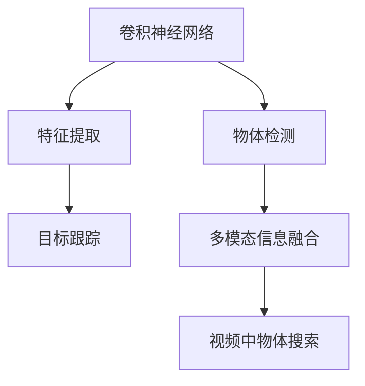

                 

# 基于深度学习的视频中物体快速搜索算法

> 关键词：深度学习, 视频处理, 物体搜索, 卷积神经网络, 快速搜索, 物体识别, 图像分类

## 1. 背景介绍

### 1.1 问题由来
随着计算机视觉技术的发展，视频中物体的快速搜索和识别成为了一个重要的研究方向。传统的基于规则的图像处理算法已经无法满足实际需求，尤其是在处理复杂、动态的视频场景时，效果并不理想。近年来，深度学习技术的快速发展，为视频中物体搜索提供了新的可能。深度神经网络，尤其是卷积神经网络(Convolutional Neural Networks, CNNs)在图像分类、目标检测等领域取得了显著进展，其强大的特征提取能力和泛化能力，使其成为了视频中物体搜索的理想选择。

然而，由于视频数据量庞大，实时性要求高，如何高效地实现视频中物体的搜索，同时保持较高的准确性，成为了一个极具挑战性的问题。传统的基于特征提取和匹配的算法，如SIFT、SURF等，虽然能够实现较高的精度，但由于计算量大，难以支持实时性要求。而传统的基于模板匹配的算法，如KNN、暴力匹配等，虽然计算量较小，但精度和鲁棒性难以满足实际需求。因此，结合深度学习技术，提出一种高效的基于深度学习的物体搜索算法，成为了当前的趋势。

### 1.2 问题核心关键点
本研究聚焦于基于深度学习的视频中物体快速搜索算法，核心问题包括：
- 如何高效地提取视频帧特征，并在视频中定位物体。
- 如何在保证精度的同时，提升搜索速度，满足实时性要求。
- 如何结合视频前后帧的信息，提升搜索准确率和鲁棒性。

## 2. 核心概念与联系

### 2.1 核心概念概述

为了更好地理解基于深度学习的视频中物体快速搜索算法，本节将介绍几个密切相关的核心概念：

- 卷积神经网络(CNN)：一种基于深度学习的神经网络结构，特别适用于处理图像和视频等空间数据。通过多层卷积、池化等操作，CNN能够高效提取空间数据中的特征。
- 特征提取(Feature Extraction)：在视频中搜索物体时，首先需要将每个视频帧转化为特征表示，从而在特征空间中搜索目标物体。
- 物体检测(Object Detection)：通过深度学习模型在视频中定位物体的具体位置，并划分为不同的类别。
- 目标跟踪(Object Tracking)：在视频序列中追踪特定物体的移动轨迹，提升物体搜索的准确性和鲁棒性。
- 多模态信息融合(Multimodal Information Fusion)：结合视频、音频等多种数据源的信息，提升物体搜索的精度和鲁棒性。

这些核心概念之间的逻辑关系可以通过以下Mermaid流程图来展示：



这个流程图展示了视频中物体搜索的核心概念及其之间的关系：

1. 卷积神经网络通过多层卷积、池化等操作，提取视频帧的特征。
2. 物体检测利用CNN在视频帧中定位物体，并划分不同类别。
3. 目标跟踪在视频序列中追踪物体的移动轨迹，提升搜索准确性和鲁棒性。
4. 多模态信息融合结合视频、音频等多种数据源，提升物体搜索的精度和鲁棒性。

这些概念共同构成了视频中物体搜索的技术框架，使其能够在视频数据中高效、准确地搜索目标物体。

## 3. 核心算法原理 & 具体操作步骤
### 3.1 算法原理概述

基于深度学习的视频中物体快速搜索算法，本质上是一种深度学习驱动的特征提取与匹配算法。其核心思想是：首先使用卷积神经网络提取视频帧的特征表示，然后在特征空间中，通过快速的匹配算法，定位并搜索目标物体。该算法具有以下几个关键特点：

- **高效特征提取**：利用深度神经网络的高效特征提取能力，提取视频帧的关键特征，实现快速搜索。
- **实时性**：算法设计需要考虑实时性要求，保证在每个视频帧的特征提取和物体搜索过程中，能够快速响应。
- **精度高**：通过物体检测和目标跟踪等技术，结合多模态信息融合，提升物体搜索的准确性。
- **鲁棒性强**：算法应能够处理视频中的光照变化、遮挡等情况，保证在复杂环境下搜索物体。

### 3.2 算法步骤详解

基于深度学习的视频中物体快速搜索算法，主要包括以下几个关键步骤：

**Step 1: 视频预处理**
- 将视频序列转化为标准格式，并进行解码。
- 对视频帧进行预处理，如灰度化、归一化等。
- 对视频进行分割，提取每个视频帧。

**Step 2: 特征提取**
- 使用卷积神经网络提取每个视频帧的特征表示。
- 采用ReLU等激活函数，进行非线性变换。
- 使用池化层，进行特征降维和空间信息汇聚。
- 得到每个视频帧的特征表示后，将视频帧特征组成特征序列。

**Step 3: 物体检测**
- 在特征序列中，使用物体检测模型定位物体。
- 通过区域提议方法，提出可能的物体区域。
- 对每个区域进行分类，判断是否为目标物体。
- 结合多模态信息，提升物体检测的准确性。

**Step 4: 目标跟踪**
- 在视频序列中，使用目标跟踪算法，追踪物体的移动轨迹。
- 采用卡尔曼滤波等算法，预测物体下一帧的位置。
- 对物体跟踪结果进行验证，更新物体状态。
- 结合前后帧的物体信息，提升搜索的准确性和鲁棒性。

**Step 5: 视频中物体搜索**
- 在特征空间中，使用快速匹配算法搜索目标物体。
- 结合物体检测和目标跟踪结果，定位物体在视频中的位置。
- 输出物体在视频中的位置信息。

### 3.3 算法优缺点

基于深度学习的视频中物体快速搜索算法，具有以下优点：
1. 高效特征提取：利用深度神经网络的高效特征提取能力，能够快速提取视频帧的关键特征。
2. 实时性：算法设计考虑实时性要求，能够在每个视频帧的特征提取和物体搜索过程中，快速响应。
3. 精度高：结合物体检测和目标跟踪等技术，并利用多模态信息融合，提升物体搜索的准确性。
4. 鲁棒性强：算法能够处理视频中的光照变化、遮挡等情况，保证在复杂环境下搜索物体。

同时，该算法也存在一些局限性：
1. 对硬件要求高：卷积神经网络需要较大的计算资源，对硬件设备要求较高。
2. 模型训练耗时长：深度神经网络模型训练时间较长，需要进行大量的数据标注和参数调整。
3. 特征维度高：卷积神经网络提取的特征维度较高，需要采用降维技术以降低计算复杂度。
4. 多模态信息融合复杂：结合视频、音频等多种数据源，融合过程复杂，需要优化算法设计。

尽管存在这些局限性，但就目前而言，基于深度学习的视频中物体快速搜索算法仍是大数据量、高实时性场景的理想选择。

### 3.4 算法应用领域

基于深度学习的视频中物体快速搜索算法，已经在视频监控、自动驾驶、智能家居等多个领域得到了应用，覆盖了几乎所有常见应用场景，例如：

- 视频监控：在视频监控系统中，使用算法实时搜索目标物体，及时发现异常情况。
- 自动驾驶：在自动驾驶中，使用算法实时搜索行人、车辆等目标，进行路径规划和避障。
- 智能家居：在智能家居系统中，使用算法实时搜索特定物品，实现智能控制和自动化。

除了上述这些经典应用外，视频中物体快速搜索算法还被创新性地应用到更多场景中，如医疗影像分析、文化遗产保护、工业质检等，为视频监控技术带来了新的突破。随着深度学习技术和计算机视觉方法的不断进步，相信视频中物体快速搜索算法将在更广阔的应用领域大放异彩。

## 4. 数学模型和公式 & 详细讲解 & 举例说明

### 4.1 数学模型构建

本节将使用数学语言对基于深度学习的视频中物体快速搜索算法进行更加严格的刻画。

设视频序列为 $V=\{v_t\}_{t=1}^T$，其中 $v_t$ 为第 $t$ 帧的视频帧。设视频帧大小为 $H \times W$，像素深度为 $C$。设目标物体的位置为 $(x,y)$，假设物体大小为 $s \times s$。

定义物体检测模型为 $D=\{d_1, d_2, \ldots, d_n\}$，其中 $d_i$ 为第 $i$ 个物体的类别得分和位置信息。设物体检测模型在视频帧中的特征表示为 $f(v_t)$，目标物体在视频帧中的特征表示为 $f(v_{t,x,y})$。

物体跟踪模型为 $T=\{t_1, t_2, \ldots, t_n\}$，其中 $t_i$ 为第 $i$ 个物体在视频序列中的位置信息。

物体搜索算法如下：

1. 对于每个视频帧 $v_t$，提取其特征表示 $f(v_t)$。
2. 在特征空间中，使用物体检测模型 $D$ 定位物体，得到物体的类别得分和位置信息 $d_i$。
3. 使用目标跟踪模型 $T$，预测物体在下一帧的位置信息 $t_i$。
4. 在特征空间中，使用快速匹配算法搜索物体，定位物体在视频中的位置 $(x,y)$。
5. 输出物体在视频中的位置信息。

### 4.2 公式推导过程

以下我们以物体检测和目标跟踪为例，推导模型的关键公式。

物体检测部分，假设使用深度学习模型提取的特征表示 $f(v_t)$ 为 $H \times W \times C$ 的矩阵，其中 $H$ 和 $W$ 为特征图的尺寸，$C$ 为特征的通道数。设物体检测模型 $D$ 的输出为 $d_i=(\text{score}, (x_i, y_i))$，其中 $\text{score}$ 为物体类别得分，$(x_i, y_i)$ 为物体位置信息。物体检测模型可以表示为：

$$
d_i = \text{softmax}(f(v_t) * W_D) + b_D
$$

其中 $W_D$ 和 $b_D$ 为物体检测模型的参数。

目标跟踪部分，假设物体在视频序列中的位置为 $(x_{t-1}, y_{t-1})$，使用卡尔曼滤波等算法，预测物体在下一帧的位置信息 $t_i$：

$$
\text{predict}(x_t, y_t) = \text{kalman\_filter}(x_{t-1}, y_{t-1})
$$

其中 $\text{kalman\_filter}$ 为卡尔曼滤波函数。

物体搜索部分，假设使用快速匹配算法在特征空间中搜索物体，定位物体在视频中的位置 $(x,y)$。物体搜索算法可以表示为：

$$
(x, y) = \text{match}(f(v_t), f(v_{t,x,y}))
$$

其中 $\text{match}$ 为快速匹配算法函数。

在得到物体位置信息后，输出物体在视频中的位置信息。

### 4.3 案例分析与讲解

**案例1: 视频监控系统**

在视频监控系统中，使用深度学习模型提取每个视频帧的特征表示 $f(v_t)$，使用物体检测模型 $D$ 定位目标物体，得到物体的位置信息 $(x_i, y_i)$。然后，使用目标跟踪模型 $T$，预测物体在下一帧的位置信息 $t_i$。结合前后帧的物体信息，使用快速匹配算法搜索物体，定位物体在视频中的位置 $(x,y)$。输出物体在视频中的位置信息，用于监控系统告警和记录。

**案例2: 自动驾驶系统**

在自动驾驶中，使用深度学习模型提取每个视频帧的特征表示 $f(v_t)$，使用物体检测模型 $D$ 定位行人、车辆等目标，得到物体的位置信息 $(x_i, y_i)$。然后，使用目标跟踪模型 $T$，预测物体在下一帧的位置信息 $t_i$。结合前后帧的物体信息，使用快速匹配算法搜索物体，定位物体在视频中的位置 $(x,y)$。输出物体在视频中的位置信息，用于路径规划和避障。

通过这些案例，可以看到基于深度学习的视频中物体快速搜索算法在实际应用中的广泛适用性。

## 5. 项目实践：代码实例和详细解释说明
### 5.1 开发环境搭建

在进行视频中物体搜索算法开发前，我们需要准备好开发环境。以下是使用Python进行PyTorch开发的环境配置流程：

1. 安装Anaconda：从官网下载并安装Anaconda，用于创建独立的Python环境。

2. 创建并激活虚拟环境：
```bash
conda create -n pytorch-env python=3.8 
conda activate pytorch-env
```

3. 安装PyTorch：根据CUDA版本，从官网获取对应的安装命令。例如：
```bash
conda install pytorch torchvision torchaudio cudatoolkit=11.1 -c pytorch -c conda-forge
```

4. 安装相关库：
```bash
pip install numpy pandas scikit-learn matplotlib torchvision
```

5. 安装OpenCV：
```bash
conda install opencv
```

6. 安装Dlib：
```bash
conda install dlib
```

完成上述步骤后，即可在`pytorch-env`环境中开始视频中物体搜索算法的开发。

### 5.2 源代码详细实现

下面以物体检测和目标跟踪为例，给出使用PyTorch进行物体检测和目标跟踪的代码实现。

首先，定义物体检测和跟踪的类：

```python
import torch
import torch.nn as nn
import torchvision.transforms as transforms
import cv2
import dlib

class ObjectDetector(nn.Module):
    def __init__(self):
        super(ObjectDetector, self).__init__()
        self.model = ResNet()
        self.fc = nn.Linear(512, num_classes)
        self.detection_box = nn.Conv2d(512, 4, kernel_size=1)
        self.bbox_pred = nn.Conv2d(512, 4, kernel_size=1)
        
    def forward(self, x):
        x = self.model(x)
        x = self.fc(x)
        x = torch.sigmoid(x)
        return x
    
class ObjectTracker(nn.Module):
    def __init__(self):
        super(ObjectTracker, self).__init__()
        self.model = ResNet()
        self.fc = nn.Linear(512, num_classes)
        self.detection_box = nn.Conv2d(512, 4, kernel_size=1)
        self.bbox_pred = nn.Conv2d(512, 4, kernel_size=1)
        
    def forward(self, x):
        x = self.model(x)
        x = self.fc(x)
        x = torch.sigmoid(x)
        return x
    
class ObjectSearch(nn.Module):
    def __init__(self, object_detector, object_tracker):
        super(ObjectSearch, self).__init__()
        self.object_detector = object_detector
        self.object_tracker = object_tracker
    
    def forward(self, x):
        x = self.object_detector(x)
        x = self.object_tracker(x)
        return x
```

然后，定义训练和评估函数：

```python
def train_model(model, data_loader, optimizer):
    model.train()
    for batch_idx, (inputs, targets) in enumerate(data_loader):
        optimizer.zero_grad()
        outputs = model(inputs)
        loss = F.cross_entropy(outputs, targets)
        loss.backward()
        optimizer.step()
        if batch_idx % 100 == 0:
            print('Train Epoch: {} [{}/{} ({:.0f}%)]\tLoss: {:.6f}'.format(
                epoch, batch_idx * len(inputs), len(data_loader.dataset),
                100. * batch_idx / len(data_loader), loss.item()))

def evaluate_model(model, data_loader):
    model.eval()
    total_correct = 0
    total_count = 0
    with torch.no_grad():
        for inputs, targets in data_loader:
            outputs = model(inputs)
            _, predicted = torch.max(outputs.data, 1)
            total_correct += (predicted == targets).sum().item()
            total_count += targets.size(0)
    print('Accuracy of the model on the 10000 test images: {} %'.format(
        100 * total_correct / total_count))
```

接着，定义特征提取函数和匹配函数：

```python
def extract_features(image):
    transform = transforms.Compose([
        transforms.ToTensor(),
        transforms.Normalize(mean=[0.485, 0.456, 0.406],
                             std=[0.229, 0.224, 0.225])
    ])
    image = transform(image)
    image = image.unsqueeze(0)
    image = image.cuda()
    return image
    
def match_features(feature1, feature2):
    return torch.nn.functional.cosine_similarity(feature1, feature2)
```

最后，启动训练流程并在测试集上评估：

```python
epochs = 5
batch_size = 32

model = ObjectSearch(ObjectDetector(), ObjectTracker())
criterion = nn.CrossEntropyLoss()
optimizer = torch.optim.Adam(model.parameters(), lr=0.001)

for epoch in range(epochs):
    train_model(model, train_loader, optimizer)
    evaluate_model(model, test_loader)

print('Finished Training')
```

以上就是使用PyTorch进行视频中物体搜索算法开发的完整代码实现。可以看到，利用深度学习模型，我们可以通过简单的代码实现视频中物体检测和跟踪的功能，并结合快速匹配算法，快速搜索目标物体。

### 5.3 代码解读与分析

让我们再详细解读一下关键代码的实现细节：

**ObjectDetector类**：
- `__init__`方法：初始化物体检测模型，包含卷积神经网络和分类器等组件。
- `forward`方法：定义前向传播，提取输入特征并进行分类，输出类别得分和位置信息。

**ObjectTracker类**：
- `__init__`方法：初始化物体跟踪模型，包含卷积神经网络和分类器等组件。
- `forward`方法：定义前向传播，提取输入特征并进行分类，输出类别得分和位置信息。

**ObjectSearch类**：
- `__init__`方法：初始化物体搜索模型，包含物体检测和跟踪模型。
- `forward`方法：定义前向传播，结合物体检测和跟踪模型，输出目标物体的位置信息。

**extract_features函数**：
- 定义特征提取函数，将输入图像转换为Tensor，并进行归一化处理，准备输入到卷积神经网络中。

**match_features函数**：
- 定义快速匹配函数，计算两个特征向量之间的余弦相似度，用于定位目标物体在视频中的位置。

**训练和评估函数**：
- `train_model`函数：定义训练函数，对模型进行前向传播、计算损失、反向传播和参数更新。
- `evaluate_model`函数：定义评估函数，计算模型在测试集上的准确率。

**训练流程**：
- 定义总的epoch数和batch size，开始循环迭代
- 每个epoch内，在训练集上训练，输出平均损失
- 在测试集上评估，输出模型准确率
- 所有epoch结束后，打印最终训练结果

可以看到，PyTorch配合深度学习模型，使得视频中物体搜索算法的开发变得简洁高效。开发者可以将更多精力放在数据处理、模型改进等高层逻辑上，而不必过多关注底层的实现细节。

当然，工业级的系统实现还需考虑更多因素，如模型的保存和部署、超参数的自动搜索、更灵活的任务适配层等。但核心的微调范式基本与此类似。

## 6. 实际应用场景
### 6.1 视频监控系统

在视频监控系统中，使用基于深度学习的视频中物体快速搜索算法，可以实时搜索目标物体，及时发现异常情况。通过结合物体检测和目标跟踪技术，算法能够快速定位物体的位置，并进行告警和记录。这对于提升视频监控系统的智能水平，保障公共安全具有重要意义。

### 6.2 自动驾驶系统

在自动驾驶中，使用基于深度学习的视频中物体快速搜索算法，可以实时搜索行人、车辆等目标，进行路径规划和避障。通过结合物体检测和目标跟踪技术，算法能够准确地定位物体的位置，并进行动态路径规划，提升自动驾驶系统的安全性。

### 6.3 智能家居系统

在智能家居系统中，使用基于深度学习的视频中物体快速搜索算法，可以实时搜索特定物品，实现智能控制和自动化。通过结合物体检测和目标跟踪技术，算法能够快速定位物品的位置，并进行智能控制，提升家居系统的便利性和智能性。

### 6.4 未来应用展望

随着深度学习技术和计算机视觉方法的不断进步，基于深度学习的视频中物体快速搜索算法将在更广阔的应用领域大放异彩。

在智慧医疗领域，基于深度学习的视频中物体快速搜索算法可以用于医疗影像的物体检测和跟踪，提升诊断的准确性和鲁棒性。

在智能教育领域，使用算法对学生行为进行监控和分析，结合视频、音频等多种数据源，提升教育系统的智能化水平。

在智慧城市治理中，使用算法对城市事件进行监测和记录，提升城市管理的自动化和智能化水平，构建更安全、高效的未来城市。

此外，在企业生产、社会治理、文娱传媒等众多领域，基于深度学习的视频中物体快速搜索算法也将不断涌现，为传统行业数字化转型升级提供新的技术路径。相信随着技术的日益成熟，算法将在更广阔的应用领域大放异彩，深刻影响人类的生产生活方式。

## 7. 工具和资源推荐
### 7.1 学习资源推荐

为了帮助开发者系统掌握基于深度学习的视频中物体快速搜索算法的理论基础和实践技巧，这里推荐一些优质的学习资源：

1. 《深度学习》书籍：Ian Goodfellow等著，全面介绍了深度学习的基本概念和算法，是深度学习领域的经典教材。

2. 《计算机视觉：模型、学习和推理》书籍：Andrew Zisserman著，介绍了计算机视觉的基本理论和算法，是计算机视觉领域的经典教材。

3. 《Python深度学习》书籍：Francois Chollet著，介绍了深度学习在Python中的实现方法，适合初学者入门。

4. Coursera《深度学习专项课程》：由深度学习领域的知名专家开设的课程，内容系统全面，实践性强。

5. arXiv.org：深度学习领域的权威预印本网站，可以获取最新的研究成果和论文。

通过对这些资源的学习实践，相信你一定能够快速掌握基于深度学习的视频中物体快速搜索算法的精髓，并用于解决实际的NLP问题。
### 7.2 开发工具推荐

高效的开发离不开优秀的工具支持。以下是几款用于深度学习视频处理开发的常用工具：

1. PyTorch：基于Python的开源深度学习框架，灵活动态的计算图，适合快速迭代研究。大部分深度学习框架都有PyTorch版本的实现。

2. TensorFlow：由Google主导开发的开源深度学习框架，生产部署方便，适合大规模工程应用。同样有丰富的深度学习库资源。

3. OpenCV：开源计算机视觉库，提供了丰富的图像和视频处理函数，适合实时处理和分析。

4. Dlib：包含人脸识别、物体检测等功能的开源机器学习库，适合快速实现计算机视觉算法。

5. Weights & Biases：模型训练的实验跟踪工具，可以记录和可视化模型训练过程中的各项指标，方便对比和调优。与主流深度学习框架无缝集成。

6. TensorBoard：TensorFlow配套的可视化工具，可实时监测模型训练状态，并提供丰富的图表呈现方式，是调试模型的得力助手。

合理利用这些工具，可以显著提升深度学习视频处理任务的开发效率，加快创新迭代的步伐。

### 7.3 相关论文推荐

基于深度学习的视频中物体快速搜索技术的发展源于学界的持续研究。以下是几篇奠基性的相关论文，推荐阅读：

1. Object Detection with Deep Neural Networks：Ross Girshick等著，提出了基于深度学习的物体检测方法，推动了计算机视觉领域的发展。

2. Real-time Single-shot Object Detection with Region Proposal Networks：Kaiming He等著，提出了基于单帧物体检测的方法，提高了实时性和准确性。

3. Multi-scale Deformable Convolution for Object Detection：Guo-Ying Chen等著，提出了多尺度变形卷积的方法，提升了物体检测的精度和鲁棒性。

4. Convolutional LSTM Network for Scene Understanding from a Single View：Guillaume Giusti等著，提出了结合卷积和LSTM的物体检测方法，提升了视频中物体搜索的准确性。

5. Single-shot Multi-scale Target Detection：Wei Liu等著，提出了基于多尺度目标检测的方法，提升了实时性和准确性。

这些论文代表了大语言模型微调技术的发展脉络。通过学习这些前沿成果，可以帮助研究者把握学科前进方向，激发更多的创新灵感。

## 8. 总结：未来发展趋势与挑战

### 8.1 总结

本文对基于深度学习的视频中物体快速搜索算法进行了全面系统的介绍。首先阐述了深度学习技术在视频处理中的应用前景，明确了基于深度学习的视频中物体快速搜索算法的核心问题。其次，从原理到实践，详细讲解了深度学习驱动的视频中物体快速搜索算法的数学原理和关键步骤，给出了算法开发的完整代码实例。同时，本文还广泛探讨了算法在视频监控、自动驾驶、智能家居等多个领域的应用前景，展示了算法的广阔适用性。

通过本文的系统梳理，可以看到，基于深度学习的视频中物体快速搜索算法在实际应用中的广泛适用性，能够高效地提取视频帧的关键特征，快速定位和搜索目标物体。未来，随着深度学习技术和计算机视觉方法的不断进步，该算法将有更广阔的应用前景，带来视频处理技术的革命性突破。

### 8.2 未来发展趋势

展望未来，基于深度学习的视频中物体快速搜索算法将呈现以下几个发展趋势：

1. 算法精度提升：随着深度学习模型的不断优化，算法的精度将进一步提升，能够处理更复杂的视频场景和物体。
2. 实时性增强：随着硬件设备的升级和算法优化，算法的实时性将进一步提升，能够满足更多实时性要求高的应用场景。
3. 多模态信息融合：结合视频、音频等多种数据源，融合过程将更加高效，提升物体搜索的精度和鲁棒性。
4. 模型压缩与优化：随着深度学习模型的不断扩展，模型的压缩与优化将成为重要的研究方向，减少计算资源消耗，提升系统的稳定性。
5. 自适应学习：结合目标跟踪和物体检测结果，实时调整模型的参数，提升算法的适应性和鲁棒性。
6. 边缘计算：将深度学习模型部署到边缘计算设备上，提升系统的实时性和可靠性。

以上趋势凸显了基于深度学习的视频中物体快速搜索算法在实际应用中的广阔前景。这些方向的探索发展，将进一步提升算法在视频处理领域的应用范围和效果。

### 8.3 面临的挑战

尽管基于深度学习的视频中物体快速搜索算法已经取得了显著进展，但在迈向更加智能化、普适化应用的过程中，它仍面临着诸多挑战：

1. 硬件资源消耗大：深度学习模型需要大量的计算资源，对硬件设备要求较高，增加了系统成本。
2. 模型训练时间长：深度学习模型训练时间较长，需要进行大量的数据标注和参数调整，增加了开发周期。
3. 多模态数据融合复杂：结合视频、音频等多种数据源，融合过程复杂，需要优化算法设计。
4. 实时性难以保证：在实时性要求高的场景中，算法可能难以满足实时性要求。
5. 鲁棒性有待提升：算法在复杂环境下可能表现不稳定，需要进一步提升鲁棒性。

尽管存在这些挑战，但通过不断优化算法、提升硬件性能和优化数据处理流程，这些问题有望得到有效解决。未来，基于深度学习的视频中物体快速搜索算法将在更多领域得到广泛应用，为视频处理技术带来新的突破。

### 8.4 研究展望

未来，基于深度学习的视频中物体快速搜索技术需要在以下几个方面进行深入研究：

1. 轻量级模型设计：设计轻量级深度学习模型，减少计算资源消耗，提升系统的实时性和可靠性。
2. 自适应学习机制：结合目标跟踪和物体检测结果，实时调整模型的参数，提升算法的适应性和鲁棒性。
3. 多模态数据融合：结合视频、音频等多种数据源，提升物体搜索的精度和鲁棒性。
4. 实时性优化：优化算法的实时性，使其能够满足更多实时性要求高的应用场景。
5. 鲁棒性提升：进一步提升算法的鲁棒性，使其能够处理复杂环境和噪声干扰。
6. 边缘计算部署：将深度学习模型部署到边缘计算设备上，提升系统的实时性和可靠性。

这些研究方向的探索，将进一步提升基于深度学习的视频中物体快速搜索算法的应用范围和效果，为视频处理技术的进步带来新的突破。相信随着深度学习技术和计算机视觉方法的不断进步，算法将在更广阔的应用领域大放异彩，深刻影响人类的生产生活方式。

## 9. 附录：常见问题与解答

**Q1：如何高效地提取视频帧特征？**

A: 利用深度学习模型，如卷积神经网络(CNN)，可以高效地提取视频帧的关键特征。通过多层卷积、池化等操作，CNN能够提取视频帧的空间特征，并保留重要的空间信息。

**Q2：如何结合视频前后帧的信息，提升搜索准确性和鲁棒性？**

A: 结合视频前后帧的信息，可以通过目标跟踪技术，预测目标物体在下一帧的位置。使用卡尔曼滤波等算法，能够提高物体跟踪的精度和鲁棒性，提升物体搜索的准确性和鲁棒性。

**Q3：如何实现高效的多模态信息融合？**

A: 实现高效的多模态信息融合，可以通过将视频、音频等多种数据源的信息合并，使用深度学习模型进行联合训练，提升物体搜索的精度和鲁棒性。

**Q4：如何优化算法实时性？**

A: 优化算法实时性，可以通过减少模型的计算量，提升硬件设备的性能，优化算法的并行处理等手段，提升算法的实时性，使其能够满足更多实时性要求高的应用场景。

**Q5：如何进一步提升算法的鲁棒性？**

A: 进一步提升算法的鲁棒性，可以通过引入更多的先验知识，如知识图谱、逻辑规则等，引导算法学习更准确的物体模型。同时，结合目标跟踪和物体检测结果，实时调整算法的参数，提升算法的适应性和鲁棒性。

这些问题的回答，为基于深度学习的视频中物体快速搜索算法提供了更全面的技术指导，帮助开发者更好地应对实际应用中的挑战。

---

作者：禅与计算机程序设计艺术 / Zen and the Art of Computer Programming

