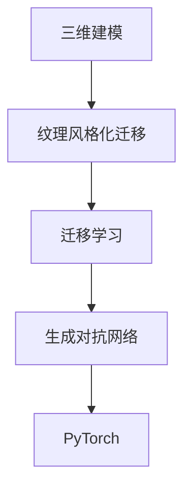

                 

# 基于生成对抗网络的三维建模纹理风格化迁移技术

> 关键词：生成对抗网络,三维建模,纹理风格化,迁移学习,PyTorch

## 1. 背景介绍

### 1.1 问题由来

近年来，随着计算机图形学和深度学习技术的飞速发展，三维建模技术得到了广泛应用。三维建模不仅在虚拟现实(VR)、增强现实(AR)、电影特效等应用中发挥了重要作用，还在建筑、医疗、教育等多个领域展现出巨大潜力。然而，高质量的三维建模往往需要大量的人力和时间，成本较高，难以大规模普及。为了提高三维建模的效率，研究者们提出了迁移学习、生成对抗网络(GAN)等技术。

其中，基于GAN的三维建模纹理风格化迁移技术，通过对已有的高质量三维模型进行迁移学习，使模型能够自动生成风格化纹理，实现快速高效的三维建模。该技术能够大幅度降低建模成本，提升建模效率，具有广泛的应用前景。

### 1.2 问题核心关键点

本节将介绍基于生成对抗网络的三维建模纹理风格化迁移技术的关键点，包括：

- 生成对抗网络(GAN)原理及其在三维建模中的应用
- 纹理风格化迁移技术的基本流程和算法步骤
- 该技术在实际应用中的优缺点
- 主要的应用领域及其未来发展趋势

### 1.3 问题研究意义

基于生成对抗网络的三维建模纹理风格化迁移技术，能够显著提高三维建模的效率和质量，降低建模成本，在多个领域具有重要的应用价值：

1. **虚拟现实和增强现实**：通过迁移学习生成风格化纹理，可以大幅降低建模时间和成本，使虚拟场景更加逼真，提升用户体验。
2. **建筑设计和模拟**：可以快速生成建筑物的各种风格化模型，帮助设计师和建筑师进行设计和模拟。
3. **医疗领域**：用于人体解剖、器官模型等高精度建模，提升医学教育和研究水平。
4. **教育和培训**：快速生成各类教育模型和虚拟教室，提高教育培训的沉浸感和互动性。

通过学习这项技术，能够快速掌握高效的三维建模方法，促进相关领域的技术发展和产业应用。

## 2. 核心概念与联系

### 2.1 核心概念概述

为了更好地理解基于生成对抗网络的三维建模纹理风格化迁移技术，本节将介绍几个关键概念：

- **生成对抗网络(GAN)**：一种通过对抗训练生成高质量图像、视频、音频等媒体内容的技术。由一个生成器(Generator)和一个判别器(Discriminator)组成，两者交替训练，使得生成器能够生成逼真的样本，判别器能够准确区分真实样本和生成样本。
- **三维建模**：通过计算机生成三维空间中的模型，可以用于渲染、游戏、虚拟现实、医学等多个领域。
- **纹理风格化迁移**：通过迁移学习技术，将一个纹理风格应用于另一个三维模型，实现快速高效的风格化建模。
- **迁移学习**：通过在已有任务上训练好的模型，迁移到新的任务上，提升新任务的性能。
- **PyTorch**：一种基于Python的深度学习框架，支持动态图和静态图计算，适合开发复杂的三维建模和风格化迁移应用。

这些核心概念之间的逻辑关系可以通过以下Mermaid流程图来展示：



该流程图展示了三维建模、纹理风格化迁移、迁移学习、生成对抗网络和PyTorch之间的逻辑联系，通过生成对抗网络和迁移学习技术，可以在三维建模中实现快速高效的风格化迁移。

## 3. 核心算法原理 & 具体操作步骤
### 3.1 算法原理概述

基于生成对抗网络的三维建模纹理风格化迁移技术，主要利用生成对抗网络进行纹理风格化的迁移，其核心思想是：通过生成对抗网络训练，使生成器能够生成风格化的纹理，将生成器应用于目标三维模型上，实现纹理风格的迁移。

### 3.2 算法步骤详解

本节将详细介绍基于生成对抗网络的三维建模纹理风格化迁移技术的算法步骤：

**Step 1: 准备数据集**

- 收集具有风格化纹理的三维模型数据集 $D_G$，作为生成器的训练数据。
- 收集目标三维模型数据集 $D_T$，作为迁移学习的数据集。

**Step 2: 生成器网络设计**

- 设计生成器网络，使用PyTorch等深度学习框架，选择合适的网络结构。
- 使用随机噪声作为输入，生成高分辨率的纹理图像。

**Step 3: 判别器网络设计**

- 设计判别器网络，用于判断输入样本的真实性和风格性。
- 输入样本可以是真实纹理图像或生成器生成的纹理图像。

**Step 4: 训练生成器和判别器**

- 使用生成器和判别器交替训练的方式，生成器尝试欺骗判别器，生成逼真的纹理图像。
- 判别器尝试区分真实纹理图像和生成器生成的纹理图像。
- 通过最大化生成器的损失和最大化判别器的损失，训练生成器和判别器。

**Step 5: 迁移学习**

- 将训练好的生成器应用于目标三维模型上，生成风格化的纹理。
- 对生成的纹理进行后处理，确保纹理的逼真度和风格性。

### 3.3 算法优缺点

**优点：**
1. **高效性**：通过生成对抗网络进行迁移学习，可以快速生成高质量的纹理，显著提高建模效率。
2. **灵活性**：可以应用于多种风格化需求，适应不同的纹理风格。
3. **可扩展性**：可以与其他三维建模技术结合，形成更加复杂的三维建模系统。

**缺点：**
1. **训练难度高**：生成对抗网络需要大量计算资源和训练时间，存在训练难度大的问题。
2. **结果稳定性**：生成器的输出可能存在一定的随机性，导致迁移学习的结果不够稳定。
3. **数据需求高**：需要大量高质量的风格化纹理和目标三维模型数据，数据需求较大。

### 3.4 算法应用领域

基于生成对抗网络的三维建模纹理风格化迁移技术，主要应用于以下几个领域：

1. **游戏开发**：在游戏开发中，可以快速生成逼真的纹理和模型，提高游戏渲染和互动效果。
2. **虚拟现实和增强现实**：用于生成逼真的虚拟场景和交互式对象，提升用户体验。
3. **影视特效**：用于生成逼真的物体和场景，提高电影和电视特效的真实感和视觉冲击力。
4. **建筑设计和模拟**：快速生成建筑物的各种风格化模型，帮助设计师和建筑师进行设计和模拟。

## 4. 数学模型和公式 & 详细讲解
### 4.1 数学模型构建

本节将使用数学语言对基于生成对抗网络的三维建模纹理风格化迁移过程进行更加严格的刻画。

假设三维模型表示为 $M = (V, E, F)$，其中 $V$ 表示顶点集合，$E$ 表示边集合，$F$ 表示面集合。设 $T$ 表示纹理映射，$T = T_{text} \times T_{color}$，其中 $T_{text}$ 表示纹理坐标映射，$T_{color}$ 表示颜色映射。

生成器 $G$ 的输入为随机噪声 $z$，输出为纹理图像 $T_G$，判别器 $D$ 的输入为纹理图像 $T_G$ 或 $T$，输出为真实性和风格性的判断结果。

生成器的损失函数为 $L_G = E[D(T_G)]$，判别器的损失函数为 $L_D = E[\log D(T)] + E[\log (1-D(T_G))]$，总损失函数为 $L = L_G + \lambda L_D$，其中 $\lambda$ 为平衡生成器和判别器的系数。

### 4.2 公式推导过程

根据上述模型定义和损失函数，我们可以推导出生成器和判别器的训练公式。

**生成器训练公式**：

$$
\min_G \mathbb{E}_{z \sim p(z)} [L_G] = \min_G \mathbb{E}_{z \sim p(z)} [\log D(G(z))]
$$

**判别器训练公式**：

$$
\min_D \mathbb{E}_{x \sim p(x)} [\log D(x)] + \mathbb{E}_{z \sim p(z)} [\log (1-D(G(z)))]
$$

在训练过程中，生成器和判别器交替优化，生成器希望最大化判别器的损失，判别器希望最大化生成器的损失和真实样本的损失。通过不断的对抗训练，生成器逐渐生成逼真的纹理图像，判别器逐渐准确地区分真实和生成的样本。

### 4.3 案例分析与讲解

为了更好地理解基于生成对抗网络的三维建模纹理风格化迁移技术，我们以一个具体的案例进行分析：

**案例：** 生成逼真的木纹纹理，应用于建筑模型。

**步骤**：

1. 收集大量的木纹纹理作为生成器的训练数据。
2. 设计生成器网络，使用卷积神经网络(CNN)生成木纹纹理。
3. 设计判别器网络，使用卷积神经网络(CNN)判断纹理图像的真实性和风格性。
4. 交替训练生成器和判别器，优化生成器损失和判别器损失。
5. 将训练好的生成器应用于建筑模型，生成逼真的木纹纹理。
6. 对生成的纹理进行后处理，确保纹理的逼真度和风格性。

通过这个案例，可以看到基于生成对抗网络的三维建模纹理风格化迁移技术的实际应用过程。

## 5. 项目实践：代码实例和详细解释说明
### 5.1 开发环境搭建

在进行三维建模纹理风格化迁移实践前，我们需要准备好开发环境。以下是使用Python进行PyTorch开发的环境配置流程：

1. 安装Anaconda：从官网下载并安装Anaconda，用于创建独立的Python环境。

2. 创建并激活虚拟环境：
```bash
conda create -n pytorch-env python=3.8 
conda activate pytorch-env
```

3. 安装PyTorch：根据CUDA版本，从官网获取对应的安装命令。例如：
```bash
conda install pytorch torchvision torchaudio cudatoolkit=11.1 -c pytorch -c conda-forge
```

4. 安装其他必要的库：
```bash
pip install matplotlib numpy scikit-learn
```

完成上述步骤后，即可在`pytorch-env`环境中开始开发。

### 5.2 源代码详细实现

下面是一个基于生成对抗网络的三维建模纹理风格化迁移的PyTorch代码实现示例。

首先，定义生成器网络：

```python
import torch.nn as nn
import torch.nn.functional as F

class Generator(nn.Module):
    def __init__(self, input_dim, output_dim):
        super(Generator, self).__init__()
        self.encoder = nn.Sequential(
            nn.Conv2d(input_dim, 64, 4, stride=2, padding=1),
            nn.ReLU(),
            nn.Conv2d(64, 128, 4, stride=2, padding=1),
            nn.ReLU(),
            nn.Conv2d(128, 256, 4, stride=2, padding=1),
            nn.ReLU(),
            nn.Conv2d(256, output_dim, 4, stride=2, padding=1),
            nn.Tanh()
        )

    def forward(self, x):
        return self.encoder(x)
```

然后，定义判别器网络：

```python
class Discriminator(nn.Module):
    def __init__(self, input_dim, output_dim):
        super(Discriminator, self).__init__()
        self.encoder = nn.Sequential(
            nn.Conv2d(input_dim, 64, 4, stride=2, padding=1),
            nn.LeakyReLU(0.2),
            nn.Conv2d(64, 128, 4, stride=2, padding=1),
            nn.LeakyReLU(0.2),
            nn.Conv2d(128, 256, 4, stride=2, padding=1),
            nn.LeakyReLU(0.2),
            nn.Conv2d(256, output_dim, 4, stride=2, padding=1),
            nn.Sigmoid()
        )

    def forward(self, x):
        return self.encoder(x)
```

接着，定义损失函数：

```python
class Loss(nn.Module):
    def __init__(self):
        super(Loss, self).__init__()
        self.bce = nn.BCELoss()

    def forward(self, D_real, D_fake):
        real_loss = self.bce(D_real, torch.ones_like(D_real))
        fake_loss = self.bce(D_fake, torch.zeros_like(D_fake))
        return real_loss + fake_loss
```

最后，定义训练函数：

```python
import torch.optim as optim
import torch

def train(generator, discriminator, data_loader, epochs, batch_size, learning_rate):
    device = torch.device("cuda" if torch.cuda.is_available() else "cpu")
    generator.to(device)
    discriminator.to(device)

    criterion = Loss()
    gen_optimizer = optim.Adam(generator.parameters(), lr=learning_rate)
    dis_optimizer = optim.Adam(discriminator.parameters(), lr=learning_rate)

    for epoch in range(epochs):
        for i, (real_images, _) in enumerate(data_loader):
            real_images = real_images.to(device)
            batch_size = real_images.size(0)

            gen_optimizer.zero_grad()
            dis_optimizer.zero_grad()

            # Adversarial ground truths:
            real_labels = torch.ones(batch_size, 1).to(device)
            fake_labels = torch.zeros(batch_size, 1).to(device)

            # ---------------------
            #  Train Generator
            # ---------------------
            fake_images = generator(real_images)
            g_loss = criterion(discriminator(fake_images), real_labels)

            # ---------------------
            #  Train Discriminator
            # ---------------------
            real_output = discriminator(real_images)
            fake_output = discriminator(fake_images)
            d_loss_real = criterion(real_output, real_labels)
            d_loss_fake = criterion(fake_output, fake_labels)
            d_loss = d_loss_real + d_loss_fake

            g_loss.backward()
            d_loss.backward()

            gen_optimizer.step()
            dis_optimizer.step()

            batches_done = epoch * len(data_loader) + i

            if batches_done % 500 == 0:
                print("[Epoch %d/%d] [Batch %d/%d] [D loss: %f] [G loss: %f]" % (
                    epoch, epochs, i, len(data_loader), d_loss.item(), g_loss.item()))

    return generator
```

完整的代码示例可以在PyTorch中运行，通过上述代码，即可实现基于生成对抗网络的三维建模纹理风格化迁移。

### 5.3 代码解读与分析

让我们再详细解读一下关键代码的实现细节：

**Generator类**：
- `__init__`方法：初始化生成器网络结构。
- `forward`方法：前向传播计算生成器的输出。

**Discriminator类**：
- `__init__`方法：初始化判别器网络结构。
- `forward`方法：前向传播计算判别器的输出。

**Loss类**：
- `__init__`方法：初始化损失函数。
- `forward`方法：前向传播计算判别器和生成器的损失。

**train函数**：
- 定义了训练循环，交替训练生成器和判别器。
- 使用Adam优化器进行参数优化，调整学习率。
- 在每个epoch中输出训练进度和损失值。

可以看到，通过PyTorch框架，我们能够快速实现生成对抗网络的三维建模纹理风格化迁移，代码结构清晰，易于理解和扩展。

## 6. 实际应用场景

### 6.1 游戏开发

在游戏开发中，三维建模的纹理风格化迁移可以用于生成逼真的纹理和模型，提高游戏的渲染和互动效果。通过迁移学习，可以快速生成高质量的纹理，减少游戏开发的成本和时间。

例如，在一个射击游戏中，开发者可以使用该技术生成逼真的地面、墙壁、道具等纹理，提升游戏的真实感和视觉体验。同时，还可以通过迁移学习，快速生成角色和武器的逼真纹理，增强游戏角色的细节和立体感。

### 6.2 虚拟现实和增强现实

在虚拟现实和增强现实中，三维建模的纹理风格化迁移可以用于生成逼真的虚拟场景和交互式对象，提升用户体验。例如，在一个虚拟会议中，可以通过迁移学习生成逼真的会议室、演讲台、投影仪等纹理，使虚拟会议更加真实和互动。

此外，在增强现实中，该技术可以用于生成逼真的虚拟物体和场景，增强用户的沉浸感和互动体验。例如，在一个虚拟购物平台中，可以使用该技术生成逼真的商品模型和展示柜，提升用户的购物体验。

### 6.3 影视特效

在影视特效中，三维建模的纹理风格化迁移可以用于生成逼真的物体和场景，提高电影和电视特效的真实感和视觉冲击力。例如，在一个科幻电影中，可以使用该技术生成逼真的外星生物、飞船、太空场景等纹理，增强电影的视觉震撼力。

此外，在动画制作中，该技术可以用于生成逼真的角色和场景，提升动画的渲染效果和互动体验。例如，在一个动画短片中，可以使用该技术生成逼真的角色和场景，增强动画的视觉和情感表现力。

### 6.4 建筑设计和模拟

在建筑设计和模拟中，三维建模的纹理风格化迁移可以用于生成建筑物的各种风格化模型，帮助设计师和建筑师进行设计和模拟。例如，在一个建筑设计软件中，可以使用该技术生成逼真的建筑物的各种风格化纹理，帮助设计师进行设计优化和渲染。

此外，在建筑模拟中，该技术可以用于生成逼真的建筑物的各种风格化模型，帮助建筑师进行建筑模拟和虚拟漫游。例如，在一个虚拟建筑设计软件中，可以使用该技术生成逼真的建筑物的各种风格化纹理，帮助建筑师进行建筑模拟和虚拟漫游。

## 7. 工具和资源推荐

### 7.1 学习资源推荐

为了帮助开发者系统掌握基于生成对抗网络的三维建模纹理风格化迁移技术，这里推荐一些优质的学习资源：

1. **《生成对抗网络：原理与实践》**：由深度学习领域的专家撰写，深入浅出地介绍了生成对抗网络的原理、算法和应用，适合初学者和专业人士阅读。
2. **CS231n：卷积神经网络课程**：斯坦福大学开设的计算机视觉课程，涵盖生成对抗网络等内容，有Lecture视频和配套作业，适合进阶学习。
3. **《深度学习》书籍**：Ian Goodfellow等人著作的深度学习经典教材，详细介绍了生成对抗网络及其应用，适合深度学习领域的从业人员阅读。
4. **PyTorch官方文档**：PyTorch框架的官方文档，提供了丰富的深度学习模型和算法实现，适合开发者查阅。
5. **Github代码库**：通过Github，可以找到大量的三维建模和纹理风格化迁移的代码实现，方便学习和参考。

通过对这些资源的学习实践，相信你一定能够快速掌握基于生成对抗网络的三维建模纹理风格化迁移技术的精髓，并用于解决实际的三维建模问题。

### 7.2 开发工具推荐

高效的开发离不开优秀的工具支持。以下是几款用于三维建模纹理风格化迁移开发的常用工具：

1. **Blender**：一个开源的跨平台三维建模软件，支持建模、渲染、动画等多个功能，适合用于开发三维建模和纹理风格化迁移应用。
2. **Maya**：一个专业的三维建模和动画软件，支持高级建模、动画、渲染等功能，适合用于开发高精度三维建模和纹理风格化迁移应用。
3. **Unity**：一个流行的游戏引擎，支持三维建模、动画、物理模拟等功能，适合用于开发游戏和虚拟现实应用。
4. **Unreal Engine**：一个流行的游戏引擎，支持三维建模、动画、物理模拟等功能，适合用于开发游戏和虚拟现实应用。
5. **PyTorch**：一个基于Python的深度学习框架，支持动态图和静态图计算，适合用于开发复杂的三维建模和纹理风格化迁移应用。

合理利用这些工具，可以显著提升三维建模纹理风格化迁移任务的开发效率，加快创新迭代的步伐。

### 7.3 相关论文推荐

基于生成对抗网络的三维建模纹理风格化迁移技术的研究，得益于学界的持续研究。以下是几篇奠基性的相关论文，推荐阅读：

1. **"Image-to-Image Translation with Conditional Adversarial Networks"**：Isola等人提出条件生成对抗网络，用于图像翻译和纹理迁移，为基于生成对抗网络的三维建模纹理风格化迁移提供了理论基础。
2. **"Image-to-Image Translation with Conditional Adversarial Networks"**：Isola等人提出条件生成对抗网络，用于图像翻译和纹理迁移，为基于生成对抗网络的三维建模纹理风格化迁移提供了理论基础。
3. **"Conditional Generative Adversarial Nets"**：Mirza等人提出条件生成对抗网络，用于图像生成和纹理迁移，为基于生成对抗网络的三维建模纹理风格化迁移提供了算法实现。
4. **"Adversarial Generative Networks"**：Goodfellow等人提出生成对抗网络，用于图像生成和纹理迁移，为基于生成对抗网络的三维建模纹理风格化迁移提供了理论基础和算法实现。
5. **"Generative Adversarial Nets"**：Goodfellow等人提出生成对抗网络，用于图像生成和纹理迁移，为基于生成对抗网络的三维建模纹理风格化迁移提供了理论基础和算法实现。

这些论文代表了大语言模型微调技术的发展脉络。通过学习这些前沿成果，可以帮助研究者把握学科前进方向，激发更多的创新灵感。

## 8. 总结：未来发展趋势与挑战

### 8.1 总结

本文对基于生成对抗网络的三维建模纹理风格化迁移技术进行了全面系统的介绍。首先阐述了该技术的研究背景和意义，明确了生成对抗网络在三维建模纹理风格化迁移中的重要价值。其次，从原理到实践，详细讲解了该技术的数学模型和算法步骤，给出了三维建模纹理风格化迁移的PyTorch代码实现。同时，本文还广泛探讨了该技术在游戏开发、虚拟现实、影视特效、建筑设计等多个领域的应用前景，展示了其广阔的发展潜力。此外，本文精选了该技术的各类学习资源，力求为读者提供全方位的技术指引。

通过本文的系统梳理，可以看到，基于生成对抗网络的三维建模纹理风格化迁移技术正在成为三维建模的重要工具，极大地提高了三维建模的效率和质量，降低建模成本，具有广泛的应用前景。未来，伴随生成对抗网络的不断进步，基于该技术的三维建模系统必将进一步普及和应用。

### 8.2 未来发展趋势

展望未来，基于生成对抗网络的三维建模纹理风格化迁移技术将呈现以下几个发展趋势：

1. **自监督学习**：利用自监督学习技术，提高生成对抗网络的训练效率和效果，减少对标注数据的需求。
2. **多模态迁移**：将生成对抗网络应用于图像、文本、音频等多模态数据的迁移，实现更复杂的数据处理任务。
3. **风格化迁移**：开发更多的风格化迁移算法，实现更加多样化的纹理风格迁移。
4. **可解释性**：开发可解释性更强的生成对抗网络，提高迁移学习的透明性和可控性。
5. **实时化**：优化生成对抗网络的计算图和推理算法，实现实时风格化迁移，提升用户体验。

以上趋势凸显了基于生成对抗网络的三维建模纹理风格化迁移技术的广阔前景。这些方向的探索发展，必将进一步提升三维建模系统的性能和应用范围，为计算机图形学和虚拟现实等领域的创新发展提供新的动力。

### 8.3 面临的挑战

尽管基于生成对抗网络的三维建模纹理风格化迁移技术已经取得了瞩目成就，但在迈向更加智能化、普适化应用的过程中，它仍面临诸多挑战：

1. **训练难度高**：生成对抗网络需要大量计算资源和训练时间，存在训练难度大的问题。
2. **结果稳定性**：生成器的输出可能存在一定的随机性，导致迁移学习的结果不够稳定。
3. **数据需求高**：需要大量高质量的风格化纹理和目标三维模型数据，数据需求较大。
4. **实时性不足**：生成对抗网络的推理速度较慢，难以满足实时渲染的需求。
5. **模型复杂性**：生成对抗网络的结构和参数较多，模型复杂度较高，难以优化和部署。

正视这些挑战，积极应对并寻求突破，将是大语言模型微调技术迈向成熟的必由之路。相信随着学界和产业界的共同努力，这些挑战终将一一被克服，基于生成对抗网络的三维建模纹理风格化迁移技术必将在构建人机协同的智能时代中扮演越来越重要的角色。

### 8.4 研究展望

面对基于生成对抗网络的三维建模纹理风格化迁移技术所面临的种种挑战，未来的研究需要在以下几个方面寻求新的突破：

1. **自监督学习**：开发更多的自监督学习算法，利用数据驱动的方式，提高生成对抗网络的训练效率和效果，减少对标注数据的需求。
2. **实时渲染**：优化生成对抗网络的计算图和推理算法，实现实时渲染，提升用户体验。
3. **多模态迁移**：将生成对抗网络应用于图像、文本、音频等多模态数据的迁移，实现更复杂的数据处理任务。
4. **可解释性**：开发可解释性更强的生成对抗网络，提高迁移学习的透明性和可控性。
5. **模型压缩**：通过模型压缩技术，减小生成对抗网络的结构和参数，提升模型的实时性和可部署性。

这些研究方向的探索，必将引领基于生成对抗网络的三维建模纹理风格化迁移技术迈向更高的台阶，为构建安全、可靠、可解释、可控的智能系统铺平道路。面向未来，该技术还需要与其他人工智能技术进行更深入的融合，如知识表示、因果推理、强化学习等，多路径协同发力，共同推动计算机图形学和虚拟现实等领域的进步。只有勇于创新、敢于突破，才能不断拓展生成对抗网络的应用边界，让智能技术更好地造福人类社会。

## 9. 附录：常见问题与解答

**Q1：基于生成对抗网络的三维建模纹理风格化迁移技术是否适用于所有纹理风格？**

A: 基于生成对抗网络的三维建模纹理风格化迁移技术可以适用于多种纹理风格，但需要根据不同的纹理风格选择合适的生成器网络和判别器网络。例如，木纹纹理可以使用卷积神经网络生成，而水波纹纹理可以使用生成对抗网络中的WaveNet等生成模型生成。

**Q2：训练生成对抗网络时如何避免过拟合？**

A: 为了避免过拟合，可以使用以下策略：
1. 数据增强：通过旋转、缩放、变形等操作，扩充训练数据集。
2. 正则化：使用L2正则化、Dropout等方法，防止过拟合。
3. 生成器损失调整：通过调整生成器损失的权重，平衡真实样本和生成样本的损失。
4. 判别器损失调整：通过调整判别器损失的权重，平衡真实样本和生成样本的损失。
5. 对抗样本：引入对抗样本，提高生成对抗网络的鲁棒性。

**Q3：基于生成对抗网络的三维建模纹理风格化迁移技术的训练时间是否过长？**

A: 基于生成对抗网络的三维建模纹理风格化迁移技术的训练时间较长，需要大量的计算资源和训练时间。可以通过以下方法缩短训练时间：
1. 数据预处理：对输入数据进行预处理，减少训练时间和计算资源消耗。
2. 模型压缩：通过模型压缩技术，减小生成对抗网络的结构和参数，提高训练速度。
3. 分布式训练：利用分布式训练技术，将计算任务分散到多个设备上，加速训练过程。

**Q4：如何在迁移学习中保持生成对抗网络的鲁棒性？**

A: 为了保持生成对抗网络的鲁棒性，可以在迁移学习中引入对抗样本训练。具体来说，在训练过程中，将对抗样本添加到训练集中，使生成对抗网络能够适应更加多样化的输入数据。此外，还可以通过调整生成器损失和判别器损失的权重，平衡真实样本和生成样本的损失，防止过拟合。

**Q5：基于生成对抗网络的三维建模纹理风格化迁移技术是否可以应用于高精度建模？**

A: 基于生成对抗网络的三维建模纹理风格化迁移技术可以应用于高精度建模，但需要根据具体的建模需求进行调整。对于高精度建模，需要选择合适的生成器网络和判别器网络，并进行更加细致的训练和后处理。例如，在医疗领域的高精度建模中，可以使用更加复杂的三维建模技术，如三维点云模型，并进行更加细致的纹理风格化迁移。

---

作者：禅与计算机程序设计艺术 / Zen and the Art of Computer Programming

