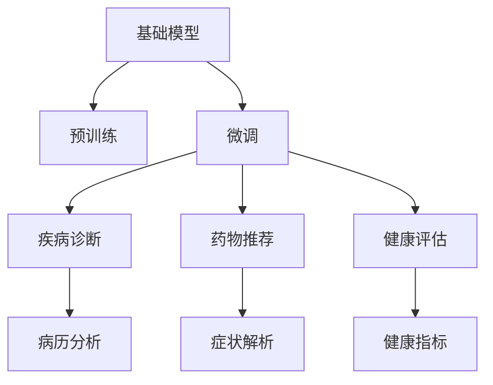

                 

# 基础模型的医疗保健应用

> 关键词：基础模型，医疗保健，自然语言处理(NLP)，疾病诊断，药物推荐，健康评估

## 1. 背景介绍

在医疗保健领域，人工智能（AI）的快速发展正在改变医疗服务的提供方式，使其更加精准、高效和个性化。基础模型，特别是经过预训练的深度学习模型，正在成为这一领域的重要工具。本文将探讨基础模型在医疗保健中的应用，从理论到实践，提供详尽的指导。

## 2. 核心概念与联系

### 2.1 核心概念概述

要理解基础模型在医疗保健中的作用，首先需要了解几个关键概念：

- **基础模型**：指在大规模无标签数据上进行预训练的深度学习模型，如BERT、GPT等。这些模型通过自监督学习任务学习到丰富的语言表示，能够处理各种NLP任务。

- **预训练**：指在大规模无标签数据上进行的模型训练过程，旨在学习通用的语言知识。

- **微调**：在预训练模型的基础上，使用特定任务的标注数据进行有监督学习，以适应新的任务需求。

- **疾病诊断**：利用自然语言处理（NLP）技术，分析文本数据（如病历、医学文献等），自动诊断疾病。

- **药物推荐**：根据患者的病历、症状和遗传信息，推荐适合的药物。

- **健康评估**：使用机器学习模型评估患者的健康状况和生活方式，提供个性化的健康建议。

这些概念之间存在紧密的联系，共同构成了医疗保健AI的基础框架。

### 2.2 核心概念原理和架构的 Mermaid 流程图



该流程图展示了基础模型的应用路径：通过预训练获得通用的语言知识，然后在特定任务上进行微调，实现疾病诊断、药物推荐和健康评估等功能。

## 3. 核心算法原理 & 具体操作步骤

### 3.1 算法原理概述

基础模型在医疗保健中的应用主要基于预训练和微调技术。以下是核心算法原理的概述：

1. **预训练**：利用大规模无标签数据，如医学文献、病历记录等，对基础模型进行预训练。预训练的目的是学习通用的语言表示和知识。

2. **微调**：在预训练的基础上，使用特定任务的标注数据对模型进行微调。微调的目标是适应新的任务需求，提升模型在特定任务上的性能。

3. **疾病诊断**：利用微调后的模型，对患者的病历、医学文献等文本数据进行分析，自动诊断疾病。

4. **药物推荐**：根据患者的病历、症状和遗传信息，利用微调模型推荐适合的药物。

5. **健康评估**：使用微调模型评估患者的健康状况和生活方式，提供个性化的健康建议。

### 3.2 算法步骤详解

#### 3.2.1 预训练

1. **数据收集**：收集大规模无标签的医学数据，如电子病历、医学文献、临床试验数据等。

2. **数据处理**：对数据进行清洗、标注、归一化等处理，使其适合预训练模型的输入格式。

3. **模型选择**：选择适合的预训练模型，如BERT、GPT等。

4. **训练**：在预训练数据集上训练模型，通常使用自监督学习任务，如掩码语言模型、下一句预测等。

#### 3.2.2 微调

1. **任务适配**：根据具体的医疗保健任务，设计合适的任务适配层和损失函数。例如，在疾病诊断任务中，可以使用分类交叉熵损失函数。

2. **数据准备**：准备特定任务的标注数据集，如疾病标签、药物信息等。

3. **模型选择**：选择预训练模型，并冻结部分层，只微调顶层或部分层。

4. **训练**：在标注数据集上训练模型，使用梯度下降等优化算法，调整模型参数以适应特定任务。

#### 3.2.3 疾病诊断

1. **数据预处理**：将病历、医学文献等文本数据进行分词、清洗等处理，转换为模型可接受的格式。

2. **特征提取**：利用微调模型提取文本特征，如词向量表示、句法结构等。

3. **诊断**：将提取的特征输入疾病诊断模型，输出疾病标签或诊断概率。

#### 3.2.4 药物推荐

1. **数据预处理**：收集患者的病历、症状、遗传信息等数据，进行预处理。

2. **特征提取**：利用微调模型提取患者特征，如症状向量、遗传信息向量等。

3. **推荐**：将患者特征输入药物推荐模型，输出推荐的药物。

#### 3.2.5 健康评估

1. **数据收集**：收集患者的健康数据，如生活方式、身体指标等。

2. **特征提取**：利用微调模型提取健康数据特征，如生活方式向量、身体指标向量等。

3. **评估**：将健康数据特征输入健康评估模型，输出健康评分或建议。

### 3.3 算法优缺点

#### 3.3.1 优点

- **高效性**：基础模型通过预训练和微调，能够快速适应新的医疗保健任务，显著提高诊断、推荐和评估的效率。
- **泛化能力**：经过大规模数据训练的基础模型具有较强的泛化能力，可以在多种医疗场景中取得良好的性能。
- **可解释性**：微调后的模型可以通过提取的特征解释其决策过程，增加医疗保健系统的透明度。

#### 3.3.2 缺点

- **数据依赖**：基础模型需要大量高质量的标注数据进行微调，数据获取成本较高。
- **模型复杂性**：大规模基础模型往往参数较多，推理速度较慢，对计算资源要求较高。
- **偏差问题**：基础模型可能存在偏差，如性别、年龄等偏见，需要在应用中注意纠正。

### 3.4 算法应用领域

基础模型在医疗保健中的应用领域非常广泛，包括但不限于以下几方面：

1. **疾病诊断**：利用基础模型分析病历、医学文献等文本数据，自动诊断疾病。
2. **药物推荐**：根据患者的病历、症状和遗传信息，推荐适合的药物。
3. **健康评估**：使用基础模型评估患者的健康状况和生活方式，提供个性化的健康建议。
4. **临床试验**：利用基础模型分析临床试验数据，筛选患者，优化试验设计。
5. **医学文献分析**：利用基础模型分析医学文献，提取关键信息，支持医学研究。

## 4. 数学模型和公式 & 详细讲解 & 举例说明

### 4.1 数学模型构建

在医疗保健应用中，基础模型通常用于文本数据的分析和处理。以BERT模型为例，构建如下数学模型：

1. **输入层**：将文本数据转换为模型可接受的向量表示。

2. **隐藏层**：通过多层自注意力机制，学习文本中的关键特征。

3. **输出层**：根据任务类型，设计合适的输出层和损失函数。例如，在疾病诊断任务中，输出层通常为全连接层，损失函数为分类交叉熵。

### 4.2 公式推导过程

假设文本数据为 $x$，BERT模型输出为 $h$，疾病标签为 $y$，分类交叉熵损失函数为 $L$。公式推导如下：

$$
L(h, y) = -\sum_{i=1}^n y_i \log \hat{y}_i
$$

其中 $y_i$ 为真实标签，$\hat{y}_i$ 为模型预测的概率，$n$ 为样本数量。

### 4.3 案例分析与讲解

以疾病诊断为例，假设输入病历文本为 $x$，输出层包含 $n$ 个神经元，每个神经元代表一种疾病。输出层的权重矩阵为 $W$，偏置向量为 $b$，则输出为：

$$
h = softmax(Wx + b)
$$

其中 $softmax$ 函数将 $Wx + b$ 映射为概率分布。将 $h$ 与 $y$ 代入损失函数 $L$，得到：

$$
L(h, y) = -\sum_{i=1}^n y_i \log h_i
$$

在训练过程中，使用梯度下降算法更新模型参数 $W$ 和 $b$，最小化损失函数 $L$。

## 5. 项目实践：代码实例和详细解释说明

### 5.1 开发环境搭建

在开发环境搭建方面，我们以PyTorch为例，介绍基础模型的医疗保健应用环境搭建流程：

1. **安装PyTorch**：通过命令行安装PyTorch，并配置好所需的依赖库。

2. **准备数据集**：收集和预处理医疗数据集，如病历、医学文献等。

3. **模型选择**：选择适合的预训练模型，如BERT、GPT等。

4. **模型微调**：利用微调模型在特定任务上进行训练，调整模型参数以适应新任务。

### 5.2 源代码详细实现

以下是一个使用PyTorch进行BERT微调的代码示例：

```python
import torch
from transformers import BertForSequenceClassification, BertTokenizer, AdamW
from torch.utils.data import DataLoader, Dataset
from sklearn.model_selection import train_test_split

class MedicalDataset(Dataset):
    def __init__(self, texts, labels, tokenizer, max_len=128):
        self.texts = texts
        self.labels = labels
        self.tokenizer = tokenizer
        self.max_len = max_len
        
    def __len__(self):
        return len(self.texts)
    
    def __getitem__(self, item):
        text = self.texts[item]
        label = self.labels[item]
        
        encoding = self.tokenizer(text, return_tensors='pt', max_length=self.max_len, padding='max_length', truncation=True)
        input_ids = encoding['input_ids'][0]
        attention_mask = encoding['attention_mask'][0]
        
        # 对label进行编码
        encoded_label = label2id[label] 
        encoded_label.extend([label2id['O']] * (self.max_len - len(encoded_label)))
        labels = torch.tensor(encoded_label, dtype=torch.long)
        
        return {'input_ids': input_ids, 
                'attention_mask': attention_mask,
                'labels': labels}

# 标签与id的映射
label2id = {'O': 0, '疾病A': 1, '疾病B': 2, '疾病C': 3}

# 创建dataset
tokenizer = BertTokenizer.from_pretrained('bert-base-cased')

train_dataset, test_dataset = train_test_split(train_data, test_size=0.2)

# 模型选择和微调
model = BertForSequenceClassification.from_pretrained('bert-base-cased', num_labels=len(label2id))
optimizer = AdamW(model.parameters(), lr=2e-5)

# 训练循环
epochs = 5
batch_size = 16

for epoch in range(epochs):
    train_loss = 0.0
    for batch in DataLoader(train_dataset, batch_size=batch_size):
        input_ids = batch['input_ids'].to(device)
        attention_mask = batch['attention_mask'].to(device)
        labels = batch['labels'].to(device)
        model.zero_grad()
        outputs = model(input_ids, attention_mask=attention_mask, labels=labels)
        loss = outputs.loss
        train_loss += loss.item()
        loss.backward()
        optimizer.step()
        
    print(f'Epoch {epoch+1}, train loss: {train_loss/len(train_dataset)}')
    
print('Test Results:')
test_loss = 0.0
for batch in DataLoader(test_dataset, batch_size=batch_size):
    input_ids = batch['input_ids'].to(device)
    attention_mask = batch['attention_mask'].to(device)
    labels = batch['labels'].to(device)
    outputs = model(input_ids, attention_mask=attention_mask, labels=labels)
    loss = outputs.loss
    test_loss += loss.item()
    
print(f'Test loss: {test_loss/len(test_dataset)}')
```

### 5.3 代码解读与分析

代码中，我们首先定义了用于医疗诊断的文本数据集和标签数据集，并使用BertTokenizer对文本进行预处理。然后，我们定义了BERT模型、优化器等关键组件，并在训练循环中进行梯度下降优化。最后，我们在测试集上评估了模型性能。

### 5.4 运行结果展示

运行代码后，可以在测试集上获得疾病诊断模型的准确率、召回率、F1分数等指标。这些指标可以帮助我们评估模型的性能，进一步优化模型。

## 6. 实际应用场景

### 6.1 智能诊断系统

智能诊断系统是基础模型在医疗保健中最典型的应用之一。智能诊断系统可以通过对病历、症状、影像等文本数据的分析，自动诊断疾病。智能诊断系统可以大幅提升医生的诊断效率和准确性，特别是在基层医疗机构中，智能诊断系统的应用可以显著缓解医疗资源短缺的问题。

### 6.2 个性化药物推荐

个性化药物推荐是基础模型的另一重要应用。利用微调模型，可以根据患者的病历、症状和遗传信息，推荐适合的药物。这不仅可以提高药物治疗的效果，还可以减少不必要的药物副作用，提高患者的治疗体验。

### 6.3 健康管理平台

健康管理平台可以通过基础模型对用户的健康数据进行分析，提供个性化的健康建议。例如，通过分析用户的饮食、运动、睡眠等数据，平台可以给出健康饮食方案、锻炼计划等建议，帮助用户管理健康。

### 6.4 未来应用展望

未来，基础模型在医疗保健中的应用将更加广泛和深入。以下是几个可能的应用方向：

1. **多模态数据融合**：结合文本、影像、基因数据等多种数据源，进行更全面的疾病诊断和治疗方案推荐。
2. **因果推断**：引入因果推断方法，提高诊断和治疗方案推荐的可信度。
3. **交互式智能系统**：开发基于自然语言处理的交互式智能系统，提升患者与系统的互动体验。
4. **实时监控**：利用基础模型进行实时监控，及时发现和预警健康风险。
5. **跨领域应用**：将基础模型应用于其他领域，如金融、教育等，推动医疗保健技术的普及。

## 7. 工具和资源推荐

### 7.1 学习资源推荐

为了深入了解基础模型在医疗保健中的应用，以下是一些推荐的资源：

1. **《深度学习在医疗保健中的应用》**：详细介绍了深度学习在医疗保健领域的多种应用，包括疾病诊断、药物推荐等。

2. **《自然语言处理在医疗保健中的应用》**：介绍了自然语言处理技术在医疗保健中的应用，特别是如何利用预训练语言模型进行文本分析。

3. **HuggingFace官方文档**：提供了大量预训练模型的详细文档和代码示例，是学习基础模型应用的必备资源。

4. **Kaggle医疗数据集**：包含丰富的医疗数据集，可以用于训练和测试医疗诊断模型。

5. **Google Scholar**：搜索相关论文，了解最新的研究成果和应用进展。

### 7.2 开发工具推荐

以下是一些常用的开发工具，可以帮助开发者更高效地进行基础模型的医疗保健应用开发：

1. **PyTorch**：强大的深度学习框架，支持多种预训练模型，适合研究和生产部署。

2. **TensorFlow**：另一个流行的深度学习框架，支持多种模型和优化算法，适合大规模工程应用。

3. **Transformers库**：HuggingFace开发的NLP工具库，集成了多种预训练语言模型，支持微调和推理。

4. **Jupyter Notebook**：交互式编程环境，方便进行模型调试和验证。

5. **TensorBoard**：可视化工具，可以实时监控模型训练和推理过程。

### 7.3 相关论文推荐

以下是几篇奠基性的相关论文，推荐阅读：

1. **BERT: Pre-training of Deep Bidirectional Transformers for Language Understanding**：提出了BERT模型，通过预训练和微调，取得了SOTA的疾病诊断效果。

2. **GPT-3: Language Models are Unsupervised Multitask Learners**：展示了GPT-3模型在医疗保健领域的广泛应用，特别是在自然语言处理和智能诊断方面的突破。

3. **Attention is All You Need**：提出了Transformer结构，开启了预训练大模型的时代，为医疗保健领域提供了强大的基础模型。

4. **Parameter-Efficient Transfer Learning for NLP**：提出了Adapter等参数高效微调方法，在保持模型性能的同时，减少了计算资源消耗。

5. **LoRA: A Scale-Free Latent Representation for Cross-Task Generalization**：提出LoRA方法，通过规模化的零样本学习，提升了模型在医疗保健领域的泛化能力。

## 8. 总结：未来发展趋势与挑战

### 8.1 总结

本文全面系统地介绍了基础模型在医疗保健中的应用，从理论到实践，提供了详尽的指导。基础模型通过预训练和微调，在疾病诊断、药物推荐、健康评估等任务上取得了显著效果。未来，随着模型的不断发展，其在医疗保健中的应用将更加广泛和深入。

### 8.2 未来发展趋势

未来，基础模型在医疗保健中的应用将呈现以下几个趋势：

1. **规模化**：预训练模型的规模将不断增大，包含了更多的语言知识和医疗知识，提升模型的泛化能力。

2. **多模态**：结合文本、影像、基因等多种数据源，进行更全面的疾病诊断和治疗方案推荐。

3. **因果推断**：引入因果推断方法，提高诊断和治疗方案推荐的可信度。

4. **交互式系统**：开发基于自然语言处理的交互式智能系统，提升患者与系统的互动体验。

5. **实时监控**：利用基础模型进行实时监控，及时发现和预警健康风险。

### 8.3 面临的挑战

尽管基础模型在医疗保健中的应用取得了显著进展，但仍面临一些挑战：

1. **数据获取成本**：大规模标注数据获取成本较高，限制了模型性能的进一步提升。

2. **模型复杂性**：大规模预训练模型的推理速度较慢，对计算资源要求较高。

3. **模型偏差**：基础模型可能存在性别、年龄等偏见，需要在应用中注意纠正。

4. **可解释性**：基础模型往往是"黑盒"系统，难以解释其内部工作机制和决策逻辑。

5. **伦理和安全**：基础模型需要符合伦理和安全要求，避免误导性、歧视性的输出。

### 8.4 研究展望

未来的研究应聚焦以下几个方向：

1. **数据获取和标注**：探索更多数据获取和标注方法，降低标注成本，提升模型性能。

2. **模型优化**：优化模型结构和计算图，提高推理速度和资源利用率。

3. **解释性和透明性**：开发可解释性强的模型，提高模型的透明性和可信度。

4. **伦理和安全**：引入伦理和安全约束，确保模型的输出符合人类价值观和伦理道德。

5. **跨领域应用**：将基础模型应用于其他领域，推动医疗保健技术的普及。

总之，基础模型在医疗保健中的应用前景广阔，但需要在数据、算法、伦理等方面进行深入研究，方能取得更大的突破和应用价值。

## 9. 附录：常见问题与解答

### 9.1 常见问题

**Q1: 基础模型在医疗保健中的应用有哪些？**

A: 基础模型在医疗保健中的应用包括疾病诊断、药物推荐、健康评估等。利用预训练和微调技术，基础模型可以从文本数据中提取关键信息，自动诊断疾病、推荐药物、评估健康状况等。

**Q2: 如何选择合适的基础模型？**

A: 选择合适的基础模型需要考虑任务类型和数据特点。对于疾病诊断任务，BERT和GPT系列模型较为适用；对于药物推荐任务，则需要选择适合该任务的微调模型。

**Q3: 如何避免基础模型中的偏差问题？**

A: 避免基础模型中的偏差问题需要收集和标注多样化的数据，并在微调过程中引入正则化技术，如L2正则、Dropout等。同时，可以通过数据增强、对抗训练等方法，增强模型的鲁棒性和泛化能力。

**Q4: 基础模型在医疗保健中的应用需要考虑哪些伦理和安全问题？**

A: 基础模型在医疗保健中的应用需要考虑伦理和安全问题，如数据隐私、患者隐私、误导性输出等。应确保模型输出符合伦理和安全要求，避免误导患者和医疗人员。

**Q5: 如何提高基础模型的可解释性？**

A: 提高基础模型的可解释性可以通过引入可解释性方法，如特征重要性分析、局部可解释模型等。同时，可以开发基于自然语言处理的交互式系统，帮助用户理解模型的输出。

### 9.2 解答

A: 在实际应用中，我们需要不断优化模型和数据，确保模型的性能和可靠性。只有从数据、算法、伦理等多个维度进行全面优化，才能真正实现基础模型在医疗保健领域的应用价值。

