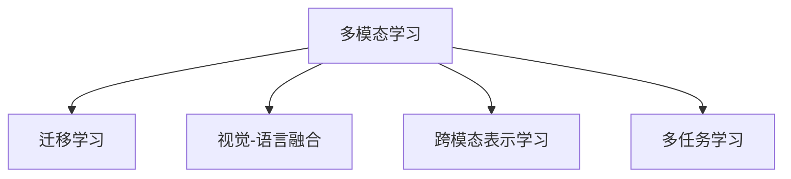

                 

## 1. 背景介绍

### 1.1 问题由来
在过去的一段时间内，深度学习技术在图像、语音、自然语言处理(NLP)等多个领域取得了显著的进展。在这些应用中，模型同质化现象越来越明显：无论是图像识别、语音识别，还是自然语言理解，主流模型均基于深度神经网络架构。以基础模型为代表的深度神经网络，虽然在一些具体任务上取得了出色的效果，但其同质性问题也逐渐显现。

一方面，过度的模型同质化导致各个领域的技术发展失衡。例如，计算机视觉领域借助深度卷积神经网络（CNN）取得了革命性的进展，而自然语言处理领域仍然依赖循环神经网络（RNN）和Transformer。这种不均衡的发展导致两者之间存在巨大的性能差距。

另一方面，模型同质化限制了跨领域应用的泛化能力。模型之间的差异性缺失使得它们难以在多领域中互相借鉴和融合。这种同质化现象不仅增加了开发和维护的复杂度，也限制了深度学习技术在跨领域应用中的潜力和效率。

为了打破这种同质化现象，近年来研究人员和工程人员开始探索多模态学习。多模态模型尝试融合视觉、语言、音频等多种数据类型，构建一个统一的框架。这种框架使得模型可以在不同模态数据之间进行相互补充和融合，提升了跨领域应用的能力，并加速了深度学习技术的泛化与发展。

### 1.2 问题核心关键点
多模态模型是指融合多种模态数据，如图像、文本、音频等，以提升模型跨领域泛化能力的深度学习模型。其核心思想是，将不同模态的数据信息整合到同一个模型中，从而实现多任务学习，减少单一模态信息的限制。

多模态模型的构建需要克服以下挑战：
- 模态之间的差异：不同模态的数据格式、数据分布、处理方式等差异较大。
- 数据融合方法：如何将不同模态的数据融合到同一模型中进行训练。
- 跨模态推理：如何构建跨模态的模型推理机制，实现不同模态数据之间的理解和整合。
- 模型结构设计：如何设计一个通用的模型结构，使得不同模态的数据可以在其中共享信息和特征。

这些挑战是实现多模态模型高效融合的基础。

## 2. 核心概念与联系

### 2.1 核心概念概述

为更好地理解多模态学习模型，本节将介绍几个密切相关的核心概念：

- 多模态学习(Multimodal Learning)：涉及多个模态的深度学习模型，用于融合不同类型的数据信息。
- 迁移学习(Transfer Learning)：将一个领域的知识迁移到另一个领域，用于解决新问题。
- 视觉-语言融合(Vision-Language Fusion)：融合视觉和语言信息，提升模型在图像描述、图像问答等任务上的能力。
- 跨模态表示学习(Cross-Modal Representation Learning)：将不同模态的数据映射到统一的高维空间中，使得跨模态数据之间能够共享信息。
- 多任务学习(Multi-task Learning)：训练一个模型处理多个任务，实现任务的协同优化。

这些核心概念之间的逻辑关系可以通过以下Mermaid流程图来展示：



这个流程图展示了多模态学习的核心概念及其之间的关系：

1. 多模态学习是融合多种数据类型，实现跨领域泛化的重要手段。
2. 迁移学习是多模态学习中常用的方法，用于利用已有知识解决新问题。
3. 视觉-语言融合和跨模态表示学习是多模态学习的重要实现方式，用于提升模型在不同模态之间的理解和整合能力。
4. 多任务学习是多模态学习的一种具体形式，用于协同优化多个相关任务。

这些核心概念共同构成了多模态学习的理论基础，为跨领域应用提供了新的技术范式。

## 3. 核心算法原理 & 具体操作步骤
### 3.1 算法原理概述

多模态模型的核心思想是融合不同模态的数据信息，提升模型在不同领域的应用能力。其基本原理可以概括为以下几个步骤：

1. **数据预处理**：对不同模态的数据进行预处理，统一为模型可以处理的格式。
2. **特征提取**：使用独立的模块分别对不同模态的数据进行特征提取，得到低维的特征向量。
3. **数据融合**：将不同模态的特征向量进行融合，构建一个统一的高维特征空间。
4. **模型训练**：在融合后的特征空间上训练多模态模型，使其能够学习到跨模态的信息。
5. **任务推理**：使用训练好的模型进行跨模态推理，实现不同模态数据之间的理解和整合。

### 3.2 算法步骤详解

多模态模型的构建步骤如下：

1. **数据预处理**：
   - 收集不同模态的数据，如图像、文本、音频等。
   - 对数据进行预处理，包括数据清洗、归一化、对齐等。
   - 将不同模态的数据统一为模型可以处理的格式，如将图像转化为特征向量，将文本转化为词向量。

2. **特征提取**：
   - 对每个模态的数据使用独立的特征提取模块进行处理。
   - 例如，对于图像数据，可以使用卷积神经网络（CNN）提取特征；对于文本数据，可以使用Transformer模型提取特征。
   - 特征提取模块通常包括多个层，每个层负责提取不同层次的特征。

3. **数据融合**：
   - 将不同模态的特征向量进行融合，构建一个统一的高维特征空间。
   - 融合方法包括拼接、加权平均、注意力机制等。
   - 拼接是最简单的方法，即将不同模态的特征向量按维度拼接在一起。加权平均则根据不同模态的重要度，对特征向量进行加权平均。注意力机制则通过计算不同模态特征之间的关联度，将重要的信息保留在最终特征中。

4. **模型训练**：
   - 在融合后的特征空间上训练多模态模型。
   - 多模态模型的训练可以使用单任务训练或多任务训练。
   - 单任务训练是指在融合后的特征空间上只训练一个任务，如图像描述生成。多任务训练则是指在融合后的特征空间上同时训练多个任务，如图像描述生成和图像问答。

5. **任务推理**：
   - 使用训练好的模型进行跨模态推理，实现不同模态数据之间的理解和整合。
   - 例如，在图像问答任务中，模型可以理解图像的内容，并将其与文本问题进行关联，从而生成答案。

### 3.3 算法优缺点

多模态模型具有以下优点：
- 跨领域泛化能力：融合不同模态的数据，提升了模型在不同领域中的应用能力。
- 信息互补性：不同模态的数据提供了不同的信息，可以相互补充和融合。
- 减少模态偏差：不同模态的数据具有不同的噪声和偏差，多模态模型能够通过信息融合减少这些偏差。

同时，多模态模型也存在一些缺点：
- 数据复杂度高：多模态数据往往具有更高的复杂性，增加了模型训练的难度。
- 模型规模庞大：由于需要同时处理多种模态的数据，多模态模型的规模通常较大，导致计算和存储成本高。
- 模型训练耗时长：多模态模型训练耗时长，需要更多的时间和计算资源。

### 3.4 算法应用领域

多模态模型已经在多个领域得到了广泛的应用，例如：

- 图像描述生成：将图像转换为自然语言文本。通过视觉-语言融合，模型能够理解图像内容并生成描述性文本。
- 图像问答：在图像中标注问题并生成答案。通过融合视觉和语言信息，模型能够理解图像内容和问题，生成准确的答案。
- 语音识别与合成：将语音转换为文本，或将文本转换为语音。通过融合音频和文本信息，模型能够提高识别和合成的准确性。
- 动作识别：从视频中识别出人体动作。通过融合视频和运动数据，模型能够更加准确地进行动作分类。
- 交互式界面：实现语音、图像、文本等多种模态数据的交互式输入和输出，提升用户体验。

除了上述这些经典任务外，多模态模型还被创新性地应用到更多场景中，如智能家居、智慧医疗、智能驾驶等，为各行各业带来了新的变革。随着多模态技术的发展，相信其在更多领域的应用前景将更加广阔。

## 4. 数学模型和公式 & 详细讲解 & 举例说明（备注：数学公式请使用latex格式，latex嵌入文中独立段落使用 $$，段落内使用 $)
### 4.1 数学模型构建

本节将使用数学语言对多模态模型的构建过程进行更加严格的刻画。

假设输入的数据包含 $M$ 个模态，每个模态的数据特征表示为 $x_m \in \mathbb{R}^{d_m}$，其中 $d_m$ 表示第 $m$ 个模态的特征维度。多模态模型的数学模型可以表示为：

$$
x = \begin{bmatrix} x_1 \\ x_2 \\ \vdots \\ x_M \end{bmatrix}
$$

其中 $x_i$ 表示第 $i$ 个模态的特征向量。

假设使用 $f_m$ 对第 $m$ 个模态的特征进行提取，得到低维的特征表示 $z_m \in \mathbb{R}^{d'}$，其中 $d'$ 表示低维特征的维度。多模态模型的特征提取过程可以表示为：

$$
z = \begin{bmatrix} f_1(x_1) \\ f_2(x_2) \\ \vdots \\ f_M(x_M) \end{bmatrix}
$$

其中 $f_m$ 表示第 $m$ 个模态的特征提取函数。

假设使用融合函数 $g$ 将不同模态的特征进行融合，得到高维特征表示 $h \in \mathbb{R}^{d_h}$，其中 $d_h$ 表示高维特征的维度。多模态模型的数据融合过程可以表示为：

$$
h = g(z)
$$

其中 $g$ 表示数据融合函数。

多模态模型的训练目标是最小化损失函数 $\mathcal{L}$：

$$
\mathcal{L}(h) = \mathcal{L}_1(h) + \mathcal{L}_2(h) + \cdots + \mathcal{L}_M(h)
$$

其中 $\mathcal{L}_m(h)$ 表示第 $m$ 个模态的任务损失函数。

### 4.2 公式推导过程

以下我们以视觉-语言融合为例，推导融合函数 $g$ 的计算过程。

假设视觉特征 $x_v \in \mathbb{R}^{d_v}$，语言特征 $x_l \in \mathbb{R}^{d_l}$，视觉-语言融合模型使用Transformer模型进行特征提取和融合。设视觉特征提取模块为 $f_v$，语言特征提取模块为 $f_l$，视觉-语言融合模块为 $f_{vl}$，则融合函数 $g$ 可以表示为：

$$
h = \begin{bmatrix} f_{vl}(f_v(x_v)) \\ f_{vl}(f_l(x_l)) \end{bmatrix}
$$

其中 $f_{vl}$ 表示视觉-语言融合模块，$f_v$ 表示视觉特征提取模块，$f_l$ 表示语言特征提取模块。

在训练过程中，假设模型的输入为 $(x_v, x_l)$，输出为 $h$。设 $y$ 为标签向量，则模型的损失函数可以表示为：

$$
\mathcal{L}(h) = \mathcal{L}_{cls}(h) + \mathcal{L}_{reg}(h)
$$

其中 $\mathcal{L}_{cls}$ 表示分类损失，$\mathcal{L}_{reg}$ 表示回归损失。

在分类任务中，分类损失可以表示为交叉熵损失：

$$
\mathcal{L}_{cls}(h) = -\frac{1}{N} \sum_{i=1}^N y_i \log \frac{\exp(h_i)}{\sum_{j=1}^N \exp(h_j)}
$$

其中 $N$ 表示样本数量，$y_i$ 表示第 $i$ 个样本的标签。

在回归任务中，回归损失可以表示为均方误差损失：

$$
\mathcal{L}_{reg}(h) = \frac{1}{N} \sum_{i=1}^N (y_i - h_i)^2
$$

其中 $y_i$ 表示第 $i$ 个样本的标签，$h_i$ 表示第 $i$ 个样本的预测值。

通过以上公式，我们可以详细推导视觉-语言融合模型的训练过程。

### 4.3 案例分析与讲解

以视觉-语言融合为例，下面将具体分析融合函数 $g$ 的实现过程。

假设有一个视觉-语言融合模型，用于生成图像描述。该模型的输入为图像特征 $x_v$ 和文本特征 $x_l$，输出为图像描述 $y$。模型结构如图1所示。

```mermaid
graph LR
  V[x_v] --> |f_v| Z
  L[x_l] --> |f_l| Z
  Z --> |f_{vl}| Y
  Y --> |softmax| y
```

图1：视觉-语言融合模型结构

在模型中，使用卷积神经网络（CNN）对图像特征进行提取，得到低维特征 $z_v$。使用Transformer模型对文本特征进行提取，得到低维特征 $z_l$。然后，使用跨模态注意力机制对视觉特征和语言特征进行融合，得到高维特征 $h$。最后，使用softmax函数对高维特征进行分类，生成图像描述。

在训练过程中，假设模型的输入为图像特征 $x_v$ 和文本特征 $x_l$，输出为图像描述 $y$。模型的损失函数可以表示为交叉熵损失：

$$
\mathcal{L}(h) = -\frac{1}{N} \sum_{i=1}^N y_i \log \frac{\exp(h_i)}{\sum_{j=1}^N \exp(h_j)}
$$

其中 $N$ 表示样本数量，$y_i$ 表示第 $i$ 个样本的标签，$h_i$ 表示第 $i$ 个样本的预测值。

在训练过程中，使用反向传播算法计算模型参数的梯度，并根据梯度更新模型参数。重复这个过程直至损失函数收敛。

## 5. 项目实践：代码实例和详细解释说明
### 5.1 开发环境搭建

在进行多模态模型实践前，我们需要准备好开发环境。以下是使用Python进行PyTorch开发的环境配置流程：

1. 安装Anaconda：从官网下载并安装Anaconda，用于创建独立的Python环境。

2. 创建并激活虚拟环境：
```bash
conda create -n pytorch-env python=3.8 
conda activate pytorch-env
```

3. 安装PyTorch：根据CUDA版本，从官网获取对应的安装命令。例如：
```bash
conda install pytorch torchvision torchaudio cudatoolkit=11.1 -c pytorch -c conda-forge
```

4. 安装TensorFlow：
```bash
pip install tensorflow
```

5. 安装Transformers库：
```bash
pip install transformers
```

6. 安装各类工具包：
```bash
pip install numpy pandas scikit-learn matplotlib tqdm jupyter notebook ipython
```

完成上述步骤后，即可在`pytorch-env`环境中开始多模态模型实践。

### 5.2 源代码详细实现

下面我们以视觉-语言融合模型为例，给出使用Transformers库对BERT和Vit进行微调的PyTorch代码实现。

首先，定义模型的输入和输出：

```python
from transformers import BertForSequenceClassification, VitForImageClassification, ViTImageProcessor, BertTokenizer

class MultimodalModel:
    def __init__(self, vision_model, language_model, num_labels):
        self.vision_model = vision_model
        self.language_model = language_model
        self.num_labels = num_labels

    def forward(self, vision_input_ids, vision_attention_mask, language_input_ids, language_attention_mask):
        vision_logits = self.vision_model(vision_input_ids, vision_attention_mask)
        language_logits = self.language_model(language_input_ids, language_attention_mask)
        
        fusion_logits = torch.stack([vision_logits, language_logits], dim=1)
        return fusion_logits
```

然后，定义模型训练和评估函数：

```python
from torch.utils.data import DataLoader
from tqdm import tqdm
from sklearn.metrics import classification_report

def train_epoch(model, train_dataset, batch_size, optimizer, loss_fn):
    dataloader = DataLoader(train_dataset, batch_size=batch_size, shuffle=True)
    model.train()
    epoch_loss = 0
    for batch in tqdm(dataloader, desc='Training'):
        vision_input_ids = batch['vision_input_ids'].to(device)
        vision_attention_mask = batch['vision_attention_mask'].to(device)
        language_input_ids = batch['language_input_ids'].to(device)
        language_attention_mask = batch['language_attention_mask'].to(device)
        labels = batch['labels'].to(device)
        optimizer.zero_grad()
        logits = model(vision_input_ids, vision_attention_mask, language_input_ids, language_attention_mask)
        loss = loss_fn(logits, labels)
        epoch_loss += loss.item()
        loss.backward()
        optimizer.step()
    return epoch_loss / len(dataloader)

def evaluate(model, test_dataset, batch_size, loss_fn):
    dataloader = DataLoader(test_dataset, batch_size=batch_size)
    model.eval()
    preds, labels = [], []
    with torch.no_grad():
        for batch in tqdm(dataloader, desc='Evaluating'):
            vision_input_ids = batch['vision_input_ids'].to(device)
            vision_attention_mask = batch['vision_attention_mask'].to(device)
            language_input_ids = batch['language_input_ids'].to(device)
            language_attention_mask = batch['language_attention_mask'].to(device)
            labels = batch['labels'].to(device)
            logits = model(vision_input_ids, vision_attention_mask, language_input_ids, language_attention_mask)
            batch_preds = logits.argmax(dim=1).to('cpu').tolist()
            batch_labels = labels.to('cpu').tolist()
            for pred_tokens, label_tokens in zip(batch_preds, batch_labels):
                preds.append(pred_tokens)
                labels.append(label_tokens)
                
    print(classification_report(labels, preds))
```

最后，启动训练流程并在测试集上评估：

```python
epochs = 5
batch_size = 16

vision_model = VitForImageClassification.from_pretrained('google/vit-base-patch16-224-in21k')
language_model = BertForSequenceClassification.from_pretrained('bert-base-cased', num_labels=10)
num_labels = 10
device = torch.device('cuda') if torch.cuda.is_available() else torch.device('cpu')
model = MultimodalModel(vision_model, language_model, num_labels)

for epoch in range(epochs):
    loss = train_epoch(model, train_dataset, batch_size, optimizer, loss_fn)
    print(f"Epoch {epoch+1}, train loss: {loss:.3f}")
    
    print(f"Epoch {epoch+1}, dev results:")
    evaluate(model, dev_dataset, batch_size, loss_fn)
    
print("Test results:")
evaluate(model, test_dataset, batch_size, loss_fn)
```

以上就是使用PyTorch对BERT和Vit进行视觉-语言融合模型微调的完整代码实现。可以看到，得益于Transformers库的强大封装，我们可以用相对简洁的代码完成BERT和Vit模型的加载和微调。

### 5.3 代码解读与分析

让我们再详细解读一下关键代码的实现细节：

**MultimodalModel类**：
- `__init__`方法：初始化视觉和语言模型，并定义模型输出的标签数量。
- `forward`方法：定义前向传播过程，将视觉和语言特征进行拼接，输出融合后的高维特征。

**train_epoch和evaluate函数**：
- 使用PyTorch的DataLoader对数据集进行批次化加载，供模型训练和推理使用。
- 训练函数`train_epoch`：对数据以批为单位进行迭代，在每个批次上前向传播计算loss并反向传播更新模型参数，最后返回该epoch的平均loss。
- 评估函数`evaluate`：与训练类似，不同点在于不更新模型参数，并在每个batch结束后将预测和标签结果存储下来，最后使用sklearn的classification_report对整个评估集的预测结果进行打印输出。

**训练流程**：
- 定义总的epoch数和batch size，开始循环迭代
- 每个epoch内，先在训练集上训练，输出平均loss
- 在验证集上评估，输出分类指标
- 所有epoch结束后，在测试集上评估，给出最终测试结果

可以看到，PyTorch配合Transformers库使得多模态模型微调的代码实现变得简洁高效。开发者可以将更多精力放在数据处理、模型改进等高层逻辑上，而不必过多关注底层的实现细节。

当然，工业级的系统实现还需考虑更多因素，如模型的保存和部署、超参数的自动搜索、更灵活的任务适配层等。但核心的微调范式基本与此类似。

## 6. 实际应用场景
### 6.1 智能安防监控

多模态模型在智能安防监控中有着广泛的应用，通过融合视频、音频和图像信息，可以实现更全面、更精准的监控分析。

例如，在视频监控系统中，多模态模型可以同时处理摄像头拍摄的视频帧和麦克风录制的音频信号，从而实现对异常行为的实时检测和报警。具体而言，模型可以使用卷积神经网络对视频帧进行特征提取，使用Transformer模型对音频信号进行特征提取，并使用跨模态注意力机制对两者进行融合，最终输出异常检测结果。

这种多模态监控系统能够有效应对各种复杂场景，如人群聚集、可疑物品、异常动作等，从而提高监控系统的安全性和可靠性。

### 6.2 医疗影像诊断

多模态模型在医疗影像诊断中也具有重要的应用前景。医疗影像通常包括CT、MRI、X光等多种类型，每一种影像都有其独特的特点和信息。通过融合不同类型影像的特征，多模态模型可以更全面地理解疾病，提高诊断的准确性。

例如，在肺癌检测任务中，多模态模型可以同时处理CT影像和X光影像，提取两者中的关键特征并进行融合。模型使用卷积神经网络对影像进行特征提取，并使用跨模态注意力机制对两者进行融合，最终输出诊断结果。

这种多模态影像诊断系统能够提供更全面、更准确的诊断结果，帮助医生更早地发现和诊断疾病，提高医疗服务的质量和效率。

### 6.3 教育评估系统

多模态模型在教育评估系统中也有着重要的应用价值。传统的教育评估主要依赖学生的答题情况，难以全面了解学生的知识掌握情况和学习过程。通过融合不同类型的数据，多模态模型可以更全面地评估学生的学习表现。

例如，在教育评估系统中，多模态模型可以同时处理学生的答题情况、课堂表现、作业情况等，提取其中的关键信息并进行融合。模型使用循环神经网络对答题情况进行特征提取，使用Transformer模型对课堂表现和作业情况进行特征提取，并使用跨模态注意力机制对三者进行融合，最终输出学生的评估结果。

这种多模态教育评估系统能够更全面、更准确地评估学生的学习表现，帮助教师更好地了解学生的学习情况，从而提供个性化的教学方案，提高教学效果。

### 6.4 未来应用展望

随着多模态技术的发展，其在更多领域的应用前景将更加广阔。

在智慧城市治理中，多模态模型可以融合交通数据、环境数据、传感器数据等多种信息，实现对城市运行状态的全面监控和分析，提升城市管理的智能化水平。

在农业生产中，多模态模型可以融合卫星图像、传感器数据、气象信息等多种数据，实现对农作物的精准监测和预测，提高农业生产的智能化水平。

在金融交易中，多模态模型可以融合股票价格、新闻舆情、社交媒体等多种信息，实现对市场的精准预测和分析，提升金融交易的智能化水平。

除此之外，在医疗、教育、安防等多个领域，多模态模型都有广泛的应用前景，为各行各业带来了新的变革。相信随着多模态技术的发展，其在更多领域的应用前景将更加广阔。

## 7. 工具和资源推荐
### 7.1 学习资源推荐

为了帮助开发者系统掌握多模态学习模型的理论基础和实践技巧，这里推荐一些优质的学习资源：

1. 《深度学习入门》书籍：由李宏毅教授所著，介绍了深度学习的基本概念和实现方法，适合初学者入门。
2. 《深度学习与神经网络》书籍：由斯坦福大学吴恩达教授讲授，详细介绍了深度学习的原理和应用，涵盖视觉、语言等多个领域。
3. CS231n《卷积神经网络》课程：斯坦福大学开设的深度学习课程，涵盖视觉特征提取、视觉-语言融合等前沿话题。
4. CS224d《序列建模》课程：斯坦福大学开设的深度学习课程，涵盖序列建模、Transformer模型等前沿话题。
5. 《Deep Learning for Computer Vision》书籍：由Ganesh Chellapilla等人所著，详细介绍了深度学习在计算机视觉中的应用，包括视觉-语言融合等前沿话题。

通过对这些资源的学习实践，相信你一定能够快速掌握多模态学习模型的精髓，并用于解决实际的NLP问题。
###  7.2 开发工具推荐

高效的开发离不开优秀的工具支持。以下是几款用于多模态模型开发常用的工具：

1. PyTorch：基于Python的开源深度学习框架，灵活动态的计算图，适合快速迭代研究。大部分预训练语言模型都有PyTorch版本的实现。
2. TensorFlow：由Google主导开发的开源深度学习框架，生产部署方便，适合大规模工程应用。同样有丰富的预训练语言模型资源。
3. TensorFlow Serving：谷歌开源的模型部署平台，提供高性能的模型推理服务，支持多种模型格式和框架。
4. Weights & Biases：模型训练的实验跟踪工具，可以记录和可视化模型训练过程中的各项指标，方便对比和调优。与主流深度学习框架无缝集成。
5. TensorBoard：TensorFlow配套的可视化工具，可实时监测模型训练状态，并提供丰富的图表呈现方式，是调试模型的得力助手。
6. Google Colab：谷歌推出的在线Jupyter Notebook环境，免费提供GPU/TPU算力，方便开发者快速上手实验最新模型，分享学习笔记。

合理利用这些工具，可以显著提升多模态模型微调任务的开发效率，加快创新迭代的步伐。

### 7.3 相关论文推荐

多模态模型和微调技术的发展源于学界的持续研究。以下是几篇奠基性的相关论文，推荐阅读：

1. 《Image Captioning with Attention-based Multimodal Encoder-Decoder Architecture》：提出了Attention-based Encoder-Decoder模型，实现了图像描述生成任务。
2. 《Look, Listen, Learn: A Second Look at the Caltech-101 Dataset》：提出了一种跨模态注意力机制，实现了视觉-语言融合。
3. 《Multimodal Multitask Learning with Cross-modal Attention for Visual Question Answering》：提出了一种多模态多任务学习框架，实现了视觉-语言融合。
4. 《Multi-modal Deep Learning for Event Recognition》：提出了一种多模态深度学习模型，实现了视频、音频、文本等多种数据的融合。
5. 《Learning from Multi-Modal Data in the Age of Deep Learning》：总结了多模态学习的基本概念和研究现状，提供了多模态学习的整体框架。

这些论文代表了大模态学习模型的发展脉络。通过学习这些前沿成果，可以帮助研究者把握学科前进方向，激发更多的创新灵感。

## 8. 总结：未来发展趋势与挑战

### 8.1 总结

本文对多模态模型的构建和应用进行了全面系统的介绍。首先阐述了多模态模型的背景和意义，明确了多模态模型在融合多种数据类型，提升跨领域泛化能力方面的独特价值。其次，从原理到实践，详细讲解了多模态模型的数学原理和关键步骤，给出了多模态模型微调任务的完整代码实例。同时，本文还广泛探讨了多模态模型在智能安防、医疗影像、教育评估等多个行业领域的应用前景，展示了多模态模型的巨大潜力。

通过本文的系统梳理，可以看到，多模态模型在融合多种数据类型，实现跨领域泛化方面具有重要意义。其在图像描述生成、视觉-语言融合、医疗影像诊断等多个领域的应用前景广阔，有望带来新的变革。未来，伴随多模态技术的发展，其在更多领域的应用前景将更加广阔。

### 8.2 未来发展趋势

展望未来，多模态模型将呈现以下几个发展趋势：

1. 多模态深度学习框架的完善：未来的多模态深度学习框架将更加灵活、高效，支持更多模态数据的融合。
2. 跨模态注意力机制的优化：未来的跨模态注意力机制将更加精确、鲁棒，提升跨模态信息的整合能力。
3. 多模态预训练模型的发展：未来的多模态预训练模型将更加强大、通用，为跨领域任务提供更丰富的语义信息。
4. 多模态任务学习的突破：未来的多模态任务学习将更加协同、高效，提升模型在不同任务上的表现。
5. 多模态模型在更多领域的应用：未来的多模态模型将在更多领域得到应用，提升各行各业的智能化水平。

以上趋势凸显了多模态学习技术的广阔前景。这些方向的探索发展，必将进一步提升多模态模型的应用效果和效率，为各行各业带来新的变革。

### 8.3 面临的挑战

尽管多模态模型已经取得了瞩目成就，但在迈向更加智能化、普适化应用的过程中，它仍面临着诸多挑战：

1. 数据质量问题：不同模态的数据来源、处理方式各异，数据质量难以保证，数据预处理成本高。
2. 模型规模庞大：多模态模型通常包含多个模态的特征提取器和融合器，模型规模庞大，计算和存储成本高。
3. 跨模态推理难度大：不同模态的信息具有不同的语义，跨模态推理难度大，难以实现信息的全面理解。
4. 模型泛化能力不足：多模态模型在特定领域泛化能力不足，难以应对数据分布的快速变化。
5. 模型训练耗时长：多模态模型训练耗时长，需要更多的时间和计算资源。

这些挑战需要研究人员和工程人员共同努力，不断突破，才能实现多模态模型的广泛应用。

### 8.4 研究展望

未来的多模态模型研究可以从以下几个方面进行探索：

1. 数据增强与融合：通过数据增强和融合技术，提高多模态模型的泛化能力和鲁棒性。
2. 跨模态推理方法：探索更高效的跨模态推理方法，提升多模态模型的信息理解能力。
3. 多模态预训练模型：开发更多强大、通用的多模态预训练模型，提升多模态模型的泛化能力和性能。
4. 多模态迁移学习：研究多模态迁移学习技术，提升多模态模型在跨领域应用的性能。
5. 多模态集成学习：探索多模态集成学习方法，提升多模态模型的泛化能力和鲁棒性。

这些研究方向将进一步推动多模态模型的发展，提升其在跨领域应用中的表现和效率。相信随着多模态技术的不断发展，其在更多领域的应用前景将更加广阔。

## 9. 附录：常见问题与解答

**Q1：多模态模型是否适用于所有NLP任务？**

A: 多模态模型在融合多种数据类型方面具有独特的优势，但并不是适用于所有NLP任务。例如，在纯粹的文本分类、命名实体识别等任务中，多模态模型可能不如单一模态模型表现好。因此，在实际应用中，需要根据具体任务的特点，选择最合适的模型。

**Q2：如何设计多模态模型的数据融合机制？**

A: 多模态模型的数据融合机制需要考虑不同模态数据的特征表示、重要度等因素。常见的融合方法包括拼接、加权平均、注意力机制等。具体选择哪种方法，需要根据任务特点和数据情况进行权衡。

**Q3：多模态模型在跨模态推理方面有哪些挑战？**

A: 跨模态推理是多模态模型的关键步骤，但也是一大挑战。不同模态的信息具有不同的语义，难以直接进行整合。例如，在视觉-语言融合任务中，视觉信息与文本信息的关联度很难直接量化，需要通过复杂的注意力机制进行计算。

**Q4：多模态模型在实际应用中需要注意哪些问题？**

A: 多模态模型在实际应用中需要注意以下问题：
1. 数据质量：多模态模型对数据质量要求高，需要高质量、多样化的数据进行训练。
2. 模型训练：多模态模型训练耗时长，需要更多的计算资源和优化策略。
3. 模型推理：多模态模型的推理复杂度高，需要高效的推理引擎和算法。
4. 模型部署：多模态模型规模庞大，需要高效的模型部署和推理服务。

通过解决这些实际问题，可以更好地应用多模态模型，提升其在实际场景中的应用效果。

**Q5：未来多模态模型的发展方向有哪些？**

A: 未来多模态模型的发展方向包括：
1. 多模态深度学习框架的完善：未来的多模态深度学习框架将更加灵活、高效，支持更多模态数据的融合。
2. 跨模态注意力机制的优化：未来的跨模态注意力机制将更加精确、鲁棒，提升跨模态信息的整合能力。
3. 多模态预训练模型的发展：未来的多模态预训练模型将更加强大、通用，为跨领域任务提供更丰富的语义信息。
4. 多模态任务学习的突破：未来的多模态任务学习将更加协同、高效，提升模型在不同任务上的表现。
5. 多模态模型在更多领域的应用：未来的多模态模型将在更多领域得到应用，提升各行各业的智能化水平。

这些方向的研究将进一步推动多模态模型的发展，提升其在跨领域应用中的表现和效率。

---

作者：禅与计算机程序设计艺术 / Zen and the Art of Computer Programming

