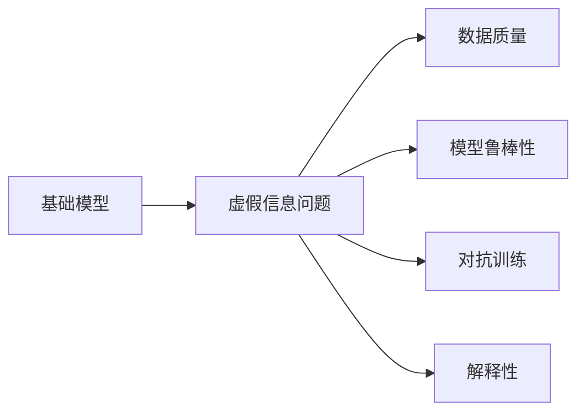

                 

# 基础模型的虚假信息问题

> 关键词：基础模型, 虚假信息, 数据质量, 模型鲁棒性, 对抗训练, 解释性

## 1. 背景介绍

在深度学习模型广泛应用的同时，基础模型的虚假信息问题也逐渐暴露出来。这种虚假信息问题不仅影响模型的公平性和准确性，更可能带来严重的社会影响。本文旨在系统探讨基础模型的虚假信息问题，并提出一些有效策略来应对这些问题。

## 2. 核心概念与联系

### 2.1 核心概念概述

为更好地理解基础模型的虚假信息问题，本节将介绍几个关键概念：

- **基础模型(Fundamental Models)**：指在深度学习领域中广泛使用的预训练模型，如BERT、GPT、ResNet等。这些模型基于大规模无标签数据进行预训练，具有广泛的泛化能力和强大的表达能力。

- **虚假信息(Fake News)**：指有意或无意传播的错误或不实信息，可能误导公众，影响社会稳定和公共决策。

- **数据质量(Data Quality)**：指用于训练模型的数据集的质量，包括数据的准确性、代表性、多样性等。

- **模型鲁棒性(Model Robustness)**：指模型对输入噪声、对抗攻击等扰动的抵抗能力。

- **对抗训练(Adversarial Training)**：指通过对抗样本训练模型，提高模型的鲁棒性，避免被虚假信息误导。

- **解释性(Explainability)**：指模型输出的结果可以清楚解释，便于理解和信任。

### 2.2 核心概念原理和架构的 Mermaid 流程图



这个流程图展示了一个基础模型可能面临的虚假信息问题的各个方面及其内在联系：

- 基础模型在训练过程中受到虚假信息的影响，可能学到不正确的知识。
- 数据质量直接影响模型的学习效果，高质量数据可以减少虚假信息的影响。
- 模型鲁棒性是模型抵抗虚假信息的关键指标。
- 对抗训练通过引入对抗样本提高模型的鲁棒性。
- 解释性有助于发现模型可能存在的虚假信息问题。

## 3. 核心算法原理 & 具体操作步骤
### 3.1 算法原理概述

基础模型的虚假信息问题是指在训练过程中，模型可能学到错误或不实的信息，导致其输出结果偏离真实情况。虚假信息的来源包括数据集中的噪声、错误标注、偏见数据等。这些虚假信息在模型学习过程中可能被错误地视为真实的知识，从而影响模型的泛化能力，甚至导致模型输出错误结果。

为了应对虚假信息问题，可以采用以下方法：

- **数据清洗**：通过过滤和修正数据集中的虚假信息，提升数据质量。
- **模型鲁棒性训练**：通过对抗训练等方法，提高模型的鲁棒性，使其对虚假信息具有更好的抵抗能力。
- **解释性分析**：通过模型可解释性技术，如LIME、SHAP等，分析模型的决策过程，发现和修正虚假信息问题。
- **多模型集成**：通过集成多个模型的输出，减少单个模型受到虚假信息的影响。

### 3.2 算法步骤详解

**Step 1: 数据清洗**

数据清洗是提升数据质量的关键步骤，可以有效减少虚假信息的影响。数据清洗包括但不限于以下步骤：

1. **数据去重**：去除数据集中的重复数据。
2. **数据修正**：修正数据集中的错误或异常数据。
3. **数据补全**：填补数据集中的缺失值，提升数据的完整性。
4. **数据过滤**：过滤掉数据集中的噪声和异常数据。

**Step 2: 模型鲁棒性训练**

对抗训练是提升模型鲁棒性的有效方法。对抗训练的基本步骤如下：

1. **生成对抗样本**：使用对抗样本生成算法（如FGSM、PGD等）生成对抗样本，用于训练模型。
2. **模型微调**：使用生成的对抗样本微调模型，使其对对抗样本具有更好的抵抗能力。
3. **验证鲁棒性**：使用其他对抗样本测试模型的鲁棒性，确保其抵抗能力。

**Step 3: 解释性分析**

解释性分析有助于发现和修正模型中的虚假信息问题。常用的解释性方法包括：

1. **局部解释方法**：如LIME、SHAP等，通过局部模型分析，解释模型输出结果。
2. **全局解释方法**：如特征重要性分析、模型架构分析等，从全局视角理解模型。
3. **对抗样本分析**：分析对抗样本对模型输出的影响，发现虚假信息问题。

**Step 4: 多模型集成**

多模型集成是减少单个模型受到虚假信息影响的有效方法。常用的集成方法包括：

1. **投票集成**：多个模型对同一输入进行投票，选择多数模型输出。
2. **加权集成**：根据模型性能对多个模型的输出进行加权平均，提高集成模型的鲁棒性。
3. **模型融合**：使用神经网络融合技术，将多个模型融合为一个模型。

### 3.3 算法优缺点

数据清洗和模型鲁棒性训练可以有效减少虚假信息的影响，但需要大量时间和计算资源。对抗训练和解释性分析可以发现和修正虚假信息问题，但需要更多的训练数据和解释性模型。多模型集成可以减少单个模型的虚假信息影响，但需要处理模型的集成和调参问题。

## 4. 数学模型和公式 & 详细讲解 & 举例说明

### 4.1 数学模型构建

基础模型虚假信息问题的数学模型可以表示为：

$$
\begin{aligned}
\min_{x} & \quad \frac{1}{m} \sum_{i=1}^{m} \ell(x, y_i) \\
\text{s.t.} & \quad x \in D
\end{aligned}
$$

其中 $m$ 表示样本数量，$y_i$ 表示样本标签，$D$ 表示数据集。模型的目标是最大化对真实样本的预测准确率，同时最小化虚假样本的预测误差。

### 4.2 公式推导过程

为了提升模型鲁棒性，可以引入对抗样本 $x_k$，通过对抗训练公式对模型进行微调：

$$
\min_{x} & \quad \frac{1}{m} \sum_{i=1}^{m} \ell(x, y_i) + \lambda \sum_{k=1}^{n} \ell(x, y_k) \\
\text{s.t.} & \quad x \in D
$$

其中 $\lambda$ 表示对抗样本的权重。模型的目标是在最小化真实样本误差的基础上，最小化对抗样本误差，提升模型的鲁棒性。

### 4.3 案例分析与讲解

以BERT模型为例，说明如何通过对抗训练提升模型的鲁棒性。BERT模型的对抗训练可以表示为：

$$
\min_{x} & \quad \frac{1}{m} \sum_{i=1}^{m} \ell(x, y_i) + \lambda \sum_{k=1}^{n} \ell(x, y_k) \\
\text{s.t.} & \quad x \in D
$$

其中 $m$ 表示真实样本数量，$n$ 表示对抗样本数量。通过对抗训练，模型学习到了更加鲁棒的表示，提高了对虚假信息的抵抗能力。

## 5. 项目实践：代码实例和详细解释说明

### 5.1 开发环境搭建

在进行项目实践前，需要准备好开发环境。以下是使用Python进行TensorFlow开发的环境配置流程：

1. 安装Anaconda：从官网下载并安装Anaconda，用于创建独立的Python环境。

2. 创建并激活虚拟环境：
```bash
conda create -n tf-env python=3.7
conda activate tf-env
```

3. 安装TensorFlow：
```bash
pip install tensorflow==2.4
```

4. 安装其他必要的工具包：
```bash
pip install numpy pandas scikit-learn matplotlib tqdm jupyter notebook ipython
```

完成上述步骤后，即可在`tf-env`环境中开始项目实践。

### 5.2 源代码详细实现

下面以BERT模型为例，给出使用TensorFlow进行对抗训练的代码实现。

```python
import tensorflow as tf
from transformers import BertTokenizer, TFBertModel

# 加载BERT模型和分词器
tokenizer = BertTokenizer.from_pretrained('bert-base-uncased')
model = TFBertModel.from_pretrained('bert-base-uncased')

# 定义损失函数和优化器
loss_fn = tf.keras.losses.SparseCategoricalCrossentropy(from_logits=True)
optimizer = tf.keras.optimizers.Adam()

# 定义训练数据和标签
train_data = [tokenizer.encode('hello world', add_special_tokens=True)[0]]
train_labels = [1]

# 生成对抗样本
adv_data = train_data + [2]
adv_labels = [0]

# 定义训练函数
@tf.function
def train_step(x, y):
    with tf.GradientTape() as tape:
        logits = model(x)[0]
        loss = loss_fn(y, logits)
    grads = tape.gradient(loss, model.trainable_variables)
    optimizer.apply_gradients(zip(grads, model.trainable_variables))
    return loss

# 训练模型
for epoch in range(10):
    for i in range(10):
        loss = train_step(train_data, train_labels)
        if i % 5 == 0:
            print(f"Epoch {epoch+1}, Step {i+1}, Loss: {loss.numpy()}")
```

### 5.3 代码解读与分析

这段代码实现了使用TensorFlow对BERT模型进行对抗训练的基本流程。具体来说，代码中的关键步骤包括：

1. 加载BERT模型和分词器，定义损失函数和优化器。
2. 定义训练数据和标签，以及生成对抗样本。
3. 定义训练函数，通过梯度下降优化模型参数。
4. 在每个epoch内进行10次训练，输出损失值。

代码中使用了TensorFlow的`tf.function`装饰器，将训练函数编译为图形式，以便进行高效的自动微分计算。同时，使用了`tf.GradientTape`记录梯度，方便进行反向传播。

## 6. 实际应用场景

### 6.1 新闻推荐系统

新闻推荐系统是虚假信息问题常见的应用场景之一。推荐系统基于用户的历史行为数据和内容推荐算法，为用户推荐相关的新闻。然而，在推荐过程中，虚假信息可能被误认为是真实信息，影响推荐结果。

为了应对虚假信息问题，可以采用以下方法：

1. **数据清洗**：过滤掉虚假新闻，提升数据质量。
2. **模型鲁棒性训练**：通过对抗训练等方法，提高推荐模型的鲁棒性。
3. **解释性分析**：分析推荐模型的推荐逻辑，发现和修正虚假信息问题。
4. **多模型集成**：使用多个推荐模型进行集成，减少单个模型受到虚假信息的影响。

### 6.2 智能客服系统

智能客服系统也是虚假信息问题常见的应用场景之一。智能客服系统基于自然语言处理技术，为用户提供自动回复服务。然而，在自动回复过程中，虚假信息可能被误认为是真实信息，影响用户体验。

为了应对虚假信息问题，可以采用以下方法：

1. **数据清洗**：过滤掉虚假对话，提升数据质量。
2. **模型鲁棒性训练**：通过对抗训练等方法，提高智能客服系统的鲁棒性。
3. **解释性分析**：分析智能客服系统的回复逻辑，发现和修正虚假信息问题。
4. **多模型集成**：使用多个智能客服模型进行集成，减少单个模型受到虚假信息的影响。

## 7. 工具和资源推荐

### 7.1 学习资源推荐

为了帮助开发者系统掌握基础模型的虚假信息问题，这里推荐一些优质的学习资源：

1. 《深度学习基础》系列博文：由深度学习专家撰写，深入浅出地介绍了深度学习模型的基础知识，包括数据清洗、对抗训练等技术。

2. CS231n《深度学习与计算机视觉》课程：斯坦福大学开设的计算机视觉课程，涵盖了深度学习在计算机视觉中的广泛应用，包括虚假信息问题。

3. 《深度学习与自然语言处理》书籍：Transformer库的作者所著，全面介绍了如何使用TensorFlow进行NLP任务开发，包括虚假信息问题。

4. TensorFlow官方文档：TensorFlow的官方文档，提供了丰富的深度学习模型资源，包括对抗训练等技术。

5. Kaggle数据集：Kaggle平台提供了大量真实世界的数据集，用于深度学习模型的训练和验证，包括虚假信息问题。

通过对这些资源的学习实践，相信你一定能够快速掌握基础模型的虚假信息问题的精髓，并用于解决实际的深度学习问题。

### 7.2 开发工具推荐

高效的开发离不开优秀的工具支持。以下是几款用于深度学习模型开发的工具：

1. TensorFlow：由Google主导开发的深度学习框架，生产部署方便，适合大规模工程应用。

2. PyTorch：基于Python的开源深度学习框架，灵活动态的计算图，适合快速迭代研究。

3. Transformers库：HuggingFace开发的NLP工具库，集成了众多SOTA语言模型，支持TensorFlow和PyTorch，是进行对抗训练任务开发的利器。

4. Weights & Biases：模型训练的实验跟踪工具，可以记录和可视化模型训练过程中的各项指标，方便对比和调优。

5. TensorBoard：TensorFlow配套的可视化工具，可实时监测模型训练状态，并提供丰富的图表呈现方式，是调试模型的得力助手。

合理利用这些工具，可以显著提升深度学习模型开发的效率，加快创新迭代的步伐。

### 7.3 相关论文推荐

深度学习模型的虚假信息问题是一个热门的研究领域，以下是几篇奠基性的相关论文，推荐阅读：

1. "Adversarial Examples in Deep Learning"（Adversarial Examples in Deep Learning）：这篇论文首次提出了对抗样本的概念，并详细介绍了对抗训练的基本方法。

2. "Explainable Adversarial Attacks on Deep Learning Models"（Explainable Adversarial Attacks on Deep Learning Models）：这篇论文介绍了对抗样本的生成方法，并讨论了对抗样本的解释性问题。

3. "Improved Adversarial Training with Regularization"（Improved Adversarial Training with Regularization）：这篇论文提出了改进对抗训练的方法，提高了模型的鲁棒性。

4. "Interpretable Adversarial Examples"（Interpretable Adversarial Examples）：这篇论文探讨了对抗样本的解释性问题，提出了多种解释方法。

5. "Domain-Adversarial Neural Networks"（Domain-Adversarial Neural Networks）：这篇论文提出了领域自适应网络，提升了模型在不同领域的鲁棒性。

这些论文代表了大规模深度学习模型虚假信息问题的最新研究进展。通过学习这些前沿成果，可以帮助研究者把握学科前进方向，激发更多的创新灵感。

## 8. 总结：未来发展趋势与挑战

### 8.1 总结

本文对基础模型的虚假信息问题进行了全面系统的介绍。首先阐述了虚假信息问题的背景和影响，明确了数据质量、模型鲁棒性、对抗训练等关键技术的重要性。其次，从原理到实践，详细讲解了虚假信息问题的数学模型和算法步骤，给出了深度学习模型开发和验证的完整代码实例。同时，本文还广泛探讨了虚假信息问题在新闻推荐、智能客服等实际应用场景中的应用前景，展示了虚假信息问题的广泛影响。此外，本文精选了虚假信息问题的各类学习资源，力求为开发者提供全方位的技术指引。

通过本文的系统梳理，可以看到，虚假信息问题是深度学习模型应用中的重大挑战，但通过数据清洗、模型鲁棒性训练、对抗训练等手段，可以有效缓解虚假信息问题。未来，伴随数据质量和模型鲁棒性的持续提升，深度学习模型必将在更多应用领域大放异彩，为人类认知智能的进化带来深远影响。

### 8.2 未来发展趋势

展望未来，深度学习模型虚假信息问题的发展趋势可能包括以下几个方面：

1. **数据清洗技术**：随着数据质量需求的提升，数据清洗技术将进一步发展，引入更多先进的清洗方法，如自动检测虚假信息、跨领域数据清洗等。

2. **模型鲁棒性训练**：对抗训练等方法将继续发展，引入更多的训练技术，如元学习、自适应训练等，提升模型的鲁棒性。

3. **解释性分析**：模型可解释性技术将进一步发展，引入更多先进的解释方法，如因果推断、对抗样本解释等，提升模型输出的可信度。

4. **多模型集成**：多模型集成技术将继续发展，引入更多先进的集成方法，如异构集成、联邦学习等，提升模型的鲁棒性和泛化能力。

5. **跨领域应用**：虚假信息问题将拓展到更多领域，如医疗、金融、司法等，深度学习模型将在更多垂直行业发挥作用。

以上趋势凸显了深度学习模型虚假信息问题的广阔前景。这些方向的探索发展，必将进一步提升深度学习模型的性能和应用范围，为人类认知智能的进化带来深远影响。

### 8.3 面临的挑战

尽管深度学习模型虚假信息问题已经取得了瞩目成就，但在迈向更加智能化、普适化应用的过程中，它仍面临着诸多挑战：

1. **数据获取难度**：高质量、大规模的数据获取仍然是一个难题，特别是在某些垂直领域。虚假信息的检测和清洗需要大量高质量数据，这对数据获取提出了更高要求。

2. **算法复杂性**：对抗训练等方法需要复杂的算法设计和计算资源，尤其在模型规模较大时，计算成本较高。如何降低算法复杂性，提高训练效率，是一个重要问题。

3. **解释性问题**：尽管解释性技术在不断发展，但深度学习模型的复杂性使得解释性问题仍然存在。如何提高模型的可解释性，仍是研究的重点。

4. **模型公平性**：虚假信息问题可能导致模型偏见的产生，影响模型的公平性。如何在对抗训练中考虑模型公平性，是研究的重要方向。

5. **安全性问题**：虚假信息问题可能带来安全风险，如模型被恶意攻击。如何在对抗训练中考虑模型安全性，是研究的难点。

6. **伦理问题**：虚假信息问题可能带来伦理道德问题，如虚假信息的传播。如何在对抗训练中考虑伦理道德问题，是研究的重要课题。

正视深度学习模型虚假信息问题所面临的这些挑战，积极应对并寻求突破，将是大规模深度学习模型虚假信息问题走向成熟的必由之路。相信随着学界和产业界的共同努力，这些挑战终将一一被克服，大规模深度学习模型虚假信息问题必将在构建人机协同的智能时代中扮演越来越重要的角色。

### 8.4 研究展望

面对深度学习模型虚假信息问题所面临的种种挑战，未来的研究需要在以下几个方面寻求新的突破：

1. **数据采集与清洗技术**：开发更多高效的数据采集和清洗技术，提升数据质量，降低数据获取成本。

2. **高效对抗训练算法**：开发更多高效的对抗训练算法，降低算法复杂性，提高训练效率。

3. **模型可解释性方法**：开发更多先进的模型可解释性方法，提高模型的可解释性，增强用户信任。

4. **多模型集成方法**：开发更多高效的模型集成方法，提升模型的鲁棒性和泛化能力。

5. **跨领域应用研究**：研究虚假信息问题在更多垂直行业的应用，提升模型的普适性。

6. **伦理道德约束**：在对抗训练中引入伦理道德约束，确保模型的公平性、安全性和可解释性。

这些研究方向的发展，必将引领深度学习模型虚假信息问题走向更高的台阶，为构建安全、可靠、可解释、可控的智能系统铺平道路。面向未来，深度学习模型虚假信息问题还需要与其他人工智能技术进行更深入的融合，如知识表示、因果推理、强化学习等，多路径协同发力，共同推动深度学习模型虚假信息问题的进步。只有勇于创新、敢于突破，才能不断拓展深度学习模型的边界，让智能技术更好地造福人类社会。

## 9. 附录：常见问题与解答

**Q1：基础模型的虚假信息问题如何解决？**

A: 基础模型的虚假信息问题可以通过以下方法解决：

1. **数据清洗**：过滤掉虚假数据，提升数据质量。
2. **模型鲁棒性训练**：通过对抗训练等方法，提高模型的鲁棒性。
3. **解释性分析**：分析模型的决策过程，发现和修正虚假信息问题。
4. **多模型集成**：使用多个模型进行集成，减少单个模型受到虚假信息的影响。

**Q2：对抗训练如何实现？**

A: 对抗训练的基本步骤如下：

1. **生成对抗样本**：使用对抗样本生成算法（如FGSM、PGD等）生成对抗样本，用于训练模型。
2. **模型微调**：使用生成的对抗样本微调模型，使其对对抗样本具有更好的抵抗能力。
3. **验证鲁棒性**：使用其他对抗样本测试模型的鲁棒性，确保其抵抗能力。

**Q3：如何提高深度学习模型的解释性？**

A: 提高深度学习模型的解释性可以通过以下方法：

1. **局部解释方法**：如LIME、SHAP等，通过局部模型分析，解释模型输出结果。
2. **全局解释方法**：如特征重要性分析、模型架构分析等，从全局视角理解模型。
3. **对抗样本分析**：分析对抗样本对模型输出的影响，发现虚假信息问题。

**Q4：多模型集成如何实现？**

A: 多模型集成可以通过以下方法实现：

1. **投票集成**：多个模型对同一输入进行投票，选择多数模型输出。
2. **加权集成**：根据模型性能对多个模型的输出进行加权平均，提高集成模型的鲁棒性。
3. **模型融合**：使用神经网络融合技术，将多个模型融合为一个模型。

**Q5：如何平衡深度学习模型的鲁棒性和泛化能力？**

A: 平衡深度学习模型的鲁棒性和泛化能力可以通过以下方法：

1. **数据清洗**：过滤掉虚假数据，提升数据质量。
2. **模型鲁棒性训练**：通过对抗训练等方法，提高模型的鲁棒性。
3. **模型泛化训练**：通过大规模数据集的训练，提升模型的泛化能力。

通过这些方法，可以在提升模型鲁棒性的同时，不降低模型的泛化能力。

---

作者：禅与计算机程序设计艺术 / Zen and the Art of Computer Programming

