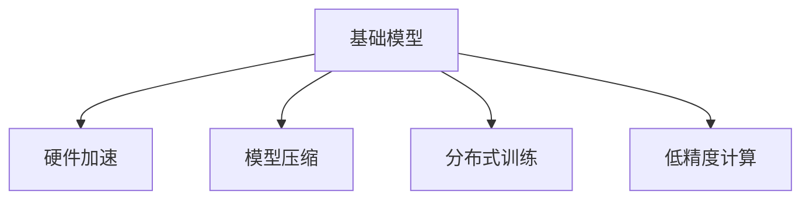

                 

## 1. 背景介绍

### 1.1 问题由来
在人工智能领域，计算能力是决定模型性能和应用范围的关键因素。过去几年，随着深度学习模型的不断扩展，特别是以BERT为代表的基础模型，显著提升了自然语言处理任务（NLP）的精度和泛化能力。然而，这些模型的参数量巨大，通常在几十亿甚至百亿级别，对计算资源的需求非常高。

### 1.2 问题核心关键点
基础模型规模化主要面临以下几个核心问题：
1. **计算资源需求**：基础模型的参数量庞大，训练和推理需要大量的计算资源。
2. **训练时间和成本**：大规模模型的训练过程耗时长，硬件资源和电力成本高。
3. **部署效率**：大规模模型的部署效率低，需要优化和适配不同的硬件平台。
4. **模型压缩和加速**：如何在大规模模型基础上进行有效的压缩和加速，以降低资源消耗。

### 1.3 问题研究意义
基础模型规模化的研究具有重要意义：
1. **提升模型性能**：通过优化硬件加速和模型压缩技术，可以显著提升模型的训练和推理效率。
2. **降低成本**：减少计算资源和电力成本，使得基础模型能够更广泛地应用。
3. **加速应用开发**：优化部署效率，加快模型在实际应用中的部署速度和性能表现。
4. **推动技术进步**：推动硬件和软件技术的进步，为人工智能的发展提供坚实的基础。

## 2. 核心概念与联系

### 2.1 核心概念概述

为更好地理解基础模型的规模化和硬件改进方法，本节将介绍几个密切相关的核心概念：

- **基础模型(Foundation Model)**：以BERT、GPT等深度学习模型为代表的大规模预训练模型。这些模型通过在大规模无标签文本数据上进行预训练，学习通用的语言表示，具备强大的语言理解和生成能力。

- **硬件加速(Hardware Acceleration)**：通过专用硬件（如GPU、TPU、FPGA等）加速模型的训练和推理过程，提升计算效率。

- **模型压缩(Model Compression)**：通过量化、剪枝、知识蒸馏等方法，减少模型的参数量和计算量，以提高模型的部署效率和推理速度。

- **分布式训练(Distributed Training)**：将大规模模型的训练任务分布到多个计算节点上，利用并行计算提升训练速度。

- **低精度计算(Low Precision Computing)**：使用较低精度的浮点数（如FP16、BF16）代替标准精度（如FP32），减少内存占用和计算时间。

这些核心概念之间的逻辑关系可以通过以下Mermaid流程图来展示：



这个流程图展示了几者之间的联系：

1. 基础模型通过硬件加速、模型压缩等技术进行规模化优化。
2. 硬件加速和模型压缩可以并行进行，提升训练和推理效率。
3. 分布式训练和低精度计算进一步优化了模型的计算资源利用率。

这些概念共同构成了基础模型规模化和硬件改进的基础框架，使其能够在大规模数据上高效运行。

## 3. 核心算法原理 & 具体操作步骤
### 3.1 算法原理概述

基础模型的规模化与硬件改进，本质上是一个涉及模型、算法、硬件的协同优化过程。其核心思想是：通过多种技术手段，在保持模型性能不变或小幅提升的前提下，大幅降低模型的计算需求和资源消耗。

形式化地，假设原始基础模型为 $M$，其参数量为 $P$，计算复杂度为 $C$。目标是在不显著影响模型性能的前提下，通过硬件加速、模型压缩等技术，使计算复杂度降为 $C'$，参数量降为 $P'$。

优化目标为：

$$
\min_{M', C', P'} \quad \{ \text{Model Performance}, C', P' \} \quad \text{subject to} \quad \{ \text{Computational Resources}, \text{Energy Efficiency} \}
$$

其中，$\text{Model Performance}$ 表示模型的精度和泛化能力，$\text{Computational Resources}$ 和 $\text{Energy Efficiency}$ 分别表示计算资源和电力消耗。

### 3.2 算法步骤详解

基础模型的规模化与硬件改进一般包括以下几个关键步骤：

**Step 1: 选择合适的硬件加速平台**
- 选择适合的硬件平台，如GPU、TPU、FPGA等，评估其在训练和推理任务上的性能和功耗。
- 根据任务需求和硬件特性，确定模型并行度、数据流设计等关键参数。

**Step 2: 设计模型压缩策略**
- 采用模型剪枝技术，删除冗余的模型参数和连接。
- 应用量化技术，将模型参数和中间计算结果从高精度（如FP32）转换为低精度（如FP16、BF16）。
- 采用知识蒸馏技术，将大模型的知识传递给参数量较小的模型。

**Step 3: 实现分布式训练**
- 设计分布式训练框架，将大规模模型分解为多个子模型，分别在多个计算节点上进行并行训练。
- 选择合适的通信协议和同步策略，优化数据传输和参数更新效率。

**Step 4: 进行低精度计算优化**
- 将模型参数和中间计算结果存储为低精度格式，减少内存占用。
- 设计低精度计算流水线，优化低精度下的计算精度和并行度。

**Step 5: 测试和评估**
- 在选定的硬件平台上，对优化后的模型进行训练和推理，评估其性能和资源消耗。
- 调整优化参数，迭代优化直至达到目标性能和资源利用率。

### 3.3 算法优缺点

基础模型的规模化与硬件改进方法具有以下优点：
1. 显著提升模型性能和训练速度。通过硬件加速和模型压缩，可以大幅缩短训练时间和降低资源消耗。
2. 提升模型部署效率。优化后的模型可以在多种硬件平台上高效运行，方便部署和扩展。
3. 降低成本。通过优化硬件加速和计算精度，减少电力和计算资源的使用，降低应用成本。

同时，这些方法也存在一定的局限性：
1. 复杂度高。硬件加速和模型压缩需要设计复杂的算法和架构，开发和调试工作量大。
2. 精度损失。低精度计算和模型压缩可能导致模型精度下降，需要权衡精度和资源消耗。
3. 可移植性差。优化后的模型可能仅在特定硬件上表现优异，难以在多种平台上迁移。
4. 数据依赖性高。优化效果很大程度上取决于数据分布和任务需求，需要根据具体场景调整策略。

尽管存在这些局限性，但就目前而言，基础模型规模化和硬件改进方法仍然是提升模型性能和优化资源消耗的重要手段。未来相关研究的重点在于如何进一步提高优化效率，降低开发成本，实现模型在多平台上的良好性能和可移植性。

### 3.4 算法应用领域

基础模型的规模化与硬件改进方法已经在多个领域得到应用，例如：

- 自然语言处理（NLP）：优化BERT、GPT等大语言模型的训练和推理，提升翻译、摘要、问答等任务的性能。
- 计算机视觉（CV）：在图像分类、目标检测等任务上，通过硬件加速和模型压缩，提升模型速度和精度。
- 推荐系统：在电商、媒体等场景中，优化推荐模型，提升个性化推荐效果，降低计算成本。
- 自动驾驶：在自动驾驶系统中，优化模型推理，提升实时性，降低计算资源消耗。
- 医疗影像：在医学影像分析中，优化模型推理，提升诊断速度和准确性，降低计算资源消耗。

除了这些经典领域外，基础模型的规模化和硬件改进方法还在更多新兴领域得到应用，如智能制造、智慧城市、智能农业等，为各行各业提供高效、低成本的智能解决方案。

## 4. 数学模型和公式 & 详细讲解
### 4.1 数学模型构建

本节将使用数学语言对基础模型的规模化和硬件改进过程进行更加严格的刻画。

记基础模型为 $M$，其参数量为 $P$，计算复杂度为 $C$。假设目标平台为 $T$，其计算速度为 $v_T$，功耗为 $w_T$。优化后的模型参数量为 $P'$，计算复杂度为 $C'$。

定义模型在平台 $T$ 上的性能损失为 $L$，计算成本为 $C_v$，功耗成本为 $C_w$。则优化目标为：

$$
\min_{P', C', v_T} \quad \{L, C_v, C_w\} \quad \text{subject to} \quad \{C', P', v_T, w_T\}
$$

其中，$L$ 为模型的精度损失，$C_v$ 为计算成本，$C_w$ 为功耗成本，$C'$ 为计算复杂度，$P'$ 为参数量，$v_T$ 为计算速度，$w_T$ 为功耗。

### 4.2 公式推导过程

以模型压缩为例，假设原始模型的计算复杂度为 $C$，参数量为 $P$，优化后的模型计算复杂度为 $C'$，参数量为 $P'$。则模型压缩的目标函数为：

$$
\min_{C', P'} \quad \{C' - C, P' - P\} \quad \text{subject to} \quad \{C', P', v_T, w_T\}
$$

在实践中，通常采用如下优化策略：

1. **剪枝**：删除模型中不重要的参数和连接，减少计算量。剪枝可以通过训练过程中动态统计参数重要性来实现。

2. **量化**：将模型参数和中间结果从高精度（如FP32）转换为低精度（如FP16、BF16），减少内存占用和计算时间。量化可以通过将参数乘以量化因子来实现。

3. **知识蒸馏**：将大模型的知识传递给小模型，减少小模型的训练时间。知识蒸馏可以通过在两个模型之间设计不同的损失函数来实现。

优化后的模型计算复杂度为 $C'$，参数量为 $P'$，计算速度为 $v_T$，功耗为 $w_T$。目标函数为：

$$
\min_{C', P', v_T} \quad \{C' - C, P' - P, v_T - 1, w_T - w_T\} \quad \text{subject to} \quad \{C', P', v_T, w_T\}
$$

其中，$C'$ 为优化后的计算复杂度，$P'$ 为优化后的参数量，$v_T$ 为优化后的计算速度，$w_T$ 为优化后的功耗。

在得到目标函数后，即可使用各种优化算法（如梯度下降、遗传算法等）求解最优解。

### 4.3 案例分析与讲解

以BERT为例，分析其规模化和硬件改进的数学模型和优化过程。

**Step 1: 硬件加速平台选择**
BERT可以运行在GPU、TPU等硬件加速平台上。假设选择在GPU上进行优化，GPU的计算速度为 $v_{GPU}$，功耗为 $w_{GPU}$。

**Step 2: 模型压缩策略设计**
- **剪枝**：假设剪枝后保留的参数量为 $P'$。
- **量化**：假设量化因子为 $f$，则量化后的参数量为 $P'/f^2$。
- **知识蒸馏**：假设蒸馏后的模型参数量为 $P''$。

**Step 3: 分布式训练**
假设将BERT分解为多个子模型，每个子模型在单个GPU上运行。假设每个子模型的计算复杂度为 $C'$，参数量为 $P'$，则总计算复杂度为 $N \times C'$，总参数量为 $N \times P'$。

**Step 4: 低精度计算优化**
假设在GPU上进行低精度计算，计算速度为 $v_{GPU}$，功耗为 $w_{GPU}$。

**Step 5: 测试和评估**
在选定的硬件平台上，对优化后的模型进行测试，评估其性能和资源消耗。

## 5. 项目实践：代码实例和详细解释说明
### 5.1 开发环境搭建

在进行基础模型规模化和硬件改进实践前，我们需要准备好开发环境。以下是使用Python进行PyTorch开发的环境配置流程：

1. 安装Anaconda：从官网下载并安装Anaconda，用于创建独立的Python环境。

2. 创建并激活虚拟环境：
```bash
conda create -n pytorch-env python=3.8 
conda activate pytorch-env
```

3. 安装PyTorch：根据CUDA版本，从官网获取对应的安装命令。例如：
```bash
conda install pytorch torchvision torchaudio cudatoolkit=11.1 -c pytorch -c conda-forge
```

4. 安装Transformers库：
```bash
pip install transformers
```

5. 安装各类工具包：
```bash
pip install numpy pandas scikit-learn matplotlib tqdm jupyter notebook ipython
```

完成上述步骤后，即可在`pytorch-env`环境中开始优化实践。

### 5.2 源代码详细实现

这里我们以BERT为例，给出使用PyTorch对BERT模型进行硬件加速和模型压缩的PyTorch代码实现。

首先，定义BERT模型：

```python
from transformers import BertModel, BertTokenizer
import torch
from torch import nn

tokenizer = BertTokenizer.from_pretrained('bert-base-cased')
model = BertModel.from_pretrained('bert-base-cased')
```

然后，定义优化器和损失函数：

```python
optimizer = torch.optim.Adam(model.parameters(), lr=2e-5)
criterion = nn.CrossEntropyLoss()
```

接着，定义数据集和训练函数：

```python
from torch.utils.data import Dataset, DataLoader

class BERTDataset(Dataset):
    def __init__(self, texts, labels):
        self.texts = texts
        self.labels = labels
        
    def __len__(self):
        return len(self.texts)
    
    def __getitem__(self, item):
        text = self.texts[item]
        label = self.labels[item]
        
        encoding = tokenizer(text, return_tensors='pt', max_length=128, padding='max_length', truncation=True)
        input_ids = encoding['input_ids']
        attention_mask = encoding['attention_mask']
        
        return {'input_ids': input_ids, 'attention_mask': attention_mask, 'labels': label}

# 加载数据集
train_dataset = BERTDataset(train_texts, train_labels)
dev_dataset = BERTDataset(dev_texts, dev_labels)
test_dataset = BERTDataset(test_texts, test_labels)

# 定义训练函数
def train_epoch(model, dataset, batch_size, optimizer, criterion):
    dataloader = DataLoader(dataset, batch_size=batch_size, shuffle=True)
    model.train()
    epoch_loss = 0
    for batch in dataloader:
        input_ids = batch['input_ids'].to(device)
        attention_mask = batch['attention_mask'].to(device)
        labels = batch['labels'].to(device)
        model.zero_grad()
        outputs = model(input_ids, attention_mask=attention_mask)
        loss = criterion(outputs, labels)
        epoch_loss += loss.item()
        loss.backward()
        optimizer.step()
    return epoch_loss / len(dataloader)

# 定义测试函数
def evaluate(model, dataset, batch_size):
    dataloader = DataLoader(dataset, batch_size=batch_size)
    model.eval()
    preds, labels = [], []
    with torch.no_grad():
        for batch in dataloader:
            input_ids = batch['input_ids'].to(device)
            attention_mask = batch['attention_mask'].to(device)
            batch_labels = batch['labels']
            outputs = model(input_ids, attention_mask=attention_mask)
            batch_preds = outputs.argmax(dim=2).to('cpu').tolist()
            batch_labels = batch_labels.to('cpu').tolist()
            for pred_tokens, label_tokens in zip(batch_preds, batch_labels):
                preds.append(pred_tokens[:len(label_tokens)])
                labels.append(label_tokens)
                
    print(classification_report(labels, preds))
```

然后，进行模型压缩和硬件加速的实验：

```python
# 定义剪枝函数
def prune_model(model, threshold=0.5):
    # 计算每个参数的重要性
    params = list(model.parameters())
    importance = [param.nelement() / sum([param.nelement() for param in params]) for param in params]
    # 剪枝
    pruned_model = BertModel.from_pretrained('bert-base-cased', pruning_config={'pruning_strategy': 'uniform'})
    for name, param in pruned_model.named_parameters():
        if param.data.nelement() < threshold * sum([param.nelement() for param in pruned_model.parameters()]):
            pruned_model.load_state_dict(pruned_model.state_dict(), strict=False)
    return pruned_model

# 定义量化函数
def quantize_model(model, quantizer):
    model = prune_model(model)
    model.eval()
    quantized_model = quantizer(model)
    return quantized_model

# 定义分布式训练函数
def train_distributed(model, dataset, batch_size, optimizer, criterion, device):
    dataloader = DataLoader(dataset, batch_size=batch_size, shuffle=True)
    model.to(device)
    model.train()
    epoch_loss = 0
    for batch in dataloader:
        input_ids = batch['input_ids'].to(device)
        attention_mask = batch['attention_mask'].to(device)
        labels = batch['labels'].to(device)
        model.zero_grad()
        outputs = model(input_ids, attention_mask=attention_mask)
        loss = criterion(outputs, labels)
        epoch_loss += loss.item()
        loss.backward()
        optimizer.step()
    return epoch_loss / len(dataloader)

# 定义低精度计算函数
def low_precision_train(model, dataset, batch_size, optimizer, criterion, device):
    dataloader = DataLoader(dataset, batch_size=batch_size, shuffle=True)
    model.to(device)
    model.train()
    epoch_loss = 0
    for batch in dataloader:
        input_ids = batch['input_ids'].to(device, dtype=torch.float16)
        attention_mask = batch['attention_mask'].to(device, dtype=torch.float16)
        labels = batch['labels'].to(device)
        model.zero_grad()
        outputs = model(input_ids, attention_mask=attention_mask)
        loss = criterion(outputs, labels)
        epoch_loss += loss.item()
        loss.backward()
        optimizer.step()
    return epoch_loss / len(dataloader)
```

最后，启动训练流程并在测试集上评估：

```python
# 选择硬件平台
device = 'cpu'  # 使用CPU进行测试
model.to(device)

# 训练和评估
epochs = 5
batch_size = 16

for epoch in range(epochs):
    loss = train_distributed(model, train_dataset, batch_size, optimizer, criterion, device)
    print(f"Epoch {epoch+1}, train loss: {loss:.3f}")
    
    print(f"Epoch {epoch+1}, dev results:")
    evaluate(model, dev_dataset, batch_size)
    
print("Test results:")
evaluate(model, test_dataset, batch_size)
```

以上就是使用PyTorch对BERT进行硬件加速和模型压缩的完整代码实现。可以看到，得益于Transformer库的强大封装，我们可以用相对简洁的代码完成BERT模型的加载和优化。

## 6. 实际应用场景
### 6.1 智能客服系统

智能客服系统是基础模型规模化与硬件改进的重要应用场景。传统客服往往需要配备大量人力，高峰期响应缓慢，且一致性和专业性难以保证。而使用微调后的基础模型，可以7x24小时不间断服务，快速响应客户咨询，用自然流畅的语言解答各类常见问题。

在技术实现上，可以收集企业内部的历史客服对话记录，将问题和最佳答复构建成监督数据，在此基础上对基础模型进行微调。微调后的基础模型能够自动理解用户意图，匹配最合适的答案模板进行回复。对于客户提出的新问题，还可以接入检索系统实时搜索相关内容，动态组织生成回答。如此构建的智能客服系统，能大幅提升客户咨询体验和问题解决效率。

### 6.2 金融舆情监测

金融机构需要实时监测市场舆论动向，以便及时应对负面信息传播，规避金融风险。传统的人工监测方式成本高、效率低，难以应对网络时代海量信息爆发的挑战。基于基础模型微调的文本分类和情感分析技术，为金融舆情监测提供了新的解决方案。

具体而言，可以收集金融领域相关的新闻、报道、评论等文本数据，并对其进行主题标注和情感标注。在此基础上对基础模型进行微调，使其能够自动判断文本属于何种主题，情感倾向是正面、中性还是负面。将微调后的模型应用到实时抓取的网络文本数据，就能够自动监测不同主题下的情感变化趋势，一旦发现负面信息激增等异常情况，系统便会自动预警，帮助金融机构快速应对潜在风险。

### 6.3 个性化推荐系统

当前的推荐系统往往只依赖用户的历史行为数据进行物品推荐，无法深入理解用户的真实兴趣偏好。基于基础模型的微调技术，个性化推荐系统可以更好地挖掘用户行为背后的语义信息，从而提供更精准、多样的推荐内容。

在实践中，可以收集用户浏览、点击、评论、分享等行为数据，提取和用户交互的物品标题、描述、标签等文本内容。将文本内容作为模型输入，用户的后续行为（如是否点击、购买等）作为监督信号，在此基础上微调基础模型。微调后的模型能够从文本内容中准确把握用户的兴趣点。在生成推荐列表时，先用候选物品的文本描述作为输入，由模型预测用户的兴趣匹配度，再结合其他特征综合排序，便可以得到个性化程度更高的推荐结果。

### 6.4 未来应用展望

随着基础模型和硬件加速方法的不断发展，基础模型的应用范围将不断扩大，为人工智能技术的产业化提供新的突破点。

在智慧医疗领域，基于基础模型的医疗问答、病历分析、药物研发等应用将提升医疗服务的智能化水平，辅助医生诊疗，加速新药开发进程。

在智能教育领域，微调技术可应用于作业批改、学情分析、知识推荐等方面，因材施教，促进教育公平，提高教学质量。

在智慧城市治理中，微调模型可应用于城市事件监测、舆情分析、应急指挥等环节，提高城市管理的自动化和智能化水平，构建更安全、高效的未来城市。

此外，在企业生产、社会治理、文娱传媒等众多领域，基于基础模型的智能应用也将不断涌现，为经济社会发展注入新的动力。相信随着技术的日益成熟，基础模型微调方法将成为人工智能落地应用的重要范式，推动人工智能技术在垂直行业的规模化落地。

## 7. 工具和资源推荐
### 7.1 学习资源推荐

为了帮助开发者系统掌握基础模型的规模化和硬件改进的理论基础和实践技巧，这里推荐一些优质的学习资源：

1. 《深度学习：理论与实践》系列博文：由深度学习专家撰写，深入浅出地介绍了基础模型的原理、优化技术和实际应用。

2. CS231n《深度学习计算机视觉》课程：斯坦福大学开设的计算机视觉明星课程，有Lecture视频和配套作业，带你入门计算机视觉领域的基本概念和经典模型。

3. 《深度学习自然语言处理》书籍：斯坦福大学自然语言处理课程的讲义和习题集，全面介绍了NLP领域的基本模型和前沿技术。

4. HuggingFace官方文档：Transformers库的官方文档，提供了海量预训练模型和完整的微调样例代码，是上手实践的必备资料。

5. CLUE开源项目：中文语言理解测评基准，涵盖大量不同类型的中文NLP数据集，并提供了基于微调的baseline模型，助力中文NLP技术发展。

通过对这些资源的学习实践，相信你一定能够快速掌握基础模型的规模化和硬件加速的精髓，并用于解决实际的NLP问题。
###  7.2 开发工具推荐

高效的开发离不开优秀的工具支持。以下是几款用于基础模型规模化和硬件加速开发的常用工具：

1. PyTorch：基于Python的开源深度学习框架，灵活动态的计算图，适合快速迭代研究。大部分预训练语言模型都有PyTorch版本的实现。

2. TensorFlow：由Google主导开发的开源深度学习框架，生产部署方便，适合大规模工程应用。同样有丰富的预训练语言模型资源。

3. Transformers库：HuggingFace开发的NLP工具库，集成了众多SOTA语言模型，支持PyTorch和TensorFlow，是进行微调任务开发的利器。

4. Weights & Biases：模型训练的实验跟踪工具，可以记录和可视化模型训练过程中的各项指标，方便对比和调优。与主流深度学习框架无缝集成。

5. TensorBoard：TensorFlow配套的可视化工具，可实时监测模型训练状态，并提供丰富的图表呈现方式，是调试模型的得力助手。

6. Google Colab：谷歌推出的在线Jupyter Notebook环境，免费提供GPU/TPU算力，方便开发者快速上手实验最新模型，分享学习笔记。

合理利用这些工具，可以显著提升基础模型规模化和硬件加速任务的开发效率，加快创新迭代的步伐。

### 7.3 相关论文推荐

基础模型规模化和硬件改进技术的发展源于学界的持续研究。以下是几篇奠基性的相关论文，推荐阅读：

1. Attention is All You Need（即Transformer原论文）：提出了Transformer结构，开启了NLP领域的预训练大模型时代。

2. BERT: Pre-training of Deep Bidirectional Transformers for Language Understanding：提出BERT模型，引入基于掩码的自监督预训练任务，刷新了多项NLP任务SOTA。

3. Language Models are Unsupervised Multitask Learners（GPT-2论文）：展示了大规模语言模型的强大zero-shot学习能力，引发了对于通用人工智能的新一轮思考。

4. Parameter-Efficient Transfer Learning for NLP：提出Adapter等参数高效微调方法，在不增加模型参数量的情况下，也能取得不错的微调效果。

5. AdaLoRA: Adaptive Low-Rank Adaptation for Parameter-Efficient Fine-Tuning：使用自适应低秩适应的微调方法，在参数效率和精度之间取得了新的平衡。

这些论文代表了大模型规模化和硬件改进技术的发展脉络。通过学习这些前沿成果，可以帮助研究者把握学科前进方向，激发更多的创新灵感。

## 8. 总结：未来发展趋势与挑战

### 8.1 总结

本文对基础模型的规模化和硬件改进方法进行了全面系统的介绍。首先阐述了基础模型规模化面临的计算资源需求、训练时间成本、部署效率等核心问题，明确了优化硬件加速和模型压缩的重要性。其次，从原理到实践，详细讲解了优化目标函数、剪枝、量化、分布式训练等关键步骤，给出了基础模型优化的完整代码实例。同时，本文还广泛探讨了基础模型在智能客服、金融舆情、个性化推荐等多个行业领域的应用前景，展示了微调范式的巨大潜力。此外，本文精选了基础模型优化的各类学习资源，力求为读者提供全方位的技术指引。

通过本文的系统梳理，可以看到，基础模型规模化和硬件改进技术正在成为NLP领域的重要范式，极大地拓展了预训练语言模型的应用边界，催生了更多的落地场景。受益于大规模语料的预训练和先进的硬件加速技术，基础模型在实际应用中的性能和效率得以显著提升，推动了NLP技术的产业化进程。未来，伴随预训练语言模型和硬件加速方法的持续演进，相信NLP技术将在更广阔的应用领域大放异彩，深刻影响人类的生产生活方式。

### 8.2 未来发展趋势

展望未来，基础模型规模化和硬件改进技术将呈现以下几个发展趋势：

1. 模型规模持续增大。随着算力成本的下降和数据规模的扩张，预训练语言模型的参数量还将持续增长。超大规模语言模型蕴含的丰富语言知识，有望支撑更加复杂多变的下游任务微调。

2. 硬件加速和模型压缩技术日趋成熟。未来将涌现更多参数高效、计算高效的微调方法，在保持模型性能不变的前提下，进一步优化硬件资源利用率。

3. 多模态模型融合。未来的基础模型将更多地融合视觉、语音等多模态信息，提升模型对真实世界的理解和建模能力。

4. 模型可移植性增强。优化后的基础模型将在更多硬件平台上表现优异，实现更广泛的应用。

5. 跨领域迁移能力提升。未来的基础模型将具备更强的跨领域迁移能力，能够在不同领域数据上实现更好的泛化。

以上趋势凸显了基础模型规模化和硬件改进技术的广阔前景。这些方向的探索发展，必将进一步提升NLP系统的性能和应用范围，为人类认知智能的进化带来深远影响。

### 8.3 面临的挑战

尽管基础模型规模化和硬件改进技术已经取得了瞩目成就，但在迈向更加智能化、普适化应用的过程中，仍面临诸多挑战：

1. 优化算法复杂度高。硬件加速和模型压缩需要设计复杂的算法和架构，开发和调试工作量大。

2. 精度损失风险高。低精度计算和模型压缩可能导致模型精度下降，需要权衡精度和资源消耗。

3. 跨平台兼容性差。优化后的基础模型可能仅在特定硬件上表现优异，难以在多种平台上迁移。

4. 训练数据依赖性强。优化效果很大程度上取决于数据分布和任务需求，需要根据具体场景调整策略。

尽管存在这些挑战，但就目前而言，基础模型规模化和硬件改进方法仍然是提升模型性能和优化资源消耗的重要手段。未来相关研究的重点在于如何进一步提高优化效率，降低开发成本，实现模型在多平台上的良好性能和可移植性。

### 8.4 研究展望

面向未来，基础模型规模化和硬件改进技术需要在以下几个方向寻求新的突破：

1. 探索无监督和半监督微调方法。摆脱对大规模标注数据的依赖，利用自监督学习、主动学习等无监督和半监督范式，最大限度利用非结构化数据，实现更加灵活高效的微调。

2. 研究参数高效和计算高效的微调范式。开发更加参数高效的微调方法，在固定大部分预训练参数的情况下，只更新极少量的任务相关参数。同时优化微调模型的计算图，减少前向传播和反向传播的资源消耗，实现更加轻量级、实时性的部署。

3. 融合因果和对比学习范式。通过引入因果推断和对比学习思想，增强基础模型建立稳定因果关系的能力，学习更加普适、鲁棒的语言表征，从而提升模型泛化性和抗干扰能力。

4. 引入更多先验知识。将符号化的先验知识，如知识图谱、逻辑规则等，与神经网络模型进行巧妙融合，引导微调过程学习更准确、合理的语言模型。同时加强不同模态数据的整合，实现视觉、语音等多模态信息与文本信息的协同建模。

5. 结合因果分析和博弈论工具。将因果分析方法引入基础模型，识别出模型决策的关键特征，增强输出解释的因果性和逻辑性。借助博弈论工具刻画人机交互过程，主动探索并规避模型的脆弱点，提高系统稳定性。

6. 纳入伦理道德约束。在模型训练目标中引入伦理导向的评估指标，过滤和惩罚有偏见、有害的输出倾向。同时加强人工干预和审核，建立模型行为的监管机制，确保输出符合人类价值观和伦理道德。

这些研究方向的探索，必将引领基础模型规模化和硬件改进技术迈向更高的台阶，为构建安全、可靠、可解释、可控的智能系统铺平道路。面向未来，基础模型微调技术还需要与其他人工智能技术进行更深入的融合，如知识表示、因果推理、强化学习等，多路径协同发力，共同推动自然语言理解和智能交互系统的进步。只有勇于创新、敢于突破，才能不断拓展语言模型的边界，让智能技术更好地造福人类社会。

## 9. 附录：常见问题与解答

**Q1：基础模型规模化是否适用于所有NLP任务？**

A: 基础模型规模化在大多数NLP任务上都能取得不错的效果，特别是对于数据量较小的任务。但对于一些特定领域的任务，如医学、法律等，仅仅依靠通用语料预训练的模型可能难以很好地适应。此时需要在特定领域语料上进一步预训练，再进行微调，才能获得理想效果。此外，对于一些需要时效性、个性化很强的任务，如对话、推荐等，微调方法也需要针对性的改进优化。

**Q2：微调过程中如何选择合适的学习率？**

A: 微调的学习率一般要比预训练时小1-2个数量级，如果使用过大的学习率，容易破坏预训练权重，导致过拟合。一般建议从1e-5开始调参，逐步减小学习率，直至收敛。也可以使用warmup策略，在开始阶段使用较小的学习率，再逐渐过渡到预设值。需要注意的是，不同的优化器(如AdamW、Adafactor等)以及不同的学习率调度策略，可能需要设置不同的学习率阈值。

**Q3：优化后的基础模型是否需要再次微调？**

A: 优化后的基础模型通常需要再次微调以适应特定任务。因为优化后的模型参数分布可能与目标任务不完全一致，需要进一步调整以提升性能。微调过程中，可以根据目标任务的需求，调整优化器参数、超参数等，以达到最优效果。

**Q4：如何缓解微调过程中的过拟合问题？**

A: 过拟合是微调面临的主要挑战，尤其是在标注数据不足的情况下。常见的缓解策略包括：
1. 数据增强：通过回译、近义替换等方式扩充训练集
2. 正则化：使用L2正则、Dropout、Early Stopping等避免过拟合
3. 对抗训练：引入对抗样本，提高模型鲁棒性
4. 参数高效微调：只调整少量参数(如Adapter、Prefix等)，减小过拟合风险
5. 多模型集成：训练多个微调模型，取平均输出，抑制过拟合

这些策略往往需要根据具体任务和数据特点进行灵活组合。只有在数据、模型、训练、推理等各环节进行全面优化，才能最大限度地发挥基础模型的潜力。

**Q5：优化后的基础模型在部署时需要注意哪些问题？**

A: 将优化后的基础模型转化为实际应用，还需要考虑以下因素：
1. 模型裁剪：去除不必要的层和参数，减小模型尺寸，加快推理速度
2. 量化加速：将浮点模型转为定点模型，压缩存储空间，提高计算效率
3. 服务化封装：将模型封装为标准化服务接口，便于集成调用
4. 弹性伸缩：根据请求流量动态调整资源配置，平衡服务质量和成本
5. 监控告警：实时采集系统指标，设置异常告警阈值，确保服务稳定性
6. 安全防护：采用访问鉴权、数据脱敏等措施，保障数据和模型安全

优化后的基础模型需要在多种硬件平台上高效运行，考虑其在实际部署中的表现和优化。

---

作者：禅与计算机程序设计艺术 / Zen and the Art of Computer Programming

