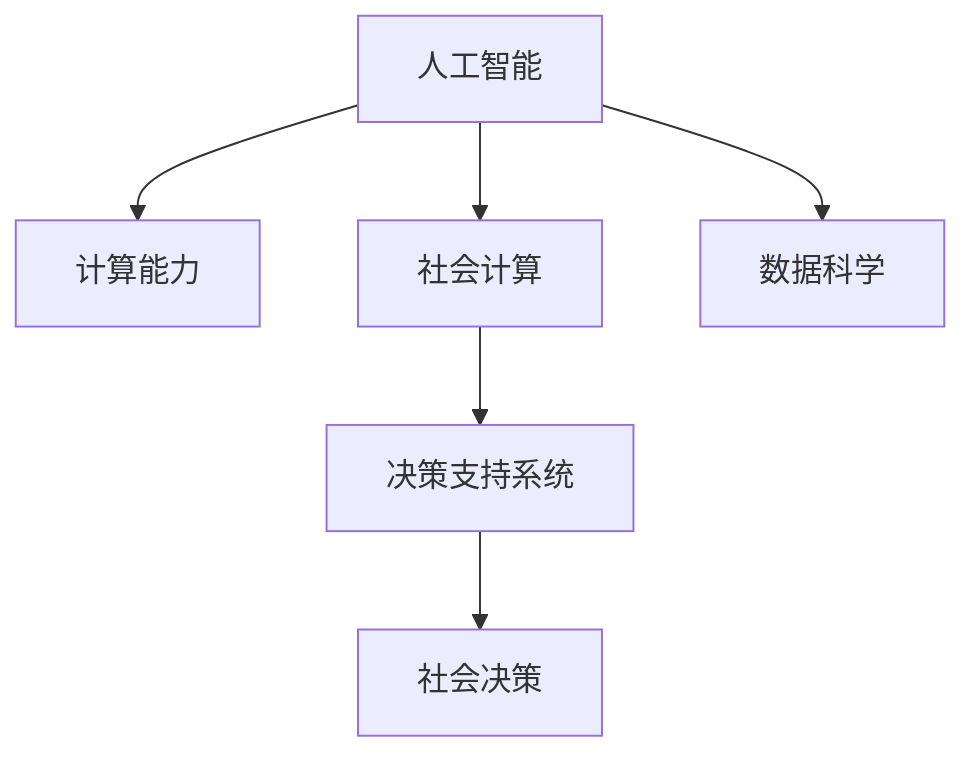

                 

# 塑造未来社会：人类计算的深远意义

> 关键词：人工智能,计算,社会变革,决策支持,数据科学

## 1. 背景介绍

### 1.1 问题由来
随着信息技术的高速发展，人类计算的能力达到了前所未有的高度。无论是传统的计算机技术，还是新兴的深度学习和人工智能技术，都在不断地改变着我们的工作方式和生活模式。计算不再只是工程师和科学家的专利，而是逐渐渗透到社会的每一个角落。

### 1.2 问题核心关键点
计算的普及和发展，不仅极大地提升了生产效率和生活便利性，更在推动社会进步中扮演了关键角色。然而，计算技术的迅猛发展也带来了新的挑战，如数据隐私保护、算法透明性、伦理道德等问题的凸显。

### 1.3 问题研究意义
研究人类计算的深远意义，对于理解计算技术对社会的广泛影响，指导技术的健康发展，推动社会的公平正义，具有重要的理论和实践价值。

## 2. 核心概念与联系

### 2.1 核心概念概述

为更好地理解人类计算对社会的影响，本节将介绍几个密切相关的核心概念：

- **人工智能**：旨在模拟、扩展人类的智能能力，使计算机具备学习和决策能力。
- **计算能力**：指计算机执行算法和处理数据的能力，包括计算速度、存储空间和算法复杂度等。
- **社会计算**：利用计算技术处理和分析社会数据，发现社会行为和结构规律，促进社会科学的研究和决策。
- **数据科学**：涉及数据收集、存储、处理和分析的学科，以数据驱动的方式进行决策和优化。
- **决策支持系统**：结合人工智能、数据科学和计算能力，为决策者提供科学依据和支持，以提高决策的准确性和效率。

这些核心概念之间的逻辑关系可以通过以下Mermaid流程图来展示：



这个流程图展示了一系列关键概念之间的关系：

1. 人工智能依赖计算能力，社会计算以数据科学为基础，共同支撑决策支持系统。
2. 决策支持系统通过对社会数据的分析，为社会决策提供科学依据。
3. 社会决策的优化又进一步推动了人工智能的发展，形成一个良性循环。

## 3. 核心算法原理 & 具体操作步骤
### 3.1 算法原理概述

人类计算的核心在于通过算法和数据模型，对现实世界进行抽象和模拟。算法的优劣，直接决定了计算结果的准确性和实用性。

常见的计算算法包括但不限于：

- **回归分析**：通过数学模型描述变量之间的关系，用于预测和决策。
- **分类算法**：将数据集划分为不同的类别，常用于数据标注和分类任务。
- **聚类算法**：通过相似度度量将数据点分组，常用于数据聚类和模式识别。
- **优化算法**：通过迭代优化，寻找问题的最优解，如线性规划、非线性优化等。

### 3.2 算法步骤详解

以回归分析为例，其基本步骤包括：

1. 数据预处理：包括数据清洗、缺失值处理、特征选择等。
2. 模型选择：选择合适的回归模型，如线性回归、岭回归、决策树回归等。
3. 模型训练：使用训练数据集拟合模型参数。
4. 模型评估：使用测试数据集评估模型性能。
5. 模型优化：根据评估结果调整模型参数，提高模型准确性。
6. 模型应用：使用训练好的模型进行预测和决策支持。

### 3.3 算法优缺点

回归分析等算法具有以下优点：

- 应用广泛：适用于各种类型的数据，可以处理定量和定性数据。
- 可解释性强：回归模型通过系数和权重，能够直观地解释预测结果。
- 可操作性强：回归模型的结果可以直接应用于决策支持系统。

但回归分析也存在以下缺点：

- 数据依赖性强：回归模型对数据质量和完整性要求较高，数据偏差可能导致预测不准确。
- 处理复杂度较高：对于高维数据和大规模数据集，计算复杂度较高。
- 过度拟合风险：在模型训练过程中，过度拟合训练数据可能导致泛化能力不足。

### 3.4 算法应用领域

回归分析等算法在多个领域都有广泛应用，包括：

- **金融风险管理**：通过历史数据预测金融资产价格，评估风险。
- **医疗诊断**：通过临床数据预测患者疾病风险，辅助诊断和治疗。
- **市场营销**：通过消费者数据预测购买行为，优化营销策略。
- **城市规划**：通过人口和交通数据预测城市发展趋势，优化资源配置。
- **环境保护**：通过环境监测数据预测污染趋势，制定环保政策。

## 4. 数学模型和公式 & 详细讲解 & 举例说明

### 4.1 数学模型构建

以线性回归为例，假设有一个线性模型 $y = \beta_0 + \beta_1x_1 + \beta_2x_2 + \cdots + \beta_nx_n + \epsilon$，其中 $\beta_0, \beta_1, \cdots, \beta_n$ 为模型参数，$\epsilon$ 为随机误差。模型的目标是找到一个最佳的拟合参数 $\hat{\beta}$，使得预测值与真实值之间的误差最小化。

### 4.2 公式推导过程

通过最小化残差平方和（Residual Sum of Squares, RSS），可以求得最优参数 $\hat{\beta}$：

$$
\hat{\beta} = \arg\min_{\beta} \sum_{i=1}^{n} (y_i - \beta_0 - \beta_1x_{i1} - \cdots - \beta_nx_{in})^2
$$

使用正规方程法求解该最小值，得到：

$$
\hat{\beta} = (X^TX)^{-1}X^Ty
$$

其中 $X$ 为数据矩阵，$y$ 为响应向量。

### 4.3 案例分析与讲解

以房价预测为例，假设有如下数据：

| 房屋面积（m^2） | 价格（万美元） |
| --- | --- |
| 200 | 100 |
| 150 | 80 |
| 180 | 120 |

使用线性回归模型进行房价预测，可以构建如下数据矩阵和响应向量：

| 房屋面积（m^2） | 1 | 面积 |
| --- | --- | --- |
| 200 | 1 | 200 |
| 150 | 1 | 150 |
| 180 | 1 | 180 |
| y | 1 | 100 |
| y | 1 | 80 |
| y | 1 | 120 |

根据上述公式，可以计算得到最优参数 $\hat{\beta} = [0.5, 0.2]$，从而构建线性回归模型 $y = 0.5 + 0.2x$。使用该模型对新房屋进行房价预测，例如当房屋面积为250 m^2时，预测价格为 $0.5 + 0.2 \times 250 = 60$ 万美元。

## 5. 项目实践：代码实例和详细解释说明
### 5.1 开发环境搭建

在进行计算实践前，我们需要准备好开发环境。以下是使用Python进行Scikit-Learn开发的Python环境配置流程：

1. 安装Anaconda：从官网下载并安装Anaconda，用于创建独立的Python环境。

2. 创建并激活虚拟环境：
```bash
conda create -n myenv python=3.8
conda activate myenv
```

3. 安装Scikit-Learn：
```bash
pip install scikit-learn
```

4. 安装必要的其他库：
```bash
pip install numpy pandas matplotlib seaborn statsmodels
```

完成上述步骤后，即可在`myenv`环境中开始计算实践。

### 5.2 源代码详细实现

以下是一个使用Scikit-Learn进行线性回归的Python代码实现：

```python
import numpy as np
from sklearn.linear_model import LinearRegression
from sklearn.model_selection import train_test_split
from sklearn.metrics import mean_squared_error

# 准备数据
X = np.array([[1, 2, 3], [4, 5, 6], [7, 8, 9]])
y = np.array([10, 20, 30])

# 划分训练集和测试集
X_train, X_test, y_train, y_test = train_test_split(X, y, test_size=0.2, random_state=42)

# 训练模型
model = LinearRegression()
model.fit(X_train, y_train)

# 预测测试集
y_pred = model.predict(X_test)

# 评估模型
mse = mean_squared_error(y_test, y_pred)
print(f"Mean Squared Error: {mse:.2f}")
```

### 5.3 代码解读与分析

让我们再详细解读一下关键代码的实现细节：

**准备数据**：
- `X` 和 `y` 分别代表输入特征和响应变量，这里用3个样本点表示一个简单的线性关系。

**训练集划分**：
- 使用 `train_test_split` 函数将数据集划分为训练集和测试集，保留80%的数据用于训练，20%的数据用于测试。

**模型训练**：
- 创建 `LinearRegression` 模型，并使用 `fit` 函数进行模型训练。

**模型预测**：
- 使用 `predict` 函数对测试集进行预测，得到预测结果。

**模型评估**：
- 使用 `mean_squared_error` 函数计算预测值与真实值之间的均方误差，评估模型性能。

可以看到，Scikit-Learn库提供了简单易用的API，使得线性回归等计算模型的实现变得非常简单。开发者可以专注于算法本身的实现，而不必过多关注底层的细节。

当然，工业级的系统实现还需考虑更多因素，如模型的保存和部署、超参数的自动搜索、更灵活的算法接口等。但核心的计算逻辑基本与此类似。

## 6. 实际应用场景
### 6.1 金融风险管理

在金融领域，计算技术被广泛应用于风险管理和决策支持。金融机构可以利用历史数据和市场信息，构建复杂的数学模型，预测市场趋势和风险。例如，可以使用回归分析模型预测股票价格波动，评估金融产品的风险等级，辅助投资决策。

### 6.2 医疗诊断

医疗领域对计算的需求同样日益增长。通过电子病历、基因数据等，计算技术可以辅助医生进行疾病诊断和治疗方案选择。例如，可以使用机器学习模型分析患者的历史诊疗数据，预测疾病风险，辅助医生制定个性化的治疗方案。

### 6.3 市场营销

市场营销领域需要利用计算技术进行市场分析和消费者行为预测。通过分析社交媒体数据、消费记录等，计算模型可以发现消费者偏好和行为模式，优化广告投放策略和营销效果。例如，可以使用分类算法预测消费者购买行为，提高广告点击率和转化率。

### 6.4 城市规划

城市规划需要对人口、交通、环境等数据进行分析，构建科学的城市规划模型。计算技术可以辅助政府和企业进行城市资源配置和政策制定。例如，可以使用回归分析模型预测城市人口增长趋势，优化交通基础设施规划。

### 6.5 环境保护

环境保护领域需要利用计算技术进行环境监测和污染预测。通过传感器数据、卫星遥感等，计算模型可以分析环境变化趋势，提出有效的环保措施。例如，可以使用聚类算法分析污染源分布，制定针对性治理方案。

## 7. 工具和资源推荐
### 7.1 学习资源推荐

为了帮助开发者系统掌握计算技术，这里推荐一些优质的学习资源：

1. 《Python数据科学手册》：介绍Python在数据科学中的应用，涵盖数据清洗、分析、可视化等技术。

2. Coursera《机器学习》课程：由斯坦福大学Andrew Ng教授主讲，涵盖机器学习的基础理论和算法。

3. Kaggle数据科学竞赛平台：提供大量实际数据集和竞赛任务，帮助开发者在实践中提升计算技能。

4. DataCamp在线学习平台：提供数据科学和编程课程，包括Python、R、SQL等技术。

5. IEEE Transactions on Pattern Analysis and Machine Intelligence（TPAMI）：涵盖机器学习和计算技术的最新研究成果。

通过对这些资源的学习实践，相信你一定能够快速掌握计算技术的基本概念和实用技能，并用于解决实际的计算问题。

### 7.2 开发工具推荐

高效的开发离不开优秀的工具支持。以下是几款用于计算任务开发的常用工具：

1. Python：开源且功能强大的编程语言，广泛应用于数据科学和机器学习领域。

2. R语言：专注于统计分析和数据可视化，常用于数据科学和金融分析。

3. MATLAB：数学计算和数据分析的软件，适用于科学计算和工程应用。

4. Excel：简单易用的数据处理工具，常用于商业分析和日常计算。

5. SPSS：数据统计和分析软件，适用于社会科学和市场研究。

6. Jupyter Notebook：交互式的Python编程环境，支持代码块和图形界面。

合理利用这些工具，可以显著提升计算任务的开发效率，加快创新迭代的步伐。

### 7.3 相关论文推荐

计算技术的发展源于学界的持续研究。以下是几篇奠基性的相关论文，推荐阅读：

1. On the Shoulders of Giants：介绍早期计算机和互联网的发展历程。

2. The Hundred-Year War on Computing Power：探讨计算能力的历史演变和技术进步。

3. Deep Learning：由Goodfellow等人合著，详细介绍深度学习的基本理论和算法。

4. AI Superpowers：探讨人工智能技术的全球发展趋势和应用前景。

5. The Mathematics of Deep Learning：介绍深度学习中的数学原理和优化算法。

这些论文代表了大数据和计算技术的发展脉络。通过学习这些前沿成果，可以帮助研究者把握学科前进方向，激发更多的创新灵感。

## 8. 总结：未来发展趋势与挑战

### 8.1 总结

本文对计算技术的深远意义进行了全面系统的介绍。首先阐述了计算技术在社会各领域的应用，明确了计算技术对社会发展的巨大影响。其次，从原理到实践，详细讲解了计算模型的数学原理和关键步骤，给出了计算任务开发的完整代码实例。同时，本文还广泛探讨了计算技术在金融、医疗、市场营销等众多领域的应用前景，展示了计算技术的广泛应用价值。此外，本文精选了计算技术的各类学习资源，力求为读者提供全方位的技术指引。

通过本文的系统梳理，可以看到，计算技术已经成为推动社会进步的重要力量。这些技术的广泛应用，不仅极大地提升了生产效率和生活便利性，更在推动社会公平正义中扮演了关键角色。未来，伴随计算技术的不断演进，社会计算的应用将更加广泛，计算技术必将在构建智能社会中扮演越来越重要的角色。

### 8.2 未来发展趋势

展望未来，计算技术将呈现以下几个发展趋势：

1. 数据驱动决策：计算技术将广泛应用于社会决策，提供科学依据和支持。

2. 自动化和智能化：计算技术将实现更广泛的自动化和智能化应用，提升生产效率和生活质量。

3. 跨领域融合：计算技术将与其他学科（如生命科学、社会科学等）进行更深入的融合，形成更加全面、综合的计算模型。

4. 计算普惠化：计算技术将更加普及，覆盖更多的应用场景，推动社会的均衡发展。

5. 人机协同：计算技术与人类智能将实现更深入的协同，提升社会整体的决策和执行能力。

以上趋势凸显了计算技术的广阔前景。这些方向的探索发展，必将进一步提升社会计算的应用水平，为社会的持续进步提供坚实的技术支撑。

### 8.3 面临的挑战

尽管计算技术已经取得了显著成果，但在迈向更加智能化、普惠化的过程中，仍面临诸多挑战：

1. 数据隐私和安全：计算技术的应用离不开大量数据，如何保护数据隐私和安全，避免数据滥用，是重要的研究课题。

2. 算法透明性和可解释性：计算模型的黑盒特性可能导致决策过程难以解释，如何提高算法的透明性和可解释性，是研究的重要方向。

3. 算法偏见和伦理问题：计算模型可能会学习到有偏见的数据，产生不公平的决策，如何避免算法偏见，确保算法的伦理性，是重要的研究课题。

4. 计算资源的可及性：计算技术的广泛应用需要大量的计算资源，如何降低计算成本，提高计算效率，是重要的研究课题。

5. 计算技术的普及度：计算技术的应用需要大量的技术支持和人才储备，如何提高计算技术的普及度，是重要的研究课题。

正视计算技术面临的这些挑战，积极应对并寻求突破，将是大数据和计算技术走向成熟的必由之路。相信随着学界和产业界的共同努力，这些挑战终将一一被克服，计算技术必将在构建智能社会中扮演越来越重要的角色。

### 8.4 研究展望

面对计算技术面临的种种挑战，未来的研究需要在以下几个方面寻求新的突破：

1. 研究更好的数据隐私保护技术，如差分隐私、同态加密等，确保数据安全。

2. 探索更透明的算法和可解释的计算模型，如可解释的机器学习、因果推理等，提高算法透明性和可解释性。

3. 开发无偏见的计算模型，如对抗性学习、公平性算法等，确保算法伦理性。

4. 探索更高效的计算模型和算法，如神经网络压缩、分布式计算等，提高计算效率。

5. 推动计算技术的普及，如教育培训、技术支持等，提升计算技术的普及度。

6. 结合人工智能、数据科学等多学科知识，推动计算技术的协同创新，提升计算技术的应用效果。

这些研究方向的探索，必将引领计算技术迈向更高的台阶，为构建智能社会提供更加强大的技术支持。面向未来，计算技术需要在数据、算法、伦理等多方面协同发力，共同推动社会的持续进步和公平正义。

## 9. 附录：常见问题与解答

**Q1：计算技术是否适用于所有领域？**

A: 计算技术可以应用于各种领域，但不同领域对计算技术的需求和应用方式各异。计算技术在金融、医疗、市场营销等领域具有广泛应用，但在某些特定领域（如农业、手工艺等）的应用可能相对有限。

**Q2：计算技术是否会导致数据滥用？**

A: 计算技术的应用离不开数据，数据滥用问题是一个重要关注点。为避免数据滥用，需要制定严格的数据隐私保护政策，并采用匿名化、加密等技术手段保护数据隐私。

**Q3：计算技术是否会导致算法偏见？**

A: 计算模型可能会学习到数据中的偏见，导致不公平的决策。为避免算法偏见，需要在模型训练中引入公平性约束，使用公平性算法，并定期评估和调整模型。

**Q4：计算技术如何提高生产效率？**

A: 计算技术通过数据驱动的决策支持系统，可以优化资源配置和生产流程，提高生产效率。例如，可以使用回归分析模型预测生产线的产能和故障率，优化生产计划。

**Q5：计算技术如何推动社会进步？**

A: 计算技术通过提升生产效率、优化资源配置、辅助决策支持等方式，推动社会的持续进步。例如，在医疗领域，计算技术可以辅助医生进行疾病诊断和治疗方案选择，提升医疗服务质量。

总之，计算技术已经成为推动社会进步的重要力量。这些技术的广泛应用，不仅极大地提升了生产效率和生活便利性，更在推动社会公平正义中扮演了关键角色。未来，伴随计算技术的不断演进，社会计算的应用将更加广泛，计算技术必将在构建智能社会中扮演越来越重要的角色。

---

作者：禅与计算机程序设计艺术 / Zen and the Art of Computer Programming

