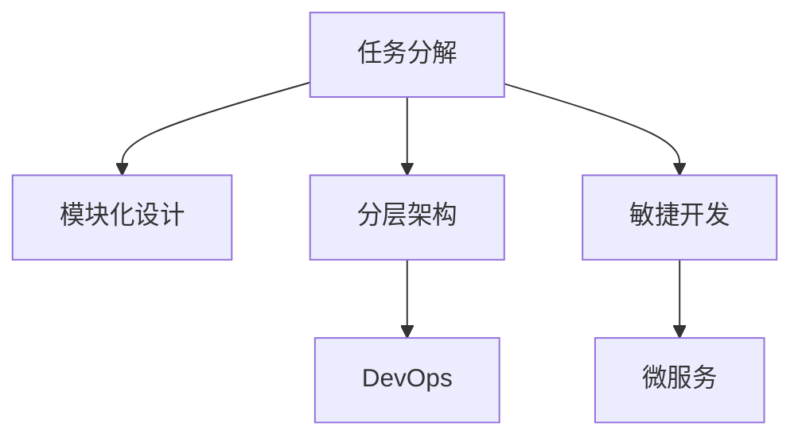

                 

## 1. 背景介绍

### 1.1 问题由来

在软件开发中，特别是大型软件开发项目中，复杂任务的处理常常成为瓶颈。如何把复杂的任务分解为更小、更易管理的部分，是每个软件开发者必须面对的挑战。复杂任务的管理不仅能提高软件开发的效率，还能有效降低开发成本和错误率。本文将深入探讨如何把复杂的任务分解为更小的步骤，并介绍一些常用的技术手段。

### 1.2 问题核心关键点

在软件开发中，复杂的任务通常涉及多个模块、多个团队协作，以及各种技术栈和编程语言。要处理这样的任务，需要采取一些策略和技巧，如模块化设计、分层架构、DevOps 实践等。通过合理的任务分解和项目管理，可以确保各个子任务能够有序推进，最终实现项目的整体目标。

## 2. 核心概念与联系

### 2.1 核心概念概述

本节将介绍几个与复杂任务分解相关的重要概念：

- **任务分解(Task Decomposition)**：将复杂的任务拆解成更小、更易管理的子任务，每个子任务相对独立，可以并行处理。
- **模块化设计(Modular Design)**：将软件系统划分为多个独立的模块，每个模块负责不同的功能，可以单独开发、测试和维护。
- **分层架构(Layered Architecture)**：将系统划分为若干层，每层负责特定的功能，层间通过接口进行通信，提高了系统的灵活性和可维护性。
- **DevOps**：开发和运维的集成，强调持续集成、持续交付和持续监控，提升软件的开发效率和质量。
- **敏捷开发(Agile Development)**：通过迭代开发、灵活调整和团队协作，快速响应市场需求，提升软件开发的速度和质量。
- **微服务(Microservices)**：将大系统拆分为多个小型服务，每个服务独立部署和扩展，提高了系统的可维护性和灵活性。

这些概念之间的逻辑关系可以通过以下 Mermaid 流程图来展示：



这个流程图展示了一些核心概念及其相互之间的关系：

1. 任务分解是模块化设计的基础。
2. 模块化设计有利于分层架构的实现。
3. DevOps 实践与敏捷开发密切相关。
4. 敏捷开发是微服务的基石。
5. 微服务是敏捷开发和 DevOps 的具体体现。

这些概念共同构成了复杂任务管理的基本框架，使得开发者能够系统地处理复杂任务，提升开发效率和软件质量。

## 3. 核心算法原理 & 具体操作步骤

### 3.1 算法原理概述

复杂任务分解的算法原理主要基于以下几个原则：

- **分解可维护性**：将复杂任务拆分为多个子任务，使得每个子任务都可以独立管理和维护。
- **并行处理能力**：通过分解任务，使得多个子任务可以并行处理，提高整体效率。
- **独立开发与测试**：每个子任务独立开发和测试，降低整体项目的风险。
- **资源优化**：通过合理分解任务，优化资源分配，提高项目整体的执行效率。

### 3.2 算法步骤详解

复杂任务分解通常分为以下几个步骤：

**Step 1: 识别主要任务**

首先需要明确整个任务的目标和关键要素，列出所有需要完成的工作。使用**工作分解结构(WBS)方法**，将任务拆分成可管理的小部分。WBS 是一种树状结构，将任务从总体到细节层层分解，确保每个子任务都是明确的和具体的。

**Step 2: 划分模块**

根据任务的目标和功能，将任务分解为若干个模块。模块应该具有独立的功能和接口，可以单独开发、测试和维护。模块化的设计通常采用**MVC（Model-View-Controller）模式**，确保模块之间的松耦合和模块内部的紧密耦合。

**Step 3: 分层设计**

根据功能的重要性和依赖关系，将模块进行分层设计。每层负责特定的功能，层与层之间通过接口进行通信。常用的分层架构有**分层式架构、事件驱动架构**等。

**Step 4: 实现DevOps**

DevOps 强调自动化、持续集成和持续交付。通过自动化工具（如 Jenkins、Travis CI）和容器化技术（如 Docker、Kubernetes），提升开发和部署的效率。同时，采用**持续监控和反馈机制**，及时发现和解决问题。

**Step 5: 敏捷开发**

敏捷开发强调迭代开发和灵活调整。将任务分解为多个迭代，每个迭代包含几个小任务，每个小任务完成后进行评审和验证。使用**Scrum、Kanban**等敏捷框架，提高开发团队的协作和响应速度。

**Step 6: 微服务设计**

将大的系统拆分为多个小型服务，每个服务独立部署和扩展。微服务可以独立开发和测试，具有高可维护性和灵活性。微服务架构通常采用**RESTful API**和**微服务框架（如 Spring Boot、Django）**。

### 3.3 算法优缺点

复杂任务分解的优势：

- **可管理性**：将复杂任务分解为多个子任务，每个子任务相对独立，易于管理和维护。
- **并行处理**：多个子任务可以并行处理，提高整体效率。
- **独立开发与测试**：每个子任务独立开发和测试，降低整体项目的风险。
- **资源优化**：通过合理分解任务，优化资源分配，提高项目整体的执行效率。

复杂任务分解的缺点：

- **分解难度**：复杂任务分解需要经验和技巧，分解不当可能导致任务管理混乱。
- **接口设计**：模块和服务的接口设计需要严谨，否则会影响整体系统的性能和可维护性。
- **通信开销**：模块和服务的通信开销会增加系统的复杂性。
- **测试难度**：模块和服务的测试需要充分考虑相互之间的依赖关系，测试难度增加。

### 3.4 算法应用领域

复杂任务分解的算法和原则在多个领域都有广泛的应用，如软件开发、项目管理、生产制造、系统设计等。具体应用如下：

- **软件开发**：分解为模块和微服务，提高软件开发的效率和可维护性。
- **项目管理**：任务分解为可管理的小任务，提升项目的执行效率。
- **生产制造**：将复杂的生产流程分解为多个环节，优化生产效率和质量。
- **系统设计**：将大系统拆分为小型组件，提高系统的可扩展性和可维护性。

## 4. 数学模型和公式 & 详细讲解 & 举例说明

### 4.1 数学模型构建

复杂任务分解的数学模型通常使用**任务网络图(Task Network Graph)**来表示。任务网络图是一个有向无环图(DAG)，每个节点表示一个任务，节点之间的边表示任务的依赖关系。每个任务可以分解为多个子任务，每个子任务可以进一步分解为更小的任务。

### 4.2 公式推导过程

假设有 $N$ 个任务，用集合 $T=\{t_1, t_2, ..., t_N\}$ 表示。每个任务 $t_i$ 可以分解为 $m_i$ 个子任务 $s_{i,1}, s_{i,2}, ..., s_{i,m_i}$。

任务网络图可以表示为：

$$
G = (T, E)
$$

其中 $T$ 为任务集合，$E$ 为任务依赖关系集合。任务 $t_i$ 和任务 $t_j$ 之间的依赖关系表示为 $(t_i, t_j) \in E$。

任务网络图可以进一步转换为**任务依赖矩阵(Task Dependence Matrix)** $A$，其中 $A_{ij}=1$ 表示任务 $t_i$ 依赖于任务 $t_j$，否则 $A_{ij}=0$。

### 4.3 案例分析与讲解

假设有一个复杂的软件开发任务，需要开发一个在线购物平台。任务分解过程如下：

1. **识别主要任务**：
   - 在线购物平台的开发
   - 数据库的设计和搭建
   - 前端界面的设计和开发
   - 后端服务的设计和开发
   - 用户认证和授权
   - 订单处理和管理

2. **划分模块**：
   - 数据库模块：负责数据存储和管理
   - 前端模块：负责用户界面的设计和开发
   - 后端模块：负责业务逻辑的实现和数据处理
   - 用户认证模块：负责用户身份的验证和授权
   - 订单模块：负责订单的处理和管理

3. **分层设计**：
   - 数据库层：负责数据的存储和查询
   - 业务逻辑层：负责订单、用户、商品等业务的处理
   - 前端层：负责用户界面的展示
   - 安全层：负责用户认证和授权
   - API 层：负责不同模块之间的通信

4. **DevOps 实践**：
   - 使用 Jenkins 进行自动化构建和测试
   - 使用 Docker 和 Kubernetes 进行容器化部署
   - 使用 Prometheus 和 Grafana 进行持续监控

5. **敏捷开发**：
   - 使用 Scrum 框架进行迭代开发
   - 每个迭代包含多个小任务，每个小任务完成后进行评审和验证

6. **微服务设计**：
   - 将在线购物平台拆分为多个微服务，如用户服务、商品服务、订单服务、支付服务等
   - 每个微服务独立部署和扩展
   - 使用 RESTful API 进行服务通信

## 5. 项目实践：代码实例和详细解释说明

### 5.1 开发环境搭建

在进行复杂任务分解的实践前，需要先准备好开发环境。以下是使用 Python 和 Jenkins 搭建开发环境的流程：

1. **安装 Python**：
   - 从官网下载并安装 Python，建议安装 3.8 及以上版本。
   - 安装虚拟环境工具 `virtualenv` 或 `conda`。

2. **安装 Jenkins**：
   - 从官网下载 Jenkins 安装程序，按照安装向导进行安装。
   - 配置 Jenkins 的依赖库，如 Git、Maven、Gradle 等。

3. **配置 DevOps 工具**：
   - 安装 Docker 和 Kubernetes，配置 Jenkins 支持容器化部署。
   - 配置 Jenkins 进行持续集成和持续交付。

### 5.2 源代码详细实现

假设我们的任务是开发一个简单的在线购物平台，使用 Python Flask 框架进行开发。任务分解和实现过程如下：

1. **任务分解**：
   - 数据库设计：使用 SQLAlchemy 进行数据库设计。
   - 前端设计：使用 HTML、CSS、JavaScript 进行前端页面设计。
   - 后端开发：使用 Flask 进行后端服务开发。
   - 用户认证：使用 Flask-Login 进行用户认证。
   - 订单管理：使用 Flask-SQLAlchemy 进行订单管理。

2. **模块划分**：
   - 数据库模块：使用 SQLAlchemy 进行数据库设计和管理。
   - 前端模块：使用 Bootstrap 进行前端页面设计。
   - 后端模块：使用 Flask 进行业务逻辑处理。
   - 用户认证模块：使用 Flask-Login 进行用户认证和授权。
   - 订单模块：使用 Flask-SQLAlchemy 进行订单管理。

3. **分层设计**：
   - 数据库层：使用 SQLAlchemy 进行数据库操作。
   - 业务逻辑层：使用 Flask 进行业务逻辑处理。
   - 前端层：使用 Bootstrap 进行前端页面展示。
   - 安全层：使用 Flask-Login 进行用户认证和授权。
   - API 层：使用 Flask-RESTful 进行 API 服务设计。

4. **DevOps 实践**：
   - 使用 Jenkins 进行自动化构建和测试。
   - 使用 Docker 和 Kubernetes 进行容器化部署。
   - 使用 Prometheus 和 Grafana 进行持续监控。

5. **敏捷开发**：
   - 使用 Scrum 框架进行迭代开发。
   - 每个迭代包含多个小任务，每个小任务完成后进行评审和验证。

### 5.3 代码解读与分析

假设我们使用 Flask 框架进行后端开发，代码如下：

```python
from flask import Flask, render_template, request, jsonify
from flask_sqlalchemy import SQLAlchemy

app = Flask(__name__)
app.config['SQLALCHEMY_DATABASE_URI'] = 'sqlite:////tmp/test.db'
db = SQLAlchemy(app)

class User(db.Model):
    id = db.Column(db.Integer, primary_key=True)
    username = db.Column(db.String(80), unique=True, nullable=False)
    email = db.Column(db.String(120), unique=True, nullable=False)

@app.route('/users', methods=['GET', 'POST'])
def users():
    if request.method == 'POST':
        username = request.form['username']
        email = request.form['email']
        user = User(username=username, email=email)
        db.session.add(user)
        db.session.commit()
        return jsonify({'message': 'User created successfully'})
    else:
        users = User.query.all()
        return render_template('users.html', users=users)

if __name__ == '__main__':
    app.run(debug=True)
```

在这个例子中，我们使用了 Flask 框架进行后端开发，使用了 SQLAlchemy 进行数据库操作。代码通过 HTTP 请求进行处理，使用了 Flask 的路由机制。

## 6. 实际应用场景

### 6.1 软件开发

在软件开发中，复杂任务分解被广泛应用于大中型项目的管理和开发中。例如，开发一个电商平台需要分解为多个模块，如用户管理、商品管理、订单管理、支付系统等。每个模块独立开发、测试和部署，提高了整体项目的效率和质量。

### 6.2 生产制造

在生产制造中，复杂任务分解可以用于优化生产流程。例如，生产一个复杂的机械设备需要分解为多个子任务，如机械设计、零部件制造、组装调试等。每个子任务独立进行，提高了生产效率和质量。

### 6.3 系统设计

在系统设计中，复杂任务分解可以提高系统的可扩展性和可维护性。例如，设计一个分布式系统需要分解为多个模块，如分布式计算、数据存储、系统监控等。每个模块独立设计、开发和部署，提高了系统的整体性能和稳定性。

### 6.4 未来应用展望

随着技术的不断进步，复杂任务分解将更加广泛地应用于各个领域。未来，复杂的任务分解将更多地结合人工智能和大数据技术，例如：

- **自动化任务分解**：通过 AI 技术自动识别任务依赖关系，自动进行任务分解。
- **自适应任务分解**：根据项目进展和团队能力，动态调整任务分解策略。
- **基于大数据的任务分解**：通过大数据分析，发现任务之间的依赖关系，优化任务分解。

## 7. 工具和资源推荐

### 7.1 学习资源推荐

为了帮助开发者系统掌握复杂任务分解的理论基础和实践技巧，这里推荐一些优质的学习资源：

1. **《敏捷开发实践指南》**：一本经典的敏捷开发书籍，详细介绍了敏捷开发的最佳实践和工具。
2. **《微服务架构》**：介绍微服务的概念、设计原则和实现方法，是微服务开发的必备指南。
3. **《DevOps实践指南》**：一本详细介绍 DevOps 实践的书籍，涵盖持续集成、持续交付和持续监控等关键环节。
4. **《复杂系统设计模式》**：一本系统设计领域的经典书籍，介绍了复杂系统设计模式和最佳实践。
5. **《Scrum敏捷管理实践》**：一本详细介绍 Scrum 敏捷管理方法的书籍，提供了敏捷开发的最佳实践和工具。

通过对这些资源的学习实践，相信你一定能够快速掌握复杂任务分解的精髓，并用于解决实际的开发问题。

### 7.2 开发工具推荐

高效的开发离不开优秀的工具支持。以下是几款用于复杂任务分解开发的常用工具：

1. **Jenkins**：开源的持续集成和持续交付工具，支持自动化构建、测试和部署。
2. **Git**：分布式版本控制系统，支持多人协作开发。
3. **Maven**：项目管理工具，支持依赖管理和自动化构建。
4. **Docker**：容器化技术，支持应用的无缝部署和迁移。
5. **Kubernetes**：容器编排工具，支持应用的自动化部署和扩展。
6. **Prometheus**：开源监控系统，支持实时监控和报警。
7. **Grafana**：开源可视化工具，支持数据的实时展示和分析。

合理利用这些工具，可以显著提升复杂任务分解的开发效率，加快创新迭代的步伐。

### 7.3 相关论文推荐

复杂任务分解的研究主要集中在软件工程、系统工程和项目管理等领域。以下是几篇奠基性的相关论文，推荐阅读：

1. **《软件架构模式》**：介绍软件架构模式和最佳实践，是软件架构设计的重要参考资料。
2. **《DevOps实践指南》**：介绍 DevOps 实践和工具，是 DevOps 实践的必备指南。
3. **《复杂任务分解技术研究》**：介绍复杂任务分解的技术和应用，是复杂任务分解研究的经典论文。
4. **《敏捷软件开发实践》**：介绍敏捷开发的最佳实践和工具，是敏捷开发实践的必备指南。
5. **《微服务架构》**：介绍微服务的概念、设计原则和实现方法，是微服务开发的必备指南。

这些论文代表了大规模软件开发和管理的研究方向，通过学习这些前沿成果，可以帮助研究者把握学科前进方向，激发更多的创新灵感。

## 8. 总结：未来发展趋势与挑战

### 8.1 总结

本文对复杂任务分解进行了全面系统的介绍。首先阐述了复杂任务分解的背景和意义，明确了任务分解在软件开发、生产制造、系统设计等多个领域的重要作用。其次，从原理到实践，详细讲解了任务分解的数学模型、分解步骤和关键技术，给出了任务分解任务开发的完整代码实例。同时，本文还探讨了任务分解在软件开发、生产制造、系统设计等多个领域的应用前景，展示了任务分解范式的广泛应用。最后，本文精选了任务分解技术的各类学习资源，力求为读者提供全方位的技术指引。

通过本文的系统梳理，可以看到，复杂任务分解是提高开发效率和项目质量的重要手段。通过任务分解，将复杂的任务拆解为更小、更易管理的子任务，使得每个子任务可以独立管理和维护，最终实现项目的整体目标。未来，伴随技术的发展和应用场景的扩展，复杂任务分解技术将更加深入地应用于各个领域，为软件开发、生产制造、系统设计等提供更加高效、灵活和可维护的解决方案。

### 8.2 未来发展趋势

展望未来，复杂任务分解技术将呈现以下几个发展趋势：

1. **自动化和智能化**：通过 AI 技术自动识别任务依赖关系，自动进行任务分解，提高任务分解的效率和准确性。
2. **自适应和动态调整**：根据项目进展和团队能力，动态调整任务分解策略，适应项目变化。
3. **大数据分析应用**：通过大数据分析，发现任务之间的依赖关系，优化任务分解。
4. **跨领域应用**：复杂任务分解技术将应用于更多领域，如医疗、金融、教育等，提升各领域的工作效率和质量。
5. **持续集成和持续交付**：通过 DevOps 实践，实现持续集成和持续交付，提高任务分解的效率和稳定性。

### 8.3 面临的挑战

尽管复杂任务分解技术已经取得了显著进展，但在应用过程中仍面临一些挑战：

1. **任务分解难度**：复杂任务分解需要经验和技巧，分解不当可能导致任务管理混乱。
2. **接口设计复杂性**：模块和服务的接口设计需要严谨，否则会影响整体系统的性能和可维护性。
3. **通信开销**：模块和服务的通信开销会增加系统的复杂性。
4. **测试难度**：模块和服务的测试需要充分考虑相互之间的依赖关系，测试难度增加。

### 8.4 研究展望

面对复杂任务分解所面临的挑战，未来的研究需要在以下几个方面寻求新的突破：

1. **自动化任务分解算法**：开发更加智能化的任务分解算法，自动进行任务分解和优化。
2. **接口设计优化**：设计更加灵活和高效的接口，减少模块和服务的通信开销。
3. **测试框架改进**：开发更加全面的测试框架，提高模块和服务的测试效率和准确性。
4. **跨领域应用研究**：将复杂任务分解技术应用于更多领域，探索其在其他领域的实际应用效果。

通过这些研究的不断深入，相信复杂任务分解技术将更加高效和广泛地应用于软件开发、生产制造、系统设计等各个领域，为提高工作效率和项目质量提供有力的技术支撑。

## 9. 附录：常见问题与解答

**Q1：如何评估复杂任务分解的效果？**

A: 评估复杂任务分解的效果可以从以下几个方面入手：

1. **任务管理效果**：任务分解是否合理，是否能够支持项目进度和质量管理。
2. **开发效率**：任务分解是否能够提高开发效率，减少开发周期。
3. **系统质量**：任务分解是否能够提高系统的稳定性和可维护性。
4. **团队协作**：任务分解是否能够促进团队协作，提升团队的工作效率。

可以通过跟踪任务进展、统计开发时间、评估系统质量等方法进行效果评估。

**Q2：复杂任务分解是否适用于所有项目？**

A: 复杂任务分解适用于大多数大型项目，尤其是需要多人协作、涉及多个模块和技术的项目。但小规模项目或单个开发人员的项目，任务分解的效果可能不明显。

**Q3：复杂任务分解的缺点有哪些？**

A: 复杂任务分解的缺点包括：

1. **分解难度**：任务分解需要经验和技巧，分解不当可能导致任务管理混乱。
2. **接口设计复杂性**：模块和服务的接口设计需要严谨，否则会影响整体系统的性能和可维护性。
3. **通信开销**：模块和服务的通信开销会增加系统的复杂性。
4. **测试难度**：模块和服务的测试需要充分考虑相互之间的依赖关系，测试难度增加。

**Q4：复杂任务分解与敏捷开发有何关系？**

A: 复杂任务分解与敏捷开发密切相关。敏捷开发强调迭代开发和灵活调整，而复杂任务分解将复杂任务拆分为多个子任务，每个子任务独立开发和测试，符合敏捷开发的理念。通过合理地进行任务分解，可以提升敏捷开发的效果和效率。

**Q5：复杂任务分解与DevOps有何关系？**

A: 复杂任务分解与DevOps紧密相关。DevOps 强调自动化、持续集成和持续交付，而复杂任务分解通过自动化工具和容器化技术，提升开发和部署的效率。同时，复杂任务分解也符合DevOps的持续监控和反馈机制，能够提升系统的稳定性和可维护性。

---

作者：禅与计算机程序设计艺术 / Zen and the Art of Computer Programming

