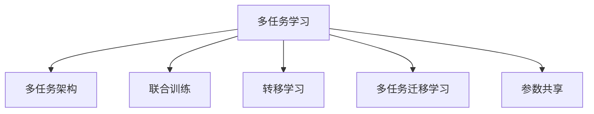
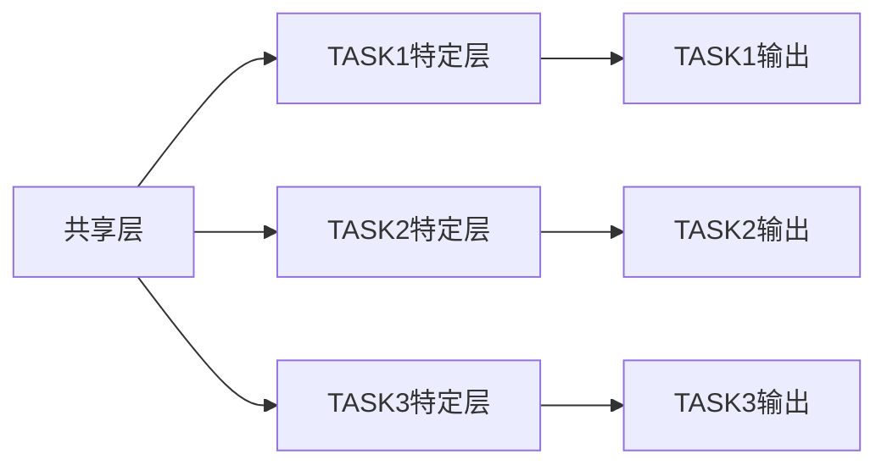

                 

## 1. 背景介绍

在自然语言处理（NLP）领域，单任务学习（Single Task Learning, STL）已经取得了显著的进展，例如在机器翻译、命名实体识别、情感分析等任务中。然而，多任务学习（Multi-task Learning, MTL）近年来受到了越来越多的关注，因为它能够共享学习知识、提高模型性能，并且利用有限的资源获得更好的泛化性能。

MTL通过利用多个相关任务间共享的特征，从而提升单一任务的性能。例如，在多语言翻译任务中，MTL可以通过共享源语言和目标语言的共同特征，提高翻译质量。此外，在情感分析任务中，MTL可以通过共享不同文本类型的特征，提高分析的准确性。

## 2. 核心概念与联系

### 2.1 核心概念概述

为更好地理解多任务学习在NLP中的应用，本节将介绍几个密切相关的核心概念：

- 多任务学习（MTL）：多任务学习是一种利用多个相关任务间共享的特征，以提升单一任务性能的机器学习方法。
- 多任务架构（Multi-task Architecture）：多任务架构指在模型设计中同时包含多个任务的共享层和任务特定层，用于学习不同任务的共同特征和独立特征。
- 联合训练（Joint Training）：联合训练指的是在模型训练过程中，同时优化多个任务的损失函数，以提高模型在所有任务上的表现。
- 转移学习（Transfer Learning）：转移学习指利用在其他任务上已经学习到的知识，提升当前任务的学习效果。
- 多任务迁移学习（Multi-task Transfer Learning）：多任务迁移学习结合了多任务学习和转移学习的思想，利用不同任务间的知识共享，提升当前任务的性能。
- 参数共享（Parameter Sharing）：参数共享是指在模型中共享部分或全部参数，以减少模型复杂度，提高泛化性能。

这些核心概念之间的逻辑关系可以通过以下Mermaid流程图来展示：



这个流程图展示了大语言模型的多任务学习概念以及其核心组件之间的关系。

## 3. 核心算法原理 & 具体操作步骤

### 3.1 算法原理概述

多任务学习的核心思想是利用多个任务之间的相关性，共同学习共享特征和独立特征，从而提高模型的泛化能力和性能。具体来说，多任务学习可以采用联合训练和参数共享两种方式。

- 联合训练：在模型训练过程中，同时优化多个任务的损失函数，使得模型可以学习到多个任务之间的共同特征和独立特征，提升模型在所有任务上的表现。
- 参数共享：在模型中共享部分或全部参数，以减少模型复杂度，提高泛化性能。

### 3.2 算法步骤详解

以下我们将详细介绍多任务学习的算法步骤：

**Step 1: 定义多任务损失函数**

首先，需要定义多任务的联合损失函数，其中每个任务的损失函数可以通过不同的权重进行组合，具体公式如下：

$$
\mathcal{L} = \sum_{i=1}^{n} \alpha_i \mathcal{L}_i
$$

其中，$\mathcal{L}_i$ 为第 $i$ 个任务的损失函数，$\alpha_i$ 为第 $i$ 个任务权重，可以自定义或通过实验调整。

**Step 2: 设计多任务架构**

在模型设计中，可以采用多任务架构，包含多个任务的共享层和任务特定层。共享层用于学习不同任务之间的共同特征，任务特定层用于学习独立特征，具体架构设计可以参考以下示例：



**Step 3: 联合训练**

联合训练是指在模型训练过程中，同时优化多个任务的损失函数，具体步骤如下：

1. 前向传播：将输入数据同时输入到共享层，得到共享特征表示。
2. 任务特定层：将共享特征表示分别输入到各个任务的特定层，得到任务的输出。
3. 损失计算：计算每个任务的损失函数。
4. 反向传播：计算梯度，更新模型参数。
5. 循环迭代：重复以上步骤，直到模型收敛。

**Step 4: 参数共享**

参数共享是指在模型中共享部分或全部参数，以减少模型复杂度，提高泛化性能。具体步骤如下：

1. 确定共享参数：在模型设计中确定共享的参数。
2. 共享参数更新：在联合训练过程中，共享参数更新需要考虑所有任务的损失函数。

### 3.3 算法优缺点

多任务学习在NLP中有以下几个优点：

- 提高泛化性能：通过共享特征，可以提升模型在多个任务上的泛化能力。
- 利用数据资源：多任务学习可以利用更多的数据资源，减少对单一数据集的依赖。
- 提升模型性能：多任务学习可以提高模型在多个任务上的性能，尤其是在数据量较小的情况下。

同时，多任务学习也存在一些缺点：

- 模型复杂度高：多任务学习需要设计复杂的多任务架构，增加了模型复杂度。
- 参数共享困难：共享参数可能会带来模型不稳定的问题。
- 多任务间的干扰：多个任务之间可能会有互相干扰的情况，影响模型性能。

### 3.4 算法应用领域

多任务学习在NLP中已经得到了广泛的应用，覆盖了诸多任务，例如：

- 机器翻译：利用源语言和目标语言之间的共同特征，提升翻译质量。
- 命名实体识别：利用不同文本类型的共同特征，提升命名实体识别的准确性。
- 情感分析：利用不同文本类型的共同特征，提升情感分析的准确性。
- 问答系统：利用不同问题类型的共同特征，提升问答系统的响应质量。
- 文本分类：利用不同文本类型的共同特征，提升文本分类的准确性。

## 4. 数学模型和公式 & 详细讲解 & 举例说明

### 4.1 数学模型构建

本节将使用数学语言对多任务学习的模型构建进行更加严格的刻画。

记多任务学习的模型为 $M_{\theta}$，其中 $\theta$ 为模型参数。设多任务数据集为 $D=\{(x_i, y_i^1, y_i^2, \ldots, y_i^n)\}_{i=1}^N$，其中 $x_i$ 为输入，$y_i^j$ 为第 $j$ 个任务的标签。

定义多任务损失函数为：

$$
\mathcal{L}(\theta) = \sum_{i=1}^{N} \alpha_i \ell_i(\theta(x_i),y_i^1, y_i^2, \ldots, y_i^n)
$$

其中 $\alpha_i$ 为第 $i$ 个任务权重，$\ell_i$ 为第 $i$ 个任务的损失函数。

### 4.2 公式推导过程

以下我们将推导多任务学习的梯度计算公式。

假设模型 $M_{\theta}$ 在输入 $x$ 上的输出为 $\hat{y}_i=M_{\theta}(x)$，其中 $i$ 表示任务序号。定义模型 $M_{\theta}$ 在输入 $x$ 上的损失函数为 $\ell_i(M_{\theta}(x),y_i^1, y_i^2, \ldots, y_i^n)$，则多任务损失函数为：

$$
\mathcal{L}(\theta) = \sum_{i=1}^{N} \alpha_i \ell_i(\hat{y}_i,y_i^1, y_i^2, \ldots, y_i^n)
$$

根据链式法则，损失函数对参数 $\theta_k$ 的梯度为：

$$
\frac{\partial \mathcal{L}(\theta)}{\partial \theta_k} = \sum_{i=1}^{N} \alpha_i \frac{\partial \ell_i(\hat{y}_i,y_i^1, y_i^2, \ldots, y_i^n)}{\partial \hat{y}_i} \frac{\partial \hat{y}_i}{\partial \theta_k}
$$

其中 $\frac{\partial \hat{y}_i}{\partial \theta_k}$ 可进一步递归展开，利用自动微分技术完成计算。

在得到损失函数的梯度后，即可带入联合训练公式，完成模型的迭代优化。重复上述过程直至收敛，最终得到适应多任务数据集的最优模型参数 $\theta^*$。

### 4.3 案例分析与讲解

以多语言翻译任务为例，介绍多任务学习在NLP中的应用。

设源语言为英语，目标语言为法语，任务1为翻译成法语，任务2为翻译成德语。假设训练集为 $\{(x_i,y_i^1,y_i^2)\}_{i=1}^N$，其中 $x_i$ 为英语句子，$y_i^1$ 为翻译成法语的句子，$y_i^2$ 为翻译成德语的句子。

定义任务1的损失函数为交叉熵损失，任务2的损失函数也为交叉熵损失。

多任务损失函数为：

$$
\mathcal{L}(\theta) = \sum_{i=1}^{N} (\alpha_1 \ell_1(\hat{y}_i^1,y_i^1) + \alpha_2 \ell_2(\hat{y}_i^2,y_i^2))
$$

其中 $\alpha_1$ 和 $\alpha_2$ 为任务1和任务2的权重。

在多任务架构中，共享层可以用于学习源语言和目标语言之间的共同特征，任务特定层可以用于学习独立特征。

在联合训练过程中，共享层的参数需要同时考虑两个任务，而任务特定层的参数则只与对应的任务相关。

## 5. 项目实践：代码实例和详细解释说明

### 5.1 开发环境搭建

在进行多任务学习实践前，我们需要准备好开发环境。以下是使用Python进行PyTorch开发的环境配置流程：

1. 安装Anaconda：从官网下载并安装Anaconda，用于创建独立的Python环境。

2. 创建并激活虚拟环境：
```bash
conda create -n pytorch-env python=3.8 
conda activate pytorch-env
```

3. 安装PyTorch：根据CUDA版本，从官网获取对应的安装命令。例如：
```bash
conda install pytorch torchvision torchaudio cudatoolkit=11.1 -c pytorch -c conda-forge
```

4. 安装Transformers库：
```bash
pip install transformers
```

5. 安装各类工具包：
```bash
pip install numpy pandas scikit-learn matplotlib tqdm jupyter notebook ipython
```

完成上述步骤后，即可在`pytorch-env`环境中开始多任务学习的实践。

### 5.2 源代码详细实现

下面我们以机器翻译任务为例，给出使用Transformers库进行多任务学习的PyTorch代码实现。

首先，定义多语言翻译任务的数据处理函数：

```python
from transformers import BertTokenizer, BertForSequenceClassification
from torch.utils.data import Dataset
import torch

class MultilingualTranslationDataset(Dataset):
    def __init__(self, texts, src_lang, tgt_lang, tokenizer, max_len=128):
        self.texts = texts
        self.src_lang = src_lang
        self.tgt_lang = tgt_lang
        self.tokenizer = tokenizer
        self.max_len = max_len
        
    def __len__(self):
        return len(self.texts)
    
    def __getitem__(self, item):
        text = self.texts[item]
        src_lang = self.src_lang[item]
        tgt_lang = self.tgt_lang[item]
        
        encoding = self.tokenizer(text, return_tensors='pt', max_length=self.max_len, padding='max_length', truncation=True)
        input_ids = encoding['input_ids'][0]
        attention_mask = encoding['attention_mask'][0]
        
        # 对token-wise的标签进行编码
        encoded_tags = [tag2id[tag] for tag in tgt_lang] 
        encoded_tags.extend([tag2id['O']] * (self.max_len - len(encoded_tags)))
        labels = torch.tensor(encoded_tags, dtype=torch.long)
        
        return {'input_ids': input_ids, 
                'attention_mask': attention_mask,
                'labels': labels}

# 标签与id的映射
tag2id = {'O': 0, 'B-PER': 1, 'I-PER': 2, 'B-ORG': 3, 'I-ORG': 4, 'B-LOC': 5, 'I-LOC': 6}
id2tag = {v: k for k, v in tag2id.items()}

# 创建dataset
tokenizer = BertTokenizer.from_pretrained('bert-base-cased')

train_dataset = MultilingualTranslationDataset(train_texts, train_src_langs, train_tgt_langs, tokenizer)
dev_dataset = MultilingualTranslationDataset(dev_texts, dev_src_langs, dev_tgt_langs, tokenizer)
test_dataset = MultilingualTranslationDataset(test_texts, test_src_langs, test_tgt_langs, tokenizer)
```

然后，定义模型和优化器：

```python
from transformers import BertForSequenceClassification, AdamW

model = BertForSequenceClassification.from_pretrained('bert-base-cased', num_labels=len(tag2id))

optimizer = AdamW(model.parameters(), lr=2e-5)
```

接着，定义训练和评估函数：

```python
from torch.utils.data import DataLoader
from tqdm import tqdm
from sklearn.metrics import classification_report

device = torch.device('cuda') if torch.cuda.is_available() else torch.device('cpu')
model.to(device)

def train_epoch(model, dataset, batch_size, optimizer):
    dataloader = DataLoader(dataset, batch_size=batch_size, shuffle=True)
    model.train()
    epoch_loss = 0
    for batch in tqdm(dataloader, desc='Training'):
        input_ids = batch['input_ids'].to(device)
        attention_mask = batch['attention_mask'].to(device)
        labels = batch['labels'].to(device)
        model.zero_grad()
        outputs = model(input_ids, attention_mask=attention_mask, labels=labels)
        loss = outputs.loss
        epoch_loss += loss.item()
        loss.backward()
        optimizer.step()
    return epoch_loss / len(dataloader)

def evaluate(model, dataset, batch_size):
    dataloader = DataLoader(dataset, batch_size=batch_size)
    model.eval()
    preds, labels = [], []
    with torch.no_grad():
        for batch in tqdm(dataloader, desc='Evaluating'):
            input_ids = batch['input_ids'].to(device)
            attention_mask = batch['attention_mask'].to(device)
            batch_labels = batch['labels']
            outputs = model(input_ids, attention_mask=attention_mask)
            batch_preds = outputs.logits.argmax(dim=2).to('cpu').tolist()
            batch_labels = batch_labels.to('cpu').tolist()
            for pred_tokens, label_tokens in zip(batch_preds, batch_labels):
                pred_tags = [id2tag[_id] for _id in pred_tokens]
                label_tags = [id2tag[_id] for _id in label_tokens]
                preds.append(pred_tags[:len(label_tokens)])
                labels.append(label_tags)
                
    print(classification_report(labels, preds))
```

最后，启动训练流程并在测试集上评估：

```python
epochs = 5
batch_size = 16

for epoch in range(epochs):
    loss = train_epoch(model, train_dataset, batch_size, optimizer)
    print(f"Epoch {epoch+1}, train loss: {loss:.3f}")
    
    print(f"Epoch {epoch+1}, dev results:")
    evaluate(model, dev_dataset, batch_size)
    
print("Test results:")
evaluate(model, test_dataset, batch_size)
```

以上就是使用PyTorch对BERT进行多语言翻译任务的多任务学习代码实现。可以看到，得益于Transformers库的强大封装，我们可以用相对简洁的代码完成多任务学习的开发。

### 5.3 代码解读与分析

让我们再详细解读一下关键代码的实现细节：

**MultilingualTranslationDataset类**：
- `__init__`方法：初始化文本、源语言、目标语言、分词器等关键组件。
- `__len__`方法：返回数据集的样本数量。
- `__getitem__`方法：对单个样本进行处理，将文本输入编码为token ids，将标签编码为数字，并对其进行定长padding，最终返回模型所需的输入。

**tag2id和id2tag字典**：
- 定义了标签与数字id之间的映射关系，用于将token-wise的预测结果解码回真实的标签。

**训练和评估函数**：
- 使用PyTorch的DataLoader对数据集进行批次化加载，供模型训练和推理使用。
- 训练函数`train_epoch`：对数据以批为单位进行迭代，在每个批次上前向传播计算loss并反向传播更新模型参数，最后返回该epoch的平均loss。
- 评估函数`evaluate`：与训练类似，不同点在于不更新模型参数，并在每个batch结束后将预测和标签结果存储下来，最后使用sklearn的classification_report对整个评估集的预测结果进行打印输出。

**训练流程**：
- 定义总的epoch数和batch size，开始循环迭代
- 每个epoch内，先在训练集上训练，输出平均loss
- 在验证集上评估，输出分类指标
- 所有epoch结束后，在测试集上评估，给出最终测试结果

可以看到，PyTorch配合Transformers库使得多任务学习的代码实现变得简洁高效。开发者可以将更多精力放在数据处理、模型改进等高层逻辑上，而不必过多关注底层的实现细节。

当然，工业级的系统实现还需考虑更多因素，如模型的保存和部署、超参数的自动搜索、更灵活的任务适配层等。但核心的多任务学习范式基本与此类似。

## 6. 实际应用场景
### 6.1 智能客服系统

多任务学习在智能客服系统中也有广泛的应用。传统的客服系统往往需要配备大量人力，高峰期响应缓慢，且一致性和专业性难以保证。通过多任务学习，客服系统可以学习到不同问题类型的共同特征，提升对各种问题的处理能力。

在技术实现上，可以收集企业内部的历史客服对话记录，将问题-回答对作为训练数据，训练多任务学习模型，使其能够自动理解用户意图，匹配最合适的答案模板进行回复。对于客户提出的新问题，还可以接入检索系统实时搜索相关内容，动态组织生成回答。如此构建的智能客服系统，能大幅提升客户咨询体验和问题解决效率。

### 6.2 金融舆情监测

金融机构需要实时监测市场舆论动向，以便及时应对负面信息传播，规避金融风险。多任务学习可以通过学习不同文本类型的共同特征，提升舆情监测的准确性。

具体而言，可以收集金融领域相关的新闻、报道、评论等文本数据，并对其进行主题标注和情感标注。在此基础上对预训练语言模型进行多任务学习，使其能够自动判断文本属于何种主题，情感倾向是正面、中性还是负面。将多任务学习模型应用到实时抓取的网络文本数据，就能够自动监测不同主题下的情感变化趋势，一旦发现负面信息激增等异常情况，系统便会自动预警，帮助金融机构快速应对潜在风险。

### 6.3 个性化推荐系统

当前的推荐系统往往只依赖用户的历史行为数据进行物品推荐，无法深入理解用户的真实兴趣偏好。多任务学习可以学习到不同文本类型的共同特征，提升推荐系统的个性化推荐能力。

在实践中，可以收集用户浏览、点击、评论、分享等行为数据，提取和用户交互的物品标题、描述、标签等文本内容。将文本内容作为模型输入，用户的后续行为（如是否点击、购买等）作为监督信号，在此基础上进行多任务学习。多任务学习模型能够从文本内容中准确把握用户的兴趣点。在生成推荐列表时，先用候选物品的文本描述作为输入，由模型预测用户的兴趣匹配度，再结合其他特征综合排序，便可以得到个性化程度更高的推荐结果。

### 6.4 未来应用展望

随着多任务学习方法的不断发展，其在NLP领域的应用前景广阔，将在更多场景中得到应用，为传统行业带来变革性影响。

在智慧医疗领域，多任务学习模型可以学习到不同医学领域间的共同特征，提升医疗问答、病历分析、药物研发等应用的效果。

在智能教育领域，多任务学习可以学习到不同学科间的共同特征，提升作业批改、学情分析、知识推荐等应用的性能。

在智慧城市治理中，多任务学习模型可以学习到不同类型事件间的共同特征，提升城市事件监测、舆情分析、应急指挥等应用的效能。

此外，在企业生产、社会治理、文娱传媒等众多领域，多任务学习模型也将不断涌现，为传统行业数字化转型升级提供新的技术路径。相信随着技术的日益成熟，多任务学习必将成为NLP领域的重要范式，推动NLP技术向更广阔的领域加速渗透。

## 7. 工具和资源推荐
### 7.1 学习资源推荐

为了帮助开发者系统掌握多任务学习在NLP中的应用，这里推荐一些优质的学习资源：

1. 《深度学习理论与实践》系列博文：由大模型技术专家撰写，深入浅出地介绍了深度学习的基本原理和多任务学习的实践方法。

2. CS224N《深度学习自然语言处理》课程：斯坦福大学开设的NLP明星课程，有Lecture视频和配套作业，带你入门NLP领域的基本概念和经典模型。

3. 《自然语言处理与深度学习》书籍：著名NLP专家Richard Socher所著，全面介绍了NLP的深度学习方法，包括多任务学习在内。

4. HuggingFace官方文档：Transformers库的官方文档，提供了海量预训练模型和多任务学习样例代码，是上手实践的必备资料。

5. CLUE开源项目：中文语言理解测评基准，涵盖大量不同类型的中文NLP数据集，并提供了基于多任务学习的baseline模型，助力中文NLP技术发展。

通过对这些资源的学习实践，相信你一定能够快速掌握多任务学习的精髓，并用于解决实际的NLP问题。

### 7.2 开发工具推荐

高效的开发离不开优秀的工具支持。以下是几款用于多任务学习开发的常用工具：

1. PyTorch：基于Python的开源深度学习框架，灵活动态的计算图，适合快速迭代研究。大部分预训练语言模型都有PyTorch版本的实现。

2. TensorFlow：由Google主导开发的开源深度学习框架，生产部署方便，适合大规模工程应用。同样有丰富的预训练语言模型资源。

3. Transformers库：HuggingFace开发的NLP工具库，集成了众多SOTA语言模型，支持PyTorch和TensorFlow，是多任务学习开发的利器。

4. Weights & Biases：模型训练的实验跟踪工具，可以记录和可视化模型训练过程中的各项指标，方便对比和调优。与主流深度学习框架无缝集成。

5. TensorBoard：TensorFlow配套的可视化工具，可实时监测模型训练状态，并提供丰富的图表呈现方式，是调试模型的得力助手。

6. Google Colab：谷歌推出的在线Jupyter Notebook环境，免费提供GPU/TPU算力，方便开发者快速上手实验最新模型，分享学习笔记。

合理利用这些工具，可以显著提升多任务学习的开发效率，加快创新迭代的步伐。

### 7.3 相关论文推荐

多任务学习在NLP中已经得到了广泛的应用，以下是几篇奠基性的相关论文，推荐阅读：

1. Learning Multiple Tasks with an Inference-Based Object Detector（即YOLOv3论文）：提出多任务联合训练方法，利用YOLOv3模型进行目标检测和分类任务。

2. Multi-task Learning Using Uncertainty Propagation for Deep Neural Networks with Limited Data（即MLUP论文）：提出多任务学习中的不确定性传播方法，利用有限数据提升模型泛化性能。

3. A Multi-task Learning Framework for Jointly Optimizing Object Detection and Semantic Segmentation with Target-Aware Loss Functions（即DGM论文）：提出基于目标感知的损失函数，用于多任务联合优化目标检测和语义分割任务。

4. Multi-task Learning with Memory for Language Modeling（即DGM论文）：提出基于记忆的语义模型，用于多任务学习中的语言建模任务。

5. Multi-task Learning for Name Entity Recognition Using Sentence Boundary Classification（即SBC论文）：提出基于句子边界分类的多任务学习框架，用于命名实体识别任务。

这些论文代表了大模型多任务学习的发展脉络。通过学习这些前沿成果，可以帮助研究者把握学科前进方向，激发更多的创新灵感。

## 8. 总结：未来发展趋势与挑战

### 8.1 总结

本文对多任务学习在NLP中的应用进行了全面系统的介绍。首先阐述了多任务学习的背景和意义，明确了多任务学习在提升模型性能、利用数据资源等方面的独特价值。其次，从原理到实践，详细讲解了多任务学习的数学原理和关键步骤，给出了多任务学习任务开发的完整代码实例。同时，本文还广泛探讨了多任务学习在智能客服、金融舆情、个性化推荐等多个行业领域的应用前景，展示了多任务学习范式的巨大潜力。此外，本文精选了多任务学习的各类学习资源，力求为读者提供全方位的技术指引。

通过本文的系统梳理，可以看到，多任务学习在NLP中的应用正在成为一种主流范式，极大地拓展了预训练语言模型的应用边界，提高了模型性能。未来，伴随多任务学习方法的不断发展，基于多任务学习的多模态学习、领域自适应学习等研究也将成为新的研究热点。

### 8.2 未来发展趋势

展望未来，多任务学习在NLP中有以下几个发展趋势：

1. 多模态学习：多任务学习不仅可以处理文本数据，还可以处理图像、语音等多种模态数据，实现跨模态融合。

2. 领域自适应学习：多任务学习可以在不同领域间自适应地学习，提升在不同领域的泛化性能。

3. 可解释性学习：多任务学习可以通过可解释的输出，帮助用户理解模型决策过程，提升模型信任度。

4. 参数高效学习：多任务学习可以只更新部分参数，避免全量更新带来的过拟合风险，提升模型泛化性能。

5. 元学习：多任务学习可以学习到元知识，即学习如何学习，提升模型在不同任务上的适应能力。

6. 分布式学习：多任务学习可以在分布式环境下进行联合训练，提升模型训练速度和稳定性。

以上趋势凸显了多任务学习在NLP中的广阔前景。这些方向的探索发展，必将进一步提升多任务学习在NLP任务中的性能和应用范围，为自然语言处理技术带来新的突破。

### 8.3 面临的挑战

尽管多任务学习在NLP中已经取得了显著进展，但在其发展过程中也面临着诸多挑战：

1. 模型复杂度高：多任务学习需要设计复杂的多任务架构，增加了模型复杂度。

2. 参数共享困难：共享参数可能会带来模型不稳定的问题。

3. 多任务间的干扰：多个任务之间可能会有互相干扰的情况，影响模型性能。

4. 数据资源不足：多任务学习需要更多的数据资源，尤其在小样本情况下，数据资源不足是一个难题。

5. 可解释性不足：多任务学习模型缺乏可解释性，难以理解模型内部决策逻辑。

6. 模型公平性问题：多任务学习模型可能会学习到有偏见的数据分布，导致输出结果的公平性问题。

7. 训练效率低：多任务学习需要较长的训练时间，如何提高训练效率是一个重要问题。

正视多任务学习面临的这些挑战，积极应对并寻求突破，将是大语言模型多任务学习走向成熟的必由之路。相信随着学界和产业界的共同努力，这些挑战终将一一被克服，多任务学习必将在构建人机协同的智能时代中扮演越来越重要的角色。

### 8.4 研究展望

面对多任务学习面临的挑战，未来的研究需要在以下几个方面寻求新的突破：

1. 开发更高效的多任务学习算法：设计更高效的多任务学习算法，降低模型复杂度，提升训练效率。

2. 研究可解释的多任务学习模型：开发可解释的多任务学习模型，帮助用户理解模型内部决策过程，提升模型信任度。

3. 利用多模态数据进行多任务学习：探索利用多模态数据进行多任务学习，提升模型的泛化能力和性能。

4. 研究元学习在多任务学习中的应用：研究元学习在多任务学习中的应用，提升模型在不同任务上的适应能力。

5. 研究多任务学习的公平性和鲁棒性：研究多任务学习的公平性和鲁棒性，确保模型输出符合伦理道德和公平性要求。

6. 研究分布式多任务学习：研究分布式多任务学习，提高模型训练速度和稳定性。

这些研究方向的探索，必将引领多任务学习在NLP任务中的进一步发展，为NLP技术带来新的突破。只有勇于创新、敢于突破，才能不断拓展多任务学习的边界，让智能技术更好地造福人类社会。

## 9. 附录：常见问题与解答

**Q1：多任务学习是否适用于所有NLP任务？**

A: 多任务学习在大多数NLP任务上都能取得不错的效果，特别是对于数据量较小的任务。但对于一些特定领域的任务，如医学、法律等，仅仅依靠通用语料预训练的模型可能难以很好地适应。此时需要在特定领域语料上进一步预训练，再进行多任务学习，才能获得理想效果。此外，对于一些需要时效性、个性化很强的任务，如对话、推荐等，多任务学习方法也需要针对性的改进优化。

**Q2：多任务学习中的参数共享策略如何选择？**

A: 参数共享是提升多任务学习模型性能的关键，如何选择参数共享策略取决于具体任务和数据。一般而言，共享的参数越多，模型的泛化能力越强，但训练复杂度也越高。因此，需要根据任务需求和数据特点进行合理设计。

**Q3：多任务学习在实际应用中如何处理不同任务之间的冲突？**

A: 不同任务之间可能会存在冲突，如文本分类任务和情感分析任务可能会有不同的优先级。在多任务学习中，可以通过设置不同的任务权重来平衡不同任务之间的关系。同时，也可以通过引入可控的注意力机制，使得模型在处理不同任务时能够灵活调整注意力分布，避免冲突。

**Q4：多任务学习中的数据资源不足问题如何解决？**

A: 数据资源不足是多任务学习面临的主要挑战之一。解决方法包括：
1. 数据增强：通过回译、近义替换等方式扩充训练集。
2. 迁移学习：利用在其他任务上已经学习到的知识，提升当前任务的学习效果。
3. 半监督学习：利用少量标注数据和大量未标注数据进行联合学习。
4. 领域自适应学习：通过迁移学习，在不同领域间自适应地学习，提升在不同领域的泛化性能。

这些方法可以帮助多任务学习模型在数据资源不足的情况下，仍然取得不错的性能。

**Q5：多任务学习在实际应用中如何提升模型的可解释性？**

A: 提升多任务学习模型的可解释性，可以通过以下方法：
1. 可解释的任务设计：设计可解释的任务，使模型输出更易理解。
2. 可解释的模型架构：设计可解释的模型架构，使得模型决策过程更加透明。
3. 可解释的特征提取：通过特征提取器，使得模型输出更容易解释。
4. 可解释的输出：通过引入可解释的输出，帮助用户理解模型内部决策过程。

这些方法可以帮助多任务学习模型提升可解释性，帮助用户理解模型决策逻辑。

**Q6：多任务学习在实际应用中如何提高模型的鲁棒性？**

A: 提高多任务学习模型的鲁棒性，可以通过以下方法：
1. 数据增强：通过回译、近义替换等方式扩充训练集。
2. 对抗训练：引入对抗样本，提高模型鲁棒性。
3. 正则化：使用L2正则、Dropout等正则化技术，防止模型过度适应训练数据。
4. 参数共享：共享参数，避免模型过拟合。
5. 多任务迁移学习：通过在其他任务上学习到的知识，提升当前任务的鲁棒性。

这些方法可以帮助多任务学习模型提高鲁棒性，避免模型过拟合，提升模型泛化性能。

以上就是多任务学习在NLP中的应用、原理、实践、实际应用场景和未来发展趋势的全面梳理。通过本文的系统学习，相信你一定能够快速掌握多任务学习的精髓，并用于解决实际的NLP问题。

---

作者：禅与计算机程序设计艺术 / Zen and the Art of Computer Programming

