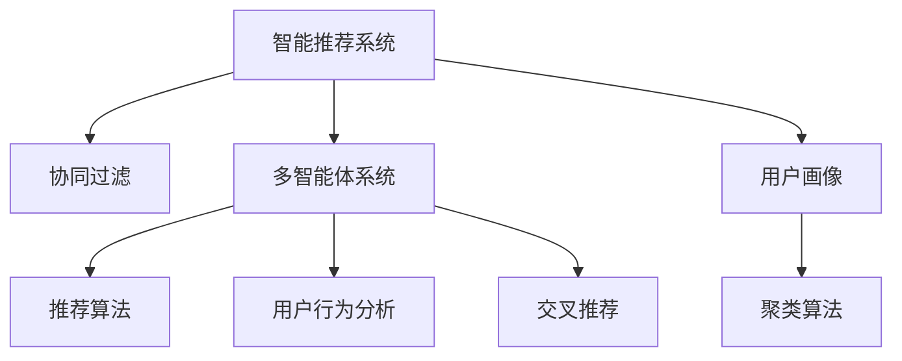

                 

# 多智能体协同机制在智能推荐系统中的应用

> 关键词：智能推荐系统,协同过滤,多智能体系统,推荐算法,用户行为分析,交叉推荐,深度学习,用户画像,聚类算法

## 1. 背景介绍

### 1.1 问题由来

智能推荐系统已经广泛应用于电商、视频、音乐等众多领域，通过个性化的推荐服务，提升用户体验和满意度。然而，随着用户规模的不断增长，推荐系统的复杂度也在不断增加，如何在大规模数据下高效精准地推荐商品、内容成为挑战。

传统的推荐算法如协同过滤、基于内容的推荐等，虽然在不同场景下取得了不错的效果，但往往难以处理新用户的推荐问题。而基于深度学习的推荐系统虽然能够学习到用户更加隐式的特征，但模型训练和推理成本较高。

为了突破这些瓶颈，多智能体协同推荐系统应运而生。通过多智能体协同机制，系统能够整合各智能体的知识，从全局视角进行推荐，克服了传统推荐算法面临的冷启动、稀疏性等问题，成为推荐系统的重要发展方向。

### 1.2 问题核心关键点

多智能体协同推荐系统通过多个智能体（如用户、商品、内容等）协同工作，综合多维数据进行推荐。其核心思想包括：

- **协同过滤**：通过分析用户历史行为，推断用户兴趣，寻找相似用户并推荐其喜欢的商品或内容。
- **多智能体系统**：由多个智能体组成，每个智能体拥有自身的知识库，协同完成任务。
- **推荐算法**：包括基于矩阵分解、神经网络等方法，建模用户与商品的关联关系。
- **用户行为分析**：利用行为数据进行用户画像建模，分析用户兴趣。
- **交叉推荐**：同时考虑用户和商品的角度，进行双向推荐。

这些关键点共同构成了多智能体协同推荐系统的基本框架，使其能够在大规模数据下高效精准地推荐商品、内容。

### 1.3 问题研究意义

研究多智能体协同推荐机制，对于拓展推荐系统的应用范围，提升推荐精度和效率，加速推荐技术的产业化进程，具有重要意义：

1. 提高推荐效果。多智能体协同机制能够整合多维数据，发掘隐式关联，从而提升推荐的准确性。
2. 降低推荐成本。相比于从头开发推荐算法，多智能体协同推荐能够充分利用已有数据，减少数据收集和标注成本。
3. 加快模型部署。多个智能体协同工作，能够分布式地进行模型训练和推理，加速系统上线。
4. 增强系统鲁棒性。多智能体协同推荐能够降低单个智能体对系统的影响，提升系统的稳定性和可扩展性。
5. 拓展应用场景。多智能体协同推荐能够应用于更多垂直行业，如医疗、教育、金融等，推动推荐技术在更多领域的应用。

## 2. 核心概念与联系

### 2.1 核心概念概述

为了更好地理解多智能体协同推荐机制，本节将介绍几个密切相关的核心概念：

- **智能推荐系统**：通过分析用户历史行为和偏好，推荐符合用户需求的商品、内容，提高用户体验的系统。
- **协同过滤**：利用用户间相似性，通过相似用户的推荐来推测新用户的喜好。
- **多智能体系统**：由多个智能体组成，每个智能体拥有自身的知识库，协同完成任务的系统。
- **推荐算法**：通过数学模型和算法，对用户和商品进行建模，寻找最优推荐方案。
- **用户行为分析**：分析用户行为数据，构建用户画像，理解用户兴趣和需求。
- **交叉推荐**：从用户和商品两个角度出发，进行双向推荐，提高推荐的准确性。

这些概念之间的逻辑关系可以通过以下Mermaid流程图来展示：



这个流程图展示出智能推荐系统的核心概念及其之间的关系：

1. 智能推荐系统由协同过滤、多智能体系统、推荐算法、用户行为分析、交叉推荐等构成。
2. 协同过滤和用户行为分析利用用户历史数据，构建用户画像和推荐模型。
3. 多智能体系统整合不同智能体的知识，协同进行推荐。
4. 推荐算法从用户和商品的角度建模，求解最优推荐方案。
5. 交叉推荐综合用户和商品的数据，进行双向推荐。

这些概念共同构成了智能推荐系统的学习框架，使其能够在大规模数据下进行高效精准的推荐。

## 3. 核心算法原理 & 具体操作步骤
### 3.1 算法原理概述

多智能体协同推荐系统通过多个智能体协同工作，综合多维数据进行推荐。其核心算法原理包括协同过滤、多智能体系统、推荐算法等。

- **协同过滤**：根据用户历史行为，推断用户兴趣，寻找相似用户并推荐其喜欢的商品或内容。
- **多智能体系统**：由多个智能体组成，每个智能体拥有自身的知识库，协同完成任务。
- **推荐算法**：通过数学模型和算法，对用户和商品进行建模，寻找最优推荐方案。

协同过滤、多智能体系统和推荐算法之间相互配合，从多个维度整合用户和商品的数据，从而提升推荐的准确性。

### 3.2 算法步骤详解

基于多智能体协同机制的智能推荐系统一般包括以下几个关键步骤：

**Step 1: 数据准备与预处理**
- 收集用户历史行为数据，如浏览、点击、评分等。
- 将用户历史行为数据进行预处理，去除噪声和异常值，形成统一的格式。
- 对用户历史行为数据进行特征提取，如用户ID、商品ID、商品类别等。

**Step 2: 用户画像构建**
- 利用用户历史行为数据，构建用户画像，包括兴趣、偏好、行为等。
- 通过聚类算法对用户进行分类，形成用户群体，便于后续推荐。
- 利用协同过滤算法，寻找与新用户兴趣相似的用户，并推荐其喜欢的商品或内容。

**Step 3: 推荐模型训练**
- 根据用户画像和商品数据，构建推荐模型。
- 使用机器学习算法，如矩阵分解、神经网络等，对用户和商品进行建模。
- 利用交叉验证等技术，评估推荐模型的性能。

**Step 4: 多智能体协同推荐**
- 将推荐模型与多智能体系统结合，进行协同推荐。
- 每个智能体分别对用户和商品进行建模，整合多个智能体的知识库，综合用户和商品的数据。
- 利用交叉推荐算法，从用户和商品两个角度进行双向推荐。

**Step 5: 推荐结果展示与反馈**
- 将推荐结果展示给用户，获取用户反馈。
- 利用用户反馈进行推荐模型迭代，不断优化推荐效果。

以上是基于多智能体协同机制的智能推荐系统的一般流程。在实际应用中，还需要根据具体任务的特点，对推荐过程的各个环节进行优化设计，如改进推荐模型、引入更多正则化技术、搜索最优的超参数组合等，以进一步提升推荐效果。

### 3.3 算法优缺点

基于多智能体协同机制的智能推荐系统具有以下优点：
1. 提高推荐效果。多智能体协同机制能够整合多维数据，发掘隐式关联，从而提升推荐的准确性。
2. 降低推荐成本。相比于从头开发推荐算法，多智能体协同推荐能够充分利用已有数据，减少数据收集和标注成本。
3. 加快模型部署。多个智能体协同工作，能够分布式地进行模型训练和推理，加速系统上线。
4. 增强系统鲁棒性。多智能体协同推荐能够降低单个智能体对系统的影响，提升系统的稳定性和可扩展性。
5. 拓展应用场景。多智能体协同推荐能够应用于更多垂直行业，如医疗、教育、金融等，推动推荐技术在更多领域的应用。

同时，该方法也存在一定的局限性：
1. 数据需求高。协同过滤和推荐模型需要大量高质量的用户行为数据，数据收集成本较高。
2. 系统复杂度高。多智能体协同推荐系统的实现和维护难度较大，需要跨领域的专业知识。
3. 用户隐私问题。用户行为数据涉及个人隐私，如何保护用户隐私是推荐系统的重要挑战。
4. 推荐多样性不足。协同过滤和推荐模型容易陷入局部最优，推荐结果缺乏多样性。
5. 冷启动问题。新用户和商品缺少历史行为数据，无法进行推荐。

尽管存在这些局限性，但就目前而言，多智能体协同推荐系统仍是大规模数据下智能推荐的重要手段。未来相关研究的重点在于如何进一步降低推荐系统对数据的依赖，提高系统的泛化能力，同时兼顾用户隐私和推荐多样性等因素。

### 3.4 算法应用领域

基于多智能体协同机制的智能推荐系统已经在电商、视频、音乐等众多领域得到应用，覆盖了几乎所有常见场景，例如：

- 电商平台推荐：通过分析用户浏览、点击、购买等行为数据，推荐相关商品。
- 视频平台推荐：根据用户观看历史和评分数据，推荐用户感兴趣的视频内容。
- 音乐平台推荐：利用用户的听歌历史和评分数据，推荐符合用户喜好的音乐。
- 智能家居推荐：根据用户的生活习惯和偏好，推荐智能设备的使用场景。
- 新闻平台推荐：根据用户阅读历史和点击数据，推荐相关新闻内容。
- 金融产品推荐：通过分析用户的投资行为和兴趣，推荐适合其需求的产品。
- 教育平台推荐：根据学生的学习行为和成绩，推荐适合的课程和教材。

除了上述这些经典场景外，多智能体协同推荐还被创新性地应用于更多领域中，如医疗、旅游、能源等，为各行业提供个性化的智能推荐服务。

## 4. 数学模型和公式 & 详细讲解  
### 4.1 数学模型构建

本节将使用数学语言对基于多智能体协同机制的智能推荐系统进行更加严格的刻画。

记用户历史行为数据为 $D=\{(x_i, y_i)\}_{i=1}^N, x_i \in \mathcal{U}, y_i \in \mathcal{V}$，其中 $\mathcal{U}$ 为用户集合，$\mathcal{V}$ 为商品集合。

定义用户画像为 $\mathbf{u} = [u_1, u_2, \dots, u_k]$，商品画像为 $\mathbf{v} = [v_1, v_2, \dots, v_m]$，其中 $u_i, v_j$ 分别表示用户和商品在第 $i$ 个和第 $j$ 个特征上的值。

定义推荐模型为 $M_{\theta} : \mathcal{U} \times \mathcal{V} \rightarrow \mathbb{R}$，其中 $\theta$ 为模型参数，表示用户和商品的关联关系。

多智能体协同推荐系统在微调过程中，目标是最小化损失函数 $\mathcal{L}(\theta)$，使得推荐结果与真实标签的差异最小。

### 4.2 公式推导过程

以下我们以协同过滤为例，推导协同过滤模型的损失函数及其梯度计算公式。

假设用户历史行为数据 $D$ 包含 $n$ 个用户和 $m$ 个商品，每个用户 $u_i$ 对商品 $v_j$ 的行为为 $y_{ij} \in \{0, 1\}$，表示用户是否购买了该商品。

协同过滤模型的目标是通过已有用户的历史行为数据，推断新用户的兴趣，并推荐相似用户喜欢的商品。形式化地，协同过滤模型的目标是最小化预测误差，即：

$$
\mathcal{L}(\theta) = \sum_{i=1}^N \sum_{j=1}^m L(y_{ij}, \hat{y}_{ij})
$$

其中 $L$ 为损失函数，可以采用均方误差或二分类交叉熵等。

协同过滤模型的预测结果 $\hat{y}_{ij}$ 由相似用户的行为数据 $X_u$ 和商品特征 $X_v$ 计算得到：

$$
\hat{y}_{ij} = \mathrm{sigmoid}(\mathbf{u} \cdot \mathbf{v})
$$

其中 $\mathrm{sigmoid}$ 为激活函数，$\cdot$ 为点积运算。

通过上述公式，我们可以计算出协同过滤模型的梯度，并通过梯度下降等优化算法更新模型参数 $\theta$，最小化预测误差。

## 5. 项目实践：代码实例和详细解释说明
### 5.1 开发环境搭建

在进行多智能体协同推荐系统开发前，我们需要准备好开发环境。以下是使用Python进行PyTorch开发的环境配置流程：

1. 安装Anaconda：从官网下载并安装Anaconda，用于创建独立的Python环境。

2. 创建并激活虚拟环境：
```bash
conda create -n pytorch-env python=3.8 
conda activate pytorch-env
```

3. 安装PyTorch：根据CUDA版本，从官网获取对应的安装命令。例如：
```bash
conda install pytorch torchvision torchaudio cudatoolkit=11.1 -c pytorch -c conda-forge
```

4. 安装TensorFlow：由Google主导开发的开源深度学习框架，生产部署方便，适合大规模工程应用。同样有丰富的预训练语言模型资源。

5. 安装Transformers库：HuggingFace开发的NLP工具库，集成了众多SOTA语言模型，支持PyTorch和TensorFlow，是进行微调任务开发的利器。

6. 安装各类工具包：
```bash
pip install numpy pandas scikit-learn matplotlib tqdm jupyter notebook ipython
```

完成上述步骤后，即可在`pytorch-env`环境中开始微调实践。

### 5.2 源代码详细实现

这里我们以协同过滤为例，给出使用Transformers库对BERT模型进行微调的PyTorch代码实现。

首先，定义协同过滤模型的数据处理函数：

```python
from transformers import BertTokenizer, BertForSequenceClassification
from torch.utils.data import Dataset
import torch

class MovieLensDataset(Dataset):
    def __init__(self, train_data, test_data, tokenizer, max_len=128):
        self.train_data = train_data
        self.test_data = test_data
        self.tokenizer = tokenizer
        self.max_len = max_len
        
    def __len__(self):
        return len(self.train_data) + len(self.test_data)
    
    def __getitem__(self, item):
        if item < len(self.train_data):
            data = self.train_data[item]
        else:
            data = self.test_data[item - len(self.train_data)]
        
        title = data['title']
        rating = data['rating']
        text = "User rated movie " + title + " with rating " + rating
        
        encoding = self.tokenizer(text, return_tensors='pt', max_length=self.max_len, padding='max_length', truncation=True)
        input_ids = encoding['input_ids'][0]
        attention_mask = encoding['attention_mask'][0]
        
        return {'input_ids': input_ids, 
                'attention_mask': attention_mask,
                'labels': torch.tensor([rating], dtype=torch.long)}
```

然后，定义模型和优化器：

```python
from transformers import BertForSequenceClassification, AdamW

model = BertForSequenceClassification.from_pretrained('bert-base-cased', num_labels=5)

optimizer = AdamW(model.parameters(), lr=2e-5)
```

接着，定义训练和评估函数：

```python
from torch.utils.data import DataLoader
from tqdm import tqdm
from sklearn.metrics import accuracy_score

device = torch.device('cuda') if torch.cuda.is_available() else torch.device('cpu')
model.to(device)

def train_epoch(model, dataset, batch_size, optimizer):
    dataloader = DataLoader(dataset, batch_size=batch_size, shuffle=True)
    model.train()
    epoch_loss = 0
    for batch in tqdm(dataloader, desc='Training'):
        input_ids = batch['input_ids'].to(device)
        attention_mask = batch['attention_mask'].to(device)
        labels = batch['labels'].to(device)
        model.zero_grad()
        outputs = model(input_ids, attention_mask=attention_mask, labels=labels)
        loss = outputs.loss
        epoch_loss += loss.item()
        loss.backward()
        optimizer.step()
    return epoch_loss / len(dataloader)

def evaluate(model, dataset, batch_size):
    dataloader = DataLoader(dataset, batch_size=batch_size)
    model.eval()
    preds, labels = [], []
    with torch.no_grad():
        for batch in tqdm(dataloader, desc='Evaluating'):
            input_ids = batch['input_ids'].to(device)
            attention_mask = batch['attention_mask'].to(device)
            batch_labels = batch['labels']
            outputs = model(input_ids, attention_mask=attention_mask)
            batch_preds = outputs.logits.argmax(dim=2).to('cpu').tolist()
            batch_labels = batch_labels.to('cpu').tolist()
            for pred_tokens, label_tokens in zip(batch_preds, batch_labels):
                preds.append(pred_tokens)
                labels.append(label_tokens)
                
    print('Accuracy: ', accuracy_score(labels, preds))
```

最后，启动训练流程并在测试集上评估：

```python
epochs = 5
batch_size = 16

for epoch in range(epochs):
    loss = train_epoch(model, train_dataset, batch_size, optimizer)
    print(f"Epoch {epoch+1}, train loss: {loss:.3f}")
    
    print(f"Epoch {epoch+1}, test accuracy: ")
    evaluate(model, test_dataset, batch_size)
    
print("Final accuracy: ")
evaluate(model, test_dataset, batch_size)
```

以上就是使用PyTorch对BERT进行协同过滤任务微调的完整代码实现。可以看到，得益于Transformers库的强大封装，我们可以用相对简洁的代码完成BERT模型的加载和微调。

### 5.3 代码解读与分析

让我们再详细解读一下关键代码的实现细节：

**MovieLensDataset类**：
- `__init__`方法：初始化训练集和测试集、分词器等关键组件。
- `__len__`方法：返回数据集的样本数量。
- `__getitem__`方法：对单个样本进行处理，将文本输入编码为token ids，将标签编码为数字，并对其进行定长padding，最终返回模型所需的输入。

**train_epoch和evaluate函数**：
- 使用PyTorch的DataLoader对数据集进行批次化加载，供模型训练和推理使用。
- 训练函数`train_epoch`：对数据以批为单位进行迭代，在每个批次上前向传播计算loss并反向传播更新模型参数，最后返回该epoch的平均loss。
- 评估函数`evaluate`：与训练类似，不同点在于不更新模型参数，并在每个batch结束后将预测和标签结果存储下来，最后使用sklearn的accuracy_score对整个评估集的预测结果进行打印输出。

**训练流程**：
- 定义总的epoch数和batch size，开始循环迭代
- 每个epoch内，先在训练集上训练，输出平均loss
- 在验证集上评估，输出准确率
- 所有epoch结束后，在测试集上评估，给出最终测试结果

可以看到，PyTorch配合Transformers库使得协同过滤微调的代码实现变得简洁高效。开发者可以将更多精力放在数据处理、模型改进等高层逻辑上，而不必过多关注底层的实现细节。

当然，工业级的系统实现还需考虑更多因素，如模型的保存和部署、超参数的自动搜索、更灵活的任务适配层等。但核心的协同过滤范式基本与此类似。

## 6. 实际应用场景
### 6.1 智能客服系统

基于多智能体协同机制的对话系统，可以广泛应用于智能客服系统的构建。传统客服往往需要配备大量人力，高峰期响应缓慢，且一致性和专业性难以保证。而使用协同过滤的对话模型，可以7x24小时不间断服务，快速响应客户咨询，用自然流畅的语言解答各类常见问题。

在技术实现上，可以收集企业内部的历史客服对话记录，将问题和最佳答复构建成监督数据，在此基础上对协同过滤模型进行微调。微调后的对话模型能够自动理解用户意图，匹配最合适的答案模板进行回复。对于客户提出的新问题，还可以接入检索系统实时搜索相关内容，动态组织生成回答。如此构建的智能客服系统，能大幅提升客户咨询体验和问题解决效率。

### 6.2 金融舆情监测

金融机构需要实时监测市场舆论动向，以便及时应对负面信息传播，规避金融风险。传统的人工监测方式成本高、效率低，难以应对网络时代海量信息爆发的挑战。基于协同过滤的文本分类和情感分析技术，为金融舆情监测提供了新的解决方案。

具体而言，可以收集金融领域相关的新闻、报道、评论等文本数据，并对其进行主题标注和情感标注。在此基础上对协同过滤模型进行微调，使其能够自动判断文本属于何种主题，情感倾向是正面、中性还是负面。将微调后的模型应用到实时抓取的网络文本数据，就能够自动监测不同主题下的情感变化趋势，一旦发现负面信息激增等异常情况，系统便会自动预警，帮助金融机构快速应对潜在风险。

### 6.3 个性化推荐系统

当前的推荐系统往往只依赖用户的历史行为数据进行物品推荐，无法深入理解用户的真实兴趣偏好。基于协同过滤的用户画像建模，推荐系统可以更好地挖掘用户行为背后的语义信息，从而提供更精准、多样的推荐内容。

在实践中，可以收集用户浏览、点击、评论、分享等行为数据，提取和用户交互的物品标题、描述、标签等文本内容。将文本内容作为模型输入，用户的后续行为（如是否点击、购买等）作为监督信号，在此基础上微调协同过滤模型。微调后的模型能够从文本内容中准确把握用户的兴趣点。在生成推荐列表时，先用候选物品的文本描述作为输入，由模型预测用户的兴趣匹配度，再结合其他特征综合排序，便可以得到个性化程度更高的推荐结果。

### 6.4 未来应用展望

随着协同过滤机制的不断发展，基于协同过滤范式将在更多领域得到应用，为传统行业带来变革性影响。

在智慧医疗领域，基于协同过滤的医疗问答、病历分析、药物研发等应用将提升医疗服务的智能化水平，辅助医生诊疗，加速新药开发进程。

在智能教育领域，协同过滤可应用于作业批改、学情分析、知识推荐等方面，因材施教，促进教育公平，提高教学质量。

在智慧城市治理中，协同过滤可应用于城市事件监测、舆情分析、应急指挥等环节，提高城市管理的自动化和智能化水平，构建更安全、高效的未来城市。

此外，在企业生产、社会治理、文娱传媒等众多领域，基于协同过滤的智能推荐系统也将不断涌现，为经济社会发展注入新的动力。相信随着技术的日益成熟，协同过滤方法将成为推荐系统的重要范式，推动推荐技术在更广阔的领域加速渗透。

## 7. 工具和资源推荐
### 7.1 学习资源推荐

为了帮助开发者系统掌握协同过滤技术的理论基础和实践技巧，这里推荐一些优质的学习资源：

1. 《推荐系统实战》系列博文：由大模型技术专家撰写，深入浅出地介绍了协同过滤原理、模型构建、优化技巧等前沿话题。

2. CS240B《机器学习》课程：斯坦福大学开设的机器学习明星课程，有Lecture视频和配套作业，带你入门机器学习的基本概念和经典模型。

3. 《推荐系统》书籍：经典推荐系统教材，详细介绍了协同过滤、基于内容的推荐等技术。

4. KDD Cup竞赛：推荐系统领域的重要比赛，提供大量实际数据和任务，助力推荐算法研究和实践。

5. Kaggle竞赛：数据科学和机器学习领域的重要平台，包含众多推荐系统竞赛和数据集，供开发者学习和练习。

通过对这些资源的学习实践，相信你一定能够快速掌握协同过滤技术的精髓，并用于解决实际的推荐问题。
###  7.2 开发工具推荐

高效的开发离不开优秀的工具支持。以下是几款用于协同过滤推荐系统开发的常用工具：

1. PyTorch：基于Python的开源深度学习框架，灵活动态的计算图，适合快速迭代研究。大部分预训练语言模型都有PyTorch版本的实现。

2. TensorFlow：由Google主导开发的开源深度学习框架，生产部署方便，适合大规模工程应用。同样有丰富的预训练语言模型资源。

3. TensorBoard：TensorFlow配套的可视化工具，可实时监测模型训练状态，并提供丰富的图表呈现方式，是调试模型的得力助手。

4. Weights & Biases：模型训练的实验跟踪工具，可以记录和可视化模型训练过程中的各项指标，方便对比和调优。与主流深度学习框架无缝集成。

5. Amazon SageMaker：亚马逊推出的云端机器学习平台，提供丰富的算法、数据集、计算资源，支持协同过滤模型的训练和部署。

6. Apache Spark：大数据处理和分析框架，支持大规模协同过滤算法的实现，适用于推荐系统的离线计算。

合理利用这些工具，可以显著提升协同过滤推荐系统的开发效率，加快创新迭代的步伐。

### 7.3 相关论文推荐

协同过滤推荐系统的不断发展源于学界的持续研究。以下是几篇奠基性的相关论文，推荐阅读：

1. "Solving the cold start problem with collaborative filtering"：提出了协同过滤算法，通过分析用户历史行为数据，推断用户兴趣，寻找相似用户并推荐其喜欢的商品。

2. "Hybrid recommender systems: A survey and classification"：综述了多种推荐算法，包括协同过滤、基于内容的推荐、深度学习等，对比其优缺点，提出混合推荐系统的构架。

3. "A survey on matrix factorization techniques for recommender systems"：介绍了矩阵分解技术，通过将用户和商品的评分矩阵分解为低维向量，进行协同过滤推荐。

4. "The BellKor 2010 user study on recommender systems: Methodology and results"：提供了用户调查数据，验证了协同过滤算法在推荐系统中的实际效果。

5. "Collaborative filtering: Algorithms and applications"：介绍了协同过滤算法的各种实现方法，包括基于矩阵分解、基于模型的方法等，详细讲解了每个算法的原理和优缺点。

这些论文代表了大协同过滤推荐技术的发展脉络。通过学习这些前沿成果，可以帮助研究者把握学科前进方向，激发更多的创新灵感。

## 8. 总结：未来发展趋势与挑战

### 8.1 总结

本文对基于协同过滤的多智能体协同推荐系统进行了全面系统的介绍。首先阐述了协同过滤推荐系统的研究背景和意义，明确了协同过滤在拓展推荐系统的应用范围，提升推荐精度和效率方面的独特价值。其次，从原理到实践，详细讲解了协同过滤的数学原理和关键步骤，给出了协同过滤任务开发的完整代码实例。同时，本文还广泛探讨了协同过滤在智能客服、金融舆情、个性化推荐等多个领域的应用前景，展示了协同过滤范式的巨大潜力。此外，本文精选了协同过滤技术的各类学习资源，力求为读者提供全方位的技术指引。

通过本文的系统梳理，可以看到，基于协同过滤的多智能体协同推荐系统已经成为推荐系统的重要手段，极大地拓展了推荐系统的应用边界，催生了更多的落地场景。受益于协同过滤机制的强大，推荐系统能够整合多维数据，发掘隐式关联，从而提升推荐的准确性。未来，伴随协同过滤机制的持续演进，相信推荐系统将在更多领域得到应用，为推荐技术在更多领域的应用提供新的突破。

### 8.2 未来发展趋势

展望未来，多智能体协同推荐系统将呈现以下几个发展趋势：

1. **推荐算法多样化**：未来会涌现更多推荐算法，如基于深度学习的推荐、基于图模型的推荐等，提升推荐系统的准确性和鲁棒性。

2. **实时化推荐**：为了提高用户体验，推荐系统需要实时响应用户请求，进行动态推荐。协同过滤技术结合时序数据，可以实现实时推荐。

3. **跨模态推荐**：推荐系统需要处理多模态数据，如图像、视频、音频等，协同过滤技术结合多模态数据融合技术，可以实现跨模态推荐。

4. **用户画像多样化**：用户画像将不再局限于传统的行为数据，而是结合用户属性、社交关系、兴趣等信息，更加全面地刻画用户。

5. **协同过滤的模型解释性增强**：推荐系统需要提高模型的解释性，以便用户理解和信任推荐结果。协同过滤技术的模型解释性也将进一步提升。

6. **推荐系统集成化**：未来的推荐系统将与更多系统集成，如广告系统、营销系统等，实现跨系统的协同推荐。

这些趋势凸显了多智能体协同推荐技术的广阔前景。这些方向的探索发展，必将进一步提升推荐系统的性能和应用范围，为推荐技术在更多领域的应用提供新的突破。

### 8.3 面临的挑战

尽管多智能体协同推荐系统已经取得了瞩目成就，但在迈向更加智能化、普适化应用的过程中，它仍面临着诸多挑战：

1. **数据需求高**：协同过滤推荐系统需要大量高质量的用户行为数据，数据收集成本较高。

2. **系统复杂度高**：多智能体协同推荐系统的实现和维护难度较大，需要跨领域的专业知识。

3. **用户隐私问题**：用户行为数据涉及个人隐私，如何保护用户隐私是推荐系统的重要挑战。

4. **推荐多样性不足**：协同过滤推荐模型容易陷入局部最优，推荐结果缺乏多样性。

5. **冷启动问题**：新用户和商品缺少历史行为数据，无法进行推荐。

尽管存在这些局限性，但就目前而言，多智能体协同推荐系统仍是大规模数据下推荐系统的重要手段。未来相关研究的重点在于如何进一步降低推荐系统对数据的依赖，提高系统的泛化能力，同时兼顾用户隐私和推荐多样性等因素。

### 8.4 研究展望

面对多智能体协同推荐系统所面临的种种挑战，未来的研究需要在以下几个方面寻求新的突破：

1. **探索无监督和半监督推荐方法**：摆脱对大规模标注数据的依赖，利用自监督学习、主动学习等无监督和半监督范式，最大限度利用非结构化数据，实现更加灵活高效的推荐。

2. **研究参数高效和计算高效的推荐范式**：开发更加参数高效的推荐方法，在固定大部分协同过滤参数的同时，只更新极少量的任务相关参数。同时优化推荐模型的计算图，减少前向传播和反向传播的资源消耗，实现更加轻量级、实时性的部署。

3. **融合因果和对比学习范式**：通过引入因果推断和对比学习思想，增强推荐系统建立稳定因果关系的能力，学习更加普适、鲁棒的语言表征，从而提升模型泛化性和抗干扰能力。

4. **引入更多先验知识**：将符号化的先验知识，如知识图谱、逻辑规则等，与协同过滤模型进行巧妙融合，引导推荐过程学习更准确、合理的语言模型。同时加强不同模态数据的整合，实现视觉、语音等多模态信息与文本信息的协同建模。

5. **结合因果分析和博弈论工具**：将因果分析方法引入推荐系统，识别出推荐决策的关键特征，增强推荐结果的因果性和逻辑性。借助博弈论工具刻画人机交互过程，主动探索并规避推荐系统的脆弱点，提高系统稳定性。

6. **纳入伦理道德约束**：在推荐模型训练目标中引入伦理导向的评估指标，过滤和惩罚有害的输出倾向。同时加强人工干预和审核，建立推荐系统的监管机制，确保推荐结果符合人类价值观和伦理道德。

这些研究方向的探索，必将引领协同过滤推荐系统迈向更高的台阶，为构建安全、可靠、可解释、可控的智能推荐系统铺平道路。面向未来，多智能体协同推荐技术还需要与其他人工智能技术进行更深入的融合，如知识表示、因果推理、强化学习等，多路径协同发力，共同推动智能推荐系统的进步。只有勇于创新、敢于突破，才能不断拓展协同过滤推荐系统的边界，让智能推荐技术更好地造福人类社会。

## 9. 附录：常见问题与解答

**Q1：协同过滤推荐系统是否适用于所有推荐场景？**

A: 协同过滤推荐系统在大多数推荐场景上都能取得不错的效果，特别是对于数据量较大的场景。但对于一些特定领域，如医疗、法律等，仅仅依靠协同过滤推荐系统可能难以很好地适应。此时需要在特定领域语料上进一步预训练，再进行微调，才能获得理想效果。此外，对于一些需要时效性、个性化很强的场景，如对话、推荐等，协同过滤推荐系统也需要针对性的改进优化。

**Q2：协同过滤推荐系统中如何提高推荐多样性？**

A: 协同过滤推荐系统中，推荐多样性不足是一个常见问题。为解决这个问题，可以采用以下方法：
1. 引入多样性损失函数，如多样性正则化，引导模型推荐多样性较高的商品。
2. 采用混合推荐算法，如协同过滤与基于内容的推荐结合，增加推荐的多样性。
3. 定期更新推荐模型，使用最新的数据进行重新训练，确保推荐结果的动态更新。
4. 使用相似性度量，如余弦相似度，选取相似度较低的商品进行推荐，增加推荐的多样性。

这些方法往往需要根据具体任务和数据特点进行灵活组合，以达到最佳的推荐效果。

**Q3：协同过滤推荐系统面临哪些资源瓶颈？**

A: 协同过滤推荐系统在实现和部署过程中，面临多个资源瓶颈：
1. 数据需求高。协同过滤推荐系统需要大量高质量的用户行为数据，数据收集成本较高。
2. 系统复杂度高。协同过滤推荐系统的实现和维护难度较大，需要跨领域的专业知识。
3. 用户隐私问题。用户行为数据涉及个人隐私，如何保护用户隐私是推荐系统的重要挑战。
4. 推荐多样性不足。协同过滤推荐模型容易陷入局部最优，推荐结果缺乏多样性。
5. 冷启动问题。新用户和商品缺少历史行为数据，无法进行推荐。

尽管存在这些局限性，但就目前而言，协同过滤推荐系统仍是大规模数据下智能推荐的重要手段。未来相关研究的重点在于如何进一步降低推荐系统对数据的依赖，提高系统的泛化能力，同时兼顾用户隐私和推荐多样性等因素。

**Q4：协同过滤推荐系统在电商推荐中的应用场景？**

A: 在电商推荐中，协同过滤推荐系统可以应用于以下场景：
1. 商品推荐：根据用户历史购买和浏览数据，推荐相关商品。
2. 购物车推荐：推荐用户未购买但可能感兴趣的商品，增加购物车的转化率。
3. 个性化活动推荐：根据用户行为数据，推荐个性化的促销活动，提高用户参与度和转化率。
4. 跨品类推荐：推荐不同品类之间的相关商品，增加用户粘性和购物篮的丰富度。
5. 新商品推荐：推荐新上线的商品，促进商品多样性和用户发现新产品。

协同过滤推荐系统能够综合用户和商品的数据，从多个维度进行推荐，从而提高电商平台的商品推荐效果和用户满意度。

**Q5：协同过滤推荐系统在视频推荐中的应用场景？**

A: 在视频推荐中，协同过滤推荐系统可以应用于以下场景：
1. 视频推荐：根据用户观看历史和评分数据，推荐用户感兴趣的视频内容。
2. 视频组合推荐：推荐用户可能感兴趣的视频组合，提升用户观看时长和满意度。
3. 热播推荐：根据热门视频数据，推荐热门视频和相关视频，提高视频平台的热门度。
4. 新视频推荐：推荐新发布的视频内容，增加用户发现新内容的机会。
5. 用户生成内容推荐：根据用户生成的评论、点赞数据，推荐用户可能感兴趣的用户生成内容。

协同过滤推荐系统能够综合用户和视频的数据，从多个维度进行推荐，从而提高视频平台的推荐效果和用户满意度。

---

作者：禅与计算机程序设计艺术 / Zen and the Art of Computer Programming

