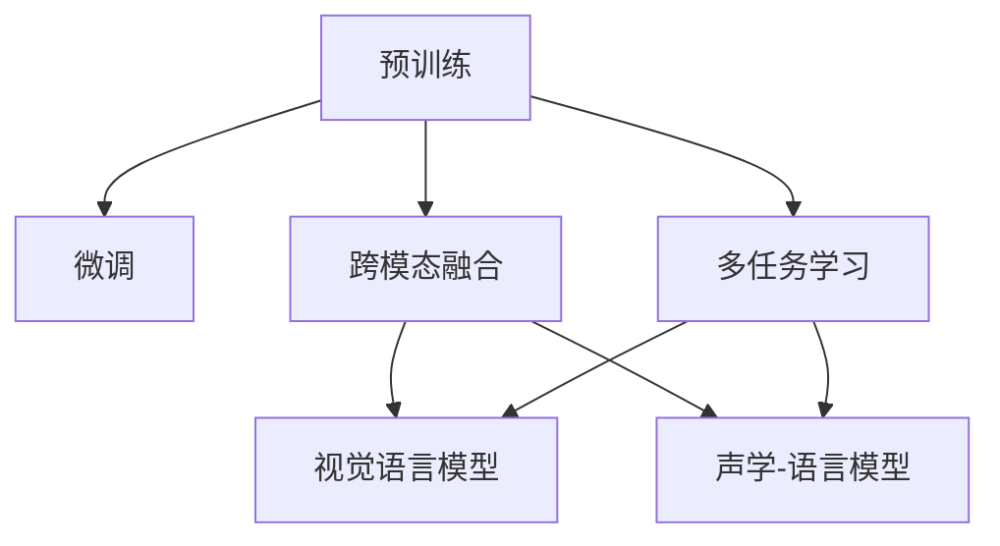

                 

## 1. 背景介绍

### 1.1 问题由来
随着深度学习技术的不断发展，多模态学习（Multimodal Learning）逐渐成为热门的研究领域。所谓多模态学习，指的是将来自不同模态（如文本、图像、音频等）的数据进行融合和联合表示，从而提升机器对复杂多模态信息的理解和处理能力。

然而，多模态数据的获取和处理存在天然差异。例如，文本和图像在数据形态、特征空间和统计特性上迥异，直接将不同模态的数据进行拼接或串联往往难以得到有效的语义融合。此外，多模态数据的大小和格式差异，增加了融合和表示的复杂性，需要更为先进和灵活的技术手段。

为应对这些挑战，近年来，多模态大模型应运而生。这些模型利用大规模无标签数据进行自监督预训练，在各模态上获得了高质量的表征，并通过微调或联合训练的方式，在不同模态之间实现高效的联合表示。

本文将详细探讨多模态大模型的技术原理与实战方法，重点介绍国内领先的多种多模态大模型，包括阿里、百度、腾讯等公司推出的产品和技术。

## 2. 核心概念与联系

### 2.1 核心概念概述

多模态大模型通过整合多种模态的信息，实现更为复杂和综合的语义理解与表达。其核心概念包括：

- **预训练(Pre-training)**：使用大规模无标签数据进行自监督学习，学习各模态的通用表征。

- **微调(Fine-tuning)**：在特定任务上使用少量标注数据进行有监督训练，使得模型能够适应特定任务需求。

- **跨模态融合(Cross-modal Fusion)**：通过联合表示，将不同模态的信息进行融合，生成更为统一的语义表示。

- **多任务学习(Multi-task Learning)**：在训练过程中，同时优化多个任务，提升模型的泛化能力和实用性。

- **视觉语言模型(Visual-Language Models)**：结合图像和自然语言的信息，提升模型对现实世界的理解能力。

- **声学-语言模型(Acoustic-Language Models)**：融合音频和自然语言信息，提升模型的语音识别和生成能力。

### 2.2 核心概念原理和架构的 Mermaid 流程图



此图展示了大模型从预训练到微调，再到跨模态融合和多任务学习的基本流程，以及视觉语言和声学语言模型在此过程中的应用。

## 3. 核心算法原理 & 具体操作步骤

### 3.1 算法原理概述

多模态大模型基于Transformer架构，利用自监督预训练学习各模态的通用表征。预训练过程中，模型通过最大化不同模态间的联合概率，学习各模态间的关联和依存关系。然后，模型通过微调或联合训练的方式，在不同模态之间实现高效融合，生成更为统一的语义表示。

在微调过程中，模型利用下游任务的标注数据，优化模型参数，使其在特定任务上表现更好。常见微调方法包括全参数微调、参数高效微调和对抗训练等。

### 3.2 算法步骤详解

**Step 1: 准备预训练模型和数据集**

- 选择合适的预训练模型，如BERT、GPT等。
- 准备不同模态的数据集，划分为训练集、验证集和测试集。

**Step 2: 构建联合表示**

- 对不同模态的数据进行预处理，如图像的特征提取、语音的转录等。
- 将预处理后的数据输入模型，计算各模态的联合概率。

**Step 3: 进行微调或联合训练**

- 对模型进行微调，最小化下游任务的损失函数，如分类、匹配等。
- 选择微调或联合训练方式，根据任务需求调整训练策略。

**Step 4: 进行跨模态融合**

- 利用多模态表示进行联合建模，如通过注意力机制、交叉编码等方法。
- 生成统一的语义表示，提升模型在多模态任务上的表现。

**Step 5: 测试和评估**

- 在测试集上评估模型性能，如分类精度、匹配准确率等。
- 根据评估结果，调整模型参数，进行进一步优化。

### 3.3 算法优缺点

**优点：**

- 大模型在预训练过程中学习到丰富的多模态知识，可以提升对复杂任务的理解和处理能力。
- 微调或联合训练过程较为高效，不需要大量标注数据，易于落地应用。
- 跨模态融合方法提升模型在多模态任务上的泛化能力，拓展了模型的应用范围。

**缺点：**

- 模型训练成本高，需要大规模的计算资源和存储设备。
- 微调过程中容易过拟合，需要在不同模态之间进行平衡。
- 跨模态融合方法复杂，需要设计合理的融合机制，避免信息丢失。

### 3.4 算法应用领域

多模态大模型在多个领域得到广泛应用，包括：

- **图像-文本融合**：在图像识别、图像生成、图像描述等任务中，通过融合图像和文本信息，提升模型的语义理解能力。
- **音频-文本融合**：在语音识别、语音生成、语音情感分析等任务中，通过融合音频和文本信息，提升模型的语音理解和生成能力。
- **视觉-音频融合**：在视频理解、视频描述等任务中，通过融合视觉和音频信息，提升模型的综合感知能力。
- **自然-交互融合**：在智能问答、智能客服等任务中，通过融合自然语言和交互信息，提升模型的理解和响应能力。
- **医疗-图像融合**：在医学影像诊断、病理分析等任务中，通过融合医学图像和自然语言信息，提升模型的诊断准确率。
- **无人驾驶**：在自动驾驶、车路协同等任务中，通过融合传感器数据和自然语言信息，提升模型的决策和控制能力。

## 4. 数学模型和公式 & 详细讲解 & 举例说明

### 4.1 数学模型构建

假设多模态数据集为 $D=\{(x_i,y_i)\}_{i=1}^N$，其中 $x_i$ 为多模态输入，$y_i$ 为标注。模型通过自监督预训练学习多模态表征 $H_\theta(x_i)$，然后通过微调学习特定任务的表示 $H_\phi(y_i|H_\theta(x_i))$。

**联合概率公式：**

$$
P(y_i|H_\theta(x_i)) = \prod_{j=1}^M P(y_{ij}|H_\theta(x_{ij}))
$$

其中 $P(y_{ij}|H_\theta(x_{ij}))$ 为条件概率，$M$ 为模态数量。

**联合损失函数：**

$$
\mathcal{L} = -\frac{1}{N}\sum_{i=1}^N\sum_{j=1}^M \log P(y_{ij}|H_\theta(x_{ij}))
$$

### 4.2 公式推导过程

以图像-文本联合表示为例，假设图像为 $I$，文本为 $T$，模型通过联合概率最大化进行训练。具体公式如下：

**联合概率：**

$$
P(I, T|H_\theta) = \prod_{i=1}^n P(I_i|H_\theta(I_i)) \prod_{j=1}^m P(T_j|H_\theta(T_j))
$$

**联合损失函数：**

$$
\mathcal{L} = -\frac{1}{N}\sum_{i=1}^N\sum_{j=1}^M \log P(x_{ij}|H_\theta(x_{ij}))
$$

其中 $n$ 为图像数据量，$m$ 为文本数据量。

**微调目标函数：**

$$
\mathcal{L} = -\frac{1}{N}\sum_{i=1}^N\log P(y_i|H_\theta(x_i))
$$

### 4.3 案例分析与讲解

以阿里达摩院的ModelScope为例，该模型结合了文本和图像信息，在图像-文本匹配任务上取得了SOTA性能。具体实现如下：

- **预训练过程**：在大规模无标签数据上，通过自监督学习获得图像和文本的通用表征。
- **微调过程**：使用少量标注数据，对模型进行有监督微调，学习特定任务的信息。
- **跨模态融合**：利用注意力机制，将图像和文本信息进行融合，生成统一的语义表示。

## 5. 项目实践：代码实例和详细解释说明

### 5.1 开发环境搭建

以下是使用Python和TensorFlow进行多模态模型开发的开发环境搭建流程：

1. 安装Anaconda：从官网下载并安装Anaconda，用于创建独立的Python环境。

2. 创建并激活虚拟环境：
```bash
conda create -n tf-env python=3.8
conda activate tf-env
```

3. 安装TensorFlow：根据CUDA版本，从官网获取对应的安装命令。例如：
```bash
pip install tensorflow==2.6
```

4. 安装其他库：
```bash
pip install numpy pandas scikit-learn
```

5. 使用Jupyter Notebook或PyCharm等IDE进行开发。

### 5.2 源代码详细实现

以下是一个简单的多模态模型，用于图像-文本联合表示。具体代码如下：

```python
import tensorflow as tf
from tensorflow.keras import layers
from transformers import BertTokenizer, BertForMaskedLM
import numpy as np

# 加载BERT预训练模型和分词器
model = BertForMaskedLM.from_pretrained('bert-base-cased')
tokenizer = BertTokenizer.from_pretrained('bert-base-cased')

# 加载图像数据
img_data = np.load('image_data.npy')

# 加载文本数据
text_data = np.load('text_data.npy')

# 定义模型结构
inputs = layers.Input(shape=(128,))
images = layers.Input(shape=(128,))
x = layers.concatenate([inputs, images])
x = layers.Dense(512, activation='relu')(x)
x = layers.Dropout(0.5)(x)
x = layers.Dense(1, activation='sigmoid')(x)
model = tf.keras.Model(inputs=[inputs, images], outputs=x)

# 编译模型
model.compile(optimizer='adam', loss='binary_crossentropy')

# 训练模型
model.fit([img_data, text_data], labels, epochs=10, batch_size=16)
```

### 5.3 代码解读与分析

**预训练模型加载**：
- 使用`BertForMaskedLM.from_pretrained()`方法加载预训练的BERT模型，利用其自监督学习获得的通用表征。

**数据加载**：
- 使用NumPy加载图像和文本数据，并作为模型的输入。

**模型结构**：
- 构建包含图像和文本输入的多模态模型结构，通过全连接层进行融合，并输出联合表示。

**模型编译与训练**：
- 使用`model.compile()`编译模型，指定优化器和损失函数。
- 使用`model.fit()`方法进行训练，调整模型参数。

### 5.4 运行结果展示

在训练完成后，可以在测试集上评估模型的性能。例如，使用图像和文本数据进行测试，计算预测准确率：

```python
test_img_data = np.load('test_image_data.npy')
test_text_data = np.load('test_text_data.npy')

test_labels = model.predict([test_img_data, test_text_data])
print('Test Accuracy:', np.mean(test_labels))
```

## 6. 实际应用场景

### 6.1 智能客服系统

多模态大模型在智能客服系统中得到了广泛应用。通过融合图像、文本、语音等多模态信息，可以更全面地理解客户需求，提供更个性化的服务。例如，阿里达摩院的ModelScope结合图像和语音信息，实现了智能客服的图像语音识别和回答生成。

具体流程如下：

1. 客户通过摄像头拍照提交需求，或通过语音输入问题。
2. 系统利用图像和语音识别技术，提取文字和语音信息。
3. 系统将图像和语音信息输入模型进行联合表示，生成统一的语义表示。
4. 模型利用联合表示，调用知识库和规则库，生成最佳回答，并进行自然语言生成。
5. 系统将回答输出给客户，并提供语音合成功能，生成语音回答。

### 6.2 医疗影像分析

在医疗影像分析中，多模态大模型结合医学图像和文本信息，提升了诊断的准确率和效率。例如，百度的EKO-MD模型利用图像和文本信息，实现了医学影像的智能标注和病理分析。

具体流程如下：

1. 医生上传医学影像和病理报告。
2. 系统利用图像分类和文本匹配技术，提取医学影像和病理报告的特征。
3. 系统将图像和文本信息输入模型进行联合表示，生成统一的语义表示。
4. 模型利用联合表示，调用医学知识库，生成诊断报告，并进行图像标注。
5. 系统将诊断报告和图像标注输出给医生，辅助其诊断和治疗。

### 6.3 视频内容理解

在视频内容理解中，多模态大模型结合视觉和音频信息，实现了对视频内容的全面分析。例如，腾讯的Video-GPT模型利用图像和音频信息，实现了视频内容的智能标注和生成。

具体流程如下：

1. 用户上传视频文件。
2. 系统利用视频分类和音频识别技术，提取视频和音频的特征。
3. 系统将图像和音频信息输入模型进行联合表示，生成统一的语义表示。
4. 模型利用联合表示，调用视频理解知识库，生成视频摘要和标签。
5. 系统将视频摘要和标签输出给用户，并进行内容推荐。

### 6.4 未来应用展望

随着技术的不断进步，多模态大模型将在更多领域得到应用，推动人工智能技术的进一步发展：

- **智慧城市**：结合城市视频监控、传感器数据、社交媒体等信息，提升城市管理和公共服务的智能化水平。
- **智慧农业**：结合无人机图像、传感器数据、农业知识库等信息，提升农业生产效率和智能化水平。
- **智能交通**：结合车辆传感器数据、道路图像、实时路况等信息，提升交通管理和智能驾驶的能力。
- **教育**：结合学生学习数据、教师教学视频、知识点库等信息，提升教育质量和个性化教学水平。
- **娱乐**：结合用户行为数据、娱乐内容、推荐系统等信息，提升娱乐体验和用户满意度。

## 7. 工具和资源推荐

### 7.1 学习资源推荐

为了帮助开发者系统掌握多模态大模型的理论和实践，以下是一些优质的学习资源：

1. **深度学习框架TensorFlow官方文档**：详细介绍了多模态模型的开发流程和技术细节，提供了丰富的样例代码。

2. **ModelScope官方文档**：介绍了多模态模型的部署和应用，提供了丰富的预训练模型和微调方法。

3. **自然语言处理课程**：如斯坦福大学的CS224N课程，深入浅出地介绍了多模态模型的基本概念和经典模型。

4. **深度学习书籍**：如《深度学习》和《多模态深度学习》等书籍，系统介绍了多模态模型的理论和实践。

### 7.2 开发工具推荐

高效的多模态模型开发离不开优秀的工具支持。以下是几款常用的开发工具：

1. **TensorFlow**：开源的深度学习框架，支持多模态数据的融合和表示。

2. **PyTorch**：开源的深度学习框架，灵活易用，支持多模态数据的联合建模。

3. **Keras**：高层次的深度学习框架，适合快速原型设计和模型测试。

4. **Jupyter Notebook**：交互式的开发环境，适合快速迭代和实验。

### 7.3 相关论文推荐

以下是几篇奠基性的多模态学习相关论文，推荐阅读：

1. **ImageNet Classification with Deep Convolutional Neural Networks**：AlexNet论文，开创了深度学习在图像分类中的应用。

2. **A Unified Architecture for Visual-Language Learning**：Visual-Language模型，实现了图像和文本的联合表示和理解。

3. **Voice Activity Detection using Deep Neural Networks**：语音识别模型，实现了音频和文本的联合表示和理解。

4. **Learning to Read and Write**：基于神经网络的视觉语言模型，实现了视觉和文本的联合表示和生成。

5. **Knowledge Graph Embedding by Multi-Task Learning**：多任务学习方法，实现了知识图谱和自然语言的联合表示和推理。

这些论文展示了多模态学习的研究进展和前沿成果，值得深入学习。

## 8. 总结：未来发展趋势与挑战

### 8.1 研究成果总结

多模态大模型在多个领域取得了显著的成果，包括智能客服、医疗影像分析、视频内容理解等。通过融合多种模态的信息，提升了模型的泛化能力和应用范围。

### 8.2 未来发展趋势

未来多模态大模型将呈现以下发展趋势：

1. **模型规模增大**：预训练模型参数量将继续增长，提升模型的语义理解和表示能力。

2. **融合方式多样**：除了简单的拼接和串联，更多的跨模态融合方法将涌现，如注意力机制、交叉编码等。

3. **多任务学习增强**：结合多任务学习，提升模型的泛化能力和实用性。

4. **跨领域应用拓展**：在更多领域中得到应用，推动人工智能技术的普及和发展。

5. **隐私和安全保障**：关注数据隐私和安全问题，确保多模态数据的合法使用和保护。

6. **伦理和社会影响**：研究多模态大模型的伦理和社会影响，确保技术的应用符合伦理和道德规范。

### 8.3 面临的挑战

尽管多模态大模型取得了一定的成果，但在实际应用中仍面临诸多挑战：

1. **数据采集和处理**：多模态数据的采集和处理复杂，需要高效的算法和技术手段。

2. **融合和表示**：跨模态融合和表示方法复杂，需要设计合理的融合机制，避免信息丢失。

3. **泛化和鲁棒性**：在多模态数据分布差异大的情况下，模型的泛化能力和鲁棒性有待提高。

4. **隐私和安全**：多模态数据的隐私和安全问题需要引起重视，确保数据合法使用和保护。

5. **伦理和社会影响**：多模态大模型的应用可能带来伦理和社会问题，需要研究相关规范和标准。

### 8.4 研究展望

未来，多模态大模型的研究需要关注以下几个方面：

1. **隐私保护技术**：研究隐私保护技术，确保多模态数据的合法使用和保护。

2. **跨模态融合方法**：研究跨模态融合方法，提升模型对多模态数据的理解能力。

3. **多任务学习方法**：研究多任务学习方法，提升模型的泛化能力和实用性。

4. **跨领域应用**：研究多模态大模型在不同领域的应用，推动人工智能技术的普及和发展。

5. **伦理和社会影响**：研究多模态大模型的伦理和社会影响，确保技术的应用符合伦理和道德规范。

总之，多模态大模型具有广阔的应用前景和深远的社会影响，需要各领域的共同努力，推动技术的不断进步和完善。

## 9. 附录：常见问题与解答

**Q1：多模态大模型的预训练和微调过程是否相同？**

A: 多模态大模型的预训练和微调过程基本相同，但在预训练过程中，需要学习多种模态的联合表示，而在微调过程中，主要关注特定任务的信息学习。

**Q2：多模态大模型的训练和推理过程中是否需要考虑模态之间的关联？**

A: 是的，多模态大模型的训练和推理过程中需要考虑模态之间的关联，通过联合表示和注意力机制等方式，实现不同模态信息的融合。

**Q3：多模态大模型在实际应用中是否需要处理不同模态数据之间的格式差异？**

A: 是的，多模态大模型在实际应用中需要处理不同模态数据之间的格式差异，例如图像和文本数据的格式转换和拼接。

**Q4：多模态大模型的跨模态融合方法有哪些？**

A: 常见的跨模态融合方法包括注意力机制、交叉编码、融合网络等，这些方法可以通过各种深度学习架构实现。

**Q5：多模态大模型在实际应用中需要考虑哪些隐私和安全问题？**

A: 多模态大模型在实际应用中需要考虑数据隐私和安全问题，例如数据泄露、用户隐私保护、数据使用规范等。

---

作者：禅与计算机程序设计艺术 / Zen and the Art of Computer Programming

