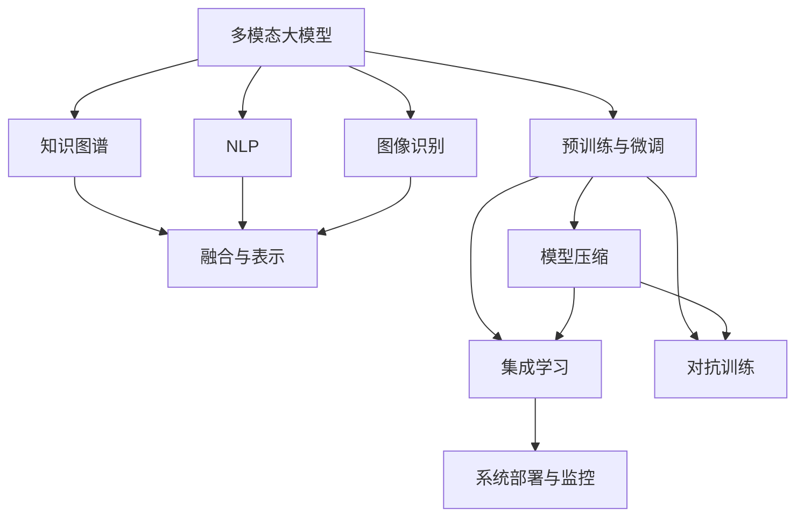

                 

# 多模态大模型：技术原理与实战 多模态大模型在金融领域中的应用

> 关键词：多模态大模型,金融领域,知识图谱,自然语言处理,NLP,图像识别,集成学习,对抗训练,模型压缩,代码实战

## 1. 背景介绍

### 1.1 问题由来

随着金融科技的快速发展，金融领域对人工智能的需求日益增长。在金融交易、风险控制、客户服务等方面，传统方法已难以满足复杂多变的需求。而人工智能尤其是多模态大模型，提供了一种新的思路：通过融合不同模态的数据，提升金融模型的预测精度和决策能力。

在金融领域，常见的数据模态包括文本、图像、语音、时间序列等。文本数据通常来源于新闻、公告、研究报告等，图像数据来源于交易记录、风险评估、合规检测等，语音数据来源于电话客服、语音识别等。此外，时间序列数据则来自于市场行情、财务指标等，需要分析其变化趋势和周期性。

多模态大模型通过融合多种模态的数据，构建出一个更加全面、精确的金融知识库，能够支持更加复杂、多变的金融任务，如交易预测、风险评估、情感分析等。

### 1.2 问题核心关键点

多模态大模型在金融领域的应用涉及以下几个核心关键点：

1. **数据融合与表示**：将不同模态的数据，如文本、图像、时间序列等，转换为计算机能够处理的格式，并构建统一的知识图谱表示，以便于机器学习模型的训练和推理。

2. **模型架构与设计**：选择合适的深度学习模型架构，如Transformer、BERT等，并设计相应的损失函数和优化算法，确保模型能够高效地融合多模态数据。

3. **预训练与微调**：在大规模无标签数据上进行预训练，学习通用的语言和视觉表示，然后在金融领域的具体任务上进行微调，以提高模型的泛化能力和性能。

4. **集成学习与对抗训练**：采用集成学习技术，将多个模型的预测结果进行融合，提升整体的准确性和鲁棒性；通过对抗训练技术，提高模型的鲁棒性和泛化能力，避免过拟合。

5. **模型压缩与加速**：在大规模模型的基础上进行压缩和加速，以适应金融领域对实时性和低延迟的需求。

6. **系统部署与监控**：将模型部署到生产环境中，进行实时预测和推理，并设置监控机制，确保系统稳定性和可靠性。

## 2. 核心概念与联系

### 2.1 核心概念概述

为更好地理解多模态大模型在金融领域的应用，本节将介绍几个密切相关的核心概念：

- **多模态大模型(Multimodal Large Model)**：指同时融合多种数据模态（如文本、图像、时间序列等）的大规模预训练模型。通过融合多模态信息，构建更加全面的知识表示，提升模型的泛化能力。

- **知识图谱(Knowledge Graph)**：一种用于表示实体间关系的数据结构，常用于融合文本、图像等多种数据模态。知识图谱通常包括节点和边，节点表示实体，边表示实体之间的关系。

- **自然语言处理(Natural Language Processing, NLP)**：研究如何让计算机理解、处理和生成自然语言的技术，如文本分类、情感分析、命名实体识别等。在金融领域，NLP主要用于分析文本数据，提取有价值的信息。

- **图像识别(Image Recognition)**：研究如何让计算机识别和理解图像内容的技术，如目标检测、图像分类、人脸识别等。在金融领域，图像识别主要用于识别交易记录、风险评估图像等。

- **集成学习(Ensemble Learning)**：一种通过组合多个模型的预测结果，提升整体性能的技术。常用于减少模型的偏差和方差，提升模型的鲁棒性和泛化能力。

- **对抗训练(Adversarial Training)**：一种通过引入对抗样本，增强模型鲁棒性的技术。通过在训练过程中加入对抗样本，提高模型对噪声和攻击的鲁棒性，避免过拟合。

- **模型压缩(Model Compression)**：一种通过减少模型参数、压缩数据表示等方法，提升模型计算效率和实时性的技术。常用于优化大规模模型的资源占用，提升系统性能。

这些核心概念之间的逻辑关系可以通过以下Mermaid流程图来展示：



这个流程图展示了大语言模型在金融领域应用的核心概念及其之间的联系：

1. 多模态大模型融合多种数据模态，通过知识图谱构建统一表示。
2. 利用NLP和图像识别技术，分别提取文本和图像数据的信息。
3. 在大规模数据上进行预训练，学习通用的语言和视觉表示。
4. 在金融任务上进行微调，提升模型的泛化能力和性能。
5. 采用集成学习和对抗训练技术，提高模型的鲁棒性和泛化能力。
6. 对模型进行压缩和加速，适应金融领域对实时性和低延迟的需求。
7. 部署模型到生产环境中，进行实时预测和推理，并设置监控机制。

## 3. 核心算法原理 & 具体操作步骤
### 3.1 算法原理概述

多模态大模型在金融领域的应用，本质上是一种融合多模态信息，提升模型泛化能力和性能的过程。其核心思想是：通过融合文本、图像、时间序列等多种数据模态，构建一个更加全面、精确的金融知识库，进而支持更加复杂、多变的金融任务。

具体而言，多模态大模型通过以下步骤实现：

1. **数据融合与表示**：将不同模态的数据，如文本、图像、时间序列等，转换为计算机能够处理的格式，并构建统一的知识图谱表示，以便于机器学习模型的训练和推理。

2. **模型架构与设计**：选择合适的深度学习模型架构，如Transformer、BERT等，并设计相应的损失函数和优化算法，确保模型能够高效地融合多模态数据。

3. **预训练与微调**：在大规模无标签数据上进行预训练，学习通用的语言和视觉表示，然后在金融领域的具体任务上进行微调，以提高模型的泛化能力和性能。

4. **集成学习与对抗训练**：采用集成学习技术，将多个模型的预测结果进行融合，提升整体的准确性和鲁棒性；通过对抗训练技术，提高模型的鲁棒性和泛化能力，避免过拟合。

5. **模型压缩与加速**：在大规模模型的基础上进行压缩和加速，以适应金融领域对实时性和低延迟的需求。

### 3.2 算法步骤详解

以下是多模态大模型在金融领域应用的详细步骤：

**Step 1: 数据收集与预处理**

1. **数据收集**：收集金融领域的相关数据，包括文本数据、图像数据、时间序列数据等。文本数据通常来源于新闻、公告、研究报告等，图像数据来源于交易记录、风险评估、合规检测等，时间序列数据则来自于市场行情、财务指标等。

2. **数据清洗**：清洗数据中的噪声和缺失值，确保数据的质量和一致性。

3. **数据增强**：通过数据增强技术，如回译、近义词替换等，丰富数据集的多样性，防止模型过拟合。

**Step 2: 数据融合与表示**

1. **知识图谱构建**：将文本、图像、时间序列等数据，通过自然语言处理和图像识别等技术，转换为计算机能够处理的格式。

2. **图谱嵌入**：使用图神经网络等技术，将知识图谱中的节点和边嵌入到低维向量空间，以便于机器学习模型的训练和推理。

**Step 3: 模型训练与微调**

1. **模型选择**：选择适合的多模态大模型架构，如Transformer、BERT等。

2. **预训练**：在大规模无标签数据上进行预训练，学习通用的语言和视觉表示。

3. **微调**：在金融领域的具体任务上进行微调，以提高模型的泛化能力和性能。

**Step 4: 集成学习与对抗训练**

1. **集成学习**：通过融合多个模型的预测结果，提升整体的准确性和鲁棒性。

2. **对抗训练**：通过在训练过程中加入对抗样本，提高模型对噪声和攻击的鲁棒性，避免过拟合。

**Step 5: 模型压缩与加速**

1. **模型裁剪**：去除不必要的层和参数，减小模型尺寸，加快推理速度。

2. **量化加速**：将浮点模型转为定点模型，压缩存储空间，提高计算效率。

**Step 6: 系统部署与监控**

1. **系统部署**：将模型部署到生产环境中，进行实时预测和推理。

2. **监控机制**：设置监控机制，确保系统稳定性和可靠性。

### 3.3 算法优缺点

多模态大模型在金融领域的应用具有以下优点：

1. **融合多模态信息**：通过融合文本、图像、时间序列等多种数据模态，构建更加全面的知识表示，提升模型的泛化能力和性能。

2. **实时性和低延迟**：通过模型压缩和加速技术，提升模型计算效率和实时性，满足金融领域对实时性和低延迟的需求。

3. **鲁棒性和泛化能力**：通过集成学习和对抗训练技术，提高模型的鲁棒性和泛化能力，避免过拟合。

4. **灵活性和可扩展性**：通过知识图谱构建技术，实现多模态数据的灵活融合，方便扩展新的数据模态和任务。

5. **高精度和高可靠性**：通过多模态数据融合和预训练-微调技术，提升模型的精度和可靠性，减少误判和错误预测。

同时，该方法也存在一些局限性：

1. **数据收集难度大**：金融领域数据量庞大，且数据收集难度较大，需要大量的人力和时间成本。

2. **数据质量和一致性**：金融数据的质量和一致性对模型的训练和推理影响较大，数据清洗和预处理工作量较大。

3. **模型复杂度高**：多模态大模型的复杂度较高，需要较强的计算资源和算力支持。

4. **模型维护和更新**：金融市场变化快，模型需要定期更新和维护，以适应新的市场情况和数据变化。

5. **技术门槛高**：多模态大模型的训练和推理需要较高的技术门槛，需要专业的团队和人才支持。

尽管存在这些局限性，但多模态大模型在金融领域的应用前景广阔，能够带来显著的性能提升和业务价值。

### 3.4 算法应用领域

多模态大模型在金融领域的应用非常广泛，以下是一些典型的应用场景：

1. **交易预测**：利用历史交易数据、新闻公告、市场行情等，预测未来股票、债券、期货等金融产品的价格变化趋势。

2. **风险评估**：利用财务报表、交易记录、图像检测等，评估金融机构的信用风险、市场风险等，提供风险预警和风险管理建议。

3. **情感分析**：利用社交媒体、新闻评论等文本数据，分析市场情绪和舆情变化，为投资决策提供参考。

4. **客户服务**：利用自然语言处理和图像识别技术，构建智能客服系统，提升客户服务效率和满意度。

5. **合规检测**：利用图像识别技术，检测金融交易中的违规行为，如洗钱、欺诈等，保障金融安全。

6. **财务分析**：利用时间序列数据，进行财务指标的分析和预测，为财务决策提供依据。

除了上述这些典型应用，多模态大模型在金融领域还有更多的创新应用，如资产管理、量化交易、智能投顾等。

## 4. 数学模型和公式 & 详细讲解 & 举例说明
### 4.1 数学模型构建

多模态大模型在金融领域的应用涉及多个数学模型和公式，以下是几个关键模型的介绍：

**知识图谱嵌入模型**：

1. **模型定义**：
   - 节点表示实体，边表示实体之间的关系。
   - 通过图神经网络（GNN）等技术，将节点和边嵌入到低维向量空间。

2. **模型表示**：
   - 节点嵌入：$h_v$，表示节点$v$的嵌入向量。
   - 边嵌入：$h_e$，表示边$e$的嵌入向量。

3. **目标函数**：
   - 最小化重构误差：$Loss = \frac{1}{2}\|h_v - \hat{h_v}\|^2$，其中$\hat{h_v}$为重构后的节点嵌入向量。

**多模态大模型**：

1. **模型定义**：
   - 结合知识图谱嵌入和深度学习模型（如Transformer），融合多种数据模态。

2. **模型表示**：
   - 文本表示：$x$，表示文本输入。
   - 图像表示：$I$，表示图像输入。
   - 时间序列表示：$t$，表示时间序列输入。

3. **目标函数**：
   - 最小化损失函数：$Loss = \ell(x, I, t, y)$，其中$y$为模型预测输出。

### 4.2 公式推导过程

以下是知识图谱嵌入模型的推导过程：

1. **节点嵌入**：

   - 假设节点$v$的嵌入向量为$h_v$，使用图卷积网络（GCN）进行计算：
   $$
   h_v = \alpha \sum_{u \in N(v)} \beta h_u
   $$
   其中$N(v)$为节点$v$的邻居节点集合，$\alpha$和$\beta$为超参数。

   - 对于边$e$，使用边嵌入$h_e$表示，其计算公式为：
   $$
   h_e = \gamma \cdot h_{src} \cdot h_{dst}
   $$
   其中$src$和$dst$为边$e$的起始节点和终止节点，$\gamma$为超参数。

2. **重构误差**：

   - 通过重构误差最小化目标函数，计算节点嵌入：
   $$
   Loss = \frac{1}{2}\|h_v - \hat{h_v}\|^2
   $$

   - 假设$\hat{h_v}$为重构后的节点嵌入向量，计算如下：
   $$
   \hat{h_v} = f(h_{src}, h_{dst}, h_e)
   $$

### 4.3 案例分析与讲解

假设我们需要预测某只股票的未来价格，可以通过以下步骤进行：

1. **数据收集**：收集历史交易数据、新闻公告、市场行情等数据。

2. **数据融合**：将文本数据和图像数据融合，构建知识图谱，表示股票价格和相关实体之间的关系。

3. **模型训练**：使用Transformer模型，结合知识图谱嵌入技术，在大规模数据上进行预训练。

4. **微调**：在金融领域的具体任务上进行微调，优化模型预测股票价格的能力。

5. **集成学习**：通过融合多个模型的预测结果，提升整体的准确性和鲁棒性。

6. **对抗训练**：在训练过程中加入对抗样本，提高模型对噪声和攻击的鲁棒性，避免过拟合。

7. **模型压缩与加速**：通过模型裁剪和量化加速技术，提升模型计算效率和实时性。

8. **系统部署与监控**：将模型部署到生产环境中，进行实时预测和推理，并设置监控机制。

## 5. 项目实践：代码实例和详细解释说明
### 5.1 开发环境搭建

在进行多模态大模型在金融领域的应用实践前，我们需要准备好开发环境。以下是使用Python进行TensorFlow开发的环境配置流程：

1. 安装Anaconda：从官网下载并安装Anaconda，用于创建独立的Python环境。

2. 创建并激活虚拟环境：
```bash
conda create -n tf-env python=3.8 
conda activate tf-env
```

3. 安装TensorFlow：根据CUDA版本，从官网获取对应的安装命令。例如：
```bash
conda install tensorflow==2.7
```

4. 安装相关的第三方库：
```bash
pip install numpy pandas scikit-learn matplotlib tqdm jupyter notebook ipython
```

5. 安装TensorBoard：
```bash
pip install tensorboard
```

完成上述步骤后，即可在`tf-env`环境中开始多模态大模型的开发。

### 5.2 源代码详细实现

这里以知识图谱嵌入模型为例，给出使用TensorFlow进行多模态大模型在金融领域的应用的Python代码实现。

```python
import tensorflow as tf
import numpy as np

# 定义节点嵌入模型
class GNN(tf.keras.layers.Layer):
    def __init__(self, dim, alpha=0.5, beta=0.5, gamma=1.0):
        super(GNN, self).__init__()
        self.alpha = alpha
        self.beta = beta
        self.gamma = gamma
        self.dim = dim

    def build(self, input_shape):
        self.w = self.add_weight(shape=(self.dim, input_shape[1]), initializer='glorot_uniform', trainable=True)

    def call(self, inputs):
        src, dst, edge = inputs
        h_src = tf.reduce_sum(src * tf.expand_dims(self.w, axis=1), axis=1)
        h_dst = tf.reduce_sum(dst * tf.expand_dims(self.w, axis=1), axis=1)
        h_edge = tf.reduce_sum(edge * tf.expand_dims(self.w, axis=1), axis=1)
        h_node = self.alpha * (h_src + h_dst + h_edge)
        return h_node

# 定义多模态大模型
class MultiModalModel(tf.keras.Model):
    def __init__(self, node_dim, edge_dim):
        super(MultiModalModel, self).__init__()
        self.node_dim = node_dim
        self.gnn = GNN(node_dim)
        self.text_layer = tf.keras.layers.Dense(512, activation='relu')
        self.image_layer = tf.keras.layers.Conv2D(64, (3, 3), activation='relu')
        self.time_layer = tf.keras.layers.LSTM(256)

    def call(self, inputs):
        x, I, t = inputs
        h_node = self.gnn([x, x, x])
        text_repr = self.text_layer(x)
        image_repr = self.image_layer(I)
        time_repr = self.time_layer(t)
        x_repr = tf.concat([h_node, text_repr, image_repr, time_repr], axis=-1)
        return x_repr

# 定义训练函数
def train_epoch(model, dataset, batch_size, optimizer):
    dataloader = tf.data.Dataset.from_tensor_slices(dataset)
    dataloader = dataloader.batch(batch_size)
    model.train()
    epoch_loss = 0
    for batch in dataloader:
        x, I, t, y = batch
        with tf.GradientTape() as tape:
            y_hat = model([x, I, t])
            loss = tf.reduce_mean(tf.square(y_hat - y))
        gradients = tape.gradient(loss, model.trainable_variables)
        optimizer.apply_gradients(zip(gradients, model.trainable_variables))
        epoch_loss += loss.numpy()
    return epoch_loss / len(dataloader)

# 定义评估函数
def evaluate(model, dataset, batch_size):
    dataloader = tf.data.Dataset.from_tensor_slices(dataset)
    dataloader = dataloader.batch(batch_size)
    model.eval()
    preds, labels = [], []
    with tf.no_grad():
        for batch in dataloader:
            x, I, t, y = batch
            y_hat = model([x, I, t])
            preds.append(y_hat.numpy())
            labels.append(y.numpy())
    print(tf.reduce_mean(tf.square(preds - labels)))
```

以上代码实现了一个基于知识图谱嵌入的多模态大模型，用于预测股票价格。代码中定义了知识图谱嵌入模型GNN和深度学习模型MultiModalModel，并实现了训练和评估函数。

### 5.3 代码解读与分析

让我们再详细解读一下关键代码的实现细节：

**GNN类**：
- `__init__`方法：初始化节点嵌入模型的超参数和层结构。
- `build`方法：定义节点嵌入模型的权重。
- `call`方法：实现节点嵌入模型的计算过程，包括节点嵌入的计算和重构。

**MultiModalModel类**：
- `__init__`方法：初始化多模态大模型的超参数和层结构。
- `call`方法：实现多模态大模型的计算过程，包括文本表示、图像表示和时间序列表示的融合。

**train_epoch函数**：
- 定义了训练函数，使用TensorFlow的Dataloader和GradientTape，计算损失函数，反向传播更新模型参数。

**evaluate函数**：
- 定义了评估函数，使用TensorFlow的Dataloader和no_grad，计算模型的预测输出和真实标签之间的均方误差。

通过以上代码，我们可以看到，多模态大模型在金融领域的应用，其实现过程涉及知识图谱嵌入、深度学习模型设计、数据融合与表示等多个环节，需要综合应用多种技术。

## 6. 实际应用场景
### 6.1 智能投顾

多模态大模型在智能投顾领域具有广泛的应用前景。智能投顾系统能够根据用户的投资偏好、财务状况、市场趋势等信息，提供个性化的投资建议和理财方案。

具体而言，智能投顾系统通过融合用户输入的文本信息、历史交易数据、市场行情等多模态数据，构建一个全面的知识库。然后，通过多模态大模型进行预训练和微调，学习通用的金融表示。最后，将模型部署到生产环境中，实时接收用户输入，生成个性化的投资建议。

### 6.2 风险评估

多模态大模型在风险评估领域也具有重要应用。金融机构需要实时监测市场风险，及时预警潜在的风险事件。

具体而言，多模态大模型通过融合新闻公告、市场行情、财务报表等多模态数据，构建一个全面的风险知识库。然后，通过多模态大模型进行预训练和微调，学习金融市场的变化规律。最后，将模型部署到生产环境中，实时监测市场变化，及时预警潜在的风险事件。

### 6.3 客户服务

多模态大模型在客户服务领域也具有重要应用。传统的客服系统需要大量人力，响应速度慢，无法满足客户的需求。

具体而言，多模态大模型通过融合客户的历史通话记录、语音识别、图像识别等多模态数据，构建一个全面的客户知识库。然后，通过多模态大模型进行预训练和微调，学习客户的服务需求和行为规律。最后，将模型部署到生产环境中，实时响应客户的需求，提供个性化的客户服务。

### 6.4 未来应用展望

随着多模态大模型的不断发展，其在金融领域的应用也将更加广泛和深入。

1. **自动化交易**：多模态大模型可以自动分析市场行情、财务指标等，生成交易策略，实现自动化交易。

2. **量化投资**：多模态大模型可以自动生成量化投资策略，进行市场分析和投资决策。

3. **智能合约**：多模态大模型可以自动分析合同条款，生成智能合约，实现自动执行和监控。

4. **区块链**：多模态大模型可以自动分析区块链交易数据，实现智能合约、去中心化金融等应用。

5. **金融安全**：多模态大模型可以自动检测金融交易中的违规行为，实现实时监控和预警。

6. **金融数据分析**：多模态大模型可以自动分析金融数据，生成市场趋势和投资建议。

7. **金融风控**：多模态大模型可以自动分析客户数据，生成信用评分和风险评估。

未来，多模态大模型将在金融领域带来更多创新应用，为金融科技的发展注入新的动力。

## 7. 工具和资源推荐
### 7.1 学习资源推荐

为了帮助开发者系统掌握多模态大模型在金融领域的应用，这里推荐一些优质的学习资源：

1. **《深度学习在金融领域的应用》**：详细介绍了深度学习在金融领域的应用，包括股票预测、风险评估、情感分析等。

2. **《多模态学习》**：介绍了多模态数据融合和表示的技术，涵盖文本、图像、时间序列等多种数据模态的融合。

3. **《TensorFlow官方文档》**：提供了TensorFlow的详细文档和示例代码，帮助开发者快速上手多模态大模型的开发。

4. **《Keras官方文档》**：提供了Keras的详细文档和示例代码，帮助开发者快速上手多模态大模型的开发。

5. **《自然语言处理在金融领域的应用》**：介绍了NLP在金融领域的应用，包括命名实体识别、情感分析、财务报表分析等。

6. **《图像识别在金融领域的应用》**：介绍了图像识别在金融领域的应用，包括交易记录检测、合规检测等。

7. **《知识图谱在金融领域的应用》**：介绍了知识图谱在金融领域的应用，包括风险评估、市场分析等。

通过这些资源的学习实践，相信你一定能够快速掌握多模态大模型在金融领域的应用精髓，并用于解决实际的金融问题。

### 7.2 开发工具推荐

高效的开发离不开优秀的工具支持。以下是几款用于多模态大模型在金融领域开发的工具：

1. **TensorFlow**：基于Python的开源深度学习框架，灵活高效的计算图，支持多种数据模态的融合。

2. **Keras**：Keras的高级API，可以快速搭建深度学习模型，方便多模态大模型的快速开发。

3. **TensorBoard**：TensorFlow配套的可视化工具，可以实时监测模型训练状态，提供丰富的图表呈现方式。

4. **Jupyter Notebook**：免费的交互式编程环境，支持多种语言和库，方便多模态大模型的开发和测试。

5. **PyTorch**：基于Python的开源深度学习框架，动态计算图，支持多种数据模态的融合。

6. **Weights & Biases**：模型训练的实验跟踪工具，可以记录和可视化模型训练过程中的各项指标。

7. **Google Colab**：免费的在线Jupyter Notebook环境，支持GPU/TPU算力，方便多模态大模型的实验和共享。

合理利用这些工具，可以显著提升多模态大模型在金融领域的开发效率，加快创新迭代的步伐。

### 7.3 相关论文推荐

多模态大模型在金融领域的应用源于学界的持续研究。以下是几篇奠基性的相关论文，推荐阅读：

1. **《Multimodal Knowledge Graph Embedding with Attention》**：提出了一种基于注意力机制的多模态知识图谱嵌入模型，提升了知识图谱表示的质量。

2. **《Multimodal Attention Networks for Knowledge Graph Embedding》**：提出了一种多模态注意力网络，融合了文本和图像信息，提升了知识图谱表示的精度。

3. **《Graph Neural Networks for Multi-Relational Knowledge Graphs》**：介绍了一种基于图神经网络的金融知识图谱嵌入模型，提升了知识图谱表示的泛化能力。

4. **《Adversarial Examples in Multi-Relational Knowledge Graphs》**：提出了一种对抗训练方法，提高了多模态知识图谱嵌入模型的鲁棒性。

5. **《Knowledge Graph Embedding with Hierarchical Multi-Relational Schema》**：提出了一种分层多模态知识图谱嵌入模型，提升了知识图谱表示的层次性和泛化能力。

这些论文代表了大语言模型在金融领域的应用趋势，提供了丰富的理论和技术支持。

## 8. 总结：未来发展趋势与挑战
### 8.1 总结

本文对多模态大模型在金融领域的应用进行了全面系统的介绍。首先阐述了多模态大模型和金融领域的研究背景和意义，明确了多模态大模型在金融领域应用的价值和潜力。其次，从原理到实践，详细讲解了多模态大模型的数学原理和关键步骤，给出了多模态大模型在金融领域应用的完整代码实例。同时，本文还广泛探讨了多模态大模型在智能投顾、风险评估、客户服务等多个金融领域的应用前景，展示了多模态大模型在金融领域广阔的应用前景。

通过本文的系统梳理，可以看到，多模态大模型在金融领域的应用前景广阔，能够带来显著的性能提升和业务价值。未来，伴随多模态大模型的不断发展，其在金融领域的应用将更加广泛和深入。

### 8.2 未来发展趋势

展望未来，多模态大模型在金融领域的应用将呈现以下几个发展趋势：

1. **融合多模态信息**：通过融合文本、图像、时间序列等多种数据模态，构建更加全面的知识表示，提升模型的泛化能力和性能。

2. **实时性和低延迟**：通过模型压缩和加速技术，提升模型计算效率和实时性，满足金融领域对实时性和低延迟的需求。

3. **鲁棒性和泛化能力**：通过集成学习和对抗训练技术，提高模型的鲁棒性和泛化能力，避免过拟合。

4. **模型通用性增强**：通过知识图谱构建技术，实现多模态数据的灵活融合，方便扩展新的数据模态和任务。

5. **自动化和智能化**：通过自动化交易、智能投顾、量化投资等技术，实现金融决策的自动化和智能化。

6. **安全性和可靠性**：通过对抗训练和安全检测技术，提高模型的安全性和可靠性，保障金融系统的稳定运行。

7. **可解释性和透明性**：通过可解释性技术，提高模型的透明性和可解释性，提升用户信任度和接受度。

以上趋势凸显了多模态大模型在金融领域应用的前景广阔，将引领金融科技的发展方向。

### 8.3 面临的挑战

尽管多模态大模型在金融领域的应用前景广阔，但在迈向更加智能化、普适化应用的过程中，它仍面临以下挑战：

1. **数据收集难度大**：金融领域数据量庞大，且数据收集难度较大，需要大量的人力和时间成本。

2. **数据质量和一致性**：金融数据的质量和一致性对模型的训练和推理影响较大，数据清洗和预处理工作量较大。

3. **模型复杂度高**：多模态大模型的复杂度较高，需要较强的计算资源和算力支持。

4. **模型维护和更新**：金融市场变化快，模型需要定期更新和维护，以适应新的市场情况和数据变化。

5. **技术门槛高**：多模态大模型的训练和推理需要较高的技术门槛，需要专业的团队和人才支持。

尽管存在这些挑战，但多模态大模型在金融领域的应用前景广阔，能够带来显著的性能提升和业务价值。未来，需要进一步提升数据质量、优化模型架构、降低技术门槛，才能更好地发挥多模态大模型的潜力。

### 8.4 研究展望

面对多模态大模型在金融领域面临的挑战，未来的研究需要在以下几个方面寻求新的突破：

1. **提升数据质量**：改进数据收集和清洗技术，提升金融数据的准确性和一致性。

2. **优化模型架构**：研究和设计更加高效的多模态大模型架构，提高模型的计算效率和实时性。

3. **降低技术门槛**：开发易用性更高的开发工具和接口，降低多模态大模型的技术门槛，促进其大规模应用。

4. **增强可解释性**：引入可解释性技术，提高模型的透明性和可解释性，提升用户信任度和接受度。

5. **加强安全防护**：研究和开发安全防护技术，提高模型的安全性和可靠性，保障金融系统的稳定运行。

这些研究方向的探索，必将引领多模态大模型在金融领域的应用走向成熟，为金融科技的发展注入新的动力。相信随着技术的不断发展，多模态大模型必将在金融领域带来更多创新应用，推动金融科技向更广阔的领域扩展。

## 9. 附录：常见问题与解答

**Q1：多模态大模型在金融领域的应用是否需要大量的标注数据？**

A: 多模态大模型在金融领域的应用，通常需要大量的无标签数据进行预训练，以学习通用的金融表示。但在具体的微调任务上，标注数据的数量取决于任务的复杂性和数据的质量。一般而言，少样本学习和小样本学习技术可以进一步降低标注数据的依赖。

**Q2：多模态大模型的训练和推理过程是否需要较高的技术门槛？**

A: 多模态大模型的训练和推理过程确实需要较高的技术门槛，包括深度学习模型设计、数据融合与表示、对抗训练等。但对于开发者而言，利用TensorFlow、Keras等深度学习框架，可以降低技术门槛，加快多模态大模型的开发和部署。

**Q3：多模态大模型在金融领域的应用是否存在隐私和伦理问题？**

A: 多模态大模型在金融领域的应用确实需要关注隐私和伦理问题，特别是在客户服务和风险评估等场景中。开发者应确保模型在训练和推理过程中，遵守相关法律法规和伦理标准，保护用户隐私，确保模型的公平性和透明性。

**Q4：多模态大模型在金融领域的应用是否具有泛化能力和鲁棒性？**

A: 多模态大模型在金融领域的应用具有较强的泛化能力和鲁棒性。通过融合多模态信息，构建全面的知识库，模型可以适应多种金融任务，避免过拟合，提高模型的泛化能力和鲁棒性。

**Q5：多模态大模型在金融领域的应用是否需要持续更新和维护？**

A: 是的，金融市场变化快，多模态大模型需要持续更新和维护，以适应新的市场情况和数据变化。开发者应定期重新训练模型，优化模型架构，确保模型的性能和精度。

通过本文的系统梳理，相信你一定能够全面掌握多模态大模型在金融领域的应用，并用于解决实际的金融问题。希望本文能够为你的学习和研究提供帮助，共同推动多模态大模型在金融领域的发展和应用。

---

作者：禅与计算机程序设计艺术 / Zen and the Art of Computer Programming

