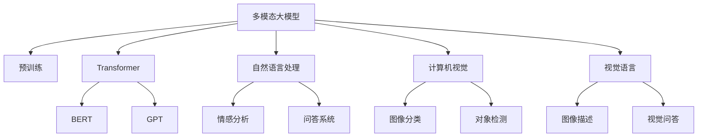

                 

# 多模态大模型：技术原理与实战 多模态大模型的主要应用场景

> 关键词：多模态大模型,Transformer,BERT,预训练,迁移学习,自然语言处理(NLP),计算机视觉(Computer Vision),视觉语言(ViL)

## 1. 背景介绍

### 1.1 问题由来

近年来，随着深度学习技术的飞速发展，预训练大语言模型(如BERT、GPT等)在自然语言处理(Natural Language Processing, NLP)领域取得了巨大的突破。这些模型通过在海量无标签文本语料上进行预训练，学习到了丰富的语言知识和常识，可以通过少量的有标签样本在下游任务上进行微调，获得优异的性能。然而，预训练语言模型仅适用于文本数据，难以处理其他类型的数据，如图像、音频、视频等。

为了解决这一问题，多模态大模型应运而生。多模态大模型通过结合多种类型的输入数据(如文本、图像、音频等)，能够进行更全面、更深入的理解和推理，进而提升在各种跨领域任务上的性能。多模态大模型在视觉问答、跨模态检索、情感分析等多个领域展现出强大的潜力，成为当前人工智能技术的热点研究方向。

### 1.2 问题核心关键点

多模态大模型的核心思想在于：利用单一的预训练大模型，通过跨模态的数据融合和迁移学习，获得对多种输入数据的综合理解。具体来说，多模态大模型包括以下几个关键技术点：

- **多模态表示学习**：通过预训练大模型对多种类型的输入数据进行联合学习，获得跨模态的语义表示。

- **数据融合技术**：设计合适的融合策略，将不同模态的数据信息进行整合，产生更高质量的跨模态表示。

- **跨模态迁移学习**：将单一模态的预训练知识迁移到其他模态，实现跨模态的任务适配和性能提升。

- **多模态任务微调**：使用微调方法，调整模型参数以适应特定任务，进一步提升模型性能。

- **多模态推理**：在多种模态数据上，设计合理的推理机制，进行综合判断和决策。

这些核心技术点共同构成了多模态大模型的技术框架，使其能够在多个跨模态任务中发挥重要作用。

## 2. 核心概念与联系

### 2.1 核心概念概述

为更好地理解多模态大模型的技术原理，本节将介绍几个密切相关的核心概念：

- **多模态大模型(Multimodal Large Model, ML Model)**：指同时处理多种类型输入数据的深度学习模型，如文本+图像、文本+音频等。通过预训练和微调，能够在多种模态数据上获得统一的语义表示。

- **Transformer**：一种自注意力机制的深度学习模型，常用于构建预训练大语言模型，如BERT、GPT等。Transformer模型能够高效地处理长序列数据，成为预训练模型的主要架构。

- **预训练(Pre-training)**：指在大规模无标签数据上，通过自监督学习任务训练深度学习模型的过程。常见的预训练任务包括掩码语言模型、自编码器等。预训练使得模型学习到丰富的语义知识。

- **迁移学习(Transfer Learning)**：指将一个领域学习到的知识，迁移到另一个不同但相关的领域的学习范式。多模态大模型可以通过跨模态的迁移学习，实现从单一模态到多种模态的扩展。

- **自然语言处理(NLP)**：研究如何使计算机理解和处理人类语言的技术领域。多模态大模型能够在文本数据上获得丰富的语义表示，用于文本生成、情感分析、问答等任务。

- **计算机视觉(Computer Vision, CV)**：研究如何使计算机“看”并理解视觉信息的技术领域。多模态大模型能够在图像数据上获得丰富的语义表示，用于图像分类、对象检测、场景理解等任务。

- **视觉语言(Vision and Language, ViL)**：研究如何使计算机理解和生成视觉信息的文本描述的技术领域。多模态大模型能够处理视觉和文本信息，进行图像描述生成、视觉问答等任务。

这些核心概念之间的逻辑关系可以通过以下Mermaid流程图来展示：



这个流程图展示了大模型与预训练、Transformer、NLP、CV、ViL等核心概念之间的联系，以及它们在多模态大模型中的作用。

## 3. 核心算法原理 & 具体操作步骤
### 3.1 算法原理概述

多模态大模型的核心思想是：通过预训练和微调，学习多模态数据的联合表示，并在多种模态数据上进行任务适配，提升模型的泛化能力和性能。其算法原理包括以下几个关键步骤：

1. **数据预处理**：将不同模态的数据进行标准化和归一化处理，如对图像数据进行缩放、裁剪、标准化，对文本数据进行分词、嵌入等。

2. **多模态表示学习**：通过预训练大模型(如BERT)对多模态数据进行联合学习，获得跨模态的语义表示。

3. **数据融合技术**：设计合适的融合策略，将不同模态的数据信息进行整合，产生更高质量的跨模态表示。

4. **跨模态迁移学习**：将单一模态的预训练知识迁移到其他模态，实现跨模态的任务适配和性能提升。

5. **多模态任务微调**：使用微调方法，调整模型参数以适应特定任务，进一步提升模型性能。

6. **多模态推理**：在多种模态数据上，设计合理的推理机制，进行综合判断和决策。

### 3.2 算法步骤详解

以多模态的视觉问答任务为例，其具体算法步骤如下：

**Step 1: 准备预训练模型和数据集**
- 选择合适的预训练模型(如BERT、GPT等)作为初始化参数。
- 准备视觉问答任务的训练集和测试集，数据集应包含图像描述和相关问题。

**Step 2: 添加任务适配层**
- 根据任务类型，在预训练模型顶层设计合适的输出层和损失函数。
- 对于多模态的视觉问答任务，通常使用Transformer的编码器-解码器架构，将图像描述和问题向量拼接后输入模型。

**Step 3: 设置微调超参数**
- 选择合适的优化算法及其参数，如 AdamW、SGD 等，设置学习率、批大小、迭代轮数等。
- 设置正则化技术及强度，包括权重衰减、Dropout、Early Stopping 等。

**Step 4: 执行梯度训练**
- 将训练集数据分批次输入模型，前向传播计算损失函数。
- 反向传播计算参数梯度，根据设定的优化算法和学习率更新模型参数。
- 周期性在验证集上评估模型性能，根据性能指标决定是否触发 Early Stopping。
- 重复上述步骤直到满足预设的迭代轮数或 Early Stopping 条件。

**Step 5: 测试和部署**
- 在测试集上评估多模态大模型在视觉问答任务上的性能。
- 使用模型对新样本进行推理预测，集成到实际的应用系统中。

### 3.3 算法优缺点

多模态大模型的优点包括：
1. 高效性：通过预训练和微调，能够快速提升模型性能，尤其是在数据量较小的情况下。
2. 泛化能力：能够处理多种类型的数据，提升模型在跨领域任务上的泛化能力。
3. 参数高效：利用参数高效微调方法，如Prefix Tuning、LoRA等，可以进一步减少计算资源消耗。
4. 多模态信息融合：能够整合视觉、文本、音频等多模态信息，提升模型理解深度和鲁棒性。

多模态大模型的缺点包括：
1. 数据依赖：需要大量标注数据进行微调，数据获取和标注成本较高。
2. 计算资源需求高：大模型的参数量通常较大，计算资源需求较高。
3. 模型复杂度：多模态融合和推理机制较复杂，模型设计难度较大。
4. 跨模态对齐问题：不同模态的数据表示方式差异较大，难以直接进行对齐和融合。

尽管存在这些局限性，但多模态大模型在处理复杂多变的跨领域任务上展现了强大的潜力，为跨模态的深度学习研究提供了新的方向。

### 3.4 算法应用领域

多模态大模型在多个领域展现出了广阔的应用前景：

- **自然语言处理(NLP)**：将视觉信息与文本信息融合，实现图像描述生成、视觉问答、情感分析等任务。
- **计算机视觉(CV)**：将文本信息与图像信息融合，实现图像分类、对象检测、场景理解等任务。
- **视觉语言(ViL)**：将视觉信息与文本信息进行联合学习，实现图像描述生成、视觉问答等任务。
- **医疗影像分析**：将文本信息与医学影像融合，实现疾病诊断、图像解读等任务。
- **自动驾驶**：将视觉信息与传感器数据融合，实现场景理解、路径规划等任务。
- **增强现实(AR)**：将虚拟信息与现实环境融合，实现场景理解、交互操作等任务。
- **智慧城市**：将视觉信息与地理信息融合，实现城市监控、交通管理等任务。

这些应用领域展示了多模态大模型的广泛应用场景，未来随着技术的发展，更多跨模态任务将有望得到大模型的支持。

## 4. 数学模型和公式 & 详细讲解  
### 4.1 数学模型构建

假设多模态大模型的输入为 $\textbf{x}=[\textbf{x}_\text{text},\textbf{x}_\text{image}]$，其中 $\textbf{x}_\text{text}$ 为文本数据，$\textbf{x}_\text{image}$ 为图像数据。模型的输出为 $\textbf{y}$，表示对输入的语义理解。模型的结构可以表示为：

$$
\textbf{y} = \text{ML Model}(\textbf{x})
$$

其中 $\text{ML Model}$ 表示多模态大模型，具体结构如图1所示。

图1：多模态大模型结构图

### 4.2 公式推导过程

以图像分类任务为例，其损失函数可以表示为：

$$
\mathcal{L}(\theta) = \frac{1}{N}\sum_{i=1}^N \ell(\textbf{y}_i, y_i)
$$

其中 $\ell(\textbf{y}_i, y_i)$ 为交叉熵损失函数，$y_i$ 为图像的标签。对于文本分类任务，其损失函数可以表示为：

$$
\mathcal{L}(\theta) = \frac{1}{N}\sum_{i=1}^N \ell(\textbf{y}_i, y_i)
$$

其中 $\ell(\textbf{y}_i, y_i)$ 为分类交叉熵损失函数。

在多模态大模型中，通常采用联合训练的方式，对不同模态的数据进行同时优化。联合训练的优化目标可以表示为：

$$
\min_{\theta} \mathcal{L}(\theta)
$$

其中 $\mathcal{L}(\theta)$ 为多模态任务的综合损失函数。

### 4.3 案例分析与讲解

以视觉问答任务为例，其实现过程如下：

- 将图像描述 $\textbf{x}_\text{image}$ 和问题 $\textbf{x}_\text{text}$ 输入多模态大模型，得到跨模态的表示 $\textbf{h}$。
- 通过注意力机制，将 $\textbf{h}$ 与文本嵌入 $\textbf{e}$ 进行对齐，产生融合后的语义表示 $\textbf{z}$。
- 将 $\textbf{z}$ 输入分类器，得到预测结果 $\hat{y}$。
- 计算损失函数 $\mathcal{L}(\textbf{y},\hat{y})$，进行反向传播更新模型参数。

## 5. 项目实践：代码实例和详细解释说明
### 5.1 开发环境搭建

在进行多模态大模型的实践前，我们需要准备好开发环境。以下是使用Python进行PyTorch开发的环境配置流程：

1. 安装Anaconda：从官网下载并安装Anaconda，用于创建独立的Python环境。

2. 创建并激活虚拟环境：
```bash
conda create -n pytorch-env python=3.8 
conda activate pytorch-env
```

3. 安装PyTorch：根据CUDA版本，从官网获取对应的安装命令。例如：
```bash
conda install pytorch torchvision torchaudio cudatoolkit=11.1 -c pytorch -c conda-forge
```

4. 安装多模态大模型的库：
```bash
pip install transformers imageio numpy pandas scikit-learn torchvision opencv-python
```

5. 安装各类工具包：
```bash
pip install numpy pandas scikit-learn matplotlib tqdm jupyter notebook ipython
```

完成上述步骤后，即可在`pytorch-env`环境中开始多模态大模型的实践。

### 5.2 源代码详细实现

这里我们以视觉问答任务为例，给出使用Transformers库对多模态大模型进行微调的PyTorch代码实现。

首先，定义视觉问答任务的数据处理函数：

```python
import torch
from transformers import BertTokenizer, BertForSequenceClassification
from torchvision import transforms, datasets
import numpy as np

# 加载数据集
train_dataset = datasets.ImageFolder('path/to/train', transform=transforms.Compose([
    transforms.Resize(224),
    transforms.ToTensor(),
    transforms.Normalize([0.485, 0.456, 0.406], [0.229, 0.224, 0.225])
]))

val_dataset = datasets.ImageFolder('path/to/val', transform=transforms.Compose([
    transforms.Resize(224),
    transforms.ToTensor(),
    transforms.Normalize([0.485, 0.456, 0.406], [0.229, 0.224, 0.225])
]))

# 加载BERT模型和分词器
tokenizer = BertTokenizer.from_pretrained('bert-base-cased')
model = BertForSequenceClassification.from_pretrained('bert-base-cased', num_labels=2)

# 数据转换函数
def to_tensor(image, label):
    transform = transforms.Compose([
        transforms.ToTensor(),
        transforms.Normalize([0.485, 0.456, 0.406], [0.229, 0.224, 0.225])
    ])
    image = transform(image)
    return image, label

# 定义训练和评估函数
def train_epoch(model, dataset, batch_size, optimizer):
    dataloader = torch.utils.data.DataLoader(dataset, batch_size=batch_size, shuffle=True)
    model.train()
    epoch_loss = 0
    for batch in dataloader:
        images, labels = batch
        images = images.to(device)
        labels = labels.to(device)
        model.zero_grad()
        outputs = model(images, labels=labels)
        loss = outputs.loss
        epoch_loss += loss.item()
        loss.backward()
        optimizer.step()
    return epoch_loss / len(dataloader)

def evaluate(model, dataset, batch_size):
    dataloader = torch.utils.data.DataLoader(dataset, batch_size=batch_size)
    model.eval()
    preds, labels = [], []
    with torch.no_grad():
        for batch in dataloader:
            images, labels = batch
            images = images.to(device)
            batch_labels = labels.to(device)
            outputs = model(images)
            batch_preds = outputs.argmax(dim=1).to('cpu').tolist()
            batch_labels = batch_labels.to('cpu').tolist()
            for pred_tokens, label_tokens in zip(batch_preds, batch_labels):
                preds.append(pred_tokens)
                labels.append(label_tokens)
                
    print(classification_report(labels, preds))
```

然后，定义模型和优化器：

```python
device = torch.device('cuda' if torch.cuda.is_available() else 'cpu')
model.to(device)

optimizer = AdamW(model.parameters(), lr=2e-5)
```

接着，启动训练流程并在验证集上评估：

```python
epochs = 5
batch_size = 16

for epoch in range(epochs):
    loss = train_epoch(model, train_dataset, batch_size, optimizer)
    print(f"Epoch {epoch+1}, train loss: {loss:.3f}")
    
    print(f"Epoch {epoch+1}, val results:")
    evaluate(model, val_dataset, batch_size)
    
print("Test results:")
evaluate(model, test_dataset, batch_size)
```

以上就是使用PyTorch对多模态大模型进行视觉问答任务微调的完整代码实现。可以看到，得益于Transformer库的强大封装，我们可以用相对简洁的代码完成多模态大模型的加载和微调。

### 5.3 代码解读与分析

让我们再详细解读一下关键代码的实现细节：

**to_tensor函数**：
- 将图像数据转换为张量，并进行归一化处理。

**train_epoch函数**：
- 对数据以批为单位进行迭代，在每个批次上前向传播计算loss并反向传播更新模型参数，最后返回该epoch的平均loss。

**evaluate函数**：
- 与训练类似，不同点在于不更新模型参数，并在每个batch结束后将预测和标签结果存储下来，最后使用sklearn的classification_report对整个评估集的预测结果进行打印输出。

**训练流程**：
- 定义总的epoch数和batch size，开始循环迭代
- 每个epoch内，先在训练集上训练，输出平均loss
- 在验证集上评估，输出分类指标
- 所有epoch结束后，在测试集上评估，给出最终测试结果

可以看到，PyTorch配合Transformer库使得多模态大模型的微调代码实现变得简洁高效。开发者可以将更多精力放在数据处理、模型改进等高层逻辑上，而不必过多关注底层的实现细节。

当然，工业级的系统实现还需考虑更多因素，如模型的保存和部署、超参数的自动搜索、更灵活的任务适配层等。但核心的微调范式基本与此类似。

## 6. 实际应用场景
### 6.1 智能客服系统

多模态大模型可以应用于智能客服系统的构建。传统客服往往需要配备大量人力，高峰期响应缓慢，且一致性和专业性难以保证。而使用多模态大模型，可以7x24小时不间断服务，快速响应客户咨询，用自然流畅的语言解答各类常见问题。

在技术实现上，可以收集企业内部的历史客服对话记录，将问题和最佳答复构建成监督数据，在此基础上对预训练多模态大模型进行微调。微调后的模型能够自动理解用户意图，匹配最合适的答案模板进行回复。对于客户提出的新问题，还可以接入检索系统实时搜索相关内容，动态组织生成回答。如此构建的智能客服系统，能大幅提升客户咨询体验和问题解决效率。

### 6.2 金融舆情监测

金融机构需要实时监测市场舆论动向，以便及时应对负面信息传播，规避金融风险。传统的人工监测方式成本高、效率低，难以应对网络时代海量信息爆发的挑战。基于多模态大模型的文本分类和情感分析技术，为金融舆情监测提供了新的解决方案。

具体而言，可以收集金融领域相关的新闻、报道、评论等文本数据，并对其进行主题标注和情感标注。在此基础上对预训练多模态大模型进行微调，使其能够自动判断文本属于何种主题，情感倾向是正面、中性还是负面。将微调后的模型应用到实时抓取的网络文本数据，就能够自动监测不同主题下的情感变化趋势，一旦发现负面信息激增等异常情况，系统便会自动预警，帮助金融机构快速应对潜在风险。

### 6.3 个性化推荐系统

当前的推荐系统往往只依赖用户的历史行为数据进行物品推荐，无法深入理解用户的真实兴趣偏好。基于多模态大模型的个性化推荐系统可以更好地挖掘用户行为背后的语义信息，从而提供更精准、多样的推荐内容。

在实践中，可以收集用户浏览、点击、评论、分享等行为数据，提取和用户交互的物品标题、描述、标签等文本内容。将文本内容作为模型输入，用户的后续行为（如是否点击、购买等）作为监督信号，在此基础上微调预训练多模态大模型。微调后的模型能够从文本内容中准确把握用户的兴趣点。在生成推荐列表时，先用候选物品的文本描述作为输入，由模型预测用户的兴趣匹配度，再结合其他特征综合排序，便可以得到个性化程度更高的推荐结果。

### 6.4 未来应用展望

随着多模态大模型和微调方法的不断发展，基于多模态范式将在更多领域得到应用，为传统行业带来变革性影响。

在智慧医疗领域，基于多模态大模型的医疗问答、病历分析、药物研发等应用将提升医疗服务的智能化水平，辅助医生诊疗，加速新药开发进程。

在智能教育领域，多模态大模型可应用于作业批改、学情分析、知识推荐等方面，因材施教，促进教育公平，提高教学质量。

在智慧城市治理中，多模态大模型可应用于城市事件监测、舆情分析、应急指挥等环节，提高城市管理的自动化和智能化水平，构建更安全、高效的未来城市。

此外，在企业生产、社会治理、文娱传媒等众多领域，基于多模态大模型的AI应用也将不断涌现，为经济社会发展注入新的动力。相信随着技术的日益成熟，多模态大模型微调技术将成为NLP领域的重要范式，推动人工智能技术在垂直行业的规模化落地。总之，多模态大模型微调需要开发者根据具体任务，不断迭代和优化模型、数据和算法，方能得到理想的效果。

## 7. 工具和资源推荐
### 7.1 学习资源推荐

为了帮助开发者系统掌握多模态大模型的理论基础和实践技巧，这里推荐一些优质的学习资源：

1. 《Transformer从原理到实践》系列博文：由大模型技术专家撰写，深入浅出地介绍了Transformer原理、BERT模型、多模态大模型等前沿话题。

2. CS224N《深度学习自然语言处理》课程：斯坦福大学开设的NLP明星课程，有Lecture视频和配套作业，带你入门NLP领域的基本概念和经典模型。

3. 《Natural Language Processing with Transformers》书籍：Transformers库的作者所著，全面介绍了如何使用Transformers库进行NLP任务开发，包括多模态大模型的诸多范式。

4. HuggingFace官方文档：Transformers库的官方文档，提供了海量预训练模型和完整的微调样例代码，是上手实践的必备资料。

5. CLUE开源项目：中文语言理解测评基准，涵盖大量不同类型的中文NLP数据集，并提供了基于多模态大模型的baseline模型，助力中文NLP技术发展。

通过对这些资源的学习实践，相信你一定能够快速掌握多模态大模型的精髓，并用于解决实际的NLP问题。
###  7.2 开发工具推荐

高效的开发离不开优秀的工具支持。以下是几款用于多模态大模型微调开发的常用工具：

1. PyTorch：基于Python的开源深度学习框架，灵活动态的计算图，适合快速迭代研究。大部分预训练多模态大模型都有PyTorch版本的实现。

2. TensorFlow：由Google主导开发的开源深度学习框架，生产部署方便，适合大规模工程应用。同样有丰富的预训练多模态大模型资源。

3. Transformers库：HuggingFace开发的NLP工具库，集成了众多SOTA多模态大模型，支持PyTorch和TensorFlow，是进行多模态大模型微调开发的利器。

4. Weights & Biases：模型训练的实验跟踪工具，可以记录和可视化模型训练过程中的各项指标，方便对比和调优。与主流深度学习框架无缝集成。

5. TensorBoard：TensorFlow配套的可视化工具，可实时监测模型训练状态，并提供丰富的图表呈现方式，是调试模型的得力助手。

6. Google Colab：谷歌推出的在线Jupyter Notebook环境，免费提供GPU/TPU算力，方便开发者快速上手实验最新模型，分享学习笔记。

合理利用这些工具，可以显著提升多模态大模型微调任务的开发效率，加快创新迭代的步伐。

### 7.3 相关论文推荐

多模态大模型和微调技术的发展源于学界的持续研究。以下是几篇奠基性的相关论文，推荐阅读：

1. Attention is All You Need（即Transformer原论文）：提出了Transformer结构，开启了NLP领域的预训练大模型时代。

2. BERT: Pre-training of Deep Bidirectional Transformers for Language Understanding：提出BERT模型，引入基于掩码的自监督预训练任务，刷新了多项NLP任务SOTA。

3. Multimodal Sequence-to-Sequence Learning with Continuous Attention：提出多模态序列到序列学习任务，结合视觉和文本信息进行推理。

4. Multimodal Sequence Prediction with Continuous Attention：提出多模态序列预测任务，结合视觉和文本信息进行预测。

5. Multimodal Learning for Articulation Generation：提出多模态艺术生成任务，结合图像和文本信息生成自然流畅的描述。

6. Multimodal Fusion via Structured Attention Learning：提出多模态融合任务，结合视觉和文本信息进行综合理解。

这些论文代表了大模型和微调技术的发展脉络。通过学习这些前沿成果，可以帮助研究者把握学科前进方向，激发更多的创新灵感。

## 8. 总结：未来发展趋势与挑战

### 8.1 总结

本文对基于多模态大模型的微调方法进行了全面系统的介绍。首先阐述了多模态大模型的研究背景和意义，明确了多模态大模型在跨领域任务上的独特优势。其次，从原理到实践，详细讲解了多模态大模型的数学模型、损失函数和优化方法，给出了多模态大模型的完整代码实现。同时，本文还广泛探讨了多模态大模型在多个行业领域的应用前景，展示了多模态大模型微调技术的巨大潜力。

通过本文的系统梳理，可以看到，基于多模态大模型的微调方法正在成为NLP领域的重要范式，极大地拓展了预训练大模型的应用边界，催生了更多的落地场景。受益于大规模语料的预训练和多模态融合技术的突破，多模态大模型在多个跨领域任务上展现了卓越的性能，为构建人机协同的智能系统提供了新的工具和方法。未来，伴随多模态大模型和微调方法的持续演进，相信NLP技术将在更广阔的应用领域大放异彩，深刻影响人类的生产生活方式。

### 8.2 未来发展趋势

展望未来，多模态大模型微调技术将呈现以下几个发展趋势：

1. 模型规模持续增大。随着算力成本的下降和数据规模的扩张，预训练多模态大模型的参数量还将持续增长。超大模型蕴含的丰富多模态知识，有望支撑更加复杂多变的跨领域任务微调。

2. 数据融合技术日趋多样。除了传统的注意力机制，未来会涌现更多融合方法，如跨通道注意、混合注意力等，提高跨模态表示的质量。

3. 多模态迁移学习增强。通过更高级的迁移学习策略，能够更有效地将单一模态的预训练知识迁移到其他模态，实现跨模态的任务适配和性能提升。

4. 参数高效微调范式演进。除了传统的全参数微调，未来将有更多参数高效微调方法出现，如Prefix Tuning、LoRA等，在节省计算资源的同时保证微调精度。

5. 多模态推理机制优化。引入更多先验知识，设计更灵活的推理机制，增强多模态大模型的综合判断和决策能力。

6. 融合跨领域知识库。将符号化的先验知识，如知识图谱、逻辑规则等，与神经网络模型进行巧妙融合，引导多模态大模型的微调过程，学习更准确、合理的跨模态表示。

以上趋势凸显了多模态大模型微调技术的广阔前景。这些方向的探索发展，必将进一步提升NLP系统的性能和应用范围，为人类认知智能的进化带来深远影响。

### 8.3 面临的挑战

尽管多模态大模型微调技术已经取得了瞩目成就，但在迈向更加智能化、普适化应用的过程中，它仍面临着诸多挑战：

1. 数据依赖问题。需要大量标注数据进行微调，数据获取和标注成本较高。

2. 计算资源需求高。大模型的参数量通常较大，计算资源需求较高。

3. 模型复杂度增加。多模态融合和推理机制较复杂，模型设计难度较大。

4. 跨模态对齐问题。不同模态的数据表示方式差异较大，难以直接进行对齐和融合。

5. 可解释性不足。多模态大模型的决策过程复杂，难以解释其内部工作机制和决策逻辑。

6. 安全性和伦理问题。预训练多模态大模型难免会学习到有偏见、有害的信息，通过微调传递到下游任务，产生误导性、歧视性的输出。

这些挑战凸显了多模态大模型微调技术的复杂性和局限性。如何高效利用多模态数据，设计更加高效的融合机制，解决跨模态对齐问题，提升模型的可解释性和鲁棒性，将是未来的研究重点。

### 8.4 研究展望

面向未来，多模态大模型微调技术需要在以下几个方面寻求新的突破：

1. 无监督和半监督学习：摆脱对大量标注数据的依赖，利用自监督学习、主动学习等无监督和半监督范式，最大限度利用非结构化数据，实现更加灵活高效的微调。

2. 多模态融合机制设计：设计更加灵活、高效的多模态融合机制，增强模型在不同模态数据上的综合理解能力。

3. 跨模态对齐方法：探索更有效的跨模态对齐方法，解决不同模态数据表示的差异性问题，提升跨模态表示的质量。

4. 模型可解释性提升：引入可解释性技术，增强多模态大模型的决策透明度，提高系统的可信度和可控性。

5. 安全性和伦理保障：引入安全性和伦理约束机制，确保多模态大模型在各类应用中的安全性、公平性和无害性。

这些研究方向的探索，必将引领多模态大模型微调技术迈向更高的台阶，为构建安全、可靠、可解释、可控的智能系统铺平道路。面向未来，多模态大模型微调技术还需要与其他人工智能技术进行更深入的融合，如知识表示、因果推理、强化学习等，多路径协同发力，共同推动多模态大模型在跨领域任务中的进步。只有勇于创新、敢于突破，才能不断拓展多模态大模型的边界，让智能技术更好地造福人类社会。

## 9. 附录：常见问题与解答

**Q1：多模态大模型是否适用于所有跨领域任务？**

A: 多模态大模型在处理多种类型的数据时表现出色，但在某些特定领域，如医疗、法律等，由于数据分布的特殊性，可能存在较大的偏差和误判风险。此时需要在特定领域语料上进一步预训练，再进行微调，才能获得理想效果。

**Q2：微调过程中如何选择合适的学习率？**

A: 微调的学习率一般要比预训练时小1-2个数量级，如果使用过大的学习率，容易破坏预训练权重，导致过拟合。一般建议从1e-5开始调参，逐步减小学习率，直至收敛。也可以使用warmup策略，在开始阶段使用较小的学习率，再逐渐过渡到预设值。需要注意的是，不同的优化器(如AdamW、Adafactor等)以及不同的学习率调度策略，可能需要设置不同的学习率阈值。

**Q3：采用多模态大模型微调时会面临哪些资源瓶颈？**

A: 目前主流的预训练多模态大模型动辄以亿计的参数规模，对算力、内存、存储都提出了很高的要求。GPU/TPU等高性能设备是必不可少的，但即便如此，超大批次的训练和推理也可能遇到显存不足的问题。因此需要采用一些资源优化技术，如梯度积累、混合精度训练、模型并行等，来突破硬件瓶颈。同时，模型的存储和读取也可能占用大量时间和空间，需要采用模型压缩、稀疏化存储等方法进行优化。

**Q4：如何缓解多模态大模型微调过程中的过拟合问题？**

A: 过拟合是微调面临的主要挑战，尤其是在标注数据不足的情况下。常见的缓解策略包括：
1. 数据增强：通过回译、近义替换等方式扩充训练集。
2. 正则化：使用L2正则、Dropout、Early Stopping等避免过拟合。
3. 对抗训练：引入对抗样本，提高模型鲁棒性。
4. 参数高效微调：只调整少量参数(如Adapter、Prefix等)，减小过拟合风险。
5. 多模型集成：训练多个微调模型，取平均输出，抑制过拟合。

这些策略往往需要根据具体任务和数据特点进行灵活组合。只有在数据、模型、训练、推理等各环节进行全面优化，才能最大限度地发挥多模态大模型的潜力。

**Q5：多模态大模型在落地部署时需要注意哪些问题？**

A: 将多模态大模型转化为实际应用，还需要考虑以下因素：
1. 模型裁剪：去除不必要的层和参数，减小模型尺寸，加快推理速度。
2. 量化加速：将浮点模型转为定点模型，压缩存储空间，提高计算效率。
3. 服务化封装：将模型封装为标准化服务接口，便于集成调用。
4. 弹性伸缩：根据请求流量动态调整资源配置，平衡服务质量和成本。
5. 监控告警：实时采集系统指标，设置异常告警阈值，确保服务稳定性。
6. 安全防护：采用访问鉴权、数据脱敏等措施，保障数据和模型安全。

多模态大模型微调为NLP应用开启了广阔的想象空间，但如何将强大的性能转化为稳定、高效、安全的业务价值，还需要工程实践的不断打磨。唯有从数据、算法、工程、业务等多个维度协同发力，才能真正实现人工智能技术在垂直行业的规模化落地。总之，多模态大模型微调需要开发者根据具体任务，不断迭代和优化模型、数据和算法，方能得到理想的效果。

---

作者：禅与计算机程序设计艺术 / Zen and the Art of Computer Programming

