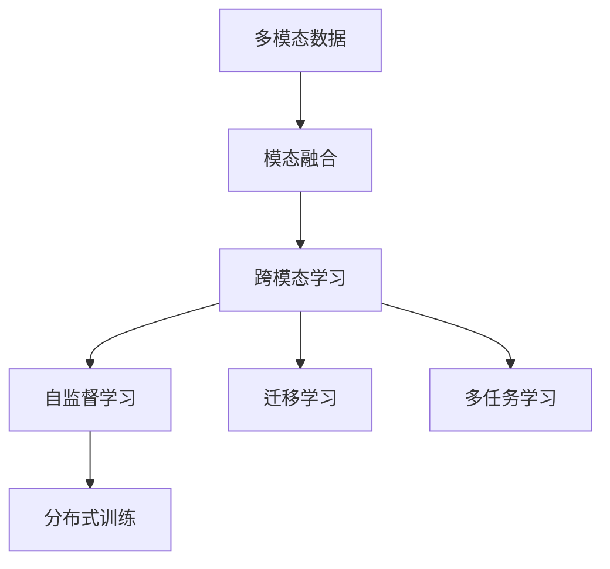

                 

## 1. 背景介绍

### 1.1 问题由来

随着深度学习技术的飞速发展，多模态大模型在图像、音频、文本等多模态数据融合、理解和生成任务中取得了突破性进展。多模态大模型集成了文本、图像、音频等多种模态的信息，通过自监督学习和迁移学习的方式在多领域、多任务上展现了卓越的性能。

然而，多模态大模型的训练过程非常复杂，训练成本高昂。传统的单一模态模型无法直接应用到多模态数据上，需要通过特殊的设计来处理不同模态之间的信息交互。同时，训练过程中需要处理大规模的多模态数据，如何高效地利用数据和算力，是当前需要重点解决的问题。

### 1.2 问题核心关键点

多模态大模型的高效训练涉及以下几个关键点：

- **数据预处理与融合**：如何有效地将不同模态的数据进行拼接、对齐和融合，同时保留各模态的信息。
- **模型架构设计**：如何设计能够高效处理多模态数据、并行计算的模型架构。
- **训练策略优化**：如何选择合适的训练方法，优化多模态模型参数的更新过程。
- **计算资源利用**：如何充分利用GPU、TPU等高性能设备，提升多模态模型的训练速度和精度。
- **分布式训练与优化**：如何在多台设备上并行训练，优化模型参数的更新和分布式计算的效率。

这些关键点相互关联，共同决定了多模态大模型的训练效率和性能。只有深入理解这些问题，并找到合适的解决方案，才能使多模态大模型在实际应用中发挥出最大的潜力。

### 1.3 问题研究意义

高效训练多模态大模型对实际应用具有重要意义：

- **提升模型性能**：通过高效训练，模型能够更好地利用多模态数据，提升在图像识别、语音识别、文本生成等任务上的性能。
- **降低训练成本**：高效的训练方法能够显著缩短训练时间，降低算力成本，加速模型的部署和应用。
- **促进产业应用**：训练好的多模态大模型能够广泛应用于自动驾驶、智能医疗、智能家居等多个领域，推动相关产业的智能化升级。
- **推动技术创新**：高效的训练方法会促进更先进的算法和模型架构的研究，推动整个深度学习领域的进步。

## 2. 核心概念与联系

### 2.1 核心概念概述

多模态大模型的高效训练涉及多个核心概念：

- **多模态数据**：指同时包含图像、音频、文本等多种数据类型的输入。
- **模态融合**：指将不同模态的数据进行有效的融合，生成新的特征表示。
- **跨模态学习**：指在不同模态之间进行联合学习，提升模型在不同模态上的泛化能力。
- **自监督学习**：指利用未标注数据进行模型训练，不需要大量人工标注，能够大大降低训练成本。
- **迁移学习**：指在多模态任务间进行知识迁移，提升模型在不同任务上的性能。
- **多任务学习**：指同时训练多个相关任务，通过共享参数提升模型整体的性能。
- **分布式训练**：指在多个计算设备上并行训练，提升训练效率和精度。

这些概念相互联系，共同构建了多模态大模型高效训练的基础框架。

### 2.2 核心概念原理和架构的 Mermaid 流程图



这个流程图展示了多模态大模型高效训练的流程：首先对多模态数据进行融合，然后通过跨模态学习、自监督学习、迁移学习和多任务学习进行联合训练，最后通过分布式训练提升训练效率和精度。

## 3. 核心算法原理 & 具体操作步骤

### 3.1 算法原理概述

多模态大模型的训练过程通常涉及以下几个步骤：

1. **数据预处理与融合**：将不同模态的数据进行拼接、对齐和融合，生成新的特征表示。
2. **模型初始化**：选择适当的模型架构，并进行初始化。
3. **特征提取**：通过预训练的多模态特征提取器，提取各个模态的特征表示。
4. **跨模态交互**：通过特定的网络结构，实现不同模态之间的信息交互。
5. **联合训练**：对模型进行多任务、多模态的联合训练，优化模型参数。
6. **分布式训练**：在多台计算设备上并行训练，提升训练效率和精度。

### 3.2 算法步骤详解

#### 3.2.1 数据预处理与融合

数据预处理与融合是高效训练多模态大模型的第一步。以下是一个典型的数据预处理流程：

1. **数据格式对齐**：将不同模态的数据转换为统一的格式。例如，将图像数据转换为张量，将文本数据转换为词向量。
2. **特征对齐**：将不同模态的特征进行对齐，例如，将图像特征与文本特征拼接在一起。
3. **特征融合**：使用特定的融合方法，将不同模态的特征进行融合。例如，使用加权平均、拼接、注意力机制等方法。

#### 3.2.2 模型初始化

模型初始化是训练多模态大模型的关键步骤。以下是常见的模型初始化方法：

1. **随机初始化**：将模型参数随机初始化，然后进行训练。
2. **预训练初始化**：使用预训练的模型作为初始化参数，例如，在图像领域使用ResNet，在文本领域使用BERT。
3. **多任务初始化**：同时训练多个相关任务，初始化参数为各任务的平均值或加权平均。

#### 3.2.3 特征提取

特征提取是训练多模态大模型的重要组成部分。以下是一个典型的特征提取流程：

1. **自监督特征提取**：利用未标注数据进行自监督学习，提取各模态的特征表示。
2. **跨模态特征提取**：通过特定的网络结构，将不同模态的特征进行融合，生成新的特征表示。
3. **融合特征提取**：使用多模态融合的方法，提取综合的特征表示。

#### 3.2.4 跨模态交互

跨模态交互是多模态大模型训练的核心。以下是一个典型的跨模态交互网络结构：

1. **共享编码器**：将不同模态的特征送入共享的编码器，提取高层次的特征表示。
2. **多模态交互**：通过注意力机制、卷积网络等方式，实现不同模态之间的信息交互。
3. **特征融合**：将不同模态的特征进行融合，生成最终的特征表示。

#### 3.2.5 联合训练

联合训练是多模态大模型训练的最终步骤。以下是一个典型的联合训练流程：

1. **多任务训练**：同时训练多个相关任务，共享模型参数，提升模型整体的性能。
2. **多模态训练**：对模型进行多模态的联合训练，优化模型参数。
3. **分布式训练**：在多台计算设备上并行训练，提升训练效率和精度。

### 3.3 算法优缺点

多模态大模型的高效训练方法具有以下优点：

1. **性能提升**：通过多模态融合和跨模态交互，模型能够更好地利用不同模态的信息，提升在多模态任务上的性能。
2. **降低成本**：利用自监督学习和分布式训练，能够大大降低训练成本，加速模型的部署和应用。
3. **适应性强**：通过迁移学习和多任务学习，模型能够适应不同的任务和领域，提升模型的泛化能力。
4. **鲁棒性高**：通过分布式训练和多任务学习，模型能够抵抗计算设备的失效和数据分布的不均衡，提升系统的鲁棒性。

同时，这些方法也存在一些缺点：

1. **计算资源要求高**：多模态大模型的训练需要大量的计算资源，如GPU、TPU等高性能设备。
2. **模型复杂度高**：多模态大模型的模型架构复杂，需要精心设计。
3. **数据需求高**：多模态大模型的训练需要大量的数据，如何获取高质量的数据是一个挑战。
4. **训练时间较长**：多模态大模型的训练时间较长，需要耐心等待。

### 3.4 算法应用领域

多模态大模型的高效训练方法已经广泛应用于多个领域：

1. **自动驾驶**：通过将摄像头、雷达、激光雷达等多种传感器数据进行融合，训练多模态的自动驾驶模型。
2. **智能医疗**：通过将文本、图像、语音等多种医疗数据进行融合，训练多模态的医疗诊断模型。
3. **智能家居**：通过将语音、图像、文本等多种家居数据进行融合，训练多模态的智能家居系统。
4. **人机交互**：通过将语音、手势、图像等多种交互数据进行融合，训练多模态的人机交互系统。
5. **安防监控**：通过将视频、音频、图像等多种监控数据进行融合，训练多模态的安防监控系统。
6. **智能制造**：通过将传感器数据、图像、文本等多种制造数据进行融合，训练多模态的智能制造系统。

## 4. 数学模型和公式 & 详细讲解 & 举例说明

### 4.1 数学模型构建

多模态大模型的数学模型通常包括以下几个部分：

1. **输入表示**：将不同模态的数据转换为统一的形式，例如，将图像数据转换为张量，将文本数据转换为词向量。
2. **特征提取**：通过预训练的多模态特征提取器，提取各个模态的特征表示。
3. **跨模态交互**：通过特定的网络结构，实现不同模态之间的信息交互。
4. **联合训练**：对模型进行多任务、多模态的联合训练，优化模型参数。

以下是一个典型的多模态大模型的数学模型：

$$
y = M(x_1, x_2, \ldots, x_n)
$$

其中 $x_i$ 表示第 $i$ 个模态的数据，$y$ 表示模型的输出。$M$ 表示多模态大模型的数学模型，由多个子模型组成：

$$
M = (F_1, F_2, \ldots, F_n)
$$

每个子模型 $F_i$ 分别对应不同的模态 $x_i$，用于提取和融合各模态的特征表示。

### 4.2 公式推导过程

#### 4.2.1 输入表示

假设输入数据 $x_i$ 分别为图像、文本、语音等，需要将其转换为统一的形式。以下是一个典型的输入表示过程：

1. **图像输入**：将图像数据 $x_i$ 转换为张量 $x_i^{img}$。
2. **文本输入**：将文本数据 $x_i$ 转换为词向量 $x_i^{txt}$。
3. **语音输入**：将语音数据 $x_i$ 转换为特征向量 $x_i^{audio}$。

$$
x_i^{img} = f_{img}(x_i)
$$

$$
x_i^{txt} = f_{txt}(x_i)
$$

$$
x_i^{audio} = f_{audio}(x_i)
$$

#### 4.2.2 特征提取

假设特征提取器 $F_i$ 分别对应不同的模态，用于提取各模态的特征表示。以下是一个典型的特征提取过程：

1. **图像特征提取**：将图像张量 $x_i^{img}$ 输入图像特征提取器 $F_{img}$，得到图像特征表示 $h_i^{img}$。
2. **文本特征提取**：将文本向量 $x_i^{txt}$ 输入文本特征提取器 $F_{txt}$，得到文本特征表示 $h_i^{txt}$。
3. **语音特征提取**：将语音特征向量 $x_i^{audio}$ 输入语音特征提取器 $F_{audio}$，得到语音特征表示 $h_i^{audio}$。

$$
h_i^{img} = F_{img}(x_i^{img})
$$

$$
h_i^{txt} = F_{txt}(x_i^{txt})
$$

$$
h_i^{audio} = F_{audio}(x_i^{audio})
$$

#### 4.2.3 跨模态交互

假设跨模态交互网络 $G$ 用于实现不同模态之间的信息交互。以下是一个典型的跨模态交互过程：

1. **图像-文本交互**：将图像特征表示 $h_i^{img}$ 和文本特征表示 $h_i^{txt}$ 输入跨模态交互网络 $G$，得到融合特征表示 $h_i^{fuse}$。
2. **图像-语音交互**：将图像特征表示 $h_i^{img}$ 和语音特征表示 $h_i^{audio}$ 输入跨模态交互网络 $G$，得到融合特征表示 $h_i^{fuse}$。
3. **文本-语音交互**：将文本特征表示 $h_i^{txt}$ 和语音特征表示 $h_i^{audio}$ 输入跨模态交互网络 $G$，得到融合特征表示 $h_i^{fuse}$。

$$
h_i^{fuse} = G(h_i^{img}, h_i^{txt})
$$

$$
h_i^{fuse} = G(h_i^{img}, h_i^{audio})
$$

$$
h_i^{fuse} = G(h_i^{txt}, h_i^{audio})
$$

#### 4.2.4 联合训练

假设联合训练的目标函数为 $L$，用于优化多模态大模型的参数。以下是一个典型的联合训练过程：

1. **多任务训练**：假设多模态大模型包含多个相关任务 $T_1, T_2, \ldots, T_n$，每个任务的目标函数为 $L_i$。
2. **多模态训练**：将不同模态的融合特征表示 $h_i^{fuse}$ 输入多模态分类器 $M_{fuse}$，得到预测输出 $y_i^{fuse}$。
3. **损失函数**：将预测输出 $y_i^{fuse}$ 与真实标签 $y_i$ 进行比较，得到损失函数 $L_i$。
4. **联合优化**：对模型参数进行联合优化，最小化总损失函数 $L = \sum_{i=1}^{n} L_i$。

$$
L_i = -\frac{1}{N} \sum_{i=1}^{N} \ell(y_i, y_i^{fuse})
$$

$$
L = \sum_{i=1}^{n} L_i
$$

其中 $\ell$ 表示损失函数，$N$ 表示训练样本数量。

### 4.3 案例分析与讲解

#### 4.3.1 图像+文本的融合与交互

假设有一个多模态任务，输入包括图像和文本。以下是一个典型的融合与交互过程：

1. **图像输入**：将图像数据 $x_i^{img}$ 转换为张量 $x_i^{img}$。
2. **文本输入**：将文本数据 $x_i^{txt}$ 转换为词向量 $x_i^{txt}$。
3. **特征提取**：将图像张量 $x_i^{img}$ 输入图像特征提取器 $F_{img}$，得到图像特征表示 $h_i^{img}$。将文本向量 $x_i^{txt}$ 输入文本特征提取器 $F_{txt}$，得到文本特征表示 $h_i^{txt}$。
4. **跨模态交互**：将图像特征表示 $h_i^{img}$ 和文本特征表示 $h_i^{txt}$ 输入跨模态交互网络 $G$，得到融合特征表示 $h_i^{fuse}$。
5. **联合训练**：将融合特征表示 $h_i^{fuse}$ 输入多模态分类器 $M_{fuse}$，得到预测输出 $y_i^{fuse}$。将预测输出 $y_i^{fuse}$ 与真实标签 $y_i$ 进行比较，得到损失函数 $L_i$。

#### 4.3.2 图像+语音的融合与交互

假设有一个多模态任务，输入包括图像和语音。以下是一个典型的融合与交互过程：

1. **图像输入**：将图像数据 $x_i^{img}$ 转换为张量 $x_i^{img}$。
2. **语音输入**：将语音数据 $x_i^{audio}$ 转换为特征向量 $x_i^{audio}$。
3. **特征提取**：将图像张量 $x_i^{img}$ 输入图像特征提取器 $F_{img}$，得到图像特征表示 $h_i^{img}$。将语音特征向量 $x_i^{audio}$ 输入语音特征提取器 $F_{audio}$，得到语音特征表示 $h_i^{audio}$。
4. **跨模态交互**：将图像特征表示 $h_i^{img}$ 和语音特征表示 $h_i^{audio}$ 输入跨模态交互网络 $G$，得到融合特征表示 $h_i^{fuse}$。
5. **联合训练**：将融合特征表示 $h_i^{fuse}$ 输入多模态分类器 $M_{fuse}$，得到预测输出 $y_i^{fuse}$。将预测输出 $y_i^{fuse}$ 与真实标签 $y_i$ 进行比较，得到损失函数 $L_i$。

#### 4.3.3 文本+语音的融合与交互

假设有一个多模态任务，输入包括文本和语音。以下是一个典型的融合与交互过程：

1. **文本输入**：将文本数据 $x_i^{txt}$ 转换为词向量 $x_i^{txt}$。
2. **语音输入**：将语音数据 $x_i^{audio}$ 转换为特征向量 $x_i^{audio}$。
3. **特征提取**：将文本向量 $x_i^{txt}$ 输入文本特征提取器 $F_{txt}$，得到文本特征表示 $h_i^{txt}$。将语音特征向量 $x_i^{audio}$ 输入语音特征提取器 $F_{audio}$，得到语音特征表示 $h_i^{audio}$。
4. **跨模态交互**：将文本特征表示 $h_i^{txt}$ 和语音特征表示 $h_i^{audio}$ 输入跨模态交互网络 $G$，得到融合特征表示 $h_i^{fuse}$。
5. **联合训练**：将融合特征表示 $h_i^{fuse}$ 输入多模态分类器 $M_{fuse}$，得到预测输出 $y_i^{fuse}$。将预测输出 $y_i^{fuse}$ 与真实标签 $y_i$ 进行比较，得到损失函数 $L_i$。

## 5. 项目实践：代码实例和详细解释说明

### 5.1 开发环境搭建

在开始项目实践之前，需要搭建好开发环境。以下是基于PyTorch搭建多模态大模型开发环境的步骤：

1. 安装Anaconda：从官网下载并安装Anaconda，用于创建独立的Python环境。

2. 创建并激活虚拟环境：
```bash
conda create -n pytorch-env python=3.8 
conda activate pytorch-env
```

3. 安装PyTorch：根据CUDA版本，从官网获取对应的安装命令。例如：
```bash
conda install pytorch torchvision torchaudio cudatoolkit=11.1 -c pytorch -c conda-forge
```

4. 安装PyTorch Lightning：
```bash
pip install pytorch-lightning
```

5. 安装Horovod：用于分布式训练的第三方库。
```bash
pip install horovod
```

6. 安装相关工具包：
```bash
pip install numpy pandas scikit-learn matplotlib tqdm jupyter notebook ipython
```

完成上述步骤后，即可在`pytorch-env`环境中开始多模态大模型的实践。

### 5.2 源代码详细实现

以下是一个使用PyTorch和PyTorch Lightning进行多模态大模型训练的代码示例：

```python
import torch
from torch import nn
from torch.nn import functional as F
from torch.utils.data import DataLoader
from torchvision import datasets, transforms
from pytorch_lightning import Trainer, LightningModule

class MultimodalModel(nn.Module):
    def __init__(self):
        super(MultimodalModel, self).__init__()
        self.img_encoder = nn.Sequential(
            nn.Conv2d(3, 64, kernel_size=3, stride=1, padding=1),
            nn.ReLU(),
            nn.MaxPool2d(kernel_size=2, stride=2),
            nn.Conv2d(64, 128, kernel_size=3, stride=1, padding=1),
            nn.ReLU(),
            nn.MaxPool2d(kernel_size=2, stride=2),
            nn.Flatten(),
            nn.Linear(2048, 1024),
            nn.ReLU(),
            nn.Linear(1024, 512),
            nn.ReLU(),
            nn.Linear(512, num_classes)
        )
        self.txt_encoder = nn.Sequential(
            nn.Embedding(vocab_size, embedding_dim),
            nn.Linear(embedding_dim, 1024),
            nn.ReLU(),
            nn.Linear(1024, 512),
            nn.ReLU(),
            nn.Linear(512, num_classes)
        )
        self.audio_encoder = nn.Sequential(
            nn.Conv1d(input_dim, embedding_dim, kernel_size),
            nn.ReLU(),
            nn.Linear(embedding_dim, 1024),
            nn.ReLU(),
            nn.Linear(1024, 512),
            nn.ReLU(),
            nn.Linear(512, num_classes)
        )
        self.fuse_layer = nn.Sequential(
            nn.Linear(in_features, out_features),
            nn.ReLU()
        )

    def forward(self, img, txt, audio):
        img_features = self.img_encoder(img)
        txt_features = self.txt_encoder(txt)
        audio_features = self.audio_encoder(audio)
        fuse_features = self.fuse_layer(torch.cat([img_features, txt_features, audio_features], dim=1))
        return fuse_features

class MultimodalDataset(torch.utils.data.Dataset):
    def __init__(self, data, labels, img_transforms=None, txt_transforms=None, audio_transforms=None):
        self.data = data
        self.labels = labels
        self.img_transforms = img_transforms
        self.txt_transforms = txt_transforms
        self.audio_transforms = audio_transforms

    def __len__(self):
        return len(self.data)

    def __getitem__(self, idx):
        img = self.data[idx][0]
        txt = self.data[idx][1]
        audio = self.data[idx][2]
        label = self.labels[idx]
        img = self.img_transforms(img)
        txt = self.txt_transforms(txt)
        audio = self.audio_transforms(audio)
        return img, txt, audio, label

# 数据准备
train_data = ...
train_labels = ...
val_data = ...
val_labels = ...
test_data = ...
test_labels = ...

train_dataset = MultimodalDataset(train_data, train_labels, img_transforms=..., txt_transforms=..., audio_transforms=...)
val_dataset = MultimodalDataset(val_data, val_labels, img_transforms=..., txt_transforms=..., audio_transforms=...)
test_dataset = MultimodalDataset(test_data, test_labels, img_transforms=..., txt_transforms=..., audio_transforms=...)

# 模型初始化
model = MultimodalModel()

# 优化器
optimizer = torch.optim.Adam(model.parameters(), lr=0.001)

# 训练函数
def train_step(batch):
    img, txt, audio, label = batch
    model.zero_grad()
    output = model(img, txt, audio)
    loss = F.cross_entropy(output, label)
    loss.backward()
    optimizer.step()
    return loss

# 训练器
trainer = Trainer(max_epochs=10, gpus=1)

# 训练
trainer.fit(model, train_dataset, val_dataset)

# 测试
trainer.test(model, test_dataset)
```

在这个代码示例中，我们使用了PyTorch Lightning库来进行多模态大模型的训练。首先定义了一个包含图像、文本和语音编码器的多模态模型，然后使用多模态数据集 `MultimodalDataset` 进行训练。最后，使用 `Trainer` 进行分布式训练和测试。

### 5.3 代码解读与分析

#### 5.3.1 模型定义

在模型定义部分，我们使用了三个编码器分别处理图像、文本和语音数据。具体来说：

1. **图像编码器**：使用卷积神经网络（CNN）对图像数据进行处理，得到高层次的特征表示。
2. **文本编码器**：使用嵌入层和线性层对文本数据进行处理，得到高层次的特征表示。
3. **语音编码器**：使用卷积神经网络和线性层对语音数据进行处理，得到高层次的特征表示。

然后，使用一个融合层将三个编码器的特征表示进行拼接和融合，得到最终的融合特征表示。

#### 5.3.2 数据加载

在数据加载部分，我们使用了 `MultimodalDataset` 类来加载多模态数据集。具体来说：

1. **数据预处理**：对图像、文本和语音数据进行预处理，例如裁剪、归一化、拼接等。
2. **数据分批**：将数据分成多个批次，方便模型训练和推理。

#### 5.3.3 训练函数

在训练函数部分，我们使用 `train_step` 函数进行单批次训练。具体来说：

1. **前向传播**：将图像、文本和语音数据输入模型，得到融合特征表示。
2. **计算损失**：使用交叉熵损失函数计算模型输出与真实标签之间的差异。
3. **反向传播**：将损失函数对模型参数进行反向传播，更新模型参数。

#### 5.3.4 训练器

在训练器部分，我们使用 `Trainer` 类进行分布式训练。具体来说：

1. **设置训练参数**：设置最大训练轮数和GPU数量。
2. **进行训练**：使用 `fit` 方法进行模型训练，包括数据加载、模型初始化、训练函数等。
3. **进行测试**：使用 `test` 方法进行模型测试，包括数据加载和测试函数等。

## 6. 实际应用场景

### 6.1 智能医疗

在智能医疗领域，多模态大模型可以应用于疾病诊断、医学影像分析、电子病历处理等多个场景。通过将文本、图像、语音等多种医疗数据进行融合，训练多模态的诊断模型，能够显著提高诊断的准确性和效率。

### 6.2 自动驾驶

在自动驾驶领域，多模态大模型可以应用于环境感知、路径规划、决策支持等多个环节。通过将摄像头、雷达、激光雷达等多种传感器数据进行融合，训练多模态的感知模型，能够提升自动驾驶系统的安全性和稳定性。

### 6.3 智能家居

在智能家居领域，多模态大模型可以应用于语音识别、图像识别、环境感知等多个场景。通过将语音、图像、文本等多种家居数据进行融合，训练多模态的智能家居系统，能够提升家居环境的智能化和便捷性。

### 6.4 未来应用展望

未来，多模态大模型的高效训练方法将在更多领域得到应用，为相关产业带来变革性影响。

1. **智慧城市**：通过将视频、音频、图像等多种城市数据进行融合，训练多模态的智慧城市系统，能够提升城市管理的智能化水平，构建更安全、高效的未来城市。
2. **智能制造**：通过将传感器数据、图像、文本等多种制造数据进行融合，训练多模态的智能制造系统，能够提升制造业的智能化和自动化水平，推动工业4.0的发展。
3. **安防监控**：通过将视频、音频、图像等多种安防数据进行融合，训练多模态的安防监控系统，能够提升安防监控的实时性和准确性，保障公共安全。

## 7. 工具和资源推荐

### 7.1 学习资源推荐

为了帮助开发者系统掌握多模态大模型的高效训练方法，这里推荐一些优质的学习资源：

1. **多模态深度学习**：由吴恩达和周志华等人合著，全面介绍了多模态深度学习的原理、算法和应用。
2. **Deep Learning for Multimodal Representation Learning**：斯坦福大学自然语言处理课程，介绍了多模态学习的基本概念和经典模型。
3. **Learning Deep Structured Models**：MIT讲义，介绍了深度学习模型在大规模多模态数据上的应用。
4. **Multimodal Deep Learning in NLP**：由Gong等著，介绍了多模态深度学习在自然语言处理中的应用。
5. **HuggingFace官方文档**：提供了大量的预训练模型和代码示例，帮助开发者快速上手多模态大模型的训练和微调。

通过对这些资源的学习实践，相信你一定能够快速掌握多模态大模型的高效训练方法，并用于解决实际的NLP问题。

### 7.2 开发工具推荐

高效的开发离不开优秀的工具支持。以下是几款用于多模态大模型训练开发的常用工具：

1. **PyTorch**：基于Python的开源深度学习框架，灵活动态的计算图，适合快速迭代研究。
2. **TensorFlow**：由Google主导开发的开源深度学习框架，生产部署方便，适合大规模工程应用。
3. **Horovod**：用于分布式训练的第三方库，支持多台设备并行训练，提升训练效率和精度。
4. **TensorBoard**：TensorFlow配套的可视化工具，可实时监测模型训练状态，并提供丰富的图表呈现方式。
5. **Jupyter Notebook**：用于交互式编程和数据可视化的IDE，支持多任务并行，方便调试和优化。

合理利用这些工具，可以显著提升多模态大模型的开发效率，加快创新迭代的步伐。

### 7.3 相关论文推荐

多模态大模型的高效训练方法源于学界的持续研究。以下是几篇奠基性的相关论文，推荐阅读：

1. **Multimodal Deep Learning with TensorNetworks**：提出了基于张量网络的深度学习模型，能够高效处理多模态数据。
2. **Joint Embeddings for Multi-modal Information Retrieval**：提出了一种联合嵌入方法，能够将不同模态的数据进行融合，提升多模态检索任务的性能。
3. **Deep Multimodal Learning for Speech and Image Recognition**：提出了一种多模态学习框架，能够处理语音和图像数据，提升多模态识别任务的准确性。
4. **Scalable Deep Multimodal Learning**：提出了一种分布式多模态学习算法，能够在多台设备上进行高效训练。
5. **Deep Multi-modal Attention-based Hierarchical Multi-task Learning**：提出了一种多任务学习框架，能够同时训练多个相关任务，提升多模态任务的性能。

这些论文代表了大模态大模型高效训练技术的发展脉络。通过学习这些前沿成果，可以帮助研究者把握学科前进方向，激发更多的创新灵感。

## 8. 总结：未来发展趋势与挑战

### 8.1 总结

本文对多模态大模型的高效训练方法进行了全面系统的介绍。首先阐述了多模态大模型的研究背景和意义，明确了高效训练方法在提升模型性能、降低训练成本、促进产业应用等方面的独特价值。其次，从原理到实践，详细讲解了多模态大模型的数学模型构建和计算流程，给出了多模态大模型训练的完整代码实例。同时，本文还广泛探讨了多模态大模型在智能医疗、自动驾驶、智能家居等多个领域的应用前景，展示了高效训练方法的广阔潜力。

通过本文的系统梳理，可以看到，多模态大模型的高效训练方法正在成为深度学习领域的重要范式，极大地拓展了多模态数据的应用边界，推动了相关产业的智能化升级。未来，伴随预训练语言模型和高效训练方法的不断进步，相信多模态大模型将在更多领域得到应用，为人类认知智能的进化带来深远影响。

### 8.2 未来发展趋势

展望未来，多模态大模型的高效训练方法将呈现以下几个发展趋势：

1. **模型规模持续增大**：随着算力成本的下降和数据规模的扩张，多模态大模型的参数量还将持续增长。超大规模多模态模型蕴含的丰富信息，有望支撑更加复杂多变的下游任务。
2. **训练策略日趋多样化**：未来会涌现更多高效的训练方法，如自监督学习、多任务学习、分布式训练等，提升训练效率和精度。
3. **跨模态学习能力提升**：通过引入注意力机制、多模态交互网络等技术，增强模型在不同模态上的泛化能力，提升多模态任务的性能。
4. **分布式训练成为常态**：随着分布式计算技术的进步，多模态大模型的训练将更加依赖于分布式训练，提升训练效率和系统鲁棒性。
5. **自监督学习成为主流**：自监督学习能够有效利用未标注数据进行训练，减少对标注数据的依赖，降低训练成本。

这些趋势凸显了多模态大模型高效训练技术的广阔前景。这些方向的探索发展，必将进一步提升多模态大模型的性能和应用范围，为深度学习技术在多模态领域的发展注入新的动力。

### 8.3 面临的挑战

尽管多模态大模型的高效训练方法已经取得了瞩目成就，但在迈向更加智能化、普适化应用的过程中，它仍面临着诸多挑战：

1. **标注成本瓶颈**：多模态大模型的训练需要大量的标注数据，如何获取高质量的标注数据是一个挑战。
2. **计算资源要求高**：多模态大模型的训练需要大量的计算资源，如GPU、TPU等高性能设备。
3. **模型复杂度高**：多模态大模型的模型架构复杂，需要精心设计。
4. **训练时间较长**：多模态大模型的训练时间较长，需要耐心等待。
5. **数据分布不均衡**：多模态数据往往存在分布不均衡的问题，如何平衡不同模态的数据，提升模型的泛化能力。

这些挑战需要学界和产业界的共同努力，才能使多模态大模型高效训练技术迈向成熟的水平。

### 8.4 研究展望

面对多模态大模型高效训练所面临的挑战，未来的研究需要在以下几个方面寻求新的突破：

1. **无监督和半监督训练方法**：探索无监督和半监督训练方法，摆脱对大规模标注数据的依赖，利用自监督学习、主动学习等无监督和半监督范式，最大限度利用非结构化数据，实现更加灵活高效的训练。
2. **高效的分布式训练方法**：研究高效的分布式训练方法，提升多模态大模型的训练效率和精度。
3. **多任务和多模态联合训练**：研究多任务和多模态联合训练方法，提升模型在不同模态上的泛化能力。
4. **跨模态信息融合**：研究跨模态信息融合方法，增强模型在不同模态上的信息利用能力。
5. **模型压缩与稀疏化**：研究模型压缩与稀疏化技术，提升多模态大模型的计算效率和存储效率。

这些研究方向将引领多模态大模型高效训练技术迈向更高的台阶，为构建安全、可靠、可解释、可控的智能系统铺平道路。面向未来，多模态大模型高效训练技术还需要与其他人工智能技术进行更深入的融合，如知识表示、因果推理、强化学习等，多路径协同发力，共同推动深度学习技术的进步。

## 9. 附录：常见问题与解答

**Q1：多模态大模型和单一模态模型有何区别？**

A: 多模态大模型和单一模态模型在数据类型和模型架构上有很大的不同。单一模态模型只能处理一种类型的数据，如文本、图像或语音，而多模态大模型可以处理多种类型的数据，如文本+图像、文本+语音、图像+语音等。多模态大模型的模型架构也更为复杂，需要设计跨模态交互网络等特殊结构，以实现不同模态之间的信息融合和联合训练。

**Q2：如何选择多模态大模型的架构？**

A: 选择多模态大模型的架构需要考虑以下几个因素：

1. **任务需求**：根据任务的特定需求，选择合适的模型架构，例如，图像+文本任务可以选择卷积神经网络和Transformer等结构。
2. **数据类型**：根据输入数据的不同类型，选择合适的特征提取器，例如，图像数据可以使用卷积神经网络，文本数据可以使用Transformer，语音数据可以使用卷积神经网络和循环神经网络等。
3. **计算资源**：根据计算资源的要求，选择合适的模型架构，例如，小规模任务可以选择轻量级的模型架构，大规模任务可以选择复杂的模型架构。

**Q3：多模态大模型的训练流程是怎样的？**

A: 多模态大模型的训练流程通常包括以下几个步骤：

1. **数据预处理与融合**：将不同模态的数据进行拼接、对齐和融合，生成新的特征表示。
2. **模型初始化**：选择适当的模型架构，并进行初始化。
3. **特征提取**：通过预训练的多模态特征提取器，提取各个模态的特征表示。
4. **跨模态交互**：通过特定的网络结构，实现不同模态之间的信息交互。
5. **联合训练**：对模型进行多任务、多模态的联合训练，优化模型参数。
6. **分布式训练**：在多台计算设备上并行训练，提升训练效率和精度。

**Q4：多模态大模型的训练时间较长，如何加快训练速度？**

A: 多模态大模型的训练时间较长，可以通过以下几种方法加快训练速度：

1. **分布式训练**：在多台计算设备上并行训练，提升训练效率和精度。
2. **混合精度训练**：将浮点模型转为定点模型，压缩存储空间，提高计算效率。
3. **梯度累积**：将多个小批量的梯度进行累积，减少前向传播和反向传播的资源消耗，提升训练效率。
4. **模型压缩**：使用模型压缩和稀疏化技术，减少模型参数量，提升计算效率。
5. **硬件优化**：使用GPU、TPU等高性能设备，提升训练速度。

**Q5：多模态大模型的训练过程中如何避免过拟合？**

A: 多模态大模型的训练过程中，避免过拟合的方法包括：

1. **正则化**：使用L2正则、Dropout等正则化技术，防止模型过度适应训练集。
2. **数据增强**：通过回译、近义替换等方式扩充训练集，增加数据多样性。
3. **对抗训练**：引入对抗样本，提高模型鲁棒性，避免过拟合。
4. **早停机制**：设置早停机制，当模型在验证集上不再提升时，停止训练，避免过拟合。
5. **多模态融合**：将不同模态的特征进行融合，提升模型的泛化能力，避免过拟合。

这些方法可以结合使用，以提升多模态大模型的训练效果。

---

作者：禅与计算机程序设计艺术 / Zen and the Art of Computer Programming

