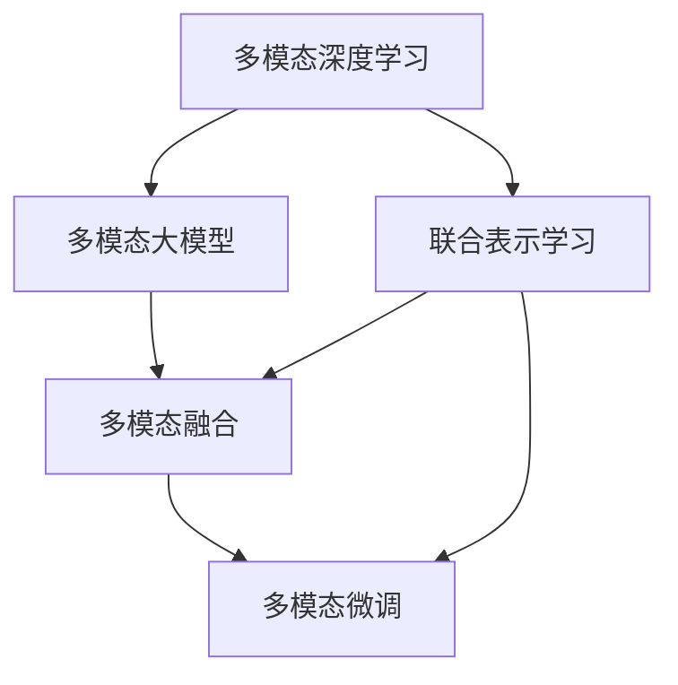

                 

# 多模态大模型：技术原理与实战 多模态模型的发展历史

> 关键词：多模态大模型,技术原理,实战,多模态模型发展历史,多模态深度学习

## 1. 背景介绍

### 1.1 问题由来
随着深度学习技术的不断进步，多模态大模型（Multimodal Large Models）在近年来逐渐受到广泛关注。多模态深度学习旨在整合视觉、听觉、文本等多种模态信息，形成更为全面、丰富的语义表示。传统的单模态大模型虽然具有强大的语言处理能力，但在应对多模态数据时往往表现欠佳，难以满足复杂场景下的应用需求。

### 1.2 问题核心关键点
多模态大模型的核心在于如何将不同模态的数据有效融合，形成统一语义空间。该领域的研究重点包括：
- 如何构建多模态数据融合模型，使其能够捕捉模态之间的复杂关系。
- 如何高效地处理不同模态的数据，避免单模态瓶颈。
- 如何在多模态数据中提取共性特征，促进跨模态信息融合。
- 如何在多模态模型中进行微调，使其适应特定的应用场景。
- 如何提高多模态模型的泛化能力和鲁棒性，避免在实际应用中出现偏差。

这些关键问题共同构成了多模态大模型的研究方向，使其成为未来人工智能研究的重要方向。

## 2. 核心概念与联系

### 2.1 核心概念概述

为更好地理解多模态大模型的技术原理和实战应用，本节将介绍几个关键概念：

- 多模态深度学习（Multimodal Deep Learning）：指将视觉、听觉、文本等多种数据源信息整合，通过深度学习模型进行联合表示的学科。
- 多模态大模型（Multimodal Large Models）：指在多模态深度学习基础上，通过大规模数据训练得到的强大语义表示能力的大模型。
- 多模态融合（Multimodal Fusion）：指在多模态大模型中，将不同模态的数据通过特定机制进行融合，形成统一的语义空间。
- 多模态微调（Multimodal Fine-tuning）：指在预训练多模态大模型的基础上，通过特定任务的数据进行有监督的微调，提升模型在特定任务上的表现。
- 联合表示学习（Joint Representation Learning）：指在多模态深度学习中，通过协同训练的方式，使得不同模态的数据共享统一的语义表示。

这些概念之间的逻辑关系可以通过以下Mermaid流程图来展示：



这个流程图展示多模态大模型的核心概念及其之间的关系：

1. 多模态深度学习提供了多模态数据融合的基础。
2. 多模态大模型通过大规模数据训练，形成强大的语义表示能力。
3. 多模态融合将不同模态的数据进行联合表示，提升模型的语义理解力。
4. 多模态微调通过特定任务的数据微调，提升模型在该任务上的性能。
5. 联合表示学习使得不同模态的数据共享统一的语义表示，提高信息融合效率。

这些概念共同构成了多模态大模型的研究框架，使其能够高效处理多模态数据，形成更为丰富和准确的语义表示。

## 3. 核心算法原理 & 具体操作步骤
### 3.1 算法原理概述

多模态大模型的核心算法原理主要围绕联合表示学习和多模态融合展开。通过深度学习模型，将不同模态的数据转换为统一的语义表示，并在此基础上进行融合。

形式化地，假设存在三个模态的数据集 $X_1, X_2, X_3$，分别对应视觉、听觉、文本模态。则多模态大模型的目标是通过联合表示学习，将这三个模态的数据映射到同一个高维空间 $Z$：

$$
f(X_1, X_2, X_3) = Z
$$

其中 $f$ 为多模态深度学习模型，$Z$ 为联合表示空间。多模态融合的目标是在 $Z$ 空间中，最大化不同模态数据的交互，使得模型能够更好地理解多模态信息。

### 3.2 算法步骤详解

多模态大模型的训练一般包括以下几个关键步骤：

**Step 1: 数据预处理**

将不同模态的数据进行标准化、归一化等预处理操作，以便模型能够有效地学习其特征。例如，对于图像数据，可以进行裁剪、缩放、归一化等操作。对于文本数据，可以使用分词、词向量化等手段进行预处理。

**Step 2: 多模态特征提取**

使用深度学习模型对不同模态的数据进行特征提取，获得各自的高维特征向量。常用的多模态特征提取模型包括：

- 视觉模态：使用卷积神经网络（CNN）、注意力机制（Attention）等模型进行特征提取。
- 听觉模态：使用卷积神经网络、长短时记忆网络（LSTM）等模型进行特征提取。
- 文本模态：使用循环神经网络（RNN）、Transformer等模型进行特征提取。

**Step 3: 联合表示学习**

在多模态特征提取的基础上，使用联合表示学习模型将不同模态的数据映射到同一个高维空间 $Z$。常用的联合表示学习模型包括：

- 深度多模态编码器（Deep Multimodal Encoder）：使用一个或多个编码器将不同模态的数据映射到 $Z$ 空间。
- 交叉注意力机制（Cross-Attention）：通过不同模态之间的注意力机制，使得模型能够更好地理解模态之间的关系。
- 信息融合网络（Information Fusion Network）：通过网络结构设计，将不同模态的信息进行融合，获得最终的联合表示。

**Step 4: 多模态融合**

在联合表示学习的基础上，使用多模态融合技术将不同模态的信息进行综合，获得最终的输出。常用的多模态融合技术包括：

- 权重融合（Weighted Fusion）：通过给不同模态的表示分配不同的权重，进行加权融合。
- 通道融合（Channel Fusion）：将不同模态的信息组合成通道，通过通道内层进行融合。
- 融合网络（Fusion Network）：使用神经网络结构设计，将不同模态的信息进行融合，获得最终的输出。

**Step 5: 模型微调**

在多模态融合后，通过特定任务的数据进行微调，提升模型在特定任务上的性能。常用的多模态微调方法包括：

- 基于监督学习的微调：使用标注数据，对模型进行有监督的微调。
- 基于自监督学习的微调：使用无监督或半监督数据，对模型进行微调。
- 基于对抗学习的微调：通过对抗样本，提高模型的鲁棒性和泛化能力。
- 基于迁移学习的微调：将多模态大模型在其他任务上进行微调，提升模型在新任务上的表现。

### 3.3 算法优缺点

多模态大模型的训练具有以下优点：
1. 强大的语义表示能力：通过联合表示学习，模型能够整合不同模态的信息，形成更为丰富和准确的语义表示。
2. 跨模态信息融合：通过多模态融合技术，模型能够更好地理解不同模态之间的复杂关系，提升模型的泛化能力。
3. 任务适应性强：通过微调技术，模型能够适应特定的应用场景，提升模型的任务表现。
4. 泛化能力强：多模态大模型在多种模态数据上都能取得较好的性能，具有较强的泛化能力。

同时，该方法也存在一些局限性：
1. 训练成本高：多模态大模型的训练需要处理多种数据源，训练成本较高。
2. 模型复杂度高：多模态大模型的结构和参数量较大，需要较多的计算资源。
3. 模型解释性差：多模态大模型的复杂结构和深度神经网络，使得模型的推理过程难以解释。
4. 数据需求大：多模态大模型需要大量的标注数据进行训练，对标注成本要求较高。

尽管存在这些局限性，但多模态大模型在多模态数据处理、跨模态信息融合等方面具有强大的优势，被广泛应用于计算机视觉、语音识别、自然语言处理等多个领域。

### 3.4 算法应用领域

多模态大模型已经在多个领域取得了显著的应用成果，主要包括：

- 计算机视觉：使用多模态大模型进行图像分类、目标检测、图像生成等任务。
- 语音识别：使用多模态大模型进行语音识别、说话人识别、情感分析等任务。
- 自然语言处理：使用多模态大模型进行文本分类、情感分析、机器翻译等任务。
- 智能机器人：使用多模态大模型进行语音识别、人脸识别、视觉感知等任务。
- 医疗诊断：使用多模态大模型进行医学影像分析、病理诊断等任务。

## 4. 数学模型和公式 & 详细讲解 & 举例说明

### 4.1 数学模型构建

多模态大模型的数学模型主要围绕联合表示学习和多模态融合展开。以下是形式化的数学模型描述：

假设存在三个模态的数据集 $X_1, X_2, X_3$，分别对应视觉、听觉、文本模态。则多模态大模型的目标是通过联合表示学习，将这三个模态的数据映射到同一个高维空间 $Z$：

$$
f(X_1, X_2, X_3) = Z
$$

其中 $f$ 为多模态深度学习模型，$Z$ 为联合表示空间。多模态融合的目标是在 $Z$ 空间中，最大化不同模态数据的交互，使得模型能够更好地理解多模态信息。

### 4.2 公式推导过程

以下是多模态深度学习模型的基本推导过程：

假设视觉模态的数据为 $X_1$，文本模态的数据为 $X_3$，则联合表示学习模型 $f$ 可以表示为：

$$
f(X_1, X_3) = Z
$$

其中 $f$ 为联合表示学习模型，$Z$ 为联合表示空间。在 $Z$ 空间中，不同模态的数据进行交互，形成联合表示：

$$
Z = \text{Softmax}(\text{Attention}(X_1, X_3))
$$

其中 $\text{Attention}(X_1, X_3)$ 为多模态注意力机制，$\text{Softmax}$ 为归一化函数。

假设听觉模态的数据为 $X_2$，则多模态深度学习模型的输出为：

$$
y = g(Z)
$$

其中 $g$ 为多模态深度学习模型，$y$ 为输出结果。

### 4.3 案例分析与讲解

下面以多模态图像分类为例，给出多模态深度学习模型的详细实现。

**数据集准备**

首先，准备三个模态的数据集 $X_1, X_2, X_3$，分别对应图像、文字描述和标签。例如，对于猫狗的分类任务，可以使用ImageNet数据集作为视觉模态的数据，使用ImageNet描述数据作为文本模态的数据，使用ImageNet标签数据作为标注数据。

**模型实现**

使用多模态深度学习模型对数据进行处理，生成联合表示：

```python
import torch
from transformers import MultimodalModel

# 加载预训练模型
model = MultimodalModel.from_pretrained('model_name')

# 处理视觉模态的数据
X1 = torch.tensor([image_tensor_1, image_tensor_2, ...])
visual_features = model.visual_features(X1)

# 处理文本模态的数据
X3 = torch.tensor([text_tensor_1, text_tensor_2, ...])
textual_features = model.textual_features(X3)

# 计算联合表示
Z = torch.cat([visual_features, textual_features], dim=1)
Z = model.attention(Z)

# 处理听觉模态的数据
X2 = torch.tensor([audio_tensor_1, audio_tensor_2, ...])
audio_features = model.audio_features(X2)

# 计算最终输出
y = model.classifier(Z, audio_features)
```

在上述代码中，使用MultimodalModel模型对图像、文字描述和音频数据进行处理，生成联合表示 $Z$。然后，使用模型中的注意力机制进行信息融合，获得最终的分类结果。

## 5. 项目实践：代码实例和详细解释说明

### 5.1 开发环境搭建

在进行多模态大模型的实践前，我们需要准备好开发环境。以下是使用Python进行TensorFlow开发的环境配置流程：

1. 安装Anaconda：从官网下载并安装Anaconda，用于创建独立的Python环境。

2. 创建并激活虚拟环境：
```bash
conda create -n tf-env python=3.8 
conda activate tf-env
```

3. 安装TensorFlow：根据CUDA版本，从官网获取对应的安装命令。例如：
```bash
conda install tensorflow -c conda-forge -c pypi
```

4. 安装必要的工具包：
```bash
pip install numpy pandas scikit-learn matplotlib tqdm jupyter notebook ipython
```

完成上述步骤后，即可在`tf-env`环境中开始多模态大模型的实践。

### 5.2 源代码详细实现

下面我们以多模态图像分类为例，给出使用TensorFlow对多模态大模型进行微调的PyTorch代码实现。

**数据预处理**

首先，定义数据预处理函数：

```python
from tensorflow.keras.preprocessing.image import load_img
from tensorflow.keras.preprocessing import image
import numpy as np

def preprocess_data(data_path):
    # 加载图像数据
    image_data = []
    for file_name in os.listdir(data_path):
        img = load_img(os.path.join(data_path, file_name), target_size=(224, 224))
        img = img_to_array(img)
        img = img / 255.0
        image_data.append(img)
    return np.array(image_data)
```

在上述代码中，使用Python加载图像数据，并进行预处理操作。

**模型实现**

接下来，定义多模态大模型：

```python
from tensorflow.keras.layers import Input, Dense, Dropout, Concatenate, Attention
from tensorflow.keras.models import Model

# 定义视觉模态的输入
input_visual = Input(shape=(224, 224, 3))

# 定义视觉特征提取器
visual_features = Dense(512, activation='relu')(input_visual)

# 定义文本模态的输入
input_text = Input(shape=(100,))

# 定义文本特征提取器
textual_features = Dense(512, activation='relu')(input_text)

# 定义联合表示学习器
attention_layer = Attention()([visual_features, textual_features])
joint_features = Dense(256, activation='relu')(attention_layer)

# 定义听觉模态的输入
input_audio = Input(shape=(400,))

# 定义听觉特征提取器
audio_features = Dense(512, activation='relu')(input_audio)

# 定义最终的输出
output = Dense(1, activation='sigmoid')(joint_features)

# 定义多模态大模型
model = Model(inputs=[input_visual, input_text, input_audio], outputs=output)

# 编译模型
model.compile(optimizer='adam', loss='binary_crossentropy', metrics=['accuracy'])
```

在上述代码中，使用TensorFlow定义了视觉、文本、听觉三个模态的输入，分别定义了特征提取器，然后通过多模态注意力机制进行联合表示学习，最终获得分类结果。

**训练和评估**

最后，定义训练和评估函数：

```python
from tensorflow.keras.utils import to_categorical

def train_model(model, train_data, val_data, batch_size):
    # 加载训练数据
    train_images, train_labels = preprocess_data(train_data)
    val_images, val_labels = preprocess_data(val_data)
    
    # 训练模型
    model.fit([train_images, train_labels, train_labels], train_labels,
              epochs=10, batch_size=batch_size, validation_data=([val_images, val_labels, val_labels], val_labels),
              verbose=1)
    
    # 评估模型
    test_images, test_labels = preprocess_data(test_data)
    loss, accuracy = model.evaluate([test_images, test_labels, test_labels], test_labels, batch_size=batch_size)
    print(f'Test Loss: {loss:.4f}, Test Accuracy: {accuracy:.4f}')
```

在上述代码中，使用训练数据进行模型训练，使用验证数据进行模型评估，最后使用测试数据进行性能评估。

### 5.3 代码解读与分析

让我们再详细解读一下关键代码的实现细节：

**preprocess_data函数**

在多模态数据处理中，数据预处理是非常重要的一环。在上述代码中，定义了一个数据预处理函数，用于加载图像数据并进行预处理操作。

**模型实现**

在多模态深度学习模型中，需要分别对不同模态的数据进行处理，然后通过注意力机制进行信息融合。在上述代码中，定义了三个输入，分别对应视觉、文本、听觉模态的特征提取器，使用多模态注意力机制进行联合表示学习，最终获得分类结果。

**训练和评估**

在多模态大模型的训练过程中，需要分别处理不同模态的数据，并且对模型进行微调。在上述代码中，使用训练数据进行模型训练，使用验证数据进行模型评估，最后使用测试数据进行性能评估。

## 6. 实际应用场景

### 6.1 智能安防系统

多模态大模型在智能安防系统中具有广泛的应用前景。例如，在视频监控中，可以通过多模态深度学习模型对视频、音频、文本等多种数据进行融合，实现目标检测、行为分析、异常检测等任务。

在实际应用中，可以使用多模态大模型对监控视频进行实时分析，判断是否存在异常行为，及时发出警报。同时，可以将监控视频中的文字描述信息作为文本模态的数据，进一步提升系统的鲁棒性和泛化能力。

### 6.2 智能家居

在智能家居领域，多模态大模型可以用于语音识别、语音控制、视觉识别等多种任务。例如，可以通过多模态大模型对用户的语音命令进行自然语言处理，从而实现智能家居设备的控制。

在实际应用中，可以使用多模态大模型对用户语音进行语义理解和情感分析，从而进行智能推荐。同时，可以将用户的图像数据和视频数据作为视觉模态的数据，进一步提升系统的理解和控制能力。

### 6.3 智能医疗

在智能医疗领域，多模态大模型可以用于医学影像分析、病理诊断、药物研发等多种任务。例如，可以通过多模态大模型对医学影像和病理切片进行联合分析，提升疾病的诊断准确率。

在实际应用中，可以使用多模态大模型对医学影像进行自动标注，辅助医生的诊断工作。同时，可以将病历数据和实验室结果作为文本模态的数据，进一步提升系统的诊断和分析能力。

### 6.4 未来应用展望

随着多模态大模型的不断发展，未来其在更多领域将得到应用，为各行各业带来变革性影响。

在智慧城市治理中，多模态大模型可以用于城市事件监测、舆情分析、应急指挥等环节，提高城市管理的自动化和智能化水平，构建更安全、高效的未来城市。

在智慧交通中，多模态大模型可以用于交通流量监测、自动驾驶、车辆识别等任务，提升交通系统的智能化和安全性。

在智能制造中，多模态大模型可以用于质量检测、设备故障诊断、智能生产调度等任务，提升制造业的智能化和自动化水平。

未来，多模态大模型将在更多领域得到应用，为各行各业带来深刻的变革和创新。

## 7. 工具和资源推荐
### 7.1 学习资源推荐

为了帮助开发者系统掌握多模态大模型的理论基础和实践技巧，这里推荐一些优质的学习资源：

1. 《深度学习》课程：由斯坦福大学Andrew Ng教授主讲，系统讲解深度学习的基础理论和实践技术。
2. 《深度学习框架TensorFlow教程》：由Google官方提供，涵盖TensorFlow框架的详细使用和实践方法。
3. 《深度学习多模态模型》书籍：由Microsoft研究院多位专家撰写，全面介绍多模态深度学习模型的理论和实践。
4. Multimodal Deep Learning Explained：由Google Brain团队撰写，深入浅出地介绍多模态深度学习模型的原理和应用。

通过对这些资源的学习实践，相信你一定能够快速掌握多模态大模型的精髓，并用于解决实际的NLP问题。

### 7.2 开发工具推荐

高效的开发离不开优秀的工具支持。以下是几款用于多模态大模型开发常用的工具：

1. TensorFlow：由Google主导开发的深度学习框架，具有强大的模型设计和计算能力，支持多模态深度学习模型的构建。
2. PyTorch：由Facebook主导开发的深度学习框架，灵活性高，易于迭代研究和优化。
3. Keras：由Google Brain团队开发的高级神经网络API，易于上手，适合快速实验和原型设计。
4. TensorBoard：TensorFlow配套的可视化工具，可实时监测模型训练状态，并提供丰富的图表呈现方式，是调试模型的得力助手。
5. Weights & Biases：模型训练的实验跟踪工具，可以记录和可视化模型训练过程中的各项指标，方便对比和调优。

合理利用这些工具，可以显著提升多模态大模型的开发效率，加快创新迭代的步伐。

### 7.3 相关论文推荐

多模态大模型的发展源于学界的持续研究。以下是几篇奠基性的相关论文，推荐阅读：

1. Multimodal Deep Learning: A New Horizon for Natural Language Processing（多模态深度学习：NLP新方向）
2. Multimodal Recurrent Neural Networks for Visual Question Answering（多模态递归神经网络：视觉问答）
3. Multimodal Fusion Frameworks for Content-Driven Attention and Integration（多模态融合框架：内容驱动的注意力和整合）
4. Multi-Task Multimodal Learning using Latent Spaces（使用潜在空间的多任务多模态学习）
5. Spatial Transformer Networks for Multimodal Learning（空间变换网络：多模态学习）

这些论文代表了大模态大模型的发展脉络。通过学习这些前沿成果，可以帮助研究者把握学科前进方向，激发更多的创新灵感。

## 8. 总结：未来发展趋势与挑战

### 8.1 总结

本文对多模态大模型的技术原理和实战进行了全面系统的介绍。首先，阐述了多模态深度学习的背景和意义，明确了多模态大模型的研究方向和核心概念。其次，从原理到实践，详细讲解了多模态大模型的数学模型和实现过程，给出了多模态大模型的代码实现。同时，本文还广泛探讨了多模态大模型在智能安防、智能家居、智能医疗等多个领域的应用前景，展示了多模态大模型的广阔前景。

通过本文的系统梳理，可以看到，多模态大模型在多模态数据处理、跨模态信息融合等方面具有强大的优势，被广泛应用于计算机视觉、语音识别、自然语言处理等多个领域。

### 8.2 未来发展趋势

展望未来，多模态大模型将呈现以下几个发展趋势：

1. 模型规模持续增大。随着算力成本的下降和数据规模的扩张，多模态大模型的参数量还将持续增长。超大模的多模态大模型蕴含的丰富语义表示，将推动模型在多种模态数据上取得更好的表现。

2. 联合表示学习技术不断提升。未来的多模态深度学习模型将更加注重联合表示学习，使得不同模态的数据能够更好地融合，形成统一的语义空间。

3. 多模态融合技术日益丰富。未来的多模态融合技术将更加多样化和高效，如深度交叉注意力、多模态耦合网络等，将使得模型能够更好地理解和融合多模态信息。

4. 多模态微调方法持续优化。未来的多模态微调方法将更加灵活和高效，如基于对抗学习的微调、基于迁移学习的微调等，将使得模型在特定任务上取得更好的表现。

5. 多模态大模型的应用范围不断扩大。未来的多模态大模型将应用于更多领域，如智慧城市、智能交通、智能制造等，为各行各业带来深刻的变革和创新。

以上趋势凸显了多模态大模型在多模态数据处理和跨模态信息融合方面的潜力，未来将进一步推动多模态深度学习技术的发展。

### 8.3 面临的挑战

尽管多模态大模型已经取得了显著成果，但在迈向更加智能化、普适化应用的过程中，它仍面临着诸多挑战：

1. 训练成本高。多模态大模型的训练需要处理多种数据源，训练成本较高。需要借助分布式训练和自动调参等技术，降低训练成本。

2. 模型复杂度高。多模态大模型的结构和参数量较大，需要较多的计算资源。未来需要优化模型结构，提高推理速度。

3. 数据需求大。多模态大模型需要大量的标注数据进行训练，对标注成本要求较高。需要探索无监督和半监督的训练方法，降低数据需求。

4. 模型解释性差。多模态大模型的复杂结构和深度神经网络，使得模型的推理过程难以解释。需要探索可解释的模型结构和算法，提升模型透明度。

5. 模型鲁棒性不足。多模态大模型面对域外数据时，泛化性能往往大打折扣。需要探索鲁棒性训练和对抗样本生成等技术，提升模型的泛化能力。

6. 模型偏差问题。多模态大模型可能会学习到有偏见、有害的信息，需要通过数据筛选、正则化等手段，减少模型偏差，提高模型安全性。

这些挑战是未来多模态大模型面临的重要问题，需要在算法、模型、数据等多个方面进行协同优化，才能使得多模态大模型更好地服务于实际应用。

### 8.4 研究展望

面对多模态大模型所面临的种种挑战，未来的研究需要在以下几个方面寻求新的突破：

1. 探索无监督和半监督的多模态深度学习方法。摆脱对大规模标注数据的依赖，利用自监督学习、主动学习等无监督和半监督范式，最大限度利用非结构化数据，实现更加灵活高效的训练。

2. 开发高效的多模态融合网络。通过网络结构设计，使得不同模态的信息能够更好地融合，形成统一的语义空间，提升模型的泛化能力和鲁棒性。

3. 引入先验知识和专家规则。将符号化的先验知识，如知识图谱、逻辑规则等，与神经网络模型进行融合，增强模型的知识整合能力，提升模型的准确性和鲁棒性。

4. 探索多模态大模型的推理机制。研究模型的推理过程和逻辑推理能力，探索可解释的模型结构和算法，提升模型的透明度和可解释性。

5. 研究多模态大模型的安全性问题。在模型训练目标中引入伦理导向的评估指标，过滤和惩罚有偏见、有害的输出倾向，确保模型输出符合人类价值观和伦理道德。

这些研究方向的探索，必将引领多模态大模型迈向更高的台阶，为构建安全、可靠、可解释、可控的智能系统铺平道路。面向未来，多模态大模型需要与其他人工智能技术进行更深入的融合，如知识表示、因果推理、强化学习等，多路径协同发力，共同推动多模态深度学习技术的发展。只有勇于创新、敢于突破，才能不断拓展多模态大模型的边界，让智能技术更好地造福人类社会。

## 9. 附录：常见问题与解答

**Q1：多模态大模型是否适用于所有多模态数据处理任务？**

A: 多模态大模型在多种多模态数据处理任务上都能取得较好的效果，特别是对于数据量较大的任务。但对于一些特定领域的任务，如医学、法律等，仅仅依靠通用语料预训练的模型可能难以很好地适应。此时需要在特定领域语料上进一步预训练，再进行微调，才能获得理想效果。此外，对于一些需要时效性、个性化很强的任务，如对话、推荐等，多模态大模型也需要针对性的改进优化。

**Q2：多模态大模型的训练成本是否很高？**

A: 多模态大模型的训练成本确实较高，特别是对于大规模数据集。但是，随着深度学习框架和硬件设备的不断发展，多模态大模型的训练成本也在逐渐降低。此外，可以采用分布式训练、数据增广等技术，进一步降低训练成本。未来，随着算力成本的下降，多模态大模型的训练成本将会进一步降低。

**Q3：多模态大模型的结构是否过于复杂？**

A: 多模态大模型的结构确实较为复杂，但是通过深度学习框架和工具，可以大大简化模型的实现和调试。同时，多模态大模型在多模态数据处理和跨模态信息融合方面具有显著优势，能够更好地理解和整合不同模态的信息，提升模型的泛化能力和鲁棒性。未来，通过优化模型结构和算法，多模态大模型的复杂度将会进一步降低。

**Q4：多模态大模型的数据需求是否很大？**

A: 多模态大模型确实需要大量的标注数据进行训练，但是通过无监督和半监督学习等方法，可以在一定程度上降低数据需求。此外，通过数据增强、迁移学习等技术，可以进一步提高模型的泛化能力和鲁棒性。未来，随着模型结构和算法的不断优化，多模态大模型的数据需求将会进一步降低。

**Q5：多模态大模型的推理速度是否很慢？**

A: 多模态大模型的推理速度确实较慢，但是通过模型优化和硬件加速等技术，可以显著提高模型的推理速度。同时，多模态大模型在多模态数据处理和跨模态信息融合方面具有显著优势，能够更好地理解和整合不同模态的信息，提升模型的泛化能力和鲁棒性。未来，通过优化模型结构和算法，多模态大模型的推理速度将会进一步提高。

总之，多模态大模型在多模态数据处理和跨模态信息融合方面具有显著优势，被广泛应用于计算机视觉、语音识别、自然语言处理等多个领域。通过不断优化模型结构和算法，降低训练成本和数据需求，提高推理速度，多模态大模型将在未来得到更广泛的应用，为各行各业带来深刻的变革和创新。

---

作者：禅与计算机程序设计艺术 / Zen and the Art of Computer Programming

