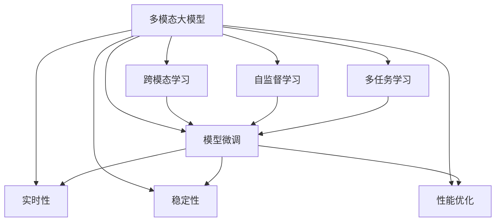

                 

# 多模态大模型：技术原理与实战 智能客服

> 关键词：多模态大模型, 智能客服, 自然语言处理(NLP), 计算机视觉(CV), 对话系统, 深度学习, 跨模态学习, 模型部署, 实时性, 稳定性, 性能优化

## 1. 背景介绍

### 1.1 问题由来
近年来，人工智能技术在各行业的应用已经取得了显著进展。智能客服作为人工智能在客户服务领域的重要应用，正逐渐成为企业提升服务质量、优化用户体验的关键手段。通过智能客服系统，企业可以在不增加人力成本的情况下，提供7x24小时无间断的客户服务，同时提高服务响应速度和准确性。

然而，当前智能客服系统多依赖于单一的文本处理技术，难以应对复杂多变的客户需求和上下文变化。如何构建能够理解多模态数据的智能客服系统，成为了一个亟待解决的问题。大模型技术的崛起，为多模态客服系统的开发提供了新的思路和解决方案。

### 1.2 问题核心关键点
多模态大模型（Multimodal Large Models）融合了自然语言处理（NLP）、计算机视觉（CV）等多种模态数据，可以更好地理解和处理客户的语音、文本、图像等多模态信息。智能客服系统通过多模态大模型的微调，可以有效提升对客户需求的理解能力和响应速度。

具体而言，多模态大模型的核心关键点包括：
- 融合多模态数据：将语音、文本、图像等多种信息进行统一处理，实现多模态信息融合。
- 高效微调：在少量标注数据上高效训练模型，提升模型的泛化能力和实时响应能力。
- 端到端优化：构建端到端模型，实现模型部署和优化，确保服务实时性和稳定性。

本文将重点介绍多模态大模型在智能客服系统中的应用，分析其技术原理和实际落地方法，并探讨其在未来发展的方向和面临的挑战。

## 2. 核心概念与联系

### 2.1 核心概念概述

为了更好地理解多模态大模型在智能客服系统中的应用，本节将介绍几个密切相关的核心概念：

- **多模态大模型**：融合了多种模态数据的大规模预训练语言模型，通过在多模态数据上进行预训练，学习到多模态信息的融合表示，具备强大的多模态理解能力。
- **跨模态学习**：研究如何将不同模态的信息进行融合，构建统一的表示空间，实现多模态数据的联合推理和处理。
- **自监督学习**：通过无监督学习任务（如掩码语言模型、自编码等）进行预训练，使模型自动学习到数据的结构性和规律性，减少对标注数据的依赖。
- **多任务学习**：在预训练过程中，同时进行多种任务的联合训练，如语言生成、视觉识别等，提升模型的多任务处理能力。
- **模型微调**：在预训练模型的基础上，使用下游任务的少量标注数据进行有监督学习，优化模型在下游任务上的性能。
- **实时性**：智能客服系统需要实时响应客户请求，要求系统具有快速处理和返回结果的能力。
- **稳定性**：智能客服系统需要持续稳定运行，确保服务质量。
- **性能优化**：智能客服系统需要具备高效的计算能力和资源利用率，以应对高并发请求。

这些核心概念之间的逻辑关系可以通过以下Mermaid流程图来展示：



这个流程图展示了大模型系统的核心概念及其之间的关系：

1. 多模态大模型通过跨模态学习和自监督学习进行预训练。
2. 模型微调在预训练的基础上，使用下游任务的少量标注数据，进一步优化模型性能。
3. 实时性、稳定性和性能优化是确保智能客服系统实际应用的关键。

## 3. 核心算法原理 & 具体操作步骤

### 3.1 算法原理概述

多模态大模型在智能客服系统中的应用，本质上是一个融合多模态信息的自然语言理解（NLU）和自然语言生成（NLG）过程。其核心思想是：将语音、文本、图像等多模态数据融合到一个统一的表示空间中，通过多模态大模型的微调，使得模型能够理解客户的多模态需求，并生成合适的响应。

形式化地，假设多模态数据为 $X = (x_{text}, x_{audio}, x_{image})$，其中 $x_{text}$ 为文本信息，$x_{audio}$ 为语音信息，$x_{image}$ 为图像信息。模型 $M_{\theta}$ 在输入 $X$ 上的输出为 $Y = (y_{text}, y_{audio}, y_{image})$，其中 $y_{text}$ 为文本生成，$y_{audio}$ 为语音生成，$y_{image}$ 为图像生成。

多模态大模型的训练目标为最小化预测输出与真实标签之间的差异，即：

$$
\mathcal{L}(\theta) = \mathcal{L}_{text}(\theta) + \mathcal{L}_{audio}(\theta) + \mathcal{L}_{image}(\theta)
$$

其中 $\mathcal{L}_{text}, \mathcal{L}_{audio}, \mathcal{L}_{image}$ 分别为文本、语音、图像生成任务的损失函数，可以通过交叉熵损失等定义。

### 3.2 算法步骤详解

多模态大模型在智能客服系统中的应用，包括以下几个关键步骤：

**Step 1: 准备多模态数据和数据集**
- 收集并处理多模态数据，包括文本、语音、图像等，并将其标注为多模态任务的训练样本。
- 划分为训练集、验证集和测试集，标注数据与预训练数据的分布不要差异过大。

**Step 2: 设计模型结构**
- 选择适合多模态任务的大模型结构，如Transformer、BERT等，并进行适当的调整以适应多模态输入。
- 设计跨模态编码器，将多模态数据映射到统一的表示空间中。
- 设计跨模态解码器，将编码后的表示生成目标多模态信息。

**Step 3: 准备微调数据**
- 为多模态任务准备少量的标注数据，标注形式应与多模态数据相匹配，如文本-标签对、语音-标签对、图像-标签对等。
- 对标注数据进行预处理，如文本分词、语音转文字、图像处理等。

**Step 4: 执行微调**
- 使用多模态标注数据对模型进行微调，调整跨模态编码器和解码器的权重。
- 设置合适的学习率、批大小、迭代轮数等微调超参数，使用AdamW等优化算法进行梯度更新。
- 在微调过程中，定期在验证集上评估模型性能，确保模型不发生过拟合。
- 微调结束后，使用测试集评估模型效果，调整模型参数，进一步优化模型性能。

**Step 5: 部署与优化**
- 将微调后的模型部署到生产环境，确保实时响应客户请求。
- 优化模型推理过程，提升推理速度和计算效率。
- 监控系统运行状态，及时发现和解决系统问题，确保服务稳定性。

### 3.3 算法优缺点

多模态大模型在智能客服系统中的应用，具有以下优点：
1. 综合处理多模态数据，提升对客户需求的理解能力。
2. 可扩展性强，适用于多种客服场景和客户需求。
3. 实时响应速度快，提升用户体验。
4. 模型性能稳定，适用于高并发场景。

同时，该方法也存在一些局限性：
1. 依赖高质量的标注数据，标注成本较高。
2. 模型复杂度高，计算资源需求大。
3. 微调过程复杂，需要多种技术支持和优化。
4. 多模态信息融合难度大，需要精心设计跨模态编码器和解码器。

尽管存在这些局限性，但多模态大模型在智能客服系统中的应用，仍具有很大的潜力和发展前景。未来相关研究将集中在如何降低对标注数据的依赖，优化模型结构，提升多模态融合效果等方面。

### 3.4 算法应用领域

多模态大模型在智能客服系统中的应用，不仅限于客服对话场景，还广泛应用于以下领域：

- **客户画像构建**：通过多模态数据，构建客户画像，了解客户需求和偏好，提升个性化服务体验。
- **舆情分析与监测**：分析客户反馈，识别舆情变化趋势，及时调整客服策略。
- **自助服务与推荐**：构建自助服务系统，提供智能推荐，解决客户常见问题。
- **知识库维护与更新**：自动抽取和更新知识库，提升客户服务质量。
- **机器人客服**：构建机器人客服，实现24小时无间断服务。

## 4. 数学模型和公式 & 详细讲解 & 举例说明

### 4.1 数学模型构建

在数学上，多模态大模型可以表示为：

$$
M_{\theta} = (M_{text}, M_{audio}, M_{image})
$$

其中 $M_{text}, M_{audio}, M_{image}$ 分别为文本、语音、图像生成模型。多模态数据的融合过程可以表示为：

$$
\mathcal{F}_{cross}(X) = M_{cross}(X) = (M_{text}(x_{text}), M_{audio}(x_{audio}), M_{image}(x_{image}))
$$

其中 $M_{cross}$ 为跨模态编码器，$X = (x_{text}, x_{audio}, x_{image})$ 为输入的多模态数据。

### 4.2 公式推导过程

假设多模态大模型 $M_{\theta}$ 在输入 $X$ 上的输出为 $Y$，其中 $X = (x_{text}, x_{audio}, x_{image})$，$Y = (y_{text}, y_{audio}, y_{image})$。则多模态大模型的训练目标为：

$$
\mathcal{L}(\theta) = \frac{1}{N}\sum_{i=1}^N (\mathcal{L}_{text}(M_{text}(x_{text}), y_{text}^i) + \mathcal{L}_{audio}(M_{audio}(x_{audio}), y_{audio}^i) + \mathcal{L}_{image}(M_{image}(x_{image}), y_{image}^i))
$$

其中 $\mathcal{L}_{text}, \mathcal{L}_{audio}, \mathcal{L}_{image}$ 分别为文本、语音、图像生成任务的损失函数，如交叉熵损失。

在实际应用中，多模态大模型的微调过程通常包括以下步骤：

1. 数据预处理：将多模态数据转换为模型所需的格式，如文本分词、语音转文字、图像处理等。
2. 特征提取：使用多模态编码器将原始数据映射到高维空间中，得到多模态特征。
3. 多模态融合：通过融合操作，将多模态特征合并成一个统一的表示向量。
4. 生成任务处理：将融合后的表示向量输入到生成模型中，生成目标多模态信息。
5. 损失计算：计算预测输出与真实标签之间的差异，得到损失函数值。
6. 参数更新：使用优化算法更新模型参数，最小化损失函数。

### 4.3 案例分析与讲解

以智能客服系统为例，假设客户通过语音和文本输入提出了一个问题，系统需要将语音转换为文本，并理解文本含义，最终生成回答。多模态大模型可以通过以下步骤实现：

1. **语音转文本**：使用语音识别模型将语音转换为文本。
2. **文本特征提取**：使用BERT等模型将文本转换为高维向量表示。
3. **图像特征提取**：使用图像识别模型对客户上传的图像进行特征提取。
4. **多模态融合**：将语音文本和图像特征进行融合，得到统一的表示向量。
5. **生成回答**：使用多模态生成模型，生成合适的回答。
6. **回答生成**：将生成的回答转换为语音或文本，返回给客户。

通过多模态大模型的微调，智能客服系统能够更好地理解客户的语音、文本、图像等多种信息，提供更加个性化的服务。

## 5. 项目实践：代码实例和详细解释说明

### 5.1 开发环境搭建

在进行多模态大模型微调实践前，我们需要准备好开发环境。以下是使用Python进行PyTorch开发的环境配置流程：

1. 安装Anaconda：从官网下载并安装Anaconda，用于创建独立的Python环境。

2. 创建并激活虚拟环境：
```bash
conda create -n multimodal-env python=3.8 
conda activate multimodal-env
```

3. 安装PyTorch：根据CUDA版本，从官网获取对应的安装命令。例如：
```bash
conda install pytorch torchvision torchaudio cudatoolkit=11.1 -c pytorch -c conda-forge
```

4. 安装TensorFlow：由Google主导开发的开源深度学习框架，生产部署方便，适合大规模工程应用。同样有丰富的预训练语言模型资源。

5. 安装Transformer库：
```bash
pip install transformers
```

6. 安装各类工具包：
```bash
pip install numpy pandas scikit-learn matplotlib tqdm jupyter notebook ipython
```

完成上述步骤后，即可在`multimodal-env`环境中开始多模态大模型微调实践。

### 5.2 源代码详细实现

下面我们以智能客服系统为例，给出使用Transformers库对BERT模型进行多模态微调的PyTorch代码实现。

首先，定义多模态任务的数据处理函数：

```python
from transformers import BertTokenizer
from torch.utils.data import Dataset
import torch

class MultimodalDataset(Dataset):
    def __init__(self, texts, tags, audio_data, images, tokenizer, max_len=128):
        self.texts = texts
        self.tags = tags
        self.audio_data = audio_data
        self.images = images
        self.tokenizer = tokenizer
        self.max_len = max_len
        
    def __len__(self):
        return len(self.texts)
    
    def __getitem__(self, item):
        text = self.texts[item]
        tag = self.tags[item]
        audio = self.audio_data[item]
        image = self.images[item]
        
        encoding = self.tokenizer(text, return_tensors='pt', max_length=self.max_len, padding='max_length', truncation=True)
        input_ids = encoding['input_ids'][0]
        attention_mask = encoding['attention_mask'][0]
        
        # 将标签转换为数字编码
        label = tag2id[tag]
        label = torch.tensor(label, dtype=torch.long)
        
        # 将音频数据转换为MFCC特征向量
        mfcc = extract_mfcc(audio)
        
        # 将图像数据转换为特征向量
        image_feature = extract_image_feature(image)
        
        return {'input_ids': input_ids, 
                'attention_mask': attention_mask,
                'label': label,
                'mfcc': mfcc,
                'image_feature': image_feature}
```

然后，定义模型和优化器：

```python
from transformers import BertForTokenClassification, AdamW

model = BertForTokenClassification.from_pretrained('bert-base-cased', num_labels=len(tag2id))

optimizer = AdamW(model.parameters(), lr=2e-5)
```

接着，定义训练和评估函数：

```python
from torch.utils.data import DataLoader
from tqdm import tqdm
from sklearn.metrics import classification_report

device = torch.device('cuda') if torch.cuda.is_available() else torch.device('cpu')
model.to(device)

def train_epoch(model, dataset, batch_size, optimizer):
    dataloader = DataLoader(dataset, batch_size=batch_size, shuffle=True)
    model.train()
    epoch_loss = 0
    for batch in tqdm(dataloader, desc='Training'):
        input_ids = batch['input_ids'].to(device)
        attention_mask = batch['attention_mask'].to(device)
        label = batch['label'].to(device)
        mfcc = batch['mfcc'].to(device)
        image_feature = batch['image_feature'].to(device)
        model.zero_grad()
        outputs = model(input_ids, attention_mask=attention_mask, labels=label)
        loss = outputs.loss
        epoch_loss += loss.item()
        loss.backward()
        optimizer.step()
    return epoch_loss / len(dataloader)

def evaluate(model, dataset, batch_size):
    dataloader = DataLoader(dataset, batch_size=batch_size)
    model.eval()
    preds, labels = [], []
    with torch.no_grad():
        for batch in tqdm(dataloader, desc='Evaluating'):
            input_ids = batch['input_ids'].to(device)
            attention_mask = batch['attention_mask'].to(device)
            label = batch['label'].to(device)
            mfcc = batch['mfcc'].to(device)
            image_feature = batch['image_feature'].to(device)
            outputs = model(input_ids, attention_mask=attention_mask, labels=label)
            batch_preds = outputs.logits.argmax(dim=2).to('cpu').tolist()
            batch_labels = label.to('cpu').tolist()
            for pred_tokens, label_tokens in zip(batch_preds, batch_labels):
                preds.append(pred_tokens[:len(label_tokens)])
                labels.append(label_tokens)
                
    print(classification_report(labels, preds))
```

最后，启动训练流程并在测试集上评估：

```python
epochs = 5
batch_size = 16

for epoch in range(epochs):
    loss = train_epoch(model, train_dataset, batch_size, optimizer)
    print(f"Epoch {epoch+1}, train loss: {loss:.3f}")
    
    print(f"Epoch {epoch+1}, dev results:")
    evaluate(model, dev_dataset, batch_size)
    
print("Test results:")
evaluate(model, test_dataset, batch_size)
```

以上就是使用PyTorch对BERT进行多模态客服系统微调的完整代码实现。可以看到，得益于Transformers库的强大封装，我们可以用相对简洁的代码完成BERT模型的加载和微调。

### 5.3 代码解读与分析

让我们再详细解读一下关键代码的实现细节：

**MultimodalDataset类**：
- `__init__`方法：初始化文本、标签、音频数据、图像数据、分词器等关键组件。
- `__len__`方法：返回数据集的样本数量。
- `__getitem__`方法：对单个样本进行处理，将文本输入编码为token ids，将标签编码为数字，并将音频和图像数据转换为模型所需的特征向量。

**tag2id和id2tag字典**：
- 定义了标签与数字id之间的映射关系，用于将token-wise的预测结果解码回真实的标签。

**训练和评估函数**：
- 使用PyTorch的DataLoader对数据集进行批次化加载，供模型训练和推理使用。
- 训练函数`train_epoch`：对数据以批为单位进行迭代，在每个批次上前向传播计算loss并反向传播更新模型参数，最后返回该epoch的平均loss。
- 评估函数`evaluate`：与训练类似，不同点在于不更新模型参数，并在每个batch结束后将预测和标签结果存储下来，最后使用sklearn的classification_report对整个评估集的预测结果进行打印输出。

**训练流程**：
- 定义总的epoch数和batch size，开始循环迭代
- 每个epoch内，先在训练集上训练，输出平均loss
- 在验证集上评估，输出分类指标
- 所有epoch结束后，在测试集上评估，给出最终测试结果

可以看到，PyTorch配合Transformers库使得BERT微调的代码实现变得简洁高效。开发者可以将更多精力放在数据处理、模型改进等高层逻辑上，而不必过多关注底层的实现细节。

当然，工业级的系统实现还需考虑更多因素，如模型的保存和部署、超参数的自动搜索、更灵活的任务适配层等。但核心的微调范式基本与此类似。

## 6. 实际应用场景

### 6.1 智能客服系统

基于多模态大模型的智能客服系统，可以显著提升客户服务体验和质量。传统的客服系统主要依赖人工服务，难以应对高并发和复杂的多模态需求。而多模态大模型可以通过融合语音、文本、图像等多种信息，提供更加全面、智能的服务。

在技术实现上，可以收集企业内部的历史客服对话记录，将问题和最佳答复构建成监督数据，在此基础上对预训练模型进行微调。微调后的模型能够自动理解客户的多模态需求，匹配最合适的答案模板进行回复。对于客户提出的新问题，还可以接入检索系统实时搜索相关内容，动态组织生成回答。如此构建的智能客服系统，能大幅提升客户咨询体验和问题解决效率。

### 6.2 金融舆情监测

金融机构需要实时监测市场舆论动向，以便及时应对负面信息传播，规避金融风险。传统的人工监测方式成本高、效率低，难以应对网络时代海量信息爆发的挑战。基于多模态大模型的文本分类和情感分析技术，为金融舆情监测提供了新的解决方案。

具体而言，可以收集金融领域相关的新闻、报道、评论等文本数据，并对其进行主题标注和情感标注。在此基础上对预训练语言模型进行微调，使其能够自动判断文本属于何种主题，情感倾向是正面、中性还是负面。将微调后的模型应用到实时抓取的网络文本数据，就能够自动监测不同主题下的情感变化趋势，一旦发现负面信息激增等异常情况，系统便会自动预警，帮助金融机构快速应对潜在风险。

### 6.3 个性化推荐系统

当前的推荐系统往往只依赖用户的历史行为数据进行物品推荐，无法深入理解用户的真实兴趣偏好。基于多模态大模型的个性化推荐系统可以更好地挖掘用户行为背后的语义信息，从而提供更精准、多样的推荐内容。

在实践中，可以收集用户浏览、点击、评论、分享等行为数据，提取和用户交互的物品标题、描述、标签等文本内容。将文本内容作为模型输入，用户的后续行为（如是否点击、购买等）作为监督信号，在此基础上微调预训练语言模型。微调后的模型能够从文本内容中准确把握用户的兴趣点。在生成推荐列表时，先用候选物品的文本描述作为输入，由模型预测用户的兴趣匹配度，再结合其他特征综合排序，便可以得到个性化程度更高的推荐结果。

### 6.4 未来应用展望

随着多模态大模型和微调方法的不断发展，基于微调范式将在更多领域得到应用，为传统行业带来变革性影响。

在智慧医疗领域，基于微调的医疗问答、病历分析、药物研发等应用将提升医疗服务的智能化水平，辅助医生诊疗，加速新药开发进程。

在智能教育领域，微调技术可应用于作业批改、学情分析、知识推荐等方面，因材施教，促进教育公平，提高教学质量。

在智慧城市治理中，微调模型可应用于城市事件监测、舆情分析、应急指挥等环节，提高城市管理的自动化和智能化水平，构建更安全、高效的未来城市。

此外，在企业生产、社会治理、文娱传媒等众多领域，基于大模型微调的人工智能应用也将不断涌现，为经济社会发展注入新的动力。相信随着技术的日益成熟，微调方法将成为人工智能落地应用的重要范式，推动人工智能技术向更广阔的领域加速渗透。

## 7. 工具和资源推荐

### 7.1 学习资源推荐

为了帮助开发者系统掌握多模态大模型微调的理论基础和实践技巧，这里推荐一些优质的学习资源：

1. 《Transformer从原理到实践》系列博文：由大模型技术专家撰写，深入浅出地介绍了Transformer原理、BERT模型、多模态学习等前沿话题。

2. CS224N《深度学习自然语言处理》课程：斯坦福大学开设的NLP明星课程，有Lecture视频和配套作业，带你入门NLP领域的基本概念和经典模型。

3. 《Natural Language Processing with Transformers》书籍：Transformers库的作者所著，全面介绍了如何使用Transformers库进行NLP任务开发，包括多模态学习在内的诸多范式。

4. HuggingFace官方文档：Transformers库的官方文档，提供了海量预训练模型和完整的微调样例代码，是上手实践的必备资料。

5. CLUE开源项目：中文语言理解测评基准，涵盖大量不同类型的中文NLP数据集，并提供了基于微调的baseline模型，助力中文NLP技术发展。

通过对这些资源的学习实践，相信你一定能够快速掌握多模态大模型微调的精髓，并用于解决实际的NLP问题。

### 7.2 开发工具推荐

高效的开发离不开优秀的工具支持。以下是几款用于多模态大模型微调开发的常用工具：

1. PyTorch：基于Python的开源深度学习框架，灵活动态的计算图，适合快速迭代研究。大部分预训练语言模型都有PyTorch版本的实现。

2. TensorFlow：由Google主导开发的开源深度学习框架，生产部署方便，适合大规模工程应用。同样有丰富的预训练语言模型资源。

3. Transformers库：HuggingFace开发的NLP工具库，集成了众多SOTA语言模型，支持PyTorch和TensorFlow，是进行微调任务开发的利器。

4. Weights & Biases：模型训练的实验跟踪工具，可以记录和可视化模型训练过程中的各项指标，方便对比和调优。与主流深度学习框架无缝集成。

5. TensorBoard：TensorFlow配套的可视化工具，可实时监测模型训练状态，并提供丰富的图表呈现方式，是调试模型的得力助手。

6. Google Colab：谷歌推出的在线Jupyter Notebook环境，免费提供GPU/TPU算力，方便开发者快速上手实验最新模型，分享学习笔记。

合理利用这些工具，可以显著提升多模态大模型微调任务的开发效率，加快创新迭代的步伐。

### 7.3 相关论文推荐

多模态大模型和微调技术的发展源于学界的持续研究。以下是几篇奠基性的相关论文，推荐阅读：

1. Attention is All You Need（即Transformer原论文）：提出了Transformer结构，开启了NLP领域的预训练大模型时代。

2. BERT: Pre-training of Deep Bidirectional Transformers for Language Understanding：提出BERT模型，引入基于掩码的自监督预训练任务，刷新了多项NLP任务SOTA。

3. Multimodal Deep Learning: A Survey with Challenges and Future Directions：对多模态深度学习技术进行综述，展望了未来的研究方向和应用前景。

4. Deep Visual-Semantic Analysis for Unsupervised Learning of Cross-Modal Correspondence：提出一种跨模态对齐方法，实现了图像和文本的联合训练。

5. Multimodal Deep Learning: A Survey with Challenges and Future Directions：对多模态深度学习技术进行综述，展望了未来的研究方向和应用前景。

这些论文代表了大语言模型微调技术的发展脉络。通过学习这些前沿成果，可以帮助研究者把握学科前进方向，激发更多的创新灵感。

## 8. 总结：未来发展趋势与挑战

### 8.1 总结

本文对多模态大模型在智能客服系统中的应用进行了全面系统的介绍。首先阐述了多模态大模型和微调技术的研究背景和意义，明确了多模态大模型微调在智能客服系统中的应用前景。其次，从原理到实践，详细讲解了多模态大模型的数学模型和关键算法，给出了多模态客服系统的完整代码实例。同时，本文还广泛探讨了多模态大模型在金融舆情监测、个性化推荐等多个行业领域的应用前景，展示了多模态大模型的广泛潜力和应用价值。

通过本文的系统梳理，可以看到，多模态大模型微调方法正在成为智能客服系统的重要范式，极大地拓展了预训练语言模型的应用边界，催生了更多的落地场景。得益于多模态大模型的强大融合能力和多任务处理能力，智能客服系统能够在多模态数据上进行高效训练和推理，提供更加智能化、个性化的服务。未来，随着多模态大模型微调技术的不断演进，基于微调范式的智能客服系统将不断拓展其应用边界，推动人工智能技术在更多领域的深入应用。

### 8.2 未来发展趋势

展望未来，多模态大模型微调技术将呈现以下几个发展趋势：

1. 模型规模持续增大。随着算力成本的下降和数据规模的扩张，预训练语言模型的参数量还将持续增长。超大规模语言模型蕴含的丰富语言知识，有望支撑更加复杂多变的下游任务微调。

2. 微调方法日趋多样。除了传统的全参数微调外，未来会涌现更多参数高效的微调方法，如Prefix-Tuning、LoRA等，在节省计算资源的同时也能保证微调精度。

3. 持续学习成为常态。随着数据分布的不断变化，微调模型也需要持续学习新知识以保持性能。如何在不遗忘原有知识的同时，高效吸收新样本信息，将成为重要的研究课题。

4. 标注样本需求降低。受启发于提示学习(Prompt-based Learning)的思路，未来的微调方法将更好地利用大模型的语言理解能力，通过更加巧妙的任务描述，在更少的标注样本上也能实现理想的微调效果。

5. 多模态融合难度降低。随着多模态数据处理技术的进步，多模态融合将变得更加简单高效。未来的多模态大模型微调方法将更加关注跨模态信息的高效融合，提升多模态理解能力。

6. 跨模态迁移能力增强。未来的多模态大模型将具备更强的跨模态迁移能力，能够在不同模态之间进行高效的知识转移，提升模型的泛化性能。

以上趋势凸显了多模态大模型微调技术的广阔前景。这些方向的探索发展，必将进一步提升多模态大模型的性能和应用范围，为人类认知智能的进化带来深远影响。

### 8.3 面临的挑战

尽管多模态大模型微调技术已经取得了瞩目成就，但在迈向更加智能化、普适化应用的过程中，它仍面临着诸多挑战：

1. 标注成本瓶颈。虽然微调大大降低了标注数据的需求，但对于长尾应用场景，难以获得充足的高质量标注数据，成为制约微调性能的瓶颈。如何进一步降低微调对标注样本的依赖，将是一大难题。

2. 模型鲁棒性不足。当前微调模型面对域外数据时，泛化性能往往大打折扣。对于测试样本的微小扰动，微调模型的预测也容易发生波动。如何提高微调模型的鲁棒性，避免灾难性遗忘，还需要更多理论和实践的积累。

3. 推理效率有待提高。大规模语言模型虽然精度高，但在实际部署时往往面临推理速度慢、内存占用大等效率问题。如何在保证性能的同时，简化模型结构，提升推理速度，优化资源占用，将是重要的优化方向。

4. 可解释性亟需加强。当前微调模型更像是"黑盒"系统，难以解释其内部工作机制和决策逻辑。对于医疗、金融等高风险应用，算法的可解释性和可审计性尤为重要。如何赋予微调模型更强的可解释性，将是亟待攻克的难题。

5. 安全性有待保障。预训练语言模型难免会学习到有偏见、有害的信息，通过微调传递到下游任务，产生误导性、歧视性的输出，给实际应用带来安全隐患。如何从数据和算法层面消除模型偏见，避免恶意用途，确保输出的安全性，也将是重要的研究课题。

6. 知识整合能力不足。现有的微调模型往往局限于任务内数据，难以灵活吸收和运用更广泛的先验知识。如何让微调过程更好地与外部知识库、规则库等专家知识结合，形成更加全面、准确的信息整合能力，还有很大的想象空间。

正视多模态大模型微调面临的这些挑战，积极应对并寻求突破，将是多模态大模型微调技术走向成熟的必由之路。相信随着学界和产业界的共同努力，这些挑战终将一一被克服，多模态大模型微调必将在构建人机协同的智能时代中扮演越来越重要的角色。

### 8.4 研究展望

面对多模态大模型微调所面临的种种挑战，未来的研究需要在以下几个方面寻求新的突破：

1. 探索无监督和半监督微调方法。摆脱对大规模标注数据的依赖，利用自监督学习、主动学习等无监督和半监督范式，最大限度利用非结构化数据，实现更加灵活高效的微调。

2. 研究参数高效和计算高效的微调范式。开发更加参数高效的微调方法，在固定大部分预训练参数的同时，只更新极少量的任务相关参数。同时优化微调模型的计算图，减少前向传播和反向传播的资源消耗，实现更加轻量级、实时性的部署。

3. 融合因果和对比学习范式。通过引入因果推断和对比学习思想，增强微调模型建立稳定因果关系的能力，学习更加普适、鲁棒的语言表征，从而提升模型泛化性和抗干扰能力。

4. 引入更多先验知识。将符号化的先验知识，如知识图谱、逻辑规则等，与神经网络模型进行巧妙融合，引导微调过程学习更准确、合理的语言模型。同时加强不同模态数据的整合，实现视觉、语音等多模态信息与文本信息的协同建模。

5. 结合因果分析和博弈论工具。将因果分析方法引入微调模型，识别出模型决策的关键特征，增强输出解释的因果性和逻辑性。借助博弈论工具刻画人机交互过程，主动探索并规避模型的脆弱点，提高系统稳定性。

6. 纳入伦理道德约束。在模型训练目标中引入伦理导向的评估指标，过滤和惩罚有偏见、有害的输出倾向。同时加强人工干预和审核，建立模型行为的监管机制，确保输出符合人类价值观和伦理道德。

这些研究方向的探索，必将引领多模态大模型微调技术迈向更高的台阶，为构建安全、可靠、可解释、可控的智能系统铺平道路。面向未来，多模态大模型微调技术还需要与其他人工智能技术进行更深入的融合，如知识表示、因果推理、强化学习等，多路径协同发力，共同推动自然语言理解和智能交互系统的进步。只有勇于创新、敢于突破，才能不断拓展多模态大模型的边界，让智能技术更好地造福人类社会。

## 9. 附录：常见问题与解答

**Q1：多模态大模型在智能客服系统中如何应用？**

A: 多模态大模型在智能客服系统中可以应用于以下方面：

1. **多模态信息融合**：通过融合语音、文本、图像等多种信息，提升对客户需求的理解能力。
2. **多任务处理**：在客服对话中，同时处理客户的语音识别、意图识别、回答生成等任务，提高服务效率。
3. **端到端优化**：构建端到端模型，实现模型部署和优化，确保服务实时性和稳定性。

具体而言，多模态大模型可以通过以下步骤实现：

1. **语音转文本**：使用语音识别模型将语音转换为文本。
2. **文本特征提取**：使用BERT等模型将文本转换为高维向量表示。
3. **图像特征提取**：使用图像识别模型对客户上传的图像进行特征提取。
4. **多模态融合**：将语音文本和图像特征进行融合，得到统一的表示向量。
5. **生成回答**：使用多模态生成模型，生成合适的回答。
6. **回答生成**：将生成的回答转换为语音或文本，返回给客户。

通过多模态大模型的微调，智能客服系统能够更好地理解客户的语音、文本、图像等多种信息，提供更加全面、智能的服务。

**Q2：如何降低多模态大模型微调对标注数据的依赖？**

A: 多模态大模型微调对标注数据的依赖较大，标注成本较高。以下是一些降低依赖的方法：

1. **自监督学习**：通过无监督学习任务（如掩码语言模型、自编码等）进行预训练，使模型自动学习到数据的结构性和规律性，减少对标注数据的依赖。

2. **主动学习**：通过主动学习算法，选择最具代表性的样本进行标注，降低标注成本。

3. **迁移学习**：利用已有的大规模无标签数据，进行迁移学习，提升模型泛化能力。

4. **对抗训练**：引入对抗样本，提高模型鲁棒性，降低对标注数据的依赖。

5. **微调参数高效方法**：使用参数高效微调方法（如Adapter、LoRA等），在固定大部分预训练参数的情况下，只更新极少量的任务相关参数。

通过这些方法，可以在一定程度上降低多模态大模型微调对标注数据的依赖，提升模型的泛化能力和鲁棒性。

**Q3：多模态大模型在实际应用中需要注意哪些问题？**

A: 多模态大模型在实际应用中需要注意以下问题：

1. **数据质量**：多模态数据的质量直接影响模型的性能，需要确保语音、文本、图像等数据的准确性和一致性。

2. **模型鲁棒性**：模型需要具备较高的鲁棒性，能够应对域外数据和异常输入，避免过拟合。

3. **实时性**：智能客服系统需要实时响应客户请求，对模型推理速度和资源利用率有较高要求。

4. **稳定性**：系统需要持续稳定运行，确保服务质量。

5. **性能优化**：模型需要具备高效的计算能力和资源利用率，以应对高并发请求。

6. **模型部署**：多模态大模型的部署需要考虑模型裁剪、量化加速、模型并行等技术，确保部署效率和效果。

7. **安全性**：确保模型输出符合伦理道德要求，避免有害信息输出，保障数据和模型安全。

通过注意这些问题，并不断优化模型和系统设计，可以提升多模态大模型在智能客服系统中的应用效果。

**Q4：多模态大模型在智能客服系统中的优势是什么？**

A: 多模态大模型在智能客服系统中的优势主要体现在以下几个方面：

1. **综合处理多模态数据**：能够理解客户的语音、文本、图像等多种信息，提供更加全面、智能的服务。

2. **实时响应速度快**：基于多模态大模型的微调，能够实现实时处理客户请求，提升用户体验。

3. **服务效率高**：多模态大模型能够同时处理客户的语音识别、意图识别、回答生成等任务，提高服务效率。

4. **多任务处理能力强**：能够处理多种任务，适应不同的客户需求，提升系统灵活性。

5. **个性化服务**：能够根据客户历史数据和实时行为，提供个性化推荐和回答，提升服务质量。

6. **数据处理能力强**：能够高效处理和分析多模态数据，提升系统处理能力。

7. **泛化能力强**：能够适应不同客户、不同场景的需求，具备较强的泛化能力。

总之，多模态大模型在智能客服系统中的应用，能够显著提升系统的服务能力、效率和用户体验，具有广泛的应用前景。

---

作者：禅与计算机程序设计艺术 / Zen and the Art of Computer Programming

