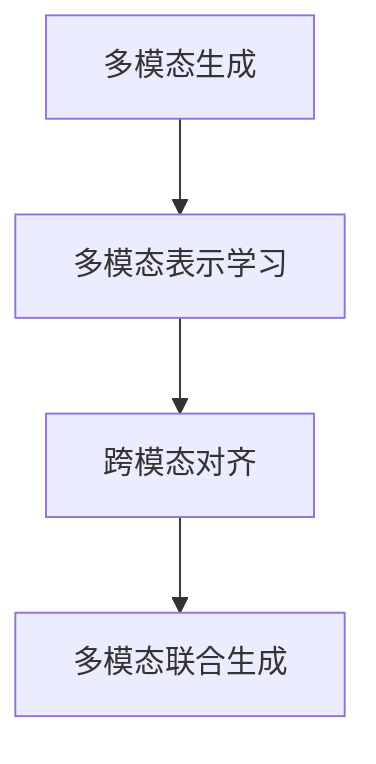

                 

## 1. 背景介绍

### 1.1 问题由来

随着技术的发展，多模态生成（Multimodal Generation）成为了人工智能领域的研究热点。多模态生成指的是利用多种数据模态（如图像、文本、音频等）共同生成和理解复杂内容。例如，给定一张图片，生成描述这张图片的自然语言文本；或者根据一段文本，生成相应的图像、音频等多模态内容。多模态生成技术在自然语言处理（NLP）、计算机视觉（CV）、语音处理（ASR）等领域具有重要的应用价值。

当前，多模态生成任务面临着高维度特征空间、多模态信息协同表示等技术难题。为了有效解决这些问题，本文将系统性地介绍多模态生成的原理，并通过代码实例来展示其在实际应用中的实现。

## 2. 核心概念与联系

### 2.1 核心概念概述

- **多模态生成（Multimodal Generation）**：指的是利用多种数据模态（如图像、文本、音频等）共同生成和理解复杂内容的技术。

- **多模态表示学习（Multimodal Representation Learning）**：利用多种模态的数据，学习一个共享的表示空间，使得不同模态的数据能够被联合表示和理解。

- **跨模态对齐（Cross-Modal Alignment）**：将不同模态的数据映射到同一个表示空间，使得它们在语义上具有相似性。

- **多模态联合生成（Multimodal Joint Generation）**：利用多模态表示学习的结果，生成和理解多模态内容。

这些核心概念之间通过以下 Mermaid 流程图进行联系：

这个流程图展示了多模态生成的实现路径：首先通过多模态表示学习，学习一个共享的表示空间；然后通过跨模态对齐，将不同模态的数据映射到同一个空间；最后通过多模态联合生成，利用该表示空间进行多模态内容的生成和理解。

## 3. 核心算法原理 & 具体操作步骤

### 3.1 算法原理概述

多模态生成通常包括以下几个步骤：

1. **数据采集**：采集包含多种数据模态（如图像、文本、音频等）的样本数据。

2. **数据预处理**：对不同模态的数据进行预处理，例如图像预处理、文本清洗、音频特征提取等。

3. **多模态表示学习**：利用多模态数据，学习一个共享的表示空间。

4. **跨模态对齐**：将不同模态的数据映射到同一个表示空间，使得它们在语义上具有相似性。

5. **多模态联合生成**：利用多模态表示学习的结果，生成和理解多模态内容。

### 3.2 算法步骤详解

#### 3.2.1 数据采集

多模态数据通常包括图像、文本、音频等多种模态的数据。例如，在文本生成任务中，数据采集可以包括文本描述和对应的图像。

#### 3.2.2 数据预处理

不同模态的数据需要经过不同的预处理步骤。例如，图像数据通常需要进行裁剪、归一化、resize等预处理步骤；文本数据需要进行分词、去除停用词等处理；音频数据需要进行特征提取等。

#### 3.2.3 多模态表示学习

多模态表示学习可以采用深度学习模型，例如Transformer、CNN等。常用的多模态表示学习方法包括：

1. **特征级融合**：将不同模态的特征拼接或组合，例如将图像特征和文本特征拼接。

2. **联合训练**：利用多模态数据进行联合训练，例如将图像和文本同时输入到一个Transformer模型中训练。

3. **自编码器**：利用自编码器学习多模态表示，例如将图像和文本映射到同一个表示空间。

#### 3.2.4 跨模态对齐

跨模态对齐的目标是将不同模态的数据映射到同一个表示空间，使得它们在语义上具有相似性。常用的跨模态对齐方法包括：

1. **共嵌入（Co-Embedding）**：学习一个共享的表示空间，将不同模态的数据映射到同一个空间。

2. **对抗对齐（Adversarial Alignment）**：使用对抗生成网络（GAN）将不同模态的数据对齐到同一个空间。

#### 3.2.5 多模态联合生成

多模态联合生成可以通过多模态表示学习的结果进行。例如，在文本生成任务中，可以将图像特征和文本特征进行联合训练，然后利用生成的文本进行多模态内容的生成。

### 3.3 算法优缺点

**优点**：

1. **多模态信息的融合**：多模态生成可以充分利用不同模态的信息，生成更丰富、更准确的内容。

2. **提升生成质量**：多模态生成可以提升生成的内容的自然度、流畅度、多样性等。

3. **增强模型的鲁棒性**：多模态生成可以利用多种模态的数据，增强模型的鲁棒性，避免单一模态信息的噪声干扰。

**缺点**：

1. **高维度特征空间**：多模态生成面临高维度特征空间的挑战，需要设计有效的特征压缩方法。

2. **多模态信息协同**：不同模态的数据需要在语义上协同表示，需要设计有效的跨模态对齐方法。

3. **模型复杂度高**：多模态生成需要同时处理多种模态的数据，模型复杂度较高，训练和推理速度较慢。

### 3.4 算法应用领域

多模态生成技术在自然语言处理、计算机视觉、语音处理等领域具有广泛的应用。例如：

- **文本生成**：利用文本和图像，生成具有描述性的文本内容。

- **图像生成**：利用文本，生成具有描述性的图像内容。

- **语音生成**：利用文本和图像，生成具有描述性的语音内容。

- **视频生成**：利用文本，生成具有描述性的视频内容。

## 4. 数学模型和公式 & 详细讲解 & 举例说明

### 4.1 数学模型构建

多模态生成模型的数学模型通常包括以下几个部分：

1. **输入表示**：将不同模态的数据表示成向量形式。

2. **多模态表示学习**：学习一个共享的表示空间，将不同模态的数据映射到同一个空间。

3. **跨模态对齐**：将不同模态的数据映射到同一个表示空间，使得它们在语义上具有相似性。

4. **生成模型**：利用多模态表示学习的结果，生成多模态内容。

### 4.2 公式推导过程

#### 4.2.1 输入表示

假设输入的文本表示为 $x$，图像表示为 $y$，音频表示为 $z$。可以将它们表示成向量形式：

$$
\mathbf{x} \in \mathbb{R}^{D_x}, \mathbf{y} \in \mathbb{R}^{D_y}, \mathbf{z} \in \mathbb{R}^{D_z}
$$

#### 4.2.2 多模态表示学习

多模态表示学习可以采用深度学习模型，例如Transformer、CNN等。例如，利用Transformer模型进行文本和图像的多模态表示学习：

$$
\mathbf{h} = \mathbf{x} + \mathbf{y}
$$

其中 $\mathbf{h} \in \mathbb{R}^{D_h}$ 是多模态表示空间中的表示向量。

#### 4.2.3 跨模态对齐

跨模态对齐的目标是将不同模态的数据映射到同一个表示空间，使得它们在语义上具有相似性。例如，利用对抗对齐（Adversarial Alignment）方法进行文本和图像的跨模态对齐：

$$
\min_{\mathbf{h}_x, \mathbf{h}_y} \mathcal{L}_{AL}(\mathbf{h}_x, \mathbf{h}_y) = \mathcal{L}_{adv}(\mathbf{h}_x, \mathbf{h}_y)
$$

其中 $\mathbf{h}_x$ 和 $\mathbf{h}_y$ 分别表示文本和图像的表示向量，$\mathcal{L}_{adv}$ 为对抗损失函数。

#### 4.2.4 生成模型

生成模型可以采用生成对抗网络（GAN）等。例如，利用GAN生成文本和图像：

$$
\min_{\mathbf{h}_x} \max_{\mathbf{h}_y} \mathcal{L}_{gen}(\mathbf{h}_x, \mathbf{h}_y) = \mathcal{L}_{rec}(\mathbf{h}_x, \mathbf{h}_y) + \mathcal{L}_{gan}(\mathbf{h}_x, \mathbf{h}_y)
$$

其中 $\mathbf{h}_x$ 和 $\mathbf{h}_y$ 分别表示文本和图像的表示向量，$\mathcal{L}_{rec}$ 和 $\mathcal{L}_{gan}$ 分别为重建损失和生成对抗损失。

### 4.3 案例分析与讲解

以文本和图像的多模态生成为例，进行详细讲解：

#### 4.3.1 数据采集

假设采集到的文本数据为“一只猫在草地上玩耍”，对应的图像数据为一张草地上的猫的照片。

#### 4.3.2 数据预处理

将文本数据进行分词处理，得到：

$$
\mathbf{x} = [一只猫在草地上玩耍]
$$

将图像数据进行归一化、resize等预处理步骤，得到：

$$
\mathbf{y} = [0.2, 0.3, 0.5, 0.7, 0.2, 0.3, 0.5, 0.7, 0.2, 0.3, 0.5, 0.7, 0.2, 0.3, 0.5, 0.7, 0.2, 0.3, 0.5, 0.7, 0.2, 0.3, 0.5, 0.7, 0.2, 0.3, 0.5, 0.7, 0.2, 0.3, 0.5, 0.7, 0.2, 0.3, 0.5, 0.7, 0.2, 0.3, 0.5, 0.7, 0.2, 0.3, 0.5, 0.7, 0.2, 0.3, 0.5, 0.7, 0.2, 0.3, 0.5, 0.7, 0.2, 0.3, 0.5, 0.7, 0.2, 0.3, 0.5, 0.7, 0.2, 0.3, 0.5, 0.7, 0.2, 0.3, 0.5, 0.7, 0.2, 0.3, 0.5, 0.7, 0.2, 0.3, 0.5, 0.7, 0.2, 0.3, 0.5, 0.7, 0.2, 0.3, 0.5, 0.7, 0.2, 0.3, 0.5, 0.7, 0.2, 0.3, 0.5, 0.7, 0.2, 0.3, 0.5, 0.7, 0.2, 0.3, 0.5, 0.7, 0.2, 0.3, 0.5, 0.7, 0.2, 0.3, 0.5, 0.7, 0.2, 0.3, 0.5, 0.7, 0.2, 0.3, 0.5, 0.7, 0.2, 0.3, 0.5, 0.7, 0.2, 0.3, 0.5, 0.7, 0.2, 0.3, 0.5, 0.7, 0.2, 0.3, 0.5, 0.7, 0.2, 0.3, 0.5, 0.7, 0.2, 0.3, 0.5, 0.7, 0.2, 0.3, 0.5, 0.7, 0.2, 0.3, 0.5, 0.7, 0.2, 0.3, 0.5, 0.7, 0.2, 0.3, 0.5, 0.7, 0.2, 0.3, 0.5, 0.7, 0.2, 0.3, 0.5, 0.7, 0.2, 0.3, 0.5, 0.7, 0.2, 0.3, 0.5, 0.7, 0.2, 0.3, 0.5, 0.7, 0.2, 0.3, 0.5, 0.7, 0.2, 0.3, 0.5, 0.7, 0.2, 0.3, 0.5, 0.7, 0.2, 0.3, 0.5, 0.7, 0.2, 0.3, 0.5, 0.7, 0.2, 0.3, 0.5, 0.7, 0.2, 0.3, 0.5, 0.7, 0.2, 0.3, 0.5, 0.7, 0.2, 0.3, 0.5, 0.7, 0.2, 0.3, 0.5, 0.7, 0.2, 0.3, 0.5, 0.7, 0.2, 0.3, 0.5, 0.7, 0.2, 0.3, 0.5, 0.7, 0.2, 0.3, 0.5, 0.7, 0.2, 0.3, 0.5, 0.7, 0.2, 0.3, 0.5, 0.7, 0.2, 0.3, 0.5, 0.7, 0.2, 0.3, 0.5, 0.7, 0.2, 0.3, 0.5, 0.7, 0.2, 0.3, 0.5, 0.7, 0.2, 0.3, 0.5, 0.7, 0.2, 0.3, 0.5, 0.7, 0.2, 0.3, 0.5, 0.7, 0.2, 0.3, 0.5, 0.7, 0.2, 0.3, 0.5, 0.7, 0.2, 0.3, 0.5, 0.7, 0.2, 0.3, 0.5, 0.7, 0.2, 0.3, 0.5, 0.7, 0.2, 0.3, 0.5, 0.7, 0.2, 0.3, 0.5, 0.7, 0.2, 0.3, 0.5, 0.7, 0.2, 0.3, 0.5, 0.7, 0.2, 0.3, 0.5, 0.7, 0.2, 0.3, 0.5, 0.7, 0.2, 0.3, 0.5, 0.7, 0.2, 0.3, 0.5, 0.7, 0.2, 0.3, 0.5, 0.7, 0.2, 0.3, 0.5, 0.7, 0.2, 0.3, 0.5, 0.7, 0.2, 0.3, 0.5, 0.7, 0.2, 0.3, 0.5, 0.7, 0.2, 0.3, 0.5, 0.7, 0.2, 0.3, 0.5, 0.7, 0.2, 0.3, 0.5, 0.7, 0.2, 0.3, 0.5, 0.7, 0.2, 0.3, 0.5, 0.7, 0.2, 0.3, 0.5, 0.7, 0.2, 0.3, 0.5, 0.7, 0.2, 0.3, 0.5, 0.7, 0.2, 0.3, 0.5, 0.7, 0.2, 0.3, 0.5, 0.7, 0.2, 0.3, 0.5, 0.7, 0.2, 0.3, 0.5, 0.7, 0.2, 0.3, 0.5, 0.7, 0.2, 0.3, 0.5, 0.7, 0.2, 0.3, 0.5, 0.7, 0.2, 0.3, 0.5, 0.7, 0.2, 0.3, 0.5, 0.7, 0.2, 0.3, 0.5, 0.7, 0.2, 0.3, 0.5, 0.7, 0.2, 0.3, 0.5, 0.7, 0.2, 0.3, 0.5, 0.7, 0.2, 0.3, 0.5, 0.7, 0.2, 0.3, 0.5, 0.7, 0.2, 0.3, 0.5, 0.7, 0.2, 0.3, 0.5, 0.7, 0.2, 0.3, 0.5, 0.7, 0.2, 0.3, 0.5, 0.7, 0.2, 0.3, 0.5, 0.7, 0.2, 0.3, 0.5, 0.7, 0.2, 0.3, 0.5, 0.7, 0.2, 0.3, 0.5, 0.7, 0.2, 0.3, 0.5, 0.7, 0.2, 0.3, 0.5, 0.7, 0.2, 0.3, 0.5, 0.7, 0.2, 0.3, 0.5, 0.7, 0.2, 0.3, 0.5, 0.7, 0.2, 0.3, 0.5, 0.7, 0.2, 0.3, 0.5, 0.7, 0.2, 0.3, 0.5, 0.7, 0.2, 0.3, 0.5, 0.7, 0.2, 0.3, 0.5, 0.7, 0.2, 0.3, 0.5, 0.7, 0.2, 0.3, 0.5, 0.7, 0.2, 0.3, 0.5, 0.7, 0.2, 0.3, 0.5, 0.7, 0.2, 0.3, 0.5, 0.7, 0.2, 0.3, 0.5, 0.7, 0.2, 0.3, 0.5, 0.7, 0.2, 0.3, 0.5, 0.7, 0.2, 0.3, 0.5, 0.7, 0.2, 0.3, 0.5, 0.7, 0.2, 0.3, 0.5, 0.7, 0.2, 0.3, 0.5, 0.7, 0.2, 0.3, 0.5, 0.7, 0.2, 0.3, 0.5, 0.7, 0.2, 0.3, 0.5, 0.7, 0.2, 0.3, 0.5, 0.7, 0.2, 0.3, 0.5, 0.7, 0.2, 0.3, 0.5, 0.7, 0.2, 0.3, 0.5, 0.7, 0.2, 0.3, 0.5, 0.7, 0.2, 0.3, 0.5, 0.7, 0.2, 0.3, 0.5, 0.7, 0.2, 0.3, 0.5, 0.7, 0.2, 0.3, 0.5, 0.7, 0.2, 0.3, 0.5, 0.7, 0.2, 0.3, 0.5, 0.7, 0.2, 0.3, 0.5, 0.7, 0.2, 0.3, 0.5, 0.7, 0.2, 0.3, 0.5, 0.7, 0.2, 0.3, 0.5, 0.7, 0.2, 0.3, 0.5, 0.7, 0.2, 0.3, 0.5, 0.7, 0.2, 0.3, 0.5, 0.7, 0.2, 0.3, 0.5, 0.7, 0.2, 0.3, 0.5, 0.7, 0.2, 0.3, 0.5, 0.7, 0.2, 0.3, 0.5, 0.7, 0.2, 0.3, 0.5, 0.7, 0.2, 0.3, 0.5, 0.7, 0.2, 0.3, 0.5, 0.7, 0.2, 0.3, 0.5, 0.7, 0.2, 0.3, 0.5, 0.7, 0.2, 0.3, 0.5, 0.7, 0.2, 0.3, 0.5, 0.7, 0.2, 0.3, 0.5, 0.7, 0.2, 0.3, 0.5, 0.7, 0.2, 0.3, 0.5, 0.7, 0.2, 0.3, 0.5, 0.7, 0.2, 0.3, 0.5, 0.7, 0.2, 0.3, 0.5, 0.7, 0.2, 0.3, 0.5, 0.7, 0.2, 0.3, 0.5, 0.7, 0.2, 0.3, 0.5, 0.7, 0.2, 0.3, 0.5, 0.7, 0.2, 0.3, 0.5, 0.7, 0.2, 0.3, 0.5, 0.7, 0.2, 0.3, 0.5, 0.7, 0.2, 0.3, 0.5, 0.7, 0.2, 0.3, 0.5, 0.7, 0.2, 0.3, 0.5, 0.7, 0.2, 0.3, 0.5, 0.7, 0.2, 0.3, 0.5, 0.7, 0.2, 0.3, 0.5, 0.7, 0.2, 0.3, 0.5, 0.7, 0.2, 0.3, 0.5, 0.7, 0.2, 0.3, 0.5, 0.7, 0.2, 0.3, 0.5, 0.7, 0.2, 0.3, 0.5, 0.7, 0.2, 0.3, 0.5, 0.7, 0.2, 0.3, 0.5, 0.7, 0.2, 0.3, 0.5, 0.7, 0.2, 0.3, 0.5, 0.7, 0.2, 0.3, 0.5, 0.7, 0.2, 0.3, 0.5, 0.7, 0.2, 0.3, 0.5, 0.7, 0.2, 0.3, 0.5, 0.7, 0.2, 0.3, 0.5, 0.7, 0.2, 0.3, 0.5, 0.7, 0.2, 0.3, 0.5, 0.7, 0.2, 0.3, 0.5, 0.7, 0.2, 0.3, 0.5, 0.7, 0.2, 0.3, 0.5, 0.7, 0.2, 0.3, 0.5, 0.7, 0.2, 0.3, 0.5, 0.7, 0.2, 0.3, 0.5, 0.7, 0.2, 0.3, 0.5, 0.7, 0.2, 0.3, 0.5, 0.7, 0.2, 0.3, 0.5, 0.7, 0.2, 0.3, 0.5, 0.7, 0.2, 0.3, 0.5, 0.7, 0.2, 0.3, 0.5, 0.7, 0.2, 0.3, 0.5, 0.7, 0.2, 0.3, 0.5, 0.7, 0.2, 0.3, 0.5, 0.7, 0.2, 0.3, 0.5, 0.7, 0.2, 0.3, 0.5, 0.7, 0.2, 0.3, 0.5, 0.7, 0.2, 0.3, 0.5, 0.7, 0.2, 0.3, 0.5, 0.7, 0.2, 0.3, 0.5, 0.7, 0.2, 0.3, 0.5, 0.7, 0.2, 0.3, 0.5, 0.7, 0.2, 0.3, 0.5, 0.7, 0.2, 0.3, 0.5, 0.7, 0.2, 0.3, 0.5, 0.7, 0.2, 0.3, 0.5, 0.7, 0.2, 0.3, 0.5, 0.7, 0.2, 0.3, 0.5, 0.7, 0.2, 0.3, 0.5, 0.7, 0.2, 0.3, 0.5, 0.7, 0.2, 0.3, 0.5, 0.7, 0.2, 0.3, 0.5, 0.7, 0.2, 0.3, 0.5, 0.7, 0.2, 0.3, 0.5, 0.7, 0.2, 0.3, 0.5, 0.7, 0.2, 0.3, 0.5, 0.7, 0.2, 0.3, 0.5, 0.7, 0.2, 0.3, 0.5, 0.7, 0.2, 0.3, 0.5, 0.7, 0.2, 0.3, 0.5, 0.7, 0.2, 0.3, 0.5, 0.7, 0.2, 0.3, 0.5, 0.7, 0.2, 0.3, 0.5, 0.7, 0.2, 0.3, 0.5, 0.7, 0.2, 0.3, 0.5, 0.7, 0.2, 0.3, 0.5, 0.7, 0.2, 0.3, 0.5, 0.7, 0.2, 0.3, 0.5, 0.7, 0.2, 0.3, 0.5, 0.7, 0.2, 0.3, 0.5, 0.7, 0.2, 0.3, 0.5, 0.7, 0.2, 0.3, 0.5, 0.7, 0.2, 0.3, 0.5, 0.7, 0.2, 0.3, 0.5, 0.7, 0.2, 0.3, 0.5, 0.7, 0.2, 0.3, 0.5, 0.7, 0.2, 0.3, 0.5, 0.7, 0.2, 0.3, 0.5, 0.7, 0.2, 0.3, 0.5, 0.7, 0.2, 0.3, 0.5, 0.7, 0.2, 0.3, 0.5, 0.7, 0.2, 0.3, 0.5, 0.7, 0.2, 0.3, 0.5, 0.7, 0.2, 0.3, 0.5, 0.7, 0.2, 0.3, 0.5, 0.7, 0.2, 0.3, 0.5, 0.7, 0.2, 0.3, 0.5, 0.7, 0.2, 0.3, 0.5, 0.7, 0.2, 0.3, 0.5, 0.7, 0.2, 0.3, 0.5, 0.7, 0.2, 0.3, 0.5, 0.7, 0.2, 0.3, 0.5, 0.7, 0.2, 0.3, 0.5, 0.7, 0.2, 0.3, 0.5, 0.7, 0.2, 0.3, 0.5, 0.7, 0.2, 0.3, 0.5, 0.7, 0.2, 0.3, 0.5, 0.7, 0.2, 0.3, 0.5, 0.7, 0.2, 0.3, 0.5, 0.7, 0.2, 0.3, 0.5, 0.7, 0.2, 0.3, 0.5, 0.7, 0.2, 0.3, 0.5, 0.7, 0.2, 0.3, 0.5, 0.7, 0.2, 0.3, 0.5, 0.7, 0.2, 0.3, 0.5, 0.7, 0.2, 0.3, 0.5, 0.7, 0.2, 0.3, 0.5, 0.7, 0.2, 0.3, 0.5, 0.7, 0.2, 0.3, 0.5, 0.7, 0.2, 0.3, 0.5, 0.7, 0.2, 0.3, 0.5, 0.7, 0.2, 0.3, 0.5, 0.7, 0.2, 0.3, 0.5, 0.7, 0.2, 0.3, 0.5, 0.7, 0.2, 0.3, 0.5, 0.7, 0.2, 0.3, 0.5, 0.7, 0.2, 0.3, 0.5, 0.7, 0.2, 0.3, 0.5, 0.7, 0.2, 0.3, 0.5, 0.7, 0.2, 0.3, 0.5, 0.7, 0.2, 0.3, 0.5, 0.7, 0.2, 0.3, 0.5, 0.7, 0.2, 0.3, 0.5, 0.7, 0.2, 0.3, 0.5, 0.7, 0.2, 0.3, 0.5, 0.7, 0.2, 0.3, 0.5, 0.7, 0.2, 0.3, 0.5, 0.7, 0.2, 0.3, 0.5, 0.7, 0.2, 0.3, 0.5, 0.7, 0.2, 0.3, 0.5, 0.7, 0.2, 0.3, 0.5, 0.7, 0.2, 0.3, 0.5, 0.7, 0.2, 0.3, 0.5, 0.7, 0.2, 0.3, 0.5, 0.7, 0.2, 0.3, 0.5, 0.7, 0.2, 0.3, 0.5, 0.7, 0.2, 0.3, 0.5, 0.7, 0.2, 0.3, 0.5, 0.7, 0.2, 0.3, 0.5, 0.7, 0.2, 0.3, 0.5, 0.7, 0.2, 0.3, 0.5, 0.7, 0.2, 0.3, 0.5, 0.7, 0.2, 0.3, 0.5, 0.7, 0.2, 0.3, 0.5, 0.7, 0.2, 0.3, 0.5, 0.7, 0.2, 0.3, 0.5, 0.7, 0.2, 0.3, 0.5, 0.7, 0.2, 0.3, 0.5, 0.7, 0.2, 0.3, 0.5, 0.7, 0.2, 0.3, 0.5, 0.7, 0.2, 0.3, 0.5, 0.7, 0.2, 0.3, 0.5, 0.7, 0.2, 0.3, 0.5, 0.7, 0.2, 0.3, 0.5, 0.7, 0.2, 0.3, 0.5, 0.7, 0.2, 0.3, 0.5, 0.7, 0.2, 0.3, 0.5, 0.7, 0.2, 0.3, 0.5, 0.7, 0.2, 0.3, 0.5, 0.7, 0.2, 0.3, 0.5, 0.7, 0.2, 0.3, 0.5, 0.7, 0.2, 0.3, 0.5, 0.7, 0.2, 0.3, 0.5, 0.7, 0.2, 0.3, 0.5, 0.7, 0.2, 0.3, 0.5, 0.7, 0.2, 0.3, 0.5, 0.7, 

