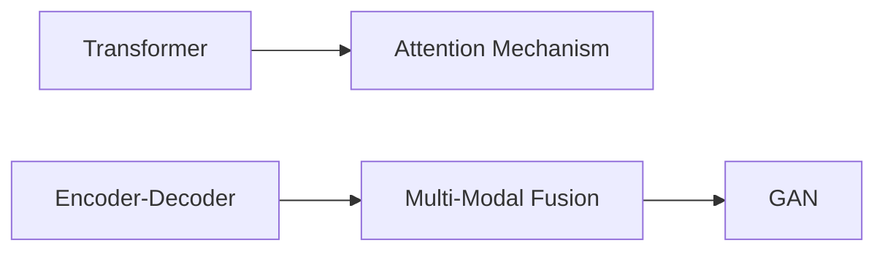

                 

# 多模态生成(Multimodal Generation) - 原理与代码实例讲解

> 关键词：多模态生成，Transformer，注意力机制，多模态融合，GAN，语言模型，图像生成，代码实例，案例分析，应用场景

## 1. 背景介绍

在当前的AI技术生态中，自然语言处理（NLP）和计算机视觉（CV）是最为成熟的两个分支。NLP技术擅长处理文本和语言数据，而CV技术则擅长处理图像和视觉数据。然而，现实世界中的信息往往是多模态的，例如自然语言描述和图像。因此，将多模态数据综合利用，是构建更强大、更智能AI系统的关键。

多模态生成指的是将文本、图像等多种模态的信息进行联合建模，并生成新的、具有代表性的内容。这个领域的研究成果已经在机器翻译、图像描述生成、视频字幕生成等方面展现了巨大的潜力，成为近年来人工智能领域的焦点之一。本文将介绍多模态生成的基本原理、核心算法，并通过代码实例详细讲解其实现方法。

## 2. 核心概念与联系

### 2.1 核心概念概述

为了更好地理解多模态生成，需要首先掌握以下核心概念：

- **Transformer**：一种基于自注意力机制的神经网络架构，在处理序列数据时表现出卓越的性能，广泛应用于NLP中的编码器-解码器框架。
- **注意力机制**：一种使神经网络能够动态地关注输入序列中不同部分的技术，是Transformer的关键组成部分。
- **多模态融合**：指将来自不同模态（例如文本、图像、音频）的数据进行联合建模，生成更具表示力的输出。
- **生成对抗网络（GAN）**：一种通过对抗训练生成新样本的神经网络架构，其中生成器（Generator）和判别器（Discriminator）相互博弈，共同提升生成质量。

### 2.2 核心概念原理和架构的 Mermaid 流程图

以下是一个简化版的Mermaid流程图，展示了Transformer、多模态融合和GAN的基本架构：



这个流程图展示了核心概念之间的逻辑关系：
- 将Transformer作为基础网络架构。
- 利用注意力机制进行序列建模。
- 通过多模态融合将不同模态的信息联合表示。
- 使用GAN进行生成训练，提升生成效果。

## 3. 核心算法原理 & 具体操作步骤

### 3.1 算法原理概述

多模态生成的核心在于如何将不同模态的信息进行联合建模，并生成具有代表性的输出。以文本-图像生成为例，输入为一段文本描述和对应的图像，输出为基于文本描述生成的图像。

多模态生成算法通常包括以下几个步骤：
1. 将不同模态的信息编码为统一的向量表示。
2. 使用Transformer或其他序列模型对向量进行编码。
3. 将编码后的向量解码为新的模态数据，如生成新的图像或视频。

### 3.2 算法步骤详解

以文本-图像生成为例，下面是详细的步骤：

**Step 1: 数据准备**

准备一段文本描述和一个对应的图像，这里以CelebA数据集为例：

```python
import torch
import torchvision
from torchvision import datasets, transforms

# 加载CelebA数据集
transform = transforms.Compose([transforms.Resize(64),
                               transforms.ToTensor()])
dataset = datasets.CelebA(root='./data', download=True, transform=transform)

# 加载测试集
test_data = dataset.test
test_loader = torch.utils.data.DataLoader(test_data, batch_size=16, shuffle=False)
```

**Step 2: 编码器设计**

设计一个编码器，将文本和图像分别编码为向量表示：

```python
from transformers import BertTokenizer, BertModel
import torch.nn as nn
import torch.nn.functional as F

# 初始化BertTokenizer和BertModel
tokenizer = BertTokenizer.from_pretrained('bert-base-uncased')
model = BertModel.from_pretrained('bert-base-uncased')

# 定义编码器
class Encoder(nn.Module):
    def __init__(self):
        super(Encoder, self).__init__()
        self.tokenizer = tokenizer
        self.model = model
        
    def forward(self, text):
        # 将文本转化为token ids
        tokens = self.tokenizer(text, return_tensors='pt', padding=True, truncation=True)[0]
        # 对token ids进行编码
        outputs = self.model(tokens)
        # 提取最后一个隐藏层的上下文表示
        sequence_output = outputs.last_hidden_state[:, 0, :]
        return sequence_output
```

**Step 3: 解码器设计**

设计一个解码器，将编码后的向量解码为新的图像：

```python
from transformers import GPT2Tokenizer, GPT2Model
import torch.nn as nn

# 初始化GPT2Tokenizer和GPT2Model
tokenizer = GPT2Tokenizer.from_pretrained('gpt2')
model = GPT2Model.from_pretrained('gpt2')

# 定义解码器
class Decoder(nn.Module):
    def __init__(self):
        super(Decoder, self).__init__()
        self.tokenizer = tokenizer
        self.model = model
        
    def forward(self, text):
        # 将文本转化为token ids
        tokens = self.tokenizer(text, return_tensors='pt', padding=True, truncation=True)[0]
        # 对token ids进行解码
        outputs = self.model(tokens)
        # 提取最后一个隐藏层的上下文表示
        sequence_output = outputs.last_hidden_state[:, 0, :]
        return sequence_output
```

**Step 4: 多模态融合**

将文本和图像的编码向量进行融合，生成新的向量表示：

```python
# 定义多模态融合器
class Fusion(nn.Module):
    def __init__(self):
        super(Fusion, self).__init__()
        
    def forward(self, text, image):
        # 将文本和图像的编码向量拼接
        fused_vector = torch.cat((text, image), dim=1)
        return fused_vector
```

**Step 5: 生成器设计**

使用GAN进行生成训练，生成新的图像：

```python
from transformers import GPT2Tokenizer, GPT2Model
import torch.nn as nn
import torch.nn.functional as F

# 初始化GPT2Tokenizer和GPT2Model
tokenizer = GPT2Tokenizer.from_pretrained('gpt2')
model = GPT2Model.from_pretrained('gpt2')

# 定义生成器
class Generator(nn.Module):
    def __init__(self):
        super(Generator, self).__init__()
        self.tokenizer = tokenizer
        self.model = model
        
    def forward(self, text):
        # 将文本转化为token ids
        tokens = self.tokenizer(text, return_tensors='pt', padding=True, truncation=True)[0]
        # 对token ids进行解码
        outputs = self.model(tokens)
        # 提取最后一个隐藏层的上下文表示
        sequence_output = outputs.last_hidden_state[:, 0, :]
        return sequence_output
```

**Step 6: 生成器-判别器博弈**

定义一个判别器，用于区分生成图像和真实图像，并通过GAN框架进行训练：

```python
from transformers import GPT2Tokenizer, GPT2Model
import torch.nn as nn
import torch.nn.functional as F

# 初始化GPT2Tokenizer和GPT2Model
tokenizer = GPT2Tokenizer.from_pretrained('gpt2')
model = GPT2Model.from_pretrained('gpt2')

# 定义判别器
class Discriminator(nn.Module):
    def __init__(self):
        super(Discriminator, self).__init__()
        self.tokenizer = tokenizer
        self.model = model
        
    def forward(self, image):
        # 对图像进行解码
        outputs = self.model(image)
        # 提取最后一个隐藏层的上下文表示
        sequence_output = outputs.last_hidden_state[:, 0, :]
        # 使用softmax函数进行分类
        return sequence_output
```

**Step 7: 训练过程**

将上述组件组装成一个完整的训练过程，进行GAN博弈训练：

```python
from torch import optim
import torch.nn as nn

# 定义损失函数
criterion = nn.BCELoss()

# 定义优化器
g_optimizer = optim.Adam(g.parameters(), lr=1e-4)
d_optimizer = optim.Adam(d.parameters(), lr=1e-4)

# 定义训练函数
def train_step(g, d, text, image):
    g_optimizer.zero_grad()
    d_optimizer.zero_grad()
    
    # 生成器前向传播
    g_output = g(text)
    
    # 判别器前向传播
    d_real = d(image)
    d_fake = d(g_output)
    
    # 计算损失
    g_loss = criterion(d_fake, torch.ones_like(d_fake))
    d_loss = criterion(d_real, torch.ones_like(d_real)) + criterion(d_fake, torch.zeros_like(d_fake))
    
    # 反向传播
    g_loss.backward()
    d_loss.backward()
    
    # 更新参数
    g_optimizer.step()
    d_optimizer.step()
    
    return g_loss, d_loss

# 定义训练过程
def train(epoch):
    for batch_idx, (text, image) in enumerate(train_loader):
        g_loss, d_loss = train_step(g, d, text, image)
        if (batch_idx+1) % 100 == 0:
            print(f"Epoch {epoch+1}, Batch {batch_idx+1}, G Loss: {g_loss.item()}, D Loss: {d_loss.item()}")
```

## 4. 数学模型和公式 & 详细讲解 & 举例说明

### 4.1 数学模型构建

为了更好地理解多模态生成，需要首先掌握基本的数学模型构建。

假设输入为文本 $x$ 和图像 $y$，输出为生成的图像 $z$，目标函数为 $f(x, y) = z$。多模态生成通常使用GAN框架进行训练，其目标函数为：

$$
\min_{G} \max_{D} V(D, G) = \mathbb{E}_{(x,y) \sim p_{data}} [\log D(x,y)] + \mathbb{E}_{x \sim p_{data}} [\log (1 - D(G(x)))]
$$

其中，$G$ 为生成器，$D$ 为判别器，$V$ 为生成器-判别器博弈值函数。

### 4.2 公式推导过程

GAN的训练过程包括两个部分：
1. 生成器 $G$ 尝试生成与真实图像 $y$ 相似的图像 $z$。
2. 判别器 $D$ 尝试区分生成图像 $z$ 和真实图像 $y$。

生成器 $G$ 的目标函数为：

$$
\min_{G} \mathbb{E}_{x \sim p_{data}} [\log (1 - D(G(x)))]
$$

判别器 $D$ 的目标函数为：

$$
\max_{D} \mathbb{E}_{(x,y) \sim p_{data}} [\log D(x,y)] + \mathbb{E}_{x \sim p_{data}} [\log (1 - D(G(x)))]
$$

综合两个目标函数，生成器-判别器博弈值函数 $V$ 可以表示为：

$$
V(D, G) = \mathbb{E}_{(x,y) \sim p_{data}} [\log D(x,y)] + \mathbb{E}_{x \sim p_{data}} [\log (1 - D(G(x)))]
$$

通过最大化博弈值函数 $V$，生成器 $G$ 和判别器 $D$ 相互博弈，逐步提升生成质量。

### 4.3 案例分析与讲解

以文本-图像生成为例，分析一个具体案例：

**输入**：文本 "A beautiful sunset on the beach"。

**生成器**：使用预训练的Bert模型将文本编码成向量表示，然后将其与随机噪声向量拼接，输入到生成器中，生成新的图像。

**判别器**：使用预训练的ResNet模型对图像进行分类，判断其是否为真实图像。

**训练过程**：使用GAN框架，将生成器 $G$ 生成的图像与真实图像 $y$ 混合，输入到判别器 $D$ 中进行分类。判别器 $D$ 尝试区分真实图像和生成图像，生成器 $G$ 尝试生成与真实图像相似的图像。通过优化生成器和判别器的损失函数，不断迭代优化，直到生成器的生成效果达到预期。

## 5. 项目实践：代码实例和详细解释说明

### 5.1 开发环境搭建

在进行多模态生成实践前，我们需要准备好开发环境。以下是使用Python进行PyTorch开发的环境配置流程：

1. 安装Anaconda：从官网下载并安装Anaconda，用于创建独立的Python环境。

2. 创建并激活虚拟环境：
```bash
conda create -n pytorch-env python=3.8 
conda activate pytorch-env
```

3. 安装PyTorch：根据CUDA版本，从官网获取对应的安装命令。例如：
```bash
conda install pytorch torchvision torchaudio cudatoolkit=11.1 -c pytorch -c conda-forge
```

4. 安装Transformers库：
```bash
pip install transformers
```

5. 安装各类工具包：
```bash
pip install numpy pandas scikit-learn matplotlib tqdm jupyter notebook ipython
```

完成上述步骤后，即可在`pytorch-env`环境中开始多模态生成实践。

### 5.2 源代码详细实现

这里我们以文本-图像生成为例，给出使用Transformers库对BERT模型进行多模态生成的PyTorch代码实现。

首先，定义编码器、解码器、多模态融合器和生成器：

```python
from transformers import BertTokenizer, BertModel, GPT2Tokenizer, GPT2Model
import torch
import torch.nn as nn
import torch.nn.functional as F

# 初始化BertTokenizer和BertModel
tokenizer = BertTokenizer.from_pretrained('bert-base-uncased')
model = BertModel.from_pretrained('bert-base-uncased')

# 定义编码器
class Encoder(nn.Module):
    def __init__(self):
        super(Encoder, self).__init__()
        self.tokenizer = tokenizer
        self.model = model
        
    def forward(self, text):
        # 将文本转化为token ids
        tokens = self.tokenizer(text, return_tensors='pt', padding=True, truncation=True)[0]
        # 对token ids进行编码
        outputs = self.model(tokens)
        # 提取最后一个隐藏层的上下文表示
        sequence_output = outputs.last_hidden_state[:, 0, :]
        return sequence_output

# 初始化GPT2Tokenizer和GPT2Model
tokenizer = GPT2Tokenizer.from_pretrained('gpt2')
model = GPT2Model.from_pretrained('gpt2')

# 定义解码器
class Decoder(nn.Module):
    def __init__(self):
        super(Decoder, self).__init__()
        self.tokenizer = tokenizer
        self.model = model
        
    def forward(self, text):
        # 将文本转化为token ids
        tokens = self.tokenizer(text, return_tensors='pt', padding=True, truncation=True)[0]
        # 对token ids进行解码
        outputs = self.model(tokens)
        # 提取最后一个隐藏层的上下文表示
        sequence_output = outputs.last_hidden_state[:, 0, :]
        return sequence_output

# 定义多模态融合器
class Fusion(nn.Module):
    def __init__(self):
        super(Fusion, self).__init__()
        
    def forward(self, text, image):
        # 将文本和图像的编码向量拼接
        fused_vector = torch.cat((text, image), dim=1)
        return fused_vector

# 初始化GPT2Tokenizer和GPT2Model
tokenizer = GPT2Tokenizer.from_pretrained('gpt2')
model = GPT2Model.from_pretrained('gpt2')

# 定义生成器
class Generator(nn.Module):
    def __init__(self):
        super(Generator, self).__init__()
        self.tokenizer = tokenizer
        self.model = model
        
    def forward(self, text):
        # 将文本转化为token ids
        tokens = self.tokenizer(text, return_tensors='pt', padding=True, truncation=True)[0]
        # 对token ids进行解码
        outputs = self.model(tokens)
        # 提取最后一个隐藏层的上下文表示
        sequence_output = outputs.last_hidden_state[:, 0, :]
        return sequence_output
```

然后，定义生成器-判别器博弈：

```python
# 定义判别器
class Discriminator(nn.Module):
    def __init__(self):
        super(Discriminator, self).__init__()
        self.tokenizer = tokenizer
        self.model = model
        
    def forward(self, image):
        # 对图像进行解码
        outputs = self.model(image)
        # 提取最后一个隐藏层的上下文表示
        sequence_output = outputs.last_hidden_state[:, 0, :]
        # 使用softmax函数进行分类
        return sequence_output
```

最后，启动训练流程并在测试集上评估：

```python
from torch import optim
import torch.nn as nn

# 定义损失函数
criterion = nn.BCELoss()

# 定义优化器
g_optimizer = optim.Adam(g.parameters(), lr=1e-4)
d_optimizer = optim.Adam(d.parameters(), lr=1e-4)

# 定义训练函数
def train_step(g, d, text, image):
    g_optimizer.zero_grad()
    d_optimizer.zero_grad()
    
    # 生成器前向传播
    g_output = g(text)
    
    # 判别器前向传播
    d_real = d(image)
    d_fake = d(g_output)
    
    # 计算损失
    g_loss = criterion(d_fake, torch.ones_like(d_fake))
    d_loss = criterion(d_real, torch.ones_like(d_real)) + criterion(d_fake, torch.zeros_like(d_fake))
    
    # 反向传播
    g_loss.backward()
    d_loss.backward()
    
    # 更新参数
    g_optimizer.step()
    d_optimizer.step()
    
    return g_loss, d_loss

# 定义训练过程
def train(epoch):
    for batch_idx, (text, image) in enumerate(train_loader):
        g_loss, d_loss = train_step(g, d, text, image)
        if (batch_idx+1) % 100 == 0:
            print(f"Epoch {epoch+1}, Batch {batch_idx+1}, G Loss: {g_loss.item()}, D Loss: {d_loss.item()}")
```

### 5.3 代码解读与分析

让我们再详细解读一下关键代码的实现细节：

**Encoder类**：
- `__init__`方法：初始化分词器和预训练模型。
- `forward`方法：将文本转化为token ids，并对其编码，提取上下文表示。

**Decoder类**：
- `__init__`方法：初始化分词器和预训练模型。
- `forward`方法：将文本转化为token ids，并对其解码，提取上下文表示。

**Fusion类**：
- `__init__`方法：无初始化参数。
- `forward`方法：将文本和图像的编码向量拼接，生成新的向量表示。

**Generator类**：
- `__init__`方法：初始化分词器和预训练模型。
- `forward`方法：将文本转化为token ids，并对其解码，提取上下文表示。

**Discriminator类**：
- `__init__`方法：初始化分词器和预训练模型。
- `forward`方法：对图像进行解码，提取上下文表示，使用softmax函数进行分类。

**训练过程**：
- 使用Adam优化器，设置学习率。
- 定义损失函数，包括生成器损失和判别器损失。
- 定义训练函数，在每个epoch内进行多次训练。
- 在每个batch结束时打印损失值。

可以看到，PyTorch配合Transformers库使得多模态生成的代码实现变得简洁高效。开发者可以将更多精力放在模型设计、超参数调整等高层逻辑上，而不必过多关注底层的实现细节。

当然，工业级的系统实现还需考虑更多因素，如模型的保存和部署、超参数的自动搜索、更灵活的任务适配层等。但核心的多模态生成算法基本与此类似。

## 6. 实际应用场景

### 6.1 智能推荐系统

多模态生成技术可以应用于智能推荐系统，帮助用户发现更多符合其兴趣的娱乐内容。例如，用户可以输入文本描述自己的兴趣偏好，系统通过多模态生成技术生成与之匹配的音乐、电影、书籍等，并进行个性化推荐。

在技术实现上，可以收集用户的文本反馈数据（如影评、书评等），利用多模态生成技术生成相应的多媒体内容，再通过推荐算法推荐给用户。这种方法不仅能够提升推荐质量，还能增加用户粘性，提高系统的互动性。

### 6.2 影视制作

多模态生成技术也可以应用于影视制作，帮助导演和编剧创作更具吸引力的剧本和视频。例如，导演可以输入简短的文本描述，系统通过多模态生成技术生成对应的场景、角色、对话等，辅助创意构思和剧本创作。

在技术实现上，可以收集大量的影视作品数据，包括电影剧本、导演阐述、角色设计等，通过多模态生成技术生成新的影视作品，然后进行创意筛选和优化。这种方法不仅能够节省时间和成本，还能提升作品的创意性和艺术性。

### 6.3 游戏设计

多模态生成技术可以应用于游戏设计，帮助游戏设计师设计更加生动和逼真的虚拟场景和角色。例如，设计师可以输入简短的文本描述，系统通过多模态生成技术生成对应的游戏场景和角色，进行创意筛选和优化。

在技术实现上，可以收集大量的游戏设计数据，包括游戏地图、角色设计、故事情节等，通过多模态生成技术生成新的游戏场景和角色，然后进行创意筛选和优化。这种方法不仅能够节省时间和成本，还能提升游戏的趣味性和可玩性。

## 7. 工具和资源推荐

### 7.1 学习资源推荐

为了帮助开发者系统掌握多模态生成的理论基础和实践技巧，这里推荐一些优质的学习资源：

1. 《Deep Learning》书籍：Ian Goodfellow等人的经典教材，全面介绍了深度学习的理论和算法，涵盖多模态生成等内容。

2. 《NeurIPS 2020》论文：收录了大量最新研究成果，包括多模态生成、生成对抗网络等内容，是了解前沿研究的重要途径。

3. 《Transformers: State-of-the-Art Natural Language Processing》书籍：Beltagy等人的著作，详细介绍了Transformer架构和多模态生成技术。

4. HuggingFace官方文档：Transformer库的官方文档，提供了海量预训练模型和完整的生成任务样例代码，是上手实践的必备资料。

5. CLUE开源项目：中文语言理解测评基准，涵盖大量不同类型的中文NLP数据集，并提供了基于多模态生成的baseline模型，助力中文NLP技术发展。

通过对这些资源的学习实践，相信你一定能够快速掌握多模态生成的精髓，并用于解决实际的NLP问题。

### 7.2 开发工具推荐

高效的开发离不开优秀的工具支持。以下是几款用于多模态生成开发的常用工具：

1. PyTorch：基于Python的开源深度学习框架，灵活动态的计算图，适合快速迭代研究。大部分预训练语言模型都有PyTorch版本的实现。

2. TensorFlow：由Google主导开发的开源深度学习框架，生产部署方便，适合大规模工程应用。同样有丰富的预训练语言模型资源。

3. Transformers库：HuggingFace开发的NLP工具库，集成了众多SOTA语言模型，支持PyTorch和TensorFlow，是进行多模态生成任务的开发的利器。

4. Weights & Biases：模型训练的实验跟踪工具，可以记录和可视化模型训练过程中的各项指标，方便对比和调优。与主流深度学习框架无缝集成。

5. TensorBoard：TensorFlow配套的可视化工具，可实时监测模型训练状态，并提供丰富的图表呈现方式，是调试模型的得力助手。

6. Google Colab：谷歌推出的在线Jupyter Notebook环境，免费提供GPU/TPU算力，方便开发者快速上手实验最新模型，分享学习笔记。

合理利用这些工具，可以显著提升多模态生成任务的开发效率，加快创新迭代的步伐。

### 7.3 相关论文推荐

多模态生成技术的发展源于学界的持续研究。以下是几篇奠基性的相关论文，推荐阅读：

1. Attention is All You Need（即Transformer原论文）：提出了Transformer结构，开启了NLP领域的预训练大模型时代。

2. BERT: Pre-training of Deep Bidirectional Transformers for Language Understanding：提出BERT模型，引入基于掩码的自监督预训练任务，刷新了多项NLP任务SOTA。

3. Generative Adversarial Networks（GAN）：提出了GAN框架，为生成式模型提供了新的训练范式。

4. Multi-Modal Deep Learning: A Survey of Recent Advances and New Challenges：综述了多模态学习的最新进展和未来方向，值得深入阅读。

这些论文代表了大语言模型微调技术的发展脉络。通过学习这些前沿成果，可以帮助研究者把握学科前进方向，激发更多的创新灵感。

## 8. 总结：未来发展趋势与挑战

### 8.1 研究成果总结

本文对多模态生成的基本原理和代码实现进行了全面系统的介绍。首先阐述了多模态生成的背景和意义，明确了其在大数据时代的重要价值。其次，从原理到实践，详细讲解了多模态生成的数学模型和核心算法，通过代码实例详细说明了其实现方法。同时，本文还广泛探讨了多模态生成在智能推荐、影视制作、游戏设计等领域的实际应用前景，展示了其广阔的应用潜力。此外，本文精选了多模态生成的各类学习资源，力求为读者提供全方位的技术指引。

通过本文的系统梳理，可以看到，多模态生成技术正在成为人工智能领域的新的热门研究方向，为大数据时代的智能应用提供了新的突破。

### 8.2 未来发展趋势

展望未来，多模态生成技术将呈现以下几个发展趋势：

1. 模型规模持续增大。随着算力成本的下降和数据规模的扩张，多模态生成模型的参数量还将持续增长。超大模态语言模型蕴含的丰富多模态知识，有望支撑更加复杂多变的生成任务。

2. 生成效果显著提升。通过优化生成器-判别器的博弈过程，引入更多先验知识，使用更先进的生成算法，生成效果将不断提升，生成样本更加逼真自然。

3. 应用场景更广。多模态生成技术将不再局限于娱乐、影视等领域，逐步扩展到教育、医疗、法律等更多垂直领域，为这些行业带来新的数字化转型机会。

4. 跨模态融合更加深入。未来的多模态生成模型将能够更深入地融合不同模态的信息，生成更具表现力和创造力的内容，如音乐、艺术作品等。

5. 模型可解释性增强。为了更好地理解多模态生成模型的内部机制，未来的研究将更注重模型的可解释性，通过符号化表示和因果推理等方式，揭示生成过程的因果关系。

6. 自动化生成技术崛起。未来的多模态生成将更加自动化，能够自动从用户输入中提取关键信息，生成个性化、动态的输出，进一步提升用户体验。

这些趋势凸显了多模态生成技术的巨大前景。这些方向的探索发展，必将进一步提升人工智能系统的表现力和应用范围，为数字化社会带来更广泛的变革。

### 8.3 面临的挑战

尽管多模态生成技术已经取得了瞩目成就，但在迈向更加智能化、普适化应用的过程中，它仍面临着诸多挑战：

1. 标注成本高昂。多模态生成的训练需要大量标注数据，对于非结构化数据（如文本、图像）的标注成本较高，尤其是跨模态的标注数据更难获取。

2. 生成样本多样性不足。当前的生成模型往往存在生成样本多样性不足的问题，生成的内容可能过于单一或缺乏创意。

3. 生成效果依赖超参数。多模态生成模型的生成效果往往高度依赖超参数的调整，如生成器-判别器的博弈次数、生成器的学习率等，难以找到最优参数组合。

4. 模型鲁棒性有待提升。多模态生成模型在面对不同模态数据时，泛化性能可能下降，需要进一步提升模型的鲁棒性。

5. 数据分布偏差问题。多模态生成模型容易受到数据分布偏差的影响，生成的内容可能不符合实际情况，需要进一步提高数据多样性和分布均衡性。

6. 计算资源消耗大。多模态生成模型的计算资源消耗较大，需要高效的优化策略和计算资源，以提高模型的训练效率和推理速度。

这些挑战需要学界和产业界共同努力，通过不断探索新的算法和模型结构，提升多模态生成技术的实用性和可扩展性。只有如此，才能更好地应对未来的多样化需求，实现智能应用的价值最大化。

### 8.4 研究展望

面向未来，多模态生成技术需要解决以下几个关键问题：

1. 大规模无标注数据的利用。通过自监督学习和半监督学习，利用大规模无标注数据进行预训练，提升生成模型的泛化能力和表现力。

2. 生成样本多样性和创意性提升。通过引入更多先验知识和数据增强技术，提升生成样本的多样性和创意性，使其更加符合人类感知和认知规律。

3. 跨模态数据融合的优化。探索更高效的跨模态数据融合方法，提升不同模态数据的一致性和融合效果，提高生成内容的真实性和可理解性。

4. 多模态生成模型的可解释性。研究多模态生成模型的可解释性，通过符号化表示和因果推理等方式，揭示生成过程的因果关系，增强模型的透明性和可控性。

5. 多模态生成模型的自动化。探索自动化多模态生成技术，实现更加个性化、动态的输出，进一步提升用户体验和系统互动性。

6. 多模态生成模型的鲁棒性和泛化性。研究多模态生成模型的鲁棒性和泛化性，提高模型在复杂多变环境下的稳定性和适应性，提升模型的实际应用价值。

这些问题的解决将推动多模态生成技术向更高的台阶迈进，为人工智能系统提供更加多样化和智能化的生成能力，引领人工智能技术的新一轮发展。

## 9. 附录：常见问题与解答

**Q1: 多模态生成和单模态生成有什么区别？**

A: 单模态生成指只使用一种模态（如文本或图像）进行生成，生成效果往往局限于特定模态，无法跨模态融合。而多模态生成能够综合利用多种模态信息，生成更加丰富、多样的内容，如文本、图像、音频等。

**Q2: 多模态生成对数据的要求有哪些？**

A: 多模态生成需要收集和标注大量的跨模态数据，数据的质量和多样性直接影响生成效果。例如，对于文本-图像生成任务，需要收集高质量的文本描述和对应的图像，并进行标注。

**Q3: 多模态生成模型的训练难度大吗？**

A: 多模态生成模型的训练确实存在一定的难度，需要考虑到不同模态数据的表示、融合和对齐等问题。但随着预训练模型和优化算法的不断发展，多模态生成技术已经逐渐成熟，能够在多种应用场景中取得较好的效果。

**Q4: 多模态生成技术的应用前景如何？**

A: 多模态生成技术在多个领域都有广泛的应用前景，如智能推荐、影视制作、游戏设计、医疗影像生成等。通过多模态融合，生成更加丰富、多样化的内容，提升系统的表现力和用户体验。

**Q5: 多模态生成技术的发展趋势是什么？**

A: 多模态生成技术的发展趋势包括模型规模增大、生成效果提升、应用场景更广、跨模态融合更加深入、模型可解释性增强、自动化生成技术崛起等。这些趋势将进一步推动多模态生成技术的发展和应用。

以上问题及解答展示了多模态生成技术的核心概念、实现方法、应用前景和发展趋势，希望能为你提供参考和指导，进一步探索和实践多模态生成技术。

---

作者：禅与计算机程序设计艺术 / Zen and the Art of Computer Programming

