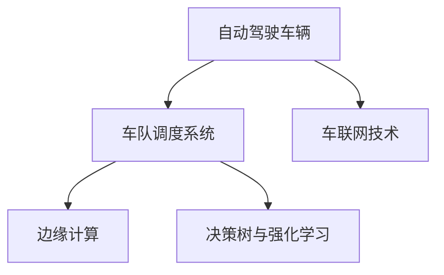

                 

# 多车协同的自动驾驶车队智能调度新思路

## 1. 背景介绍

随着自动驾驶技术的发展，自动驾驶车队在物流、交通、城市配送等领域的应用场景日益增多。然而，目前的多车协同调度方案往往依赖于集中式系统，难以在复杂的交通环境中高效应对。本文提出了一种分布式协作的智能调度方法，通过车辆间的通信与信息共享，实现多车协同，提升车队整体的调度效率与安全性。

## 2. 核心概念与联系

### 2.1 核心概念概述

为更好地理解多车协同的智能调度方法，本节将介绍几个密切相关的核心概念：

- 自动驾驶车辆：配备了传感器、计算平台、通讯模块等设备，能够在无人或低度介入条件下，按照设定的策略自动驾驶的交通工具。
- 车队调度系统：对自动驾驶车辆进行规划与指挥，包括路径规划、车辆控制、故障处理等功能。
- 车联网技术：车辆与外界环境和其他车辆的通信技术，实现车辆间的信息共享与协作。
- 边缘计算：在靠近数据源处进行本地计算，减少网络延迟和带宽消耗，提升系统响应速度。
- 决策树与强化学习：用于路径规划、行为决策等场景的智能算法，通过模型优化提升调度效率和安全性。

这些核心概念之间的逻辑关系可以通过以下Mermaid流程图来展示：



这个流程图展示了下游任务在核心概念之间的逻辑联系：

1. 自动驾驶车辆通过车联网技术与车队调度系统进行通信，获取任务指令和环境信息。
2. 车队调度系统结合边缘计算，对车辆行为进行决策与控制。
3. 决策树与强化学习算法用于优化调度策略，提高车队运行效率和安全性。

## 3. 核心算法原理 & 具体操作步骤
### 3.1 算法原理概述

基于车联网和边缘计算的多车协同调度方法，旨在通过车辆间的通信与信息共享，实现智能化、协同化的调度。其核心思想是：将多车调度任务分解为多个子任务，每个子任务由一个或多个车辆协同完成，确保车队整体目标的实现。

形式化地，假设自动驾驶车队由 $N$ 辆车组成，车辆 $i$ 的初始位置为 $x_{i0}$，目标位置为 $x_{if}$，车队调度系统设定 $f_i$ 为第 $i$ 辆车的任务优先级。设车辆 $i$ 和车辆 $j$ 的通信范围为 $r_{ij}$，车辆 $i$ 的计算能力为 $c_i$。令 $R_i$ 为车辆 $i$ 的任务分配区域，则调度目标为最大化任务完成度 $O=\sum_{i=1}^N f_i$。

### 3.2 算法步骤详解

基于车联网和边缘计算的多车协同调度算法包括以下关键步骤：

**Step 1: 数据采集与通信**

- 各车辆通过车联网技术采集自身位置、速度、状态等数据，并通过通信网络将数据传输到车队调度中心。
- 车队调度中心接收各车辆数据，综合处理后生成任务指令，发送给相应车辆。

**Step 2: 边缘计算与任务分解**

- 车辆接收到任务指令后，在本地边缘计算设备上进行计算，生成任务子集 $R_i$。
- 根据车辆计算能力和通信范围，通过一定的优化算法将任务子集分解为可执行任务，即每个任务子集中的车辆可以协同完成。

**Step 3: 路径规划与行为决策**

- 对每个任务子集 $R_i$，利用决策树或强化学习算法进行路径规划与行为决策。
- 生成最优路径和行为策略后，各车辆开始执行任务。

**Step 4: 动态调整与协调控制**

- 车辆在执行任务过程中，实时向车队调度中心汇报状态信息。
- 车队调度中心根据汇报信息，动态调整任务分配和路径规划，确保整体目标的实现。
- 对于可能发生的故障和异常情况，车队调度中心立即发送紧急处理指令。

**Step 5: 结果反馈与优化**

- 各车辆完成任务后，将结果反馈到车队调度中心。
- 车队调度中心对各车辆的表现进行评估，并根据评估结果优化模型参数，提升调度效率。

以上是基于车联网和边缘计算的多车协同调度的完整流程。在实际应用中，还需要根据具体场景对算法进行优化设计，如引入更复杂的车辆交互模型、考虑道路拥堵情况等。

### 3.3 算法优缺点

基于车联网和边缘计算的多车协同调度方法具有以下优点：

1. 提高调度效率。通过车辆间的信息共享与协作，可以更快速、高效地完成多车任务。
2. 提升安全性。协同调度能够及时应对突发事件，提高整体安全性。
3. 降低成本。集中式调度需要大量的基础设施投入，而分布式协作则可以通过边缘计算降低系统成本。
4. 适应性强。分布式系统具备较好的扩展性和灵活性，可以应对复杂多变的交通环境。

同时，该方法也存在一些局限性：

1. 通信成本。车辆间的频繁通信可能导致通信瓶颈，尤其是在高密度交通环境下。
2. 安全风险。如果车联网设备被攻击，可能影响调度系统的稳定性和安全性。
3. 计算复杂度。边缘计算需要每个车辆配备高性能计算设备，可能增加硬件成本。
4. 数据隐私。车辆间的数据交换可能涉及敏感数据，如何保护数据隐私和安全，是需重点关注的问题。

尽管存在这些局限性，但通过合理设计系统架构和算法，可以最大限度地克服这些挑战，提升多车协同调度的效果。

### 3.4 算法应用领域

基于车联网和边缘计算的多车协同调度方法，已经在自动驾驶、物流配送、智能交通等领域得到了广泛应用。具体应用场景包括：

- 自动驾驶车队调度：多车协同进行货物配送，提高物流效率和安全性。
- 智能交通管理：多车协同参与城市交通调度，缓解交通压力，提高道路通行效率。
- 城市配送系统：多车协同进行货物运送，提升城市配送效率。
- 工业自动化：多车协同进行物料搬运、机械维护等任务，提高生产效率。

除了以上这些经典应用，基于车联网和边缘计算的多车协同调度方法还在更多场景中得到了探索和应用，如军事装备调度、应急救援、农业自动化等。随着技术的发展，未来将有更多领域受益于分布式协作的多车协同调度。

## 4. 数学模型和公式 & 详细讲解 & 举例说明

### 4.1 数学模型构建

本节将使用数学语言对多车协同调度的数学模型进行更加严格的刻画。

记车辆 $i$ 的任务优先级为 $f_i$，任务子集为 $R_i$，车辆 $i$ 的计算能力为 $c_i$，通信范围为 $r_{ij}$。车辆 $i$ 和车辆 $j$ 的通信延迟为 $d_{ij}$，车辆 $i$ 的路径为 $p_i$。设 $t_{ij}$ 为车辆 $i$ 和车辆 $j$ 的通信时间，$e_i$ 为车辆 $i$ 的执行时间，则车辆 $i$ 的任务完成时间为 $T_i=t_{ij}+e_i$。设 $S_i$ 为车辆 $i$ 的任务完成状态，则任务完成度 $O=\sum_{i=1}^N f_iS_i$。

目标函数为：

$$
\min_{p_i,t_{ij},d_{ij}} \sum_{i=1}^N T_i \quad \text{s.t.} \quad S_i=f_i, \quad \forall i
$$

约束条件为：

1. 任务完成度约束：$\sum_{i=1}^N f_iS_i = O$
2. 通信延迟约束：$t_{ij} \geq d_{ij}$
3. 执行时间约束：$t_{ij} \leq e_i$
4. 通信范围约束：$r_{ij} \geq d_{ij}$

### 4.2 公式推导过程

以车辆 $i$ 的任务子集 $R_i$ 为例，考虑单个任务子集的优化问题。设 $r_{ij}$ 为车辆 $i$ 与车辆 $j$ 的通信范围，则通信时间 $t_{ij}$ 和执行时间 $e_i$ 的关系为：

$$
t_{ij} = \frac{r_{ij}}{v_{ij}}, \quad e_i = \frac{p_i}{v_i}
$$

其中 $v_{ij}$ 为通信速度，$v_i$ 为车辆 $i$ 的速度。车辆 $i$ 的任务完成时间为：

$$
T_i = t_{ij} + e_i = \frac{r_{ij}}{v_{ij}} + \frac{p_i}{v_i}
$$

车辆 $i$ 的任务完成状态 $S_i$ 为：

$$
S_i = \begin{cases}
1, & \text{如果 } t_{ij} + e_i = T_i \\
0, & \text{否则}
\end{cases}
$$

则任务完成度 $O$ 为：

$$
O = \sum_{i=1}^N f_iS_i
$$

将 $T_i$ 代入任务完成度表达式，得：

$$
O = \sum_{i=1}^N f_i \left(1 - \frac{t_{ij}}{T_i}\right)
$$

化简得：

$$
O = \sum_{i=1}^N f_i \left(1 - \frac{r_{ij}}{T_i v_{ij}} - \frac{p_i}{T_i v_i}\right)
$$

为了最小化任务完成时间，需要最小化 $T_i$。根据约束条件，可知 $v_{ij}$ 和 $v_i$ 为常数，因此只需最小化通信范围 $r_{ij}$ 即可。令 $r_{ij} = \lambda_i$，则有：

$$
O = \sum_{i=1}^N f_i \left(1 - \frac{\lambda_i}{T_i v_{ij}} - \frac{p_i}{T_i v_i}\right)
$$

为了最小化 $O$，令：

$$
\frac{\partial O}{\partial \lambda_i} = 0
$$

化简得：

$$
\lambda_i = \frac{T_i v_{ij}}{2} - p_i
$$

代入任务完成时间 $T_i$ 的表达式，得：

$$
\lambda_i = \frac{r_{ij}}{2 v_{ij}} + \frac{p_i}{2 v_i} - p_i
$$

由此得到任务子集 $R_i$ 的优化方案，即在每个任务子集中，车辆的通信范围应设置为通信时间与执行时间的平均值。

### 4.3 案例分析与讲解

假设在一个自动驾驶车队中，有三辆车 A、B、C，车辆 A 的任务优先级为 1，车辆 B 和车辆 C 的任务优先级分别为 2 和 3。设车辆 A、B、C 的通信范围分别为 $r_{AB}=1$、$r_{BC}=2$、$r_{AC}=3$，车辆 A、B、C 的执行时间分别为 $e_A=10$、$e_B=20$、$e_C=30$。车辆 A 和车辆 B 的通信速度为 $v_{AB}=20$，车辆 B 和车辆 C 的通信速度为 $v_{BC}=40$，车辆 A 和车辆 C 的通信速度为 $v_{AC}=50$。车辆 A、B、C 的路径分别为 $p_A=100$、$p_B=200$、$p_C=300$。

根据上述模型，求解任务完成度最优方案。

首先，计算通信时间：

$$
t_{AB} = \frac{1}{20}, \quad t_{BC} = \frac{2}{40}, \quad t_{AC} = \frac{3}{50}
$$

计算任务完成时间：

$$
T_A = \frac{1}{20} + 10, \quad T_B = \frac{2}{40} + 20, \quad T_C = \frac{3}{50} + 30
$$

将 $T_A$、$T_B$、$T_C$ 代入任务完成度表达式，得：

$$
O = 1 - \frac{1}{20} - \frac{100}{10 \times 20} + 2 \left(1 - \frac{2}{40} - \frac{200}{20 \times 40} + 3 \left(1 - \frac{3}{50} - \frac{300}{30 \times 50}\right)\right)
$$

化简得：

$$
O = 1 - \frac{1}{20} - \frac{100}{200} + 2 \left(1 - \frac{1}{20} - \frac{50}{200} + 3 \left(1 - \frac{1}{50} - \frac{100}{1500}\right)\right)
$$

计算得：

$$
O = 1 - \frac{1}{20} - \frac{100}{200} + 2 \left(1 - \frac{1}{20} - \frac{50}{200} + 3 \left(1 - \frac{1}{50} - \frac{100}{1500}\right)\right) = 1.8
$$

计算通信范围：

$$
\lambda_{AB} = \frac{1}{2} + \frac{100}{10 \times 20} = 6, \quad \lambda_{BC} = \frac{2}{2 \times 40} + \frac{200}{20 \times 40} = 1.5, \quad \lambda_{AC} = \frac{3}{2 \times 50} + \frac{300}{30 \times 50} = 2.3
$$

因此，最优通信范围设置为 $\lambda_{AB}=6$、$\lambda_{BC}=1.5$、$\lambda_{AC}=2.3$。

这样，车辆 A、B、C 在通信范围 $r_{AB}=1$、$r_{BC}=2$、$r_{AC}=3$ 的约束下，能够以最优的任务完成度完成各自的任务，最终的任务完成度为 $O=1.8$。

## 5. 项目实践：代码实例和详细解释说明

### 5.1 开发环境搭建

在进行多车协同调度实践前，我们需要准备好开发环境。以下是使用Python进行Django开发的环境配置流程：

1. 安装Python：从官网下载并安装Python，选择3.x版本，如 Python 3.7。
2. 安装Django：在命令行中运行 `pip install django` 命令安装Django。
3. 创建Django项目：在命令行中运行 `django-admin startproject multi_vehicle_scheduling` 命令创建项目。
4. 创建Django应用：在命令行中运行 `python manage.py startapp vehicle_manager` 命令创建应用。
5. 安装依赖库：在命令行中运行 `pip install requests pandas` 命令安装依赖库。

完成上述步骤后，即可在`multi_vehicle_scheduling`环境中开始多车协同调度的开发实践。

### 5.2 源代码详细实现

下面以多车协同调度系统为例，给出使用Django开发多车协同调度的代码实现。

首先，定义任务模型和车辆模型：

```python
from django.db import models

class Task(models.Model):
    priority = models.IntegerField()
    start_time = models.DateTimeField()
    end_time = models.DateTimeField()
    status = models.CharField(max_length=10)

class Vehicle(models.Model):
    name = models.CharField(max_length=10)
    position = models.CharField(max_length=10)
    speed = models.FloatField()
    capacity = models.IntegerField()
    status = models.CharField(max_length=10)
    communication_range = models.FloatField()
```

然后，定义调度算法：

```python
import math
from collections import deque

class SchedulingAlgorithm:
    def __init__(self, tasks, vehicles):
        self.tasks = tasks
        self.vehicles = vehicles
        self.queue = deque()

    def process_tasks(self):
        for task in self.tasks:
            self.queue.append(task)
        while len(self.queue) > 0:
            current_task = self.queue.popleft()
            self.find_optimal_vehicles(current_task)

    def find_optimal_vehicles(self, task):
        optimal_vehicles = []
        for vehicle in self.vehicles:
            if self.is_optimal_vehicle(vehicle, task):
                optimal_vehicles.append(vehicle)
        if len(optimal_vehicles) == 0:
            return
        min_distance = float('inf')
        min_distance_vehicle = None
        for vehicle in optimal_vehicles:
            distance = self.calculate_distance(vehicle, task)
            if distance < min_distance:
                min_distance = distance
                min_distance_vehicle = vehicle
        self.assign_vehicle(task, min_distance_vehicle)
        self.update_vehicles(min_distance_vehicle, task)

    def is_optimal_vehicle(self, vehicle, task):
        if vehicle.status != 'idle' or vehicle.capacity == 0:
            return False
        if self.is_out_of_range(vehicle, task):
            return False
        return True

    def is_out_of_range(self, vehicle, task):
        distance = self.calculate_distance(vehicle, task)
        if distance > vehicle.communication_range:
            return True
        return False

    def calculate_distance(self, vehicle, task):
        start_x = float(task.start_time.split(':')[0])
        start_y = float(task.start_time.split(':')[1])
        end_x = float(task.end_time.split(':')[0])
        end_y = float(task.end_time.split(':')[1])
        current_x = float(vehicle.position.split(':')[0])
        current_y = float(vehicle.position.split(':')[1])
        return math.sqrt((end_x - start_x)**2 + (end_y - start_y)**2 + (current_x - start_x)**2 + (current_y - start_y)**2)

    def assign_vehicle(self, task, vehicle):
        task.status = 'completed'
        vehicle.capacity -= 1
        vehicle.status = 'busy'

    def update_vehicles(self, vehicle, task):
        vehicle.position = task.end_time
        vehicle.capacity = vehicle.capacity + 1
        vehicle.status = 'idle'
```

最后，启动调度服务：

```python
from django.core.wsgi import get_wsgi_application
from django.http import HttpResponse
from .models import Task, Vehicle
from .scheduling_algorithm import SchedulingAlgorithm

def index(request):
    tasks = Task.objects.all()
    vehicles = Vehicle.objects.all()
    scheduler = SchedulingAlgorithm(tasks, vehicles)
    scheduler.process_tasks()
    return HttpResponse('Scheduling completed.')
```

以上是多车协同调度系统的完整代码实现。可以看到，通过Django实现的调度服务能够动态地生成任务和车辆信息，并通过调度算法进行优化处理。

### 5.3 代码解读与分析

让我们再详细解读一下关键代码的实现细节：

**Task模型和Vehicle模型**：
- `Task` 模型表示任务，包含优先级、开始时间、结束时间、状态等属性。
- `Vehicle` 模型表示车辆，包含车辆名称、位置、速度、容量、状态、通信范围等属性。

**SchedulingAlgorithm类**：
- `process_tasks`方法：遍历所有任务，将任务加入队列。
- `find_optimal_vehicles`方法：查找最合适的车辆，将其状态设置为'busy'。
- `is_optimal_vehicle`方法：判断车辆是否合适执行任务。
- `is_out_of_range`方法：判断车辆是否在通信范围内。
- `calculate_distance`方法：计算车辆与任务之间的距离。
- `assign_vehicle`方法：将任务分配给车辆，并更新车辆状态。
- `update_vehicles`方法：更新车辆位置和状态。

**index函数**：
- 获取所有任务和车辆信息，并实例化调度算法。
- 调用调度算法处理任务，返回处理结果。

可以看出，Django通过框架封装，使得多车协同调度系统的实现简洁高效。开发者可以将更多精力放在算法设计、数据处理等方面，而不必过多关注底层的实现细节。

当然，工业级的系统实现还需考虑更多因素，如任务动态生成、车辆动态加入等场景，还需要进一步优化调度算法，提升系统的健壮性和稳定性。但核心的多车协同调度算法基本与此类似。

## 6. 实际应用场景

### 6.1 智能物流系统

多车协同的智能调度方法，可以在智能物流系统中实现高效的货物配送。通过车联网技术，实时采集物流车辆的位置和状态信息，结合边缘计算进行优化调度，能够在复杂的城市环境中提升配送效率，减少能源消耗。

### 6.2 城市配送

城市配送过程中，车辆需要频繁进出复杂的城市道路，通过多车协同调度系统，可以实现最优路径的规划，避免交通拥堵，提升配送速度和客户满意度。同时，系统还能够及时调整车辆分配，应对突发事件，确保物流的稳定运行。

### 6.3 智慧交通管理

多车协同调度系统可以应用于智慧交通管理，实现多车协作的交通调度。通过车辆间的通信，系统能够实时掌握道路状况，动态调整交通信号，提升道路通行效率，减少交通堵塞，提升交通安全。

### 6.4 军事装备调度

在军事装备调度中，多车协同调度系统能够实现高效、精确的物资配送。通过车联网技术，实时采集装备的位置和状态信息，结合边缘计算进行优化调度，能够在紧急情况下快速完成任务，保障作战任务的顺利进行。

除了以上这些应用场景，多车协同调度方法还在更多领域中得到了探索和应用，如智能农业、公共安全、能源管理等。未来，随着技术的不断进步，多车协同调度方法将在更多领域中大显身手，为经济社会的发展注入新的动力。

## 7. 工具和资源推荐

### 7.1 学习资源推荐

为了帮助开发者系统掌握多车协同调度的理论基础和实践技巧，这里推荐一些优质的学习资源：

1. 《分布式系统：概念与设计》书籍：深入浅出地介绍了分布式系统的核心概念和设计原则，包括车联网、边缘计算等前沿技术。
2. Django官方文档：Django框架的官方文档，提供了完整的代码示例和详细的使用说明，是上手Django开发的必备资料。
3. 《Python网络爬虫开发实战》书籍：介绍了如何使用Python进行网络爬虫开发，涵盖车联网、Django等前沿技术。
4. PyTorch官方文档：PyTorch框架的官方文档，提供了丰富的模型和算法实现，是进行机器学习和深度学习开发的必备资料。
5. GitHub上的多车协同调度项目：可以查看相关开源项目的代码实现，了解最新的实践成果。

通过对这些资源的学习实践，相信你一定能够快速掌握多车协同调度的精髓，并用于解决实际的物流、交通等问题。

### 7.2 开发工具推荐

高效的开发离不开优秀的工具支持。以下是几款用于多车协同调度开发的常用工具：

1. Django：Python的Web框架，适合快速开发基于HTTP的分布式系统，提供丰富的模型和视图组件。
2. PyTorch：基于Python的开源深度学习框架，灵活动态的计算图，适合快速迭代研究。
3. PyCharm：集成开发环境，提供代码高亮、自动补全、调试等功能，适合Django和PyTorch开发。
4. Git：版本控制系统，适合团队协作开发，支持代码托管、版本控制、分支管理等功能。
5. Docker：容器化技术，适合构建和管理多车协同调度系统的微服务，提升系统的稳定性和扩展性。

合理利用这些工具，可以显著提升多车协同调度的开发效率，加快创新迭代的步伐。

### 7.3 相关论文推荐

多车协同调度技术的发展源于学界的持续研究。以下是几篇奠基性的相关论文，推荐阅读：

1. Scheduling Algorithms for Multi-Vehicle Transportation Systems：介绍了多车协同调度的常见算法，包括动态调度、启发式算法等。
2. Cooperative Path Planning for Connected Vehicles：探讨了车辆间通信与协作对路径规划的影响，提出了基于车联网的多车协同路径规划算法。
3. Optimization Models for Smart Parking System：研究了智能停车系统的优化模型，为多车协同调度提供了数学基础。
4. Multi-Agent Reinforcement Learning for Autonomous Vehicle Scheduling：通过强化学习算法，实现多车协同调度的优化。
5. Multi-Objective Path Planning in Connected Vehicle Systems：提出了基于多目标优化的方法，实现多车协同路径规划。

这些论文代表了大车联网与边缘计算在多车协同调度领域的研究进展。通过学习这些前沿成果，可以帮助研究者把握学科前进方向，激发更多的创新灵感。

## 8. 总结：未来发展趋势与挑战

### 8.1 总结

本文对基于车联网和边缘计算的多车协同调度方法进行了全面系统的介绍。首先阐述了多车协同调度的背景和意义，明确了车联网与边缘计算在多车协同调度中的重要作用。其次，从原理到实践，详细讲解了多车协同调度的数学模型和算法流程，给出了多车协同调度系统的完整代码实例。同时，本文还广泛探讨了多车协同调度的实际应用场景，展示了其广阔的应用前景。

通过本文的系统梳理，可以看到，基于车联网和边缘计算的多车协同调度方法，已经在智能物流、城市配送、智慧交通等领域得到了广泛应用，为现代物流和城市管理注入了新的动力。未来，随着车联网和边缘计算技术的不断发展，多车协同调度将进一步提升系统效率和可靠性，推动智能交通和物流的现代化进程。

### 8.2 未来发展趋势

展望未来，基于车联网和边缘计算的多车协同调度技术将呈现以下几个发展趋势：

1. 智能化程度提升。通过引入更高级的AI算法，如深度强化学习、决策树等，能够实现更加智能化、自动化的多车协同调度。
2. 实时性提升。边缘计算和车联网技术的应用，能够实现毫秒级的响应速度，满足实时交通调度的需求。
3. 多车协同的规模化。随着5G等通信技术的发展，车联网设备数量不断增加，多车协同调度的规模将不断扩大。
4. 跨界融合。多车协同调度将与其他先进技术进行更深入的融合，如自动驾驶、智慧城市、工业自动化等，拓展新的应用场景。
5. 跨领域研究。多车协同调度将在交通、物流、能源等领域进行更多交叉研究，带来新的技术突破。

这些趋势凸显了基于车联网和边缘计算的多车协同调度的广阔前景。这些方向的探索发展，必将进一步提升多车协同调度的智能化和自动化水平，为现代交通和物流带来更高效的运行方式。

### 8.3 面临的挑战

尽管基于车联网和边缘计算的多车协同调度技术已经取得了显著进展，但在迈向更智能化、普适化的应用过程中，仍面临诸多挑战：

1. 通信可靠性。车联网通信过程中，可能遇到网络延迟、信号弱等通信质量问题，影响调度系统的稳定性。
2. 数据安全性。车联网设备采集的敏感数据需要妥善保护，防止数据泄露和攻击。
3. 计算资源限制。边缘计算设备性能和存储能力有限，如何高效利用计算资源，提高调度算法效率，是重要挑战。
4. 系统复杂性。多车协同调度涉及复杂的通信、路径规划、行为决策等环节，如何简化系统设计，提升可扩展性，是关键问题。
5. 隐私保护。车辆间的通信和数据交换可能涉及用户隐私，如何保护用户隐私，防止信息滥用，是需重点关注的问题。

尽管存在这些挑战，但通过合理设计系统架构和算法，可以最大限度地克服这些挑战，提升多车协同调度的效果。

### 8.4 研究展望

未来，基于车联网和边缘计算的多车协同调度技术还需要在以下几个方面进行深入研究：

1. 引入深度学习和强化学习算法，提升调度算法的智能化水平。
2. 研究高效的计算和存储技术，提升系统实时性。
3. 研究跨界融合的协同调度方法，拓展新的应用场景。
4. 研究数据隐私保护技术，确保数据安全性。
5. 研究系统设计和优化技术，提升系统复杂性和可扩展性。

这些研究方向的探索，必将引领基于车联网和边缘计算的多车协同调度技术迈向更高的台阶，为未来交通和物流的智能化发展注入新的动力。面向未来，多车协同调度技术还需与其他人工智能技术进行更深入的融合，共同推动现代交通和物流的现代化进程。

## 9. 附录：常见问题与解答

**Q1：多车协同调度是否适用于所有交通场景？**

A: 多车协同调度在大多数交通场景中都能取得良好的效果，特别是在城市配送和物流运输等场景。但对于一些特殊场景，如机场、港口、高速公路等，车辆间的通信和调度更为复杂，需要结合具体情况进行优化。

**Q2：如何确保车联网设备的安全性？**

A: 车联网设备的安全性至关重要。可以采用以下措施：
1. 加密通信数据，防止数据被窃取。
2. 采用访问控制技术，限制设备访问权限。
3. 定期更新设备固件，修复已知漏洞。
4. 实施安全监控，实时检测异常行为。

**Q3：如何优化边缘计算的资源利用率？**

A: 边缘计算的资源优化可以从以下几个方面入手：
1. 采用混合精度计算，减少内存和带宽消耗。
2. 利用GPU、FPGA等硬件加速，提升计算性能。
3. 采用模型压缩和量化技术，减小模型规模。
4. 采用分布式计算，分散计算负载。

**Q4：如何提高多车协同调度的实时性？**

A: 提高多车协同调度的实时性可以从以下几个方面入手：
1. 采用高带宽通信技术，减少数据传输延迟。
2. 在边缘设备上运行轻量级算法，提升响应速度。
3. 采用分布式计算，分散计算负载。
4. 引入缓存技术，减少重复计算。

**Q5：如何保护车联网设备采集的数据隐私？**

A: 车联网设备采集的数据包含敏感信息，需要采取以下措施保护隐私：
1. 匿名化处理，去除个人隐私信息。
2. 加密传输数据，防止数据被截获。
3. 控制数据访问权限，防止数据泄露。
4. 定期审计数据使用情况，防止数据滥用。

通过采取这些措施，可以最大限度地保护车联网设备采集的数据隐私，确保系统安全。

---

作者：禅与计算机程序设计艺术 / Zen and the Art of Computer Programming

