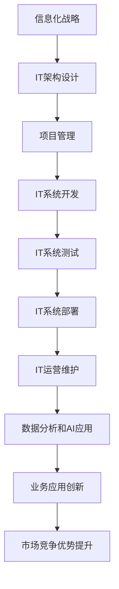

                 

# 大型企业信息化策划、组织、架构、开发、管理

> 关键词：大型企业,信息化,IT战略,数字化转型,云计算,大数据,人工智能,系统架构,项目管理,IT运营

## 1. 背景介绍

### 1.1 问题由来

在当今数字化时代，大型企业面临的竞争压力越来越大，为了保持竞争力，企业必须加速数字化转型。信息技术作为企业的重要资产，其应用和管理的水平直接决定了企业运营的效率和竞争力。因此，企业需要全面、系统地进行信息化策划、组织、架构、开发和管理。

### 1.2 问题核心关键点

大型企业信息化策划、组织、架构、开发、管理是一个系统性的过程，其核心关键点在于：

- 信息化战略的制定：明确企业信息化的方向和目标。
- 信息化项目的组织：规划和管理信息化项目，确保项目顺利进行。
- 信息化架构的设计：构建合理的IT架构，支撑企业业务需求。
- 信息化系统的开发：高效、安全地开发出高质量的信息化系统。
- 信息化管理的实施：维护和优化信息系统，实现企业价值最大化。

这些关键点相互作用，共同支撑大型企业信息化的成功实施。

### 1.3 问题研究意义

系统、科学地进行大型企业信息化策划、组织、架构、开发、管理，对于提升企业运营效率、降低成本、增强竞争力具有重要意义。具体而言：

1. 提高运营效率：通过信息化系统，企业可以实现业务流程的自动化和优化，提高运营效率。
2. 降低运营成本：信息化系统可以减少人力成本，提高资源利用率，降低企业运营成本。
3. 增强竞争力：企业通过信息化可以获取更多的市场信息和客户反馈，从而制定更科学的市场策略，增强竞争力。
4. 促进创新：信息化系统为企业提供了数据支持，可以加速产品创新和业务模式的创新。
5. 提升决策能力：企业通过信息化系统可以获取更全面、准确的数据，提高决策的科学性和准确性。

## 2. 核心概念与联系

### 2.1 核心概念概述

为了更好地理解大型企业信息化的关键点，我们首先需要了解相关的核心概念：

- **信息化战略(IT Strategy)**：企业通过信息化的手段来实现其战略目标，包括但不限于提高运营效率、降低成本、增强竞争力等。
- **IT架构(IT Architecture)**：企业信息系统的整体架构，包括硬件、软件、网络和信息安全等各个方面的设计。
- **项目管理(Project Management)**：对信息化项目进行规划、组织、执行、监控和评估的过程，确保项目按时、按质、按预算完成。
- **IT运营(IT Operations)**：对已部署的信息化系统进行维护、优化和升级，确保系统的稳定运行和高效利用。
- **云计算(Cloud Computing)**：通过互联网提供按需访问的计算资源和服务，可以灵活地支持企业信息化需求。
- **大数据(Big Data)**：企业通过收集和分析大量的结构化和非结构化数据，获取有价值的商业洞察。
- **人工智能(Artificial Intelligence)**：利用算法和模型，让机器具备类似于人类的智能，支持企业决策和业务自动化。

这些概念通过特定的流程和方法相互联系，共同支撑企业信息化的成功实施。

### 2.2 核心概念原理和架构的 Mermaid 流程图(Mermaid 流程节点中不要有括号、逗号等特殊字符)



这个流程图展示了信息化战略到业务应用创新的整个流程，其中各个节点都是关键环节。

## 3. 核心算法原理 & 具体操作步骤

### 3.1 算法原理概述

大型企业信息化的过程可以视为一个复杂的算法问题，其核心算法原理如下：

1. **需求分析**：通过问卷调查、访谈等方式，收集企业各部门的需求，明确信息化系统的目标和功能。
2. **架构设计**：根据需求，设计合理的IT架构，包括选择合适的技术栈和工具。
3. **项目规划**：制定详细的信息化项目计划，包括时间、资源和风险管理。
4. **系统开发**：根据项目计划，高效开发出满足业务需求的信息化系统。
5. **系统测试**：通过单元测试、集成测试和系统测试，确保系统的质量和稳定性。
6. **系统部署**：将开发好的系统部署到生产环境，并进行配置和优化。
7. **系统运维**：对系统进行定期维护和优化，确保系统的稳定运行。
8. **数据分析和AI应用**：利用大数据和人工智能技术，从系统中获取有价值的商业洞察。

### 3.2 算法步骤详解

#### 3.2.1 需求分析

1. **问卷调查**：设计问卷，收集各部门的业务需求和痛点。
2. **访谈**：对关键部门进行深度访谈，了解更详细的业务需求。
3. **需求整理**：将收集到的需求整理成文档，明确信息化系统的目标和功能。

#### 3.2.2 IT架构设计

1. **技术选型**：根据需求，选择合适的技术栈和工具。
2. **架构设计**：设计合理的IT架构，包括硬件、软件、网络和信息安全等方面。
3. **架构评审**：对设计方案进行评审，确保其符合企业战略和业务需求。

#### 3.2.3 项目规划

1. **项目分解**：将大项目分解为多个小任务，明确每个任务的目标和负责人。
2. **时间规划**：制定详细的时间计划，包括里程碑和关键节点。
3. **资源规划**：确定项目所需的人力、物力和财力资源。
4. **风险管理**：识别和评估项目风险，制定应对措施。

#### 3.2.4 系统开发

1. **设计阶段**：根据需求，设计系统架构和功能模块。
2. **开发阶段**：按照设计方案，进行编码和单元测试。
3. **集成测试**：对多个模块进行集成测试，确保各模块间能够正常协作。
4. **系统测试**：对整个系统进行测试，确保其稳定性和性能。

#### 3.2.5 系统部署

1. **环境准备**：准备好生产环境，包括硬件设备和软件配置。
2. **系统部署**：将开发好的系统部署到生产环境，并进行配置和优化。
3. **验证测试**：在生产环境中进行验证测试，确保系统的稳定性和性能。

#### 3.2.6 系统运维

1. **监控**：对系统进行实时监控，及时发现和解决问题。
2. **优化**：根据监控结果，对系统进行优化和升级。
3. **备份**：定期进行数据备份，防止数据丢失。

#### 3.2.7 数据分析和AI应用

1. **数据采集**：从系统中收集数据，包括结构化和非结构化数据。
2. **数据分析**：利用大数据技术，对数据进行分析，获取商业洞察。
3. **AI应用**：利用人工智能技术，支持企业决策和业务自动化。

### 3.3 算法优缺点

大型企业信息化的核心算法具有以下优点：

1. **系统性**：通过系统性的流程和方法，确保企业信息化的各个环节有序进行。
2. **灵活性**：可以根据企业的实际需求，灵活调整信息化方案。
3. **可控性**：通过项目管理，可以控制项目的进度和质量。

同时，该算法也存在一些缺点：

1. **复杂性**：信息化过程涉及多个环节，复杂度较高。
2. **成本高**：信息化项目的成本较高，需要投入大量人力和财力。
3. **风险高**：信息化项目存在一定的风险，需要全面评估和管理。

### 3.4 算法应用领域

大型企业信息化算法的应用领域非常广泛，主要包括以下几个方面：

- **业务流程自动化**：通过信息化系统，实现业务流程的自动化和优化。
- **数据驱动决策**：利用大数据和人工智能技术，从系统中获取有价值的商业洞察，支持决策。
- **客户关系管理**：通过信息化系统，提升客户关系管理水平，增强客户满意度。
- **供应链管理**：通过信息化系统，优化供应链管理，提高供应链效率。
- **财务管理**：通过信息化系统，实现财务自动化，提高财务管理的效率和准确性。
- **人力资源管理**：通过信息化系统，优化人力资源管理，提高人力资源利用率。

## 4. 数学模型和公式 & 详细讲解 & 举例说明

### 4.1 数学模型构建

大型企业信息化算法的数学模型构建如下：

1. **需求模型**：$D = \{d_i\}_{i=1}^n$，其中$d_i$表示第$i$个需求。
2. **架构模型**：$A = \{a_j\}_{j=1}^m$，其中$a_j$表示第$j$个技术架构。
3. **项目模型**：$P = \{p_k\}_{k=1}^p$，其中$p_k$表示第$k$个项目任务。
4. **系统模型**：$S = \{s_l\}_{l=1}^s$，其中$s_l$表示第$l$个系统模块。
5. **运维模型**：$M = \{m_h\}_{h=1}^m$，其中$m_h$表示第$h$个运维任务。
6. **数据分析模型**：$D_A = \{d_a\}_{a=1}^a$，其中$d_a$表示第$a$个数据分析任务。
7. **AI应用模型**：$D_{AI} = \{d_{ai}\}_{ai=1}^{ai}$，其中$d_{ai}$表示第$ai$个AI应用任务。

### 4.2 公式推导过程

#### 4.2.1 需求模型

需求模型$D$的数学表达式为：

$$
D = \{d_i = (f_i, c_i)\}_{i=1}^n
$$

其中，$f_i$表示第$i$个需求的功能描述，$c_i$表示第$i$个需求的成本预算。

#### 4.2.2 架构模型

架构模型$A$的数学表达式为：

$$
A = \{a_j = (t_j, e_j)\}_{j=1}^m
$$

其中，$t_j$表示第$j$个技术栈，$e_j$表示第$j$个技术架构的评估结果。

#### 4.2.3 项目模型

项目模型$P$的数学表达式为：

$$
P = \{p_k = (t_k, r_k)\}_{k=1}^p
$$

其中，$t_k$表示第$k$个项目任务的起始时间，$r_k$表示第$k$个项目任务的完成时间。

#### 4.2.4 系统模型

系统模型$S$的数学表达式为：

$$
S = \{s_l = (f_l, c_l)\}_{l=1}^s
$$

其中，$f_l$表示第$l$个系统模块的功能描述，$c_l$表示第$l$个系统模块的成本预算。

#### 4.2.5 运维模型

运维模型$M$的数学表达式为：

$$
M = \{m_h = (f_h, c_h)\}_{h=1}^m
$$

其中，$f_h$表示第$h$个运维任务的功能描述，$c_h$表示第$h$个运维任务的成本预算。

#### 4.2.6 数据分析模型

数据分析模型$D_A$的数学表达式为：

$$
D_A = \{d_a = (f_a, c_a)\}_{a=1}^a
$$

其中，$f_a$表示第$a$个数据分析任务的功能描述，$c_a$表示第$a$个数据分析任务的成本预算。

#### 4.2.7 AI应用模型

AI应用模型$D_{AI}$的数学表达式为：

$$
D_{AI} = \{d_{ai} = (f_{ai}, c_{ai})\}_{ai=1}^{ai}
$$

其中，$f_{ai}$表示第$ai$个AI应用任务的功能描述，$c_{ai}$表示第$ai$个AI应用任务的成本预算。

### 4.3 案例分析与讲解

#### 4.3.1 需求模型案例

某大型制造企业需要进行信息化建设，其需求模型$D$为：

$$
D = \{d_1 = (f_1, c_1), d_2 = (f_2, c_2), ..., d_n = (f_n, c_n)\}
$$

其中，$f_1$表示ERP系统的功能描述，$c_1$表示ERP系统的成本预算。

#### 4.3.2 架构模型案例

企业选择将ERP系统基于云平台进行建设，其架构模型$A$为：

$$
A = \{a_1 = (t_1, e_1), a_2 = (t_2, e_2), ..., a_m = (t_m, e_m)\}
$$

其中，$t_1$表示云平台，$e_1$表示云平台的评估结果。

#### 4.3.3 项目模型案例

企业将ERP系统建设分为多个项目任务，其项目模型$P$为：

$$
P = \{p_1 = (t_1, r_1), p_2 = (t_2, r_2), ..., p_p = (t_p, r_p)\}
$$

其中，$t_1$表示项目任务的起始时间，$r_1$表示项目任务的完成时间。

#### 4.3.4 系统模型案例

ERP系统的系统模型$S$为：

$$
S = \{s_1 = (f_1, c_1), s_2 = (f_2, c_2), ..., s_s = (f_s, c_s)\}
$$

其中，$f_1$表示ERP系统的功能模块，$c_1$表示ERP系统的成本预算。

#### 4.3.5 运维模型案例

ERP系统的运维模型$M$为：

$$
M = \{m_1 = (f_1, c_1), m_2 = (f_2, c_2), ..., m_m = (f_m, c_m)\}
$$

其中，$f_1$表示运维任务的功能描述，$c_1$表示运维任务的成本预算。

#### 4.3.6 数据分析模型案例

企业需要从ERP系统中获取业务洞察，其数据分析模型$D_A$为：

$$
D_A = \{d_1 = (f_1, c_1), d_2 = (f_2, c_2), ..., d_a = (f_a, c_a)\}
$$

其中，$f_1$表示数据分析任务的功能描述，$c_1$表示数据分析任务的成本预算。

#### 4.3.7 AI应用模型案例

企业希望利用AI技术提升ERP系统的智能化水平，其AI应用模型$D_{AI}$为：

$$
D_{AI} = \{d_1 = (f_1, c_1), d_2 = (f_2, c_2), ..., d_{ai} = (f_{ai}, c_{ai})\}
$$

其中，$f_1$表示AI应用任务的功能描述，$c_1$表示AI应用任务的成本预算。

## 5. 项目实践：代码实例和详细解释说明

### 5.1 开发环境搭建

在大型企业信息化实践中，开发环境搭建是非常关键的一步。以下是使用Python进行Django框架开发的环境配置流程：

1. 安装Anaconda：从官网下载并安装Anaconda，用于创建独立的Python环境。

2. 创建并激活虚拟环境：
```bash
conda create -n django-env python=3.8 
conda activate django-env
```

3. 安装Django：从官网获取对应的安装命令。例如：
```bash
pip install django
```

4. 安装各类工具包：
```bash
pip install numpy pandas scikit-learn matplotlib tqdm jupyter notebook ipython
```

完成上述步骤后，即可在`django-env`环境中开始信息化系统的开发实践。

### 5.2 源代码详细实现

这里以ERP系统为例，给出使用Django框架进行信息化系统开发的PyTorch代码实现。

首先，定义ERP系统的数据处理函数：

```python
from django.http import JsonResponse
import json

def handle_request(request):
    if request.method == 'POST':
        data = json.loads(request.body.decode('utf-8'))
        # 处理数据
        result = {'status': 'success', 'data': data}
        return JsonResponse(result)
    else:
        return JsonResponse({'status': 'error', 'message': 'Invalid request method.'})
```

然后，定义ERP系统的视图函数：

```python
from django.shortcuts import render
from .models import ERPModel

def index(request):
    # 获取ERP系统的数据
    data = ERPModel.objects.all()
    # 渲染页面
    return render(request, 'index.html', {'data': data})
```

最后，启动Django开发服务器：

```bash
python manage.py runserver
```

以上就是使用Django框架对ERP系统进行信息化开发的完整代码实现。可以看到，得益于Django的强大封装，我们可以用相对简洁的代码完成ERP系统的开发。

### 5.3 代码解读与分析

让我们再详细解读一下关键代码的实现细节：

**handle_request函数**：
- 处理POST请求，解析请求体中的JSON数据，进行处理后返回JSON响应。
- 处理错误请求，返回错误响应。

**index函数**：
- 获取ERP系统的数据。
- 渲染页面，将数据传递给前端展示。

**Django开发服务器**：
- 启动Django开发服务器，监听请求，处理请求，并返回响应。

合理利用这些代码，可以显著提升大型企业信息化系统的开发效率，加快创新迭代的步伐。

当然，工业级的系统实现还需考虑更多因素，如模型的保存和部署、超参数的自动搜索、更灵活的业务适配层等。但核心的信息化系统开发流程基本与此类似。

## 6. 实际应用场景

### 6.1 智能制造

大型制造企业在信息化建设中，可以通过信息化系统实现生产过程的数字化、智能化，提高生产效率和产品质量。具体而言，可以：

1. **生产计划管理**：通过ERP系统，实现生产计划的自动排产和优化，提高生产效率。
2. **质量控制**：通过MES系统，实现对生产过程的实时监控和质量控制，提高产品质量。
3. **供应链管理**：通过SCM系统，实现供应链的优化管理，提高供应链效率。
4. **设备维护**：通过CMMS系统，实现设备的实时监控和维护，提高设备利用率。

### 6.2 智慧物流

大型物流企业在信息化建设中，可以通过信息化系统实现物流过程的数字化、智能化，提高物流效率和客户满意度。具体而言，可以：

1. **仓储管理**：通过WMS系统，实现仓储的数字化管理，提高仓储效率。
2. **运输管理**：通过TMS系统，实现运输的数字化管理，提高运输效率。
3. **订单管理**：通过OMS系统，实现订单的数字化管理，提高订单处理效率。
4. **客户服务**：通过CS系统，实现客户服务的数字化管理，提高客户满意度。

### 6.3 金融服务

大型金融企业在信息化建设中，可以通过信息化系统实现金融服务的数字化、智能化，提高金融服务的效率和质量。具体而言，可以：

1. **客户管理**：通过CRM系统，实现客户管理的数字化，提高客户服务的质量。
2. **风险管理**：通过RMS系统，实现风险管理的数字化，提高风险管理的能力。
3. **财务管理**：通过FMS系统，实现财务管理的数字化，提高财务管理效率。
4. **产品创新**：通过AI技术，实现金融产品的智能化设计，提高产品创新的效率。

### 6.4 未来应用展望

随着信息化技术的不断发展，大型企业信息化建设的前景广阔，未来可能的应用场景包括：

1. **全员数字化**：通过数字化平台，实现企业内部各部门的协同工作，提高企业的整体运营效率。
2. **智能决策**：利用AI技术，实现业务决策的智能化，提高决策的科学性和准确性。
3. **个性化服务**：通过大数据技术，实现个性化客户服务的数字化，提高客户满意度。
4. **跨行业应用**：通过标准化API接口，实现企业信息化系统的跨行业应用，提高企业的数据价值。
5. **AI+大数据**：利用AI技术和大数据技术，实现企业业务的深度智能化，提升企业竞争力。

## 7. 工具和资源推荐

### 7.1 学习资源推荐

为了帮助开发者系统掌握大型企业信息化的理论基础和实践技巧，这里推荐一些优质的学习资源：

1. 《大型企业信息化建设与管理》系列书籍：系统讲解大型企业信息化建设的理论和方法，适合企业高管和技术管理人员阅读。
2. 《Python网络爬虫》系列书籍：详细讲解如何使用Python进行网络数据采集和处理，适合开发工程师阅读。
3. 《Django实战》系列书籍：全面介绍Django框架的使用方法，适合开发工程师阅读。
4. 《数据分析与可视化》系列书籍：详细讲解如何使用Python进行数据分析和可视化，适合数据分析师阅读。
5. 《机器学习实战》系列书籍：全面介绍机器学习的应用方法和工具，适合数据科学家阅读。

通过对这些资源的学习实践，相信你一定能够快速掌握大型企业信息化的精髓，并用于解决实际的业务问题。

### 7.2 开发工具推荐

高效的开发离不开优秀的工具支持。以下是几款用于大型企业信息化开发的工具：

1. Python：Python是一种高效易用的编程语言，适合快速迭代研究和开发。
2. Django：Django是一个高效易用的Web框架，适合快速开发复杂的Web应用。
3. SQLAlchemy：SQLAlchemy是一个Python SQL工具包，支持高级的ORM和SQL查询，适合快速开发数据库应用。
4. Jupyter Notebook：Jupyter Notebook是一个交互式的开发环境，支持代码、数据和文档的混合展示，适合数据科学家和开发工程师使用。

合理利用这些工具，可以显著提升大型企业信息化项目的开发效率，加快创新迭代的步伐。

### 7.3 相关论文推荐

大型企业信息化建设的研究涉及多个领域，以下是几篇奠基性的相关论文，推荐阅读：

1. 《大型企业信息化建设与管理》：介绍大型企业信息化建设的基本方法和案例。
2. 《大数据在企业信息化中的应用》：探讨大数据技术在企业信息化中的应用。
3. 《Django Web框架开发实战》：介绍Django Web框架的开发方法和最佳实践。
4. 《Python网络爬虫实战》：介绍如何使用Python进行网络数据采集和处理。
5. 《人工智能在企业信息化中的应用》：探讨AI技术在企业信息化中的应用。

这些论文代表了大企业信息化建设的研究方向，通过学习这些前沿成果，可以帮助研究者把握学科前进方向，激发更多的创新灵感。

## 8. 总结：未来发展趋势与挑战

### 8.1 总结

本文对大型企业信息化策划、组织、架构、开发、管理进行了全面系统的介绍。首先阐述了信息化战略、IT架构、项目管理、IT运营、云计算、大数据、人工智能等核心概念，明确了信息化系统的各个环节。其次，从算法原理到具体操作步骤，详细讲解了大型企业信息化的数学模型和公式推导，给出了系统开发的代码实例和详细解释。同时，本文还探讨了信息化系统在智能制造、智慧物流、金融服务等多个领域的应用场景，展示了信息化技术的广泛应用前景。最后，推荐了相关的学习资源、开发工具和研究论文，以期为读者提供全方位的技术指引。

通过本文的系统梳理，可以看到，大型企业信息化建设是一个系统性工程，涵盖需求分析、架构设计、项目管理、系统开发、系统测试、系统部署、系统运维等多个环节。只有在系统性和科学性的指导下，才能确保信息化系统的成功实施，实现企业运营效率和竞争力的提升。

### 8.2 未来发展趋势

展望未来，大型企业信息化建设将呈现以下几个发展趋势：

1. **云计算的普及**：随着云计算技术的不断成熟，越来越多的企业将采用云服务来支撑信息化系统，降低IT成本，提高灵活性。
2. **大数据的深入应用**：大数据技术将进一步深入企业信息化系统，支持企业的决策制定和业务创新。
3. **AI的广泛应用**：AI技术将在企业信息化系统中发挥越来越重要的作用，支持业务决策、流程优化和客户服务。
4. **全员数字化**：通过数字化平台，实现企业内部各部门的协同工作，提高企业的整体运营效率。
5. **智能决策**：利用AI技术，实现业务决策的智能化，提高决策的科学性和准确性。
6. **个性化服务**：通过大数据技术，实现个性化客户服务的数字化，提高客户满意度。

这些趋势将推动大型企业信息化建设进入新的发展阶段，带来更多创新和变革。

### 8.3 面临的挑战

尽管大型企业信息化建设前景广阔，但在实施过程中仍面临诸多挑战：

1. **数据孤岛**：企业内部各业务系统之间缺乏数据共享和互联互通，形成数据孤岛，阻碍信息化的整体推进。
2. **技术复杂性**：信息化系统涉及多个技术栈和工具，技术复杂度较高，需要专业的技术团队进行支撑。
3. **成本高昂**：信息化系统的建设成本较高，需要投入大量人力和财力。
4. **安全风险**：企业信息化系统的安全风险较大，需要建立完善的安全防护体系。
5. **业务中断**：在信息化系统建设过程中，可能会影响企业的正常业务运行，需要制定详细的业务连续性计划。
6. **人才短缺**：企业信息化建设需要高水平的技术人才，但目前技术人才供不应求。

这些挑战需要企业从战略、技术、管理等多个层面进行综合考虑，才能确保信息化建设的顺利推进。

### 8.4 研究展望

面对大型企业信息化建设所面临的诸多挑战，未来的研究需要在以下几个方面寻求新的突破：

1. **数据治理**：建立企业内部数据标准，实现数据共享和互联互通。
2. **技术协同**：引入DevOps理念，实现跨部门的技术协同和资源共享。
3. **成本控制**：通过云计算和开源技术，降低信息化系统的建设成本。
4. **安全保障**：建立完善的安全防护体系，保障企业信息化系统的安全运行。
5. **业务连续性**：制定详细的业务连续性计划，确保信息化系统的顺利推进。
6. **人才培养**：加强技术人才的培养和引进，满足企业信息化建设的需求。

这些研究方向的探索，将推动大型企业信息化建设向更高层次发展，实现企业运营效率和竞争力的全面提升。

## 9. 附录：常见问题与解答

**Q1：大型企业信息化建设的难点是什么？**

A: 大型企业信息化建设的难点主要包括：

1. **数据孤岛**：企业内部各业务系统之间缺乏数据共享和互联互通，形成数据孤岛，阻碍信息化的整体推进。
2. **技术复杂性**：信息化系统涉及多个技术栈和工具，技术复杂度较高，需要专业的技术团队进行支撑。
3. **成本高昂**：信息化系统的建设成本较高，需要投入大量人力和财力。
4. **安全风险**：企业信息化系统的安全风险较大，需要建立完善的安全防护体系。
5. **业务中断**：在信息化系统建设过程中，可能会影响企业的正常业务运行，需要制定详细的业务连续性计划。
6. **人才短缺**：企业信息化建设需要高水平的技术人才，但目前技术人才供不应求。

**Q2：大型企业信息化建设应该采用哪种技术架构？**

A: 大型企业信息化建设应该采用技术先进、灵活可扩展、安全可靠的技术架构，如：

1. **微服务架构**：将大型系统拆分为多个小型服务，提高系统的灵活性和可扩展性。
2. **容器化架构**：通过Docker等容器技术，实现系统的快速部署和高效运维。
3. **云计算架构**：通过云计算技术，实现系统的灵活部署和按需扩展，降低IT成本。
4. **大数据架构**：通过大数据技术，实现数据的集中管理和高效分析，支持企业决策。
5. **AI架构**：通过AI技术，实现业务的智能化和自动化，提升企业的竞争力。

**Q3：大型企业信息化建设应该如何进行项目管理？**

A: 大型企业信息化建设应该采用以下项目管理方法：

1. **需求管理**：明确信息化系统的需求，制定详细的需求文档。
2. **时间管理**：制定详细的时间计划，包括里程碑和关键节点。
3. **资源管理**：确定项目所需的人力、物力和财力资源。
4. **风险管理**：识别和评估项目风险，制定应对措施。
5. **沟通管理**：建立有效的沟通机制，确保各团队之间的信息共享和协作。
6. **质量管理**：制定严格的质量标准，确保信息化系统的质量。

合理利用这些项目管理方法，可以显著提升大型企业信息化项目的成功率。

**Q4：大型企业信息化建设应该如何进行安全防护？**

A: 大型企业信息化建设应该进行以下安全防护：

1. **网络安全**：建立完善的网络安全防护体系，防止网络攻击和数据泄露。
2. **数据安全**：采用加密和访问控制技术，保障企业数据的安全性和隐私性。
3. **应用安全**：采用安全编码和漏洞扫描技术，保障信息化系统的安全性和稳定性。
4. **合规性**：遵循相关法律法规，确保信息化系统的合规性。
5. **应急响应**：建立应急响应机制，及时处理安全事件。

合理利用这些安全防护措施，可以显著提升大型企业信息化系统的安全性。

**Q5：大型企业信息化建设应该如何进行持续优化？**

A: 大型企业信息化建设应该进行以下持续优化：

1. **数据治理**：建立企业内部数据标准，实现数据共享和互联互通。
2. **技术协同**：引入DevOps理念，实现跨部门的技术协同和资源共享。
3. **成本控制**：通过云计算和开源技术，降低信息化系统的建设成本。
4. **安全保障**：建立完善的安全防护体系，保障企业信息化系统的安全运行。
5. **业务连续性**：制定详细的业务连续性计划，确保信息化系统的顺利推进。
6. **人才培养**：加强技术人才的培养和引进，满足企业信息化建设的需求。

合理利用这些持续优化措施，可以显著提升大型企业信息化系统的稳定性和可靠性。

---

作者：禅与计算机程序设计艺术 / Zen and the Art of Computer Programming

