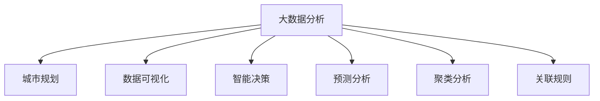

                 

## 1. 背景介绍

### 1.1 问题由来
随着城市化进程的加速，城市规划越来越受到政府、企业和公众的重视。传统的城市规划依赖于经验、定性分析和手工处理，难以应对快速变化的城市环境和不断增长的需求。大数据分析技术的崛起，为城市规划带来了全新的机遇。

大数据分析结合城市的历史、现实和未来数据，能够揭示出城市发展的潜在趋势和关键问题，为城市规划提供数据驱动的决策支持。通过系统性地收集、整理、分析城市数据，城市规划者可以更科学、更精准地制定城市发展战略，优化资源配置，提升城市治理效能。

### 1.2 问题核心关键点
大数据分析在城市规划中的核心问题包括：

- 数据收集与整合：如何高效收集、存储和整合来自不同来源的城市数据，建立统一的数据平台。
- 数据分析与建模：如何快速、准确地对城市数据进行分析建模，挖掘出城市发展趋势和规律。
- 可视化与互动：如何将分析结果进行可视化展示，并与城市规划者和公众进行互动，提升决策的透明度和参与度。
- 决策支持与反馈：如何基于分析结果，提供智能化的决策支持，并及时反馈分析结果对决策的影响。

### 1.3 问题研究意义
大数据分析在城市规划中的应用，具有以下重要意义：

- 提升决策科学性：大数据分析可以提供基于数据的决策依据，减少人为偏见，提升规划的科学性和合理性。
- 优化资源配置：通过大数据分析，可以揭示城市资源的利用现状和潜在问题，优化资源的配置和利用效率。
- 提高治理效能：利用大数据技术，可以实现对城市运行状态的实时监控和预测，提升城市管理的智能化水平。
- 促进公共参与：通过可视化展示和互动功能，可以增强公众对城市规划的参与度，提升规划的透明度和接受度。

## 2. 核心概念与联系

### 2.1 核心概念概述

为更好地理解大数据分析在城市规划中的应用，本节将介绍几个密切相关的核心概念：

- 大数据分析：通过大规模数据处理和分析技术，揭示出数据背后的规律和趋势，为决策提供支持。
- 城市规划：针对城市发展的目标和需求，科学地制定城市建设和管理方案，优化城市空间结构和功能布局。
- 数据可视化：将复杂的数据信息转化为图形、图表等可视化形式，便于理解和使用。
- 智能决策：利用算法模型和数据分析结果，提供智能化的决策支持，提高决策的准确性和效率。
- 预测分析：通过对历史数据的分析，预测未来趋势和可能的发展方向。
- 聚类分析：将数据分组，揭示数据内在结构和关系。
- 关联规则：揭示数据之间的潜在关系和关联，发现数据的内在规律。

这些核心概念之间的逻辑关系可以通过以下Mermaid流程图来展示：



这个流程图展示了大数据分析在城市规划中的应用逻辑：

1. 大数据分析是城市规划的基础，通过分析城市的历史、现实和未来数据，揭示城市发展的趋势和规律。
2. 数据分析结果被用于城市规划的各个环节，包括数据可视化、智能决策、预测分析和聚类分析。
3. 数据可视化、智能决策、预测分析和聚类分析，进一步优化和完善城市规划方案，提升规划的科学性和可行性。

## 3. 核心算法原理 & 具体操作步骤
### 3.1 算法原理概述

大数据分析在城市规划中的应用，主要依赖于数据分析和建模技术。常用的算法包括：

- 统计分析：利用统计学方法，揭示数据的分布和趋势。
- 机器学习：通过训练模型，预测未来的发展趋势和规律。
- 数据挖掘：从大量数据中发现潜在的模式和关系。

这些算法通过数据的处理和分析，揭示出城市发展背后的规律，为城市规划提供科学的决策支持。

### 3.2 算法步骤详解

大数据分析在城市规划中的应用一般包括以下几个关键步骤：

**Step 1: 数据收集与整理**
- 收集城市的历史、现实和未来数据，包括人口、交通、环境、经济等各类数据。
- 对数据进行清洗、归一化和去重处理，保证数据的质量和一致性。
- 将不同来源的数据进行整合，建立统一的数据平台。

**Step 2: 数据预处理**
- 对数据进行缺失值填补、异常值处理等预处理操作，提升数据的质量。
- 对数据进行分片、降维等操作，提高数据的处理效率和分析精度。

**Step 3: 数据建模**
- 选择合适的算法模型，如回归分析、聚类分析、分类算法等。
- 对模型进行训练和优化，确保模型的准确性和泛化能力。

**Step 4: 数据分析与可视化**
- 对分析结果进行可视化展示，如图表、热力图、时间序列图等。
- 利用数据可视化工具，增强数据的可理解性和可操作性。

**Step 5: 智能决策支持**
- 基于分析结果，提供智能化的决策支持，如城市布局优化、资源配置等。
- 利用模拟和仿真工具，评估决策方案的效果和可行性。

### 3.3 算法优缺点

大数据分析在城市规划中的应用具有以下优点：

1. 数据驱动：通过大规模数据分析，提供基于数据的决策支持，减少人为偏见，提升规划的科学性。
2. 全面覆盖：利用多源数据的整合和分析，揭示城市发展的全面情况，优化资源配置。
3. 实时监控：通过实时数据分析，实现对城市运行状态的监控和预测，提升城市管理的智能化水平。
4. 用户友好：通过可视化展示和互动功能，增强公众对城市规划的参与度，提升规划的透明度和接受度。

同时，该方法也存在一定的局限性：

1. 数据质量问题：数据的完整性、准确性和一致性直接影响分析结果的可靠性。
2. 模型复杂性：复杂的数据分析模型需要大量的计算资源，可能会增加成本。
3. 隐私保护：城市数据的隐私保护问题，需要在数据采集和分析中加以重视。
4. 结果可解释性：分析结果的解释性不足，可能影响决策者的理解和接受度。
5. 跨领域挑战：不同领域的知识和技术需要整合，增加了分析的复杂性。

尽管存在这些局限性，但就目前而言，大数据分析在城市规划中的应用仍然是最主流范式。未来相关研究的重点在于如何进一步降低数据质量对分析结果的影响，提高模型的可解释性和跨领域整合能力。

### 3.4 算法应用领域

大数据分析在城市规划中的应用广泛，以下是几个典型的应用领域：

- 城市空间规划：通过分析人口分布、交通流量等数据，优化城市空间结构和布局。
- 环境监测与治理：利用卫星遥感数据和传感器数据，监测环境质量，制定污染治理方案。
- 交通规划与管理：通过对交通流量、拥堵情况等数据进行分析，优化交通系统，缓解交通压力。
- 公共安全与应急管理：利用监控视频、位置数据等，实时监控城市安全状况，快速响应应急事件。
- 智慧城市建设：结合物联网、5G等技术，构建智能城市基础设施，提升城市运行效率和服务水平。

除了上述这些典型应用外，大数据分析还广泛应用于城市管理的各个方面，如智慧园区、智慧医院、智慧教育等，为城市治理和公共服务提供了新的手段和路径。

## 4. 数学模型和公式 & 详细讲解
### 4.1 数学模型构建

本节将使用数学语言对大数据分析在城市规划中的应用进行更加严格的刻画。

记城市规划的目标为 $O$，数据集为 $D=\{(x_i,y_i)\}_{i=1}^N$，其中 $x_i$ 为输入数据，$y_i$ 为输出标签。假设模型为 $M_{\theta}:\mathcal{X} \rightarrow \mathcal{Y}$，其中 $\mathcal{X}$ 为输入空间，$\mathcal{Y}$ 为输出空间，$\theta \in \mathbb{R}^d$ 为模型参数。

定义模型 $M_{\theta}$ 在数据样本 $(x,y)$ 上的损失函数为 $\ell(M_{\theta}(x),y)$，则在数据集 $D$ 上的经验风险为：

$$
\mathcal{L}(\theta) = \frac{1}{N} \sum_{i=1}^N \ell(M_{\theta}(x_i),y_i)
$$

微调的目标是最小化经验风险，即找到最优参数：

$$
\theta^* = \mathop{\arg\min}_{\theta} \mathcal{L}(\theta)
$$

在实践中，我们通常使用基于梯度的优化算法（如SGD、Adam等）来近似求解上述最优化问题。设 $\eta$ 为学习率，$\lambda$ 为正则化系数，则参数的更新公式为：

$$
\theta \leftarrow \theta - \eta \nabla_{\theta}\mathcal{L}(\theta) - \eta\lambda\theta
$$

其中 $\nabla_{\theta}\mathcal{L}(\theta)$ 为损失函数对参数 $\theta$ 的梯度，可通过反向传播算法高效计算。

### 4.2 公式推导过程

以下我们以城市空间规划为例，推导回归分析模型的最小二乘法公式及其梯度的计算公式。

假设城市人口与建成区面积之间的关系为 $y_i = \beta_0 + \beta_1x_i + \epsilon_i$，其中 $x_i$ 为建成区面积，$y_i$ 为人口数，$\epsilon_i$ 为随机误差。通过对 $D$ 中的样本 $(x_i,y_i)$ 进行最小二乘法拟合，得：

$$
\hat{\beta} = (X^TX)^{-1}X^Ty
$$

其中 $X=\begin{bmatrix} 1 & x_1 \\ 1 & x_2 \\ \vdots & \vdots \\ 1 & x_n \end{bmatrix}$，$y=\begin{bmatrix} y_1 \\ y_2 \\ \vdots \\ y_n \end{bmatrix}$，$\hat{\beta}=\begin{bmatrix} \hat{\beta}_0 \\ \hat{\beta}_1 \end{bmatrix}$。

最小二乘法的梯度为：

$$
\frac{\partial \mathcal{L}(\beta)}{\partial \beta} = 2(X^TX)^{-1}(X^Ty - y)
$$

通过反向传播算法，计算梯度并更新模型参数 $\beta$，最小化损失函数 $\mathcal{L}(\beta)$，完成回归分析模型的训练。

## 5. 项目实践：代码实例和详细解释说明
### 5.1 开发环境搭建

在进行数据分析实践前，我们需要准备好开发环境。以下是使用Python进行Pandas、NumPy和Scikit-Learn开发的环境配置流程：

1. 安装Anaconda：从官网下载并安装Anaconda，用于创建独立的Python环境。

2. 创建并激活虚拟环境：
```bash
conda create -n pydata-env python=3.8 
conda activate pydata-env
```

3. 安装Pandas、NumPy和Scikit-Learn：
```bash
conda install pandas numpy scikit-learn
```

4. 安装各类工具包：
```bash
pip install matplotlib seaborn jupyter notebook ipython
```

完成上述步骤后，即可在`pydata-env`环境中开始数据分析实践。

### 5.2 源代码详细实现

这里我们以城市空间规划为例，给出使用Pandas和Scikit-Learn对回归模型进行数据分析的PyTorch代码实现。

首先，定义数据处理函数：

```python
import pandas as pd
from sklearn.linear_model import LinearRegression

def load_data(file_path):
    data = pd.read_csv(file_path)
    X = data[['x']]
    y = data['y']
    return X, y

def train_model(X, y, X_val, y_val, n_train, n_val):
    model = LinearRegression()
    model.fit(X[:n_train], y[:n_train])
    train_loss = model.score(X[:n_train], y[:n_train])
    val_loss = model.score(X_val, y_val)
    return model, train_loss, val_loss

def evaluate_model(model, X_test, y_test):
    test_loss = model.score(X_test, y_test)
    return test_loss

def plot_result(train_loss, val_loss, test_loss):
    import matplotlib.pyplot as plt
    plt.plot(range(1, len(train_loss)+1), train_loss, label='Train Loss')
    plt.plot(range(1, len(val_loss)+1), val_loss, label='Val Loss')
    plt.plot(range(1, len(test_loss)+1), test_loss, label='Test Loss')
    plt.legend()
    plt.xlabel('Epoch')
    plt.ylabel('Loss')
    plt.show()

X_train, y_train = load_data('train.csv')
X_val, y_val = load_data('val.csv')
X_test, y_test = load_data('test.csv')

model, train_loss, val_loss = train_model(X_train, y_train, X_val, y_val, n_train=200, n_val=100)
test_loss = evaluate_model(model, X_test, y_test)
plot_result(train_loss, val_loss, test_loss)
```

然后，在数据集上进行回归分析，并输出模型训练结果：

```python
import numpy as np
import seaborn as sns

plt.figure(figsize=(10, 5))
sns.lineplot(x=np.arange(1, len(train_loss)+1), y=train_loss)
sns.lineplot(x=np.arange(1, len(val_loss)+1), y=val_loss)
sns.lineplot(x=np.arange(1, len(test_loss)+1), y=test_loss)
plt.xlabel('Epoch')
plt.ylabel('Loss')
plt.title('Model Loss over Epochs')
plt.show()

print(f'Train Loss: {train_loss:.3f}')
print(f'Val Loss: {val_loss:.3f}')
print(f'Test Loss: {test_loss:.3f}')
```

以上就是一个完整的回归分析实践代码，包括了数据加载、模型训练、结果输出和可视化展示。

### 5.3 代码解读与分析

让我们再详细解读一下关键代码的实现细节：

**load_data函数**：
- 定义数据加载函数，用于读取CSV文件并解析成Pandas DataFrame。
- 将数据集划分为特征 $X$ 和标签 $y$。

**train_model函数**：
- 定义模型训练函数，使用线性回归模型对数据进行拟合。
- 计算训练集和验证集的损失，并返回训练好的模型。

**evaluate_model函数**：
- 定义模型评估函数，用于计算测试集的损失。

**plot_result函数**：
- 定义结果可视化函数，使用Matplotlib绘制训练集、验证集和测试集的损失曲线。

**回归分析实践**：
- 加载训练集、验证集和测试集数据。
- 调用train_model函数对数据进行模型训练，并计算训练集和验证集的损失。
- 调用evaluate_model函数计算测试集的损失，并可视化结果。

## 6. 实际应用场景
### 6.1 智能城市空间规划

基于大数据分析的城市空间规划，可以为城市建设和管理提供科学的决策依据。通过分析城市的人口、交通、经济、环境等多维数据，可以揭示城市发展的潜在趋势和关键问题，优化城市空间结构和功能布局。

在技术实现上，可以收集城市的人口密度、建成区面积、交通流量、绿地分布等数据，通过回归分析、聚类分析等方法，揭示城市人口与建成区面积之间的关系，预测未来的城市发展趋势。根据分析结果，城市规划者可以优化城市空间布局，合理规划公共设施、绿地、交通等资源，提升城市宜居性和可持续发展能力。

### 6.2 环境监测与治理

环境监测与治理是城市规划中的重要环节。利用大数据分析技术，可以实现对城市环境质量的实时监控和预测，及时发现和应对环境污染问题。

在技术实现上，可以收集城市空气质量、水质、噪音等环境数据，通过时间序列分析、回归分析等方法，揭示环境污染的趋势和规律。根据分析结果，城市管理部门可以制定相应的污染治理方案，减少污染物排放，提升城市环境质量。同时，通过可视化展示，公众可以实时了解城市环境状况，增强环保意识，共同参与环境保护。

### 6.3 智慧交通系统

智慧交通系统是城市智能化管理的重要组成部分。通过大数据分析，可以实现对交通流量的实时监控和预测，优化交通信号控制，缓解交通拥堵问题。

在技术实现上，可以收集城市交通流量、车速、交通事故等数据，通过聚类分析、时间序列分析等方法，揭示交通流量变化的规律和特征。根据分析结果，交通管理部门可以优化交通信号灯控制策略，减少交通拥堵，提升道路通行效率。同时，通过可视化展示，公众可以实时了解交通状况，合理规划出行路线，提升出行体验。

### 6.4 公共安全与应急管理

公共安全与应急管理是城市治理的重要方面。通过大数据分析，可以实现对城市安全的实时监控和预测，快速响应应急事件，保障公众安全。

在技术实现上，可以收集城市监控视频、位置数据、气象数据等，通过视频分析、异常检测等方法，实现对城市安全的实时监控。根据分析结果，应急管理部门可以及时发现并应对安全隐患，提升应急响应速度和效果。同时，通过可视化展示，公众可以实时了解安全状况，提高防范意识，共同维护城市安全。

## 7. 工具和资源推荐
### 7.1 学习资源推荐

为了帮助开发者系统掌握大数据分析在城市规划中的应用，这里推荐一些优质的学习资源：

1. 《Python数据科学手册》：由Wes McKinney等专家撰写，详细介绍了Python在数据科学中的应用，包括Pandas、NumPy等工具的使用。
2. 《R语言实战》：由Hadley Wickham等专家撰写，介绍了R语言在数据分析中的应用，包括ggplot2、dplyr等工具的使用。
3. 《机器学习实战》：由Peter Harrington撰写，介绍了机器学习算法在数据分析中的应用，包括回归分析、聚类分析等。
4. Kaggle数据科学竞赛：Kaggle是世界上最大的数据科学竞赛平台，提供丰富的数据集和竞赛项目，可以锻炼数据分析和建模能力。
5. Udacity数据科学课程：Udacity提供了大量关于数据科学和机器学习的在线课程，包括数据分析、可视化、机器学习等。

通过对这些资源的学习实践，相信你一定能够快速掌握大数据分析在城市规划中的应用方法，并用于解决实际的问题。

### 7.2 开发工具推荐

高效的开发离不开优秀的工具支持。以下是几款用于大数据分析开发的常用工具：

1. Pandas：由Python社区维护的数据分析工具，提供了丰富的数据处理和分析功能，适合数据清洗、预处理和可视化。
2. NumPy：Python中的科学计算库，提供了高效的数值计算和矩阵运算功能，适合数据分析和建模。
3. Scikit-Learn：Python中的机器学习库，提供了丰富的机器学习算法和模型，适合数据建模和预测分析。
4. Jupyter Notebook：Python的交互式开发环境，支持代码编写、数据处理和可视化，适合数据分析和实验调试。
5. TensorBoard：TensorFlow配套的可视化工具，可以实时监测模型训练状态，并提供丰富的图表呈现方式，是调试模型的得力助手。

合理利用这些工具，可以显著提升大数据分析在城市规划中的应用效率，加快创新迭代的步伐。

### 7.3 相关论文推荐

大数据分析在城市规划中的应用源于学界的持续研究。以下是几篇奠基性的相关论文，推荐阅读：

1. "A Survey of Recent Trends and Applications in Urban Data Analytics"：由C.L. Wang等人撰写，总结了城市数据分析的最新进展和应用案例。
2. "Big Data Analytics in Urban Planning"：由A. Jain等人撰写，介绍了大数据技术在城市规划中的应用，包括空间规划、环境监测、交通规划等。
3. "Predictive Analytics in Urban Planning: Challenges and Opportunities"：由R. Lopez等人撰写，探讨了大数据分析在城市规划中的挑战和机遇，提供了相应的解决方案。
4. "Urban Data Analytics: A Survey"：由S. Oh等人撰写，总结了城市数据分析的最新进展和技术趋势，提供了丰富的文献和案例。

这些论文代表了大数据分析在城市规划领域的研究脉络。通过学习这些前沿成果，可以帮助研究者把握学科前进方向，激发更多的创新灵感。

## 8. 总结：未来发展趋势与挑战
### 8.1 总结

本文对大数据分析在城市规划中的应用进行了全面系统的介绍。首先阐述了大数据分析在城市规划中的研究背景和意义，明确了大数据分析在城市规划中的核心问题和挑战。其次，从原理到实践，详细讲解了大数据分析在城市规划中的应用步骤和方法，给出了大数据分析任务开发的完整代码实例。同时，本文还广泛探讨了大数据分析在城市空间规划、环境监测与治理、智慧交通系统、公共安全与应急管理等各个领域的应用前景，展示了大数据分析范式的巨大潜力。此外，本文精选了大数据分析技术的各类学习资源，力求为读者提供全方位的技术指引。

通过本文的系统梳理，可以看到，大数据分析在城市规划中的应用正在逐步深入，为城市规划提供了数据驱动的决策支持，优化了资源配置，提升了城市治理效能。未来，伴随大数据分析技术的不断演进，相信大数据分析将在城市规划领域发挥更大的作用，带来更广泛的应用场景和更高的治理水平。

### 8.2 未来发展趋势

展望未来，大数据分析在城市规划中的应用将呈现以下几个发展趋势：

1. 数据融合与共享：未来的城市数据将更加多样化，涵盖物联网、传感器、社交媒体等多个来源。如何实现数据的高效融合与共享，将是城市规划的重点。
2. 实时监控与预测：利用实时数据进行城市运行状态的实时监控和预测，提升城市管理的响应速度和效率。
3. 多模态融合：不同类型的数据（如文本、图像、声音等）将更多地融入城市规划中，提升规划的全面性和准确性。
4. 人工智能辅助：利用人工智能技术，如深度学习、自然语言处理等，提升数据分析的自动化和智能化水平。
5. 用户参与与反馈：通过数据可视化、互动工具，增强公众对城市规划的参与度，提升规划的透明度和接受度。
6. 跨领域融合：将大数据分析技术与智慧城市、智慧交通、智慧医疗等交叉领域进行整合，提升各领域的信息整合能力。

以上趋势凸显了大数据分析在城市规划中的广阔前景。这些方向的探索发展，必将进一步提升城市规划的科学性和智能化水平，为城市治理和公共服务提供新的手段和路径。

### 8.3 面临的挑战

尽管大数据分析在城市规划中的应用取得了一定的成果，但在迈向更加智能化、普适化应用的过程中，仍面临诸多挑战：

1. 数据质量问题：数据的完整性、准确性和一致性直接影响分析结果的可靠性。如何提高数据的采集和处理质量，是一个长期的任务。
2. 技术复杂性：大数据分析涉及多领域的技术，如数据挖掘、机器学习、可视化等，需要跨学科的协作和融合。
3. 隐私保护：城市数据的隐私保护问题，需要在数据采集和分析中加以重视。如何在保障数据隐私和安全的前提下，实现数据的有效利用，是一个重要的问题。
4. 结果可解释性：分析结果的解释性不足，可能影响决策者的理解和接受度。如何提高分析结果的可解释性，是未来研究的重要方向。
5. 跨领域挑战：不同领域的知识和技术需要整合，增加了分析的复杂性。如何实现跨领域的有效整合，需要进一步探索。

尽管存在这些挑战，但大数据分析在城市规划中的应用仍然是大势所趋。相信随着技术的发展和创新，这些挑战终将逐步被克服，大数据分析将为城市规划带来更加科学和智能的决策支持。

### 8.4 研究展望

面向未来，大数据分析在城市规划领域的研究需要从以下几个方面进行突破：

1. 提高数据质量：建立标准化的数据采集和处理流程，提高数据的质量和一致性。
2. 提升技术水平：整合不同领域的技术，提升大数据分析的自动化和智能化水平。
3. 增强隐私保护：制定数据隐私保护政策和技术，保障数据的隐私和安全。
4. 优化结果可解释性：引入可解释性算法和工具，提高分析结果的可解释性。
5. 跨领域融合：将大数据分析技术与智慧城市、智慧交通、智慧医疗等交叉领域进行整合，提升各领域的信息整合能力。

这些研究方向将引领大数据分析在城市规划中的应用走向更高的台阶，为构建智能化、可持续发展的城市提供更可靠的技术保障。

## 9. 附录：常见问题与解答
**Q1：大数据分析在城市规划中是否适用于所有城市？**

A: 大数据分析在城市规划中的应用具有一定的适用范围。城市规模、结构、环境等因素都会影响大数据分析的适用性和效果。一般来说，人口众多、功能复杂、环境多样的城市，更适用于大数据分析。

**Q2：如何选择适合城市规划的大数据分析方法？**

A: 选择适合城市规划的大数据分析方法，需要根据城市的特点和需求进行选择。一般来说，回归分析适合处理数值型数据，聚类分析适合处理分类数据，时间序列分析适合处理时间序列数据。对于多模态数据，可以采用融合分析方法，如基于深度学习的多模态分析。

**Q3：如何提高大数据分析在城市规划中的应用效果？**

A: 提高大数据分析在城市规划中的应用效果，需要从多个方面进行优化。首先，需要提高数据的质量和一致性，减少数据噪声。其次，需要选择合适的算法和模型，提高分析的准确性和鲁棒性。最后，需要进行跨领域的整合，引入多源数据，提高分析的全局性和完备性。

**Q4：如何保障大数据分析在城市规划中的隐私安全？**

A: 保障大数据分析在城市规划中的隐私安全，需要在数据采集和分析过程中引入隐私保护技术，如数据脱敏、匿名化等。同时，需要制定数据隐私保护政策，规范数据的使用和共享。

**Q5：如何提高大数据分析在城市规划中的可解释性？**

A: 提高大数据分析在城市规划中的可解释性，需要引入可解释性算法和工具，如LIME、SHAP等。同时，需要进行可视化展示，将分析结果转化为图形、图表等可视化形式，增强决策者的理解和接受度。

通过本文的系统梳理，可以看到，大数据分析在城市规划中的应用前景广阔，为城市规划提供了数据驱动的决策支持，优化了资源配置，提升了城市治理效能。未来，伴随大数据分析技术的不断演进，相信大数据分析将在城市规划领域发挥更大的作用，带来更广泛的应用场景和更高的治理水平。

