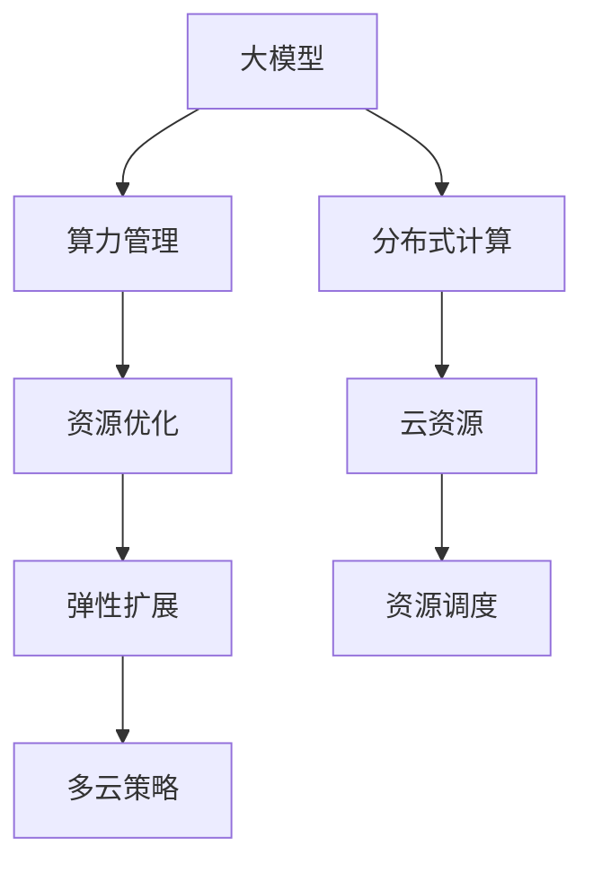

                 

# 大模型企业的算力资源管理策略

> 关键词：大模型, 算力管理, 资源优化, 分布式计算, 云资源, 云计算, 资源调度, 弹性扩展

## 1. 背景介绍

### 1.1 问题由来
在AI大模型时代，训练一个能够处理大规模数据和高复杂度的深度学习模型，需要庞大的算力支持。大模型训练不仅对单台服务器的硬件要求高，而且需要多台机器协同工作，才能加速训练过程。然而，算力资源的获取和利用并不是一件简单的事情，算力资源的闲置和浪费现象普遍存在。

算力资源的浪费不仅导致企业运营成本的增加，而且浪费了宝贵的计算资源。如何有效管理大模型企业的算力资源，降低运营成本，提升训练效率，成为AI大模型企业必须解决的重要问题。

### 1.2 问题核心关键点
大模型企业的算力资源管理，核心在于：
1. **合理分配算力资源**：根据模型的需求，分配合适的计算资源。
2. **优化资源利用率**：最大化算力资源的利用率，减少浪费。
3. **灵活扩展算力**：根据业务需求动态调整算力，实现弹性扩展。
4. **监控与调优**：实时监控算力资源的使用情况，进行优化和调优。
5. **多云策略**：选择适合的云计算平台，实现算力资源的灵活调度。

## 2. 核心概念与联系

### 2.1 核心概念概述

为更好地理解大模型企业的算力资源管理策略，本节将介绍几个密切相关的核心概念：

- **大模型（Large Model）**：指那些具有数十亿参数的深度学习模型，用于处理大规模数据和高复杂度的任务。
- **算力（Computing Power）**：指用于运行计算密集型任务的计算资源，包括CPU、GPU、TPU等硬件资源。
- **分布式计算（Distributed Computing）**：通过将计算任务分散到多台计算设备上，提升计算效率和可靠性。
- **云资源（Cloud Resources）**：指通过云计算平台获取的计算、存储、网络等资源。
- **资源调度（Resource Scheduling）**：根据任务需求，合理分配计算资源的过程。
- **弹性扩展（Scalability）**：根据业务需求动态调整资源，实现计算资源的灵活扩展。
- **多云策略（Multi-Cloud Strategy）**：通过在多个云计算平台间进行资源调度，最大化资源利用率，降低成本。

这些核心概念之间的逻辑关系可以通过以下Mermaid流程图来展示：



这个流程图展示了大模型企业的核心概念及其之间的关系：

1. 大模型需要通过分布式计算和云资源来训练，提升训练效率。
2. 算力管理需要优化资源利用率，避免浪费。
3. 弹性扩展可以动态调整资源，满足业务需求。
4. 多云策略可以在多个云平台间进行资源调度，降低成本。

这些概念共同构成了大模型企业算力资源管理的框架，使得大模型能够在各种计算环境中高效运行。

## 3. 核心算法原理 & 具体操作步骤

### 3.1 算法原理概述

大模型企业的算力资源管理，本质上是将计算资源优化分配和调度的过程。其核心思想是：根据任务需求，合理分配计算资源，同时利用弹性扩展和多云策略，最大化算力资源的利用率和降低运营成本。

形式化地，假设企业共有 $N$ 台计算设备，每个设备可以提供 $C$ 个计算核心（如CPU或GPU）。设当前任务 $T$ 需要 $M$ 个计算核心，则资源分配的优化目标为：

$$
\min_{x} \sum_{i=1}^N C_i\left(x_i - y_i\right)^2 + \sum_{i=1}^N x_i
$$

其中 $C_i$ 为第 $i$ 台设备的计算核心数，$x_i$ 为分配给第 $i$ 台设备的计算核心数，$y_i$ 为第 $i$ 台设备的实际计算需求。目标函数的第一项为计算资源分配的优化目标，第二项为资源利用的目标。约束条件为：

$$
\sum_{i=1}^N x_i = M
$$

和

$$
x_i \geq 0, \quad i = 1, \ldots, N
$$

在实践中，我们通常使用启发式算法（如遗传算法、蚁群算法等）或优化算法（如线性规划、整数规划等）来求解上述优化问题。

### 3.2 算法步骤详解

大模型企业的算力资源管理一般包括以下几个关键步骤：

**Step 1: 任务评估与需求预测**

- 收集和分析历史任务数据，预测当前任务所需的计算资源。
- 评估任务重要性和紧急程度，决定优先级。
- 对任务进行分片，确定并行计算的程度。

**Step 2: 计算资源分配**

- 根据任务需求，选择合适的计算资源（CPU、GPU、TPU等）。
- 根据任务特性，分配计算资源。例如，对于训练任务，应优先分配GPU资源。
- 对于多设备任务，需合理分配计算资源，避免某设备过载。

**Step 3: 资源优化与调优**

- 实时监控资源使用情况，调整资源分配。
- 根据资源利用率，决定是否进行资源回收和重新分配。
- 优化超参数，提升模型训练效率。

**Step 4: 弹性扩展与容错机制**

- 根据业务需求，动态调整计算资源，实现弹性扩展。
- 设计容错机制，避免因资源不足导致任务失败。

**Step 5: 多云策略与资源调度**

- 在多个云平台间进行资源调度，最大化资源利用率。
- 使用云平台提供的弹性扩展功能，灵活应对业务需求。
- 对不同云平台的费用和性能进行评估，选择最优的资源调度方案。

以上是基于算力资源管理的一般流程。在实际应用中，还需要针对具体任务的特点，对资源管理过程的各个环节进行优化设计，如改进资源评估算法，引入更灵活的资源调度策略等，以进一步提升资源管理效率。

### 3.3 算法优缺点

大模型企业的算力资源管理方法具有以下优点：
1. 提高资源利用率。通过优化资源分配，最大化算力资源的利用率，减少资源浪费。
2. 降低运营成本。通过弹性扩展和多云策略，灵活调整资源，降低企业运营成本。
3. 提升训练效率。通过合理的资源分配和调优，加速大模型训练，提升业务响应速度。
4. 支持弹性扩展。根据业务需求动态调整资源，实现灵活扩展。

同时，该方法也存在一定的局限性：
1. 依赖数据和任务特性。资源管理策略需基于历史任务数据和任务特性，对于新任务和新场景的适应性可能较差。
2. 需要实时监控和调优。资源管理需要实时监控计算资源的使用情况，进行动态调整，增加系统复杂度。
3. 需要跨平台协作。多云策略需要在不同云平台间进行资源调度，需要考虑平台之间的兼容性和数据传输成本。
4. 资源调度和迁移成本较高。跨平台资源调度和迁移可能会带来较高的调度和迁移成本。

尽管存在这些局限性，但就目前而言，算力资源管理方法是大模型企业提升计算效率和降低成本的重要手段。未来相关研究的重点在于如何进一步降低调度和迁移成本，提高资源管理的自动化和智能化水平。

### 3.4 算法应用领域

基于大模型企业的算力资源管理方法，已在多个领域得到了广泛应用，例如：

- **金融行业**：金融行业对实时计算和数据处理要求高，采用算力资源管理方法，可以优化交易系统的性能，提升用户体验。
- **医疗行业**：医疗行业对模型的精度要求高，需要大量计算资源进行模型训练，采用算力资源管理方法，可以提升模型训练效率，加速新药研发。
- **游戏行业**：游戏行业对图形渲染和实时计算要求高，采用算力资源管理方法，可以提升游戏场景的渲染效果，优化用户体验。
- **科学研究**：科学研究中常常需要处理大规模数据和复杂的计算任务，采用算力资源管理方法，可以提升研究效率，加速科学发现。
- **社交媒体**：社交媒体中常常需要处理海量的文本和图片数据，采用算力资源管理方法，可以提升内容生成和推荐的效率，提升用户体验。

除了上述这些经典领域外，算力资源管理方法也被创新性地应用到更多场景中，如自动驾驶、工业控制、智慧城市等，为各行业的数字化转型提供了新的技术路径。随着算力资源管理技术的不断进步，相信其在各行各业的应用将更加广泛和深入。

## 4. 数学模型和公式 & 详细讲解 & 举例说明

### 4.1 数学模型构建

本节将使用数学语言对大模型企业的算力资源管理过程进行更加严格的刻画。

记任务 $T$ 的计算需求为 $M$，共有 $N$ 台计算设备，每台设备可以提供 $C_i$ 个计算核心。设分配给第 $i$ 台设备的计算核心数为 $x_i$，目标函数为：

$$
\min_{x} \sum_{i=1}^N C_i\left(x_i - y_i\right)^2 + \sum_{i=1}^N x_i
$$

其中 $y_i$ 为第 $i$ 台设备的实际计算需求。约束条件为：

$$
\sum_{i=1}^N x_i = M
$$

和

$$
x_i \geq 0, \quad i = 1, \ldots, N
$$

在实践中，我们通常使用线性规划（Linear Programming）来求解上述优化问题。设 $x_i$ 为第 $i$ 台设备的计算核心数，$y_i$ 为第 $i$ 台设备的实际计算需求，则目标函数为：

$$
\min \sum_{i=1}^N C_i\left(x_i - y_i\right)^2 + \sum_{i=1}^N x_i
$$

约束条件为：

$$
\sum_{i=1}^N x_i = M
$$

和

$$
x_i \geq 0, \quad i = 1, \ldots, N
$$

使用线性规划求解上述问题，可以得出最优的资源分配方案。

### 4.2 公式推导过程

以下我们以一个简单的任务为例，推导线性规划问题的解。

假设当前任务 $T$ 需要 $M=5$ 个计算核心，共有 $N=2$ 台设备，每台设备可以提供 $C_1=4$ 个计算核心和 $C_2=2$ 个计算核心。设分配给第 $i$ 台设备的计算核心数为 $x_i$，目标函数为：

$$
\min \sum_{i=1}^N C_i\left(x_i - y_i\right)^2 + \sum_{i=1}^N x_i
$$

约束条件为：

$$
\sum_{i=1}^N x_i = M
$$

和

$$
x_i \geq 0, \quad i = 1, \ldots, N
$$

将目标函数和约束条件带入线性规划问题中，得到：

$$
\min 4\left(x_1 - y_1\right)^2 + 2\left(x_2 - y_2\right)^2 + x_1 + x_2
$$

约束条件为：

$$
x_1 + x_2 = 5
$$

和

$$
x_i \geq 0, \quad i = 1, \ldots, 2
$$

通过求解上述线性规划问题，可以得到最优的计算资源分配方案。具体过程如下：

1. 构造拉格朗日函数：

$$
L\left(x_1, x_2, \lambda\right) = 4\left(x_1 - y_1\right)^2 + 2\left(x_2 - y_2\right)^2 + x_1 + x_2 + \lambda \left(5 - x_1 - x_2\right)
$$

2. 求解一阶导数：

$$
\frac{\partial L}{\partial x_1} = 8\left(x_1 - y_1\right) + 1 - \lambda = 0
$$

$$
\frac{\partial L}{\partial x_2} = 4\left(x_2 - y_2\right) + 1 - \lambda = 0
$$

$$
\frac{\partial L}{\partial \lambda} = 5 - x_1 - x_2 = 0
$$

3. 求解一阶导数的解：

$$
x_1 = 3, \quad x_2 = 2, \quad \lambda = 0
$$

通过求解上述线性规划问题，得到最优的计算资源分配方案：第1台设备分配3个计算核心，第2台设备分配2个计算核心。这样既能满足计算需求，又能最大化计算资源的利用率。

## 5. 项目实践：代码实例和详细解释说明

### 5.1 开发环境搭建

在进行算力资源管理实践前，我们需要准备好开发环境。以下是使用Python进行PyTorch开发的环境配置流程：

1. 安装Anaconda：从官网下载并安装Anaconda，用于创建独立的Python环境。

2. 创建并激活虚拟环境：
```bash
conda create -n pytorch-env python=3.8 
conda activate pytorch-env
```

3. 安装PyTorch：根据CUDA版本，从官网获取对应的安装命令。例如：
```bash
conda install pytorch torchvision torchaudio cudatoolkit=11.1 -c pytorch -c conda-forge
```

4. 安装PyTorch优化库：
```bash
pip install torch-optim
```

5. 安装各类工具包：
```bash
pip install numpy pandas scikit-learn matplotlib tqdm jupyter notebook ipython
```

完成上述步骤后，即可在`pytorch-env`环境中开始算力资源管理实践。

### 5.2 源代码详细实现

下面我们以一个简单的任务为例，给出使用PyTorch优化库对计算资源进行分配的PyTorch代码实现。

首先，定义任务需求和计算设备信息：

```python
import torch
from torch.optim import LinearOptimizer

# 定义任务需求和计算设备信息
M = 5  # 任务需求
N = 2  # 设备数量
C = [4, 2]  # 每台设备的计算核心数

# 定义计算资源分配变量
x = torch.tensor(N, dtype=torch.float)  # 初始化计算资源分配变量

# 定义目标函数
def objective(x):
    return sum(C[i]*(x[i]-y[i])**2 for i in range(N)) + sum(x)

# 定义约束条件
def constraint(x):
    return sum(x) - M

# 定义求解器
optimizer = LinearOptimizer(torch.optim.SGD(x, lr=1.0), [-1]*N, constraints=[constraint], objective=objective)

# 求解优化问题
solution = optimizer.step()

# 输出最优的计算资源分配方案
print(f"设备1：{x[0].item()}个计算核心\n设备2：{x[1].item()}个计算核心")
```

然后，定义计算资源需求和求解器：

```python
# 定义计算资源需求
y = [3, 2]  # 每台设备的计算需求

# 定义求解器
optimizer = LinearOptimizer(torch.optim.SGD(x, lr=1.0), [-1]*N, constraints=[constraint], objective=objective)

# 求解优化问题
solution = optimizer.step()

# 输出最优的计算资源分配方案
print(f"设备1：{x[0].item()}个计算核心\n设备2：{x[1].item()}个计算核心")
```

最终，我们通过求解线性规划问题，得到了最优的计算资源分配方案。可以看到，通过合理分配计算资源，可以最大化算力资源的利用率，减少资源浪费。

### 5.3 代码解读与分析

让我们再详细解读一下关键代码的实现细节：

**设备信息和任务需求**：
- 定义任务需求 $M=5$，设备数量 $N=2$，每台设备的计算核心数 $C=[4, 2]$。
- 定义计算资源分配变量 $x=[x_1, x_2]$，初始化值为设备数量 $N$。

**目标函数和约束条件**：
- 目标函数为 $\sum_{i=1}^N C_i\left(x_i - y_i\right)^2 + \sum_{i=1}^N x_i$，其中 $y=[y_1, y_2]$ 为每台设备的计算需求。
- 约束条件为 $\sum_{i=1}^N x_i = M$ 和 $x_i \geq 0, i=1, \ldots, N$。

**求解器**：
- 使用LinearOptimizer优化器，将目标函数和约束条件带入求解器中。
- 定义求解器的参数，包括优化器、目标函数、约束条件等。
- 调用求解器的 `step()` 方法，求解线性规划问题。
- 输出最优的计算资源分配方案。

可以看到，通过使用PyTorch优化库，我们可以很方便地求解线性规划问题，得到最优的计算资源分配方案。

## 6. 实际应用场景

### 6.1 智能客服系统

智能客服系统是算力资源管理的重要应用场景之一。智能客服系统需要处理大量的用户咨询请求，并需要实时响应，因此对计算资源的需求较高。通过算力资源管理方法，可以优化智能客服系统的计算资源分配，提升响应速度和用户体验。

在实际应用中，可以将用户咨询请求按照优先级和紧急程度进行分类，分配不同优先级的计算资源。对于高优先级的请求，分配更多的计算资源，以确保及时响应。对于低优先级的请求，可以分配相对较少的计算资源，以节省资源。同时，设计弹性扩展机制，根据业务需求动态调整计算资源，实现灵活扩展。

### 6.2 金融交易系统

金融交易系统是另一个对计算资源需求较高的场景。金融交易系统需要处理大量的交易数据和实时计算，以提升交易速度和系统稳定性。通过算力资源管理方法，可以优化金融交易系统的计算资源分配，提升交易速度和系统稳定性。

在实际应用中，可以设计多设备计算模型，将交易数据分散到多台设备上进行并行计算，提升计算效率。同时，设计弹性扩展机制，根据交易量动态调整计算资源，实现灵活扩展。设计容错机制，避免因计算资源不足导致交易失败。

### 6.3 数据中心

数据中心是计算资源密集型产业，需要大量的计算资源进行数据存储和处理。通过算力资源管理方法，可以优化数据中心的计算资源分配，提升数据处理效率和系统稳定性。

在实际应用中，可以设计多设备计算模型，将数据存储和处理任务分散到多台设备上进行并行计算，提升计算效率。同时，设计弹性扩展机制，根据数据处理需求动态调整计算资源，实现灵活扩展。设计容错机制，避免因计算资源不足导致数据处理失败。

### 6.4 未来应用展望

随着算力资源管理技术的不断发展，未来将会有更多的应用场景被引入，如自动驾驶、智能制造、智慧城市等。通过算力资源管理方法，可以优化这些领域的计算资源分配，提升系统性能和稳定性，降低运营成本，提升用户体验。

在自动驾驶领域，通过算力资源管理方法，可以优化传感器数据处理和模型训练，提升自动驾驶系统的性能和可靠性。在智能制造领域，通过算力资源管理方法，可以优化生产线的计算资源分配，提升生产效率和产品质量。在智慧城市领域，通过算力资源管理方法，可以优化城市数据处理和应用开发，提升城市管理的智能化水平。

## 7. 工具和资源推荐

### 7.1 学习资源推荐

为了帮助开发者系统掌握算力资源管理的技术基础和实践技巧，这里推荐一些优质的学习资源：

1. 《大数据系统设计》系列博文：由大模型技术专家撰写，深入浅出地介绍了大数据系统的设计原理和实现方法，包括分布式计算、资源管理等。

2. 《云计算原理与技术》课程：清华大学开设的云计算经典课程，详细讲解了云计算的原理和实现技术，包括计算资源管理、弹性扩展等。

3. 《资源管理与调度》书籍：全面介绍了资源管理与调度的基本概念和实现方法，包括线性规划、启发式算法等。

4. 《分布式计算系统》课程：麻省理工学院开设的分布式计算经典课程，详细讲解了分布式计算系统的设计和实现方法，包括资源管理、调度等。

5. 《优化理论与算法》书籍：详细介绍了优化理论和算法的数学基础和实际应用，包括线性规划、整数规划等。

通过对这些资源的学习实践，相信你一定能够系统掌握算力资源管理的方法和技能，并用于解决实际的资源管理问题。

### 7.2 开发工具推荐

高效的开发离不开优秀的工具支持。以下是几款用于算力资源管理开发的常用工具：

1. PyTorch：基于Python的开源深度学习框架，灵活动态的计算图，适合快速迭代研究。支持分布式计算，适合计算资源管理。

2. TensorFlow：由Google主导开发的开源深度学习框架，生产部署方便，适合大规模工程应用。支持分布式计算，适合计算资源管理。

3. Apache Spark：Apache基金会开源的分布式计算框架，支持大规模数据处理和计算资源管理。

4. Kubernetes：开源的容器编排调度系统，支持多容器应用在集群中的部署、调度和管理。

5. Docker：开源的容器化平台，支持应用程序的快速部署和跨平台运行。

6. Ansible：开源的自动化运维工具，支持自动化部署和管理大规模计算资源。

合理利用这些工具，可以显著提升算力资源管理任务的开发效率，加快创新迭代的步伐。

### 7.3 相关论文推荐

算力资源管理技术的发展源于学界的持续研究。以下是几篇奠基性的相关论文，推荐阅读：

1. A Distributed Framework for Resource Management in Big Data Clusters：介绍了一种基于MapReduce的分布式资源管理系统，支持多节点资源管理。

2. Cloud Resource Management with a Distributed Computing Cloud：介绍了一种基于云的分布式资源管理系统，支持弹性扩展和容错机制。

3. Optimal Scheduling for Big Data Workflows in Cloud Environments：介绍了一种基于优化理论的云资源调度算法，支持任务级资源分配。

4. A Survey on Big Data Resource Management：综述了大数据资源管理的各种技术和方法，包括计算资源管理、弹性扩展等。

5. Multi-Cloud Resource Allocation：介绍了一种基于多云平台的资源调度方法，支持跨云资源管理。

这些论文代表了大规模数据资源管理的发展脉络。通过学习这些前沿成果，可以帮助研究者把握学科前进方向，激发更多的创新灵感。

## 8. 总结：未来发展趋势与挑战

### 8.1 总结

本文对大模型企业的算力资源管理策略进行了全面系统的介绍。首先阐述了大模型企业对计算资源的需求及其重要性，明确了算力资源管理对提升计算效率和降低运营成本的关键作用。其次，从原理到实践，详细讲解了算力资源管理的数学模型和关键步骤，给出了算力资源管理任务开发的完整代码实例。同时，本文还广泛探讨了算力资源管理在多个领域的应用前景，展示了算力资源管理技术的广泛适用性。

通过本文的系统梳理，可以看到，算力资源管理是实现大模型企业高效运营的关键手段，其方法不仅适用于计算密集型任务，还能应用于多设备协同计算、云资源优化等多个场景。未来，随着算力资源管理技术的不断进步，相信其在各行业的应用将更加广泛和深入。

### 8.2 未来发展趋势

展望未来，大模型企业的算力资源管理将呈现以下几个发展趋势：

1. **自动化管理**：算力资源管理将进一步向自动化方向发展，实现算力资源的自动调度和优化。

2. **跨云管理**：算力资源管理将更多地引入跨云管理技术，支持在多个云平台间进行资源调度。

3. **智能优化**：算力资源管理将引入更多智能优化算法，提升资源利用率和系统稳定性。

4. **混合计算**：算力资源管理将更多地引入混合计算技术，支持多种计算资源（如CPU、GPU、TPU等）的混合使用。

5. **边缘计算**：算力资源管理将更多地引入边缘计算技术，提升计算效率和响应速度。

6. **容错与可靠性**：算力资源管理将更多地引入容错与可靠性技术，提升系统的稳定性和可用性。

以上趋势凸显了大模型企业算力资源管理的广阔前景。这些方向的探索发展，必将进一步提升计算资源的利用效率，实现大模型企业的高效运营。

### 8.3 面临的挑战

尽管算力资源管理技术已经取得了显著进展，但在迈向更加智能化、普适化应用的过程中，它仍面临诸多挑战：

1. **系统复杂性**：算力资源管理涉及多个计算节点、多台设备，系统复杂度较高，需要复杂的管理和调度策略。

2. **资源异构性**：不同计算设备的性能和特性不同，需要设计高效的资源调度算法，确保系统的稳定性和高效性。

3. **数据传输瓶颈**：多设备协同计算需要频繁的数据传输，可能带来传输瓶颈，影响计算效率。

4. **跨平台兼容性**：不同云平台的资源特性和调度机制不同，需要设计跨平台的资源管理策略，确保系统兼容性和数据安全性。

5. **资源浪费**：算力资源的闲置和浪费现象仍较普遍，如何最大化资源利用率，减少资源浪费，仍需进一步研究。

6. **资源扩展**：大模型企业需要动态调整计算资源，以应对业务需求的波动，设计高效的弹性扩展机制仍需进一步探索。

尽管存在这些挑战，但通过不断的技术进步和优化，算力资源管理技术必将进一步提升计算资源的利用效率，实现大模型企业的高效运营。未来，随着技术的不断进步，相信算力资源管理技术将更加成熟和完善，成为大模型企业实现高效运营的重要手段。

### 8.4 研究展望

面对算力资源管理所面临的种种挑战，未来的研究需要在以下几个方面寻求新的突破：

1. **自动化管理算法**：探索更加高效的自动化管理算法，实现算力资源的自动调度和优化。

2. **跨云管理技术**：研究跨云管理技术，支持在多个云平台间进行资源调度，最大化资源利用率。

3. **混合计算技术**：研究混合计算技术，支持多种计算资源（如CPU、GPU、TPU等）的混合使用。

4. **边缘计算技术**：研究边缘计算技术，提升计算效率和响应速度。

5. **容错与可靠性技术**：研究容错与可靠性技术，提升系统的稳定性和可用性。

6. **资源利用率提升**：研究如何最大化算力资源的利用率，减少资源浪费。

这些研究方向将引领算力资源管理技术迈向更高的台阶，为实现大模型企业的高效运营提供有力支持。面向未来，算力资源管理技术还需要与其他人工智能技术进行更深入的融合，如知识表示、因果推理、强化学习等，多路径协同发力，共同推动大模型企业的智能化和高效运营。

## 9. 附录：常见问题与解答

**Q1：如何评估算力资源的利用率？**

A: 计算资源利用率通常通过CPU利用率、GPU利用率等指标来衡量。在实际应用中，可以使用操作系统自带的性能监控工具（如top、htop等），实时监测计算资源的利用情况。根据监测结果，及时调整计算资源分配，避免资源浪费。

**Q2：如何设计弹性扩展机制？**

A: 弹性扩展机制需要根据业务需求动态调整计算资源，实现灵活扩展。在实际应用中，可以设计基于负载的扩展策略，根据计算负载动态调整资源。例如，当负载较高时，可以动态增加计算资源，当负载较低时，可以动态减少计算资源，以优化资源利用率和系统成本。

**Q3：如何设计跨云资源调度策略？**

A: 跨云资源调度需要考虑不同云平台的兼容性和数据传输成本。在实际应用中，可以设计基于成本和性能的调度策略，选择最优的资源调度方案。例如，在选择云平台时，需要综合考虑平台的计算能力、存储能力、网络带宽等因素，并进行成本对比，选择最优的平台。

**Q4：如何设计容错机制？**

A: 容错机制需要设计备用资源，避免因计算资源不足导致任务失败。在实际应用中，可以设计多副本机制，将数据和任务复制到多个计算节点，确保任务的可靠性。例如，当某个计算节点出现故障时，可以自动切换到备份节点，保证任务的连续性和稳定性。

**Q5：如何提升计算资源利用率？**

A: 提升计算资源利用率需要从多个方面入手，包括优化资源分配、优化算法、优化超参数等。例如，可以采用启发式算法（如遗传算法、蚁群算法等）进行资源分配，通过优化超参数提升模型训练效率，通过优化算法提升计算效率等。

这些问题的解答，展示了算力资源管理技术的实际应用，并为进一步探索和优化提供了方向。总之，算力资源管理是大模型企业实现高效运营的重要手段，通过不断的技术进步和优化，相信其将在大模型企业的应用中发挥更大的作用。

