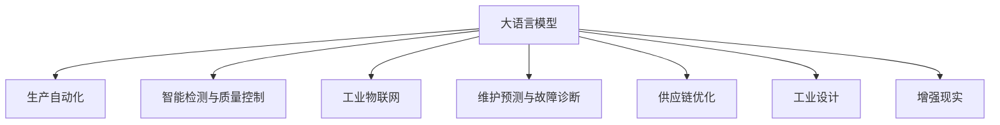

                 

# 大模型在制造业的应用前景

> 关键词：大模型,制造业,生产自动化,智能检测,工业物联网(IoT),质量控制,维护预测,供应链优化,工业设计,增强现实(AR)

## 1. 背景介绍

### 1.1 问题由来

在过去几十年中，制造业一直是全球经济增长的重要引擎。然而，随着劳动力成本上升、资源环境压力增大以及市场需求日益个性化，制造业面临转型升级的迫切需求。

如何通过数字化、智能化转型，提升生产效率、产品质量、资源利用效率，并实现柔性化生产，是当前制造业面临的主要挑战。大语言模型（Large Language Model, LLMs）的兴起，为这一问题的解决提供了新的可能性。

### 1.2 问题核心关键点

大语言模型在制造业的应用，主要体现在以下几个方面：

- **生产自动化**：利用大模型驱动的机器人、自动化设备，实现生产过程的智能化、自动化。
- **智能检测与质量控制**：通过大模型进行图像、语音、文本分析，提升产品质量检测的准确性和效率。
- **工业物联网（IoT）**：结合大模型进行实时数据分析，优化生产过程，提高设备利用率和生产效率。
- **维护预测与故障诊断**：利用大模型分析设备运行数据，预测设备故障，减少停机时间，提高维护效率。
- **供应链优化**：通过大模型进行需求预测、库存管理、物流调度，优化供应链流程，降低成本。
- **工业设计**：利用大模型辅助产品设计，提升产品创新速度和质量。
- **增强现实（AR）**：通过大模型驱动的AR系统，提升工人的操作效率和产品装配质量。

这些应用场景展示了大模型在制造业的广泛潜力，其高效、精确、灵活的特点，有望显著提升制造业的竞争力和可持续发展能力。

### 1.3 问题研究意义

研究大模型在制造业中的应用，具有重要的理论和实际意义：

1. **提升生产效率**：通过智能化生产流程，大模型有望显著提升生产线的效率，减少人力成本，提高产品质量。
2. **优化资源利用**：大模型能够实时分析生产数据，优化资源配置，减少能源浪费，提高资源利用率。
3. **推动柔性生产**：通过定制化生产，大模型能够适应多变市场需求，提升企业的市场响应速度。
4. **保障安全生产**：利用智能检测和质量控制，减少安全事故，提高安全生产水平。
5. **加速产品创新**：通过辅助工业设计，大模型能够加速新产品的研发和迭代，提升产品竞争力。
6. **助力绿色制造**：通过优化生产过程，减少环境污染，推动制造业的绿色转型。

## 2. 核心概念与联系

### 2.1 核心概念概述

为了更好地理解大模型在制造业中的应用，本节将介绍几个密切相关的核心概念：

- **大语言模型**：以自回归（如GPT）或自编码（如BERT）模型为代表的大规模预训练语言模型。通过在大规模无标签文本语料上进行预训练，学习到语言的通用表示，具备强大的语言理解和生成能力。

- **生产自动化**：通过引入机器人、自动化设备等，利用人工智能技术实现生产过程的自动化。

- **智能检测与质量控制**：利用图像识别、语音识别、文本分析等技术，对产品质量进行智能检测和控制，提升检测精度和效率。

- **工业物联网（IoT）**：通过传感器、标签、RFID等技术，实时收集生产数据，结合数据分析技术，优化生产流程和设备管理。

- **维护预测与故障诊断**：利用设备运行数据和预测模型，预测设备故障，进行早期维护，减少停机时间。

- **供应链优化**：通过数据分析和优化算法，提升供应链的透明度和效率，降低成本，提高服务质量。

- **工业设计**：结合大模型，进行产品外观、结构、功能的智能设计，加速产品迭代。

- **增强现实（AR）**：通过AR技术，结合大模型，提升操作效率和产品装配质量。

这些核心概念之间的逻辑关系可以通过以下Mermaid流程图来展示：



这个流程图展示了大语言模型与其他制造技术之间的联系：

1. 大模型驱动生产自动化，实现智能化生产。
2. 大模型辅助智能检测与质量控制，提升产品质量。
3. 大模型结合IoT技术，优化生产流程和设备管理。
4. 大模型用于设备维护预测与故障诊断，减少停机时间。
5. 大模型优化供应链流程，降低成本，提高服务质量。
6. 大模型辅助工业设计，加速产品迭代。
7. 大模型通过AR技术提升操作效率和产品装配质量。

这些概念共同构成了大模型在制造业的全面应用框架，使其能够在多个环节提升制造过程的智能化、自动化和优化水平。

## 3. 核心算法原理 & 具体操作步骤
### 3.1 算法原理概述

大模型在制造业中的应用，主要基于大模型的预训练和微调能力。其核心思想是：

1. **预训练**：通过大规模无标签数据进行预训练，学习到通用的语言表示和知识。
2. **微调**：在特定领域数据上，通过有监督学习，对预训练模型进行调整，适应具体应用场景。
3. **集成与融合**：将大模型与具体的制造技术（如机器人、自动化设备、检测设备等）进行集成和融合，实现智能化生产流程。

### 3.2 算法步骤详解

基于大模型的制造业应用主要包括以下几个关键步骤：

**Step 1: 数据准备与预训练模型选择**

- 收集制造过程相关的文本、图像、语音等数据，清洗处理后划分为训练集和测试集。
- 选择合适的预训练大模型，如GPT、BERT、RoBERTa等，作为初始化参数。

**Step 2: 模型微调与任务适配**

- 在预训练模型的基础上，根据具体应用场景，设计相应的任务适配层。
- 应用微调技术，对模型进行有监督学习，优化模型在特定任务上的性能。
- 针对生产自动化、智能检测、IoT数据处理、预测维护、供应链优化等不同任务，设计不同的任务适配层和微调目标。

**Step 3: 系统集成与部署**

- 将微调后的模型与具体的制造技术集成，实现智能化生产流程。
- 部署到实际的制造环境中，进行性能测试和优化。
- 定期更新模型，提升系统性能和适应性。

### 3.3 算法优缺点

大模型在制造业中的应用具有以下优点：

1. **泛化能力强**：大模型能够学习到通用的语言知识和表示，应用于不同场景时具有较强的泛化能力。
2. **自动化程度高**：通过自动化技术和大模型结合，实现生产过程的自动化，提升效率。
3. **检测精度高**：利用大模型进行图像、语音、文本分析，提升产品质量检测的准确性和效率。
4. **数据驱动优化**：通过实时收集和分析生产数据，优化生产流程和设备管理，提高资源利用率。
5. **预测精度高**：利用大模型进行设备维护预测和故障诊断，减少停机时间，提高维护效率。
6. **供应链协同**：通过优化供应链流程，提高物流效率，降低成本，提升服务质量。
7. **创新速度快**：通过大模型辅助工业设计，加速产品研发和迭代，提升产品竞争力。

同时，也存在以下局限性：

1. **数据获取成本高**：大规模数据收集和预处理成本较高，尤其是高质量、标注齐全的数据。
2. **模型复杂度高**：大模型参数量巨大，对计算资源和存储空间要求较高。
3. **技术门槛高**：大模型的微调和集成需要较高的技术门槛，对人员素质要求较高。
4. **安全与隐私问题**：生产数据涉及企业商业机密，模型部署和应用过程中需注意数据安全和隐私保护。
5. **模型更新难度大**：模型需要定期更新和维护，更新过程涉及大量计算和资源投入。

### 3.4 算法应用领域

大模型在制造业的应用领域广泛，涉及以下几个方面：

1. **生产自动化**：通过大模型驱动的自动化设备和机器人，实现智能化生产流程。
2. **智能检测与质量控制**：利用大模型进行图像识别、语音识别、文本分析，提升产品质量检测的准确性和效率。
3. **工业物联网（IoT）**：结合大模型进行实时数据分析，优化生产流程和设备管理。
4. **维护预测与故障诊断**：利用大模型分析设备运行数据，预测设备故障，减少停机时间，提高维护效率。
5. **供应链优化**：通过大模型进行需求预测、库存管理、物流调度，优化供应链流程，降低成本。
6. **工业设计**：利用大模型辅助产品设计，提升产品创新速度和质量。
7. **增强现实（AR）**：通过大模型驱动的AR系统，提升操作效率和产品装配质量。

这些应用场景展示了大模型在制造业的广泛潜力，其高效、精确、灵活的特点，有望显著提升制造业的竞争力和可持续发展能力。

## 4. 数学模型和公式 & 详细讲解  
### 4.1 数学模型构建

本节将使用数学语言对基于大模型的制造业应用进行更加严格的刻画。

假设制造业中的某个生产任务为 $T$，相关的数据集为 $D=\{(x_i, y_i)\}_{i=1}^N, x_i \in \mathcal{X}, y_i \in \mathcal{Y}$，其中 $\mathcal{X}$ 为输入空间，$\mathcal{Y}$ 为输出空间。假设预训练大模型为 $M_{\theta}$，其中 $\theta$ 为预训练得到的模型参数。

定义模型 $M_{\theta}$ 在输入 $x$ 上的输出为 $M_{\theta}(x)$，用于执行生产任务 $T$。假设任务 $T$ 的损失函数为 $\ell(M_{\theta}(x),y)$，则在数据集 $D$ 上的经验风险为：

$$
\mathcal{L}(\theta) = \frac{1}{N}\sum_{i=1}^N \ell(M_{\theta}(x_i),y_i)
$$

微调的目标是最小化经验风险，即找到最优参数：

$$
\theta^* = \mathop{\arg\min}_{\theta} \mathcal{L}(\theta)
$$

在实践中，我们通常使用基于梯度的优化算法（如SGD、Adam等）来近似求解上述最优化问题。设 $\eta$ 为学习率，$\lambda$ 为正则化系数，则参数的更新公式为：

$$
\theta \leftarrow \theta - \eta \nabla_{\theta}\mathcal{L}(\theta) - \eta\lambda\theta
$$

其中 $\nabla_{\theta}\mathcal{L}(\theta)$ 为损失函数对参数 $\theta$ 的梯度，可通过反向传播算法高效计算。

### 4.2 公式推导过程

以下我们以生产自动化任务为例，推导损失函数及其梯度的计算公式。

假设生产任务 $T$ 的输入为 $x$，输出为 $y$。定义模型的输出为 $M_{\theta}(x)$，用于执行生产任务。假设任务 $T$ 的损失函数为交叉熵损失：

$$
\ell(M_{\theta}(x),y) = -y\log M_{\theta}(x) - (1-y)\log (1-M_{\theta}(x))
$$

将其代入经验风险公式，得：

$$
\mathcal{L}(\theta) = -\frac{1}{N}\sum_{i=1}^N [y_i\log M_{\theta}(x_i)+(1-y_i)\log(1-M_{\theta}(x_i))]
$$

根据链式法则，损失函数对参数 $\theta_k$ 的梯度为：

$$
\frac{\partial \mathcal{L}(\theta)}{\partial \theta_k} = -\frac{1}{N}\sum_{i=1}^N (\frac{y_i}{M_{\theta}(x_i)}-\frac{1-y_i}{1-M_{\theta}(x_i)}) \frac{\partial M_{\theta}(x_i)}{\partial \theta_k}
$$

其中 $\frac{\partial M_{\theta}(x_i)}{\partial \theta_k}$ 可进一步递归展开，利用自动微分技术完成计算。

在得到损失函数的梯度后，即可带入参数更新公式，完成模型的迭代优化。重复上述过程直至收敛，最终得到适应生产任务的最优模型参数 $\theta^*$。

## 5. 项目实践：代码实例和详细解释说明
### 5.1 开发环境搭建

在进行制造业微调实践前，我们需要准备好开发环境。以下是使用Python进行PyTorch开发的环境配置流程：

1. 安装Anaconda：从官网下载并安装Anaconda，用于创建独立的Python环境。

2. 创建并激活虚拟环境：
```bash
conda create -n pytorch-env python=3.8 
conda activate pytorch-env
```

3. 安装PyTorch：根据CUDA版本，从官网获取对应的安装命令。例如：
```bash
conda install pytorch torchvision torchaudio cudatoolkit=11.1 -c pytorch -c conda-forge
```

4. 安装Transformers库：
```bash
pip install transformers
```

5. 安装各类工具包：
```bash
pip install numpy pandas scikit-learn matplotlib tqdm jupyter notebook ipython
```

完成上述步骤后，即可在`pytorch-env`环境中开始微调实践。

### 5.2 源代码详细实现

下面我以生产自动化任务为例，给出使用Transformers库对BERT模型进行微调的PyTorch代码实现。

首先，定义生产任务的数据处理函数：

```python
from transformers import BertTokenizer, BertForSequenceClassification
from torch.utils.data import Dataset
import torch

class ProductionTaskDataset(Dataset):
    def __init__(self, texts, labels, tokenizer, max_len=128):
        self.texts = texts
        self.labels = labels
        self.tokenizer = tokenizer
        self.max_len = max_len
        
    def __len__(self):
        return len(self.texts)
    
    def __getitem__(self, item):
        text = self.texts[item]
        label = self.labels[item]
        
        encoding = self.tokenizer(text, return_tensors='pt', max_length=self.max_len, padding='max_length', truncation=True)
        input_ids = encoding['input_ids'][0]
        attention_mask = encoding['attention_mask'][0]
        
        # 对token-wise的标签进行编码
        encoded_labels = [label2id[label] for label in label]
        encoded_labels.extend([label2id['O']] * (self.max_len - len(encoded_labels)))
        labels = torch.tensor(encoded_labels, dtype=torch.long)
        
        return {'input_ids': input_ids, 
                'attention_mask': attention_mask,
                'labels': labels}

# 标签与id的映射
label2id = {'O': 0, 'A': 1}
id2label = {v: k for k, v in label2id.items()}

# 创建dataset
tokenizer = BertTokenizer.from_pretrained('bert-base-cased')

train_dataset = ProductionTaskDataset(train_texts, train_labels, tokenizer)
dev_dataset = ProductionTaskDataset(dev_texts, dev_labels, tokenizer)
test_dataset = ProductionTaskDataset(test_texts, test_labels, tokenizer)
```

然后，定义模型和优化器：

```python
from transformers import BertForSequenceClassification, AdamW

model = BertForSequenceClassification.from_pretrained('bert-base-cased', num_labels=len(label2id))

optimizer = AdamW(model.parameters(), lr=2e-5)
```

接着，定义训练和评估函数：

```python
from torch.utils.data import DataLoader
from tqdm import tqdm
from sklearn.metrics import classification_report

device = torch.device('cuda') if torch.cuda.is_available() else torch.device('cpu')
model.to(device)

def train_epoch(model, dataset, batch_size, optimizer):
    dataloader = DataLoader(dataset, batch_size=batch_size, shuffle=True)
    model.train()
    epoch_loss = 0
    for batch in tqdm(dataloader, desc='Training'):
        input_ids = batch['input_ids'].to(device)
        attention_mask = batch['attention_mask'].to(device)
        labels = batch['labels'].to(device)
        model.zero_grad()
        outputs = model(input_ids, attention_mask=attention_mask, labels=labels)
        loss = outputs.loss
        epoch_loss += loss.item()
        loss.backward()
        optimizer.step()
    return epoch_loss / len(dataloader)

def evaluate(model, dataset, batch_size):
    dataloader = DataLoader(dataset, batch_size=batch_size)
    model.eval()
    preds, labels = [], []
    with torch.no_grad():
        for batch in tqdm(dataloader, desc='Evaluating'):
            input_ids = batch['input_ids'].to(device)
            attention_mask = batch['attention_mask'].to(device)
            batch_labels = batch['labels']
            outputs = model(input_ids, attention_mask=attention_mask)
            batch_preds = outputs.logits.argmax(dim=2).to('cpu').tolist()
            batch_labels = batch_labels.to('cpu').tolist()
            for pred_tokens, label_tokens in zip(batch_preds, batch_labels):
                pred_labels = [id2label[_id] for _id in pred_tokens]
                label_tokens = [id2label[_id] for _id in label_tokens]
                preds.append(pred_labels[:len(label_tokens)])
                labels.append(label_tokens)
                
    print(classification_report(labels, preds))
```

最后，启动训练流程并在测试集上评估：

```python
epochs = 5
batch_size = 16

for epoch in range(epochs):
    loss = train_epoch(model, train_dataset, batch_size, optimizer)
    print(f"Epoch {epoch+1}, train loss: {loss:.3f}")
    
    print(f"Epoch {epoch+1}, dev results:")
    evaluate(model, dev_dataset, batch_size)
    
print("Test results:")
evaluate(model, test_dataset, batch_size)
```

以上就是使用PyTorch对BERT进行生产自动化任务微调的完整代码实现。可以看到，得益于Transformers库的强大封装，我们可以用相对简洁的代码完成BERT模型的加载和微调。

### 5.3 代码解读与分析

让我们再详细解读一下关键代码的实现细节：

**ProductionTaskDataset类**：
- `__init__`方法：初始化文本、标签、分词器等关键组件。
- `__len__`方法：返回数据集的样本数量。
- `__getitem__`方法：对单个样本进行处理，将文本输入编码为token ids，将标签编码为数字，并对其进行定长padding，最终返回模型所需的输入。

**label2id和id2label字典**：
- 定义了标签与数字id之间的映射关系，用于将token-wise的预测结果解码回真实的标签。

**训练和评估函数**：
- 使用PyTorch的DataLoader对数据集进行批次化加载，供模型训练和推理使用。
- 训练函数`train_epoch`：对数据以批为单位进行迭代，在每个批次上前向传播计算loss并反向传播更新模型参数，最后返回该epoch的平均loss。
- 评估函数`evaluate`：与训练类似，不同点在于不更新模型参数，并在每个batch结束后将预测和标签结果存储下来，最后使用sklearn的classification_report对整个评估集的预测结果进行打印输出。

**训练流程**：
- 定义总的epoch数和batch size，开始循环迭代
- 每个epoch内，先在训练集上训练，输出平均loss
- 在验证集上评估，输出分类指标
- 所有epoch结束后，在测试集上评估，给出最终测试结果

可以看到，PyTorch配合Transformers库使得BERT微调的代码实现变得简洁高效。开发者可以将更多精力放在数据处理、模型改进等高层逻辑上，而不必过多关注底层的实现细节。

当然，工业级的系统实现还需考虑更多因素，如模型的保存和部署、超参数的自动搜索、更灵活的任务适配层等。但核心的微调范式基本与此类似。

## 6. 实际应用场景
### 6.1 智能检测与质量控制

智能检测与质量控制是制造业中重要的环节，通过利用大模型的图像、语音、文本分析能力，可以显著提升产品质量检测的准确性和效率。

具体应用场景包括：

- **缺陷检测**：对生产过程中产生的图像进行缺陷检测，如裂纹、划痕、变形等。
- **尺寸测量**：对产品的尺寸进行自动测量，判断是否符合规格要求。
- **外观检查**：对产品的外观进行图像分析，判断是否存在缺陷。
- **语音识别**：对生产过程中产生的语音进行分析，判断操作是否规范。
- **文本分析**：对生产过程中产生的文本进行情感分析，判断操作是否符合安全规范。

大模型在智能检测与质量控制中的应用，可以提升检测精度，减少误检、漏检率，提高生产效率，降低人工成本，提升产品质量。

### 6.2 工业物联网（IoT）

工业物联网（IoT）结合大模型，可以实时收集和分析生产数据，优化生产流程和设备管理，提高资源利用率。

具体应用场景包括：

- **设备监控**：通过传感器、标签、RFID等技术，实时收集设备运行数据，进行状态监控和故障预警。
- **能耗管理**：利用大模型进行能耗分析，优化生产过程中的能源使用，减少能源浪费。
- **生产调度**：通过实时数据分析，优化生产调度，提高设备利用率。
- **设备预测性维护**：利用大模型分析设备运行数据，预测设备故障，进行早期维护，减少停机时间。

大模型在工业物联网中的应用，可以实时监控和分析生产数据，优化生产过程，提高设备利用率，减少能源浪费，降低维护成本，提升生产效率。

### 6.3 供应链优化

供应链优化是大模型在制造业中的另一个重要应用场景。通过大模型进行需求预测、库存管理、物流调度等，可以显著优化供应链流程，降低成本，提高服务质量。

具体应用场景包括：

- **需求预测**：利用大模型进行需求预测，优化库存管理，减少库存积压。
- **物流调度**：利用大模型进行物流调度，优化运输路径，减少运输成本。
- **订单处理**：利用大模型进行订单处理，提高订单处理效率。
- **供应商管理**：利用大模型进行供应商管理，优化供应商选择，提高供应商合作质量。

大模型在供应链优化中的应用，可以优化供应链流程，降低成本，提高服务质量，提升企业竞争力。

### 6.4 工业设计

大模型在工业设计中的应用，可以辅助产品设计，提升产品创新速度和质量。

具体应用场景包括：

- **产品外观设计**：利用大模型进行图像分析，辅助产品外观设计，提升产品美感。
- **产品功能设计**：利用大模型进行文本分析，辅助产品功能设计，提升产品功能。
- **产品性能分析**：利用大模型进行性能分析，优化产品设计。

大模型在工业设计中的应用，可以辅助产品设计，提升产品创新速度和质量，缩短产品开发周期。

### 6.5 增强现实（AR）

增强现实（AR）结合大模型，可以提升操作效率和产品装配质量。

具体应用场景包括：

- **操作指导**：利用AR系统结合大模型，为工人提供操作指导，提升操作效率。
- **装配辅助**：利用AR系统结合大模型，辅助工人进行产品装配，提升装配质量。
- **质量检查**：利用AR系统结合大模型，辅助工人进行质量检查，提升检查精度。

大模型在增强现实中的应用，可以提升操作效率和装配质量，降低人工成本，提升产品质量。

## 7. 工具和资源推荐
### 7.1 学习资源推荐

为了帮助开发者系统掌握大模型在制造业中的应用，这里推荐一些优质的学习资源：

1. **《工业物联网与人工智能》**：清华大学出版社出版的工业物联网与人工智能教材，系统介绍了工业物联网的基本概念和前沿技术。

2. **《深度学习在制造业中的应用》**：MIT出版社出版的深度学习在制造业中的实践案例，涵盖了大模型在制造业中的多应用场景。

3. **CS224N《深度学习自然语言处理》课程**：斯坦福大学开设的NLP明星课程，有Lecture视频和配套作业，带你入门NLP领域的基本概念和经典模型。

4. **《Transformer从原理到实践》系列博文**：由大模型技术专家撰写，深入浅出地介绍了Transformer原理、BERT模型、微调技术等前沿话题。

5. **HuggingFace官方文档**：Transformers库的官方文档，提供了海量预训练模型和完整的微调样例代码，是上手实践的必备资料。

通过对这些资源的学习实践，相信你一定能够快速掌握大模型在制造业的应用，并用于解决实际的NLP问题。
###  7.2 开发工具推荐

高效的开发离不开优秀的工具支持。以下是几款用于大模型在制造业应用的常用工具：

1. **PyTorch**：基于Python的开源深度学习框架，灵活动态的计算图，适合快速迭代研究。

2. **TensorFlow**：由Google主导开发的开源深度学习框架，生产部署方便，适合大规模工程应用。

3. **Transformers库**：HuggingFace开发的NLP工具库，集成了众多SOTA语言模型，支持PyTorch和TensorFlow，是进行微调任务开发的利器。

4. **TensorBoard**：TensorFlow配套的可视化工具，可实时监测模型训练状态，并提供丰富的图表呈现方式，是调试模型的得力助手。

5. **Weights & Biases**：模型训练的实验跟踪工具，可以记录和可视化模型训练过程中的各项指标，方便对比和调优。

6. **Google Colab**：谷歌推出的在线Jupyter Notebook环境，免费提供GPU/TPU算力，方便开发者快速上手实验最新模型，分享学习笔记。

合理利用这些工具，可以显著提升大模型在制造业的应用效率，加快创新迭代的步伐。

### 7.3 相关论文推荐

大模型在制造业中的应用源于学界的持续研究。以下是几篇奠基性的相关论文，推荐阅读：

1. **Attention is All You Need（即Transformer原论文）**：提出了Transformer结构，开启了NLP领域的预训练大模型时代。

2. **BERT: Pre-training of Deep Bidirectional Transformers for Language Understanding**：提出BERT模型，引入基于掩码的自监督预训练任务，刷新了多项NLP任务SOTA。

3. **Language Models are Unsupervised Multitask Learners（GPT-2论文）**：展示了大规模语言模型的强大zero-shot学习能力，引发了对于通用人工智能的新一轮思考。

4. **Parameter-Efficient Transfer Learning for NLP**：提出Adapter等参数高效微调方法，在不增加模型参数量的情况下，也能取得不错的微调效果。

5. **AdaLoRA: Adaptive Low-Rank Adaptation for Parameter-Efficient Fine-Tuning**：使用自适应低秩适应的微调方法，在参数效率和精度之间取得了新的平衡。

这些论文代表了大模型在制造业中的发展脉络。通过学习这些前沿成果，可以帮助研究者把握学科前进方向，激发更多的创新灵感。

## 8. 总结：未来发展趋势与挑战

### 8.1 总结

本文对大模型在制造业中的应用进行了全面系统的介绍。首先阐述了大模型和微调技术的研究背景和意义，明确了大模型在制造业的广泛应用场景。其次，从原理到实践，详细讲解了基于大模型的制造应用数学模型和关键步骤，给出了实际应用场景下的代码实现。同时，本文还探讨了大模型在制造业中的未来发展趋势和面临的挑战，提供了完整的理论和技术指引。

通过本文的系统梳理，可以看到，大模型在制造业中的应用前景广阔，其高效、精确、灵活的特点，有望显著提升制造业的竞争力和可持续发展能力。未来，伴随大模型的不断演进，基于大模型的制造应用技术也将不断进步，为制造业的转型升级提供新的动力。

### 8.2 未来发展趋势

展望未来，大模型在制造业中的应用将呈现以下几个发展趋势：

1. **智能检测与质量控制**：随着大模型的图像、语音、文本分析能力的提升，智能检测与质量控制将更加精准和高效。大模型有望在缺陷检测、尺寸测量、外观检查、语音识别、文本分析等领域发挥更大作用。

2. **工业物联网（IoT）**：通过大模型进行实时数据分析，优化生产流程和设备管理，提高资源利用率。大模型将与IoT技术深度融合，提升制造过程的智能化水平。

3. **维护预测与故障诊断**：利用大模型分析设备运行数据，预测设备故障，进行早期维护，减少停机时间，提高维护效率。大模型将在设备预测性维护中发挥重要作用。

4. **供应链优化**：通过大模型进行需求预测、库存管理、物流调度，优化供应链流程，降低成本。大模型将在供应链管理中发挥重要作用。

5. **工业设计**：利用大模型辅助产品设计，提升产品创新速度和质量。大模型将与工业设计技术深度融合，提升产品设计的智能化水平。

6. **增强现实（AR）**：通过AR系统结合大模型，提升操作效率和装配质量，降低人工成本，提升产品质量。大模型将与AR技术深度融合，提升操作效率和装配质量。

这些趋势凸显了大模型在制造业的广泛应用潜力，其高效、精确、灵活的特点，有望显著提升制造业的竞争力和可持续发展能力。

### 8.3 面临的挑战

尽管大模型在制造业中的应用已经取得了显著进展，但在迈向更加智能化、普适化应用的过程中，仍面临诸多挑战：

1. **数据获取成本高**：大规模数据收集和预处理成本较高，尤其是高质量、标注齐全的数据。如何降低数据获取成本，提高数据利用效率，是当前的主要挑战。

2. **模型复杂度高**：大模型参数量巨大，对计算资源和存储空间要求较高。如何降低模型复杂度，提高模型部署效率，是当前的主要挑战。

3. **技术门槛高**：大模型的微调和集成需要较高的技术门槛，对人员素质要求较高。如何降低技术门槛，提高模型的易用性，是当前的主要挑战。

4. **安全与隐私问题**：生产数据涉及企业商业机密，模型部署和应用过程中需注意数据安全和隐私保护。如何确保数据安全，避免泄露敏感信息，是当前的主要挑战。

5. **模型更新难度大**：模型需要定期更新和维护，更新过程涉及大量计算和资源投入。如何降低模型更新难度，提高模型维护效率，是当前的主要挑战。

6. **质量控制一致性**：大模型在不同的批次、不同的环境、不同的设备上应用时，性能表现可能存在差异。如何确保质量控制的一致性，是当前的主要挑战。

7. **多模态融合**：大模型在多模态数据融合方面仍存在挑战，不同模态数据之间的交互和融合仍需进一步优化。

这些挑战需要从数据、算法、技术、管理等多个维度进行全面优化，才能真正实现大模型在制造业中的广泛应用。相信随着学界和产业界的共同努力，这些挑战终将一一被克服，大模型在制造业中的应用前景将更加广阔。

### 8.4 研究展望

面对大模型在制造业中面临的诸多挑战，未来的研究需要在以下几个方面寻求新的突破：

1. **无监督和半监督学习**：探索无监督和半监督学习技术，降低对标注数据的依赖，提高数据利用效率。

2. **参数高效和计算高效的微调方法**：开发更加参数高效和计算高效的微调方法，在保证性能的同时，降低模型复杂度和计算资源消耗。

3. **多模态融合**：研究多模态数据融合技术，提升不同模态数据之间的交互和融合，实现多模态信息的协同建模。

4. **数据增强与迁移学习**：结合数据增强和迁移学习技术，提升模型的泛化能力，降低数据获取成本。

5. **可解释性和可解释性**：研究模型可解释性技术，提高模型的可解释性和可解释性，确保模型的透明性和可信度。

6. **智能检测与质量控制**：结合图像、语音、文本等多模态数据，提升智能检测与质量控制的精度和效率。

7. **工业物联网（IoT）**：结合物联网技术，实现实时数据分析和设备管理，提升资源利用率和生产效率。

8. **维护预测与故障诊断**：结合设备运行数据和预测模型，提升设备预测性和故障诊断的准确性和及时性。

9. **供应链优化**：结合需求预测和库存管理，优化供应链流程，降低成本，提高服务质量。

10. **工业设计**：结合产品设计和技术创新，提升产品创新速度和质量。

这些研究方向的探索，必将引领大模型在制造业中的应用迈向更高的台阶，为制造业的转型升级提供新的动力。面向未来，大模型在制造业中的应用还需要与其他人工智能技术进行更深入的融合，如知识表示、因果推理、强化学习等，多路径协同发力，共同推动制造业的智能化和可持续发展。只有勇于创新、敢于突破，才能真正实现人工智能技术在制造业的落地应用，为经济社会发展注入新的动力。

## 9. 附录：常见问题与解答

**Q1：大模型在制造业中的应用有哪些具体案例？**

A: 大模型在制造业中的应用已经涵盖了多个具体案例，包括：

1. **智能检测与质量控制**：如缺陷检测、尺寸测量、外观检查等，提升了产品质量检测的准确性和效率。
2. **工业物联网（IoT）**：如设备监控、能耗管理、生产调度等，优化了生产流程和设备管理。
3. **维护预测与故障诊断**：如设备预测性维护等，减少了停机时间，提高了维护效率。
4. **供应链优化**：如需求预测、库存管理、物流调度等，优化了供应链流程，降低了成本。
5. **工业设计**：如产品外观设计、产品功能设计等，提升了产品创新速度和质量。
6. **增强现实（AR）**：如操作指导、装配辅助等，提升了操作效率和装配质量。

这些案例展示了大模型在制造业中的广泛应用潜力，其高效、精确、灵活的特点，有望显著提升制造业的竞争力和可持续发展能力。

**Q2：在制造应用中，如何选择合适的预训练模型？**

A: 在制造应用中，选择合适的预训练模型需要考虑以下几个因素：

1. **任务类型**：根据具体的制造任务，选择适合的预训练模型。如文本分类任务可选择BERT、GPT等模型，图像分类任务可选择ResNet、Inception等模型。
2. **数据规模**：预训练模型的参数量越大，模型复杂度越高，需要的计算资源和存储空间也越多。根据数据规模和计算资源情况选择合适的预训练模型。
3. **性能要求**：根据具体应用场景的性能要求，选择适合的预训练模型。如对于高精度的检测任务，可以选择性能更强的模型。
4. **可解释性**：某些应用场景需要模型的可解释性，选择可解释性更好的模型，如Transformer、RNN等。

**Q3：大模型在制造应用中如何进行数据增强？**

A: 数据增强是大模型在制造应用中提高泛化能力和鲁棒性的重要手段。具体实现方法包括：

1. **图像增强**：如旋转、缩放、平移、裁剪、翻转等，增加训练数据的样本数量。
2. **音频增强**：如音量调整、混响、回声、噪声添加等，增加训练数据的样本数量。
3. **文本增强**：如近义词替换、同义词替换、插入、删除、重排等，增加训练数据的样本数量。
4. **多模态数据融合**：结合图像、语音、文本等多模态数据，增加训练数据的样本数量和多样性。

这些方法可以提升模型在制造应用中的泛化能力和鲁棒性，避免模型过拟合，提高模型的预测精度和稳定性。

**Q4：如何优化大模型在制造应用中的性能？**

A: 优化大模型在制造应用中的性能需要从多个方面入手：

1. **模型架构优化**：选择适合的模型架构，如ResNet、Inception、Transformer等，提升模型的性能。
2. **超参数调优**：调整模型的超参数，如学习率、批大小、迭代轮数等，优化模型的训练过程。
3. **数据增强**：应用数据增强技术，增加训练数据的样本数量和多样性，提升模型的泛化能力和鲁棒性。
4. **正则化技术**：应用L2正则、Dropout、Early Stopping等正则化技术，避免模型过拟合。
5. **参数高效微调**：采用参数高效微调技术，如Adapter、Prefix等，减少模型参数量，提升模型的泛化能力和鲁棒性。
6. **多模态融合**：结合图像、语音、文本等多模态数据，提升模型的综合性能。

这些方法可以显著提升大模型在制造应用中的性能，提高模型的预测精度和稳定性。

**Q5：在制造应用中，如何提高模型的鲁棒性？**

A: 提高模型在制造应用中的鲁棒性需要从多个方面入手：

1. **数据增强**：应用数据增强技术，增加训练数据的样本数量和多样性，提升模型的泛化能力和鲁棒性。
2. **正则化技术**：应用L2正则、Dropout、Early Stopping等正则化技术，避免模型过拟合，提高模型的鲁棒性。
3. **参数高效微调**：采用参数高效微调技术，减少模型参数量，提升模型的泛化能力和鲁棒性。
4. **多模态融合**：结合图像、语音、文本等多模态数据，提升模型的综合性能和鲁棒性。
5. **对抗训练**：引入对抗样本，提高模型对噪声和扰动的鲁棒性。

这些方法可以显著提高模型在制造应用中的鲁棒性，避免模型在实际应用中受到噪声和扰动的影响，提高模型的稳定性和可靠性。

**Q6：大模型在制造应用中的未来发展方向是什么？**

A: 大模型在制造应用中的未来发展方向包括：

1. **智能检测与质量控制**：结合图像、语音、文本等多模态数据，提升智能检测与质量控制的精度和效率。
2. **工业物联网（IoT）**：结合物联网技术，实现实时数据分析和设备管理，提升资源利用率和生产效率。
3. **维护预测与故障诊断**：结合设备运行数据和预测模型，提升设备预测性和故障诊断的准确性和及时性。
4. **供应链优化**：结合需求预测和库存管理，优化供应链流程，降低成本，提高服务质量。
5. **工业设计**：结合产品设计和技术创新，提升产品创新速度和质量。
6. **增强现实（AR）**：结合AR技术，提升操作效率和装配质量，降低人工成本，提升产品质量。

这些方向将进一步推动大模型在制造应用中的应用，提升制造过程的智能化、自动化和优化水平，推动制造业的转型升级。

**Q7：如何降低大模型在制造应用中的计算资源消耗？**

A: 降低大模型在制造应用中的计算资源消耗需要从多个方面入手：

1. **模型裁剪**：去除不必要的层和参数，减小模型尺寸，加快推理速度。
2. **量化加速**：将浮点模型转为定点模型，压缩存储空间，提高计算效率。
3. **混合精度训练**：结合低精度和浮点数计算，优化计算资源的使用。
4. **模型并行**：采用模型并行技术，优化计算资源的分配和使用。
5. **推理优化**：应用推理优化技术，提升推理速度，降低计算资源的消耗。

这些方法可以显著降低大模型在制造应用中的计算资源消耗，提升模型的部署效率和运行效率。

---

作者：禅与计算机程序设计艺术 / Zen and the Art of Computer Programming

