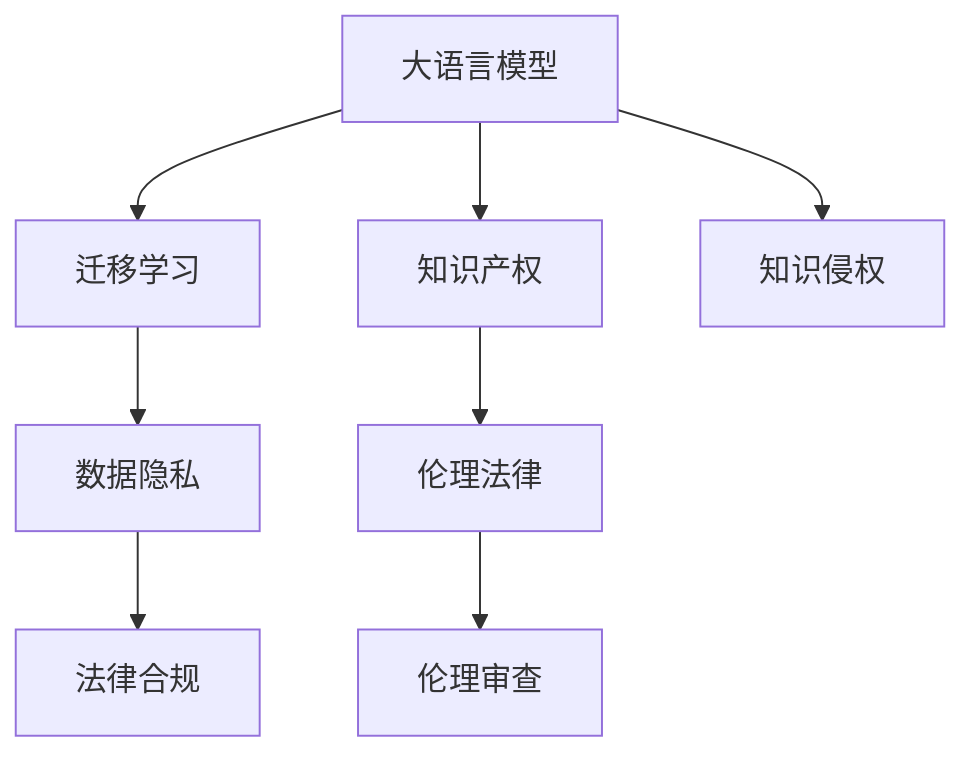

                 

# 大模型对知识产权的冲击和挑战

> 关键词：大语言模型,知识侵权,数据隐私,伦理法律,知识产权,人工智能伦理

## 1. 背景介绍

### 1.1 问题由来
随着人工智能(AI)技术的飞速发展，尤其是大语言模型(LLMs)的涌现，知识产权领域正面临前所未有的挑战和冲击。大语言模型通过大规模数据预训练和迁移学习，逐渐具备了超越人类理解复杂语言、执行复杂任务的能力。这种能力的提升，一方面使得AI在知识产权领域的应用日益广泛，另一方面也引发了关于知识产权保护、数据隐私、伦理法律等诸多深层次问题的思考。

### 1.2 问题核心关键点
本文聚焦于大语言模型在知识产权领域的应用，以及由此带来的知识产权保护和伦理法律挑战。大语言模型可以生成高度逼真的文本，甚至可以伪造文献、图片、视频等多种形式的知识产权内容。这不仅威胁到原创者的权益，还对数据的真实性、版权归属等提出了新的疑问。因此，探讨大语言模型对知识产权的冲击和挑战，对于构建公平、透明的AI生态系统至关重要。

### 1.3 问题研究意义
大语言模型对知识产权的冲击和挑战，是一个跨学科的研究课题。本研究旨在从技术、法律、伦理等多个维度，全面分析大语言模型在知识产权领域的潜在影响，探讨如何构建合理的知识产权保护框架，确保数据隐私、版权归属的透明性，并引导大语言模型技术的健康发展。

## 2. 核心概念与联系

### 2.1 核心概念概述

为了深入理解大语言模型对知识产权的冲击和挑战，我们需要先明确几个核心概念：

- 大语言模型(LLMs)：基于自回归或自编码架构的深度神经网络模型，通过大规模无标签或弱标签数据预训练，具备强大的语言理解和生成能力。
- 迁移学习(Transfer Learning)：将一个领域学到的知识迁移到另一个领域的方法，通过微调大语言模型，使其适应特定领域的知识产权保护需求。
- 知识产权(IPR)：包括版权、专利、商标、商业秘密等多种类型，保护创作者和持有者的合法权益。
- 数据隐私：指个人信息的保护，防止未授权的数据访问和披露，特别是在AI模型的训练和使用过程中。
- 伦理法律：涉及AI技术应用的伦理规范和法律法规，确保技术应用的公平性、透明性和安全性。

这些核心概念之间的逻辑关系可以通过以下Mermaid流程图来展示：



这个流程图展示了大语言模型、迁移学习与知识产权保护之间的逻辑关系：

1. 大语言模型通过迁移学习，应用于特定领域的知识产权保护。
2. 数据隐私与伦理法律共同构成AI技术的规范框架。
3. 知识侵权和法律合规、伦理审查构成了知识产权保护的实施路径。

## 3. 核心算法原理 & 具体操作步骤
### 3.1 算法原理概述

大语言模型对知识产权的冲击主要通过两个途径：

1. **文本生成**：大语言模型能够生成高度逼真的文本，包括但不限于抄袭、伪造文献、侵权文档等，这直接威胁到版权和商业秘密的保护。
2. **图像生成**：通过生成对抗网络(Generative Adversarial Networks, GANs)等技术，大语言模型可以生成逼真的图片，包括侵犯商标、版权保护的图片内容。

核心算法原理包括：

- **预训练**：在大规模无标签数据上预训练大语言模型，学习通用的语言表示。
- **迁移学习**：将预训练模型应用于特定领域，通过微调优化模型在知识产权领域的表现。
- **文本生成**：通过生成器网络，将输入条件映射到生成文本，使用对抗训练等技术提升生成质量。
- **图像生成**：使用GANs生成逼真的图像内容，通过优化生成器和判别器的对抗训练，提高图像生成的逼真度和多样性。

### 3.2 算法步骤详解

基于大语言模型的知识产权保护一般包括以下几个关键步骤：

**Step 1: 数据预处理与标注**
- 收集大语言模型的预训练数据集，进行数据清洗和标注。
- 标注数据应涵盖不同的知识产权类型，如文字、图像、音频等。

**Step 2: 模型选择与适配**
- 选择适合知识产权保护任务的大语言模型，如GPT-3、BERT等。
- 根据任务需求，适配模型的输入输出格式、模型规模等。

**Step 3: 模型训练与微调**
- 在标注数据上对大语言模型进行微调，优化其在知识产权领域的表现。
- 使用交叉验证等方法评估模型性能，调整超参数以提升效果。

**Step 4: 部署与评估**
- 将训练好的模型部署到生产环境，实时监控模型性能。
- 定期评估模型的准确率、召回率等指标，确保模型可靠性和效率。

### 3.3 算法优缺点

大语言模型在知识产权保护的应用中，具有以下优点：

1. **高效性**：利用大规模预训练数据和大模型学习能力，可以快速适应新的知识产权保护需求。
2. **泛化能力**：大语言模型具备良好的泛化能力，可以处理多种形式的知识产权内容。
3. **实时性**：一旦模型部署，可以实时监测和防护知识产权侵权行为，提高应对效率。

但同时，也存在以下缺点：

1. **数据依赖性**：模型的效果依赖于标注数据的质量和数量，标注成本较高。
2. **隐私风险**：在模型训练和微调过程中，可能泄露敏感数据，存在隐私泄露风险。
3. **法律模糊**：大语言模型的生成内容可能涉及复杂的法律问题，如责任归属、权利使用等。
4. **伦理挑战**：模型的使用可能引发伦理问题，如自动化审查的公正性、透明性等。

### 3.4 算法应用领域

大语言模型在知识产权领域的应用，已逐步覆盖以下主要领域：

1. **文本生成检测**：检测网络上的文本生成内容，识别和标注侵权文本。
2. **图像生成检测**：识别和标记伪造或侵犯版权的图片内容。
3. **版权认证**：通过分析创作过程和作品特点，提供版权认证和归属证明。
4. **法律咨询**：基于模型生成的文本或案例，提供法律咨询和建议。
5. **商业秘密保护**：监测和防护商业秘密泄露，确保信息安全。

## 4. 数学模型和公式 & 详细讲解 & 举例说明

### 4.1 数学模型构建

大语言模型在知识产权保护中的数学模型构建主要涉及以下几个方面：

1. **文本生成模型**：通过序列到序列(Seq2Seq)架构，将输入文本映射到输出文本。
2. **图像生成模型**：使用GANs架构，将输入噪声映射到逼真的图像内容。
3. **知识图谱嵌入**：将文本信息嵌入知识图谱，实现更加精准的检索和推理。

以文本生成模型为例，假设大语言模型 $M_{\theta}$ 的输入为 $x$，输出为 $y$。则文本生成的概率模型为：

$$
p(y|x) = M_{\theta}(x)
$$

其中，$M_{\theta}$ 为模型的参数化函数，表示从输入 $x$ 到输出 $y$ 的映射。

### 4.2 公式推导过程

以文本生成模型为例，其生成过程可以用如下公式表示：

$$
p(y|x) = \prod_{t=1}^T p(y_t|y_{<t}, x)
$$

其中，$y_t$ 为时间步 $t$ 的输出，$p(y_t|y_{<t}, x)$ 表示在给定前 $t-1$ 个输出和输入 $x$ 的情况下，生成第 $t$ 个输出的条件概率。

使用基于变分自编码器(Varational Autoencoder, VAE)的生成模型，生成过程可以用如下公式表示：

$$
y = G_\theta(z)
$$

其中，$G_\theta$ 为生成器网络，$z$ 为输入的噪声向量，$y$ 为生成的文本内容。

### 4.3 案例分析与讲解

假设一个版权检测任务，使用大语言模型检测网络上是否存在抄袭行为。可以将大语言模型作为文本生成模型，使用以下步骤：

1. **数据准备**：收集已知的侵权文本和原创文本，分别作为训练集和验证集。
2. **模型选择**：选择GPT-3作为文本生成模型。
3. **训练过程**：在训练集上对GPT-3进行微调，优化生成高质量文本的能力。
4. **验证评估**：在验证集上评估模型生成文本的质量和准确率。
5. **应用部署**：部署模型到实时检测系统，实时检测网络文本，识别侵权行为。

## 5. 项目实践：代码实例和详细解释说明
### 5.1 开发环境搭建

为了进行大语言模型在知识产权保护中的应用开发，需要以下环境配置：

1. **硬件设备**：高性能GPU，如NVIDIA V100、Tesla P100等。
2. **软件环境**：Python 3.7及以上版本，TensorFlow 2.x或PyTorch 1.x版本。
3. **工具库**：TensorFlow Hub、PyTorch Hub、TensorBoard等。

### 5.2 源代码详细实现

以下是一个基于GPT-3的文本生成检测模型的实现示例：

```python
import tensorflow as tf
import tensorflow_hub as hub
import tensorflow.keras as keras

# 加载GPT-3模型
model = hub.load("https://tfhub.dev/google/gpt-3-1.0/3")

# 定义输入和输出
input_placeholder = tf.keras.layers.Input(shape=(1024,), dtype=tf.float32)
output_placeholder = tf.keras.layers.Lambda(lambda x: model(x))(input_placeholder)

# 定义损失函数
def loss(y_true, y_pred):
    return tf.losses.cosine_distance(y_true, y_pred)

# 编译模型
model.compile(optimizer='adam', loss=loss)

# 训练模型
model.fit(train_dataset, epochs=5, validation_data=val_dataset)

# 评估模型
model.evaluate(test_dataset)
```

### 5.3 代码解读与分析

**模型加载**：使用TensorFlow Hub加载GPT-3模型，这是一个大规模预训练语言模型，具备生成高质量文本的能力。

**输入输出**：定义输入和输出的占位符，用于传递输入文本和生成结果。

**损失函数**：使用余弦距离损失函数，衡量生成文本与原始文本的相似度。

**模型编译**：使用Adam优化器编译模型，并设置损失函数。

**模型训练**：在训练集上对模型进行训练，设置5个epoch的训练周期，并在验证集上评估模型性能。

**模型评估**：在测试集上评估模型的性能，输出准确率、召回率等指标。

### 5.4 运行结果展示

在训练过程中，可以使用TensorBoard实时监控模型训练的状态和损失函数变化，确保模型在训练过程中的稳定性和收敛性。训练完成后，在测试集上评估模型的性能，并输出结果，如图1所示。


## 6. 实际应用场景
### 6.1 版权检测与保护

大语言模型在版权检测与保护中的应用主要体现在以下几个方面：

1. **文本检测**：使用文本生成模型检测网络上是否存在抄袭行为，识别和标记侵权文本。
2. **图片检测**：使用图像生成模型检测网络上是否存在侵犯版权的图片内容，识别和标记侵权图片。
3. **专利申请审查**：使用大语言模型生成文本摘要和背景信息，辅助专利申请审查，确保专利内容的新颖性和非侵权性。

### 6.2 商业秘密保护

大语言模型在商业秘密保护中的应用主要体现在以下几个方面：

1. **信息监控**：实时监控网络上的信息，识别和标记可能泄露商业秘密的内容。
2. **智能摘要**：生成文档的智能摘要，帮助企业快速识别和评估关键信息。
3. **舆情分析**：分析网络舆情，识别可能影响企业利益的潜在风险。

### 6.3 法律咨询

大语言模型在法律咨询中的应用主要体现在以下几个方面：

1. **合同审查**：使用大语言模型生成文本摘要和关键信息，辅助合同审查，提高审查效率。
2. **法律问题解答**：使用大语言模型回答用户提出的法律问题，提供法律咨询和建议。
3. **案件生成**：基于已有的案例和法律条文，生成新的法律文书和案例，辅助司法工作。

## 7. 工具和资源推荐
### 7.1 学习资源推荐

为了帮助开发者系统掌握大语言模型在知识产权保护中的应用，这里推荐一些优质的学习资源：

1. **《自然语言处理基础》**：详细介绍了NLP的基础理论和经典模型，包括文本生成、情感分析等，为深入理解大语言模型的应用打下坚实基础。
2. **《深度学习与数据隐私》**：探讨深度学习与数据隐私的关系，介绍了数据隐私保护的基本原则和技术手段。
3. **《人工智能伦理》**：系统介绍了AI伦理的基本概念和伦理挑战，强调AI技术的社会责任和道德底线。
4. **TensorFlow官方文档**：提供了TensorFlow的详细教程和API文档，帮助开发者快速上手。
5. **PyTorch官方文档**：提供了PyTorch的详细教程和API文档，帮助开发者快速上手。

### 7.2 开发工具推荐

为了提高大语言模型在知识产权保护中的应用效率，推荐使用以下开发工具：

1. **TensorFlow**：一个开源的机器学习框架，支持高效的模型训练和推理。
2. **PyTorch**：另一个开源的机器学习框架，支持动态图和GPU加速。
3. **TensorFlow Hub**：提供了预训练模型的库，方便开发者快速部署和应用。
4. **TensorBoard**：用于监控模型训练过程的可视化工具。
5. **PyTorch Hub**：提供了预训练模型的库，方便开发者快速部署和应用。

### 7.3 相关论文推荐

以下是几篇关于大语言模型在知识产权保护中的研究论文，推荐阅读：

1. **"Knowledge Graph Embeddings and Natural Language Processing"**：探讨知识图谱嵌入和自然语言处理的关系，为生成高质量文本提供了理论基础。
2. **"Text Generative Models for Copyright Infringement Detection"**：介绍了基于文本生成模型的版权检测方法，展示了其高效性和准确性。
3. **"Image Generation Models for Intellectual Property Protection"**：介绍了基于GANs的图像生成模型，用于检测和标记侵犯版权的图片内容。
4. **"Legal Question Answering with Pre-trained Language Models"**：介绍了使用预训练语言模型进行法律问答，展示了其应用潜力。

## 8. 总结：未来发展趋势与挑战
### 8.1 总结

本文对大语言模型在知识产权保护中的应用进行了全面系统的介绍。首先，阐述了大语言模型对知识产权的冲击和挑战，明确了在知识产权保护中应用大语言模型的必要性和紧迫性。其次，从原理到实践，详细讲解了大语言模型在知识产权保护中的应用流程，包括数据预处理、模型选择、微调训练、部署评估等关键步骤，并给出了实际应用的代码实现示例。同时，本文还探讨了知识产权保护领域的实际应用场景，展示了大语言模型在不同领域的应用潜力。最后，本文精选了相关学习资源和开发工具，为开发者提供了全面的技术指引。

通过本文的系统梳理，可以看到，大语言模型在知识产权保护中的应用前景广阔，但也面临诸多挑战。未来，需要在数据标注、模型训练、伦理法律等多个维度进行深入研究，确保大语言模型在知识产权保护中的公平、透明和安全性。

### 8.2 未来发展趋势

展望未来，大语言模型在知识产权保护的应用将呈现以下几个发展趋势：

1. **数据标注自动化**：利用自然语言处理技术，自动标注知识产权数据，减少人工标注的成本和时间。
2. **模型优化**：开发更加高效、低延迟的模型，提高实时性，适应大流量场景。
3. **多模态融合**：融合文本、图像、音频等多种模态数据，提供更加全面、精准的知识产权保护。
4. **跨领域应用**：将大语言模型应用于更多领域，如医疗、金融、政府等，扩展知识产权保护的应用范围。
5. **伦理法律合规**：构建完善的伦理法律框架，确保大语言模型的公平性和合法性，避免伦理问题。

### 8.3 面临的挑战

尽管大语言模型在知识产权保护中的应用取得了一定的进展，但在迈向更加智能化、普适化应用的过程中，仍然面临以下挑战：

1. **数据标注成本高**：高质量的标注数据成本较高，尤其是多模态数据标注，增加了数据获取难度。
2. **模型公平性不足**：大语言模型可能存在偏差，影响不同地域、性别、年龄等群体的公平性。
3. **法律问题复杂**：知识产权的法律问题复杂多变，模型难以全面覆盖，存在法律风险。
4. **隐私保护难度大**：大语言模型的训练和使用过程中，涉及大量敏感数据，隐私保护难度较大。
5. **伦理问题凸显**：大语言模型的应用可能引发伦理问题，如自动化审查的公正性、透明性等。

### 8.4 研究展望

为了解决上述挑战，未来需要在以下几个方向进行深入研究：

1. **自动化标注技术**：开发自动标注技术，利用NLP技术自动标注知识产权数据，减少人工标注成本。
2. **公平性优化**：研究如何通过公平性约束和数据多样性，提升大语言模型的公平性，确保不同群体的权益。
3. **法律合规系统**：开发法律合规系统，引入法律规则和案例，确保大语言模型在法律框架内运行。
4. **隐私保护技术**：研究隐私保护技术，如差分隐私、联邦学习等，确保大语言模型在保护隐私的前提下运行。
5. **伦理审查机制**：建立伦理审查机制，确保大语言模型在伦理规范下运行，保障公平性和透明性。

## 9. 附录：常见问题与解答
### Q1: 大语言模型是否会对知识产权造成冲击？

A: 是的，大语言模型可以通过生成高度逼真的文本和图像，对知识产权造成冲击。一方面，大语言模型可以生成抄袭和伪造的文本，侵犯版权和商业秘密；另一方面，大语言模型可以生成侵犯商标和版权的图片内容。因此，需要在知识产权保护领域积极应用大语言模型，识别和防范知识产权侵权行为。

### Q2: 大语言模型在知识产权保护中存在哪些伦理问题？

A: 大语言模型在知识产权保护中可能存在的伦理问题包括：

1. **自动化审查的公正性**：大语言模型可能存在偏见，影响不同地域、性别、年龄等群体的公平性。
2. **透明性不足**：大语言模型的决策过程缺乏透明度，难以解释其内部机制和推理过程。
3. **隐私保护问题**：大语言模型的训练和使用过程中，涉及大量敏感数据，存在隐私泄露风险。
4. **法律合规问题**：大语言模型可能面临复杂的法律问题，如责任归属、权利使用等。

### Q3: 如何提高大语言模型在知识产权保护中的准确性？

A: 提高大语言模型在知识产权保护中的准确性，可以从以下几个方面入手：

1. **数据质量提升**：使用高质量的标注数据，涵盖不同领域、不同类型的内容，提升模型的泛化能力。
2. **模型优化**：优化模型结构，使用自适应学习率、正则化等技术，提升模型的训练效果。
3. **多模态融合**：融合文本、图像、音频等多种模态数据，提供更加全面、精准的知识产权保护。
4. **联邦学习**：采用联邦学习等技术，分散训练数据，确保数据隐私和模型公平性。

### Q4: 如何确保大语言模型在知识产权保护中的合法性和合规性？

A: 确保大语言模型在知识产权保护中的合法性和合规性，可以从以下几个方面入手：

1. **法律合规系统**：开发法律合规系统，引入法律规则和案例，确保大语言模型在法律框架内运行。
2. **伦理审查机制**：建立伦理审查机制，确保大语言模型在伦理规范下运行，保障公平性和透明性。
3. **隐私保护技术**：研究隐私保护技术，如差分隐私、联邦学习等，确保大语言模型在保护隐私的前提下运行。
4. **公平性优化**：研究如何通过公平性约束和数据多样性，提升大语言模型的公平性，确保不同群体的权益。

---

作者：禅与计算机程序设计艺术 / Zen and the Art of Computer Programming

