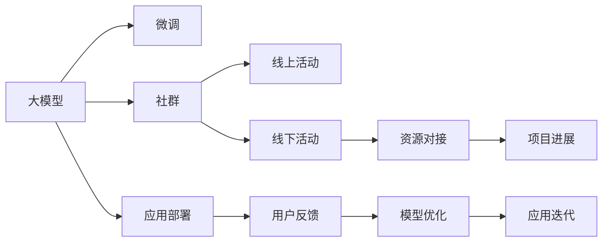

                 

## 1. 背景介绍

### 1.1 问题由来
近年来，人工智能（AI）技术的迅猛发展为创业者提供了一系列新的机会和挑战。特别是大模型的出现，使得基于深度学习的应用变得前所未有的普及和高效。然而，对于大部分创业者来说，如何利用大模型进行创新和优化，同时构建一个能支持长期发展的社群和资源网络，成为了一个重要的课题。本文将聚焦于大模型时代的创业者社群运营，包括线上社群、线下活动与资源对接等方面，提供实用的技术指引和案例分析。

### 1.2 问题核心关键点
- **大模型应用**：如何高效利用大模型进行产品开发和创新。
- **社群构建**：如何吸引并维持高质量的创业者社群。
- **线下活动**：如何组织线下活动以促进社群交流与合作。
- **资源对接**：如何有效对接外部资源，加速项目进展。

## 2. 核心概念与联系

### 2.1 核心概念概述

1. **大模型（Large Model）**：指基于深度学习技术，规模庞大、能力强大的预训练模型，如BERT、GPT-3等，广泛应用于自然语言处理（NLP）、计算机视觉（CV）等多个领域。

2. **微调（Fine-tuning）**：在大模型基础上，针对特定任务进行有监督学习优化，使其能更好地适应具体应用场景。

3. **社群（Community）**：由具有相似兴趣、背景和目标的个体组成的集体，通过线上和线下活动促进交流与合作。

4. **线下活动（Offline Event）**：通过面对面的交流和合作，促进社群成员之间的深度互动。

5. **资源对接（Resource Matching）**：将创业者与所需的资源、资金、技术和人才等对接，加速项目发展。

### 2.2 核心概念原理和架构的 Mermaid 流程图



这个流程图展示了大模型、微调、社群、线上线下活动和资源对接之间的联系：

- 大模型通过微调适应具体任务，然后应用于实际产品中。
- 社群通过线上线下活动加强交流，形成紧密的合作网络。
- 资源对接促进了技术、资金、人才等的有效流动。
- 用户反馈和应用迭代不断优化模型和产品。

## 3. 核心算法原理 & 具体操作步骤
### 3.1 算法原理概述

在大模型时代，创业者可以利用大模型进行创新应用开发。具体的流程包括：

1. **数据收集**：收集与特定任务相关的数据集。
2. **模型微调**：在大模型基础上进行有监督学习，优化模型性能。
3. **产品开发**：基于微调后的模型开发具体产品。
4. **社群建设**：通过线上线下活动吸引高质量的创业者，建立稳定的社群。
5. **资源对接**：利用社群网络，对接外部资源，加速项目进展。

### 3.2 算法步骤详解

#### 3.2.1 数据收集
- **数据源**：来自公开数据集、用户生成的数据、合作伙伴的数据等。
- **数据格式**：文本、图片、视频等多种形式。
- **数据标注**：对于需要监督学习任务，如分类、识别等，需要标注大量数据。

#### 3.2.2 模型微调
- **选择合适的模型**：如BERT、GPT-3等，根据任务需求进行选择。
- **数据预处理**：清洗、归一化、分块等。
- **设置微调参数**：如学习率、迭代次数、正则化等。
- **训练**：在GPU/TPU上使用深度学习框架（如PyTorch、TensorFlow等）进行训练。
- **评估**：使用验证集评估模型性能，进行参数调优。

#### 3.2.3 产品开发
- **API集成**：将微调后的模型集成到产品中，提供API服务。
- **用户交互**：设计用户界面，提升用户体验。
- **部署上线**：选择云平台（如AWS、GCP等）进行模型部署。
- **监控优化**：实时监控模型性能，根据反馈进行优化。

#### 3.2.4 社群建设
- **线上平台**：使用社交网络（如微信、Slack）、专业论坛等进行社群搭建。
- **内容创作**：发布技术文章、案例分享、项目展示等。
- **活动组织**：定期举办线上线下的技术研讨会、黑客松、沙龙等活动。
- **互动交流**：鼓励成员积极参与讨论，分享经验和资源。

#### 3.2.5 资源对接
- **资源识别**：识别项目所需的资源，如资金、技术、人才等。
- **匹配平台**：使用线上平台（如AngelList、GitHub等）进行资源对接。
- **合作谈判**：进行初步的沟通和谈判，签订合作协议。
- **项目推进**：协同推进项目，实现共赢。

### 3.3 算法优缺点

#### 3.3.1 优点
- **高效开发**：利用大模型可以快速迭代产品，缩短研发周期。
- **社群力量**：通过社群网络，加速资源对接和项目推进。
- **社区互动**：线上线下活动促进成员间的深度交流和合作。

#### 3.3.2 缺点
- **数据成本**：标注高质量数据集需要大量时间和成本。
- **模型调优**：微调过程中需要反复调试，可能耗费较多时间。
- **资源对接**：需要花费一定精力进行资源识别和匹配。

### 3.4 算法应用领域

#### 3.4.1 金融科技
- **应用场景**：利用大模型进行智能投顾、信用评估、风险管理等。
- **案例**：某金融科技公司利用BERT进行信用评分模型微调，显著提高了模型准确率和用户体验。

#### 3.4.2 医疗健康
- **应用场景**：使用大模型进行疾病诊断、健康管理、基因分析等。
- **案例**：某医疗公司使用GPT-3进行医学文献的自动摘要和分类，提高了医生的工作效率。

#### 3.4.3 教育科技
- **应用场景**：利用大模型进行智能辅导、内容推荐、学习分析等。
- **案例**：某教育公司使用BERT进行阅读理解模型微调，实现了个性化学习推荐。

#### 3.4.4 智能制造
- **应用场景**：通过大模型进行设备预测维护、供应链优化、质量检测等。
- **案例**：某制造公司利用大模型进行设备故障预测，减少了停机时间，提高了生产效率。

## 4. 数学模型和公式 & 详细讲解 & 举例说明

### 4.1 数学模型构建

为了展示大模型微调的一般流程，这里构建一个简单的数学模型。假设有一个文本分类任务，需要训练一个线性分类器 $f(x;w)$：

$$
f(x;w) = wx^T + b
$$

其中 $w$ 是模型参数，$x$ 是输入文本，$b$ 是偏置项。

### 4.2 公式推导过程

对于文本分类任务，常用的损失函数是交叉熵损失（Cross-Entropy Loss）：

$$
L = -\frac{1}{N}\sum_{i=1}^N\sum_{j=1}^C y_{i,j}\log f(x_i;w)
$$

其中 $N$ 是样本数量，$C$ 是类别数量，$y_{i,j}$ 表示样本 $i$ 属于类别 $j$ 的标签。

### 4.3 案例分析与讲解

以某智能客服系统的开发为例，进行详细讲解：

- **数据收集**：收集历史客服对话数据，标注问题和回答。
- **模型微调**：选择预训练的BERT模型，针对问题生成和回答匹配任务进行微调。
- **产品开发**：构建智能客服应用，提供即时的自然语言理解和回答服务。
- **社群建设**：通过线上平台和线下活动，吸引更多创业者加入。
- **资源对接**：通过社群网络，对接AI技术供应商和潜在客户。

## 5. 项目实践：代码实例和详细解释说明

### 5.1 开发环境搭建

- **环境准备**：
  - 安装Python 3.8及以上版本。
  - 安装Anaconda和Miniconda。
  - 安装深度学习框架（如PyTorch、TensorFlow等）。

- **虚拟环境配置**：
  - 创建虚拟环境：`conda create -n my_env python=3.8`
  - 激活虚拟环境：`conda activate my_env`

### 5.2 源代码详细实现

#### 5.2.1 数据预处理

```python
import pandas as pd
from transformers import BertTokenizer

# 加载数据
data = pd.read_csv('customer_support.csv')

# 数据清洗
data = data.dropna(subset=['question', 'answer'])

# 分块处理
max_len = 128
data['input_ids'] = data['question'].apply(lambda x: [0] * (max_len - len(x)) + list(map(tokenizer.encode, x)))
data['attention_mask'] = data['input_ids'].apply(lambda x: [0] * max_len)
data['labels'] = data['answer'].apply(lambda x: [1] if x.lower() in data['answer'] else [0])

# 转换为Tensor
data = pd.DataFrame(data, columns=['input_ids', 'attention_mask', 'labels'])
data = data.to_numpy()
```

#### 5.2.2 模型微调

```python
from transformers import BertForSequenceClassification, AdamW, Trainer, TrainingArguments

# 初始化模型
model = BertForSequenceClassification.from_pretrained('bert-base-cased', num_labels=2)
tokenizer = BertTokenizer.from_pretrained('bert-base-cased')

# 设置优化器和训练参数
optimizer = AdamW(model.parameters(), lr=2e-5)
training_args = TrainingArguments(output_dir='./model', evaluation_strategy='epoch', save_strategy='epoch')

# 定义数据集
train_dataset = data[:80000]
val_dataset = data[80000:]

# 定义训练器
trainer = Trainer(model=model, args=training_args, train_dataset=train_dataset, eval_dataset=val_dataset)
```

#### 5.2.3 产品开发

- **API接口设计**：
  - 输入：文本（自然语言）。
  - 输出：预测类别。

- **开发示例**：

  ```python
  # 引入API接口
  from fastapi import FastAPI, Request

  # 创建FastAPI应用
  app = FastAPI()

  # 定义路由
  @app.get('/classify')
  def classify(text: str):
      # 调用模型预测
      inputs = tokenizer.encode(text, return_tensors='pt')
      outputs = model(inputs['input_ids'], attention_mask=inputs['attention_mask'])
      return outputs.argmax(axis=1)
  ```

### 5.3 代码解读与分析

#### 5.3.1 数据预处理
- **数据清洗**：移除空值和无关数据。
- **分块处理**：将问题文本切分成指定长度的块，并进行padding。
- **标签处理**：将答案转换为二分类标签。

#### 5.3.2 模型微调
- **模型初始化**：选择预训练的BERT模型，并设定分类任务。
- **优化器和训练参数**：定义AdamW优化器和训练参数。
- **数据集划分**：将数据划分为训练集和验证集。
- **训练器定义**：定义Trainer对象，指定模型、优化器、数据集等参数。

#### 5.3.3 产品开发
- **API接口设计**：定义一个简单的API接口，用于预测文本分类。
- **FastAPI应用**：使用FastAPI框架，创建API服务器。

#### 5.3.4 运行结果展示
- **训练效果**：
  - 在训练集和验证集上评估模型性能，记录准确率、F1分数等指标。
  - 模型微调过程：训练曲线、损失函数变化等。
- **产品效果**：
  - 实际应用中，输入文本后返回预测分类结果。
  - 用户体验反馈，评估系统可用性。

## 6. 实际应用场景

### 6.1 智能客服系统
- **应用场景**：使用微调模型实现智能客服，提升客户满意度。
- **实际效果**：通过不断优化模型，智能客服系统能够在高峰期快速响应客户咨询，并提供精准的解答。

### 6.2 金融舆情监测
- **应用场景**：利用微调模型进行金融舆情分析，及时发现负面信息，规避风险。
- **实际效果**：通过实时监控网络舆情，金融机构能够及时应对潜在风险，保护客户资产。

### 6.3 个性化推荐系统
- **应用场景**：利用微调模型进行个性化推荐，提升用户粘性和满意度。
- **实际效果**：通过分析用户行为数据，智能推荐系统能够为用户推荐更合适的产品，增加转化率。

### 6.4 未来应用展望
- **多模态融合**：将文本、图像、语音等多模态数据进行融合，提升模型泛化能力。
- **跨领域应用**：拓展到大健康、智能制造等更多领域，提供定制化解决方案。
- **边缘计算**：在边缘设备上进行模型部署，实现低延迟、高带宽的实时应用。
- **联邦学习**：在多方合作下进行模型微调，保护数据隐私和模型安全。

## 7. 工具和资源推荐

### 7.1 学习资源推荐

- **书籍**：
  - 《深度学习》 by Ian Goodfellow
  - 《自然语言处理综述》 by Jurafsky & Martin
  - 《Python深度学习》 by François Chollet

- **在线课程**：
  - Coursera的《Deep Learning Specialization》
  - edX的《Machine Learning for Healthcare》
  - Udacity的《Intro to Machine Learning with PyTorch》

- **社区和论坛**：
  - Kaggle
  - Stack Overflow
  - GitHub

### 7.2 开发工具推荐

- **深度学习框架**：
  - PyTorch
  - TensorFlow
  - JAX

- **数据处理工具**：
  - Pandas
  - NumPy
  - Scikit-learn

- **模型微调工具**：
  - Transformers
  - Hugging Face
  - PyTorch Hub

### 7.3 相关论文推荐

- **预训练模型**：
  - BERT: Pre-training of Deep Bidirectional Transformers for Language Understanding
  - GPT-3: Language Models are Unsupervised Multitask Learners

- **微调方法**：
  - Fine-tuning for Text Classification with Pre-trained Embeddings
  - Parameter-Efficient Learning of Language Representations

## 8. 总结：未来发展趋势与挑战

### 8.1 研究成果总结
- **技术进步**：大模型的性能不断提升，微调方法的不断优化，使得其在大模型时代的应用更加广泛和高效。
- **社会效益**：智能客服、金融舆情、个性化推荐等应用，显著提升了各行业的效率和用户体验。

### 8.2 未来发展趋势
- **算法迭代**：更多高效、参数化的微调方法将被开发，提升模型的效率和灵活性。
- **模型融合**：大模型与小模型的结合，以及多模态数据的融合，将使得模型更加全面和通用。
- **用户参与**：更多用户生成数据和反馈，将用于模型训练和优化，进一步提升模型的可解释性和实用性。

### 8.3 面临的挑战
- **数据稀缺**：高质量标注数据获取难度大，限制了模型性能提升。
- **模型泛化**：模型在特定领域的泛化能力有待提升，需要更多的跨领域数据和应用。
- **资源整合**：跨机构、跨领域的资源整合难度大，需要更多的合作机制和技术支持。

### 8.4 研究展望
- **数据增强**：利用数据增强技术提升模型性能，缓解数据稀缺问题。
- **跨领域微调**：探索跨领域的微调方法，提升模型的泛化能力。
- **用户生成内容**：利用用户生成内容进行模型训练和优化，增强模型的实用性和可解释性。

## 9. 附录：常见问题与解答

**Q1: 如何高效利用大模型进行微调？**
A: 选择合适的模型和任务，设计合理的训练流程，注意正则化和优化器的选择。

**Q2: 社群运营中如何吸引高质量成员？**
A: 提供有价值的内容，定期举办线上线下活动，建立良好的交流机制。

**Q3: 资源对接过程中需要注意哪些方面？**
A: 明确对接需求，使用高效的匹配平台，进行初步沟通和谈判。

**Q4: 如何应对数据稀缺问题？**
A: 利用数据增强技术，引入无监督学习范式，探索半监督和弱监督学习。

**Q5: 如何提高模型的泛化能力？**
A: 引入跨领域数据，进行多模态融合，探索因果学习和联邦学习。

---

作者：禅与计算机程序设计艺术 / Zen and the Art of Computer Programming

