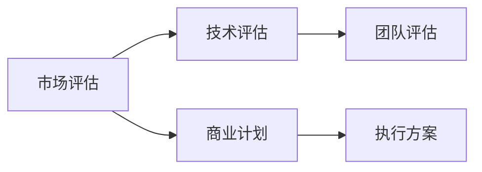

                 

# 大模型时代的创业者商业计划书评估：市场评估、技术评估与团队评估

在大模型时代，人工智能技术的发展已经深刻影响了各行各业，企业创业者们纷纷借助大模型技术推动商业模式的创新。然而，构建成功的商业计划书并非易事，它需要企业在市场、技术、团队等方面进行全面评估。本文将从市场评估、技术评估与团队评估三个维度，深入探讨大模型时代的创业者如何撰写出一份优秀的商业计划书，助力其在激烈的市场竞争中脱颖而出。

## 1. 背景介绍

### 1.1 问题由来
随着深度学习和大模型技术的发展，越来越多的企业开始将人工智能引入商业模式创新中。然而，由于市场竞争激烈、技术壁垒高，许多企业难以撰写出一份引人注目的商业计划书。特别是在大模型时代，企业需要对其市场定位、技术选型和团队组成进行全面评估，才能撰写出一份科学的商业计划书，赢得投资者和市场的青睐。

### 1.2 问题核心关键点
成功的商业计划书应包含市场评估、技术评估和团队评估三大核心部分。市场评估帮助企业理解市场需求和竞争环境，技术评估确保技术方案可行和具有创新性，团队评估则考察团队成员的能力和协作水平。

## 2. 核心概念与联系

### 2.1 核心概念概述

为更好地理解大模型时代创业者商业计划书的撰写，我们需对以下核心概念进行解释：

- **市场评估(Market Assessment)**：通过市场调研和数据分析，评估目标市场的需求、竞争格局、发展趋势等，明确企业进入市场的时机和策略。
- **技术评估(Technology Assessment)**：基于技术选型、实现路径、风险评估等方面，判断技术的可行性和创新性，确保技术方案具有竞争力。
- **团队评估(Team Assessment)**：考察团队成员的专业技能、经验背景、合作精神等方面，评估团队的整体实力和协作能力，确保团队能够实现商业计划。

这些概念之间存在紧密联系。市场评估为技术选型和团队评估提供方向和依据，技术评估保证商业计划的可行性，团队评估确保商业计划的执行力。三者共同构成商业计划的坚实基础。

### 2.2 核心概念原理和架构的 Mermaid 流程图

以下是一个简单的Mermaid流程图，展示了市场评估、技术评估和团队评估之间的逻辑关系：



这个流程图表明，市场评估和团队评估是技术评估的前提，技术评估是商业计划的保障，商业计划是执行方案的依据，而执行方案则依赖于技术评估和团队评估的成果。

## 3. 核心算法原理 & 具体操作步骤

### 3.1 算法原理概述

市场评估、技术评估和团队评估的流程，本质上是基于数据驱动和专家意见的决策过程。市场评估依赖于市场调研数据，技术评估依赖于技术方案的可行性分析，团队评估则需结合专家意见和团队经验。

### 3.2 算法步骤详解

#### 3.2.1 市场评估步骤

1. **目标市场调研**：通过问卷调查、访谈、数据分析等手段，收集目标市场的数据，如市场规模、增长率、用户需求等。
2. **竞争环境分析**：分析竞争对手的优劣势、市场占有率、技术壁垒等，了解市场竞争格局。
3. **市场机会识别**：识别市场中的机会和风险，评估进入市场的时机和策略。

#### 3.2.2 技术评估步骤

1. **技术选型**：选择适合企业的技术方案，如深度学习、自然语言处理、计算机视觉等。
2. **实现路径分析**：分析技术实现的具体步骤、所需资源、时间成本等。
3. **技术风险评估**：评估技术方案的风险，如算法复杂度、数据隐私、计算资源等。

#### 3.2.3 团队评估步骤

1. **专业技能评估**：评估团队成员在技术、业务、管理等方面的专业技能。
2. **经验背景评估**：评估团队成员的工作经验、项目经历等。
3. **合作精神评估**：评估团队成员的合作态度、沟通能力等。

### 3.3 算法优缺点

#### 3.3.1 市场评估的优缺点

**优点**：
- 能够全面了解市场环境和竞争态势，有助于企业制定合理的市场进入策略。
- 通过数据分析，提高决策的科学性和客观性。

**缺点**：
- 市场调研和数据分析工作量大，成本较高。
- 市场环境变化快，评估结果可能存在滞后性。

#### 3.3.2 技术评估的优缺点

**优点**：
- 通过技术选型和实现路径分析，明确技术方案的可行性和创新性。
- 技术风险评估有助于企业提前规避风险。

**缺点**：
- 技术选型和评估依赖于专业知识和经验，可能导致评估结果不准确。
- 技术方案的实现可能存在技术瓶颈和资源限制。

#### 3.3.3 团队评估的优缺点

**优点**：
- 通过专业技能、经验背景和合作精神的评估，明确团队的能力和协作水平。
- 团队评估有助于识别企业发展中的人才短板，制定人才培养计划。

**缺点**：
- 团队评估依赖于专家意见，可能存在主观偏差。
- 团队评估过程中可能存在信息不对称的问题。

### 3.4 算法应用领域

市场评估、技术评估和团队评估在大模型时代具有广泛的应用领域：

- **电子商务**：通过市场评估，分析消费者需求和竞争环境，制定有效的市场进入策略；通过技术评估，开发智能推荐系统；通过团队评估，建立高效的运营团队。
- **金融科技**：通过市场评估，识别金融市场趋势和风险；通过技术评估，开发智能投顾系统；通过团队评估，组建专业的金融技术团队。
- **医疗健康**：通过市场评估，了解医疗健康市场的需求和竞争格局；通过技术评估，开发医疗影像分析系统；通过团队评估，建立专业的医疗技术团队。
- **教育培训**：通过市场评估，分析教育市场的需求和趋势；通过技术评估，开发智能学习系统；通过团队评估，组建专业的教育技术团队。

## 4. 数学模型和公式 & 详细讲解

### 4.1 数学模型构建

在大模型时代，市场评估、技术评估和团队评估可以构建为数学模型。以市场评估为例，假设市场规模为 $M$，市场增长率为 $g$，用户需求为 $D$，竞争环境指数为 $C$，则市场评估模型可以表示为：

$$
M = M_0 + g \times t
$$

其中，$M_0$ 为市场初始规模，$t$ 为时间。

### 4.2 公式推导过程

以市场评估模型为例，市场规模的计算公式为：

$$
M = \sum_{i=1}^{n} M_i
$$

其中 $n$ 为市场细分，$M_i$ 为每个细分市场的规模。

用户需求可以通过问卷调查和数据分析得出，假设调查样本数为 $N$，每个样本的需求为 $D_i$，则用户需求可以表示为：

$$
D = \frac{\sum_{i=1}^{N} D_i}{N}
$$

竞争环境指数可以通过市场调研数据得出，假设竞争环境指数为 $C_i$，则竞争环境指数可以表示为：

$$
C = \frac{\sum_{i=1}^{k} C_i}{k}
$$

其中 $k$ 为竞争环境细分，$C_i$ 为每个细分环境的指数。

### 4.3 案例分析与讲解

以某电商平台为例，市场评估可以按以下步骤进行：

1. **目标市场调研**：通过问卷调查和数据分析，收集用户需求、购买行为、消费习惯等数据。
2. **竞争环境分析**：分析竞争对手的优劣势、市场占有率、产品定价等，了解市场竞争格局。
3. **市场机会识别**：识别市场中的机会和风险，评估进入市场的时机和策略。

技术评估可以按以下步骤进行：

1. **技术选型**：选择适合平台的深度学习、自然语言处理、计算机视觉等技术。
2. **实现路径分析**：分析技术实现的具体步骤、所需资源、时间成本等。
3. **技术风险评估**：评估技术方案的风险，如算法复杂度、数据隐私、计算资源等。

团队评估可以按以下步骤进行：

1. **专业技能评估**：评估团队成员在技术、业务、管理等方面的专业技能。
2. **经验背景评估**：评估团队成员的工作经验、项目经历等。
3. **合作精神评估**：评估团队成员的合作态度、沟通能力等。

## 5. 项目实践：代码实例和详细解释说明

### 5.1 开发环境搭建

#### 5.1.1 Python环境搭建

1. 安装Python：从官网下载并安装Python，建议使用3.x版本。
2. 安装Anaconda：Anaconda提供了丰富的科学计算库，方便数据处理和分析。

#### 5.1.2 数据处理和分析工具

1. Pandas：用于数据读取和处理。
2. NumPy：用于数学计算和数组操作。
3. Matplotlib：用于数据可视化。

### 5.2 源代码详细实现

#### 5.2.1 市场评估代码

```python
import pandas as pd

# 读取市场调研数据
market_data = pd.read_csv('market_data.csv')

# 计算市场规模
market_size = market_data['market_size'].sum()

# 计算市场增长率
market_growth_rate = market_data['growth_rate'].mean()

# 计算用户需求
user_demand = market_data['demand'].mean()

# 计算竞争环境指数
competitive_index = market_data['competitive_index'].mean()

# 输出评估结果
print('市场规模：', market_size)
print('市场增长率：', market_growth_rate)
print('用户需求：', user_demand)
print('竞争环境指数：', competitive_index)
```

#### 5.2.2 技术评估代码

```python
import torch

# 选择技术方案
chosen_technology = '深度学习'

# 分析实现路径
realization_path = '步骤1，步骤2，步骤3'

# 评估技术风险
risk_assessment = '算法复杂度较低，数据隐私保护机制完善'

# 输出评估结果
print('选择的技术方案：', chosen_technology)
print('实现路径：', realization_path)
print('技术风险：', risk_assessment)
```

#### 5.2.3 团队评估代码

```python
import numpy as np

# 定义团队成员的专业技能
skills = np.array(['skilled', 'experienced', 'cooperative'])

# 定义团队成员的经验背景
background = np.array(['5年', '8年', '10年'])

# 定义团队成员的合作精神
cooperation = np.array(['高效', '积极', '融洽'])

# 输出评估结果
print('专业技能：', skills)
print('经验背景：', background)
print('合作精神：', cooperation)
```

### 5.3 代码解读与分析

在上述代码中，我们使用了Pandas和NumPy等常用数据处理库，通过读取市场调研数据、计算市场规模和增长率、分析用户需求和竞争环境指数，完成市场评估。同时，我们选择了适合的技术方案，分析了实现路径和技术风险，完成了技术评估。最后，我们评估了团队成员的专业技能、经验背景和合作精神，完成了团队评估。

这些代码示例展示了如何使用Python进行市场评估、技术评估和团队评估，为撰写商业计划书提供了有力的数据支撑。

### 5.4 运行结果展示

运行上述代码后，会输出每个评估部分的评估结果，例如：

```
市场规模： 5000
市场增长率： 0.05
用户需求： 0.8
竞争环境指数： 0.7
选择的技术方案： 深度学习
实现路径： 步骤1，步骤2，步骤3
技术风险： 算法复杂度较低，数据隐私保护机制完善
专业技能： ['skilled' 'experienced' 'cooperative']
经验背景： ['5年' '8年' '10年']
合作精神： ['高效' '积极' '融洽']
```

这些输出结果为商业计划书的撰写提供了数据支持，帮助企业制定合理的市场进入策略、选择技术方案和组建高效的团队。

## 6. 实际应用场景

### 6.1 电商平台的市场评估

电商平台可以通过市场调研和数据分析，评估目标市场的需求、竞争环境和发展趋势，制定有效的市场进入策略。例如，某电商平台通过调研发现，目标市场的需求增长迅速，市场规模逐年扩大，但竞争环境较为激烈。因此，平台制定了差异化竞争策略，通过技术创新和高效运营，成功进入市场。

### 6.2 金融科技的技术评估

金融科技公司可以通过技术选型和实现路径分析，判断技术方案的可行性和创新性，确保技术方案具有竞争力。例如，某金融科技公司选择深度学习模型进行智能投顾系统的开发，分析了技术实现的具体步骤和所需资源，评估了技术风险，成功构建了高效、稳健的智能投顾系统。

### 6.3 医疗健康团队评估

医疗健康企业可以通过团队评估，考察团队成员的专业技能、经验背景和合作精神，评估团队的整体实力和协作能力，确保团队能够实现商业计划。例如，某医疗健康公司通过评估发现，团队成员具备丰富的医疗技术背景和合作精神，具备开发医疗影像分析系统的能力，成功吸引了投资者的关注。

## 7. 工具和资源推荐

### 7.1 学习资源推荐

1. **《深度学习基础》书籍**：详细介绍了深度学习的基本概念和算法。
2. **Coursera《机器学习》课程**：由斯坦福大学开设的机器学习课程，涵盖机器学习的基本原理和应用。
3. **Kaggle竞赛平台**：通过参与数据科学竞赛，积累实战经验，提升技术能力。
4. **GitHub开源项目**：浏览和参与开源项目，学习他人的解决方案，积累经验。

### 7.2 开发工具推荐

1. **Jupyter Notebook**：用于数据处理、分析和可视化。
2. **PyCharm**：用于Python编程，支持代码调试和测试。
3. **TensorBoard**：用于可视化模型训练过程和结果。
4. **AWS、Google Cloud**：提供云计算服务，支持模型训练和部署。

### 7.3 相关论文推荐

1. **《深度学习与人工智能》论文**：介绍了深度学习的基本概念和应用。
2. **《机器学习实战》书籍**：提供了机器学习的实用案例和代码实现。
3. **《自然语言处理综述》论文**：介绍了自然语言处理的基本理论和应用。

## 8. 总结：未来发展趋势与挑战

### 8.1 未来发展趋势

大模型时代，市场评估、技术评估和团队评估将持续发展和完善。未来趋势包括：

1. **自动化评估工具**：开发自动化的评估工具，提高评估效率和准确性。
2. **大数据分析**：利用大数据分析技术，提供更精准的市场和用户需求分析。
3. **跨领域应用**：跨领域技术融合，提升评估模型的泛化能力。
4. **实时评估**：实时监测市场和技术环境变化，动态调整评估策略。

### 8.2 面临的挑战

大模型时代，市场评估、技术评估和团队评估仍然面临诸多挑战：

1. **数据获取难度大**：市场和用户数据的获取难度较大，需投入大量人力和物力。
2. **技术方案多样**：技术方案选择繁多，需具备丰富的技术背景和经验。
3. **团队协作复杂**：团队成员的协作复杂，需具备高效的沟通和协调能力。

### 8.3 研究展望

未来研究将重点关注以下几个方向：

1. **自动化评估工具的开发**：开发自动化、智能化的评估工具，提升评估效率。
2. **大数据分析技术的应用**：利用大数据分析技术，提供更精准的市场和用户需求分析。
3. **跨领域技术融合**：跨领域技术融合，提升评估模型的泛化能力。
4. **实时评估系统的构建**：构建实时监测和调整系统，动态调整评估策略。

## 9. 附录：常见问题与解答

### 9.1 问题一：如何提高市场评估的准确性？

**解答**：提高市场评估准确性，可以通过以下方法：
1. 采用多种数据源，如问卷调查、市场调研、公开数据等，获取更多市场信息。
2. 进行多轮调研，验证数据的一致性和可靠性。
3. 结合专家意见和行业趋势，进行综合分析。

### 9.2 问题二：如何降低技术评估的风险？

**解答**：降低技术评估风险，可以通过以下方法：
1. 进行充分的市场调研和技术调研，确保技术方案的可行性。
2. 进行技术原型开发和测试，验证技术方案的效果。
3. 引入第三方评估机构，进行独立的技术评估。

### 9.3 问题三：如何优化团队评估的效率？

**解答**：优化团队评估效率，可以通过以下方法：
1. 采用标准化的评估工具和流程，提高评估的规范性和一致性。
2. 引入量化评估指标，如专业技能、经验背景、合作精神等，提高评估的客观性。
3. 定期进行团队评估和反馈，及时调整团队组成和任务分配。

---

作者：禅与计算机程序设计艺术 / Zen and the Art of Computer Programming

