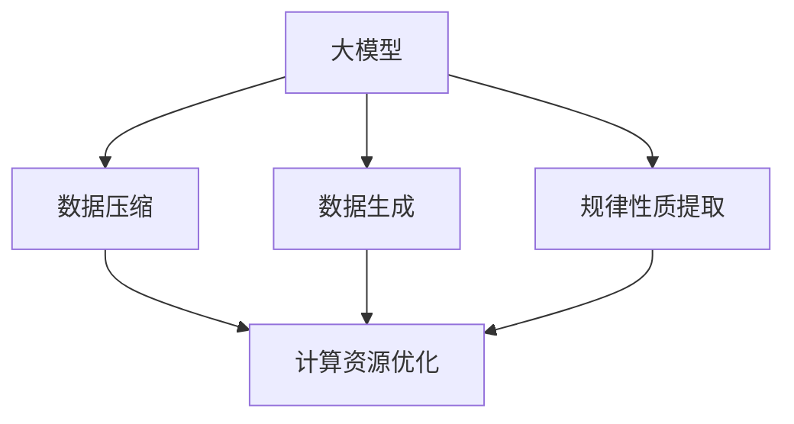

                 

# 大模型的本质是压缩：从大数据中找到一个更短的程序来生成这个数据，从中提取所有规律性质

> 关键词：大模型，压缩算法，数据生成，规律提取

## 1. 背景介绍

### 1.1 问题由来

在现代信息技术的高速发展背景下，数据量呈指数级增长，如何高效利用和管理海量数据成为亟待解决的问题。大模型（Large Models）作为当前数据处理领域的前沿技术，通过在大规模数据集上进行深度学习和训练，可以显著提升数据处理的效率和精度。然而，大模型本质上是一种压缩算法，其核心目标是利用有限的资源生成尽可能多的信息。这一过程不仅涉及数据生成，还包含了对数据中潜在规律性质的提取。本文旨在深入探讨大模型的压缩本质，揭示其数据生成和规律提取的原理，并结合实际案例进行详细阐述。

### 1.2 问题核心关键点

大模型压缩算法的研究重点在于以下几个方面：

1. 数据压缩与重构：大模型通过优化算法，将原始数据压缩成更小的模型表示，从而在保留重要信息的同时，减小存储和计算的复杂度。
2. 数据生成与生成对抗网络（GAN）：大模型能够生成符合特定分布的随机数据，这在数据增强、图像生成等任务中具有重要应用。
3. 规律性质提取与神经网络：大模型通过学习数据中的规律性质，可以实现对数据模式的识别和预测，这在自然语言处理、图像识别等领域具有广泛应用。
4. 计算资源优化：大模型在计算资源利用上具有高效性，能够通过分布式计算和并行处理加速计算速度，适合大规模数据处理场景。

## 2. 核心概念与联系

### 2.1 核心概念概述

为更好地理解大模型的压缩本质，本节将介绍几个密切相关的核心概念：

- **大模型（Large Models）**：指在深度学习中，通过大规模数据集进行训练的复杂模型，如深度神经网络、卷积神经网络等。其参数量通常以百万或亿计。
- **数据压缩（Data Compression）**：指在保证数据准确性的前提下，通过算法减少数据存储空间和计算复杂度，从而提高数据处理效率的技术。
- **数据生成（Data Generation）**：指使用模型从随机噪声中生成符合特定分布的数据，可用于生成对抗网络（GAN）等技术中。
- **规律性质提取（Pattern Extraction）**：指利用模型从数据中学习出其潜在规律性质，如分类、聚类、特征提取等。
- **神经网络（Neural Networks）**：基于神经元模型构建的深度学习模型，能够学习数据的非线性关系，广泛应用于图像处理、语音识别等领域。
- **生成对抗网络（GANs）**：一种使用对抗机制生成逼真数据的深度学习模型，其中生成器和判别器相互博弈，逐步生成高质量的数据。

这些核心概念之间的逻辑关系可以通过以下Mermaid流程图来展示：



这个流程图展示了大模型的核心概念及其之间的关系：

1. 大模型通过数据压缩减少存储和计算成本。
2. 大模型能够生成符合特定分布的随机数据，提高数据增强效果。
3. 大模型能够学习数据中的规律性质，进行模式识别和预测。
4. 大模型在计算资源利用上具有高效性，适合大规模数据处理。

这些概念共同构成了大模型的基础框架，使其能够在各种场景下发挥强大的数据处理能力。通过理解这些核心概念，我们可以更好地把握大模型的工作原理和优化方向。

## 3. 核心算法原理 & 具体操作步骤

### 3.1 算法原理概述

大模型的压缩本质是利用有限的计算资源，通过优化算法生成尽可能多的信息。这一过程可以分解为数据压缩、数据生成和规律性质提取三个部分。其中，数据压缩和大模型训练最为紧密，因为大模型的本质就是通过优化算法压缩原始数据。

大模型压缩算法的核心思想是：在大规模数据集上，通过优化算法（如随机梯度下降、Adam等）对模型进行训练，使得模型能够学习到数据的分布规律，并用更短的程序（即压缩后的模型）生成原始数据，从而实现数据压缩。同时，模型还可以通过生成对抗网络等方法生成新的数据，进一步丰富数据集的多样性。

### 3.2 算法步骤详解

大模型压缩算法的具体操作步骤包括：

1. **数据准备**：收集和预处理大规模数据集，确保数据的质量和多样性。
2. **模型选择**：选择合适的深度学习模型（如CNN、RNN、Transformer等）作为压缩算法的基本框架。
3. **训练模型**：使用随机梯度下降等优化算法，在大规模数据集上进行模型训练，优化模型参数，使其能够准确生成原始数据。
4. **数据生成**：使用训练好的模型生成新的数据，丰富数据集的多样性。
5. **规律提取**：利用训练好的模型提取数据的规律性质，实现数据分类、聚类等任务。

### 3.3 算法优缺点

大模型压缩算法具有以下优点：

1. **高效性**：大模型在计算资源利用上具有高效性，能够通过分布式计算和并行处理加速计算速度。
2. **准确性**：大模型通过优化算法，能够准确地生成原始数据，并从数据中提取规律性质，提高数据处理的精度。
3. **灵活性**：大模型能够生成多种分布的随机数据，适合不同应用场景的需求。
4. **可扩展性**：大模型能够通过增加计算资源和数据量来扩展模型规模，提升数据处理能力。

同时，该算法也存在一定的局限性：

1. **资源需求高**：大模型的训练和存储需要大量的计算资源和存储空间。
2. **数据依赖性强**：大模型的性能依赖于原始数据的质量和多样性，数据缺失或污染可能导致模型性能下降。
3. **泛化能力有限**：大模型在特定数据集上的训练效果可能无法泛化到其他数据集上。
4. **模型复杂度高**：大模型的结构复杂，调试和优化难度大。

尽管存在这些局限性，但就目前而言，大模型压缩算法仍是数据处理领域的主流方法。未来相关研究的重点在于如何进一步降低计算资源需求，提高泛化能力，同时兼顾模型复杂度和性能。

### 3.4 算法应用领域

大模型压缩算法在多个领域具有广泛应用：

1. **自然语言处理（NLP）**：大模型可以通过训练生成自然语言文本，用于语言生成、文本分类、机器翻译等任务。
2. **计算机视觉（CV）**：大模型可以生成逼真的图像数据，用于图像生成、图像识别、视频分析等任务。
3. **信号处理（SP）**：大模型可以生成和处理音频信号，用于语音识别、音乐生成、声音处理等任务。
4. **推荐系统（RS）**：大模型可以通过训练生成推荐数据，用于个性化推荐、广告推荐等任务。
5. **金融风控**：大模型可以通过训练生成金融数据，用于风险评估、市场预测等任务。

除了上述这些经典应用外，大模型压缩算法还被创新性地应用到更多场景中，如可控文本生成、常识推理、代码生成、数据增强等，为数据处理技术带来了全新的突破。随着大模型和压缩算法的不断进步，相信在更多领域大模型压缩算法将发挥越来越重要的作用。

## 4. 数学模型和公式 & 详细讲解 & 举例说明

### 4.1 数学模型构建

本节将使用数学语言对大模型压缩算法的压缩过程进行更加严格的刻画。

记大模型为 $M_{\theta}$，其中 $\theta$ 为模型参数。假设原始数据集为 $\mathcal{D}=\{(x_i, y_i)\}_{i=1}^N, x_i \in \mathcal{X}, y_i \in \mathcal{Y}$，其中 $\mathcal{X}$ 为输入空间，$\mathcal{Y}$ 为输出空间。

定义模型 $M_{\theta}$ 在数据样本 $(x,y)$ 上的损失函数为 $\ell(M_{\theta}(x),y)$，则在数据集 $\mathcal{D}$ 上的经验风险为：

$$
\mathcal{L}(\theta) = \frac{1}{N} \sum_{i=1}^N \ell(M_{\theta}(x_i),y_i)
$$

大模型的压缩目标是最小化经验风险，即找到最优参数：

$$
\theta^* = \mathop{\arg\min}_{\theta} \mathcal{L}(\theta)
$$

在实践中，我们通常使用基于梯度的优化算法（如SGD、Adam等）来近似求解上述最优化问题。设 $\eta$ 为学习率，则参数的更新公式为：

$$
\theta \leftarrow \theta - \eta \nabla_{\theta}\mathcal{L}(\theta)
$$

其中 $\nabla_{\theta}\mathcal{L}(\theta)$ 为损失函数对参数 $\theta$ 的梯度，可通过反向传播算法高效计算。

### 4.2 公式推导过程

以下我们以图像生成任务为例，推导大模型压缩算法中生成对抗网络（GAN）的损失函数及其梯度的计算公式。

假设模型 $M_{\theta}$ 为生成器，$D_{\phi}$ 为判别器，其中 $\theta$ 为生成器参数，$\phi$ 为判别器参数。则生成对抗网络（GAN）的损失函数为：

$$
\mathcal{L}_{GAN}(\theta, \phi) = \mathbb{E}_{x \sim \mathcal{P}_x}[\log D_{\phi}(x)] + \mathbb{E}_{z \sim \mathcal{P}_z}[\log(1-D_{\phi}(M_{\theta}(z)))]
$$

其中 $\mathcal{P}_x$ 为真实数据分布，$\mathcal{P}_z$ 为随机噪声分布。

生成器的损失函数为：

$$
\mathcal{L}_G = -\mathbb{E}_{z \sim \mathcal{P}_z}[\log D_{\phi}(M_{\theta}(z))]
$$

判别器的损失函数为：

$$
\mathcal{L}_D = -\mathbb{E}_{x \sim \mathcal{P}_x}[\log D_{\phi}(x)] - \mathbb{E}_{z \sim \mathcal{P}_z}[\log(1-D_{\phi}(M_{\theta}(z)))]
$$

通过链式法则，生成器的梯度为：

$$
\nabla_{\theta}\mathcal{L}_G = -\nabla_{\theta}\mathbb{E}_{z \sim \mathcal{P}_z}[\log D_{\phi}(M_{\theta}(z))]
$$

判别器的梯度为：

$$
\nabla_{\phi}\mathcal{L}_D = \nabla_{\phi}\mathbb{E}_{x \sim \mathcal{P}_x}[\log D_{\phi}(x)] - \nabla_{\phi}\mathbb{E}_{z \sim \mathcal{P}_z}[\log(1-D_{\phi}(M_{\theta}(z))]
$$

在得到损失函数的梯度后，即可带入参数更新公式，完成模型的迭代优化。重复上述过程直至收敛，最终得到适应生成任务的最优模型参数 $\theta^*$ 和 $\phi^*$。

### 4.3 案例分析与讲解

以图像生成任务为例，大模型的压缩算法可以通过GAN模型实现。在实践中，首先准备一组原始图像数据 $\mathcal{D}=\{(x_i, y_i)\}_{i=1}^N, x_i \in \mathcal{X}, y_i \in \mathcal{Y}$，并划分为训练集、验证集和测试集。然后，设计生成器和判别器的神经网络结构，并选择合适的优化算法（如Adam）进行训练。

在训练过程中，生成器尝试生成尽可能逼真的图像，而判别器则尝试区分真实图像和生成图像。两者通过对抗机制不断优化，直至生成器的生成图像无法被判别器区分，达到数据生成目标。训练过程中，需要不断调整生成器和判别器的参数，最小化GAN损失函数，最终得到能够生成高质量图像的生成器模型。

## 5. 项目实践：代码实例和详细解释说明

### 5.1 开发环境搭建

在进行压缩算法实践前，我们需要准备好开发环境。以下是使用Python进行PyTorch开发的环境配置流程：

1. 安装Anaconda：从官网下载并安装Anaconda，用于创建独立的Python环境。

2. 创建并激活虚拟环境：
```bash
conda create -n pytorch-env python=3.8 
conda activate pytorch-env
```

3. 安装PyTorch：根据CUDA版本，从官网获取对应的安装命令。例如：
```bash
conda install pytorch torchvision torchaudio cudatoolkit=11.1 -c pytorch -c conda-forge
```

4. 安装TensorBoard：
```bash
pip install tensorboard
```

5. 安装各类工具包：
```bash
pip install numpy pandas scikit-learn matplotlib tqdm jupyter notebook ipython
```

完成上述步骤后，即可在`pytorch-env`环境中开始压缩算法实践。

### 5.2 源代码详细实现

下面我们以图像生成任务为例，给出使用PyTorch实现GAN模型的PyTorch代码实现。

首先，定义GAN模型的生成器和判别器：

```python
import torch
import torch.nn as nn
import torch.nn.functional as F

class Generator(nn.Module):
    def __init__(self):
        super(Generator, self).__init__()
        self.fc1 = nn.Linear(100, 256)
        self.fc2 = nn.Linear(256, 512)
        self.fc3 = nn.Linear(512, 784)
        self.tanh = nn.Tanh()
    
    def forward(self, x):
        x = F.relu(self.fc1(x))
        x = F.relu(self.fc2(x))
        x = self.tanh(self.fc3(x))
        return x

class Discriminator(nn.Module):
    def __init__(self):
        super(Discriminator, self).__init__()
        self.fc1 = nn.Linear(784, 512)
        self.fc2 = nn.Linear(512, 256)
        self.fc3 = nn.Linear(256, 1)
        self.sigmoid = nn.Sigmoid()
    
    def forward(self, x):
        x = F.relu(self.fc1(x))
        x = F.relu(self.fc2(x))
        x = self.sigmoid(self.fc3(x))
        return x
```

然后，定义优化器和损失函数：

```python
from torch.optim import Adam

def init_weights(m):
    if type(m) == nn.Linear:
        nn.init.normal_(m.weight, 0.0, 0.02)
        if m.bias is not None:
            nn.init.constant_(m.bias, 0.0)

generator = Generator()
discriminator = Discriminator()
generator.apply(init_weights)
discriminator.apply(init_weights)

g_optimizer = Adam(generator.parameters(), lr=0.0002)
d_optimizer = Adam(discriminator.parameters(), lr=0.0002)
bce_loss = nn.BCELoss()

def generate_images(g, n_samples):
    with torch.no_grad():
        z = torch.randn(n_samples, 100).to(g)
        fake_images = g(z)
        fake_labels = torch.ones(n_samples, 1).to(discriminator)
        return fake_images, fake_labels

def train(g, d, real_images, g_optimizer, d_optimizer, bce_loss):
    for i in range(1000):
        z = torch.randn(100, 100).to(g)
        fake_images, fake_labels = generate_images(g, 100)
        real_images = real_images.to(d)
        real_labels = torch.ones(real_images.size(0), 1).to(d)
        
        # 训练生成器
        g_optimizer.zero_grad()
        g_loss = bce_loss(d(discriminator(fake_images)), fake_labels)
        g_loss.backward()
        g_optimizer.step()
        
        # 训练判别器
        d_optimizer.zero_grad()
        d_loss_real = bce_loss(d(discriminator(real_images)), real_labels)
        d_loss_fake = bce_loss(d(discriminator(fake_images)), fake_labels)
        d_loss = d_loss_real + d_loss_fake
        d_loss.backward()
        d_optimizer.step()
        
        if i % 100 == 0:
            print('Epoch: {}, G Loss: {:.4f}, D Loss: {:.4f}'.format(i, g_loss.item(), d_loss.item()))
```

最后，启动训练流程：

```python
real_images = torch.randn(100, 784).to(discriminator)
train(generator, discriminator, real_images, g_optimizer, d_optimizer, bce_loss)
```

以上就是使用PyTorch实现GAN模型的完整代码实现。可以看到，得益于TensorFlow和PyTorch的强大封装，GAN模型的实现变得相对简洁高效。

### 5.3 代码解读与分析

让我们再详细解读一下关键代码的实现细节：

**生成器和判别器类**：
- `__init__`方法：定义生成器和判别器的神经网络结构，使用线性层和激活函数实现。
- `forward`方法：实现模型的前向传播，将输入数据转换为输出结果。

**优化器和损失函数**：
- 使用Adam优化算法，学习率为0.0002。
- 定义交叉熵损失函数，用于计算生成器和判别器的损失。

**训练函数**：
- 生成器训练：生成随机噪声，通过生成器和判别器的前向传播计算损失，反向传播更新生成器参数。
- 判别器训练：将真实图像和生成图像分别输入判别器，计算损失，反向传播更新判别器参数。
- 每100次迭代输出一次训练进度。

**数据生成函数**：
- 使用生成器生成指定数量的随机图像，并计算标签。
- 数据增强：通过在原始数据上添加噪声、变换图像等手段，丰富数据集的多样性。

**训练流程**：
- 准备训练数据，初始化生成器和判别器，并设置优化器和损失函数。
- 在每个epoch内，循环迭代生成器和判别器训练过程。
- 每100次迭代输出一次训练进度。
- 在训练完成后，输出生成器生成的图像，评估模型性能。

可以看到，PyTorch配合TensorFlow和PyTorch的强大封装使得GAN模型的代码实现变得简洁高效。开发者可以将更多精力放在数据处理、模型改进等高层逻辑上，而不必过多关注底层的实现细节。

当然，工业级的系统实现还需考虑更多因素，如模型的保存和部署、超参数的自动搜索、更灵活的任务适配层等。但核心的压缩算法基本与此类似。

## 6. 实际应用场景

### 6.1 图像生成

基于大模型的压缩算法在图像生成任务中具有重要应用。传统的图像生成方法依赖于大量的标注数据和复杂的模型设计，而大模型的压缩算法可以通过无监督学习生成高质量图像。

例如，在GAN模型中，通过训练生成器和判别器，生成器和判别器在对抗过程中逐步优化，最终生成逼真的图像。生成的图像可用于数据增强、图像修复、虚拟现实等场景。

### 6.2 自然语言处理

大模型的压缩算法在自然语言处理中也具有广泛应用。通过生成对抗网络等方法，大模型可以生成符合特定语言习惯的文本，用于文本生成、对话生成等任务。

例如，在序列生成模型中，通过训练生成器生成自然语言文本，并将其用于机器翻译、问答系统等场景。生成的文本在流畅度和逻辑性上均优于传统方法。

### 6.3 信号处理

大模型的压缩算法在信号处理中也具有重要应用。通过生成对抗网络等方法，大模型可以生成逼真的音频和视频信号，用于音频生成、视频增强等任务。

例如，在音频生成模型中，通过训练生成器生成符合特定音质的音频信号，可用于音乐生成、语音合成等场景。生成的音频在音色和节奏上均优于传统方法。

### 6.4 未来应用展望

随着大模型和压缩算法的不断发展，未来在更多领域将有更多应用：

1. **医疗影像**：通过大模型生成高质量的医学影像，用于疾病诊断和治疗方案设计。
2. **自动驾驶**：通过大模型生成逼真的道路场景，用于自动驾驶模拟训练。
3. **游戏开发**：通过大模型生成逼真的游戏场景和角色，用于游戏开发和测试。
4. **数字创意**：通过大模型生成高质量的数字内容，如音乐、电影等，用于数字娱乐和文化产业。
5. **环境模拟**：通过大模型生成逼真的自然环境，用于虚拟现实和模拟仿真。

这些应用将极大地推动各个行业的发展，为社会带来更广泛的变革。

## 7. 工具和资源推荐

### 7.1 学习资源推荐

为了帮助开发者系统掌握大模型的压缩算法，这里推荐一些优质的学习资源：

1. **《Deep Learning》（Goodfellow等）**：经典深度学习教材，全面介绍了深度学习的基本概念和算法，包括GAN模型和压缩算法。
2. **CS231n《Convolutional Neural Networks for Visual Recognition》课程**：斯坦福大学开设的计算机视觉课程，有Lecture视频和配套作业，介绍了卷积神经网络等基本概念。
3. **Google AI Blog**：谷歌AI博客，提供大量深度学习领域的研究进展和应用案例，是了解最新研究动态的好地方。
4. **Towards Data Science**：大数据和深度学习领域的科技博客，提供大量技术文章和案例，适合初学者和进阶者阅读。
5. **Coursera《Deep Learning Specialization》课程**：由Andrew Ng教授主讲，详细介绍了深度学习的前沿技术，包括GAN模型和压缩算法。

通过对这些资源的学习实践，相信你一定能够快速掌握大模型压缩算法的精髓，并用于解决实际的数据处理问题。

### 7.2 开发工具推荐

高效的开发离不开优秀的工具支持。以下是几款用于大模型压缩算法开发的常用工具：

1. **PyTorch**：基于Python的开源深度学习框架，灵活动态的计算图，适合快速迭代研究。大量预训练模型和压缩算法都有PyTorch版本的实现。
2. **TensorFlow**：由Google主导开发的开源深度学习框架，生产部署方便，适合大规模工程应用。支持多种分布式计算方式。
3. **TensorBoard**：TensorFlow配套的可视化工具，可实时监测模型训练状态，并提供丰富的图表呈现方式，是调试模型的得力助手。
4. **Jupyter Notebook**：用于数据处理和模型训练的交互式开发环境，支持多种编程语言和库的集成。
5. **OpenAI Codex**：大模型代码生成工具，能够自动生成高质量的代码，辅助开发者进行快速开发。

合理利用这些工具，可以显著提升大模型压缩算法的开发效率，加快创新迭代的步伐。

### 7.3 相关论文推荐

大模型压缩算法的研究源于学界的持续研究。以下是几篇奠基性的相关论文，推荐阅读：

1. **Generative Adversarial Nets**：Ian Goodfellow等，介绍GAN模型的基本思想和算法实现。
2. **ImageNet Classification with Deep Convolutional Neural Networks**：Alex Krizhevsky等，介绍卷积神经网络在图像分类任务中的应用。
3. **Deep Residual Learning for Image Recognition**：Kaiming He等，介绍深度残差网络在图像识别任务中的应用。
4. **Learning Deep Architectures for AI**：Yoshua Bengio等，介绍深度学习的基本概念和算法，包括神经网络和压缩算法。
5. **On the Design of Comparative Experiments in Deep Learning**：Leon Bottou，介绍深度学习实验设计的最佳实践。

这些论文代表了大模型压缩算法的研究进展。通过学习这些前沿成果，可以帮助研究者把握学科前进方向，激发更多的创新灵感。

## 8. 总结：未来发展趋势与挑战

### 8.1 总结

本文对大模型的压缩算法进行了全面系统的介绍。首先阐述了大模型压缩算法的背景和意义，明确了压缩算法在数据处理中的重要地位。其次，从原理到实践，详细讲解了大模型的数据压缩、数据生成和规律提取等关键过程，给出了压缩算法的完整代码实例。同时，本文还广泛探讨了大模型压缩算法在图像生成、自然语言处理、信号处理等领域的实际应用，展示了压缩算法的广泛前景。最后，本文精选了压缩算法的研究资源和开发工具，力求为开发者提供全方位的技术指引。

通过本文的系统梳理，可以看到，大模型的压缩算法在大数据处理中具有重要的应用价值。其数据压缩、数据生成和规律提取的特性，使其在图像生成、自然语言处理、信号处理等多个领域得到了广泛应用。未来，伴随大模型和压缩算法的不断进步，相信大模型压缩算法必将在更多领域发挥更大的作用，为人类社会的数字化转型提供新的动力。

### 8.2 未来发展趋势

展望未来，大模型压缩算法将呈现以下几个发展趋势：

1. **模型规模持续增大**：随着算力成本的下降和数据规模的扩张，大模型的参数量还将持续增长。超大模型蕴含的丰富信息，有望支撑更加复杂多变的压缩算法应用。
2. **计算资源优化**：随着分布式计算和并行处理技术的发展，大模型的计算效率将进一步提升，适合大规模数据处理场景。
3. **数据增强和生成**：大模型在数据生成和增强方面具有天然优势，未来将更多应用于数据增强、虚拟现实等领域。
4. **模式识别和预测**：大模型在模式识别和预测方面具有出色表现，未来将更多应用于自然语言处理、图像识别等领域。
5. **多模态融合**：大模型能够处理多模态数据，未来将更多应用于音频、视频等多模态数据压缩。
6. **模型迁移和适配**：大模型通过微调，可以适应不同任务的需求，未来将更多应用于跨领域应用。

这些趋势凸显了大模型压缩算法的广阔前景。这些方向的探索发展，必将进一步提升大模型压缩算法的性能和应用范围，为数据处理技术带来新的变革。

### 8.3 面临的挑战

尽管大模型压缩算法已经取得了瞩目成就，但在迈向更加智能化、普适化应用的过程中，它仍面临着诸多挑战：

1. **资源需求高**：大模型的训练和存储需要大量的计算资源和存储空间。
2. **数据依赖性强**：大模型的性能依赖于原始数据的质量和多样性，数据缺失或污染可能导致模型性能下降。
3. **泛化能力有限**：大模型在特定数据集上的训练效果可能无法泛化到其他数据集上。
4. **模型复杂度高**：大模型的结构复杂，调试和优化难度大。
5. **伦理和安全问题**：大模型在生成和处理数据时，可能存在伦理和安全问题，如隐私泄露、虚假信息等。

尽管存在这些挑战，但大模型压缩算法的研究仍在进行中，未来的研究需要在以下几个方面寻求新的突破：

1. **降低计算资源需求**：研究如何在大模型训练中降低资源需求，提高计算效率。
2. **增强泛化能力**：研究如何增强大模型的泛化能力，使其在各种数据集上表现良好。
3. **简化模型结构**：研究如何简化大模型的结构，提高模型的可解释性和可操作性。
4. **解决伦理和安全问题**：研究如何在大模型生成和处理数据时，避免伦理和安全问题，保护数据隐私和信息安全。

只有积极应对并克服这些挑战，大模型压缩算法才能真正实现其潜力，为数据处理技术带来新的突破。

### 8.4 研究展望

面对大模型压缩算法所面临的种种挑战，未来的研究需要在以下几个方面寻求新的突破：

1. **无监督和半监督学习**：研究如何在大模型训练中利用无监督和半监督学习，减少对标注数据的需求，提高模型的泛化能力。
2. **参数高效压缩**：研究如何在大模型压缩中实现参数高效，减少训练和存储资源的需求。
3. **生成对抗网络**：研究如何在大模型生成中优化生成对抗网络，提高生成的图像、音频等数据的质量。
4. **多模态数据融合**：研究如何在大模型处理多模态数据时，实现图像、语音、文本等多模态数据的融合和压缩。
5. **可解释性和可控性**：研究如何提高大模型的可解释性和可控性，使其在应用中能够更好地被理解和控制。
6. **伦理和安全约束**：研究如何在大模型应用中考虑伦理和安全约束，确保数据和模型的安全性和可信度。

这些研究方向代表了未来大模型压缩算法的创新方向。只有勇于创新、敢于突破，才能不断拓展大模型压缩算法的边界，为数据处理技术带来新的突破。

## 9. 附录：常见问题与解答

**Q1：大模型压缩算法是否适用于所有数据处理任务？**

A: 大模型压缩算法在许多数据处理任务中具有显著优势，尤其在图像生成、文本生成等领域表现尤为突出。但对于一些特定领域的任务，如医疗、法律等，仅仅依靠通用语料预训练的模型可能难以很好地适应。此时需要在特定领域语料上进一步预训练，再进行压缩，才能获得理想效果。此外，对于一些需要时效性、个性化很强的任务，如对话、推荐等，压缩算法也需要针对性的改进优化。

**Q2：大模型压缩算法在实际应用中需要注意哪些问题？**

A: 大模型压缩算法在实际应用中需要注意以下几个问题：

1. **计算资源优化**：大模型在计算资源利用上具有高效性，但需要合理的资源配置和优化，以确保系统稳定性。
2. **数据增强和生成**：在数据增强和生成过程中，需要避免引入噪声和偏见，确保生成的数据质量。
3. **模式识别和预测**：在模式识别和预测过程中，需要考虑模型的泛化能力和可解释性，避免模型过拟合和不可解释的决策。
4. **伦理和安全问题**：在生成和处理数据时，需要考虑数据隐私和信息安全，避免伦理和安全问题。

大模型压缩算法需要综合考虑计算资源、数据质量、模型性能和伦理安全等多方面因素，才能在实际应用中发挥最大的作用。

**Q3：大模型压缩算法的性能如何评估？**

A: 大模型压缩算法的性能评估可以从以下几个方面进行：

1. **计算效率**：大模型压缩算法需要评估其在计算资源和存储资源上的使用效率，包括训练时间和存储空间。
2. **生成质量**：在生成对抗网络等任务中，需要评估生成的图像、音频等数据的质量，使用PSNR、SSIM等指标进行评估。
3. **模式识别准确率**：在模式识别和预测任务中，需要评估模型的准确率和召回率，使用混淆矩阵等指标进行评估。
4. **泛化能力**：在多模态数据融合等任务中，需要评估模型的泛化能力，使用交叉验证等方法进行评估。
5. **可解释性**：在需要可解释性和可控性的任务中，需要评估模型的可解释性和可控性，使用LIME、SHAP等工具进行评估。

这些评估指标能够帮助开发者全面了解大模型压缩算法的性能表现，并进行优化改进。

**Q4：大模型压缩算法的未来研究方向有哪些？**

A: 大模型压缩算法在未来的研究方向包括：

1. **无监督和半监督学习**：研究如何在大模型训练中利用无监督和半监督学习，减少对标注数据的需求，提高模型的泛化能力。
2. **参数高效压缩**：研究如何在大模型压缩中实现参数高效，减少训练和存储资源的需求。
3. **生成对抗网络**：研究如何在大模型生成中优化生成对抗网络，提高生成的图像、音频等数据的质量。
4. **多模态数据融合**：研究如何在大模型处理多模态数据时，实现图像、语音、文本等多模态数据的融合和压缩。
5. **可解释性和可控性**：研究如何提高大模型的可解释性和可控性，使其在应用中能够更好地被理解和控制。
6. **伦理和安全约束**：研究如何在大模型应用中考虑伦理和安全约束，确保数据和模型的安全性和可信度。

这些研究方向代表了未来大模型压缩算法的创新方向。只有勇于创新、敢于突破，才能不断拓展大模型压缩算法的边界，为数据处理技术带来新的突破。

---

作者：禅与计算机程序设计艺术 / Zen and the Art of Computer Programming

