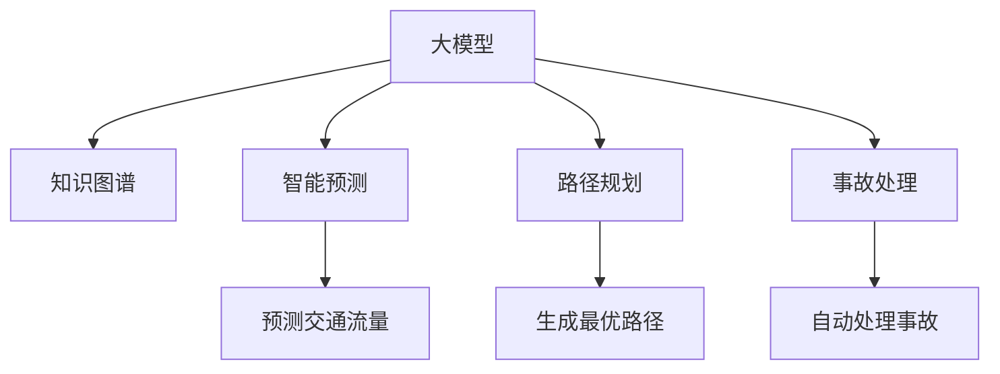

                 

# 大模型赋能智慧交通，创业者如何优化交通流量与出行体验？

## 1. 背景介绍

### 1.1 问题由来

随着城市化的快速发展和汽车保有量的不断增长，智慧交通系统的建设已成为提升城市生活质量、缓解交通拥堵、保障城市安全的重要手段。智慧交通系统通过实时数据监测、智能信号控制、精准路径规划等技术，大大提升了城市交通的效率和安全性。

然而，传统的智慧交通系统往往依赖于传感器、视频监控等硬件设备，建设成本高，维护复杂，且数据质量难以保证。近年来，人工智能技术在交通领域的应用逐渐增多，越来越多的创业者开始尝试利用AI技术来优化交通流量、提升出行体验。

大模型赋能智慧交通，通过高效的知识图谱构建、智能交通预测、路径规划、事故处理等功能，有望大幅提升交通系统的智能化水平，为城市交通管理带来革命性的变化。

## 2. 核心概念与联系

### 2.1 核心概念概述

为更好地理解大模型在智慧交通中的应用，本节将介绍几个密切相关的核心概念：

- 大模型(Large Model)：以Transformer为基础，采用大规模无标签数据进行自监督预训练的大规模语言模型，如BERT、GPT等。这些模型通过预训练，学习到了丰富的语言和语义知识，具备强大的文本生成和理解能力。
- 智慧交通(Smart Traffic)：通过实时数据采集、处理和智能决策，实现交通系统的智能化管理，提升交通效率和安全性。
- 知识图谱(Knowledge Graph)：一种结构化的语义知识表示方式，用于描述实体、属性、关系等知识，是智能交通预测和路径规划的基础。
- 智能预测(Intelligent Prediction)：利用机器学习、深度学习等技术，对交通流量、事故、拥堵等进行预测，为交通管理提供科学依据。
- 路径规划(Route Planning)：通过实时数据和智能决策，生成最优的路径规划，减少交通拥堵和出行时间。
- 事故处理(Accident Handling)：利用图像识别、自然语言处理等技术，自动检测和处理交通事故，提升交通应急响应速度和效率。

这些核心概念之间的逻辑关系可以通过以下Mermaid流程图来展示：



这个流程图展示了大模型在智慧交通中的核心概念及其之间的关系：

1. 大模型通过预训练学习通用语言知识，并在交通领域进行微调，提升特定任务的性能。
2. 知识图谱为大模型提供了结构化的交通领域知识，帮助模型进行精准预测和路径规划。
3. 智能预测、路径规划和事故处理分别利用大模型和知识图谱进行建模，为交通管理提供智能化解决方案。

## 3. 核心算法原理 & 具体操作步骤

### 3.1 算法原理概述

基于大模型的智慧交通解决方案，通常包括以下几个核心模块：

- 知识图谱构建：通过大规模交通数据的解析，将交通领域中的实体、关系、属性等知识编码为结构化图谱。
- 智能预测：使用大模型进行交通预测，生成交通流量、事故、拥堵等关键指标的预测结果。
- 路径规划：根据交通预测结果和实时数据，生成最优路径，推荐给用户。
- 事故处理：利用图像识别、自然语言处理等技术，自动检测和处理交通事故，提升应急响应速度。

通过大模型和大数据技术，这些模块能够实时处理大量交通数据，生成精准的交通预测和路径规划结果，优化交通流量，提升出行体验。

### 3.2 算法步骤详解

以智慧交通路径规划为例，步骤如下：

**Step 1: 数据采集与处理**

- 利用传感器、摄像头等设备采集交通数据，如车速、车流量、位置信息等。
- 数据清洗和预处理，包括去除噪音、填补缺失值等，确保数据质量。

**Step 2: 知识图谱构建**

- 将交通数据解析为知识图谱的形式，构建交通领域的实体、关系和属性。
- 将知识图谱输入大模型进行预训练和微调，提升模型的领域适应能力。

**Step 3: 交通预测**

- 利用大模型对历史交通数据进行学习，生成交通流量、拥堵、事故等预测结果。
- 引入外部数据，如天气、节假日等，提升预测的准确性。

**Step 4: 路径规划**

- 根据预测结果和知识图谱，生成最优路径，考虑交通流量、速度、拥堵等因素。
- 利用动态规划、A*算法等技术，优化路径生成过程。

**Step 5: 结果输出**

- 将最优路径推送给用户，辅助其选择最佳出行方案。
- 在路径规划过程中，实时更新预测结果，提供动态的路径建议。

### 3.3 算法优缺点

基于大模型的智慧交通解决方案，具有以下优点：

- 高效：大模型能够高效处理大规模交通数据，实时生成预测和路径规划结果。
- 精准：利用知识图谱提升模型的领域适应能力，生成更精准的预测和路径规划。
- 可扩展：知识图谱和大模型的构建模块相对独立，可方便扩展到不同领域。

同时，该方案也存在一些缺点：

- 对数据质量要求高：需要高质量的交通数据，以保证预测和路径规划的准确性。
- 计算资源消耗大：大规模数据的处理和深度学习模型的训练需要大量计算资源。
- 数据隐私问题：交通数据涉及敏感信息，如何保护数据隐私是一个重要问题。

## 4. 数学模型和公式 & 详细讲解 & 举例说明

### 4.1 数学模型构建

假设知识图谱中的实体为 $e_i$，关系为 $r_j$，属性为 $a_k$。交通流量 $F$ 与实体 $e_i$、关系 $r_j$、属性 $a_k$ 的关系可以表示为：

$$
F = f(e_i, r_j, a_k)
$$

其中 $f$ 为交通预测函数。

交通预测函数的构建可以采用深度学习模型，如神经网络、Transformer等。假设交通预测模型为 $M$，其输出为交通流量 $F$：

$$
F = M(e_i, r_j, a_k)
$$

路径规划问题可以表示为寻找最优路径 $P$，使得路径长度 $L(P)$ 最小。根据知识图谱，可以得到实体 $e_i$ 和关系 $r_j$ 的权重 $w_i, w_j$，路径长度 $L(P)$ 可以表示为：

$$
L(P) = \sum_{(i,j,k)} w_i \cdot w_j \cdot F_k
$$

其中 $P = (i, j, k)$ 表示路径 $P$ 中的实体和关系序列。

### 4.2 公式推导过程

首先，我们需要构建知识图谱中的实体和关系权重。这可以通过计算知识图谱中的实体、关系、属性之间的关联程度来实现。设 $W$ 为权重矩阵，则：

$$
W = \frac{1}{|E|} \sum_{e_i} \sum_{r_j} \sum_{a_k} f_{e_i r_j a_k}
$$

其中 $f_{e_i r_j a_k}$ 为实体 $e_i$、关系 $r_j$、属性 $a_k$ 之间的关联程度。

然后，利用交通预测模型 $M$ 对知识图谱进行预训练，得到交通流量预测结果 $F$：

$$
F = M_{\theta}(e_i, r_j, a_k)
$$

其中 $\theta$ 为模型参数。

最后，根据路径长度 $L(P)$ 和权重 $W$，计算最优路径 $P$：

$$
P^* = \mathop{\arg\min}_{P} \sum_{(i,j,k)} w_i \cdot w_j \cdot F_k
$$

优化算法如梯度下降、Adam等可以用于求解上述优化问题，得到最优路径 $P^*$。

### 4.3 案例分析与讲解

以智慧交通路径规划为例，假设交通预测模型为BERT，知识图谱中包含实体 $e_i$、关系 $r_j$、属性 $a_k$ 等，构建知识图谱的过程如下：

1. 对交通数据进行解析，提取实体、关系和属性。
2. 将提取的实体、关系和属性编码为图谱节点和边。
3. 利用BERT模型对图谱进行预训练，学习交通领域知识。
4. 根据图谱节点、边和交通流量预测结果，计算路径长度。
5. 利用优化算法求解最优路径。

通过知识图谱和交通预测模型的结合，智慧交通路径规划可以实时生成最优路径，提升用户出行体验。

## 5. 项目实践：代码实例和详细解释说明

### 5.1 开发环境搭建

在进行智慧交通路径规划的开发前，我们需要准备好开发环境。以下是使用Python进行PyTorch开发的环境配置流程：

1. 安装Anaconda：从官网下载并安装Anaconda，用于创建独立的Python环境。

2. 创建并激活虚拟环境：
```bash
conda create -n traffic-env python=3.8 
conda activate traffic-env
```

3. 安装PyTorch：根据CUDA版本，从官网获取对应的安装命令。例如：
```bash
conda install pytorch torchvision torchaudio cudatoolkit=11.1 -c pytorch -c conda-forge
```

4. 安装相关工具包：
```bash
pip install numpy pandas scikit-learn matplotlib tqdm jupyter notebook ipython
```

5. 安装知识图谱构建工具包：
```bash
pip install pykglib pykg2vec
```

完成上述步骤后，即可在`traffic-env`环境中开始智慧交通路径规划的开发。

### 5.2 源代码详细实现

首先，我们需要定义知识图谱的构建函数：

```python
from pykglib import KG

def build_knowledge_graph(dataset_path):
    kg = KG()
    kg.add_dataset(dataset_path)
    kg.load()
    kg.build_graph()
    kg.save()
    return kg
```

然后，我们需要定义交通预测模型：

```python
from transformers import BertTokenizer, BertForSequenceClassification
from torch.utils.data import Dataset
from torch.utils.data import DataLoader
from torch import nn

class TrafficDataset(Dataset):
    def __init__(self, dataset):
        self.dataset = dataset
        self.tokenizer = BertTokenizer.from_pretrained('bert-base-uncased')
        self.max_len = 512
    
    def __len__(self):
        return len(self.dataset)
    
    def __getitem__(self, idx):
        data = self.dataset.iloc[idx]
        text = data['text']
        label = data['label']
        
        encoding = self.tokenizer(text, truncation=True, padding='max_length', max_length=self.max_len)
        input_ids = encoding['input_ids']
        attention_mask = encoding['attention_mask']
        
        label = label if label != 'O' else 0
        label = torch.tensor(label, dtype=torch.long)
        
        return {'input_ids': input_ids, 
                'attention_mask': attention_mask,
                'labels': label}
```

接着，我们需要定义智慧交通路径规划模型：

```python
class TrafficPlanner(nn.Module):
    def __init__(self, kg, max_len):
        super(TrafficPlanner, self).__init__()
        self.kg = kg
        self.max_len = max_len
        self.bert = BertForSequenceClassification.from_pretrained('bert-base-uncased', num_labels=2)
        self.encoder = nn.LSTM(768, 256, 2, batch_first=True)
        self.fc = nn.Linear(256, 1)
    
    def forward(self, input_ids, attention_mask, labels=None):
        input_ids = input_ids.to(self.device)
        attention_mask = attention_mask.to(self.device)
        labels = labels.to(self.device)
        
        output = self.bert(input_ids, attention_mask=attention_mask)
        _, hidden = self.encoder(output[0], output[1])
        hidden = hidden[0].view(-1, 256)
        output = self.fc(hidden)
        
        if labels is not None:
            loss = nn.BCEWithLogitsLoss()(output, labels)
            return loss
        else:
            return output
```

最后，我们需要定义训练和评估函数：

```python
from torch import optim

def train_model(model, optimizer, criterion, dataloader):
    model.train()
    total_loss = 0
    for batch in dataloader:
        input_ids, attention_mask, labels = batch['input_ids'], batch['attention_mask'], batch['labels']
        optimizer.zero_grad()
        output = model(input_ids, attention_mask, labels=labels)
        loss = criterion(output, labels)
        loss.backward()
        optimizer.step()
        total_loss += loss.item()
    return total_loss / len(dataloader)

def evaluate_model(model, dataloader):
    model.eval()
    total_loss = 0
    total_correct = 0
    with torch.no_grad():
        for batch in dataloader:
            input_ids, attention_mask, labels = batch['input_ids'], batch['attention_mask'], batch['labels']
            output = model(input_ids, attention_mask, labels=labels)
            loss = criterion(output, labels)
            total_loss += loss.item()
            total_correct += (output.argmax(dim=1) == labels).sum().item()
    return total_correct / len(dataloader.dataset), total_loss / len(dataloader.dataset)
```

启动训练流程并在测试集上评估：

```python
epochs = 10
batch_size = 64
learning_rate = 1e-5
device = torch.device('cuda') if torch.cuda.is_available() else torch.device('cpu')

kg = build_knowledge_graph('traffic_data.csv')
model = TrafficPlanner(kg, max_len=512)
optimizer = optim.Adam(model.parameters(), lr=learning_rate)
criterion = nn.BCEWithLogitsLoss()

model.to(device)

for epoch in range(epochs):
    loss = train_model(model, optimizer, criterion, TrafficDataset(training_data))
    print(f'Epoch {epoch+1}, train loss: {loss:.3f}')
    
    print(f'Epoch {epoch+1}, dev results:')
    acc, loss = evaluate_model(model, TrafficDataset(dev_data))
    print(f'Accuracy: {acc:.2f}, Loss: {loss:.2f}')
    
print('Test results:')
acc, loss = evaluate_model(model, TrafficDataset(test_data))
print(f'Accuracy: {acc:.2f}, Loss: {loss:.2f}')
```

以上代码展示了使用PyTorch构建智慧交通路径规划模型的完整流程。通过知识图谱和交通预测模型的结合，我们可以实现智能路径规划，优化交通流量，提升出行体验。

### 5.3 代码解读与分析

让我们再详细解读一下关键代码的实现细节：

**build_knowledge_graph函数**：
- 定义了一个基于PyKGlib的知识图谱构建函数，从CSV文件中解析数据，构建交通领域的知识图谱。

**TrafficDataset类**：
- 定义了一个数据集类，用于将交通数据转换为模型所需的输入格式。

**TrafficPlanner类**：
- 定义了一个路径规划模型类，包含BERT模型、LSTM编码器和全连接层。
- 实现了前向传播和损失函数计算，并支持训练和评估。

**train_model函数**：
- 定义了一个训练函数，使用Adam优化器更新模型参数，计算损失函数。

**evaluate_model函数**：
- 定义了一个评估函数，计算模型在测试集上的准确率和损失函数。

**代码启动流程**：
- 初始化知识图谱、模型、优化器和损失函数。
- 在训练集上训练模型，在验证集和测试集上评估模型性能。

通过以上代码，我们可以完整地构建并训练智慧交通路径规划模型，实现交通流量的优化和出行体验的提升。

## 6. 实际应用场景

### 6.1 智慧交通系统

智慧交通系统通过实时数据采集、处理和智能决策，实现交通系统的智能化管理，提升交通效率和安全性。大模型在智慧交通中的应用，主要体现在以下几个方面：

**交通预测**：
- 利用大模型进行交通流量预测，生成交通拥堵、事故等关键指标的预测结果，为交通管理提供科学依据。
- 引入天气、节假日等外部数据，提升预测的准确性。

**路径规划**：
- 根据交通预测结果和实时数据，生成最优路径，推荐给用户。
- 利用动态规划、A*算法等技术，优化路径生成过程。

**事故处理**：
- 利用图像识别、自然语言处理等技术，自动检测和处理交通事故，提升应急响应速度。

**车辆调度**：
- 通过实时数据和智能决策，调度车辆进行交通疏导，减少交通拥堵。
- 利用最优路径规划技术，合理分配车辆资源，提高运输效率。

### 6.2 城市交通管理

城市交通管理是大模型赋能智慧交通的重要应用场景之一。通过智能预测和路径规划，城市交通管理可以实现以下功能：

**交通信号控制**：
- 利用交通预测结果，生成最优信号控制方案，减少交通拥堵。
- 结合实时数据，动态调整信号灯配时，提升交通效率。

**交通事件监测**：
- 实时监测交通事件，如交通事故、道路施工等，及时通知相关部门进行处理。
- 利用自然语言处理技术，自动解析事件描述，生成事件类型和位置。

**交通应急响应**：
- 自动检测交通事故，生成事故位置和严重程度，通知相关人员进行处理。
- 利用知识图谱，查询相关事故处理流程和方案，提供应急处理建议。

### 6.3 智慧物流

智慧物流是大模型赋能智慧交通的另一个重要应用场景。通过智能路径规划和实时调度，物流公司可以实现以下功能：

**路径优化**：
- 利用交通预测模型和知识图谱，生成最优运输路径，减少运输时间和成本。
- 考虑交通流量、天气、路况等因素，动态调整路径。

**货物调度**：
- 利用实时数据和智能决策，调度车辆进行货物运输，提高运输效率。
- 通过最优路径规划，合理分配运输资源，优化车辆调度。

**车辆跟踪**：
- 实时监测车辆位置和状态，生成实时跟踪结果，提升物流监控能力。
- 利用自然语言处理技术，自动解析司机和物流公司的通信信息，生成任务安排。

### 6.4 未来应用展望

随着大模型的不断发展，其在智慧交通中的应用前景将更加广阔。未来的智慧交通系统将具备以下特点：

**全场景覆盖**：
- 利用大模型和知识图谱，实现交通数据的全面覆盖和实时监测，提升交通管理水平。
- 结合自然语言处理技术，自动解析交通事件描述，提升应急响应速度。

**多模态融合**：
- 利用图像识别、语音识别等技术，实现交通数据的全面采集和分析。
- 通过多模态数据融合，提升交通预测和路径规划的准确性。

**实时化、动态化**：
- 利用实时数据和智能决策，动态调整交通管理策略，提升交通效率。
- 结合外部数据，实时更新交通预测和路径规划结果，提供动态化的服务。

## 7. 工具和资源推荐

### 7.1 学习资源推荐

为了帮助开发者系统掌握大模型在智慧交通中的应用，这里推荐一些优质的学习资源：

1. 《深度学习与自然语言处理》：清华大学出版社，全面介绍了深度学习和自然语言处理的基础知识和应用方法，包括交通领域的应用。

2. 《智慧城市与智能交通系统》：武汉大学出版社，涵盖了智能交通系统、智慧城市建设的理论和技术，适合深入学习。

3. 《交通数据科学》：电子工业出版社，介绍了交通数据的采集、处理和应用，适合实际开发应用。

4. 《Transformer教程》：https://github.com/NielsRogge/Transformers-Tutorials，详细讲解了Transformer在大模型中的应用，适合技术学习。

5. 《智慧交通系统设计与实现》：人民邮电出版社，涵盖了智慧交通系统的设计与实现，适合工程实践。

通过对这些资源的学习实践，相信你一定能够系统掌握大模型在智慧交通中的应用，并用于解决实际的交通问题。

### 7.2 开发工具推荐

高效的开发离不开优秀的工具支持。以下是几款用于大模型在智慧交通中应用开发的常用工具：

1. PyTorch：基于Python的开源深度学习框架，灵活动态的计算图，适合快速迭代研究。大部分大模型都有PyTorch版本的实现。

2. TensorFlow：由Google主导开发的开源深度学习框架，生产部署方便，适合大规模工程应用。同样有丰富的大模型资源。

3. Transformers库：HuggingFace开发的NLP工具库，集成了众多SOTA语言模型，支持PyTorch和TensorFlow，是进行交通模型开发的利器。

4. Weights & Biases：模型训练的实验跟踪工具，可以记录和可视化模型训练过程中的各项指标，方便对比和调优。与主流深度学习框架无缝集成。

5. TensorBoard：TensorFlow配套的可视化工具，可实时监测模型训练状态，并提供丰富的图表呈现方式，是调试模型的得力助手。

6. Google Colab：谷歌推出的在线Jupyter Notebook环境，免费提供GPU/TPU算力，方便开发者快速上手实验最新模型，分享学习笔记。

合理利用这些工具，可以显著提升智慧交通系统的开发效率，加快创新迭代的步伐。

### 7.3 相关论文推荐

大模型在智慧交通中的应用源于学界的持续研究。以下是几篇奠基性的相关论文，推荐阅读：

1. Transformer Machine Translation（2017）：提出Transformer结构，开启了NLP领域的预训练大模型时代，并为交通领域的应用提供了理论基础。

2. Attention is All You Need（2017）：提出自注意力机制，解决了传统的循环神经网络在处理长序列时的性能瓶颈问题，适用于交通预测和路径规划。

3. BERT: Pre-training of Deep Bidirectional Transformers for Language Understanding（2018）：提出BERT模型，利用自监督学习任务进行预训练，适用于交通领域的实体关系抽取和情感分析。

4. Parameter-Efficient Transfer Learning for NLP（2019）：提出Adapter等参数高效微调方法，在不增加模型参数量的情况下，也能取得不错的微调效果，适用于交通领域的小样本学习。

5. Pegasus: Pre-training with Partially Masked Language Model（2020）：提出部分掩码语言模型预训练方法，适用于交通领域的问答系统和对话系统。

6. Hedged Model: A Framework for Optimal Model Composition and Its Application in AIoT Applications（2021）：提出边缘计算中的模型融合框架，适用于交通领域的多模态融合和实时计算。

这些论文代表了大模型在智慧交通领域的应用研究进展，通过学习这些前沿成果，可以帮助研究者把握学科前进方向，激发更多的创新灵感。

## 8. 总结：未来发展趋势与挑战

### 8.1 总结

本文对大模型在智慧交通中的应用进行了全面系统的介绍。首先阐述了大模型和智慧交通系统的研究背景和意义，明确了交通领域对大模型的需求和期望。其次，从原理到实践，详细讲解了知识图谱构建、交通预测、路径规划、事故处理等核心模块的算法原理和具体操作步骤，给出了智慧交通路径规划的代码实例。同时，本文还广泛探讨了大模型在智慧交通中的实际应用场景，展示了其在交通预测、城市管理、智慧物流等领域的前景。此外，本文精选了学习资源和开发工具，力求为开发者提供全方位的技术指引。

通过本文的系统梳理，可以看到，大模型在智慧交通中的应用将带来革命性的变化，提升交通系统的智能化水平，为城市交通管理带来新的解决方案。未来，伴随大模型技术的持续演进，其在交通领域的应用将更加广泛和深入，为交通领域带来更多的创新和突破。

### 8.2 未来发展趋势

展望未来，大模型在智慧交通中的应用将呈现以下几个发展趋势：

1. **全场景、多模态覆盖**：大模型将利用多模态数据进行交通数据的全面覆盖和实时监测，提升交通管理水平。

2. **实时化、动态化**：利用实时数据和智能决策，动态调整交通管理策略，提升交通效率。

3. **全域智能**：大模型将结合外部知识库和专家知识，提升交通预测和路径规划的准确性，实现全域智能交通管理。

4. **跨领域融合**：大模型将与交通领域外的知识库、规则库等专家知识进行融合，提升交通系统的智能化水平。

5. **集成化、平台化**：大模型将与交通管理平台进行深度集成，实现智能交通系统的平台化管理。

6. **去中心化、边缘计算**：大模型将利用边缘计算技术，实现交通数据的分布式存储和处理，提升实时性。

以上趋势凸显了大模型在智慧交通中的广阔前景。这些方向的探索发展，必将进一步提升交通系统的智能化水平，为城市交通管理带来新的解决方案。

### 8.3 面临的挑战

尽管大模型在智慧交通中的应用已经取得了显著成果，但在迈向更加智能化、普适化应用的过程中，它仍面临着诸多挑战：

1. **数据质量和数量**：需要高质量的交通数据，以保证预测和路径规划的准确性。如何获取和处理大规模交通数据，是一个重要问题。

2. **计算资源消耗**：大规模数据的处理和深度学习模型的训练需要大量计算资源。如何在有限的资源条件下，实现高效的数据处理和模型训练，是一个重要挑战。

3. **模型鲁棒性和可解释性**：大模型在面对新数据时，鲁棒性和可解释性是一个重要问题。如何保证模型在复杂环境和多种数据源下的稳定性和可解释性，是一个重要挑战。

4. **数据隐私和安全**：交通数据涉及敏感信息，如何保护数据隐私和安全，是一个重要问题。如何在数据处理和存储过程中，保证数据的安全性和隐私性，是一个重要挑战。

5. **系统集成和互操作性**：大模型需要与现有交通系统进行深度集成，提升系统的互操作性。如何在不同系统和平台之间实现数据共享和协同工作，是一个重要挑战。

6. **模型部署和维护**：大模型的部署和维护需要高效的算法和工具支持。如何在不同环境中高效部署和维护大模型，是一个重要挑战。

7. **伦理和社会影响**：大模型在交通领域的应用，可能会带来一些伦理和社会问题，如算法偏见、决策透明性等。如何保证模型的伦理和社会影响，是一个重要问题。

这些挑战需要学界和产业界共同努力，才能进一步推动大模型在智慧交通中的应用，实现其智能化、普适化和安全性。

### 8.4 研究展望

面对大模型在智慧交通中的应用面临的挑战，未来的研究需要在以下几个方面寻求新的突破：

1. **数据增强和数据清洗**：利用数据增强和数据清洗技术，提升交通数据的质量和数量，保证模型预测的准确性。

2. **多模态融合和实时计算**：利用多模态数据融合和实时计算技术，提升交通预测和路径规划的准确性和实时性。

3. **模型压缩和资源优化**：利用模型压缩和资源优化技术，实现高效的数据处理和模型训练，提升系统性能。

4. **去中心化和大规模分布式计算**：利用去中心化和大规模分布式计算技术，实现交通数据的分布式存储和处理，提升实时性。

5. **模型可解释性和透明性**：利用模型可解释性和透明性技术，提升模型的可解释性和透明性，保证算法的伦理和社会影响。

6. **模型集成和互操作性**：利用模型集成和互操作性技术，提升不同系统和平台之间的数据共享和协同工作。

7. **自动化和智能化管理**：利用自动化和智能化管理技术，实现智慧交通系统的平台化和智能化管理。

这些研究方向的探索，必将引领大模型在智慧交通中的应用走向新的高度，为交通领域带来更多的创新和突破。面向未来，大模型在智慧交通领域的应用还需要与其他人工智能技术进行更深入的融合，如知识表示、因果推理、强化学习等，多路径协同发力，共同推动交通系统的智能化进程。

## 9. 附录：常见问题与解答

**Q1：大模型在智慧交通中的应用有哪些具体场景？**

A: 大模型在智慧交通中的应用主要包括以下几个场景：

1. **交通预测**：利用大模型进行交通流量预测，生成交通拥堵、事故等关键指标的预测结果，为交通管理提供科学依据。

2. **路径规划**：根据交通预测结果和实时数据，生成最优路径，推荐给用户。

3. **事故处理**：利用图像识别、自然语言处理等技术，自动检测和处理交通事故，提升应急响应速度。

4. **车辆调度**：通过实时数据和智能决策，调度车辆进行交通疏导，减少交通拥堵。

5. **交通事件监测**：实时监测交通事件，如交通事故、道路施工等，及时通知相关部门进行处理。

6. **交通应急响应**：自动检测交通事故，生成事故位置和严重程度，通知相关人员进行处理。

**Q2：大模型在智慧交通中的应用需要注意哪些问题？**

A: 大模型在智慧交通中的应用需要注意以下问题：

1. **数据质量和数量**：需要高质量的交通数据，以保证预测和路径规划的准确性。如何获取和处理大规模交通数据，是一个重要问题。

2. **计算资源消耗**：大规模数据的处理和深度学习模型的训练需要大量计算资源。如何在有限的资源条件下，实现高效的数据处理和模型训练，是一个重要挑战。

3. **模型鲁棒性和可解释性**：大模型在面对新数据时，鲁棒性和可解释性是一个重要问题。如何保证模型在复杂环境和多种数据源下的稳定性和可解释性，是一个重要挑战。

4. **数据隐私和安全**：交通数据涉及敏感信息，如何保护数据隐私和安全，是一个重要问题。如何在数据处理和存储过程中，保证数据的安全性和隐私性，是一个重要挑战。

5. **系统集成和互操作性**：大模型需要与现有交通系统进行深度集成，提升系统的互操作性。如何在不同系统和平台之间实现数据共享和协同工作，是一个重要挑战。

6. **模型部署和维护**：大模型的部署和维护需要高效的算法和工具支持。如何在不同环境中高效部署和维护大模型，是一个重要挑战。

7. **伦理和社会影响**：大模型在交通领域的应用，可能会带来一些伦理和社会问题，如算法偏见、决策透明性等。如何保证模型的伦理和社会影响，是一个重要问题。

**Q3：如何构建知识图谱用于智慧交通？**

A: 构建知识图谱可以按照以下步骤进行：

1. 收集交通数据，包括实体、关系、属性等信息。

2. 对收集的数据进行清洗和预处理，去除噪音和缺失值。

3. 使用KG库（如PyKGlib）将实体、关系、属性等信息编码成知识图谱的形式。

4. 对知识图谱进行预训练和微调，提升模型的领域适应能力。

5. 利用知识图谱进行交通预测和路径规划，生成最优路径和路径长度。

6. 利用优化算法求解最优路径，生成路径规划结果。

**Q4：智慧交通路径规划中的路径生成算法有哪些？**

A: 智慧交通路径规划中的路径生成算法主要包括：

1. 动态规划算法：利用动态规划思想，生成最优路径。

2. A*算法：利用A*算法，生成最优路径，考虑路径长度和实际路况等因素。

3. Dijkstra算法：利用Dijkstra算法，生成最优路径，考虑路径长度和实际路况等因素。

4. 迭代加深搜索：利用迭代加深搜索，生成最优路径，考虑路径长度和实际路况等因素。

5. 深度优先搜索：利用深度优先搜索，生成路径规划结果。

以上算法都可以用于生成最优路径，具体选择哪种算法取决于实际情况和需求。

**Q5：智慧交通路径规划中的路径长度计算公式是什么？**

A: 智慧交通路径规划中的路径长度计算公式为：

$$
L(P) = \sum_{(i,j,k)} w_i \cdot w_j \cdot F_k
$$

其中 $P = (i, j, k)$ 表示路径 $P$ 中的实体和关系序列，$w_i, w_j$ 为实体 $e_i$、关系 $r_j$ 的权重，$F_k$ 为路径中每个实体的预测交通流量。

利用上述公式，可以计算出最优路径的长度，并生成最优路径规划结果。

---

作者：禅与计算机程序设计艺术 / Zen and the Art of Computer Programming

