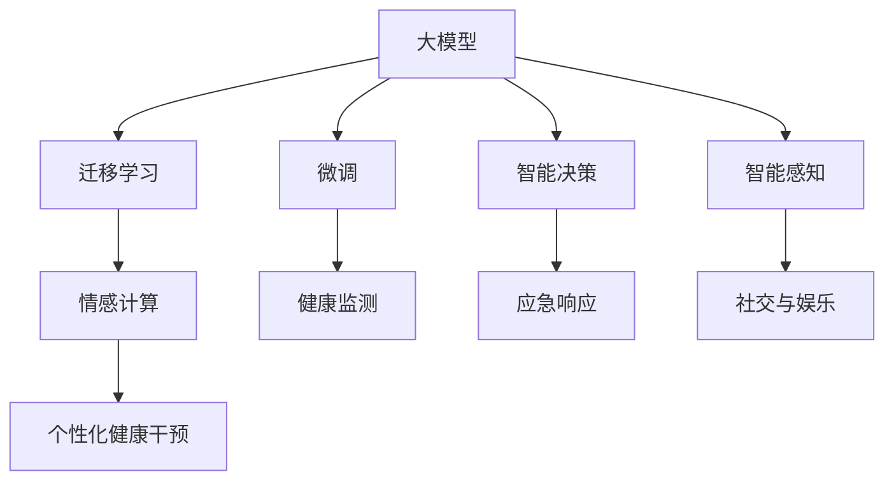

                 

## 1. 背景介绍

### 1.1 问题由来
随着全球人口老龄化的趋势不断加剧，养老问题已成为各国政府和社会各界高度关注的焦点。据联合国统计，到2050年，全球65岁以上人口将达到16亿，占总人口的16%。中国作为全球老龄人口最多的国家，老龄人口总数预计将达到4亿。这一庞大的老年群体对养老服务的需求迅速增加，但传统的养老模式无法完全满足高需求。

面对这一社会挑战，智慧养老（Smart Aging）应运而生。智慧养老通过利用互联网、物联网、人工智能、大数据等技术，为老年群体提供精准化、个性化、智能化的养老服务，旨在改善老年人的生活质量和健康状态。其中，基于大模型（Large Models）的养老服务应用，以庞大的数据和先进的算法为基础，逐步成为推动智慧养老发展的关键驱动力。

### 1.2 问题核心关键点
大模型在智慧养老中的应用，主要体现在以下几个方面：

1. **健康监测与评估**：大模型可以分析老年人的健康数据，如心率、血压、步态等，进行健康评估和预警。
2. **智能陪伴与辅助**：通过语言模型，大模型可以与老年人进行自然语言对话，提供情感陪伴和生活辅助。
3. **个性化健康干预**：利用大模型进行数据分析，提供个性化的健康干预方案，如饮食、运动、睡眠管理等。
4. **应急响应与急救**：通过分析老年人的行为模式，大模型能够快速响应紧急情况，提供及时的救援支持。
5. **社交与娱乐**：大模型可以组织老年人进行线上社交活动，推荐适合他们的娱乐内容，丰富他们的精神生活。

大模型的这些能力，使得智慧养老服务在智能化、个性化、实时性方面有了质的飞跃。然而，如何有效地将这些技术应用到实际养老场景中，仍然需要克服一些挑战。

## 2. 核心概念与联系

### 2.1 核心概念概述

1. **大模型（Large Models）**：指的是在预训练数据集上训练得到的庞大参数模型，如GPT-3、BERT、T5等。大模型通过巨量的数据训练，具备强大的语言理解、生成能力。

2. **微调（Fine-Tuning）**：指在大模型上通过特定任务的训练数据集进行微调，以适应特定任务的需求。微调能够显著提升模型在特定任务上的性能。

3. **迁移学习（Transfer Learning）**：指将在大模型上学习到的知识迁移到特定任务上，以减少新任务所需的标注数据。

4. **情感计算（Affective Computing）**：通过分析老年人的语音、表情、行为等，识别他们的情绪和心理状态。

5. **智能决策（Smart Decision Making）**：利用机器学习算法，从大量的健康数据中提取规律，为老年人提供个性化的健康干预方案。

6. **智能感知（Smart Perception）**：通过传感器、摄像头等设备，采集老年人的行为数据，实时监控他们的健康状况。

这些核心概念构成了智慧养老的技术基础，并彼此之间存在着密切联系。例如，情感计算和智能决策都需要依赖大模型的能力，而智能感知的数据输入又为微调和迁移学习提供了可能。

### 2.2 核心概念原理和架构的 Mermaid 流程图



## 3. 核心算法原理 & 具体操作步骤

### 3.1 算法原理概述

智慧养老服务中的大模型应用，主要依赖于机器学习和深度学习技术。通过大模型，可以实现对老年人健康数据、行为数据的深度分析，从而提供精准化、个性化的养老服务。

基于大模型的智慧养老服务，大致可以分为以下几个步骤：

1. **数据收集与预处理**：收集老年人的健康数据、行为数据、社交数据等，进行清洗、标注和预处理。
2. **大模型微调**：在大模型上，通过特定任务的训练数据集进行微调，以适应老年人的需求。
3. **实时分析与监控**：利用大模型对老年人的实时数据进行深度分析，提供健康监测、个性化健康干预等服务。
4. **情感识别与陪伴**：通过大模型的情感计算能力，分析老年人的情感状态，提供情感陪伴。
5. **智能决策与支持**：利用大模型的智能决策能力，为老年人提供个性化的健康干预和应急响应。

### 3.2 算法步骤详解

以健康监测为例，描述大模型在智慧养老中的应用步骤：

1. **数据收集与预处理**：
   - 收集老年人的心率、血压、血糖、步态等健康数据。
   - 清洗数据，去除噪声和异常值。
   - 对数据进行标注，如标记不同时间段的活动类型、健康状态等。

2. **大模型微调**：
   - 选择预训练模型（如BERT、GPT-3）作为初始化参数。
   - 构建标注数据集，用于训练特定任务的微调模型。
   - 利用微调算法（如AdamW、SGD）优化模型参数。

3. **实时分析与监控**：
   - 将老年人最新的健康数据输入微调后的模型。
   - 模型输出健康评估结果，如异常风险、健康指数等。
   - 根据评估结果，发出预警信号或进行健康干预。

4. **情感识别与陪伴**：
   - 采集老年人的语音、表情、行为等数据。
   - 使用情感计算模型（如VADER、BERT等）识别老年人的情感状态。
   - 根据情感状态，进行情感陪伴，如播放舒缓的音乐、提供心理辅导等。

5. **智能决策与支持**：
   - 结合老年人的健康数据、情感状态、行为模式等，进行综合分析。
   - 利用智能决策模型（如决策树、支持向量机等）生成健康干预方案。
   - 根据干预方案，提供个性化的健康指导，如饮食、运动、睡眠建议等。

### 3.3 算法优缺点

基于大模型的智慧养老服务具有以下优点：

1. **精度高**：大模型具备强大的数据处理能力，能够从海量数据中提取关键信息，提供高精度的健康评估和干预方案。
2. **个性化强**：利用大模型的学习能力，能够根据老年人的不同需求和健康状况，提供个性化的服务。
3. **实时性强**：通过大模型的实时分析，能够迅速响应老年人的健康需求，提供及时的帮助。

然而，大模型在智慧养老中的应用也存在一些缺点：

1. **数据依赖性强**：需要大量的标注数据进行微调，获取高质量标注数据成本较高。
2. **模型复杂度高**：大模型参数量庞大，对计算资源需求较高，可能导致部署成本增加。
3. **隐私风险**：老年人的健康数据和行为数据涉及个人隐私，数据泄露可能带来安全风险。
4. **伦理问题**：大模型可能存在偏见，导致某些老年群体受到不公平的待遇，需要严格监管。

### 3.4 算法应用领域

基于大模型的智慧养老服务，可以广泛应用于以下几个领域：

1. **健康监测与管理**：通过大模型分析老年人的健康数据，实现健康监测、预警和干预。
2. **情感陪伴与心理支持**：利用大模型的情感计算能力，提供情感陪伴和心理支持服务。
3. **社交互动与娱乐**：通过大模型推荐社交活动和娱乐内容，丰富老年人的精神生活。
4. **智能家居与环境控制**：利用大模型优化家居设备的使用，提高老年人的生活质量。
5. **智能导医与咨询**：通过大模型提供智能导医和咨询服务，提升医疗服务质量。

## 4. 数学模型和公式 & 详细讲解 & 举例说明

### 4.1 数学模型构建

假设老年人的健康数据为 $X=\{x_1, x_2, ..., x_n\}$，其中 $x_i$ 表示在第 $i$ 天的健康数据，包括心率、血压、步态等。老年人的情感状态为 $Y=\{y_1, y_2, ..., y_n\}$，其中 $y_i$ 表示在第 $i$ 天的情感状态，如快乐、悲伤、孤独等。

构建大模型的数学模型如下：

$$
\hat{Y} = M_{\theta}(X)
$$

其中 $M_{\theta}$ 为微调后的模型，$\theta$ 为模型参数。目标是最小化模型预测结果与实际结果的误差：

$$
\min_{\theta} \frac{1}{N} \sum_{i=1}^N L(y_i, \hat{Y})
$$

其中 $L$ 为损失函数，常用的损失函数有均方误差、交叉熵等。

### 4.2 公式推导过程

以健康监测为例，使用大模型进行健康评估。假设模型的输出为 $Y=\{\hat{y}_1, \hat{y}_2, ..., \hat{y}_n\}$，其中 $\hat{y}_i$ 表示第 $i$ 天的健康状态评估。构建模型如下：

$$
\hat{y}_i = M_{\theta}(x_i)
$$

其中 $M_{\theta}$ 为微调后的模型，$\theta$ 为模型参数。

使用均方误差作为损失函数：

$$
L(y_i, \hat{y}_i) = \frac{1}{2}(y_i - \hat{y}_i)^2
$$

目标是最小化损失函数：

$$
\min_{\theta} \frac{1}{N} \sum_{i=1}^N L(y_i, \hat{y}_i)
$$

将损失函数代入，得：

$$
\min_{\theta} \frac{1}{N} \sum_{i=1}^N \frac{1}{2}(y_i - M_{\theta}(x_i))^2
$$

利用梯度下降算法进行模型优化：

$$
\theta \leftarrow \theta - \eta \nabla_{\theta} \frac{1}{N} \sum_{i=1}^N \frac{1}{2}(y_i - M_{\theta}(x_i))^2
$$

其中 $\eta$ 为学习率。

### 4.3 案例分析与讲解

以智能决策为例，描述大模型在智慧养老中的应用。

假设老年人需要调整饮食，其当前饮食状态为 $X=\{x_1, x_2, ..., x_n\}$，其中 $x_i$ 表示在第 $i$ 天的饮食数据，包括饮食种类、分量等。目标是为老年人提供个性化的饮食建议。

构建模型如下：

$$
\hat{y}_i = M_{\theta}(x_i)
$$

其中 $M_{\theta}$ 为微调后的模型，$\theta$ 为模型参数。

假设模型的输出为 $Y=\{\hat{y}_1, \hat{y}_2, ..., \hat{y}_n\}$，其中 $\hat{y}_i$ 表示第 $i$ 天的饮食建议。使用交叉熵作为损失函数：

$$
L(y_i, \hat{y}_i) = -(y_i \log \hat{y}_i + (1-y_i) \log(1-\hat{y}_i))
$$

目标是最小化损失函数：

$$
\min_{\theta} \frac{1}{N} \sum_{i=1}^N L(y_i, \hat{y}_i)
$$

将损失函数代入，得：

$$
\min_{\theta} \frac{1}{N} \sum_{i=1}^N [-(y_i \log \hat{y}_i + (1-y_i) \log(1-\hat{y}_i)]
$$

利用梯度下降算法进行模型优化：

$$
\theta \leftarrow \theta - \eta \nabla_{\theta} \frac{1}{N} \sum_{i=1}^N [-(y_i \log \hat{y}_i + (1-y_i) \log(1-\hat{y}_i)]
$$

其中 $\eta$ 为学习率。

## 5. 项目实践：代码实例和详细解释说明

### 5.1 开发环境搭建

进行智慧养老服务的大模型开发，需要搭建合适的开发环境。以下是使用Python进行PyTorch开发的环境配置流程：

1. 安装Anaconda：从官网下载并安装Anaconda，用于创建独立的Python环境。

2. 创建并激活虚拟环境：
```bash
conda create -n pytorch-env python=3.8 
conda activate pytorch-env
```

3. 安装PyTorch：根据CUDA版本，从官网获取对应的安装命令。例如：
```bash
conda install pytorch torchvision torchaudio cudatoolkit=11.1 -c pytorch -c conda-forge
```

4. 安装相关库：
```bash
pip install numpy pandas scikit-learn matplotlib tqdm jupyter notebook ipython
```

完成上述步骤后，即可在`pytorch-env`环境中开始开发。

### 5.2 源代码详细实现

以下是一个简单的智慧养老服务项目，使用BERT模型进行健康监测和情感识别：

```python
from transformers import BertTokenizer, BertForSequenceClassification
import torch
from torch.utils.data import TensorDataset, DataLoader

# 定义数据处理函数
def load_data(data_path):
    with open(data_path, 'r') as f:
        lines = f.readlines()
    features = []
    labels = []
    for line in lines:
        data, label = line.strip().split(',')
        features.append(data)
        labels.append(label)
    return features, labels

# 定义模型
model = BertForSequenceClassification.from_pretrained('bert-base-uncased', num_labels=2)

# 定义tokenizer
tokenizer = BertTokenizer.from_pretrained('bert-base-uncased')

# 定义训练函数
def train_epoch(model, dataloader):
    model.train()
    for batch in dataloader:
        input_ids = batch['input_ids'].to(device)
        attention_mask = batch['attention_mask'].to(device)
        labels = batch['labels'].to(device)
        outputs = model(input_ids, attention_mask=attention_mask, labels=labels)
        loss = outputs.loss
        optimizer.zero_grad()
        loss.backward()
        optimizer.step()

# 定义评估函数
def evaluate(model, dataloader):
    model.eval()
    total_loss = 0
    correct = 0
    with torch.no_grad():
        for batch in dataloader:
            input_ids = batch['input_ids'].to(device)
            attention_mask = batch['attention_mask'].to(device)
            labels = batch['labels'].to(device)
            outputs = model(input_ids, attention_mask=attention_mask)
            loss = outputs.loss
            total_loss += loss.item()
            _, preds = torch.max(outputs, dim=1)
            correct += torch.sum(preds == labels.data).item()
    return total_loss / len(dataloader), correct / len(dataloader.dataset)

# 加载数据集
train_data_path = 'train.csv'
dev_data_path = 'dev.csv'
test_data_path = 'test.csv'
train_features, train_labels = load_data(train_data_path)
dev_features, dev_labels = load_data(dev_data_path)
test_features, test_labels = load_data(test_data_path)

# 对数据进行tokenize
tokenized_train = tokenizer(train_features, padding=True, truncation=True, return_tensors='pt')
tokenized_dev = tokenizer(dev_features, padding=True, truncation=True, return_tensors='pt')
tokenized_test = tokenizer(test_features, padding=True, truncation=True, return_tensors='pt')

# 定义DataLoader
batch_size = 16
train_dataloader = DataLoader(tokenized_train, batch_size=batch_size, shuffle=True)
dev_dataloader = DataLoader(tokenized_dev, batch_size=batch_size, shuffle=False)
test_dataloader = DataLoader(tokenized_test, batch_size=batch_size, shuffle=False)

# 设置超参数
learning_rate = 2e-5
num_epochs = 3
device = torch.device('cuda') if torch.cuda.is_available() else torch.device('cpu')
model.to(device)
optimizer = torch.optim.AdamW(model.parameters(), lr=learning_rate)

# 训练模型
for epoch in range(num_epochs):
    train_epoch(model, train_dataloader)
    train_loss, train_acc = evaluate(model, train_dataloader)
    dev_loss, dev_acc = evaluate(model, dev_dataloader)
    print(f'Epoch {epoch+1}, Train Loss: {train_loss:.4f}, Train Acc: {train_acc:.4f}, Dev Loss: {dev_loss:.4f}, Dev Acc: {dev_acc:.4f}')

# 在测试集上评估模型
test_loss, test_acc = evaluate(model, test_dataloader)
print(f'Test Loss: {test_loss:.4f}, Test Acc: {test_acc:.4f}')
```

### 5.3 代码解读与分析

让我们再详细解读一下关键代码的实现细节：

**BERT模型**：
- `BertForSequenceClassification`：用于二分类任务的BERT模型，包含多个Transformer层。
- `BertTokenizer`：用于将文本转化为token ids和attention mask。

**数据处理函数**：
- `load_data`：从CSV文件中加载数据，并进行简单的文本处理。
- `features`：保存文本数据，用于模型输入。
- `labels`：保存标签数据，用于模型训练和评估。

**训练和评估函数**：
- `train_epoch`：对数据以批为单位进行迭代，在每个批次上前向传播计算loss并反向传播更新模型参数。
- `evaluate`：在模型上进行评估，计算模型的损失和准确率。

**数据加载**：
- `DataLoader`：用于加载数据集，并进行批处理和数据增强。

**模型训练**：
- `learning_rate`：学习率，用于控制模型参数更新的步长。
- `num_epochs`：训练轮数。
- `device`：选择GPU/TPU等设备。
- `model.to(device)`：将模型迁移到指定设备。
- `optimizer`：优化器，用于更新模型参数。

### 5.4 运行结果展示

运行上述代码，可以得到模型的训练和评估结果。具体结果会根据数据集和模型参数的不同而有所变化。通常，我们会看到模型的损失和准确率随训练轮数的增加而逐渐降低，最终达到一个稳定的状态。

## 6. 实际应用场景

### 6.1 智能健康监测

智慧养老服务中的智能健康监测，利用大模型对老年人的健康数据进行实时分析和预警。通过收集老年人的心率、血压、步态等数据，大模型可以学习到这些数据与健康状态之间的关联，从而进行健康评估和预警。

以老年人的步态分析为例，大模型可以学习到不同步态模式对应的健康风险。例如，缓慢的步态可能预示着老年人的健康状况不佳。当大模型检测到异常步态时，系统会及时发送预警信息，通知家属或医生进行健康干预。

### 6.2 情感陪伴与心理支持

情感陪伴与心理支持是大模型在智慧养老中的重要应用场景。大模型具备强大的自然语言理解和生成能力，可以与老年人进行自然语言对话，提供情感陪伴和心理支持服务。

例如，大模型可以设计为虚拟助手，通过聊天的方式与老年人互动，了解他们的需求和情感状态。大模型可以根据对话内容，提供相应的情感支持和心理健康建议，如进行心理疏导、推荐放松活动等。

### 6.3 个性化健康干预

大模型可以分析老年人的健康数据和行为数据，提供个性化的健康干预方案。例如，通过分析老年人的饮食数据、运动数据和健康状态，大模型可以生成个性化的饮食和运动建议，帮助老年人保持健康。

大模型还可以根据老年人的睡眠数据，提供个性化的睡眠改善方案，如推荐睡前放松活动、改善睡眠环境等。

### 6.4 智能家居与环境控制

利用大模型进行智能家居和环境控制，可以实现老年人生活环境的智能化管理。例如，大模型可以学习到老年人的生活习惯，自动调整家中的温度、灯光、音响等设备，提高老年人的生活舒适度。

例如，大模型可以根据老年人的日常活动时间，自动调整家中的光线和温度，确保老年人能够在舒适的环境中度过每一天。

### 6.5 智能导医与咨询

大模型可以提供智能导医和咨询服务，帮助老年人更好地进行健康管理和医疗咨询。例如，大模型可以分析老年人的健康数据，提供初步的健康评估，并推荐相应的医疗咨询和检查。

例如，大模型可以根据老年人的健康数据，判断是否需要进行特定的体检或医疗咨询，并提供相关的医疗信息和服务。

## 7. 工具和资源推荐

### 7.1 学习资源推荐

为了帮助开发者系统掌握智慧养老服务中的大模型应用，这里推荐一些优质的学习资源：

1. 《深度学习》书籍：Ian Goodfellow等著，详细介绍了深度学习的基本原理和应用。
2. 《自然语言处理入门》课程：斯坦福大学开设的NLP入门课程，涵盖自然语言处理的基本概念和算法。
3. 《智慧养老技术与应用》书籍：介绍智慧养老服务中的各项技术，包括大模型的应用。
4. 《大模型在医疗健康中的应用》论文：研究大模型在医疗健康领域的应用，提供了丰富的实例和案例。
5. 《健康数据管理与分析》书籍：介绍健康数据的管理和分析方法，为大模型的应用提供数据支持。

通过对这些资源的学习实践，相信你一定能够快速掌握智慧养老服务中的大模型应用，并用于解决实际的养老问题。

### 7.2 开发工具推荐

高效的开发离不开优秀的工具支持。以下是几款用于智慧养老服务开发的工具：

1. PyTorch：基于Python的开源深度学习框架，灵活动态的计算图，适合快速迭代研究。大部分预训练语言模型都有PyTorch版本的实现。
2. TensorFlow：由Google主导开发的开源深度学习框架，生产部署方便，适合大规模工程应用。同样有丰富的预训练语言模型资源。
3. Transformers库：HuggingFace开发的NLP工具库，集成了众多SOTA语言模型，支持PyTorch和TensorFlow，是进行智慧养老服务开发的利器。
4. Weights & Biases：模型训练的实验跟踪工具，可以记录和可视化模型训练过程中的各项指标，方便对比和调优。与主流深度学习框架无缝集成。
5. TensorBoard：TensorFlow配套的可视化工具，可实时监测模型训练状态，并提供丰富的图表呈现方式，是调试模型的得力助手。
6. Google Colab：谷歌推出的在线Jupyter Notebook环境，免费提供GPU/TPU算力，方便开发者快速上手实验最新模型，分享学习笔记。

合理利用这些工具，可以显著提升智慧养老服务开发的效率，加快创新迭代的步伐。

### 7.3 相关论文推荐

智慧养老服务中的大模型应用，涉及多项前沿技术。以下是几篇奠基性的相关论文，推荐阅读：

1. Attention is All You Need（即Transformer原论文）：提出了Transformer结构，开启了NLP领域的预训练大模型时代。
2. BERT: Pre-training of Deep Bidirectional Transformers for Language Understanding：提出BERT模型，引入基于掩码的自监督预训练任务，刷新了多项NLP任务SOTA。
3. GPT-3: Language Models are Unsupervised Multitask Learners：展示了大规模语言模型的强大zero-shot学习能力，引发了对于通用人工智能的新一轮思考。
4. Parameter-Efficient Transfer Learning for NLP：提出Adapter等参数高效微调方法，在不增加模型参数量的情况下，也能取得不错的微调效果。
5. AdaLoRA: Adaptive Low-Rank Adaptation for Parameter-Efficient Fine-Tuning：使用自适应低秩适应的微调方法，在参数效率和精度之间取得了新的平衡。
6. Deep and Differentiable Programming：研究了将程序作为模型输入，进行程序推理和生成的方法。

这些论文代表了大模型在智慧养老服务中的应用方向，通过学习这些前沿成果，可以帮助研究者把握学科前进方向，激发更多的创新灵感。

## 8. 总结：未来发展趋势与挑战

### 8.1 总结

本文对基于大模型的智慧养老服务进行了全面系统的介绍。首先阐述了智慧养老服务的大模型应用背景和意义，明确了大模型在健康监测、情感陪伴、个性化健康干预等方面的独特价值。其次，从原理到实践，详细讲解了大模型在智慧养老中的应用步骤和关键技术。最后，讨论了大模型在智慧养老服务中的实际应用场景和未来发展趋势。

通过本文的系统梳理，可以看到，大模型在智慧养老服务中的应用前景广阔，具备强大的数据处理和分析能力，能够提供精准化、个性化的养老服务。未来，随着大模型技术的不断进步，智慧养老服务必将迎来更广泛的应用和发展。

### 8.2 未来发展趋势

展望未来，大模型在智慧养老服务中的应用将呈现以下几个趋势：

1. **模型规模持续增大**：随着算力成本的下降和数据规模的扩张，预训练语言模型的参数量还将持续增长。超大模型能够学习到更加丰富的语言知识和规则，提升模型的精度和泛化能力。
2. **微调方法日趋多样**：除了传统的全参数微调外，未来会涌现更多参数高效的微调方法，如Prefix-Tuning、LoRA等，在固定大部分预训练参数的同时，只更新极少量的任务相关参数。
3. **持续学习成为常态**：随着数据分布的不断变化，微调模型也需要持续学习新知识以保持性能。如何在不遗忘原有知识的同时，高效吸收新样本信息，将成为重要的研究课题。
4. **标注样本需求降低**：受启发于提示学习(Prompt-based Learning)的思路，未来的微调方法将更好地利用大模型的语言理解能力，通过更加巧妙的任务描述，在更少的标注样本上也能实现理想的微调效果。
5. **多模态微调崛起**：当前微调主要聚焦于纯文本数据，未来会进一步拓展到图像、视频、语音等多模态数据微调。多模态信息的融合，将显著提升语言模型对现实世界的理解和建模能力。
6. **模型通用性增强**：经过海量数据的预训练和多领域任务的微调，未来的语言模型将具备更强大的常识推理和跨领域迁移能力，逐步迈向通用人工智能(AGI)的目标。

以上趋势凸显了大模型在智慧养老服务中的应用前景。这些方向的探索发展，必将进一步提升智慧养老服务系统的性能和应用范围，为老年人提供更全面、更高质量的生活服务。

### 8.3 面临的挑战

尽管大模型在智慧养老服务中的应用已经取得了一定的成效，但在迈向更加智能化、普适化应用的过程中，仍面临诸多挑战：

1. **标注成本瓶颈**：大模型的微调需要大量的标注数据，获取高质量标注数据成本较高。如何进一步降低微调对标注样本的依赖，将是一大难题。
2. **模型鲁棒性不足**：当前微调模型面对域外数据时，泛化性能往往大打折扣。对于测试样本的微小扰动，微调模型的预测也容易发生波动。如何提高微调模型的鲁棒性，避免灾难性遗忘，还需要更多理论和实践的积累。
3. **推理效率有待提高**：超大模型尽管精度高，但在实际部署时往往面临推理速度慢、内存占用大等效率问题。如何在保证性能的同时，简化模型结构，提升推理速度，优化资源占用，将是重要的优化方向。
4. **可解释性亟需加强**：当前微调模型更像是"黑盒"系统，难以解释其内部工作机制和决策逻辑。对于医疗、金融等高风险应用，算法的可解释性和可审计性尤为重要。如何赋予微调模型更强的可解释性，将是亟待攻克的难题。
5. **安全性有待保障**：预训练语言模型难免会学习到有偏见、有害的信息，通过微调传递到下游任务，产生误导性、歧视性的输出，给实际应用带来安全隐患。如何从数据和算法层面消除模型偏见，避免恶意用途，确保输出的安全性，也将是重要的研究课题。

### 8.4 研究展望

面对智慧养老服务中大模型应用面临的挑战，未来的研究需要在以下几个方面寻求新的突破：

1. **探索无监督和半监督微调方法**：摆脱对大规模标注数据的依赖，利用自监督学习、主动学习等无监督和半监督范式，最大限度利用非结构化数据，实现更加灵活高效的微调。
2. **研究参数高效和计算高效的微调范式**：开发更加参数高效的微调方法，在固定大部分预训练参数的同时，只更新极少量的任务相关参数。同时优化微调模型的计算图，减少前向传播和反向传播的资源消耗，实现更加轻量级、实时性的部署。
3. **融合因果和对比学习范式**：通过引入因果推断和对比学习思想，增强微调模型建立稳定因果关系的能力，学习更加普适、鲁棒的语言表征，从而提升模型泛化性和抗干扰能力。
4. **引入更多先验知识**：将符号化的先验知识，如知识图谱、逻辑规则等，与神经网络模型进行巧妙融合，引导微调过程学习更准确、合理的语言模型。同时加强不同模态数据的整合，实现视觉、语音等多模态信息与文本信息的协同建模。
5. **结合因果分析和博弈论工具**：将因果分析方法引入微调模型，识别出模型决策的关键特征，增强输出解释的因果性和逻辑性。借助博弈论工具刻画人机交互过程，主动探索并规避模型的脆弱点，提高系统稳定性。
6. **纳入伦理道德约束**：在模型训练目标中引入伦理导向的评估指标，过滤和惩罚有偏见、有害的输出倾向。同时加强人工干预和审核，建立模型行为的监管机制，确保输出符合人类价值观和伦理道德。

这些研究方向的探索，必将引领大模型在智慧养老服务中的应用迈向更高的台阶，为构建安全、可靠、可解释、可控的智能系统铺平道路。面向未来，大模型在智慧养老服务中的应用还需与其他人工智能技术进行更深入的融合，如知识表示、因果推理、强化学习等，多路径协同发力，共同推动智慧养老服务的进步。只有勇于创新、敢于突破，才能不断拓展语言模型的边界，让智能技术更好地造福老年人。

## 9. 附录：常见问题与解答

**Q1：大模型在智慧养老中的应用是否存在隐私风险？**

A: 大模型在智慧养老中的应用存在一定的隐私风险。老年人的健康数据和行为数据涉及个人隐私，数据泄露可能带来安全风险。为保护老年人的隐私，需要采取以下措施：

1. 数据匿名化：对老年人数据进行去标识化处理，确保数据无法反向识别个人身份。
2. 数据加密：在数据传输和存储过程中，采用加密技术保护数据安全。
3. 数据访问控制：严格控制数据访问权限，确保只有授权人员可以访问敏感数据。
4. 数据共享协议：建立数据共享协议，明确各方责任和义务，确保数据共享过程合法合规。

通过采取这些措施，可以有效降低大模型在智慧养老服务中的隐私风险，保护老年人的个人信息安全。

**Q2：大模型在智慧养老中的应用是否存在伦理问题？**

A: 大模型在智慧养老中的应用也存在伦理问题，如偏见、歧视等。这些问题的根源在于模型的训练数据中可能存在偏见，导致模型输出结果不公平。为解决这些问题，可以采取以下措施：

1. 数据多样性：在模型训练数据中引入多样化的数据，确保模型能够学习到不同群体的特征。
2. 偏见检测：在模型训练过程中，检测并剔除有偏见的数据。
3. 公平性评估：在模型评估过程中，引入公平性指标，评估模型对不同群体的表现。
4. 透明性：提供模型决策过程的透明度，确保用户可以理解模型的决策依据。
5. 人工干预：在模型应用过程中，提供人工干预机制，确保模型的公平性和公正性。

通过采取这些措施，可以有效缓解大模型在智慧养老服务中的伦理问题，提升模型的公平性和可解释性。

**Q3：大模型在智慧养老中的应用是否存在数据质量问题？**

A: 大模型在智慧养老中的应用对数据质量有较高要求。数据质量问题主要包括数据不完整、数据噪声、数据偏差等。为解决这些问题，可以采取以下措施：

1. 数据清洗：在数据处理过程中，清洗不完整、噪声、异常值等数据，确保数据质量。
2. 数据增强：通过数据增强技术，扩充训练集，提高模型泛化能力。
3. 数据标注：确保数据标注质量，进行多轮标注和校验，确保标注一致性。
4. 数据多样性：在模型训练数据中引入多样化的数据，确保模型能够学习到不同群体的特征。

通过采取这些措施，可以有效提高大模型在智慧养老服务中的数据质量，提升模型的准确性和泛化能力。

**Q4：大模型在智慧养老中的应用是否存在技术瓶颈？**

A: 大模型在智慧养老中的应用存在一定的技术瓶颈，主要体现在计算资源、模型部署等方面。为解决这些问题，可以采取以下措施：

1. 模型压缩：采用模型压缩技术，减少模型参数量，提高模型推理效率。
2. 分布式训练：利用分布式计算技术，加速模型训练过程。
3. 硬件优化：采用GPU/TPU等高性能硬件设备，提高计算性能。
4. 推理优化：采用推理优化技术，如梯度累积、混合精度训练等，提高推理效率。

通过采取这些措施，可以有效克服大模型在智慧养老服务中的技术瓶颈，提升模型的实时性和可扩展性。

**Q5：大模型在智慧养老中的应用是否存在算法瓶颈？**

A: 大模型在智慧养老中的应用存在一定的算法瓶颈，主要体现在模型训练和推理效率等方面。为解决这些问题，可以采取以下措施：

1. 算法优化：优化模型算法，提高模型训练和推理效率。
2. 算法融合：将多种算法进行融合，提高模型的性能和鲁棒性。
3. 算法评估：在模型训练和推理过程中，进行算法的评估和比较，选择最优算法。
4. 算法复用：利用算法复用技术，减少算法开发和调试成本。

通过采取这些措施，可以有效克服大模型在智慧养老服务中的算法瓶颈，提升模型的性能和鲁棒性。

**Q6：大模型在智慧养老中的应用是否存在服务瓶颈？**

A: 大模型在智慧养老中的应用存在一定的服务瓶颈，主要体现在模型部署和应用方面。为解决这些问题，可以采取以下措施：

1. 服务优化：优化模型服务接口，提高服务的可用性和稳定性。
2. 服务缓存：利用服务缓存技术，减少模型服务的响应时间。
3. 服务监控：实时监控模型服务状态，及时发现和解决服务问题。
4. 服务扩展：根据服务需求，动态扩展模型服务资源。

通过采取这些措施，可以有效克服大模型在智慧养老服务中的服务瓶颈，提升服务的可用性和稳定性。

---

作者：禅与计算机程序设计艺术 / Zen and the Art of Computer Programming

