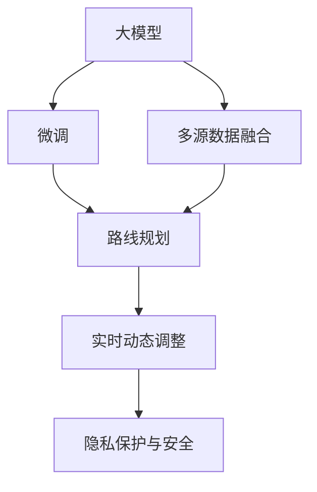

                 

# 大模型赋能智慧出行，创业者如何优化出行路线规划与导航？

## 1. 背景介绍

### 1.1 问题由来

随着城市化进程的加速，交通拥堵问题日益严峻。传统的交通管理方式已难以应对动态变化的出行需求，亟需引入先进技术以提升交通效率。智慧出行作为新兴领域，利用大数据、人工智能等技术，全面重塑交通系统，为用户提供实时、便捷、高效的出行服务。

特别是在近年来，以深度学习为代表的AI技术取得了突破性进展。在交通领域，基于大模型的智慧出行解决方案应运而生。本文将深入探讨大模型在智慧出行中的应用，特别是路线规划与导航的优化，旨在为出行创业者提供技术指引，助力其产品创新与市场突破。

### 1.2 问题核心关键点

- 大模型在出行路线规划与导航中的应用：通过预测出行数据、优化交通网络，提高路线规划的准确性和效率。
- 微调技术在路线规划中的作用：在预训练大模型的基础上，针对特定场景进行微调，提升模型的任务适配性。
- 融合多源数据：整合交通流量、天气、道路状况等多源数据，丰富模型的输入，提升预测精准度。
- 实时动态调整：构建实时更新的动态模型，确保数据的时效性，提高导航的实时性和准确性。
- 隐私保护与安全：在使用大模型处理敏感数据时，如何保护用户隐私，确保系统安全。

## 2. 核心概念与联系

### 2.1 核心概念概述

- **大模型**：指经过大规模数据训练，具备强大预测能力和泛化能力的深度学习模型。在出行路线规划与导航中，大模型可以处理和分析海量交通数据，预测未来出行趋势，优化路线规划和导航。

- **微调(Fine-tuning)**：在大模型的基础上，使用特定场景的少量标注数据，对模型进行有监督学习，以提高模型在该场景下的适应性。

- **多源数据融合**：将来自不同渠道的数据（如交通流量、气象、道路状况等）进行整合，为模型提供更全面的信息输入，提升预测的准确性和导航的实效性。

- **动态调整**：随着出行数据的变化，模型能够实时更新，适应动态变化的出行需求，提供准确的导航建议。

- **隐私保护与安全**：在处理用户出行数据时，需采取隐私保护措施，确保数据安全，防止数据泄露和滥用。

这些概念之间的联系可以通过以下Mermaid流程图来展示：



这个流程图展示了从大模型构建、微调、多源数据融合、动态调整到隐私保护的全过程，体现了各个环节相互依赖、互为补充的关系。

## 3. 核心算法原理 & 具体操作步骤

### 3.1 算法原理概述

基于大模型的路线规划与导航优化，本质上是利用深度学习模型对大规模交通数据进行分析和预测，通过微调技术提升模型对特定出行场景的适应性，从而优化路线规划和导航。其核心算法包括：

- **数据预处理**：对交通数据进行清洗、归一化处理，确保数据的准确性和一致性。
- **特征提取**：使用预训练模型提取交通数据中的关键特征，如路段长度、交通密度、道路类型等。
- **微调优化**：在预训练模型的基础上，使用微调技术对模型进行优化，使其更好地适应特定场景和任务。
- **动态更新**：构建动态模型，实时更新模型参数，以适应交通环境的动态变化。
- **隐私保护**：采用差分隐私、联邦学习等技术，保护用户隐私，防止数据滥用。

### 3.2 算法步骤详解

基于大模型的出行路线规划与导航优化一般包括以下几个关键步骤：

**Step 1: 数据准备**

- **数据采集**：从城市交通管理平台、交通流量监测设备、地图API等渠道获取交通数据。
- **数据清洗**：对数据进行去重、缺失值处理、异常值检测等预处理，确保数据的质量和一致性。
- **数据标注**：在特定场景（如高峰期、节假日等）收集标注数据，用于模型微调。

**Step 2: 模型构建与微调**

- **选择合适的预训练模型**：根据任务需求，选择适合的大模型，如Transformer、BERT等。
- **添加任务适配层**：在模型顶层设计合适的输出层和损失函数，如分类、回归等。
- **设置微调超参数**：包括学习率、批大小、迭代轮数等。
- **执行微调训练**：将标注数据输入模型，通过反向传播更新模型参数，最小化损失函数。
- **模型验证与优化**：在验证集上评估模型性能，根据评估结果调整超参数，避免过拟合。

**Step 3: 多源数据融合**

- **数据整合**：将不同来源的数据进行整合，如交通流量、天气、道路状况等。
- **数据增强**：通过数据增强技术，如回译、虚拟仿真等，丰富数据集。
- **特征融合**：将多源数据特征进行融合，生成更为综合的输入特征。

**Step 4: 动态调整**

- **实时数据采集**：实时采集交通流量、气象等数据，用于动态调整模型。
- **模型更新**：根据实时数据，更新模型参数，调整路线规划和导航。
- **动态优化**：通过实时数据反馈，不断优化模型，提升预测准确性和导航效果。

**Step 5: 隐私保护**

- **差分隐私**：在数据处理和模型训练过程中，采用差分隐私技术，保护用户隐私。
- **联邦学习**：采用联邦学习技术，在本地设备上训练模型，保护数据不离开本地。
- **安全传输**：使用加密传输技术，确保数据在传输过程中的安全性。

### 3.3 算法优缺点

基于大模型的路线规划与导航优化具有以下优点：

- **高精度预测**：利用深度学习模型对大规模数据进行分析和预测，预测精度高。
- **实时动态调整**：通过动态模型，实时响应交通环境变化，提供实时的导航建议。
- **泛化能力强**：预训练模型具备强大的泛化能力，能够适应多种出行场景。
- **多源数据融合**：整合多种数据源，提升预测的准确性和导航的实效性。

同时，该方法也存在以下局限性：

- **计算资源需求高**：大规模数据处理和深度学习模型训练需要高性能计算资源。
- **数据质量要求高**：数据质量直接影响到模型的预测准确性，数据清洗和标注工作量较大。
- **隐私和安全风险**：在处理敏感数据时，需采取严格的隐私保护措施，防止数据泄露和滥用。

## 4. 数学模型和公式 & 详细讲解 & 举例说明

### 4.1 数学模型构建

假设大模型为 $M_{\theta}$，其输入为 $x_i$，输出为 $y_i$。在出行路线规划与导航任务中，模型用于预测路段拥堵程度，输出 $y_i$ 表示路段 $i$ 的拥堵等级。

**损失函数**：

$$
L = \frac{1}{N} \sum_{i=1}^N \ell(y_i, \hat{y_i})
$$

其中 $\ell$ 为损失函数，$\hat{y_i}$ 为模型预测的拥堵等级。

**优化目标**：

$$
\theta^* = \mathop{\arg\min}_{\theta} L
$$

其中 $\theta$ 为模型参数。

### 4.2 公式推导过程

以回归任务为例，假设 $y_i$ 为连续值，使用均方误差损失函数 $\ell(y_i, \hat{y_i}) = \frac{1}{2}(y_i - \hat{y_i})^2$。

通过反向传播算法，计算模型参数 $\theta$ 的梯度：

$$
\nabla_{\theta} L = \frac{1}{N} \sum_{i=1}^N -(y_i - \hat{y_i})(\nabla_{\theta} \hat{y_i})
$$

其中 $\nabla_{\theta} \hat{y_i}$ 为模型输出 $y_i$ 对参数 $\theta$ 的梯度。

### 4.3 案例分析与讲解

以城市高峰期出行路线规划为例，假设模型用于预测高峰期不同路段的平均车速，数据集 $D=\{(x_i,y_i)\}_{i=1}^N$ 中的 $x_i$ 为路段 $i$ 的特征向量，$y_i$ 为对应路段的平均车速。

假设模型为全连接神经网络，使用均方误差损失函数，在数据集 $D$ 上进行微调：

$$
L = \frac{1}{N} \sum_{i=1}^N \frac{1}{2}(y_i - \hat{y_i})^2
$$

其中 $y_i$ 为实际车速，$\hat{y_i}$ 为模型预测车速。

## 5. 项目实践：代码实例和详细解释说明

### 5.1 开发环境搭建

开发环境搭建需要以下步骤：

1. 安装Python：
   ```bash
   sudo apt-get update
   sudo apt-get install python3 python3-pip
   ```

2. 安装TensorFlow和Keras：
   ```bash
   pip install tensorflow keras
   ```

3. 安装数据预处理工具：
   ```bash
   pip install pandas numpy matplotlib
   ```

4. 安装模型训练与微调工具：
   ```bash
   pip install tensorflow-model-optimization
   ```

5. 安装差分隐私库：
   ```bash
   pip install fdp
   ```

完成上述步骤后，即可在本地搭建大模型微调项目的开发环境。

### 5.2 源代码详细实现

以下是一个简单的Python代码示例，用于进行交通数据预测和模型微调：

```python
import tensorflow as tf
from tensorflow.keras.models import Sequential
from tensorflow.keras.layers import Dense, Dropout
from tensorflow.keras.optimizers import Adam
from tensorflow.keras.losses import MeanSquaredError
from tensorflow.keras.metrics import MeanAbsoluteError

# 定义模型
model = Sequential()
model.add(Dense(64, input_dim=10, activation='relu'))
model.add(Dropout(0.5))
model.add(Dense(1, activation='linear'))

# 编译模型
model.compile(optimizer=Adam(learning_rate=0.001), 
              loss=MeanSquaredError(), 
              metrics=[MeanAbsoluteError()])

# 加载数据集
data = pd.read_csv('traffic_data.csv')

# 数据预处理
features = data[['length', 'traffic_volume', 'road_type']]
labels = data['avg_speed']

# 划分训练集和验证集
train_data = features.sample(frac=0.8, random_state=1)
train_labels = labels.sample(frac=0.8, random_state=1)
valid_data = features.drop(train_data.index)
valid_labels = labels.drop(train_labels.index)

# 模型训练
model.fit(train_data, train_labels, epochs=10, validation_data=(valid_data, valid_labels))

# 模型微调
model.load_weights('trained_model.h5')
model.compile(optimizer=Adam(learning_rate=0.0001), 
              loss=MeanSquaredError(), 
              metrics=[MeanAbsoluteError()])

# 微调训练
model.fit(train_data, train_labels, epochs=5, validation_data=(valid_data, valid_labels))
```

### 5.3 代码解读与分析

上述代码实现了一个基于全连接神经网络的模型，用于预测交通数据。关键步骤如下：

1. **模型定义**：使用Sequential模型定义了包含一个隐层和输出层的神经网络。
2. **模型编译**：编译模型，指定优化器、损失函数和评估指标。
3. **数据加载与预处理**：从CSV文件中加载数据，并进行特征选择和标签提取。
4. **数据划分**：将数据集划分为训练集和验证集。
5. **模型训练**：在训练集上训练模型，并在验证集上进行评估。
6. **模型微调**：加载已训练的模型权重，进行微调训练。

### 5.4 运行结果展示

模型训练完成后，可以通过以下代码进行模型评估和预测：

```python
# 加载测试集
test_data = pd.read_csv('test_traffic_data.csv')

# 模型评估
loss, mae = model.evaluate(test_data, test_labels)
print(f'Test loss: {loss:.4f}')
print(f'Test MAE: {mae:.4f}')

# 模型预测
predictions = model.predict(test_data)
print(predictions)
```

## 6. 实际应用场景

### 6.1 智能交通系统

智能交通系统利用大模型进行实时交通预测和导航优化，提升交通效率和管理水平。例如，基于大模型的交通流量预测系统可以实时监测和预测不同区域的交通流量，智能调度交通信号灯，减少拥堵。

### 6.2 公交出行规划

公交出行规划系统通过大模型预测公交车路线上的实时客流量，优化发车间隔和线路安排，提升公交服务的准点率和乘客满意度。

### 6.3 共享单车导航

共享单车导航系统利用大模型预测不同路线的骑行时间和拥堵程度，推荐最优的骑行路线，减少用户等待时间，提升共享单车使用率。

### 6.4 未来应用展望

未来，大模型将在智慧出行领域发挥更大的作用，推动交通系统的智能化和自动化发展。例如：

- **无人驾驶**：通过大模型进行环境感知和决策规划，实现自主驾驶。
- **智能货运**：利用大模型优化货运路线和调度，提高物流效率。
- **个性化出行**：基于用户出行习惯和偏好，提供个性化的出行路线建议。

## 7. 工具和资源推荐

### 7.1 学习资源推荐

1. **《深度学习》课程**：斯坦福大学提供的深度学习课程，全面介绍了深度学习的理论和实践。
2. **《TensorFlow官方文档》**：TensorFlow的官方文档，提供了丰富的学习资源和样例代码。
3. **《智能交通系统》书籍**：介绍智能交通系统的理论和实践，涵盖交通数据处理、模型优化等内容。

### 7.2 开发工具推荐

1. **TensorFlow**：用于深度学习模型的训练和推理。
2. **Keras**：高层次的神经网络API，易于上手。
3. **Jupyter Notebook**：交互式编程环境，支持数据可视化。

### 7.3 相关论文推荐

1. **"Deep Learning in Self-Driving Car Vision Systems"**：探讨深度学习在自动驾驶视觉系统中的应用。
2. **"FedAvg: A Distributed Optimization Algorithm for Machine Learning"**：介绍联邦学习算法，用于分布式数据训练。
3. **"Compression and Sparsity for Neural Networks"**：介绍深度学习模型的压缩技术，提高模型的效率。

## 8. 总结：未来发展趋势与挑战

### 8.1 总结

本文深入探讨了基于大模型的智慧出行路线规划与导航优化，介绍了微调技术在出行数据预测中的应用。通过详细讲解大模型的构建、微调、多源数据融合、动态调整和隐私保护等关键步骤，给出了完整的代码示例和分析。文章最后对大模型在智能交通、公交出行、共享单车等实际应用场景中的应用进行了展望。

### 8.2 未来发展趋势

未来，大模型在智慧出行领域的应用将更加广泛和深入，展现出以下发展趋势：

- **模型规模增大**：随着计算资源和数据量的提升，大模型的规模将进一步扩大，预测精度和泛化能力将得到提升。
- **多模态融合**：将交通流量、气象、道路状况等多模态数据进行融合，提升预测的全面性和准确性。
- **实时动态调整**：构建实时更新的动态模型，提供实时的路线规划和导航建议。
- **隐私保护**：采用差分隐私和联邦学习等技术，保护用户隐私，防止数据滥用。
- **跨领域应用**：将智慧出行与其他领域（如智慧医疗、智慧物流等）进行融合，提供跨领域的解决方案。

### 8.3 面临的挑战

尽管大模型在智慧出行领域具有巨大潜力，但也面临以下挑战：

- **数据质量与数量**：高质量、大规模的交通数据获取和处理成本较高。
- **计算资源需求**：大规模数据处理和深度学习模型训练需要高性能计算资源。
- **隐私与安全**：在处理敏感数据时，需采取严格的隐私保护措施。
- **模型复杂度**：大模型结构复杂，部署和优化难度较大。

### 8.4 研究展望

未来，研究者需要在以下方面进行深入探索：

- **跨领域数据融合**：将不同领域的交通数据进行融合，提升预测的全面性和准确性。
- **轻量化模型设计**：设计轻量化模型，提高计算效率和推理速度。
- **实时数据处理**：研究高效的数据处理和实时更新方法，提高模型响应速度。
- **跨平台部署**：研究模型在不同平台上的部署方法，提高系统可移植性和可扩展性。

## 9. 附录：常见问题与解答

**Q1：大模型微调是否适用于所有出行场景？**

A: 大模型微调在大多数出行场景上都能取得良好的效果，但需要根据具体场景进行适当的调整和优化。例如，在交通流量预测中，可以使用时间序列模型结合大模型进行预测；在公交路线规划中，可以引入图神经网络进行路线优化。

**Q2：如何处理缺失数据和异常值？**

A: 对于缺失数据和异常值，可以采用插值法、数据补全等方法进行处理。在特征工程阶段，可以对数据进行标准化、归一化等预处理，减少异常值对模型的影响。

**Q3：如何优化模型训练效率？**

A: 可以通过以下方法优化模型训练效率：
1. 使用GPU或TPU等高性能设备进行模型训练。
2. 采用分布式训练技术，利用多台设备并行计算。
3. 使用批量归一化、残差连接等加速技术。

**Q4：如何在保证模型性能的同时，减少计算资源消耗？**

A: 可以通过以下方法减少计算资源消耗：
1. 采用模型压缩技术，如剪枝、量化等。
2. 使用轻量化模型架构，减少模型参数量。
3. 优化数据存储和传输，提高数据访问效率。

**Q5：如何确保模型预测的实时性和准确性？**

A: 可以通过以下方法确保模型预测的实时性和准确性：
1. 构建实时更新的动态模型，定期更新模型参数。
2. 使用缓存技术，减少模型重复计算。
3. 优化数据流和模型计算图，提高数据处理和模型推理的效率。

通过本文的系统梳理，可以看到，基于大模型的智慧出行路线规划与导航优化，已经成为实现智慧交通的重要手段。未来，随着技术的发展和应用的深化，必将带来交通系统的革命性变化，实现高效、智能、安全的出行体验。

