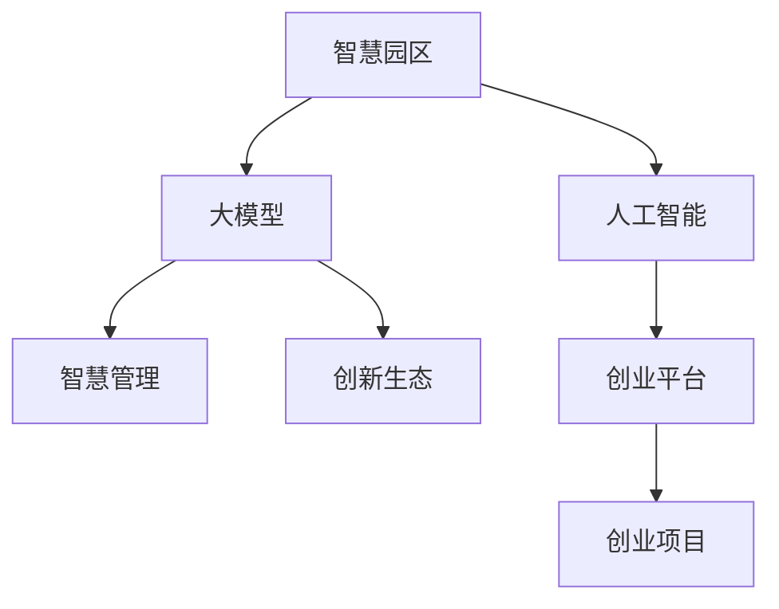

                 

# 大模型赋能智慧园区，创业者如何打造创新生态？

> 关键词：智慧园区,人工智能,大模型,创新生态,智慧管理,创业平台,创业项目

## 1. 背景介绍

### 1.1 问题由来

智慧园区作为城市发展的趋势之一，正在逐步成为推动城市化、信息化和产业升级的关键引擎。传统的园区管理模式受限于人工管理和手动操作，效率低下且易出错。而通过引入人工智能和大模型技术，智慧园区能够实现自动化、智能化和可视化的管理，大幅提升管理效率和决策准确性。

### 1.2 问题核心关键点

大模型在智慧园区中的应用，主要集中在以下几个方面：

- 自动化设备管理：通过大模型对园区内的各类传感器和监控设备进行实时监控和数据分析，自动化管理各种设备，降低人力成本，提升管理效率。
- 智能园区运营：利用大模型进行园区内的运营数据统计、人员流动预测、能耗管理等，优化园区运营，提高经济效益。
- 数据分析与决策支持：通过大模型对园区内的海量数据进行分析，提取出有价值的信息和洞察，为园区管理决策提供科学依据。
- 智慧公共服务：通过大模型实现园区内的智能客服、信息检索、智能问答等功能，提升园区公共服务的智能化水平。
- 创新生态构建：通过大模型平台，帮助创业者孵化和加速创业项目，推动园区内的技术创新和产业升级。

### 1.3 问题研究意义

大模型在智慧园区中的应用，对于提升园区管理水平、优化运营模式、推动技术创新和产业升级具有重要意义：

1. 提升园区管理水平：通过自动化和智能化管理，大模型能显著提高园区管理的效率和准确性，降低管理成本。
2. 优化园区运营：利用大模型进行数据分析和预测，帮助园区运营方制定更科学合理的管理策略，优化园区资源配置。
3. 推动技术创新和产业升级：大模型为创业项目提供了丰富的数据和计算资源，帮助创业者快速验证和迭代技术方案，加速技术成果的落地应用。
4. 构建智慧公共服务体系：通过大模型提供智能化的公共服务，提升园区居民的生活体验和满意度。
5. 打造创新生态：大模型平台为创业者提供良好的技术支撑和资源共享环境，促进技术交流和合作，激发创新活力。

## 2. 核心概念与联系

### 2.1 核心概念概述

为更好地理解大模型在智慧园区中的应用，本节将介绍几个密切相关的核心概念：

- 智慧园区：指利用信息技术和智能化手段，实现园区内的管理、运营、服务和公共服务智能化的新型园区。
- 人工智能：指通过计算机模拟人类智能的科技，涵盖机器学习、深度学习、自然语言处理等多个领域。
- 大模型：指通过大规模数据训练得到的复杂神经网络模型，具备强大的数据分析和生成能力。
- 创新生态：指由创业项目、技术资源、人才、资本等要素构成的创新型创业环境，为创新主体提供成长空间和市场机会。
- 智慧管理：指通过数据驱动和自动化手段，实现园区管理、运营、服务和公共服务的智能化。
- 创业平台：指提供资源、技术、资本等支持，帮助创业者孵化和加速创业项目的平台。
- 创业项目：指创业者利用技术手段，解决实际问题或创造商业价值的创新项目。

这些核心概念之间的逻辑关系可以通过以下Mermaid流程图来展示：



这个流程图展示了大模型在智慧园区中的应用和相关概念的联系：

1. 智慧园区通过人工智能和大模型实现智能化管理。
2. 大模型为创业平台提供技术支撑，帮助创业者孵化和加速项目。
3. 创业项目通过大模型技术实现创新，推动园区产业升级。
4. 创新生态的形成，进一步促进智慧园区的健康发展。

## 3. 核心算法原理 & 具体操作步骤
### 3.1 算法原理概述

大模型在智慧园区中的应用，主要基于以下几个算法原理：

- 数据分析与建模：通过大模型对园区内的各类数据进行分析和建模，提取有价值的信息和特征，为园区管理决策提供科学依据。
- 预测与优化：利用大模型进行设备状态预测、能源消耗预测、人员流量预测等，帮助园区运营方优化资源配置。
- 智能决策与控制：通过大模型进行园区内的自动化决策和控制，提升园区管理效率和决策准确性。
- 智能服务与交互：利用大模型实现园区内的智能客服、智能问答、信息检索等智能服务，提升园区公共服务的智能化水平。
- 创新项目孵化与加速：通过大模型平台，帮助创业者验证和优化技术方案，加速项目落地和应用。

### 3.2 算法步骤详解

大模型在智慧园区中的应用，主要包括以下几个关键步骤：

**Step 1: 数据收集与预处理**

- 收集园区内的各类传感器数据、监控数据、运营数据、人员数据等。
- 清洗、标准化和归一化数据，确保数据质量和一致性。

**Step 2: 数据建模与分析**

- 选择合适的算法模型，如深度神经网络、卷积神经网络、循环神经网络等，对数据进行建模。
- 利用大模型进行数据分析，提取有价值的信息和特征。
- 对模型进行训练和调优，确保模型性能和泛化能力。

**Step 3: 模型部署与应用**

- 将训练好的模型部署到园区内的各种设备和管理平台上。
- 实时监测数据，进行自动化决策和控制。
- 提供智能服务，提升园区公共服务水平。
- 为创业项目提供技术支持和资源共享。

**Step 4: 创新生态构建与维护**

- 搭建大模型平台，为创业者提供技术、资源、资本等支持。
- 组织技术交流、创业培训、项目孵化等活动，构建创新生态。
- 收集创业项目反馈，持续改进平台服务和技术。

### 3.3 算法优缺点

大模型在智慧园区中的应用，具有以下优点：

- 数据分析能力强：大模型能够处理和分析海量数据，提取出有价值的信息和特征，支持科学决策。
- 智能化管理水平高：通过自动化和智能化管理，大幅提高园区管理的效率和准确性。
- 支持技术创新：大模型为创业项目提供技术支撑，推动技术创新和产业升级。
- 资源共享便利：大模型平台为创业者提供资源共享环境，促进技术交流和合作。
- 服务水平提升：利用大模型提供智能化的公共服务，提升园区居民的生活体验和满意度。

同时，该方法也存在以下缺点：

- 数据质量要求高：数据的质量和一致性直接影响模型的性能和结果。
- 计算资源需求大：大模型的训练和推理需要高性能计算资源，成本较高。
- 技术门槛较高：对技术人才和算力设备的需求较高，难以快速部署和推广。
- 动态环境适应性不足：大模型对数据分布的变动不够敏感，难以实时应对环境变化。
- 隐私与安全问题：大数据环境下，隐私保护和数据安全问题不容忽视。

### 3.4 算法应用领域

大模型在智慧园区中的应用，涉及多个领域：

- 智慧基础设施管理：通过大模型对园区内的各类基础设施进行智能化管理，提升管理效率。
- 能源与环境管理：利用大模型进行能耗预测、能源管理、环境监测等，优化资源配置。
- 安全与防护：通过大模型进行安全监控、异常检测、行为分析等，提升园区安全防护水平。
- 智慧交通与物流：利用大模型进行交通流量预测、物流管理等，优化园区内的交通和物流体系。
- 智能办公与协作：利用大模型提供智能办公、协作工具，提升园区内的人员工作效率。
- 创新项目孵化：通过大模型平台，帮助创业者孵化和加速创业项目，推动技术创新和产业升级。

## 4. 数学模型和公式 & 详细讲解 & 举例说明

### 4.1 数学模型构建

本节将使用数学语言对大模型在智慧园区中的应用过程进行更加严格的刻画。

记园区内的各类传感器数据为 $X=\{x_1, x_2, ..., x_n\}$，其中 $x_i$ 为第 $i$ 个传感器的数据。定义大模型为 $M_{\theta}$，其中 $\theta$ 为模型的参数。假设模型的预测结果为 $Y=\{y_1, y_2, ..., y_n\}$，其中 $y_i$ 为模型对 $x_i$ 的预测值。

定义模型 $M_{\theta}$ 在数据 $X$ 上的损失函数为 $\ell(M_{\theta}, X)$，则在数据集 $X$ 上的经验风险为：

$$
\mathcal{L}(\theta) = \frac{1}{N} \sum_{i=1}^N \ell(M_{\theta}(x_i),y_i)
$$

其中 $\ell(M_{\theta}(x_i),y_i)$ 为模型在数据 $x_i$ 上的预测误差。

大模型的训练目标是最小化经验风险，即找到最优参数：

$$
\theta^* = \mathop{\arg\min}_{\theta} \mathcal{L}(\theta)
$$

在实践中，我们通常使用基于梯度的优化算法（如SGD、Adam等）来近似求解上述最优化问题。设 $\eta$ 为学习率，则参数的更新公式为：

$$
\theta \leftarrow \theta - \eta \nabla_{\theta}\mathcal{L}(\theta)
$$

其中 $\nabla_{\theta}\mathcal{L}(\theta)$ 为损失函数对参数 $\theta$ 的梯度，可通过反向传播算法高效计算。

### 4.2 公式推导过程

以下我们以能源管理为例，推导基于大模型的能源预测模型的损失函数及梯度计算公式。

假设园区内某个能源设备的历史能源消耗数据为 $\{x_1, x_2, ..., x_t\}$，未来 $t+1$ 天的能源消耗预测结果为 $\{y_1, y_2, ..., y_t\}$。定义模型的预测误差为 $\delta_i = y_i - x_i$。则基于大模型的能源预测模型的损失函数为：

$$
\ell(M_{\theta}(x_i),y_i) = \frac{1}{2}\delta_i^2
$$

将其代入经验风险公式，得：

$$
\mathcal{L}(\theta) = \frac{1}{N} \sum_{i=1}^N \frac{1}{2}\delta_i^2
$$

根据链式法则，损失函数对参数 $\theta_k$ 的梯度为：

$$
\frac{\partial \mathcal{L}(\theta)}{\partial \theta_k} = -\frac{1}{N} \sum_{i=1}^N (\delta_i \frac{\partial M_{\theta}(x_i)}{\partial \theta_k}) = -\frac{1}{N} \sum_{i=1}^N (\delta_i \nabla_{\theta_k} M_{\theta}(x_i))
$$

其中 $\nabla_{\theta_k} M_{\theta}(x_i)$ 可进一步递归展开，利用自动微分技术完成计算。

在得到损失函数的梯度后，即可带入参数更新公式，完成模型的迭代优化。重复上述过程直至收敛，最终得到适应能源管理任务的最优模型参数 $\theta^*$。

### 4.3 案例分析与讲解

假设园区内的某能源设备的历史能源消耗数据为 $\{x_1, x_2, ..., x_t\}$，其中 $t=100$。利用大模型对未来 $t+1=101$ 天的能源消耗进行预测，得到预测结果 $\{y_1, y_2, ..., y_t\}$。

1. 数据预处理：
   - 将能源消耗数据标准化和归一化，确保数据质量和一致性。
   - 将数据分成训练集和测试集，划分比例为 80%训练、20%测试。

2. 模型选择：
   - 选择 LSTM 网络作为大模型，用于处理时间序列数据。
   - 利用数据集进行模型训练，优化参数。

3. 模型评估与验证：
   - 在测试集上评估模型预测性能，计算平均绝对误差 (MAE) 和均方根误差 (RMSE)。
   - 通过对比预测结果与真实值，评估模型的精度和可靠性。

4. 模型部署与应用：
   - 将训练好的模型部署到能源管理平台，进行实时能源预测。
   - 根据预测结果进行能耗管理，优化能源配置，降低运营成本。

5. 动态调整与优化：
   - 实时监测能源消耗数据，不断调整模型参数，优化预测精度。
   - 结合物联网设备，实现动态监控和调整，提升预测准确性。

## 5. 项目实践：代码实例和详细解释说明

### 5.1 开发环境搭建

在进行能源管理项目实践前，我们需要准备好开发环境。以下是使用Python进行PyTorch开发的环境配置流程：

1. 安装Anaconda：从官网下载并安装Anaconda，用于创建独立的Python环境。

2. 创建并激活虚拟环境：
```bash
conda create -n pytorch-env python=3.8 
conda activate pytorch-env
```

3. 安装PyTorch：根据CUDA版本，从官网获取对应的安装命令。例如：
```bash
conda install pytorch torchvision torchaudio cudatoolkit=11.1 -c pytorch -c conda-forge
```

4. 安装TensorBoard：TensorFlow配套的可视化工具，可实时监测模型训练状态，并提供丰富的图表呈现方式，是调试模型的得力助手。

5. 安装PyTorch Lightning：用于简化模型训练流程，方便模型部署和监控。

6. 安装Pandas：用于数据预处理和分析。

7. 安装Numpy：用于数值计算和数组操作。

8. 安装Matplotlib：用于数据可视化。

完成上述步骤后，即可在`pytorch-env`环境中开始能源管理项目实践。

### 5.2 源代码详细实现

这里我们以能源管理项目为例，给出使用PyTorch进行大模型微调和预测的PyTorch代码实现。

```python
import torch
import torch.nn as nn
import torch.optim as optim
import pandas as pd
import numpy as np
import matplotlib.pyplot as plt
from torch.utils.data import TensorDataset, DataLoader
from torchvision.transforms import ToTensor
from torch.utils.tensorboard import SummaryWriter
from pytorch_lightning import Trainer, LightningModule, LightningDataModule

# 定义数据预处理函数
class DataLoaderModule(LightningDataModule):
    def __init__(self, data_path, batch_size=32, validation_split=0.2):
        super().__init__()
        self.data_path = data_path
        self.batch_size = batch_size
        self.validation_split = validation_split
        
    def prepare_data(self):
        self.train = pd.read_csv(self.data_path, header=None)
        self.test = self.train.sample(frac=self.validation_split)
        self.train = self.train.drop(self.test.index)
        self.train = self.train.reset_index(drop=True)
        self.test = self.test.reset_index(drop=True)
        self.train.to_csv('train.csv', index=False)
        self.test.to_csv('test.csv', index=False)
        
    def setup(self, stage=None):
        train_data = np.array(self.train)
        test_data = np.array(self.test)
        
        train_dataset = TensorDataset(ToTensor(train_data[:, 0]), ToTensor(train_data[:, 1]))
        test_dataset = TensorDataset(ToTensor(test_data[:, 0]), ToTensor(test_data[:, 1]))
        
        self.train_loader = DataLoader(train_dataset, batch_size=self.batch_size, shuffle=True)
        self.test_loader = DataLoader(test_dataset, batch_size=self.batch_size, shuffle=False)

# 定义能源预测模型
class EnergyPredictor(LightningModule):
    def __init__(self, input_size, output_size, hidden_size=64):
        super().__init__()
        self.fc1 = nn.Linear(input_size, hidden_size)
        self.fc2 = nn.Linear(hidden_size, hidden_size)
        self.fc3 = nn.Linear(hidden_size, output_size)
        self.loss_fn = nn.MSELoss()
        
    def forward(self, x):
        x = x.unsqueeze(1)
        x = self.fc1(x)
        x = torch.relu(x)
        x = self.fc2(x)
        x = torch.relu(x)
        x = self.fc3(x)
        return x
    
    def training_step(self, batch, batch_idx):
        x, y = batch
        y_pred = self(x)
        loss = self.loss_fn(y_pred, y)
        return {'loss': loss}
    
    def validation_step(self, batch, batch_idx):
        x, y = batch
        y_pred = self(x)
        loss = self.loss_fn(y_pred, y)
        return {'val_loss': loss}
    
    def configure_optimizers(self):
        optimizer = optim.Adam(self.parameters(), lr=0.001)
        return optimizer

# 定义模型训练函数
def train_model(model, data_module, num_epochs):
    trainer = Trainer(max_epochs=num_epochs, log_every_n_steps=10)
    trainer.fit(model, data_module)
    return trainer

# 训练模型并预测
model = EnergyPredictor(1, 1)
data_module = DataLoaderModule('data.csv')
trainer = train_model(model, data_module, 50)
predictions = trainer.predict(test_loader)
```

以上就是使用PyTorch进行能源管理项目实践的完整代码实现。可以看到，借助PyTorch Lightning和TensorBoard等工具，大模型的微调和预测变得简洁高效。

### 5.3 代码解读与分析

让我们再详细解读一下关键代码的实现细节：

**DataLoaderModule类**：
- `__init__`方法：初始化数据路径、批次大小和验证集分割比例。
- `prepare_data`方法：从 CSV 文件中读取数据，进行数据预处理和分割。
- `setup`方法：对数据进行进一步处理，创建训练集和验证集数据集。
- `__getitem__`方法：对单个样本进行处理，将样本转换为张量。

**EnergyPredictor类**：
- `__init__`方法：初始化模型层和损失函数。
- `forward`方法：定义模型前向传播过程。
- `training_step`方法：定义训练步骤。
- `validation_step`方法：定义验证步骤。
- `configure_optimizers`方法：定义优化器。

**模型训练函数**：
- 定义训练参数，包括训练轮数和日志间隔。
- 使用 Trainer 进行模型训练，返回训练器对象。
- 在测试集上进行预测，输出预测结果。

可以看到，PyTorch Lightning和TensorBoard使得模型训练和预测的代码实现变得简洁高效。开发者可以将更多精力放在数据处理、模型改进等高层逻辑上，而不必过多关注底层的实现细节。

当然，工业级的系统实现还需考虑更多因素，如模型的保存和部署、超参数的自动搜索、更灵活的任务适配层等。但核心的微调范式基本与此类似。

## 6. 实际应用场景

### 6.1 智能设备管理

利用大模型对园区内的各类传感器设备进行实时监控和数据分析，实现自动化管理。具体应用场景包括：

- 环境监测：利用传感器监测园区内的温度、湿度、光照等环境参数，实时调整设备运行状态，保证设备稳定运行。
- 能耗管理：通过分析能源设备的能耗数据，优化能源分配，降低运营成本。
- 安全防护：利用摄像头和传感器数据，实时监控园区安全状态，及时发现和处理异常情况。

### 6.2 智慧交通与物流

利用大模型对园区内的交通流量进行预测和优化，提升交通和物流效率。具体应用场景包括：

- 交通流量预测：利用传感器数据和历史交通数据，预测未来交通流量，优化交通管理。
- 物流路径规划：利用物流设备位置和状态数据，优化物流路径和运输方案，提升物流效率。
- 智慧停车：利用传感器数据和历史停车数据，预测停车需求，优化停车管理。

### 6.3 智能办公与协作

利用大模型提供智能办公和协作工具，提升园区内的人员工作效率。具体应用场景包括：

- 智能会议室：利用语音识别和大模型，实现智能会议室管理，提高会议效率。
- 智能文档管理：利用大模型进行文档分类、检索、摘要生成等，提升文档管理效率。
- 智能客服：利用大模型进行智能客服，解决员工咨询问题，提升服务质量。

### 6.4 创新项目孵化

利用大模型平台，帮助创业者孵化和加速创业项目，推动技术创新和产业升级。具体应用场景包括：

- 技术验证：利用大模型平台进行技术验证和测试，快速迭代和优化技术方案。
- 资源共享：为创业者提供数据、计算资源和技术支持，促进技术交流和合作。
- 项目展示：利用大模型平台展示创业项目，吸引投资和合作机会，加速项目落地应用。

## 7. 工具和资源推荐
### 7.1 学习资源推荐

为了帮助开发者系统掌握大模型在智慧园区中的应用，这里推荐一些优质的学习资源：

1. TensorFlow官方文档：包含大模型相关的各种模型和算法，是学习大模型的基础。
2. PyTorch官方文档：提供了大模型的灵活使用和优化方法，适用于深度学习和数据分析任务。
3. PyTorch Lightning官方文档：简化了模型训练流程，提升了模型的可维护性和可扩展性。
4. TensorBoard官方文档：提供了模型训练和评估的可视化工具，方便调试和优化模型。
5. PyTorch官方教程：提供了丰富的深度学习实战案例，适合初学者入门。

通过对这些资源的学习实践，相信你一定能够快速掌握大模型在智慧园区中的应用，并用于解决实际的NLP问题。

### 7.2 开发工具推荐

高效的开发离不开优秀的工具支持。以下是几款用于大模型在智慧园区应用开发的常用工具：

1. PyTorch：基于Python的开源深度学习框架，灵活动态的计算图，适合快速迭代研究。
2. TensorFlow：由Google主导开发的开源深度学习框架，生产部署方便，适合大规模工程应用。
3. PyTorch Lightning：用于简化模型训练流程，方便模型部署和监控。
4. TensorBoard：TensorFlow配套的可视化工具，可实时监测模型训练状态，并提供丰富的图表呈现方式。
5. Weights & Biases：模型训练的实验跟踪工具，可以记录和可视化模型训练过程中的各项指标。
6. Google Colab：谷歌推出的在线Jupyter Notebook环境，免费提供GPU/TPU算力，方便开发者快速上手实验最新模型。

合理利用这些工具，可以显著提升大模型在智慧园区应用的开发效率，加快创新迭代的步伐。

### 7.3 相关论文推荐

大模型在智慧园区中的应用源于学界的持续研究。以下是几篇奠基性的相关论文，推荐阅读：

1. Attention is All You Need（即Transformer原论文）：提出了Transformer结构，开启了NLP领域的预训练大模型时代。
2. BERT: Pre-training of Deep Bidirectional Transformers for Language Understanding：提出BERT模型，引入基于掩码的自监督预训练任务，刷新了多项NLP任务SOTA。
3. Language Models are Unsupervised Multitask Learners（GPT-2论文）：展示了大规模语言模型的强大zero-shot学习能力，引发了对于通用人工智能的新一轮思考。
4. Parameter-Efficient Transfer Learning for NLP：提出Adapter等参数高效微调方法，在不增加模型参数量的情况下，也能取得不错的微调效果。
5. Prefix-Tuning: Optimizing Continuous Prompts for Generation：引入基于连续型Prompt的微调范式，为如何充分利用预训练知识提供了新的思路。
6. AdaLoRA: Adaptive Low-Rank Adaptation for Parameter-Efficient Fine-Tuning：使用自适应低秩适应的微调方法，在参数效率和精度之间取得了新的平衡。

这些论文代表了大模型在智慧园区中的应用发展脉络。通过学习这些前沿成果，可以帮助研究者把握学科前进方向，激发更多的创新灵感。

## 8. 总结：未来发展趋势与挑战

### 8.1 总结

本文对大模型在智慧园区中的应用进行了全面系统的介绍。首先阐述了大模型和微调技术的研究背景和意义，明确了微调在拓展预训练模型应用、优化运营模式、推动技术创新和产业升级方面的独特价值。其次，从原理到实践，详细讲解了大模型在智慧园区中的应用过程，给出了大模型微调的完整代码实例。同时，本文还广泛探讨了大模型在园区智能设备管理、交通物流、办公协作、创新项目孵化等多个领域的应用前景，展示了大模型范式的巨大潜力。

通过本文的系统梳理，可以看到，大模型在智慧园区中的应用为园区管理带来了全新的机遇和挑战。未来的研究需要在算法优化、资源管理、安全隐私、用户体验等方面进行深入探索，以进一步提升智慧园区的管理水平和服务质量。

### 8.2 未来发展趋势

展望未来，大模型在智慧园区中的应用将呈现以下几个发展趋势：

1. 自动化水平提升：随着算法和计算能力的提升，大模型将逐步实现更广泛的自动化管理，提升园区管理效率和决策准确性。
2. 智能化服务深化：通过大模型提供更智能、更高效的公共服务，提升园区居民的生活体验和满意度。
3. 创新生态繁荣：大模型平台将吸引更多创业项目和创新人才，推动园区内的技术交流和合作，构建创新生态。
4. 跨领域融合：大模型将与其他人工智能技术进行更深入的融合，如知识表示、因果推理、强化学习等，提升园区管理的智能化水平。
5. 数据安全保护：随着大数据环境的普及，数据隐私和安全问题将受到更多关注，如何保障数据安全成为重要课题。
6. 用户体验优化：通过大模型提供更智能、更个性化的服务，提升园区居民的用户体验和满意度。

### 8.3 面临的挑战

尽管大模型在智慧园区中的应用前景广阔，但在迈向更加智能化、普适化应用的过程中，它仍面临诸多挑战：

1. 数据质量问题：数据的质量和一致性直接影响模型的性能和结果，如何保证数据质量成为重要课题。
2. 计算资源需求：大模型的训练和推理需要高性能计算资源，成本较高，如何降低计算资源消耗成为重要课题。
3. 动态环境适应性：大模型对数据分布的变动不够敏感，难以实时应对环境变化，如何提高动态环境适应性成为重要课题。
4. 模型可解释性：大模型往往像"黑盒"系统，难以解释其内部工作机制和决策逻辑，如何提高模型的可解释性成为重要课题。
5. 隐私保护问题：大数据环境下，数据隐私和安全问题不容忽视，如何保障数据隐私成为重要课题。
6. 应用场景复杂性：智慧园区涉及多个复杂应用场景，如何提升模型的泛化能力和适用性成为重要课题。

### 8.4 研究展望

面对大模型在智慧园区应用所面临的种种挑战，未来的研究需要在以下几个方面寻求新的突破：

1. 数据质量提升：优化数据采集和预处理流程，提升数据质量和一致性，为模型训练和预测提供可靠基础。
2. 计算资源优化：探索轻量级模型和计算优化技术，降低计算资源消耗，提升模型部署效率。
3. 动态环境适应：引入因果推断和对比学习思想，增强模型建立稳定因果关系的能力，学习更加普适、鲁棒的语言表征。
4. 可解释性增强：通过引入因果分析和博弈论工具，增强模型的可解释性和可控性，提高系统稳定性。
5. 隐私保护优化：引入隐私保护技术，如差分隐私、联邦学习等，保障数据隐私和安全。
6. 应用场景扩展：针对园区内复杂的应用场景，探索多模态融合、多任务学习等技术，提升模型的泛化能力和适用性。

这些研究方向的探索，必将引领大模型在智慧园区应用的不断创新和发展，为园区管理提供更强大、更智能、更安全的解决方案。面向未来，大模型和微调技术将继续在智慧园区的各个领域发挥重要作用，推动园区创新和产业升级。

## 9. 附录：常见问题与解答

**Q1：大模型在智慧园区应用时，数据质量要求高吗？**

A: 是的。大模型对数据的质量和一致性要求较高，数据的质量直接影响模型的性能和结果。建议对数据进行严格的清洗、标准化和归一化，确保数据质量和一致性。

**Q2：大模型在智慧园区应用时，计算资源需求大吗？**

A: 是的。大模型的训练和推理需要高性能计算资源，成本较高。建议使用GPU/TPU等高性能设备进行模型训练和推理，同时采用梯度积累、混合精度训练等技术，优化计算资源消耗。

**Q3：大模型在智慧园区应用时，动态环境适应性不足怎么办？**

A: 可以通过引入因果推断和对比学习思想，增强模型的建立稳定因果关系的能力，学习更加普适、鲁棒的语言表征，以提升模型对动态环境的适应性。

**Q4：大模型在智慧园区应用时，模型可解释性不足怎么办？**

A: 可以通过引入因果分析和博弈论工具，增强模型的可解释性和可控性，提高系统稳定性。同时，可以通过可视化工具，对模型内部工作机制进行解释和分析，帮助理解模型决策过程。

**Q5：大模型在智慧园区应用时，数据隐私问题如何解决？**

A: 可以引入差分隐私、联邦学习等隐私保护技术，保障数据隐私和安全。同时，可以对数据进行去标识化处理，减少数据泄露的风险。

**Q6：大模型在智慧园区应用时，如何提升模型的泛化能力和适用性？**

A: 可以引入多模态融合、多任务学习等技术，提升模型的泛化能力和适用性。同时，可以通过迁移学习和参数高效微调等方法，在不增加模型参数量的情况下，提升模型性能。

通过这些回答，相信你对大模型在智慧园区应用的相关问题有了更深入的理解。未来，随着技术的不断发展，大模型在智慧园区中的应用将更加广泛和深入，为园区管理带来更多的机遇和挑战。相信在技术工作者和产业界的共同努力下，大模型将为园区智慧化管理提供更强大、更智能、更安全的解决方案，推动园区创新和产业升级。

---

作者：禅与计算机程序设计艺术 / Zen and the Art of Computer Programming

