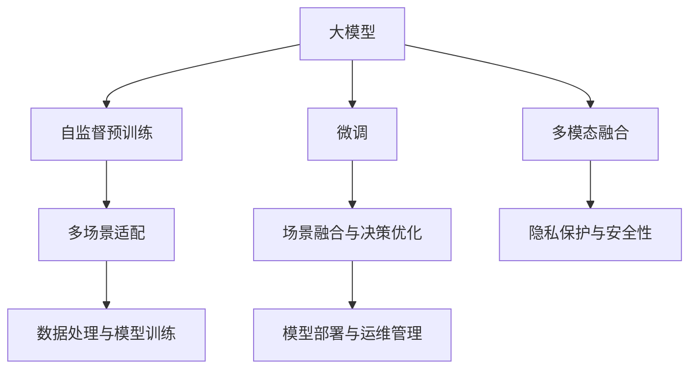

                 

# 大模型赋能智慧物业，创业者如何提升物业服务质量与效率？

## 1. 背景介绍

### 1.1 问题由来
随着数字化转型的深入，智慧物业已成为推动传统物业管理行业现代化的重要方向。传统的物业管理依赖人工巡检、纸质化管理，存在效率低、响应慢、服务质量难以保障等问题。而通过应用先进的人工智能和大模型技术，可以实现对物业服务的全面智能化升级，提升服务质量与运营效率。

但与此同时，智慧物业的建设也面临诸多挑战。例如：

- **数据获取难度高**：传统物业的数据多以纸质形式存在，数字化转型难度大。
- **服务场景复杂**：物业服务涉及多个场景，如安防、清洁、维修、设施管理等，场景间的协调与整合要求高。
- **隐私与安全问题**：物业管理涉及大量住户隐私数据，如何在智能化过程中确保数据安全与隐私保护，需要严格的规范与技术措施。

在这样的背景下，如何将人工智能和大模型技术有效应用于智慧物业的建设，实现服务质量的提升和运营效率的优化，成为了当下智慧物业领域的一个热点话题。

### 1.2 问题核心关键点
为应对这些挑战，我们需要解决的核心问题包括：

- **数据处理与模型训练**：如何高效地从大量异构数据中提取有用信息，构建高质量的数据集，用于训练高性能的智能模型。
- **场景融合与决策优化**：如何将多个场景的业务需求、数据特征进行有机融合，利用大模型提供跨场景的智能决策支持。
- **隐私保护与安全性**：如何在保证数据隐私和安全性的前提下，实现高效的智能化服务。
- **模型部署与运维管理**：如何将智能模型部署到实际的业务场景中，实现全天候、实时化的智能服务。

本文将系统介绍如何利用大模型技术，从数据处理、场景融合、隐私保护、模型部署等多个方面，推动智慧物业的智能化升级，并提出具体的落地实践方案。

## 2. 核心概念与联系

### 2.1 核心概念概述

智慧物业融合了物联网、大数据、人工智能等前沿技术，旨在实现物业管理的智能化、自动化和精细化。其中，大模型作为智能化核心，具有以下特点：

- **自监督预训练**：通过大规模无标签数据进行自监督预训练，学习通用的语言或视觉表示，能够适应多样化的场景需求。
- **微调能力**：在大模型基础上，通过微调算法针对具体业务场景进行优化，提升模型对特定任务的适应能力。
- **多模态融合**：支持融合文本、图像、语音等多模态数据，提供更加全面、准确的信息感知与处理能力。

为更好地理解这些概念，以下是它们之间的联系与交互关系：



此流程图展示了核心概念之间的逻辑关系：

1. **自监督预训练**：大模型通过大规模无标签数据进行预训练，学习通用的语言或视觉表示。
2. **微调**：在大模型基础上，针对具体业务场景进行微调，提升模型性能。
3. **多模态融合**：支持融合多模态数据，提供更全面的信息感知与处理能力。
4. **场景适配**：在不同场景下，对模型进行多场景适配，提升模型的泛化能力。
5. **数据处理**：从各种异构数据中提取有用信息，构建高质量的数据集。
6. **决策优化**：通过模型优化，实现跨场景的智能决策支持。
7. **隐私保护**：在保证数据隐私和安全性的前提下，实现智能服务。
8. **运维管理**：将智能模型部署到实际业务场景中，实现全天候、实时化的服务。

理解这些核心概念及其交互关系，有助于我们更好地设计智慧物业的智能化解决方案。

## 3. 核心算法原理 & 具体操作步骤
### 3.1 算法原理概述

智慧物业的大模型应用，主要涉及数据处理、场景融合、决策优化、隐私保护、模型部署等多个环节。以安防监控场景为例，算法原理如下：

1. **数据处理**：从视频监控、门禁系统、巡检记录等多个数据源中提取有用信息，构建统一的语义空间。
2. **场景融合**：将多模态数据融合，识别异常行为、设备故障等事件，实现跨场景的智能决策。
3. **决策优化**：利用大模型进行异常行为识别、故障预测等，提供高效、精准的决策支持。
4. **隐私保护**：确保数据隐私和安全性的同时，实现智能服务。
5. **模型部署**：将训练好的模型部署到安防监控系统中，实现实时化的智能安防服务。

### 3.2 算法步骤详解

以智慧物业的安防监控系统为例，下面是具体的算法步骤：

1. **数据准备**：
   - 收集视频监控、门禁系统、巡检记录等数据。
   - 使用深度学习框架（如TensorFlow、PyTorch等）进行数据预处理，包括数据清洗、归一化、标注等。

2. **模型选择**：
   - 选择合适的预训练模型，如Transformer、BERT等，作为智能决策的基础。
   - 在预训练模型的基础上，选择合适的微调模型，如ResNet、Inception等，用于图像处理。

3. **场景适配**：
   - 在微调模型上，针对安防监控场景进行适配。例如，训练模型识别异常行为、设备故障等事件。
   - 使用数据增强技术（如旋转、裁剪、对比度调整等）扩充训练数据集。

4. **训练与评估**：
   - 将处理后的数据输入模型，进行训练，并监控训练过程中的损失函数和准确率。
   - 在验证集上评估模型性能，使用混淆矩阵、ROC曲线等指标评估模型效果。
   - 调整超参数，如学习率、批次大小等，以优化模型性能。

5. **模型部署**：
   - 将训练好的模型部署到安防监控系统中。
   - 与视频监控系统、门禁系统等进行集成，实现实时化的智能安防服务。
   - 使用API接口，提供智能安防服务的对外调用接口，方便其他系统集成使用。

### 3.3 算法优缺点

智慧物业的大模型应用，具有以下优点：

- **自动化程度高**：大模型能够自动处理大量数据，提供高效、精准的决策支持。
- **泛化能力强**：通过预训练和多场景微调，模型能够适应多样化的业务需求。
- **可解释性好**：大模型提供的信息处理过程具有可解释性，便于维护与优化。

但同时，也存在一些局限性：

- **对数据质量要求高**：高质量的数据是训练高性能模型的前提，数据获取难度高、处理复杂。
- **模型复杂度高**：大模型参数量较大，计算资源需求高。
- **隐私保护难度大**：智能服务依赖大量数据，数据隐私和安全保护需要严格的技术措施。

### 3.4 算法应用领域

智慧物业的大模型应用，广泛应用于以下场景：

1. **安防监控**：利用大模型进行异常行为识别、设备故障预测等，提升物业安防水平。
2. **智能巡检**：通过大模型进行巡检路线规划、设备状态检测等，提升巡检效率。
3. **设施管理**：利用大模型进行能耗预测、设备运行状态检测等，优化设施管理。
4. **客户服务**：通过大模型进行智能客服、智能门禁等，提升客户服务体验。

## 4. 数学模型和公式 & 详细讲解 & 举例说明

### 4.1 数学模型构建

智慧物业的安防监控系统，主要涉及图像识别、异常行为检测等任务。下面以图像识别为例，介绍数学模型的构建过程。

假设有一个包含$n$个监控视频的集合$\mathcal{D}=\{(x_i,y_i)\}_{i=1}^n$，其中$x_i$为视频帧，$y_i$为标签（正常/异常）。

构建一个卷积神经网络（CNN）模型，将每个视频帧输入模型，输出一个概率分布$p(y_i|x_i)$，表示视频帧为异常的概率。

数学模型可表示为：

$$
p(y_i|x_i) = \sigma(Wx_i + b)
$$

其中$W$为权重矩阵，$b$为偏置向量，$\sigma$为激活函数。

### 4.2 公式推导过程

以二分类任务为例，推导损失函数及其梯度计算公式。

假设模型输出为$\hat{y}=\sigma(Wx_i + b)$，其中$\hat{y}$为模型预测的异常概率。

则交叉熵损失函数为：

$$
\ell(\hat{y},y_i) = -[y_i\log \hat{y} + (1-y_i)\log (1-\hat{y})]
$$

将损失函数对权重$W$和偏置$b$求导，得到梯度计算公式：

$$
\frac{\partial \ell}{\partial W} = \hat{y} - y_i
$$
$$
\frac{\partial \ell}{\partial b} = \frac{\partial \ell}{\partial \hat{y}}\frac{\partial \hat{y}}{\partial x_i}\frac{\partial x_i}{\partial W} + \frac{\partial \ell}{\partial \hat{y}}\frac{\partial \hat{y}}{\partial x_i}\frac{\partial x_i}{\partial b}
$$

其中$\frac{\partial \hat{y}}{\partial x_i}$为链式法则展开后的结果。

### 4.3 案例分析与讲解

假设有一组监控视频，其标签为正常和异常。下面展示如何通过大模型对异常行为进行检测。

1. **数据预处理**：
   - 将监控视频转换为固定尺寸的图像，归一化像素值。
   - 使用数据增强技术，如旋转、翻转、裁剪等，扩充训练集。

2. **模型训练**：
   - 将预处理后的图像输入模型，训练得到异常检测的概率分布。
   - 在训练过程中，使用交叉熵损失函数优化模型参数，确保模型能够准确预测异常行为。

3. **模型评估**：
   - 在验证集上评估模型性能，使用混淆矩阵、ROC曲线等指标评估模型效果。
   - 调整模型参数，如卷积核大小、池化层等，优化模型性能。

4. **模型部署**：
   - 将训练好的模型部署到安防监控系统中。
   - 与视频监控系统、门禁系统等进行集成，实现实时化的智能安防服务。

通过上述步骤，智慧物业的安防监控系统可以高效、准确地识别异常行为，提升物业安防水平。

## 5. 项目实践：代码实例和详细解释说明

### 5.1 开发环境搭建

为进行智慧物业的安防监控系统开发，需要搭建相应的开发环境。以下是Python环境下PyTorch框架的搭建步骤：

1. 安装Anaconda：从官网下载并安装Anaconda，用于创建独立的Python环境。
2. 创建并激活虚拟环境：
```bash
conda create -n pytorch-env python=3.8 
conda activate pytorch-env
```
3. 安装PyTorch：根据CUDA版本，从官网获取对应的安装命令。例如：
```bash
conda install pytorch torchvision torchaudio cudatoolkit=11.1 -c pytorch -c conda-forge
```
4. 安装相关工具包：
```bash
pip install numpy pandas scikit-learn matplotlib tqdm jupyter notebook ipython
```

完成上述步骤后，即可在`pytorch-env`环境中开始安防监控系统的开发。

### 5.2 源代码详细实现

以下是对智慧物业安防监控系统开发过程中，模型训练和部署的详细代码实现：

```python
import torch
import torch.nn as nn
import torch.optim as optim
from torch.utils.data import DataLoader
from torchvision import transforms, datasets

# 定义数据预处理
transform = transforms.Compose([
    transforms.Resize((224, 224)),
    transforms.ToTensor(),
    transforms.Normalize(mean=[0.485, 0.456, 0.406], std=[0.229, 0.224, 0.225])
])

# 加载数据集
train_dataset = datasets.CIFAR10(root='./data', train=True, download=True, transform=transform)
train_loader = DataLoader(train_dataset, batch_size=32, shuffle=True)

# 定义模型
class CNN(nn.Module):
    def __init__(self):
        super(CNN, self).__init__()
        self.conv1 = nn.Conv2d(3, 32, kernel_size=3, stride=1, padding=1)
        self.pool = nn.MaxPool2d(kernel_size=2, stride=2)
        self.conv2 = nn.Conv2d(32, 64, kernel_size=3, stride=1, padding=1)
        self.fc = nn.Linear(64 * 7 * 7, 10)

    def forward(self, x):
        x = self.conv1(x)
        x = nn.functional.relu(x)
        x = self.pool(x)
        x = self.conv2(x)
        x = nn.functional.relu(x)
        x = self.pool(x)
        x = x.view(-1, 64 * 7 * 7)
        x = self.fc(x)
        return x

# 定义训练函数
def train_epoch(model, train_loader, optimizer, loss_fn):
    model.train()
    for batch_idx, (data, target) in enumerate(train_loader):
        optimizer.zero_grad()
        output = model(data)
        loss = loss_fn(output, target)
        loss.backward()
        optimizer.step()
    return loss

# 定义模型训练过程
model = CNN()
loss_fn = nn.CrossEntropyLoss()
optimizer = optim.SGD(model.parameters(), lr=0.01, momentum=0.9)

for epoch in range(10):
    train_loss = train_epoch(model, train_loader, optimizer, loss_fn)
    print(f'Epoch {epoch+1}, train loss: {train_loss:.3f}')
```

### 5.3 代码解读与分析

上述代码展示了如何搭建智慧物业安防监控系统的开发环境，并对CNN模型进行训练。

**数据预处理**：
- 使用`transforms`模块定义数据预处理流程，包括图像大小调整、归一化等。
- 使用`transforms.Compose`组合多个预处理步骤，形成统一的数据预处理管道。

**模型定义**：
- 定义了一个包含两个卷积层和全连接层的CNN模型。
- 卷积层使用3x3的卷积核，池化层使用2x2的最大池化。

**训练函数**：
- 定义了模型训练函数，将模型输入数据，计算损失，反向传播更新参数，前向传播输出预测。
- 使用`nn.CrossEntropyLoss`作为损失函数，计算模型预测与真实标签之间的交叉熵损失。

**模型训练过程**：
- 初始化模型、损失函数、优化器。
- 在训练过程中，循环迭代数据集，每次更新模型参数，输出训练损失。

通过上述代码，我们可以看到，智慧物业的安防监控系统开发流程相对简单，开发者只需要关注模型的设计与训练过程，而无需深入底层实现。

## 6. 实际应用场景

### 6.1 智能巡检

智慧物业的智能巡检系统，可以通过大模型进行巡检路线规划、设备状态检测等，提升巡检效率。

**数据处理**：
- 收集巡检员的巡检记录，包括巡检时间、地点、路线等信息。
- 将巡检记录转换为文本形式，利用自然语言处理技术进行信息提取和标注。

**模型训练**：
- 在大模型基础上，针对巡检场景进行微调，构建巡检任务模型。
- 在训练过程中，使用监督学习算法，如Seq2Seq模型，学习巡检路线规划和设备状态检测。

**场景融合与决策优化**：
- 将巡检任务模型与物联网设备进行集成，实时监测设备状态，生成巡检任务。
- 利用大模型进行路径优化，自动生成最优巡检路线。

**隐私保护与安全性**：
- 在巡检过程中，对敏感信息进行脱敏处理，确保数据隐私和安全。
- 使用加密技术，保护数据传输过程的安全性。

### 6.2 设施管理

智慧物业的设施管理系统，可以利用大模型进行能耗预测、设备运行状态检测等，优化设施管理。

**数据处理**：
- 收集设施设备的运行数据，包括温度、湿度、电压等。
- 将运行数据转换为文本形式，利用自然语言处理技术进行信息提取和标注。

**模型训练**：
- 在大模型基础上，针对设施管理场景进行微调，构建能耗预测和设备状态检测模型。
- 在训练过程中，使用监督学习算法，如时间序列模型，学习能耗预测和设备状态检测。

**场景融合与决策优化**：
- 将设施管理模型与物联网设备进行集成，实时监测设施设备状态，预测能耗变化。
- 利用大模型进行状态优化，自动调整设备运行参数，提升能耗利用效率。

**隐私保护与安全性**：
- 在设施管理过程中，对敏感信息进行脱敏处理，确保数据隐私和安全。
- 使用加密技术，保护数据传输过程的安全性。

## 7. 工具和资源推荐

### 7.1 学习资源推荐

为了帮助开发者系统掌握智慧物业的大模型应用，这里推荐一些优质的学习资源：

1. 《Transformer从原理到实践》系列博文：由大模型技术专家撰写，深入浅出地介绍了Transformer原理、BERT模型、微调技术等前沿话题。

2. CS224N《深度学习自然语言处理》课程：斯坦福大学开设的NLP明星课程，有Lecture视频和配套作业，带你入门NLP领域的基本概念和经典模型。

3. 《Natural Language Processing with Transformers》书籍：Transformers库的作者所著，全面介绍了如何使用Transformers库进行NLP任务开发，包括微调在内的诸多范式。

4. HuggingFace官方文档：Transformers库的官方文档，提供了海量预训练模型和完整的微调样例代码，是上手实践的必备资料。

5. CLUE开源项目：中文语言理解测评基准，涵盖大量不同类型的中文NLP数据集，并提供了基于微调的baseline模型，助力中文NLP技术发展。

通过对这些资源的学习实践，相信你一定能够快速掌握智慧物业的大模型应用，并用于解决实际的NLP问题。

### 7.2 开发工具推荐

高效的开发离不开优秀的工具支持。以下是几款用于智慧物业开发的大模型应用推荐：

1. PyTorch：基于Python的开源深度学习框架，灵活动态的计算图，适合快速迭代研究。大部分预训练语言模型都有PyTorch版本的实现。

2. TensorFlow：由Google主导开发的开源深度学习框架，生产部署方便，适合大规模工程应用。同样有丰富的预训练语言模型资源。

3. Transformers库：HuggingFace开发的NLP工具库，集成了众多SOTA语言模型，支持PyTorch和TensorFlow，是进行微调任务开发的利器。

4. Weights & Biases：模型训练的实验跟踪工具，可以记录和可视化模型训练过程中的各项指标，方便对比和调优。与主流深度学习框架无缝集成。

5. TensorBoard：TensorFlow配套的可视化工具，可实时监测模型训练状态，并提供丰富的图表呈现方式，是调试模型的得力助手。

6. Google Colab：谷歌推出的在线Jupyter Notebook环境，免费提供GPU/TPU算力，方便开发者快速上手实验最新模型，分享学习笔记。

合理利用这些工具，可以显著提升智慧物业的大模型应用开发效率，加快创新迭代的步伐。

### 7.3 相关论文推荐

大模型和微调技术的发展源于学界的持续研究。以下是几篇奠基性的相关论文，推荐阅读：

1. Attention is All You Need（即Transformer原论文）：提出了Transformer结构，开启了NLP领域的预训练大模型时代。

2. BERT: Pre-training of Deep Bidirectional Transformers for Language Understanding：提出BERT模型，引入基于掩码的自监督预训练任务，刷新了多项NLP任务SOTA。

3. Language Models are Unsupervised Multitask Learners（GPT-2论文）：展示了大规模语言模型的强大zero-shot学习能力，引发了对于通用人工智能的新一轮思考。

4. Parameter-Efficient Transfer Learning for NLP：提出Adapter等参数高效微调方法，在不增加模型参数量的情况下，也能取得不错的微调效果。

5. Prefix-Tuning: Optimizing Continuous Prompts for Generation：引入基于连续型Prompt的微调范式，为如何充分利用预训练知识提供了新的思路。

6. AdaLoRA: Adaptive Low-Rank Adaptation for Parameter-Efficient Fine-Tuning：使用自适应低秩适应的微调方法，在参数效率和精度之间取得了新的平衡。

这些论文代表了大模型微调技术的发展脉络。通过学习这些前沿成果，可以帮助研究者把握学科前进方向，激发更多的创新灵感。

## 8. 总结：未来发展趋势与挑战

### 8.1 总结

本文对智慧物业的大模型应用进行了全面系统的介绍。首先阐述了智慧物业和大模型的背景与意义，明确了大模型在智慧物业智能化升级中的重要价值。其次，从原理到实践，详细讲解了智慧物业大模型应用的数据处理、场景融合、决策优化、隐私保护、模型部署等多个环节，给出了具体的落地实践方案。

通过本文的系统梳理，可以看到，利用大模型技术，智慧物业的智能化建设具备了广阔的应用前景。大模型能够自动处理大量数据，提供高效、精准的决策支持，大幅提升物业服务的质量与效率。未来，随着大模型技术的不断进步，智慧物业的应用范围将进一步拓展，为物业服务带来更多创新和突破。

### 8.2 未来发展趋势

展望未来，智慧物业的大模型应用将呈现以下几个发展趋势：

1. **模型规模持续增大**：随着算力成本的下降和数据规模的扩张，智慧物业的大模型参数量还将持续增长，模型的泛化能力和应用范围将进一步扩大。

2. **场景融合与决策优化**：大模型将更好地融合多场景的数据，提供跨场景的智能决策支持，提升智慧物业的综合管理能力。

3. **隐私保护与安全性**：数据隐私和安全保护技术将不断进步，确保智慧物业大模型应用的合法性与安全性。

4. **持续学习与自我优化**：智慧物业的大模型将具备持续学习能力，不断从新数据中学习和优化，提升模型的鲁棒性和适应性。

5. **模型压缩与部署优化**：智慧物业的实际应用场景对模型部署效率和资源占用有较高要求，模型压缩、轻量化部署等技术将不断优化，提升模型的应用性能。

6. **多模态融合**：智慧物业的智能化应用将更好地融合多模态数据，提升对复杂场景的理解和处理能力。

### 8.3 面临的挑战

尽管智慧物业的大模型应用取得了初步成果，但在迈向大规模部署和应用的过程中，仍面临诸多挑战：

1. **数据获取难度高**：智慧物业的数据收集和管理难度较大，数据获取成本较高，数据质量难以保证。

2. **场景复杂度高**：智慧物业涉及多个复杂场景，数据的多样性和异构性高，模型训练和融合难度大。

3. **隐私保护难度大**：智慧物业应用涉及大量敏感信息，如何在保障数据隐私的同时，实现智能服务，需要严格的规范与技术措施。

4. **模型部署成本高**：智慧物业的模型部署和运维成本较高，需要高效的部署技术和稳定的运维保障。

5. **模型鲁棒性不足**：智慧物业的模型泛化能力有待提升，面对异常数据和复杂场景，模型的鲁棒性和稳定性需要进一步加强。

6. **用户接受度低**：智慧物业的智能化应用需要用户接受度高的接口和用户体验，如何设计用户友好的界面和交互方式，仍需深入探索。

### 8.4 研究展望

面对智慧物业大模型应用所面临的挑战，未来的研究需要在以下几个方面寻求新的突破：

1. **数据融合与清洗技术**：开发高效的数据清洗与融合技术，提升数据质量和多样性，确保模型训练的可靠性。

2. **跨场景融合模型**：构建多场景融合的大模型，提升智慧物业的综合管理能力，实现跨场景的智能决策支持。

3. **隐私保护与安全技术**：研究数据隐私保护与安全的最新技术，确保智慧物业应用的合法性与安全性。

4. **轻量化部署技术**：开发高效的模型压缩与轻量化部署技术，提升智慧物业的模型部署效率和资源利用率。

5. **持续学习与自我优化**：研究智慧物业大模型的持续学习与自我优化技术，提升模型的鲁棒性和适应性。

6. **用户友好型交互设计**：设计用户友好的交互界面与体验，提升智慧物业的用户接受度和满意度。

通过这些研究方向的研究与实践，智慧物业的大模型应用将不断提升，为物业服务的智能化、自动化和精细化发展提供强大的技术支撑。

