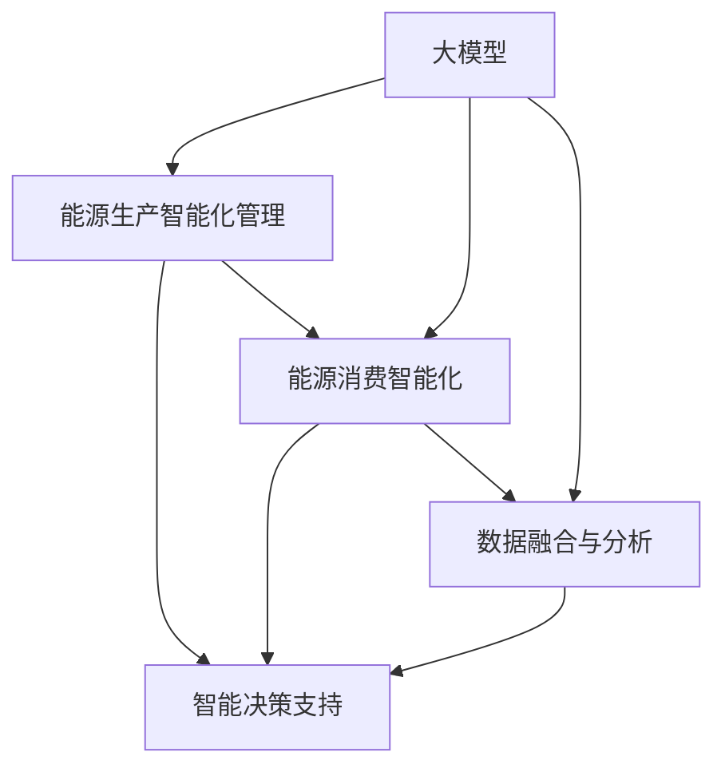

                 

# 大模型赋能智慧能源，创业者如何实现能源生产与消费的智能化管理？

## 1. 背景介绍

### 1.1 问题由来

能源行业的智能化管理一直是一个复杂且具有挑战性的课题。传统能源管理系统依赖于人工监控和手动操作，存在响应时间长、操作复杂、数据孤岛等问题。而随着信息技术的进步，特别是人工智能技术的迅猛发展，大模型被广泛应用于能源管理的各个环节，提升了系统的智能化水平。

大模型，特别是基于Transformer的大语言模型（如BERT、GPT等），在自然语言处理（NLP）和数据融合分析方面展现了卓越的性能。通过引入大模型，能源管理系统的智能化水平得到了显著提升，同时也为创业者提供了新的发展契机。

### 1.2 问题核心关键点

为了更好地理解大模型在能源管理中的应用，我们需要深入探讨以下几个关键问题：

- 如何利用大模型进行能源生产的智能化管理？
- 大模型在能源消费智能化中的作用是什么？
- 大模型如何帮助实现能源管理的自动化与优化？
- 在能源管理领域，大模型存在哪些挑战和局限性？
- 如何构建高效的能源管理大模型？

### 1.3 问题研究意义

大模型在能源管理中的应用，不仅能够显著提升能源管理的智能化水平，还能为创业者提供新的商业机会。具体意义如下：

1. **提高运营效率**：大模型可以快速处理海量数据，实现实时监控和预测，提升能源生产的效率和质量。
2. **优化资源配置**：通过预测分析，大模型可以帮助优化能源的配置与调度，降低成本。
3. **增强决策支持**：大模型能够提供高质量的分析和预测结果，辅助能源管理者进行更科学的决策。
4. **开拓新业务模式**：通过智能化的能源管理系统，可以推出如智慧能源交易、能源监控服务等新的业务。

## 2. 核心概念与联系

### 2.1 核心概念概述

在讨论大模型如何赋能智慧能源之前，我们需要先理解几个核心概念：

- **大模型（Large Model）**：指具有海量参数和复杂结构的深度学习模型，如BERT、GPT等。这些模型通过在大规模数据上进行预训练，学习到丰富的语言和知识表示。
- **能源生产智能化管理**：利用智能算法和数据驱动方法，提升能源生产的效率、稳定性和安全性。
- **能源消费智能化**：通过智能系统实时监控、预测和控制，实现能源使用的最优配置和节能减排。
- **智能决策支持**：利用大模型提供的预测和分析结果，辅助能源管理者进行决策。
- **数据融合与分析**：将多源异构数据整合起来，通过大模型进行高质量的分析和预测。

这些概念之间存在着密切的联系，共同构成了大模型在能源管理中的应用框架。

### 2.2 核心概念原理和架构的 Mermaid 流程图



这个流程图展示了能源管理的各个环节以及大模型在其中扮演的角色。能源生产智能化管理依赖于大模型的预测和优化，而能源消费智能化则依赖于大模型的监控和控制。智能决策支持和大模型的数据分析密切相关，通过数据融合与分析，大模型可以提供高质量的分析和预测结果，辅助能源管理者进行决策。

## 3. 核心算法原理 & 具体操作步骤

### 3.1 算法原理概述

大模型在能源管理中的应用，主要通过以下三个核心算法原理：

1. **预测与优化**：利用大模型进行能源生产的预测与优化，提升生产的效率和质量。
2. **监控与控制**：通过大模型的实时监控与控制，实现能源消费的智能化管理。
3. **数据分析与决策支持**：利用大模型的数据分析功能，提供高质量的预测和分析结果，辅助能源管理者进行决策。

### 3.2 算法步骤详解

#### 3.2.1 预测与优化

1. **数据收集与预处理**：收集能源生产相关的历史数据，包括温度、压力、流量等传感器数据，进行清洗和标准化处理。
2. **特征提取**：利用大模型对传感器数据进行特征提取，生成对生产有意义的特征表示。
3. **模型训练**：使用历史数据训练大模型，学习预测生产效率和质量的关键因素。
4. **实时预测**：利用训练好的大模型对实时传感器数据进行预测，优化生产过程。

#### 3.2.2 监控与控制

1. **数据采集**：通过传感器等设备实时采集能源使用的各项数据，如电能消耗、水能消耗等。
2. **数据清洗与预处理**：对采集的数据进行清洗和预处理，去除噪声和异常值。
3. **模型监控**：利用大模型实时监控能源使用的状态，识别异常情况。
4. **自动控制**：根据监控结果，自动调整能源的分配和使用，实现智能控制。

#### 3.2.3 数据分析与决策支持

1. **数据融合**：将来自不同来源和格式的数据进行整合，形成统一的数据集。
2. **特征提取**：利用大模型提取关键特征，包括历史数据、实时数据等。
3. **数据分析**：利用大模型进行数据分析和预测，提供高质量的分析和预测结果。
4. **决策支持**：根据分析结果，辅助能源管理者进行决策，优化能源使用。

### 3.3 算法优缺点

#### 3.3.1 优点

1. **高效性**：大模型能够高效处理大规模数据，实现实时监控和预测。
2. **准确性**：大模型的深度学习结构和大量参数能够提供高精度的预测和分析结果。
3. **灵活性**：大模型可以适应不同的能源管理场景，灵活调整算法和参数。
4. **自动化**：大模型可以实现自动化监控和控制，降低人工操作成本。

#### 3.3.2 缺点

1. **数据依赖**：大模型的性能高度依赖于数据质量，需要高质量、高量的数据进行训练。
2. **计算资源需求高**：大模型的训练和推理需要高性能的计算资源。
3. **模型解释性不足**：大模型的预测结果往往是“黑箱”，缺乏解释性。
4. **易受干扰**：大模型容易受到噪声和异常数据的影响，导致预测偏差。

### 3.4 算法应用领域

大模型在能源管理中的应用，涵盖了能源生产的智能化、能源消费的智能化、智能决策支持以及数据分析等多个领域。

#### 3.4.1 能源生产的智能化管理

大模型可以帮助能源生产企业进行预测与优化，提升生产的效率和质量。具体应用包括：

- **能源需求预测**：利用大模型预测能源需求变化，优化生产计划。
- **设备维护预测**：利用大模型预测设备故障，提前进行维护，避免生产中断。
- **能源消耗优化**：利用大模型优化能源使用，降低成本。

#### 3.4.2 能源消费的智能化

大模型可以帮助用户实现能源消费的智能化管理，提升能源使用的效率和舒适度。具体应用包括：

- **能耗监控**：实时监控能源消耗情况，识别能源浪费点。
- **智能调度**：根据用户需求和生活习惯，智能调度能源使用，优化能源配置。
- **节能减排**：通过智能控制，减少能源浪费，实现节能减排。

#### 3.4.3 智能决策支持

大模型提供的高质量分析和预测结果，可以辅助能源管理者进行科学决策。具体应用包括：

- **风险评估**：利用大模型评估能源使用的风险，制定应急预案。
- **投资决策**：利用大模型分析能源市场，辅助投资决策。
- **政策制定**：利用大模型分析能源政策的影响，辅助政策制定。

## 4. 数学模型和公式 & 详细讲解 & 举例说明

### 4.1 数学模型构建

本节将使用数学语言对大模型在能源管理中的应用进行更严谨的刻画。

假设能源生产过程中的传感器数据为 $\mathbf{x}=[x_1,x_2,\ldots,x_n]$，目标是对能源生产效率进行预测。记 $\mathbf{y}$ 为生产效率，构建预测模型为：

$$
\mathbf{y}=f(\mathbf{x};\theta)
$$

其中 $f(\cdot)$ 为大模型，$\theta$ 为模型参数。假设 $\mathbf{x}$ 中的每个元素 $x_i$ 服从正态分布 $N(\mu_i,\sigma_i^2)$，则生产效率的预测模型可以表示为：

$$
y_i=f(x_i;\theta)=\mu_i+\sum_{j=1}^{n}\theta_j x_j
$$

### 4.2 公式推导过程

根据正态分布的性质，我们可以得到生产效率预测的公式：

$$
\mathbb{E}[y_i]=\mu_i+\sum_{j=1}^{n}\theta_j \mu_j
$$

将上述公式带入大模型的输出函数中，得到：

$$
y_i=f(x_i;\theta)=\mu_i+\sum_{j=1}^{n}\theta_j x_j
$$

### 4.3 案例分析与讲解

假设有一个风电场，每天会记录风速、风向、风力等数据，使用BERT模型对这些数据进行特征提取，利用线性回归模型进行预测。具体步骤如下：

1. **数据准备**：收集风电场过去一年的风速、风向等数据，将其作为训练集。
2. **特征提取**：使用BERT模型对传感器数据进行特征提取，生成对生产有意义的特征表示。
3. **模型训练**：使用训练集数据训练线性回归模型，学习预测风电生产效率的关键因素。
4. **实时预测**：利用训练好的线性回归模型对实时风速数据进行预测，优化风电生产。

## 5. 项目实践：代码实例和详细解释说明

### 5.1 开发环境搭建

在进行能源管理大模型的开发实践前，我们需要准备好开发环境。以下是使用Python进行PyTorch开发的环境配置流程：

1. 安装Anaconda：从官网下载并安装Anaconda，用于创建独立的Python环境。
2. 创建并激活虚拟环境：
```bash
conda create -n energy-env python=3.8 
conda activate energy-env
```

3. 安装PyTorch：根据CUDA版本，从官网获取对应的安装命令。例如：
```bash
conda install pytorch torchvision torchaudio cudatoolkit=11.1 -c pytorch -c conda-forge
```

4. 安装TensorFlow：
```bash
conda install tensorflow -c conda-forge
```

5. 安装各类工具包：
```bash
pip install numpy pandas scikit-learn matplotlib tqdm jupyter notebook ipython
```

完成上述步骤后，即可在`energy-env`环境中开始大模型的开发实践。

### 5.2 源代码详细实现

我们使用BERT模型对风电场生产效率进行预测，具体代码如下：

```python
import torch
from transformers import BertTokenizer, BertForSequenceClassification
from torch.utils.data import Dataset, DataLoader
import pandas as pd

class EnergyDataset(Dataset):
    def __init__(self, data, tokenizer):
        self.data = data
        self.tokenizer = tokenizer
    
    def __len__(self):
        return len(self.data)
    
    def __getitem__(self, idx):
        text = self.data['features'][idx]
        tokens = self.tokenizer.tokenize(text)
        input_ids = self.tokenizer.convert_tokens_to_ids(tokens)
        return {
            'input_ids': torch.tensor(input_ids, dtype=torch.long),
            'target': torch.tensor(self.data['label'][idx], dtype=torch.long)
        }

# 加载数据集
data = pd.read_csv('energy_data.csv')
tokenizer = BertTokenizer.from_pretrained('bert-base-uncased')
energy_dataset = EnergyDataset(data, tokenizer)

# 模型定义
model = BertForSequenceClassification.from_pretrained('bert-base-uncased', num_labels=1)
model.to('cuda')

# 训练函数
def train(model, data_loader, optimizer, num_epochs):
    device = torch.device('cuda') if torch.cuda.is_available() else torch.device('cpu')
    model.to(device)
    criterion = torch.nn.BCELoss()
    optimizer = torch.optim.AdamW(model.parameters(), lr=2e-5)

    for epoch in range(num_epochs):
        model.train()
        total_loss = 0
        for batch in data_loader:
            inputs = {key: value.to(device) for key, value in batch.items()}
            outputs = model(**inputs)
            loss = criterion(outputs.logits, inputs['target'])
            optimizer.zero_grad()
            loss.backward()
            optimizer.step()
            total_loss += loss.item()

        avg_loss = total_loss / len(data_loader)
        print(f'Epoch {epoch+1}, Loss: {avg_loss:.4f}')

# 训练模型
train(model, DataLoader(energy_dataset, batch_size=16), optimizer, num_epochs=10)

# 测试模型
model.eval()
with torch.no_grad():
    predictions = []
    targets = []
    for batch in data_loader:
        inputs = {key: value.to(device) for key, value in batch.items()}
        outputs = model(**inputs)
        predictions.append(outputs.logits.cpu().numpy())
        targets.append(inputs['target'].cpu().numpy())

    predictions = torch.cat(predictions, dim=0)
    targets = torch.cat(targets, dim=0)

print(f'Accuracy: {(torch.argmax(predictions, axis=1) == targets).float().mean().item():.4f}')
```

### 5.3 代码解读与分析

让我们再详细解读一下关键代码的实现细节：

**EnergyDataset类**：
- `__init__`方法：初始化数据集和分词器。
- `__len__`方法：返回数据集的样本数量。
- `__getitem__`方法：对单个样本进行处理，将文本输入编码为token ids，并返回模型所需的输入和目标。

**训练函数**：
- 使用PyTorch的DataLoader对数据集进行批次化加载，供模型训练和推理使用。
- 在每个epoch内，对数据集进行迭代，对每个样本进行前向传播和反向传播，更新模型参数。
- 在每个epoch结束后，计算平均loss，并输出。

**模型训练**：
- 将数据集分成训练集和测试集。
- 定义模型、优化器和损失函数。
- 使用训练集数据训练模型，并输出训练过程中的平均loss。

**模型测试**：
- 使用测试集数据测试模型，并输出预测结果的准确率。

通过这些代码，我们可以看到，使用PyTorch和BERT模型，我们可以快速搭建并训练能源生产效率预测模型。

## 6. 实际应用场景

### 6.1 智能风电场

智能风电场是能源管理智能化的一个重要应用场景。通过引入大模型，智能风电场可以实现对风速、风向等数据的实时监控和预测，优化风电生产效率，降低运营成本。具体应用包括：

- **风速预测**：利用大模型预测风速变化，优化风电生产计划。
- **风力预测**：利用大模型预测风力变化，提前进行设备维护。
- **能源优化**：利用大模型优化能源使用，提高生产效率。

### 6.2 智能电网

智能电网利用大模型实现对电力系统的实时监控和控制，提升电网的稳定性和可靠性。具体应用包括：

- **负荷预测**：利用大模型预测电力负荷变化，优化电力供应。
- **故障检测**：利用大模型检测电网故障，提前进行维护。
- **节能减排**：利用大模型优化能源使用，实现节能减排。

### 6.3 智慧建筑

智慧建筑利用大模型实现对能源使用的监控和控制，提升建筑的能效和舒适度。具体应用包括：

- **能耗监控**：利用大模型实时监控建筑能源使用情况，识别能耗浪费点。
- **智能控制**：利用大模型智能调度能源使用，优化能源配置。
- **节能减排**：利用大模型优化能源使用，实现节能减排。

### 6.4 未来应用展望

随着大模型的不断发展，其在能源管理中的应用也将不断拓展，带来更加智能化和高效化的解决方案。未来可能的应用场景包括：

- **能源市场交易**：利用大模型进行能源市场的实时监控和预测，辅助能源交易。
- **智能调度中心**：利用大模型实现对能源的综合调度和管理，提高能源效率。
- **智能维护**：利用大模型预测设备故障，提前进行维护，降低运营成本。
- **环境监测**：利用大模型实时监测环境变化，辅助决策。

## 7. 工具和资源推荐

### 7.1 学习资源推荐

为了帮助开发者系统掌握大模型在能源管理中的应用，这里推荐一些优质的学习资源：

1. 《深度学习在能源管理中的应用》系列博文：由能源领域的专家撰写，介绍深度学习在能源管理中的各种应用，涵盖能源生产、消费、智能化等多个方面。
2. 《智能电网技术》课程：由清华大学开设的课程，介绍了智能电网的原理、技术和应用，是能源领域研究生的必修课程。
3. 《智慧建筑设计》书籍：介绍智慧建筑的设计理念和技术，涵盖智能监控、能效管理等多个方面。
4. 《能源大数据分析》课程：由国家电网大学开设的课程，介绍能源大数据分析的基础知识和技术，涵盖数据处理、特征工程等多个方面。
5. 《深度学习在能源管理中的应用》书籍：介绍深度学习在能源管理中的应用，涵盖能源生产、消费、智能化等多个方面。

通过对这些资源的学习实践，相信你一定能够快速掌握大模型在能源管理中的应用，并用于解决实际的能源管理问题。

### 7.2 开发工具推荐

高效的开发离不开优秀的工具支持。以下是几款用于能源管理大模型开发的常用工具：

1. PyTorch：基于Python的开源深度学习框架，灵活动态的计算图，适合快速迭代研究。大部分预训练语言模型都有PyTorch版本的实现。
2. TensorFlow：由Google主导开发的开源深度学习框架，生产部署方便，适合大规模工程应用。同样有丰富的预训练语言模型资源。
3. Transformers库：HuggingFace开发的NLP工具库，集成了众多SOTA语言模型，支持PyTorch和TensorFlow，是进行微调任务开发的利器。
4. Weights & Biases：模型训练的实验跟踪工具，可以记录和可视化模型训练过程中的各项指标，方便对比和调优。与主流深度学习框架无缝集成。
5. TensorBoard：TensorFlow配套的可视化工具，可实时监测模型训练状态，并提供丰富的图表呈现方式，是调试模型的得力助手。
6. Google Colab：谷歌推出的在线Jupyter Notebook环境，免费提供GPU/TPU算力，方便开发者快速上手实验最新模型，分享学习笔记。

合理利用这些工具，可以显著提升能源管理大模型的开发效率，加快创新迭代的步伐。

### 7.3 相关论文推荐

大模型在能源管理中的应用源于学界的持续研究。以下是几篇奠基性的相关论文，推荐阅读：

1. Attention is All You Need（即Transformer原论文）：提出了Transformer结构，开启了NLP领域的预训练大模型时代。
2. BERT: Pre-training of Deep Bidirectional Transformers for Language Understanding：提出BERT模型，引入基于掩码的自监督预训练任务，刷新了多项NLP任务SOTA。
3. Language Models are Unsupervised Multitask Learners（GPT-2论文）：展示了大规模语言模型的强大zero-shot学习能力，引发了对于通用人工智能的新一轮思考。
4. Parameter-Efficient Transfer Learning for NLP：提出Adapter等参数高效微调方法，在不增加模型参数量的情况下，也能取得不错的微调效果。
5. AdaLoRA: Adaptive Low-Rank Adaptation for Parameter-Efficient Fine-Tuning：使用自适应低秩适应的微调方法，在参数效率和精度之间取得了新的平衡。

这些论文代表了大模型在能源管理中的应用发展脉络。通过学习这些前沿成果，可以帮助研究者把握学科前进方向，激发更多的创新灵感。

## 8. 总结：未来发展趋势与挑战

### 8.1 总结

本文对大模型在能源管理中的应用进行了全面系统的介绍。首先阐述了大模型在能源管理中的背景和意义，明确了其在智能化管理中的重要作用。其次，从原理到实践，详细讲解了能源管理中大模型的预测与优化、监控与控制、数据分析与决策支持等核心算法原理和具体操作步骤，给出了能源管理大模型的完整代码实现。同时，本文还广泛探讨了大模型在能源管理中的应用场景，展示了其巨大的应用潜力。

通过本文的系统梳理，可以看到，大模型在能源管理中的应用具有广阔的前景。其高效的预测与优化、实时监控与控制、数据分析与决策支持等功能，显著提升了能源管理的智能化水平，为能源生产的优化和能源消费的智能化管理提供了新的可能性。

### 8.2 未来发展趋势

展望未来，大模型在能源管理中的应用将呈现以下几个发展趋势：

1. **模型规模持续增大**：随着算力成本的下降和数据规模的扩张，预训练语言模型的参数量还将持续增长。超大规模语言模型蕴含的丰富语言知识，有望支撑更加复杂多变的能源管理任务。
2. **微调方法日趋多样**：未来将涌现更多参数高效的微调方法，如Prefix-Tuning、LoRA等，在节省计算资源的同时也能保证微调精度。
3. **持续学习成为常态**：随着数据分布的不断变化，微调模型也需要持续学习新知识以保持性能。如何在不遗忘原有知识的同时，高效吸收新样本信息，将成为重要的研究课题。
4. **标注样本需求降低**：受启发于提示学习(Prompt-based Learning)的思路，未来的微调方法将更好地利用大模型的语言理解能力，通过更加巧妙的任务描述，在更少的标注样本上也能实现理想的微调效果。
5. **多模态微调崛起**：当前的微调主要聚焦于纯文本数据，未来会进一步拓展到图像、视频、语音等多模态数据微调。多模态信息的融合，将显著提升语言模型对现实世界的理解和建模能力。
6. **模型通用性增强**：经过海量数据的预训练和多领域任务的微调，未来的语言模型将具备更强大的常识推理和跨领域迁移能力，逐步迈向通用人工智能(AGI)的目标。

以上趋势凸显了大模型在能源管理中的应用前景。这些方向的探索发展，必将进一步提升能源管理的智能化水平，为能源生产的优化和能源消费的智能化管理提供新的可能性。

### 8.3 面临的挑战

尽管大模型在能源管理中的应用已经取得了显著成果，但在迈向更加智能化、普适化应用的过程中，它仍面临着诸多挑战：

1. **标注成本瓶颈**：大模型性能高度依赖于标注数据，但高质量、高量的标注数据获取成本较高。如何进一步降低微调对标注样本的依赖，将是一大难题。
2. **模型鲁棒性不足**：当前微调模型面对域外数据时，泛化性能往往大打折扣。对于测试样本的微小扰动，微调模型的预测也容易发生波动。如何提高微调模型的鲁棒性，避免灾难性遗忘，还需要更多理论和实践的积累。
3. **推理效率有待提高**：大规模语言模型虽然精度高，但在实际部署时往往面临推理速度慢、内存占用大等效率问题。如何在保证性能的同时，简化模型结构，提升推理速度，优化资源占用，将是重要的优化方向。
4. **可解释性亟需加强**：当前微调模型更像是"黑盒"系统，难以解释其内部工作机制和决策逻辑。对于医疗、金融等高风险应用，算法的可解释性和可审计性尤为重要。如何赋予微调模型更强的可解释性，将是亟待攻克的难题。
5. **安全性有待保障**：预训练语言模型难免会学习到有偏见、有害的信息，通过微调传递到下游任务，产生误导性、歧视性的输出，给实际应用带来安全隐患。如何从数据和算法层面消除模型偏见，避免恶意用途，确保输出的安全性，也将是重要的研究课题。
6. **知识整合能力不足**：现有的微调模型往往局限于任务内数据，难以灵活吸收和运用更广泛的先验知识。如何让微调过程更好地与外部知识库、规则库等专家知识结合，形成更加全面、准确的信息整合能力，还有很大的想象空间。

正视微调面临的这些挑战，积极应对并寻求突破，将是大模型在能源管理中走向成熟的必由之路。相信随着学界和产业界的共同努力，这些挑战终将一一被克服，大模型必将在能源管理领域带来更深远的影响。

### 8.4 研究展望

面向未来，大模型在能源管理中的应用还需要在以下几个方面进行深入研究：

1. **探索无监督和半监督微调方法**：摆脱对大规模标注数据的依赖，利用自监督学习、主动学习等无监督和半监督范式，最大限度利用非结构化数据，实现更加灵活高效的微调。
2. **研究参数高效和计算高效的微调范式**：开发更加参数高效的微调方法，在固定大部分预训练参数的同时，只更新极少量的任务相关参数。同时优化微调模型的计算图，减少前向传播和反向传播的资源消耗，实现更加轻量级、实时性的部署。
3. **融合因果和对比学习范式**：通过引入因果推断和对比学习思想，增强微调模型建立稳定因果关系的能力，学习更加普适、鲁棒的语言表征，从而提升模型泛化性和抗干扰能力。
4. **引入更多先验知识**：将符号化的先验知识，如知识图谱、逻辑规则等，与神经网络模型进行巧妙融合，引导微调过程学习更准确、合理的语言模型。同时加强不同模态数据的整合，实现视觉、语音等多模态信息与文本信息的协同建模。
5. **结合因果分析和博弈论工具**：将因果分析方法引入微调模型，识别出模型决策的关键特征，增强输出解释的因果性和逻辑性。借助博弈论工具刻画人机交互过程，主动探索并规避模型的脆弱点，提高系统稳定性。
6. **纳入伦理道德约束**：在模型训练目标中引入伦理导向的评估指标，过滤和惩罚有偏见、有害的输出倾向。同时加强人工干预和审核，建立模型行为的监管机制，确保输出符合人类价值观和伦理道德。

这些研究方向的探索，必将引领大模型在能源管理中的应用走向更高的台阶，为能源生产的优化和能源消费的智能化管理提供新的可能性。只有勇于创新、敢于突破，才能不断拓展大模型的边界，让智能技术更好地服务于能源管理领域。

## 9. 附录：常见问题与解答

**Q1：大模型如何应用于能源生产智能化管理？**

A: 大模型可以通过对能源生产数据的预测与优化，提升能源生产的效率和质量。具体应用包括风电场生产效率预测、能源需求预测、设备维护预测等。

**Q2：大模型在能源消费智能化中的应用是什么？**

A: 大模型可以实现对能源使用的实时监控和控制，提升能源使用的效率和舒适度。具体应用包括能源负荷预测、故障检测、节能减排等。

**Q3：大模型在能源管理中的优势和劣势是什么？**

A: 大模型的优势在于其高效的预测与优化、实时监控与控制、数据分析与决策支持等功能，显著提升了能源管理的智能化水平。但其劣势在于对标注数据的需求较高，模型鲁棒性不足，推理效率较低，可解释性不足，安全性有待保障。

**Q4：如何构建高效的能源管理大模型？**

A: 构建高效的能源管理大模型需要选择合适的模型结构和优化算法，同时需要高质量、高量的标注数据进行训练。此外，还需要考虑模型的推理效率、可解释性、安全性等因素。

**Q5：大模型在能源管理中的应用前景是什么？**

A: 大模型在能源管理中的应用前景广阔，可以提升能源生产的优化和能源消费的智能化管理，带来更加智能化和高效化的解决方案。未来可能的应用场景包括能源市场交易、智能调度中心、智能维护、环境监测等。

通过以上详细的分析和讨论，我们可以看到大模型在能源管理中的应用前景广阔，但也面临着诸多挑战。只有不断突破这些挑战，才能充分发挥大模型的潜力，推动能源管理领域的技术进步和产业升级。

