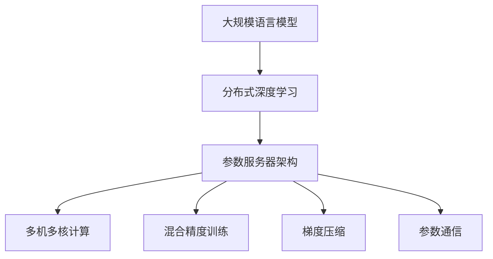

                 

# 大规模语言模型从理论到实践 参数服务器架构

> 关键词：大规模语言模型,参数服务器,分布式训练,深度学习,高性能计算

## 1. 背景介绍

### 1.1 问题由来
近年来，随着深度学习技术和大数据技术的发展，大规模语言模型（Large Language Models, LLMs），如GPT-3、BERT等，已经成为了自然语言处理（Natural Language Processing, NLP）领域的明星模型。这些模型在各种NLP任务中表现出色，显著提升了自动文本生成的质量和准确性，推动了NLP技术的广泛应用。

然而，训练这些大规模语言模型需要巨大的计算资源和存储空间。单个模型的参数量通常以十亿计，对单个服务器的硬件要求极高。为了降低成本，加速模型训练和推理，研究者提出了分布式训练和参数服务器（Parameter Server, PS）架构。

本文将系统介绍基于参数服务器架构的大规模语言模型训练方法，包括其核心原理、具体操作步骤、优化策略等。希望通过本文的介绍，读者能对大规模语言模型的训练有更深入的理解，并能够在实际项目中应用这些技术。

### 1.2 问题核心关键点
参数服务器架构（PS）是一种分布式训练的架构，旨在解决大规模模型训练中单个服务器计算能力不足的问题。其核心思想是：将大规模模型的参数分布在多个计算节点上，主节点（称为参数服务器）集中存储和更新这些参数，而其他节点（称为参数客户端）负责本地计算。通过这种方式，可以显著提升模型的训练速度，降低硬件成本。

PS架构在大规模深度学习模型训练中已广泛应用，如分布式深度学习框架TensorFlow、PyTorch等都支持这种架构。在大规模语言模型训练中，PS架构同样具有极高的应用价值。

## 2. 核心概念与联系

### 2.1 核心概念概述

为更好地理解基于PS架构的大规模语言模型训练方法，本节将介绍几个密切相关的核心概念：

- 大规模语言模型（Large Language Model, LLM）：指参数量在数十亿甚至数百亿级别，能够处理大规模文本数据的深度学习模型。通过在大规模语料库上进行预训练，这些模型能够学习到丰富的语言知识和表示能力。

- 分布式深度学习（Distributed Deep Learning, DDL）：指将深度学习模型和训练过程分布在多个计算节点上进行并行计算，以提高训练效率和降低硬件成本。

- 参数服务器架构（Parameter Server, PS）：一种分布式深度学习架构，通过将大规模模型的参数存储在集中式参数服务器上，客户端节点负责计算和更新参数，实现高效协同训练。

- 多机多核（Multi-Machine Multi-Core, MM-MC）：指通过多机多核计算资源（如GPU、TPU等）的充分利用，进一步提升模型的训练速度和精度。

- 混合精度（Mixed Precision, MP）：指在深度学习模型训练中，采用不同精度的参数和计算方式，如半精度浮点（FP16）和单精度浮点（FP32），以提高计算效率和降低存储需求。

- 梯度压缩（Gradient Compression）：指在分布式深度学习中，通过压缩梯度数据（如采用稀疏化、剪枝等技术）减少传输和存储开销，提升训练速度。

- 参数通信（Parameter Communication）：指在分布式深度学习中，参数服务器与参数客户端之间的通信和同步机制，如同步更新（Sync）、异步更新（Async）、局部更新（Local）等。

这些核心概念之间的逻辑关系可以通过以下Mermaid流程图来展示：



这个流程图展示了大规模语言模型训练的核心概念及其之间的关系：

1. 大规模语言模型通过分布式深度学习实现高效并行计算。
2. 参数服务器架构通过集中式存储和更新参数，实现高效协同训练。
3. 多机多核计算通过充分利用硬件资源，提升模型训练速度。
4. 混合精度训练通过采用不同精度的参数和计算方式，优化训练效率和存储需求。
5. 梯度压缩通过压缩梯度数据，减少传输和存储开销，提升训练速度。
6. 参数通信通过不同通信方式，实现参数服务器与参数客户端的同步和更新。

这些概念共同构成了大规模语言模型训练的分布式架构，使得在大规模数据集和计算资源下，能够高效、快速地训练出高质量的模型。

## 3. 核心算法原理 & 具体操作步骤

### 3.1 算法原理概述

基于PS架构的大规模语言模型训练，本质上是一种分布式深度学习过程。其核心思想是：将大规模模型的参数分布在多个计算节点上，参数服务器集中存储和更新这些参数，客户端节点负责本地计算和参数更新。通过这种方式，可以高效地进行大规模模型训练。

假设参数服务器存储了模型参数 $W$，客户端节点 $N$ 分别计算模型梯度 $G^{(i)}$，更新参数的过程可以描述为：

$$
W_{new} = W - \alpha \sum_{i=1}^N G^{(i)}
$$

其中 $\alpha$ 为学习率，$G^{(i)}$ 为节点 $i$ 计算的梯度。通过这种方式，节点 $i$ 更新模型参数的过程可以独立进行，而不会互相影响。

### 3.2 算法步骤详解

基于PS架构的大规模语言模型训练一般包括以下几个关键步骤：

**Step 1: 参数初始化和分布**

- 初始化模型参数 $W$，并将其分布到多个计算节点上。
- 设置参数服务器的地址和通信协议，如基于AllReduce的Gloo协议或基于TCP的MPI协议。

**Step 2: 计算梯度**

- 节点 $i$ 对输入数据 $D^{(i)}$ 进行本地计算，得到模型梯度 $G^{(i)}$。
- 将梯度 $G^{(i)}$ 发送给参数服务器。

**Step 3: 更新参数**

- 参数服务器接收来自所有节点的梯度 $G^{(i)}$，计算全局梯度 $G$。
- 参数服务器使用全局梯度 $G$ 更新模型参数 $W$。
- 将更新后的参数 $W_{new}$ 广播到所有节点。

**Step 4: 通信与同步**

- 节点 $i$ 从参数服务器接收更新后的参数 $W_{new}$，并更新本地模型。
- 参数服务器与所有节点保持同步，确保参数更新的一致性。

**Step 5: 迭代优化**

- 重复上述步骤，直到模型收敛或达到预设的迭代次数。

### 3.3 算法优缺点

基于PS架构的大规模语言模型训练方法具有以下优点：

1. 高效性。通过分布式计算，可以显著提升模型的训练速度，减少单个节点的计算量。
2. 扩展性。通过添加更多计算节点，可以轻松扩展计算资源，适应更大规模的模型训练。
3. 资源利用率。每个节点只需要存储和计算自己负责的部分参数，资源利用率高。

同时，该方法也存在一些局限性：

1. 通信开销。节点与参数服务器之间的通信需要传输大量数据，会增加网络带宽和延迟。
2. 同步延迟。节点之间的同步更新会导致一定的延迟，影响训练速度。
3. 负载均衡。如果节点负载不均衡，可能会导致某些节点的计算能力无法充分利用。
4. 内存消耗。每个节点需要存储模型参数和计算梯度，对内存需求较高。

尽管存在这些局限性，但基于PS架构的大规模语言模型训练方法仍然是大规模模型训练的主流范式。未来相关研究的重点在于如何进一步优化通信和同步机制，提高模型的训练速度和稳定性。

### 3.4 算法应用领域

基于PS架构的大规模语言模型训练方法在深度学习领域已经得到了广泛的应用，覆盖了几乎所有常见的深度学习任务，如计算机视觉、自然语言处理、语音识别等。

在NLP领域，该方法被广泛应用于大规模语言模型的训练，如GPT系列、BERT等模型的分布式训练。在计算机视觉领域，该方法被应用于大规模图像识别和分类任务，如ImageNet大模型的训练。

此外，在语音识别、推荐系统、视频分析等领域，基于PS架构的分布式深度学习训练方法也有广泛应用，为这些领域带来了革命性的变化。

## 4. 数学模型和公式 & 详细讲解 & 举例说明

### 4.1 数学模型构建

在本节中，我们将使用数学语言对基于PS架构的大规模语言模型训练过程进行更加严格的刻画。

假设参数服务器存储了模型参数 $W$，客户端节点 $N$ 分别计算模型梯度 $G^{(i)}$。则模型参数的更新公式为：

$$
W_{new} = W - \alpha \sum_{i=1}^N G^{(i)}
$$

其中 $\alpha$ 为学习率，$G^{(i)}$ 为节点 $i$ 计算的梯度。

在实践中，我们通常使用基于梯度的优化算法（如SGD、Adam等）来近似求解上述最优化问题。设 $\eta$ 为学习率，则参数的更新公式为：

$$
W \leftarrow W - \eta \nabla_{W}\mathcal{L}(W)
$$

其中 $\mathcal{L}$ 为损失函数，$\nabla_{W}\mathcal{L}(W)$ 为损失函数对参数 $W$ 的梯度，可通过反向传播算法高效计算。

### 4.2 公式推导过程

以下我们以二分类任务为例，推导交叉熵损失函数及其梯度的计算公式。

假设模型 $M_{\theta}$ 在输入 $x$ 上的输出为 $\hat{y}=M_{\theta}(x) \in [0,1]$，表示样本属于正类的概率。真实标签 $y \in \{0,1\}$。则二分类交叉熵损失函数定义为：

$$
\ell(M_{\theta}(x),y) = -[y\log \hat{y} + (1-y)\log (1-\hat{y})]
$$

将其代入损失函数公式，得：

$$
\mathcal{L}(W) = -\frac{1}{N}\sum_{i=1}^N \ell(M_{\theta}(x_i),y_i)
$$

根据链式法则，损失函数对参数 $W$ 的梯度为：

$$
\frac{\partial \mathcal{L}(W)}{\partial W} = -\frac{1}{N}\sum_{i=1}^N (\frac{y_i}{\hat{y}_i}-\frac{1-y_i}{1-\hat{y}_i}) \frac{\partial \hat{y}_i}{\partial W}
$$

其中 $\frac{\partial \hat{y}_i}{\partial W}$ 可进一步递归展开，利用自动微分技术完成计算。

### 4.3 案例分析与讲解

在本节中，我们将通过一个简单的案例来展示基于PS架构的分布式训练过程。

假设我们有一个包含10个客户端的分布式计算环境，每个客户端处理1000个样本。模型的参数量为10万个，分布在1个参数服务器上。每个客户端的计算过程如下：

1. 客户端从参数服务器接收当前参数 $W^{(0)}$。
2. 对每个样本 $x_i$，计算模型输出 $\hat{y}_i$ 和梯度 $G^{(i)}$。
3. 将梯度 $G^{(i)}$ 发送给参数服务器。
4. 参数服务器计算全局梯度 $G$，并更新参数 $W^{(1)}$。
5. 参数服务器将更新后的参数 $W^{(1)}$ 广播到所有客户端。
6. 重复2-5步骤，直到模型收敛或达到预设的迭代次数。

通过这种方式，每个客户端只需要计算自己负责的样本，参数服务器集中存储和更新参数，实现高效并行计算。

## 5. 项目实践：代码实例和详细解释说明

### 5.1 开发环境搭建

在进行PS架构的分布式深度学习实践前，我们需要准备好开发环境。以下是使用Python进行PyTorch开发的PS架构环境配置流程：

1. 安装Anaconda：从官网下载并安装Anaconda，用于创建独立的Python环境。

2. 创建并激活虚拟环境：
```bash
conda create -n ps-env python=3.8 
conda activate ps-env
```

3. 安装PyTorch：根据CUDA版本，从官网获取对应的安装命令。例如：
```bash
conda install pytorch torchvision torchaudio cudatoolkit=11.1 -c pytorch -c conda-forge
```

4. 安装Gloo：
```bash
conda install -c conda-forge gloo
```

5. 安装MPI：
```bash
conda install -c conda-forge mpi4py
```

6. 安装NVIDIA NCCL：
```bash
conda install -c conda-forge nvidia-nccl
```

完成上述步骤后，即可在`ps-env`环境中开始PS架构的分布式深度学习实践。

### 5.2 源代码详细实现

下面我们以分布式训练BERT模型为例，给出使用PyTorch和Gloo进行分布式深度学习的PyTorch代码实现。

首先，定义数据集和模型：

```python
from torch.utils.data import Dataset, DataLoader
import torch
import torch.distributed as dist
from transformers import BertForSequenceClassification, BertTokenizer
import gloo

class BERTDataset(Dataset):
    def __init__(self, texts, labels):
        self.texts = texts
        self.labels = labels
        self.tokenizer = BertTokenizer.from_pretrained('bert-base-uncased')
        self.max_len = 128
        
    def __len__(self):
        return len(self.texts)
    
    def __getitem__(self, item):
        text = self.texts[item]
        label = self.labels[item]
        
        encoding = self.tokenizer(text, return_tensors='pt', max_length=self.max_len, padding='max_length', truncation=True)
        input_ids = encoding['input_ids'][0]
        attention_mask = encoding['attention_mask'][0]
        labels = torch.tensor(label, dtype=torch.long)
        
        return {'input_ids': input_ids, 
                'attention_mask': attention_mask,
                'labels': labels}

# 初始化模型
model = BertForSequenceClassification.from_pretrained('bert-base-uncased', num_labels=2)

# 初始化分布式参数
dist.init_process_group('gloo', rank=0, world_size=2, backend='gloo')
dist.barrier()
```

然后，定义分布式训练函数：

```python
def train_epoch(model, dataset, optimizer, device):
    dataloader = DataLoader(dataset, batch_size=16, shuffle=True)
    model.to(device)
    model.train()
    
    for batch in dataloader:
        input_ids = batch['input_ids'].to(device)
        attention_mask = batch['attention_mask'].to(device)
        labels = batch['labels'].to(device)
        
        optimizer.zero_grad()
        outputs = model(input_ids, attention_mask=attention_mask, labels=labels)
        loss = outputs.loss
        loss.backward()
        optimizer.step()
    
    return loss.item()

# 定义分布式训练的主函数
def distributed_train(model, dataset, optimizer, num_epochs=5):
    device = 'cuda' if torch.cuda.is_available() else 'cpu'
    model.to(device)
    for epoch in range(num_epochs):
        loss = train_epoch(model, dataset, optimizer, device)
        print(f'Epoch {epoch+1}, loss: {loss:.3f}')
    
    dist.destroy_process_group()
```

最后，启动分布式训练流程：

```python
# 准备数据集
train_dataset = BERTDataset(train_texts, train_labels)

# 初始化优化器
optimizer = torch.optim.Adam(model.parameters(), lr=1e-5)

# 启动分布式训练
distributed_train(model, train_dataset, optimizer)
```

以上就是使用PyTorch和Gloo进行分布式深度学习的基本实现。可以看到，通过简单的代码改动，我们就可以将一个单机训练的模型转换为分布式训练的模型。

### 5.3 代码解读与分析

让我们再详细解读一下关键代码的实现细节：

**BERTDataset类**：
- `__init__`方法：初始化文本、标签、分词器等关键组件。
- `__len__`方法：返回数据集的样本数量。
- `__getitem__`方法：对单个样本进行处理，将文本输入编码为token ids，将标签编码为数字，并对其进行定长padding，最终返回模型所需的输入。

**分布式初始化**：
- `dist.init_process_group`方法：初始化分布式参数，使用Gloo作为通信协议。

**train_epoch函数**：
- 使用PyTorch的DataLoader对数据集进行批次化加载，供模型训练使用。
- 在每个批次上前向传播计算loss并反向传播更新模型参数，最后返回该epoch的平均loss。

**distributed_train函数**：
- 在分布式环境中，将模型移动到设备。
- 定义训练函数，在每个epoch内进行训练，并打印loss。
- 最后调用`dist.destroy_process_group`方法关闭分布式环境。

可以看到，PyTorch配合Gloo使得分布式深度学习的实现变得相对简洁高效。开发者可以将更多精力放在模型设计、数据处理等高层逻辑上，而不必过多关注底层实现细节。

当然，工业级的系统实现还需考虑更多因素，如参数高效微调、混合精度训练、梯度压缩等高级优化策略，但核心的分布式训练流程基本与此类似。

## 6. 实际应用场景

### 6.1 智能客服系统

基于PS架构的分布式深度学习技术，可以广泛应用于智能客服系统的构建。传统客服往往需要配备大量人力，高峰期响应缓慢，且一致性和专业性难以保证。而使用分布式深度学习技术，可以7x24小时不间断服务，快速响应客户咨询，用自然流畅的语言解答各类常见问题。

在技术实现上，可以收集企业内部的历史客服对话记录，将问题和最佳答复构建成监督数据，在此基础上对预训练模型进行分布式微调。微调后的模型能够自动理解用户意图，匹配最合适的答案模板进行回复。对于客户提出的新问题，还可以接入检索系统实时搜索相关内容，动态组织生成回答。如此构建的智能客服系统，能大幅提升客户咨询体验和问题解决效率。

### 6.2 金融舆情监测

金融机构需要实时监测市场舆论动向，以便及时应对负面信息传播，规避金融风险。传统的人工监测方式成本高、效率低，难以应对网络时代海量信息爆发的挑战。基于PS架构的分布式深度学习文本分类和情感分析技术，为金融舆情监测提供了新的解决方案。

具体而言，可以收集金融领域相关的新闻、报道、评论等文本数据，并对其进行主题标注和情感标注。在此基础上对预训练语言模型进行分布式微调，使其能够自动判断文本属于何种主题，情感倾向是正面、中性还是负面。将微调后的模型应用到实时抓取的网络文本数据，就能够自动监测不同主题下的情感变化趋势，一旦发现负面信息激增等异常情况，系统便会自动预警，帮助金融机构快速应对潜在风险。

### 6.3 个性化推荐系统

当前的推荐系统往往只依赖用户的历史行为数据进行物品推荐，无法深入理解用户的真实兴趣偏好。基于PS架构的分布式深度学习技术，个性化推荐系统可以更好地挖掘用户行为背后的语义信息，从而提供更精准、多样的推荐内容。

在实践中，可以收集用户浏览、点击、评论、分享等行为数据，提取和用户交互的物品标题、描述、标签等文本内容。将文本内容作为模型输入，用户的后续行为（如是否点击、购买等）作为监督信号，在此基础上对预训练语言模型进行分布式微调。微调后的模型能够从文本内容中准确把握用户的兴趣点。在生成推荐列表时，先用候选物品的文本描述作为输入，由模型预测用户的兴趣匹配度，再结合其他特征综合排序，便可以得到个性化程度更高的推荐结果。

### 6.4 未来应用展望

随着深度学习技术和分布式计算技术的不断发展，基于PS架构的分布式深度学习技术将有更广阔的应用前景。

在智慧医疗领域，基于PS架构的分布式深度学习医疗问答、病历分析、药物研发等应用将提升医疗服务的智能化水平，辅助医生诊疗，加速新药开发进程。

在智能教育领域，分布式深度学习可应用于作业批改、学情分析、知识推荐等方面，因材施教，促进教育公平，提高教学质量。

在智慧城市治理中，分布式深度学习技术可应用于城市事件监测、舆情分析、应急指挥等环节，提高城市管理的自动化和智能化水平，构建更安全、高效的未来城市。

此外，在企业生产、社会治理、文娱传媒等众多领域，基于PS架构的分布式深度学习技术也有广泛应用，为各行各业带来变革性影响。相信随着技术的日益成熟，分布式深度学习技术将成为人工智能落地应用的重要范式，推动人工智能技术在更广阔的领域加速渗透。

## 7. 工具和资源推荐
### 7.1 学习资源推荐

为了帮助开发者系统掌握PS架构的分布式深度学习理论基础和实践技巧，这里推荐一些优质的学习资源：

1. 《Distributed Deep Learning with TensorFlow》书籍：Google团队编写的分布式深度学习实战指南，详细介绍了TensorFlow在分布式环境下的实现和应用。

2. 《PyTorch分布式深度学习教程》：PyTorch官方文档，提供了丰富的分布式深度学习教程和样例，帮助开发者上手实践。

3. 《深度学习分布式计算》课程：由北京大学开设的MOOC课程，介绍了分布式计算和深度学习的结合，提供了丰富的实验和案例。

4. Gloo官方文档：Gloo库的官方文档，提供了详细的API和样例，帮助开发者在分布式环境下进行深度学习训练。

5. mpi4py官方文档：MPI库的Python接口文档，提供了丰富的MPI操作，帮助开发者进行分布式计算。

通过对这些资源的学习实践，相信你一定能够快速掌握PS架构的分布式深度学习精髓，并能够在实际项目中应用这些技术。

### 7.2 开发工具推荐

高效的开发离不开优秀的工具支持。以下是几款用于分布式深度学习训练开发的常用工具：

1. PyTorch：基于Python的开源深度学习框架，灵活动态的计算图，适合快速迭代研究。支持Gloo和MPI等分布式协议。

2. TensorFlow：由Google主导开发的开源深度学习框架，生产部署方便，适合大规模工程应用。支持TensorFlow分布式策略，支持Gloo和MPI等分布式协议。

3. Gloo：Facebook开源的分布式通信库，提供高效的跨节点通信服务，支持多种编程语言。

4. mpi4py：MPI库的Python接口，提供丰富的MPI操作，支持分布式计算。

5. OpenMPI：开源的MPI库，支持多种操作系统和编程语言，提供高效的跨节点通信服务。

6. MPI4J：Java语言实现的高性能MPI库，提供丰富的MPI操作，支持分布式计算。

合理利用这些工具，可以显著提升分布式深度学习的开发效率，加快创新迭代的步伐。

### 7.3 相关论文推荐

分布式深度学习和大规模模型训练领域的研究已经取得了诸多重要成果。以下是几篇奠基性的相关论文，推荐阅读：

1. DDP: An Efficient Distributed Deep Learning Framework with Heterogeneous Computation and Communication:这篇文章介绍了Facebook开源的分布式深度学习框架DDP，详细介绍了DDP在分布式计算和通信中的实现和优化。

2. X-Transformer: A Distributed Deep Learning Library for Neural Machine Translation:这篇文章介绍了分布式深度学习库X-Transformer，介绍了X-Transformer在分布式环境下的实现和优化。

3. Hierarchical Model Training: A Parameter Server for Deep Learning:这篇文章介绍了Hierarchical Model Training，一种基于分布式深度学习的参数服务器架构，详细介绍了其在模型训练中的实现和优化。

4. Sharding of Deep Neural Networks: A Scalable Model Parallelism Solution:这篇文章介绍了Sharding of Deep Neural Networks，一种基于分布式深度学习的模型并行技术，详细介绍了其在模型训练中的实现和优化。

这些论文代表了大规模模型分布式训练技术的发展脉络。通过学习这些前沿成果，可以帮助研究者把握学科前进方向，激发更多的创新灵感。

## 8. 总结：未来发展趋势与挑战

### 8.1 总结

本文对基于PS架构的大规模语言模型训练方法进行了全面系统的介绍。首先阐述了大规模语言模型和PS架构的研究背景和意义，明确了分布式深度学习在大规模模型训练中的重要地位。其次，从原理到实践，详细讲解了PS架构的数学模型和训练步骤，给出了分布式深度学习的基本代码实现。同时，本文还探讨了PS架构在实际应用中的各种场景，展示了其广泛的应用前景。最后，本文精选了分布式深度学习技术的各类学习资源，力求为读者提供全方位的技术指引。

通过本文的系统梳理，可以看到，基于PS架构的分布式深度学习技术在大规模语言模型训练中发挥了重要作用，极大地提升了模型的训练效率和性能。未来，伴随深度学习技术和大数据技术的发展，分布式深度学习技术将在更多领域得到应用，为人工智能技术的发展带来新的动力。

### 8.2 未来发展趋势

展望未来，分布式深度学习技术将呈现以下几个发展趋势：

1. 分布式计算资源多样化。未来的分布式深度学习系统将支持更多的计算资源（如GPU、TPU、CPU等），能够更加灵活地选择计算资源，提高模型的训练速度和精度。

2. 通信效率提升。未来的分布式深度学习系统将采用更高效的通信协议和算法，减少节点间的通信开销，提高系统的吞吐量和响应速度。

3. 自动化调参。未来的分布式深度学习系统将具备更强大的自动调参能力，能够自动优化超参数组合，快速找到最优的模型配置。

4. 混合并行模型。未来的分布式深度学习系统将支持多种并行模型（如数据并行、模型并行、混合并行等），能够根据具体任务需求选择最合适的并行方式。

5. 可扩展性提升。未来的分布式深度学习系统将具备更高的可扩展性，能够轻松扩展到更大规模的数据集和计算资源，适应更多的大规模模型训练需求。

6. 分布式可视化。未来的分布式深度学习系统将支持更强大的可视化工具，能够实时展示模型的训练状态和性能，帮助开发者更好地进行调试和优化。

以上趋势凸显了分布式深度学习技术的广阔前景。这些方向的探索发展，必将进一步提升分布式深度学习的效率和精度，推动人工智能技术在更广阔的领域加速应用。

### 8.3 面临的挑战

尽管分布式深度学习技术已经取得了显著进展，但在向更广泛应用场景推广的过程中，仍面临诸多挑战：

1. 通信开销。节点与参数服务器之间的通信需要传输大量数据，增加了网络带宽和延迟，影响训练速度。

2. 同步延迟。节点之间的同步更新会导致一定的延迟，影响训练效率。

3. 负载均衡。如果节点负载不均衡，可能会导致某些节点的计算能力无法充分利用。

4. 内存消耗。每个节点需要存储模型参数和计算梯度，对内存需求较高。

5. 分布式调试。分布式深度学习模型在调试时面临更多的复杂性，需要更多的工具和经验。

尽管存在这些挑战，但通过不断优化通信和同步机制，提高资源利用率，提升分布式调参能力，这些问题仍有望得到解决。相信随着技术的不断进步，分布式深度学习技术将在大规模模型训练中发挥越来越重要的作用。

### 8.4 研究展望

面对分布式深度学习面临的挑战，未来的研究需要在以下几个方面寻求新的突破：

1. 优化通信和同步机制。通过引入更高效的通信协议和算法，减少通信开销，提高系统的吞吐量和响应速度。

2. 提升资源利用率。通过优化内存管理、利用GPU/TPU等硬件资源，提高模型的训练速度和精度。

3. 增强分布式调参能力。通过引入更强大的自动调参算法，自动优化超参数组合，快速找到最优的模型配置。

4. 支持混合并行模型。通过引入数据并行、模型并行、混合并行等多种并行模型，适应更多的大规模模型训练需求。

5. 增强可扩展性。通过引入更强大的分布式调度和管理算法，支持更大规模的分布式计算环境。

6. 引入更强大的可视化工具。通过引入更强大的可视化工具，实时展示模型的训练状态和性能，帮助开发者更好地进行调试和优化。

这些研究方向的探索，必将引领分布式深度学习技术迈向更高的台阶，为人工智能技术的发展提供新的动力。面向未来，分布式深度学习技术将成为人工智能技术发展的核心范式，推动人工智能技术在更广阔的领域加速应用。

## 9. 附录：常见问题与解答

**Q1：PS架构在大规模模型训练中有何优势？**

A: PS架构在大规模模型训练中的优势主要体现在以下几个方面：

1. 高效性。通过分布式计算，可以显著提升模型的训练速度，减少单个节点的计算量。

2. 扩展性。通过添加更多计算节点，可以轻松扩展计算资源，适应更大规模的模型训练。

3. 资源利用率。每个节点只需要存储和计算自己负责的部分参数，资源利用率高。

4. 可扩展性。支持更大规模的分布式计算环境，能够适应更多的大规模模型训练需求。

尽管存在一些通信开销、同步延迟等挑战，但PS架构在大规模模型训练中仍然具有极大的优势。

**Q2：如何优化PS架构中的通信开销？**

A: 优化PS架构中的通信开销，可以采取以下策略：

1. 数据压缩。采用数据压缩算法，如Huffman编码、LZ77等，减少数据传输量。

2. 梯度压缩。采用梯度压缩算法，如剪枝、量化、稀疏化等，减少传输的梯度数据量。

3. 减少通信频率。通过减少通信频率，如异步更新、局部更新等，减少节点间的通信次数。

4. 使用更高效的通信协议。采用更高效的通信协议，如Gloo、MPI等，提高通信效率。

5. 使用更高效的存储。采用更高效的存储方式，如SSD、NVMe等，提高数据传输速度。

通过以上策略，可以显著降低通信开销，提高分布式深度学习的训练效率。

**Q3：如何提升PS架构中的同步效率？**

A: 提升PS架构中的同步效率，可以采取以下策略：

1. 异步更新。采用异步更新策略，节点在计算梯度后，不立即同步参数，而是等到所有节点的计算完成后再进行参数更新。

2. 局部更新。采用局部更新策略，节点在计算梯度后，只更新自己负责的参数部分，不等待其他节点的更新。

3. 减少通信频率。通过减少通信频率，如使用异步更新、局部更新等，减少节点间的通信次数。

4. 使用更高效的通信协议。采用更高效的通信协议，如Gloo、MPI等，提高通信效率。

5. 优化同步算法。采用更高效的同步算法，如同步更新、分布式优化器等，提高同步效率。

通过以上策略，可以显著提升PS架构中的同步效率，提高分布式深度学习的训练效率。

**Q4：分布式深度学习在实际应用中需要注意哪些问题？**

A: 分布式深度学习在实际应用中需要注意以下问题：

1. 通信开销。节点与参数服务器之间的通信需要传输大量数据，增加了网络带宽和延迟，影响训练速度。

2. 同步延迟。节点之间的同步更新会导致一定的延迟，影响训练效率。

3. 负载均衡。如果节点负载不均衡，可能会导致某些节点的计算能力无法充分利用。

4. 内存消耗。每个节点需要存储模型参数和计算梯度，对内存需求较高。

5. 分布式调试。分布式深度学习模型在调试时面临更多的复杂性，需要更多的工具和经验。

6. 分布式优化。分布式深度学习模型的优化比单机模型更加复杂，需要更多的优化技巧和经验。

7. 分布式可视化。分布式深度学习模型的可视化工具不如单机模型丰富，需要更多的可视化技巧和经验。

这些问题需要开发者在实际应用中综合考虑，通过优化通信和同步机制，提高资源利用率，提升分布式调参能力，才能更好地利用分布式深度学习技术，实现高效、稳定的模型训练。

**Q5：未来分布式深度学习技术的发展方向有哪些？**

A: 未来分布式深度学习技术的发展方向主要包括以下几个方面：

1. 通信效率提升。未来的分布式深度学习系统将采用更高效的通信协议和算法，减少节点间的通信开销。

2. 同步效率提升。未来的分布式深度学习系统将采用更高效的同步策略，减少节点间的同步开销。

3. 资源利用率提升。未来的分布式深度学习系统将采用更高效的资源管理策略，提高计算资源的利用率。

4. 自动化调参能力提升。未来的分布式深度学习系统将具备更强大的自动调参能力，能够自动优化超参数组合，快速找到最优的模型配置。

5. 混合并行模型。未来的分布式深度学习系统将支持多种并行模型（如数据并行、模型并行、混合并行等），能够根据具体任务需求选择最合适的并行方式。

6. 可扩展性提升。未来的分布式深度学习系统将具备更高的可扩展性，能够轻松扩展到更大规模的数据集和计算资源。

7. 分布式可视化。未来的分布式深度学习系统将支持更强大的可视化工具，能够实时展示模型的训练状态和性能，帮助开发者更好地进行调试和优化。

这些发展方向将推动分布式深度学习技术向更高效率、更高精度、更高自动化方向发展，为人工智能技术的发展提供新的动力。

---

作者：禅与计算机程序设计艺术 / Zen and the Art of Computer Programming

