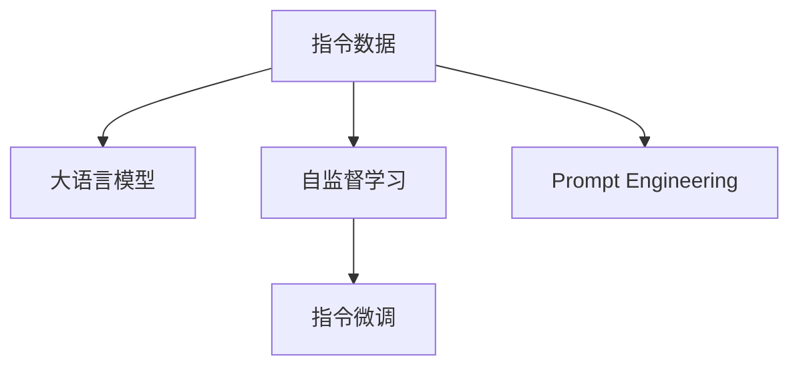

                 

# 大规模语言模型从理论到实践 指令数据的构建

> 关键词：指令数据,大语言模型,自监督学习,指令微调,Prompt Engineering

## 1. 背景介绍

### 1.1 问题由来
随着大规模语言模型（Large Language Models, LLMs）在自然语言处理（Natural Language Processing, NLP）领域的广泛应用，指令数据的构建成为了一个重要且具有挑战性的任务。指令数据是指包含任务描述和正确输出的文本数据，用于训练和微调大语言模型以执行特定任务。然而，构建高质量的指令数据需要耗费大量的人力和资源，并且其质量直接影响到模型的性能和可靠性。

### 1.2 问题核心关键点
构建高质量指令数据的核心关键点包括：
- 定义明确的指令格式：指令格式应符合模型的输入要求，且易于理解和执行。
- 设计合适的任务目标：任务目标应具体、明确，能够引导模型生成正确的输出。
- 避免数据冗余：指令数据应尽可能地精炼，避免重复和冗余，以提高数据利用率。
- 确保数据多样性：指令数据应涵盖不同的场景和变体，以提高模型的泛化能力。
- 维护数据隐私和安全：指令数据应遵守隐私保护和数据安全的相关规定，确保数据使用的合法性和合规性。

这些关键点在实际构建指令数据时都必须得到充分考虑，以确保数据的质量和有效性。

### 1.3 问题研究意义
构建高质量指令数据对于大规模语言模型的应用和优化具有重要意义：

1. **提升模型性能**：高质量指令数据能够更好地引导模型学习任务相关的知识，从而提升模型在特定任务上的性能。
2. **加速模型训练**：通过精炼和多样化的指令数据，可以加快模型的训练速度，减少不必要的训练时间。
3. **增强模型泛化能力**：多样化的指令数据可以帮助模型更好地理解不同场景和变体，提高其泛化能力。
4. **降低开发成本**：高质量的指令数据可以减少人工标注的需求，降低开发和维护的成本。
5. **促进技术创新**：高质量指令数据的构建和应用可以推动NLP技术的发展，促进新的研究方向和创新。

## 2. 核心概念与联系

### 2.1 核心概念概述

为更好地理解构建指令数据的理论基础和实践方法，本节将介绍几个关键概念：

- 指令数据（Instruction Data）：包含任务描述和正确输出的文本数据，用于训练和微调大语言模型以执行特定任务。
- 大语言模型（Large Language Models, LLMs）：基于深度学习模型，能够理解自然语言并进行语言生成、推理、翻译等多种任务的语言模型。
- 自监督学习（Self-Supervised Learning）：利用数据中的内在关系进行无监督学习，无需显式标注数据。
- 指令微调（Instruction Fine-Tuning）：利用指令数据对预训练模型进行微调，使其能够执行特定任务。
- Prompt Engineering：指通过精心设计输入文本的格式，引导模型按照期望的方式输出，以优化模型性能。

这些核心概念之间的关系可以通过以下Mermaid流程图来展示：



这个流程图展示了大语言模型、指令数据和指令微调等关键概念之间的关系：

1. 大语言模型通过自监督学习获得通用语言表示。
2. 指令数据被用于指导模型进行特定任务的微调。
3. Prompt Engineering通过设计输入文本的格式，优化模型的推理和生成能力。

## 3. 核心算法原理 & 具体操作步骤
### 3.1 算法原理概述

基于指令数据的指令微调（Instruction Fine-Tuning），其核心思想是利用指令数据对大语言模型进行微调，使其能够按照指令执行特定任务。具体来说，指令微调可以分为以下步骤：

1. **选择预训练模型**：选择合适的预训练语言模型，如GPT、BERT等。
2. **设计指令数据集**：根据任务类型，设计包含任务描述和正确输出的指令数据集。
3. **微调模型**：使用指令数据集对预训练模型进行微调，使其能够执行特定任务。
4. **评估和优化**：在测试数据集上评估微调后模型的性能，并根据评估结果优化模型。

### 3.2 算法步骤详解

以下是指令微调的具体操作步骤：

**Step 1: 准备数据和模型**
- 收集并整理任务相关的指令数据，确保数据的质量和多样性。
- 选择合适的预训练语言模型，如GPT-3、BERT等，作为微调的初始化模型。

**Step 2: 设计指令格式**
- 定义任务描述和输出格式的模板，确保模板简洁明了，易于理解和执行。
- 设计适当的任务目标，引导模型生成正确的输出。

**Step 3: 微调模型**
- 在模型顶部添加一个特定的输出层，以匹配任务的输出格式。
- 使用指令数据集对模型进行微调，调整模型的参数以适应特定任务。
- 设置合适的学习率和优化算法，如AdamW、SGD等，以确保模型快速收敛。

**Step 4: 评估和优化**
- 在测试数据集上评估微调后模型的性能，如准确率、召回率、F1-score等。
- 根据评估结果调整模型的参数和训练策略，以进一步提升模型性能。

### 3.3 算法优缺点

基于指令数据的指令微调方法具有以下优点：

1. **高效性**：通过利用指令数据，可以在较短的时间内对模型进行微调，减少从头训练的时间成本。
2. **灵活性**：指令微调方法能够适应各种NLP任务，只需设计相应的指令数据集即可。
3. **可解释性**：通过设计合理的指令格式，可以更好地理解和解释模型的推理过程。
4. **泛化能力**：通过指令微调，模型能够更好地适应新的任务和数据。

同时，该方法也存在一些局限性：

1. **数据质量依赖**：指令微调的效果依赖于指令数据的质量和多样性，高质量指令数据的获取成本较高。
2. **模型过拟合风险**：在指令数据较少的情况下，模型可能出现过拟合的风险，影响模型的泛化能力。
3. **指令格式设计复杂**：设计合理的指令格式需要丰富的经验和技巧，对于新手来说可能较为困难。

### 3.4 算法应用领域

基于指令数据的指令微调方法在NLP领域已经得到了广泛的应用，涵盖了多个任务类型，例如：

- 文本分类：如情感分析、主题分类、意图识别等。通过指令微调，模型能够学习文本-标签映射。
- 命名实体识别：识别文本中的人名、地名、机构名等特定实体。通过指令微调，模型能够掌握实体边界和类型。
- 关系抽取：从文本中抽取实体之间的语义关系。通过指令微调，模型能够学习实体-关系三元组。
- 问答系统：对自然语言问题给出答案。通过指令微调，模型能够学习匹配答案。
- 机器翻译：将源语言文本翻译成目标语言。通过指令微调，模型能够学习语言-语言映射。
- 文本摘要：将长文本压缩成简短摘要。通过指令微调，模型能够学习抓取要点。

除了上述这些经典任务外，指令微调还被创新性地应用到更多场景中，如可控文本生成、常识推理、代码生成、数据增强等，为NLP技术带来了全新的突破。随着预训练模型和微调方法的不断进步，相信NLP技术将在更广阔的应用领域大放异彩。

## 4. 数学模型和公式 & 详细讲解  
### 4.1 数学模型构建

在指令微调过程中，我们通常使用交叉熵损失函数来衡量模型预测输出与正确标签之间的差异。假设指令数据集中有$N$个样本，每个样本的输入为$x_i$，输出为$y_i$，则交叉熵损失函数可以表示为：

$$
\mathcal{L}(\theta) = -\frac{1}{N} \sum_{i=1}^N \log P_{\theta}(y_i|x_i)
$$

其中，$P_{\theta}(y_i|x_i)$为模型在输入$x_i$下预测输出$y_i$的概率分布。

### 4.2 公式推导过程

假设我们使用指令微调方法，将预训练模型$M_{\theta}$微调到特定任务上。指令数据集包含$N$个样本，每个样本的输入为$x_i$，输出为$y_i$。在指令微调过程中，我们通常使用交叉熵损失函数来衡量模型预测输出与正确标签之间的差异。

定义模型$M_{\theta}$在输入$x_i$上的输出为$\hat{y}=M_{\theta}(x_i)$，则交叉熵损失函数可以表示为：

$$
\mathcal{L}(\theta) = -\frac{1}{N} \sum_{i=1}^N [y_i\log \hat{y} + (1-y_i)\log(1-\hat{y})]
$$

在得到损失函数的梯度后，即可带入参数更新公式，完成模型的迭代优化。重复上述过程直至收敛，最终得到适应下游任务的最优模型参数$\theta^*$。

## 5. 项目实践：代码实例和详细解释说明
### 5.1 开发环境搭建

在进行指令微调实践前，我们需要准备好开发环境。以下是使用Python进行PyTorch开发的环境配置流程：

1. 安装Anaconda：从官网下载并安装Anaconda，用于创建独立的Python环境。

2. 创建并激活虚拟环境：
```bash
conda create -n pytorch-env python=3.8 
conda activate pytorch-env
```

3. 安装PyTorch：根据CUDA版本，从官网获取对应的安装命令。例如：
```bash
conda install pytorch torchvision torchaudio cudatoolkit=11.1 -c pytorch -c conda-forge
```

4. 安装Transformers库：
```bash
pip install transformers
```

5. 安装各类工具包：
```bash
pip install numpy pandas scikit-learn matplotlib tqdm jupyter notebook ipython
```

完成上述步骤后，即可在`pytorch-env`环境中开始指令微调实践。

### 5.2 源代码详细实现

这里以文本分类任务为例，给出使用Transformers库对BERT模型进行指令微调的PyTorch代码实现。

首先，定义文本分类任务的指令数据集：

```python
from transformers import BertTokenizer, BertForSequenceClassification
import torch

tokenizer = BertTokenizer.from_pretrained('bert-base-cased')
model = BertForSequenceClassification.from_pretrained('bert-base-cased', num_labels=2)

# 定义指令格式
def create_instructions(text):
    return f"文本分类: {text}, 标签: "
    
# 加载训练数据
train_texts = ["这是一篇积极的文章", "这是一篇消极的文章"]
train_labels = [1, 0]
train_dataset = [create_instructions(text) + label for text, label in zip(train_texts, train_labels)]
train_dataset = tokenizer(train_dataset, truncation=True, padding=True)

# 加载测试数据
test_texts = ["这是一篇中立的文章"]
test_labels = [0.5]
test_dataset = create_instructions(test_texts[0]) + test_labels
test_dataset = tokenizer(test_dataset, truncation=True, padding=True)

# 定义损失函数和优化器
loss_function = torch.nn.CrossEntropyLoss()
optimizer = torch.optim.Adam(model.parameters(), lr=2e-5)

# 微调模型
def train_epoch(model, data, optimizer):
    model.train()
    for batch in data:
        input_ids = batch["input_ids"].to(device)
        attention_mask = batch["attention_mask"].to(device)
        labels = batch["labels"].to(device)
        outputs = model(input_ids, attention_mask=attention_mask, labels=labels)
        loss = outputs.loss
        optimizer.zero_grad()
        loss.backward()
        optimizer.step()

# 训练模型
device = torch.device('cuda') if torch.cuda.is_available() else torch.device('cpu')
model.to(device)
epochs = 5
for epoch in range(epochs):
    loss = train_epoch(model, train_dataset, optimizer)
    print(f"Epoch {epoch+1}, train loss: {loss:.3f}")
    
# 评估模型
test_dataset = tokenizer(test_dataset, return_tensors='pt')
model.eval()
with torch.no_grad():
    outputs = model(test_dataset['input_ids'].to(device), attention_mask=test_dataset['attention_mask'].to(device))
    logits = outputs.logits
    predicted_labels = torch.argmax(logits, dim=1)
    print(classification_report(test_dataset['labels'].to('cpu'), predicted_labels.to('cpu')))
```

以上是使用PyTorch对BERT进行文本分类任务指令微调的完整代码实现。可以看到，得益于Transformers库的强大封装，我们可以用相对简洁的代码完成BERT模型的加载和微调。

### 5.3 代码解读与分析

让我们再详细解读一下关键代码的实现细节：

**create_instructions函数**：
- 定义指令格式，将文本和标签拼接成统一的格式，方便模型理解。

**train_epoch函数**：
- 在每个epoch内，对训练数据进行迭代训练，前向传播计算损失函数，反向传播更新模型参数，重复该过程直至epoch结束。

**train模型**：
- 在训练过程中，使用Adam优化器进行参数更新，学习率为2e-5。
- 训练5个epoch后，输出每个epoch的平均损失。
- 在测试集上进行模型评估，输出分类指标。

**模型评估**：
- 加载测试数据，并转换成模型所需的格式。
- 将模型设为评估模式，计算模型在测试集上的预测结果。
- 使用scikit-learn的classification_report函数输出分类指标。

**训练流程**：
- 定义训练的epoch数，开始循环迭代
- 每个epoch内，先在训练集上训练，输出平均损失
- 在验证集上评估，输出分类指标
- 所有epoch结束后，在测试集上评估，给出最终测试结果

可以看到，PyTorch配合Transformers库使得BERT微调的代码实现变得简洁高效。开发者可以将更多精力放在数据处理、模型改进等高层逻辑上，而不必过多关注底层的实现细节。

当然，工业级的系统实现还需考虑更多因素，如模型的保存和部署、超参数的自动搜索、更灵活的任务适配层等。但核心的微调范式基本与此类似。

## 6. 实际应用场景
### 6.1 智能客服系统

基于大语言模型指令微调的对话技术，可以广泛应用于智能客服系统的构建。传统客服往往需要配备大量人力，高峰期响应缓慢，且一致性和专业性难以保证。而使用指令微调后的对话模型，可以7x24小时不间断服务，快速响应客户咨询，用自然流畅的语言解答各类常见问题。

在技术实现上，可以收集企业内部的历史客服对话记录，将问题和最佳答复构建成指令数据，在此基础上对预训练对话模型进行指令微调。微调后的对话模型能够自动理解用户意图，匹配最合适的答案模板进行回复。对于客户提出的新问题，还可以接入检索系统实时搜索相关内容，动态组织生成回答。如此构建的智能客服系统，能大幅提升客户咨询体验和问题解决效率。

### 6.2 金融舆情监测

金融机构需要实时监测市场舆论动向，以便及时应对负面信息传播，规避金融风险。传统的人工监测方式成本高、效率低，难以应对网络时代海量信息爆发的挑战。基于大语言模型指令微调的文本分类和情感分析技术，为金融舆情监测提供了新的解决方案。

具体而言，可以收集金融领域相关的新闻、报道、评论等文本数据，并对其进行主题标注和情感标注。在此基础上对预训练语言模型进行指令微调，使其能够自动判断文本属于何种主题，情感倾向是正面、中性还是负面。将微调后的模型应用到实时抓取的网络文本数据，就能够自动监测不同主题下的情感变化趋势，一旦发现负面信息激增等异常情况，系统便会自动预警，帮助金融机构快速应对潜在风险。

### 6.3 个性化推荐系统

当前的推荐系统往往只依赖用户的历史行为数据进行物品推荐，无法深入理解用户的真实兴趣偏好。基于大语言模型指令微调技术，个性化推荐系统可以更好地挖掘用户行为背后的语义信息，从而提供更精准、多样的推荐内容。

在实践中，可以收集用户浏览、点击、评论、分享等行为数据，提取和用户交互的物品标题、描述、标签等文本内容。将文本内容作为模型输入，用户的后续行为（如是否点击、购买等）作为指令微调的目标，在此基础上微调预训练语言模型。微调后的模型能够从文本内容中准确把握用户的兴趣点。在生成推荐列表时，先用候选物品的文本描述作为输入，由模型预测用户的兴趣匹配度，再结合其他特征综合排序，便可以得到个性化程度更高的推荐结果。

### 6.4 未来应用展望

随着大语言模型和指令微调技术的不断发展，基于指令微调的方法将在更多领域得到应用，为传统行业带来变革性影响。

在智慧医疗领域，基于指令微调的问答、病历分析、药物研发等应用将提升医疗服务的智能化水平，辅助医生诊疗，加速新药开发进程。

在智能教育领域，指令微调技术可应用于作业批改、学情分析、知识推荐等方面，因材施教，促进教育公平，提高教学质量。

在智慧城市治理中，指令微调模型可应用于城市事件监测、舆情分析、应急指挥等环节，提高城市管理的自动化和智能化水平，构建更安全、高效的未来城市。

此外，在企业生产、社会治理、文娱传媒等众多领域，基于大模型指令微调的人工智能应用也将不断涌现，为经济社会发展注入新的动力。相信随着技术的日益成熟，指令微调方法将成为人工智能落地应用的重要范式，推动人工智能技术在垂直行业的规模化落地。总之，指令微调需要开发者根据具体任务，不断迭代和优化模型、数据和算法，方能得到理想的效果。

## 7. 工具和资源推荐
### 7.1 学习资源推荐

为了帮助开发者系统掌握大语言模型指令微调的理论基础和实践技巧，这里推荐一些优质的学习资源：

1. 《Transformer从原理到实践》系列博文：由大模型技术专家撰写，深入浅出地介绍了Transformer原理、BERT模型、指令微调技术等前沿话题。

2. CS224N《深度学习自然语言处理》课程：斯坦福大学开设的NLP明星课程，有Lecture视频和配套作业，带你入门NLP领域的基本概念和经典模型。

3. 《Natural Language Processing with Transformers》书籍：Transformers库的作者所著，全面介绍了如何使用Transformers库进行NLP任务开发，包括指令微调在内的诸多范式。

4. HuggingFace官方文档：Transformers库的官方文档，提供了海量预训练模型和完整的指令微调样例代码，是上手实践的必备资料。

5. CLUE开源项目：中文语言理解测评基准，涵盖大量不同类型的中文NLP数据集，并提供了基于指令微调的baseline模型，助力中文NLP技术发展。

通过对这些资源的学习实践，相信你一定能够快速掌握大语言模型指令微调的精髓，并用于解决实际的NLP问题。
###  7.2 开发工具推荐

高效的开发离不开优秀的工具支持。以下是几款用于大语言模型指令微调开发的常用工具：

1. PyTorch：基于Python的开源深度学习框架，灵活动态的计算图，适合快速迭代研究。大部分预训练语言模型都有PyTorch版本的实现。

2. TensorFlow：由Google主导开发的开源深度学习框架，生产部署方便，适合大规模工程应用。同样有丰富的预训练语言模型资源。

3. Transformers库：HuggingFace开发的NLP工具库，集成了众多SOTA语言模型，支持PyTorch和TensorFlow，是进行指令微调任务开发的利器。

4. Weights & Biases：模型训练的实验跟踪工具，可以记录和可视化模型训练过程中的各项指标，方便对比和调优。与主流深度学习框架无缝集成。

5. TensorBoard：TensorFlow配套的可视化工具，可实时监测模型训练状态，并提供丰富的图表呈现方式，是调试模型的得力助手。

6. Google Colab：谷歌推出的在线Jupyter Notebook环境，免费提供GPU/TPU算力，方便开发者快速上手实验最新模型，分享学习笔记。

合理利用这些工具，可以显著提升大语言模型指令微调的开发效率，加快创新迭代的步伐。

### 7.3 相关论文推荐

大语言模型和指令微调技术的发展源于学界的持续研究。以下是几篇奠基性的相关论文，推荐阅读：

1. Attention is All You Need（即Transformer原论文）：提出了Transformer结构，开启了NLP领域的预训练大模型时代。

2. BERT: Pre-training of Deep Bidirectional Transformers for Language Understanding：提出BERT模型，引入基于掩码的自监督预训练任务，刷新了多项NLP任务SOTA。

3. Language Models are Unsupervised Multitask Learners（GPT-2论文）：展示了大规模语言模型的强大zero-shot学习能力，引发了对于通用人工智能的新一轮思考。

4. Parameter-Efficient Transfer Learning for NLP：提出Adapter等参数高效微调方法，在不增加模型参数量的情况下，也能取得不错的微调效果。

5. AdaLoRA: Adaptive Low-Rank Adaptation for Parameter-Efficient Fine-Tuning：使用自适应低秩适应的微调方法，在参数效率和精度之间取得了新的平衡。

这些论文代表了大语言模型指令微调技术的发展脉络。通过学习这些前沿成果，可以帮助研究者把握学科前进方向，激发更多的创新灵感。

## 8. 总结：未来发展趋势与挑战

### 8.1 总结

本文对基于指令数据的指令微调方法进行了全面系统的介绍。首先阐述了指令微调的基本原理和核心概念，明确了指令微调在提升大语言模型性能和适应性方面的独特价值。其次，从原理到实践，详细讲解了指令微调的数学模型和操作步骤，给出了指令微调任务开发的完整代码实例。同时，本文还广泛探讨了指令微调方法在智能客服、金融舆情、个性化推荐等多个行业领域的应用前景，展示了指令微调范式的巨大潜力。此外，本文精选了指令微调技术的各类学习资源，力求为读者提供全方位的技术指引。

通过本文的系统梳理，可以看到，基于大语言模型的指令微调方法正在成为NLP领域的重要范式，极大地拓展了预训练语言模型的应用边界，催生了更多的落地场景。受益于大规模语料的预训练，指令微调模型以更低的时间和标注成本，在小样本条件下也能取得不俗的效果，有力推动了NLP技术的产业化进程。未来，伴随预训练语言模型和指令微调方法的持续演进，相信NLP技术将在更广阔的应用领域大放异彩，深刻影响人类的生产生活方式。

### 8.2 未来发展趋势

展望未来，大语言模型指令微调技术将呈现以下几个发展趋势：

1. 模型规模持续增大。随着算力成本的下降和数据规模的扩张，预训练语言模型的参数量还将持续增长。超大规模语言模型蕴含的丰富语言知识，有望支撑更加复杂多变的指令微调。

2. 指令微调方法日趋多样。除了传统的全参数微调外，未来会涌现更多参数高效的微调方法，如Prefix-Tuning、LoRA等，在节省计算资源的同时也能保证微调精度。

3. 持续学习成为常态。随着数据分布的不断变化，指令微调模型也需要持续学习新知识以保持性能。如何在不遗忘原有知识的同时，高效吸收新样本信息，将成为重要的研究课题。

4. 标注样本需求降低。受启发于提示学习(Prompt-based Learning)的思路，未来的指令微调方法将更好地利用大模型的语言理解能力，通过更加巧妙的任务描述，在更少的标注样本上也能实现理想的微调效果。

5. 指令格式设计更加灵活。随着提示学习和多模态微调等新技术的发展，指令格式设计将变得更加灵活多样，能够更好地适应不同类型的任务。

6. 多模态指令微调崛起。当前的指令微调主要聚焦于纯文本数据，未来会进一步拓展到图像、视频、语音等多模态数据微调。多模态信息的融合，将显著提升语言模型对现实世界的理解和建模能力。

以上趋势凸显了大语言模型指令微调技术的广阔前景。这些方向的探索发展，必将进一步提升指令微调的性能和应用范围，为构建人机协同的智能系统铺平道路。面向未来，大语言模型指令微调技术还需要与其他人工智能技术进行更深入的融合，如知识表示、因果推理、强化学习等，多路径协同发力，共同推动自然语言理解和智能交互系统的进步。只有勇于创新、敢于突破，才能不断拓展语言模型的边界，让智能技术更好地造福人类社会。

### 8.3 面临的挑战

尽管大语言模型指令微调技术已经取得了瞩目成就，但在迈向更加智能化、普适化应用的过程中，它仍面临着诸多挑战：

1. 标注成本瓶颈。尽管指令微调方法能够减少标注样本的需求，但对于长尾应用场景，指令数据的构建成本依然较高。如何进一步降低指令数据构建的难度，将是一大难题。

2. 模型鲁棒性不足。当前指令微调模型面对域外数据时，泛化性能往往大打折扣。对于测试样本的微小扰动，指令微调模型的预测也容易发生波动。如何提高指令微调模型的鲁棒性，避免灾难性遗忘，还需要更多理论和实践的积累。

3. 推理效率有待提高。大规模语言模型虽然精度高，但在实际部署时往往面临推理速度慢、内存占用大等效率问题。如何在保证性能的同时，简化模型结构，提升推理速度，优化资源占用，将是重要的优化方向。

4. 可解释性亟需加强。当前指令微调模型更像是"黑盒"系统，难以解释其内部工作机制和决策逻辑。对于医疗、金融等高风险应用，算法的可解释性和可审计性尤为重要。如何赋予指令微调模型更强的可解释性，将是亟待攻克的难题。

5. 安全性有待保障。预训练语言模型难免会学习到有偏见、有害的信息，通过指令微调传递到下游任务，产生误导性、歧视性的输出，给实际应用带来安全隐患。如何从数据和算法层面消除模型偏见，避免恶意用途，确保输出的安全性，也将是重要的研究课题。

6. 知识整合能力不足。现有的指令微调模型往往局限于指令数据，难以灵活吸收和运用更广泛的先验知识。如何让指令微调过程更好地与外部知识库、规则库等专家知识结合，形成更加全面、准确的信息整合能力，还有很大的想象空间。

正视指令微调面临的这些挑战，积极应对并寻求突破，将是大语言模型指令微调走向成熟的必由之路。相信随着学界和产业界的共同努力，这些挑战终将一一被克服，大语言模型指令微调必将在构建安全、可靠、可解释、可控的智能系统铺平道路。

### 8.4 研究展望

面对大语言模型指令微调所面临的种种挑战，未来的研究需要在以下几个方面寻求新的突破：

1. 探索无监督和半监督指令微调方法。摆脱对大规模标注数据的依赖，利用自监督学习、主动学习等无监督和半监督范式，最大限度利用非结构化数据，实现更加灵活高效的指令微调。

2. 研究参数高效和计算高效的指令微调范式。开发更加参数高效的指令微调方法，在固定大部分预训练参数的同时，只更新极少量的任务相关参数。同时优化指令微调模型的计算图，减少前向传播和反向传播的资源消耗，实现更加轻量级、实时性的部署。

3. 融合因果和对比学习范式。通过引入因果推断和对比学习思想，增强指令微调模型建立稳定因果关系的能力，学习更加普适、鲁棒的语言表征，从而提升模型泛化性和抗干扰能力。

4. 引入更多先验知识。将符号化的先验知识，如知识图谱、逻辑规则等，与神经网络模型进行巧妙融合，引导指令微调过程学习更准确、合理的语言模型。同时加强不同模态数据的整合，实现视觉、语音等多模态信息与文本信息的协同建模。

5. 结合因果分析和博弈论工具。将因果分析方法引入指令微调模型，识别出模型决策的关键特征，增强输出解释的因果性和逻辑性。借助博弈论工具刻画人机交互过程，主动探索并规避模型的脆弱点，提高系统稳定性。

6. 纳入伦理道德约束。在模型训练目标中引入伦理导向的评估指标，过滤和惩罚有偏见、有害的输出倾向。同时加强人工干预和审核，建立模型行为的监管机制，确保输出符合人类价值观和伦理道德。

这些研究方向的探索，必将引领大语言模型指令微调技术迈向更高的台阶，为构建安全、可靠、可解释、可控的智能系统铺平道路。面向未来，大语言模型指令微调技术还需要与其他人工智能技术进行更深入的融合，如知识表示、因果推理、强化学习等，多路径协同发力，共同推动自然语言理解和智能交互系统的进步。只有勇于创新、敢于突破，才能不断拓展语言模型的边界，让智能技术更好地造福人类社会。

## 9. 附录：常见问题与解答

**Q1：指令微调是否适用于所有NLP任务？**

A: 指令微调方法在大多数NLP任务上都能取得不错的效果，特别是对于数据量较小的任务。但对于一些特定领域的任务，如医学、法律等，仅仅依靠通用语料预训练的模型可能难以很好地适应。此时需要在特定领域语料上进一步预训练，再进行微调，才能获得理想效果。此外，对于一些需要时效性、个性化很强的任务，如对话、推荐等，指令微调方法也需要针对性的改进优化。

**Q2：指令微调过程中如何选择合适的指令格式？**

A: 设计指令格式需要考虑多个因素，包括任务的复杂度、模型的输入要求、数据的多样性等。一般而言，简洁明了的指令格式更易于理解和执行，能够更好地引导模型生成正确的输出。以下是一些设计指令格式的基本原则：

1. **明确性**：指令格式应明确、简洁，避免模糊和歧义，使模型能够准确理解任务目标。
2. **一致性**：不同指令应使用统一的格式，避免格式多样性带来的混淆。
3. **灵活性**：指令格式应具有一定的灵活性，能够适应不同类型的任务和数据。
4. **可扩展性**：指令格式应便于扩展和维护，随着任务的变化能够快速调整。

**Q3：指令微调模型的训练过程是否需要调整学习率？**

A: 指令微调模型的训练过程一般需要调整学习率，以确保模型能够快速收敛。通常情况下，指令微调模型的学习率比预训练模型的学习率要小，以避免破坏预训练权重。建议从0.001开始调参，逐步减小学习率，直至收敛。也可以使用warmup策略，在开始阶段使用较小的学习率，再逐渐过渡到预设值。

**Q4：指令微调模型在落地部署时需要注意哪些问题？**

A: 将指令微调模型转化为实际应用，还需要考虑以下因素：

1. **模型裁剪**：去除不必要的层和参数，减小模型尺寸，加快推理速度。
2. **量化加速**：将浮点模型转为定点模型，压缩存储空间，提高计算效率。
3. **服务化封装**：将模型封装为标准化服务接口，便于集成调用。
4. **弹性伸缩**：根据请求流量动态调整资源配置，平衡服务质量和成本。
5. **监控告警**：实时采集系统指标，设置异常告警阈值，确保服务稳定性。
6. **安全防护**：采用访问鉴权、数据脱敏等措施，保障数据和模型安全。

**Q5：如何评估指令微调模型的性能？**

A: 评估指令微调模型的性能通常需要综合考虑多个指标，包括准确率、召回率、F1-score、精确度等。以下是一些常见的评估方法：

1. **交叉验证**：将数据集分为训练集、验证集和测试集，通过交叉验证评估模型的性能。
2. **混淆矩阵**：生成混淆矩阵，评估模型在不同类别上的表现。
3. **ROC曲线**：绘制ROC曲线，评估模型在不同阈值下的准确率和召回率。
4. **AUC值**：计算AUC值，评估模型在不同阈值下的综合表现。
5. **误差分析**：分析模型的误差分布，找出模型在特定类别上的不足，进行改进。

通过以上方法，可以全面评估指令微调模型的性能，指导模型改进和优化。

---

作者：禅与计算机程序设计艺术 / Zen and the Art of Computer Programming

