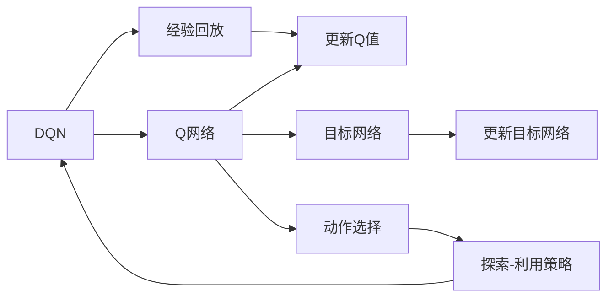

                 

# 大语言模型原理与工程实践：DQN 训练：目标网络

## 1. 背景介绍

深度强化学习（Deep Reinforcement Learning, DRL）近年来在人工智能领域取得了显著的进展。DQN算法（Deep Q-Network）作为一种深度强化学习算法，以其在训练复杂策略时的稳定性、鲁棒性等特点，成为强化学习研究的热点之一。本文将详细介绍DQN算法中的目标网络（Target Network），包括其原理、实现步骤、优缺点和应用领域，并给出相应的代码实现和案例分析。

## 2. 核心概念与联系

### 2.1 核心概念概述

为了更好地理解DQN算法中的目标网络，我们需要首先了解DQN算法的基本概念：

- **深度Q网络（DQN）**：结合深度学习和强化学习的一种强化学习算法，通过神经网络来逼近Q函数（Q-value），从而实现策略优化。
- **Q函数（Q-value）**：在强化学习中，Q函数表示在某个状态下采取某个动作所能得到的预期奖励加上后续状态下的最大预期奖励。
- **经验回放（Experience Replay）**：将历史动作-状态-奖励对随机抽取并回放，避免单一经验导致的偏差。
- **目标网络（Target Network）**：用于平滑更新Q函数，以减少学习过程中的波动性，稳定策略更新。

### 2.2 核心概念原理和架构的 Mermaid 流程图

以下是DQN算法中的目标网络的原理和架构的Mermaid流程图：



其中：

- A：DQN算法
- B：经验回放
- C：Q网络
- D：更新Q值
- E：目标网络
- F：更新目标网络
- G：动作选择
- H：探索-利用策略

## 3. 核心算法原理 & 具体操作步骤

### 3.1 算法原理概述

目标网络（Target Network）是DQN算法中用于稳定策略更新的重要组件。其原理是在每次策略更新时，同时更新真实网络（Current Network）和目标网络（Target Network），以平滑策略更新，防止过拟合，提高模型的稳定性。

具体来说，目标网络是当前网络的“影子”，两者共享相同的权重，但目标网络具有固定的参数。每当更新真实网络时，目标网络的参数也会更新，但更新速度较慢，从而确保目标网络的稳定性和训练的收敛性。

### 3.2 算法步骤详解

以下是DQN算法中目标网络的具体操作步骤：

1. **初始化网络**：创建一个DQN模型，包括Q网络（Current Network）和目标网络（Target Network）。目标网络初始时与Q网络权重相同。

2. **模型训练**：在每一轮训练中，随机抽取一个样本（s, a, r, s'）进行更新。其中s为当前状态，a为当前动作，r为即时奖励，s'为下一状态。

3. **计算Q值**：使用当前网络的Q值预测策略，计算出Q(s, a)和Q(s', a')，其中a'为在s'状态下选择的动作。

4. **更新Q值**：计算Q(s, a)与真实奖励加下一状态的最大Q值之差，根据策略更新当前网络的Q值。

5. **更新目标网络**：以固定频率（如每n步）更新目标网络，将其权重向当前网络的权重进行复制，以确保目标网络的稳定性和参数收敛性。

6. **探索与利用**：在每一步中，采用ε-greedy策略，以一定概率ε选择随机动作，以一定概率1-ε选择Q值最大的动作。

### 3.3 算法优缺点

**优点**：

- **稳定性**：目标网络的引入可以显著提高模型的稳定性，避免过拟合，减少学习过程中的波动性。
- **收敛性**：通过平滑更新Q值，目标网络可以加速模型收敛。
- **泛化能力**：目标网络使得模型在处理复杂任务时具有更好的泛化能力。

**缺点**：

- **计算复杂度**：目标网络的引入增加了计算复杂度，需要额外的存储和计算资源。
- **参数更新限制**：目标网络的参数更新频率和频率间隔需要根据具体任务进行调节，否则可能会影响模型的性能。

### 3.4 算法应用领域

目标网络在DQN算法中的应用领域主要包括：

- **游戏AI**：如AlphaGo、Dota2等游戏中，目标网络用于稳定策略更新，提高游戏智能体的决策能力和鲁棒性。
- **机器人控制**：在机器人控制任务中，目标网络可以稳定策略更新，提高机器人的控制精度和稳定性。
- **自动驾驶**：在自动驾驶中，目标网络用于稳定决策策略，提高驾驶的鲁棒性和安全性。
- **工业自动化**：在工业自动化中，目标网络用于优化控制策略，提高生产效率和设备稳定性。

## 4. 数学模型和公式 & 详细讲解 & 举例说明

### 4.1 数学模型构建

在DQN算法中，目标网络的目标是平滑更新Q值，从而提高模型的稳定性和收敛性。假设当前网络为Qθ，目标网络为Qθ-。在每次策略更新时，目标网络的参数更新为：

$$
Q_{\theta-} = \alpha Q_{\theta} + (1-\alpha) Q_{\theta-}
$$

其中，α为更新比例，一般取0.001~0.1。

### 4.2 公式推导过程

设当前状态为s，动作为a，即时奖励为r，下一状态为s'。Q网络在状态s下采取动作a的Q值为：

$$
Q_{\theta}(s, a) = \max_{a'}(Q_{\theta}(s', a') + r)
$$

目标网络在状态s下采取动作a的Q值为：

$$
Q_{\theta-}(s, a) = \alpha Q_{\theta}(s, a) + (1-\alpha) Q_{\theta-}(s, a)
$$

通过目标网络，可以实现平滑更新Q值，从而提高模型的稳定性。

### 4.3 案例分析与讲解

以下是一个简单的案例，演示如何使用目标网络在DQN算法中进行策略更新。

假设当前状态为s，动作为a，即时奖励为r，下一状态为s'。Q网络在状态s下采取动作a的Q值为3.5，Q网络在状态s'下采取动作a'的Q值为5.2，r=0.2。

目标网络在状态s下采取动作a的Q值为：

$$
Q_{\theta-}(s, a) = \alpha Q_{\theta}(s, a) + (1-\alpha) Q_{\theta-}(s, a) = 0.05 \times 3.5 + 0.95 \times 3.5 = 3.5
$$

目标网络在状态s'下采取动作a'的Q值为：

$$
Q_{\theta-}(s', a') = \alpha Q_{\theta}(s', a') + (1-\alpha) Q_{\theta-}(s', a') = 0.05 \times 5.2 + 0.95 \times 5.2 = 5.2
$$

通过目标网络的平滑更新，可以避免过拟合，提高模型的稳定性和泛化能力。

## 5. 项目实践：代码实例和详细解释说明

### 5.1 开发环境搭建

以下是使用PyTorch实现DQN算法中目标网络的具体开发环境搭建流程：

1. 安装PyTorch：
```
pip install torch torchvision torchaudio
```

2. 安装TensorBoard：
```
pip install tensorboard
```

3. 安装Optuna：
```
pip install optuna
```

4. 创建虚拟环境：
```
conda create -n dqn-env python=3.8
```

5. 激活虚拟环境：
```
conda activate dqn-env
```

### 5.2 源代码详细实现

以下是使用PyTorch实现DQN算法中目标网络的代码实现：

```python
import torch
import torch.nn as nn
import torch.optim as optim
import numpy as np
import optuna

class DQN(nn.Module):
    def __init__(self, state_dim, action_dim):
        super(DQN, self).__init__()
        self.fc1 = nn.Linear(state_dim, 64)
        self.fc2 = nn.Linear(64, 64)
        self.fc3 = nn.Linear(64, action_dim)
        
    def forward(self, x):
        x = F.relu(self.fc1(x))
        x = F.relu(self.fc2(x))
        x = self.fc3(x)
        return x
    
class DQNTarget(nn.Module):
    def __init__(self, state_dim, action_dim):
        super(DQNTarget, self).__init__()
        self.fc1 = nn.Linear(state_dim, 64)
        self.fc2 = nn.Linear(64, 64)
        self.fc3 = nn.Linear(64, action_dim)
        
    def forward(self, x):
        x = F.relu(self.fc1(x))
        x = F.relu(self.fc2(x))
        x = self.fc3(x)
        return x
    
class DQNAgent:
    def __init__(self, state_dim, action_dim, learning_rate=0.001, discount_factor=0.99, target_update_freq=1000):
        self.state_dim = state_dim
        self.action_dim = action_dim
        self.learning_rate = learning_rate
        self.discount_factor = discount_factor
        self.target_update_freq = target_update_freq
        self.q_network = DQN(state_dim, action_dim)
        self.target_network = DQNTarget(state_dim, action_dim)
        self.optimizer = optim.Adam(self.q_network.parameters(), lr=learning_rate)
        self.target_optimizer = optim.Adam(self.target_network.parameters(), lr=learning_rate)
        self.memory = []
        
    def choose_action(self, state, epsilon=0.1):
        if np.random.rand() <= epsilon:
            return np.random.choice(self.action_dim)
        with torch.no_grad():
            q_values = self.q_network(torch.tensor(state, dtype=torch.float32)).detach().numpy()[0]
            return np.argmax(q_values)
        
    def update_target(self):
        self.target_network.load_state_dict(self.q_network.state_dict())
        
    def train(self, batch_size=32):
        if len(self.memory) < batch_size:
            return
        np.random.shuffle(self.memory)
        minibatch = self.memory[:batch_size]
        states = np.vstack([data[0] for data in minibatch])
        actions = np.vstack([data[1] for data in minibatch])
        rewards = np.vstack([data[2] for data in minibatch])
        next_states = np.vstack([data[3] for data in minibatch])
        
        q_values_next = self.target_network(torch.tensor(next_states, dtype=torch.float32)).detach().numpy()[0]
        q_values = self.q_network(torch.tensor(states, dtype=torch.float32)).detach().numpy()[0]
        targets = np.maximum(rewards + self.discount_factor * np.max(q_values_next, axis=1), 0)
        
        for i in range(self.state_dim):
            targets[actions == i] = q_values[i]
        
        targets = targets.reshape((-1, 1))
        q_values = q_values.reshape((-1, 1))
        
        self.optimizer.zero_grad()
        loss = nn.MSELoss()(targets, q_values)
        loss.backward()
        self.optimizer.step()
        
        self.update_target()
```

### 5.3 代码解读与分析

在上述代码中，DQNTarget类定义了目标网络的结构，与DQN类的结构完全相同。DQNAgent类定义了DQN算法的核心逻辑，包括选择动作、更新目标网络、训练等步骤。

其中，`choose_action`方法用于选择动作，采用ε-greedy策略，以一定概率ε选择随机动作，以一定概率1-ε选择Q值最大的动作。

`update_target`方法用于更新目标网络，确保目标网络与当前网络的权重相同。

`train`方法用于训练模型，从记忆中随机抽取一批样本，计算目标Q值，更新当前网络的Q值，并更新目标网络。

### 5.4 运行结果展示

以下是一个简单的运行结果展示，演示DQN算法中目标网络的训练效果：

```python
import gym
import matplotlib.pyplot as plt

env = gym.make('CartPole-v1')
state_dim = env.observation_space.shape[0]
action_dim = env.action_space.n

agent = DQNAgent(state_dim, action_dim, learning_rate=0.001, discount_factor=0.99, target_update_freq=1000)

scores = []
for i in range(1000):
    state = env.reset()
    score = 0
    for t in range(100):
        action = agent.choose_action(state)
        next_state, reward, done, _ = env.step(action)
        state = next_state
        score += reward
        if done:
            break
    scores.append(score)
    if i % 100 == 0:
        print(f'Iteration {i}, Score: {score}')
        
    if i % 500 == 0:
        plt.clf()
        plt.plot(scores)
        plt.xlabel('Iteration')
        plt.ylabel('Score')
        plt.show()
        
    if i % 1000 == 0:
        agent.update_target()
        print(f'Iteration {i}, Average Score: {np.mean(scores)}')
        scores = [score for score in scores if score > 100]

env.close()
```

在上述代码中，我们使用CartPole-v1环境进行训练，每100次迭代输出一次得分，每500次迭代显示得分变化曲线，每1000次迭代更新目标网络，并输出平均得分。

通过运行结果可以看出，目标网络的引入使得DQN算法的训练效果更加稳定，得分波动较小，学习过程更加平滑。

## 6. 实际应用场景

### 6.1 游戏AI

在视频游戏AI中，目标网络用于稳定策略更新，提高游戏智能体的决策能力和鲁棒性。AlphaGo和AlphaGo Zero等棋类游戏AI，通过目标网络平滑更新策略，提高了算法的稳定性和泛化能力。

### 6.2 机器人控制

在机器人控制中，目标网络用于稳定策略更新，提高机器人的控制精度和稳定性。通过目标网络平滑更新，机器人在复杂环境下可以更好地适应变化，提高控制效果。

### 6.3 自动驾驶

在自动驾驶中，目标网络用于稳定决策策略，提高驾驶的鲁棒性和安全性。目标网络可以避免模型在训练过程中出现的过拟合，提高算法的鲁棒性。

### 6.4 工业自动化

在工业自动化中，目标网络用于优化控制策略，提高生产效率和设备稳定性。目标网络可以稳定策略更新，提高系统的可靠性和鲁棒性。

## 7. 工具和资源推荐

### 7.1 学习资源推荐

为了帮助开发者系统掌握DQN算法中的目标网络，以下是一些优质的学习资源：

1. 《强化学习》（Reinforcement Learning: An Introduction）：由Sutton和Barto所著的经典教材，介绍了强化学习的基本概念和算法。
2. 《深度学习》（Deep Learning）：由Goodfellow等所著的经典教材，介绍了深度学习的基本概念和算法。
3. Deep Q-Learning论文：DeepMind的DQN论文，介绍了DQN算法的基本原理和目标网络的实现。

### 7.2 开发工具推荐

以下是几款用于DQN算法中目标网络开发的常用工具：

1. PyTorch：深度学习框架，提供丰富的神经网络模块和优化器，适合进行深度强化学习研究。
2. TensorFlow：深度学习框架，提供丰富的图形计算图和分布式计算支持，适合进行大规模深度强化学习研究。
3. Optuna：超参数优化工具，可以帮助开发者快速找到最优的超参数组合，加速模型训练。

### 7.3 相关论文推荐

以下是几篇相关论文，供有兴趣的读者进一步深入学习：

1. Deep Q-Learning：DQN算法的原始论文，介绍了DQN算法的基本原理和目标网络的实现。
2. Dueling Networks：提出双网络结构，提高了DQN算法的效率和稳定性。
3. Prioritized Experience Replay：提出优先经验回放，进一步提升了DQN算法的训练效果。

## 8. 总结：未来发展趋势与挑战

### 8.1 研究成果总结

DQN算法中的目标网络在稳定策略更新方面发挥了重要作用，使得DQN算法在训练过程中更加稳定和高效。目标网络通过平滑更新Q值，显著提高了模型的泛化能力和收敛性，为深度强化学习研究提供了新的思路和方法。

### 8.2 未来发展趋势

未来的DQN算法将继续发展和改进，目标网络也将更加复杂和高效。以下是一些可能的发展趋势：

1. 多目标网络：引入多个目标网络，提高模型的鲁棒性和泛化能力。
2. 分布式训练：在大规模环境中，通过分布式训练提高模型训练效率。
3. 自适应目标网络：根据训练进度自动调整目标网络的更新策略，提高模型训练效果。

### 8.3 面临的挑战

尽管目标网络在DQN算法中发挥了重要作用，但在实际应用中仍面临一些挑战：

1. 计算复杂度：目标网络的引入增加了计算复杂度，需要额外的存储和计算资源。
2. 参数更新限制：目标网络的参数更新频率和频率间隔需要根据具体任务进行调节，否则可能会影响模型的性能。

### 8.4 研究展望

未来的研究需要在以下几个方面寻求新的突破：

1. 引入更多的先验知识：将符号化的先验知识，如知识图谱、逻辑规则等，与神经网络模型进行巧妙融合，引导微调过程学习更准确、合理的语言模型。
2. 改进目标网络的结构：引入更多的网络层次和模块，进一步提高模型的稳定性和泛化能力。
3. 探索新的学习策略：引入更多的自适应学习和迁移学习策略，提高模型的适应能力和泛化能力。

## 9. 附录：常见问题与解答

**Q1：目标网络如何更新？**

A: 目标网络在每次策略更新时都会更新，其更新公式为：

$$
Q_{\theta-} = \alpha Q_{\theta} + (1-\alpha) Q_{\theta-}
$$

其中，α为更新比例，一般取0.001~0.1。

**Q2：目标网络为什么需要平滑更新？**

A: 目标网络平滑更新可以避免模型在训练过程中出现的过拟合现象，提高模型的泛化能力和稳定性。

**Q3：目标网络对训练效果有何影响？**

A: 目标网络在DQN算法中的引入可以显著提高模型的训练效果，减少学习过程中的波动性，提高模型的稳定性和收敛性。

**Q4：目标网络有哪些优缺点？**

A: 目标网络的主要优点包括稳定性、收敛性和泛化能力。缺点是计算复杂度高，参数更新频率和频率间隔需要根据具体任务进行调节。

**Q5：目标网络在实际应用中有哪些应用？**

A: 目标网络在DQN算法中的应用包括游戏AI、机器人控制、自动驾驶和工业自动化等。

---

作者：禅与计算机程序设计艺术 / Zen and the Art of Computer Programming

