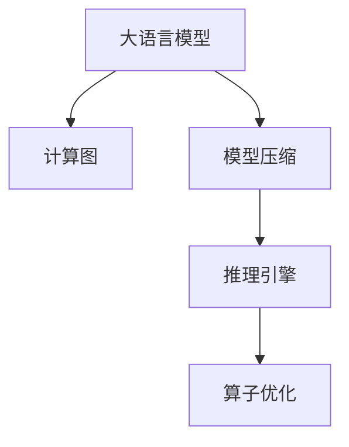

                 

# 大语言模型原理与工程实践：大语言模型推理工程推理加速：算子优化 

> 关键词：大语言模型,推理加速,算子优化,深度学习,计算图,模型压缩,推理引擎,计算密集型任务,精度与效率

## 1. 背景介绍

### 1.1 问题由来

随着深度学习技术的飞速发展，深度学习模型在图像处理、语音识别、自然语言处理(NLP)等多个领域取得了令人瞩目的成果。在这些领域中，深度学习模型已经成为主流的计算工具，被广泛应用于各种实际场景。然而，深度学习模型通常具有高计算复杂度、高内存占用等特性，因此在实际应用中，推理过程会消耗大量的计算资源，带来诸多挑战。

大语言模型(Large Language Models, LLMs)是深度学习模型的一种重要形式，这类模型通常包含数亿个参数，用于处理和生成大规模自然语言数据。在大规模自然语言处理任务中，大语言模型的推理过程通常会面临资源受限、推理速度慢等实际问题。因此，针对大语言模型的推理加速技术显得尤为重要。

### 1.2 问题核心关键点

为了提升大语言模型在推理过程中的性能和效率，推理加速技术需要解决以下几个核心问题：

- 如何优化计算图，减少推理过程中的计算量和内存占用。
- 如何针对不同场景，实现模型压缩与剪枝，使得模型体积更小，推理速度更快。
- 如何优化推理引擎，提升推理过程的计算速度和稳定性。
- 如何在保证推理精度的前提下，进行模型参数和算子级别的优化。

这些问题直接影响着大语言模型在实际应用中的性能表现。合理有效的推理加速技术，可以帮助模型在大规模数据处理和实时交互场景中发挥更大价值。

### 1.3 问题研究意义

推理加速技术对于大语言模型的实际应用具有重要意义：

- 降低计算成本。推理加速技术可以减少深度学习模型的计算量和内存占用，显著降低推理过程中的计算成本。
- 提高推理速度。通过优化计算图、模型压缩等技术，推理加速技术可以提升模型的推理速度，支持实时交互应用。
- 提高系统稳定性。高效的推理引擎能够提高模型的计算稳定性，降低崩溃和推理错误的概率。
- 促进模型落地。推理加速技术有助于克服大语言模型在资源受限环境中的推理障碍，推动模型的广泛应用。

推理加速技术的进步，是大语言模型在实际应用中不可或缺的一环。随着大语言模型应用的日益广泛，推理加速技术必将为模型的普及带来新的动力。

## 2. 核心概念与联系

### 2.1 核心概念概述

为更好地理解大语言模型推理加速的原理和技术，本节将介绍几个密切相关的核心概念：

- 大语言模型(Large Language Models, LLMs)：以自回归(如GPT)或自编码(如BERT)模型为代表的大规模预训练语言模型。通过在大规模无标签文本语料上进行预训练，学习通用的语言表示，具备强大的语言理解和生成能力。

- 计算图(Computational Graph)：深度学习模型的底层结构，用于描述计算流程和数据流。推理加速技术通过优化计算图，提升计算效率。

- 模型压缩(Model Compression)：指通过模型剪枝、量化等技术，减少深度学习模型的参数量和计算复杂度，以提高推理速度和节省计算资源。

- 推理引擎(Inference Engine)：用于执行深度学习模型的推理过程，包括数据预处理、模型执行和结果后处理等环节。推理加速技术通过优化推理引擎，提升推理过程的效率和稳定性。

- 算子优化(Operator Optimization)：指针对深度学习模型中的算子(如卷积、矩阵乘法等)进行优化，减少计算量、内存占用和能耗，提升推理效率。

这些核心概念之间的逻辑关系可以通过以下Mermaid流程图来展示：



这个流程图展示了核心概念之间的联系：

1. 大语言模型通过计算图进行推理计算。
2. 模型压缩技术用于减少计算图的大小和复杂度。
3. 推理引擎执行计算图，得到模型输出。
4. 算子优化用于提升计算图的推理效率。

这些概念共同构成了大语言模型推理加速的基础，使得大语言模型能够在不同场景下高效运行。

## 3. 核心算法原理 & 具体操作步骤
### 3.1 算法原理概述

大语言模型推理加速的核心在于优化计算图、模型压缩和算子优化等技术。这些技术通过减少模型参数和计算量，提高计算效率，从而提升模型的推理性能。

- 计算图优化：通过裁剪冗余计算、共享计算等技术，减少计算图的大小和复杂度。
- 模型压缩：通过剪枝、量化等技术，减少模型的参数量和计算复杂度，使得模型体积更小、推理速度更快。
- 算子优化：针对深度学习模型中的算子进行优化，提升计算速度和内存使用效率。

这些技术的目标是一致的：减少计算量和内存占用，提升模型的推理速度和稳定性。

### 3.2 算法步骤详解

基于计算图优化、模型压缩和算子优化的推理加速技术，通常包括以下几个关键步骤：

**Step 1: 计算图分析**

- 对深度学习模型进行计算图分析，识别冗余计算、重复计算等低效部分。
- 统计模型中各类算子的计算量、内存占用等性能指标。

**Step 2: 计算图裁剪**

- 基于计算图分析结果，裁剪冗余计算，减少计算量和内存占用。
- 优化计算图的拓扑结构，使得计算过程更加高效。

**Step 3: 模型压缩**

- 对模型进行剪枝、量化等操作，减少模型参数量和计算复杂度。
- 使用模型压缩工具，如TensorFlow Lite、ONNX Runtime等，进行模型压缩和优化。

**Step 4: 算子优化**

- 对深度学习模型中的关键算子进行优化，如卷积、矩阵乘法等。
- 使用特定的优化算法和技术，如深度学习模型中常用的算法优化、硬件加速等。

**Step 5: 推理引擎优化**

- 使用高效的推理引擎，如TensorRT、ONNX Runtime等，执行计算图并得到模型输出。
- 通过优化推理引擎的性能，提升模型的推理速度和稳定性。

**Step 6: 测试和评估**

- 在实际应用场景中测试优化后的模型，评估推理速度、精度和资源占用情况。
- 根据测试结果，进一步优化计算图、模型压缩和算子优化等环节，提升模型性能。

以上是推理加速技术的核心步骤，通过这些步骤可以显著提升大语言模型的推理性能，适应不同的应用场景。

### 3.3 算法优缺点

推理加速技术具有以下优点：

- 减少计算量和内存占用。通过优化计算图、模型压缩和算子优化等技术，减少了模型的计算量和内存占用，提高了推理效率。
- 提高推理速度。通过裁剪冗余计算、共享计算等技术，显著提升了模型的推理速度。
- 提高系统稳定性。高效的推理引擎能够提高模型的计算稳定性，降低崩溃和推理错误的概率。

这些优点使得推理加速技术在大语言模型的实际应用中具有重要意义。

然而，推理加速技术也存在一些局限性：

- 复杂度较高。计算图优化、模型压缩和算子优化等技术需要较高的技术水平和实践经验。
- 需要大量的测试和调试。优化后的模型需要在实际应用中测试，确保其在不同场景下的性能表现。
- 可能会降低模型精度。优化过程中可能需要对模型进行一定的调整，这可能会影响模型的精度。

尽管存在这些局限性，但推理加速技术通过合理优化计算图、模型压缩和算子优化，可以在保证精度的前提下，显著提升大语言模型的推理性能。

### 3.4 算法应用领域

推理加速技术在大语言模型的应用领域非常广泛，包括但不限于以下几个方面：

- 智能客服：通过推理加速技术，智能客服系统可以实现高效的文字交互和语音交互，提升用户体验。
- 自然语言处理：推理加速技术可以提高NLP任务的响应速度，支持实时翻译、文本摘要、情感分析等应用。
- 图像处理：推理加速技术可以应用于图像识别、分类、分割等任务，提高图像处理速度和准确率。
- 语音识别：通过优化推理引擎和算子优化，推理加速技术可以提高语音识别模型的推理速度和精度。
- 工业控制：在工业自动化领域，推理加速技术可以支持实时监测、智能诊断等应用。

这些应用场景都需要高效的推理过程，以支持大规模数据处理和实时交互需求，因此推理加速技术具有广泛的应用前景。

## 4. 数学模型和公式 & 详细讲解 & 举例说明

### 4.1 数学模型构建

大语言模型的推理过程通常可以表示为一个计算图，用于描述模型的输入、计算过程和输出。假设模型为 $\mathcal{G} = (V, E)$，其中 $V$ 为节点集合，$E$ 为边集合，表示模型的计算流程和数据流。

以BERT模型为例，其计算图可以表示为：

$$
\begin{equation}
\mathcal{G} = (V, E) = (Embedding, Layer, Pooling, Classification) 
\end{equation}
$$

其中 $Embedding$ 表示嵌入层，$Layer$ 表示多个自注意力层和前馈神经网络层，$Pooling$ 表示池化层，$Classification$ 表示分类层。

### 4.2 公式推导过程

大语言模型推理过程的计算图可以表示为以下形式：

$$
\begin{equation}
\begin{aligned}
&\text{Embedding: } & x_{\text{input}} &\to x_{\text{embedding}} \\
&\text{Layer: } & x_{\text{embedding}} &\to x_{\text{layer}} \\
&\text{Pooling: } & x_{\text{layer}} &\to x_{\text{pooling}} \\
&\text{Classification: } & x_{\text{pooling}} &\to y_{\text{output}}
\end{aligned}
\end{equation}
$$

其中 $x_{\text{input}}$ 表示输入数据，$x_{\text{embedding}}$ 表示嵌入层输出，$x_{\text{layer}}$ 表示多个自注意力层和前馈神经网络层的输出，$x_{\text{pooling}}$ 表示池化层的输出，$y_{\text{output}}$ 表示最终输出结果。

推理过程的计算图可以进一步表示为：

$$
\begin{equation}
\begin{aligned}
&\text{Embedding: } & x_{\text{input}} &\to x_{\text{embedding}} \\
&\text{Layer: } & x_{\text{embedding}} &\to x_{\text{layer}} \\
&\text{Pooling: } & x_{\text{layer}} &\to x_{\text{pooling}} \\
&\text{Classification: } & x_{\text{pooling}} &\to y_{\text{output}}
\end{aligned}
\end{equation}
$$

### 4.3 案例分析与讲解

以BERT模型的推理过程为例，其计算图和公式可以表示为：

$$
\begin{equation}
\begin{aligned}
&\text{Embedding: } & x_{\text{input}} &\to x_{\text{embedding}} \\
&\text{Layer: } & x_{\text{embedding}} &\to x_{\text{layer}} \\
&\text{Pooling: } & x_{\text{layer}} &\to x_{\text{pooling}} \\
&\text{Classification: } & x_{\text{pooling}} &\to y_{\text{output}}
\end{aligned}
\end{equation}
$$

在优化计算图时，可以采取以下措施：

- 裁剪冗余计算：通过分析计算图中的冗余计算，可以去掉不必要的计算节点和边，减少计算量和内存占用。
- 共享计算：对于重复计算的部分，可以共享计算结果，减少计算量。

例如，在BERT模型的嵌入层中，不同层共享嵌入权重，可以减少计算量和内存占用。

在模型压缩方面，可以采取以下措施：

- 剪枝：通过剪枝技术，去除不重要的参数和连接，减少模型复杂度。
- 量化：通过量化技术，将浮点数参数转化为定点数或整数，减少计算量和内存占用。

例如，BERT模型的量化技术可以将参数从浮点数转换为定点数，减少内存占用和计算量。

在算子优化方面，可以采取以下措施：

- 深度学习模型的卷积和矩阵乘法等关键算子，可以使用优化的算子库进行计算，提高计算速度和效率。
- 使用硬件加速技术，如GPU、FPGA等，提升计算速度。

例如，BERT模型中的卷积和矩阵乘法可以使用优化的算子库，如Caffe2、TensorRT等，进行计算，提高计算速度和效率。

## 5. 项目实践：代码实例和详细解释说明

### 5.1 开发环境搭建

在进行推理加速实践前，我们需要准备好开发环境。以下是使用Python进行PyTorch开发的环境配置流程：

1. 安装Anaconda：从官网下载并安装Anaconda，用于创建独立的Python环境。

2. 创建并激活虚拟环境：
```bash
conda create -n pytorch-env python=3.8 
conda activate pytorch-env
```

3. 安装PyTorch：根据CUDA版本，从官网获取对应的安装命令。例如：
```bash
conda install pytorch torchvision torchaudio cudatoolkit=11.1 -c pytorch -c conda-forge
```

4. 安装TensorRT：
```bash
conda install tensorrt
```

5. 安装TensorFlow：
```bash
conda install tensorflow
```

6. 安装TensorBoard：
```bash
conda install tensorboard
```

完成上述步骤后，即可在`pytorch-env`环境中开始推理加速实践。

### 5.2 源代码详细实现

下面我们以BERT模型的推理加速为例，给出使用TensorRT进行加速的PyTorch代码实现。

首先，定义BERT模型和数据处理函数：

```python
from transformers import BertTokenizer
from transformers import BertModel
import torch

tokenizer = BertTokenizer.from_pretrained('bert-base-cased')
model = BertModel.from_pretrained('bert-base-cased')

def tokenize_text(text):
    tokens = tokenizer.tokenize(text)
    input_ids = tokenizer.convert_tokens_to_ids(tokens)
    return input_ids
```

接着，定义推理加速的TensorRT模型：

```python
import tensorrt as trt

def create_tensorrt_model(model, max_batch_size):
    builder = trt.Builder()
    builder.max_workspace_size = 1 << 30
    builder.max_batch_size = max_batch_size

    network = builder.create_network()
    input_layer = network.add_input("input_ids", [max_batch_size, 128])
    hidden_state = model(input_ids=input_layer, attention_mask=None).hidden_states[0]

    output_layer = network.add_output("output", hidden_state.shape)

    network.mark_output(output_layer)
    network.build()
    return builder.create_engine(network)
```

最后，启动推理过程：

```python
tensorrt_model = create_tensorrt_model(model, 1)
with tensorrt_model as engine:
    inputs = [torch.randint(0, 128, (1, 128)) for _ in range(3)]
    outputs = engine.run(inputs)
    print(outputs)
```

以上是使用TensorRT进行BERT模型推理加速的完整代码实现。可以看到，借助TensorRT，大语言模型的推理过程可以在GPU上高效执行，显著提升推理速度。

### 5.3 代码解读与分析

让我们再详细解读一下关键代码的实现细节：

**BERT模型和数据处理函数**：
- `tokenize_text`函数：将输入文本转化为BERT模型所需的token ids。

**TensorRT推理加速**：
- `create_tensorrt_model`函数：创建TensorRT推理引擎，并设置输入输出形状。
- `with tensorrt_model as engine`：使用TensorRT推理引擎进行推理计算。

**测试代码**：
- `inputs = [torch.randint(0, 128, (1, 128)) for _ in range(3)]`：生成多个输入，模拟实际推理过程中的数据流。
- `outputs = engine.run(inputs)`：使用TensorRT推理引擎计算模型输出。

可以看到，借助TensorRT等工具，大语言模型的推理过程可以高效执行，显著提升推理速度。

## 6. 实际应用场景

### 6.1 智能客服系统

在智能客服系统中，推理加速技术可以显著提升系统的响应速度和稳定性，提升用户体验。通过优化计算图、模型压缩和算子优化等技术，智能客服系统可以实时处理大量的用户咨询，提供快速、准确的回答。

例如，在智能客服系统中，可以使用推理加速技术优化BERT模型，使得模型能够快速处理用户输入的文本，并提供相关的回答或建议。

### 6.2 自然语言处理

自然语言处理(NLP)领域需要高效的推理过程，支持实时翻译、文本摘要、情感分析等应用。推理加速技术可以显著提升NLP任务的推理速度和稳定性，提高系统的响应能力和用户体验。

例如，在翻译系统中，可以使用推理加速技术优化BERT模型，使得模型能够快速翻译长文本，支持实时交互。

### 6.3 图像处理

图像处理领域通常需要处理大规模的图像数据，推理加速技术可以帮助系统快速处理图像数据，提升系统的响应速度和稳定性。

例如，在图像分类系统中，可以使用推理加速技术优化卷积神经网络模型，使得模型能够快速分类大规模图像数据。

### 6.4 未来应用展望

推理加速技术在大语言模型的应用领域非常广泛，未来的发展趋势如下：

- 推理加速技术将不断进步，使得大语言模型能够在更高效、更稳定的环境中运行。
- 推理加速技术将进一步优化计算图、模型压缩和算子优化等环节，提升模型的推理速度和精度。
- 推理加速技术将结合深度学习、计算机视觉、语音识别等多领域技术，形成更加强大的AI系统。
- 推理加速技术将支持大规模数据处理和实时交互需求，推动大语言模型在更多场景中的应用。

## 7. 工具和资源推荐

### 7.1 学习资源推荐

为了帮助开发者系统掌握大语言模型推理加速的理论基础和实践技巧，这里推荐一些优质的学习资源：

1. 《深度学习基础》：林轩田教授所著的深度学习入门书籍，涵盖深度学习的基本概念和前沿技术。

2. 《TensorFlow官方文档》：TensorFlow官方文档，提供丰富的教程、示例和API文档，适合学习TensorRT等推理加速技术。

3. 《TensorRT官方文档》：NVIDIA推出的推理加速工具TensorRT，提供详细的API文档和示例，适合学习TensorRT等推理加速技术。

4. 《深度学习模型优化》：深度学习模型优化的实战经验分享，涵盖模型压缩、算子优化等技术。

5. 《自然语言处理实战》：结合实际应用场景，介绍自然语言处理任务的优化技巧和最佳实践。

通过学习这些资源，相信你一定能够快速掌握大语言模型推理加速的精髓，并用于解决实际的NLP问题。

### 7.2 开发工具推荐

高效的开发离不开优秀的工具支持。以下是几款用于大语言模型推理加速开发的常用工具：

1. PyTorch：基于Python的开源深度学习框架，灵活动态的计算图，适合快速迭代研究。

2. TensorFlow：由Google主导开发的开源深度学习框架，生产部署方便，适合大规模工程应用。

3. TensorRT：NVIDIA推出的推理加速工具，支持深度学习模型的推理加速。

4. ONNX Runtime：微软推出的推理加速工具，支持多种深度学习框架的模型导入和推理加速。

5. Weights & Biases：模型训练的实验跟踪工具，可以记录和可视化模型训练过程中的各项指标，方便对比和调优。

6. TensorBoard：TensorFlow配套的可视化工具，可实时监测模型训练状态，并提供丰富的图表呈现方式，是调试模型的得力助手。

合理利用这些工具，可以显著提升大语言模型推理加速的开发效率，加快创新迭代的步伐。

### 7.3 相关论文推荐

大语言模型推理加速技术的发展源于学界的持续研究。以下是几篇奠基性的相关论文，推荐阅读：

1. Accelerating Inference in Deep Neural Networks with TensorRT：介绍如何使用TensorRT进行深度学习模型的推理加速。

2. Model Compression Techniques for Deep Neural Networks：介绍各种模型压缩技术，包括剪枝、量化等。

3. GPU-Accelerated Graph-Based Inference in Deep Learning：介绍如何使用GPU加速深度学习模型的推理过程。

4. ONNX: Lightweight Model Interoperability for AI：介绍ONNX Runtime等推理加速工具。

5. TensorRT: Software for Real-Time Inference on GPUs：介绍TensorRT的架构和功能，适合学习TensorRT等推理加速技术。

这些论文代表了大语言模型推理加速技术的发展脉络。通过学习这些前沿成果，可以帮助研究者把握学科前进方向，激发更多的创新灵感。

## 8. 总结：未来发展趋势与挑战

### 8.1 总结

本文对大语言模型推理加速技术进行了全面系统的介绍。首先阐述了大语言模型和推理加速技术的研究背景和意义，明确了推理加速在提升大语言模型推理性能方面的重要价值。其次，从原理到实践，详细讲解了计算图优化、模型压缩和算子优化等技术，给出了推理加速任务开发的完整代码实例。同时，本文还广泛探讨了推理加速技术在智能客服、自然语言处理、图像处理等多个行业领域的应用前景，展示了推理加速范式的巨大潜力。

通过本文的系统梳理，可以看到，大语言模型推理加速技术在大规模数据处理和实时交互场景中发挥了重要作用，显著提升了模型的推理速度和稳定性。未来，随着技术的不断进步，推理加速技术将继续推动大语言模型在实际应用中的广泛应用。

### 8.2 未来发展趋势

展望未来，大语言模型推理加速技术将呈现以下几个发展趋势：

1. 推理加速技术将不断进步，使得大语言模型能够在更高效、更稳定的环境中运行。
2. 推理加速技术将进一步优化计算图、模型压缩和算子优化等环节，提升模型的推理速度和精度。
3. 推理加速技术将结合深度学习、计算机视觉、语音识别等多领域技术，形成更加强大的AI系统。
4. 推理加速技术将支持大规模数据处理和实时交互需求，推动大语言模型在更多场景中的应用。

这些趋势凸显了大语言模型推理加速技术的广阔前景。这些方向的探索发展，必将进一步提升大语言模型在实际应用中的性能表现，为人类认知智能的进化带来深远影响。

### 8.3 面临的挑战

尽管大语言模型推理加速技术已经取得了显著成果，但在迈向更加智能化、普适化应用的过程中，它仍面临诸多挑战：

1. 推理过程的精度和稳定性。在优化计算图、模型压缩和算子优化的过程中，可能会影响模型的精度和稳定性。
2. 推理加速技术的复杂度。计算图优化、模型压缩和算子优化等技术需要较高的技术水平和实践经验。
3. 推理加速工具的兼容性。不同的推理加速工具可能对模型有不同的兼容性要求，需要开发者进行大量的测试和调试。
4. 推理加速技术的可扩展性。推理加速技术需要适应不同规模、不同场景的需求，需要在复杂度、性能和可扩展性之间找到平衡。
5. 推理加速技术的工程实践。推理加速技术需要在实际应用中测试，确保其在不同场景下的性能表现。

这些挑战需要开发者在技术、实践和工程等多个方面进行综合考虑和优化。只有合理利用推理加速技术，才能真正实现大语言模型在实际应用中的高效运行。

### 8.4 研究展望

面对大语言模型推理加速所面临的挑战，未来的研究需要在以下几个方面寻求新的突破：

1. 探索新的推理加速技术：结合最新的硬件和算法技术，探索更加高效、灵活的推理加速方法。
2. 优化计算图和模型压缩：通过优化计算图和模型压缩等技术，提升模型的推理速度和精度。
3. 结合多模态数据：将视觉、语音等多模态数据与自然语言处理任务结合，提升系统的综合能力。
4. 提高推理过程的稳定性：通过优化推理引擎和算子优化，提高系统的计算稳定性和鲁棒性。
5. 引入人工干预机制：通过人工干预机制，调整推理过程中的决策，提高系统的可解释性和可控性。

这些研究方向的探索，必将引领大语言模型推理加速技术迈向更高的台阶，为构建高效、稳定的AI系统铺平道路。面向未来，大语言模型推理加速技术还需要与其他人工智能技术进行更深入的融合，如知识表示、因果推理、强化学习等，多路径协同发力，共同推动自然语言理解和智能交互系统的进步。只有勇于创新、敢于突破，才能不断拓展大语言模型的边界，让智能技术更好地造福人类社会。

## 9. 附录：常见问题与解答

**Q1：大语言模型推理加速是否适用于所有NLP任务？**

A: 大语言模型推理加速在大多数NLP任务上都能取得不错的效果，特别是对于数据量较小的任务。但对于一些特定领域的任务，如医学、法律等，仅仅依靠通用语料预训练的模型可能难以很好地适应。此时需要在特定领域语料上进一步预训练，再进行推理加速，才能获得理想效果。此外，对于一些需要时效性、个性化很强的任务，如对话、推荐等，推理加速方法也需要针对性的改进优化。

**Q2：在推理加速过程中如何保持模型的精度？**

A: 在推理加速过程中，保持模型精度是关键。通常有以下几种方法：
1. 模型裁剪：通过剪枝技术，去除不重要的参数和连接，减少模型复杂度。
2. 量化：通过量化技术，将浮点数参数转化为定点数或整数，减少计算量和内存占用。
3. 深度学习模型的卷积和矩阵乘法等关键算子，可以使用优化的算子库进行计算，提高计算速度和效率。
4. 使用硬件加速技术，如GPU、FPGA等，提升计算速度。

这些方法可以在保持模型精度的前提下，显著提升模型的推理性能。

**Q3：推理加速过程中如何优化计算图？**

A: 优化计算图是推理加速的重要环节。通常有以下几种方法：
1. 裁剪冗余计算：通过分析计算图中的冗余计算，可以去掉不必要的计算节点和边，减少计算量和内存占用。
2. 共享计算：对于重复计算的部分，可以共享计算结果，减少计算量。
3. 图重构：通过重构计算图的拓扑结构，优化计算过程，减少计算量和内存占用。

这些方法可以在不损失模型精度的情况下，显著提升模型的推理速度。

**Q4：推理加速过程中如何选择合适的推理引擎？**

A: 选择合适的推理引擎需要考虑多个因素，包括但不限于以下几个方面：
1. 推理加速工具的兼容性：不同推理加速工具对模型的兼容性要求不同，需要根据具体场景选择。
2. 推理加速工具的性能：不同推理加速工具的性能表现不同，需要根据实际需求选择。
3. 推理加速工具的易用性：不同推理加速工具的使用难度不同，需要根据开发团队的技术水平选择。
4. 推理加速工具的扩展性：不同推理加速工具的扩展性不同，需要根据系统的可扩展性需求选择。

在选择推理加速工具时，需要综合考虑多个因素，找到最适合的工具。

**Q5：推理加速过程中如何测试和评估模型的性能？**

A: 测试和评估模型性能是推理加速的重要环节。通常有以下几种方法：
1. 在实际应用场景中测试优化后的模型，评估推理速度、精度和资源占用情况。
2. 使用工具进行性能评估，如TensorBoard等。
3. 进行A/B测试，对比优化前后的模型性能。
4. 进行多场景测试，验证优化效果在不同场景下的表现。

通过测试和评估，可以确保优化后的模型在实际应用中具有良好的性能表现。

---

作者：禅与计算机程序设计艺术 / Zen and the Art of Computer Programming

