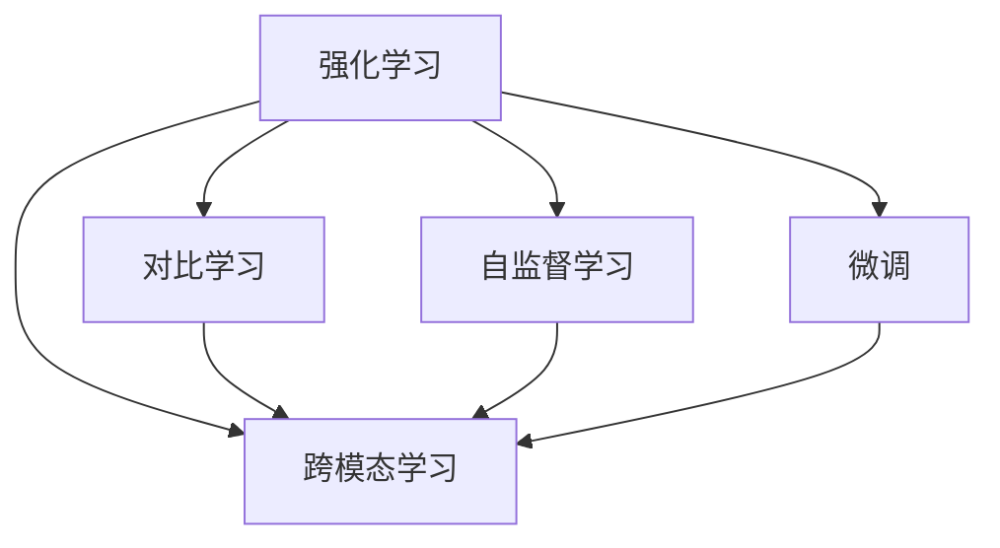

                 

# 大语言模型原理与工程实践：强化学习的目标

> 关键词：大语言模型,强化学习,自监督学习,对比学习,优化算法,微调,Fine-tuning,跨模态学习

## 1. 背景介绍

### 1.1 问题由来

近年来，大语言模型的发展和应用已经成为人工智能领域的一大热点。从基于预训练的Transformer模型到多模态的预训练技术，大语言模型已经展现出在自然语言处理、图像识别、音频处理等领域的强大能力。然而，尽管如此，大语言模型在实际应用中仍面临一些挑战，如模型泛化能力有限、无法处理未知数据等。

强化学习（Reinforcement Learning, RL）是一种从环境中学习最佳策略的算法，近年来被引入到NLP领域，以提升大语言模型的泛化能力和实际应用能力。本论文将聚焦于基于强化学习的大语言模型微调方法，通过对比学习、自监督学习等技术，对大语言模型进行优化，以实现更好的泛化能力和更广泛的适用性。

### 1.2 问题核心关键点

强化学习在大语言模型中的应用主要集中在以下几个关键点：

- **对比学习（Contrastive Learning）**：通过对比学习，大语言模型可以在大量数据上获得更好的泛化能力，而无需监督信号。
- **自监督学习（Self-Supervised Learning）**：利用自监督学习任务，如掩码语言模型（Masked Language Model, MLM）和自回归预测（Autoregressive Prediction），预训练大语言模型，以获取通用语言表示。
- **微调（Fine-tuning）**：通过微调，大语言模型可以在特定任务上实现快速适配，提升性能。
- **跨模态学习（Cross-Modal Learning）**：通过融合视觉、音频等多模态数据，大语言模型可以更好地理解和处理现实世界中的复杂信息。

以上关键点构成了大语言模型与强化学习相结合的基本框架，使得模型能够在更广泛的应用场景中实现更好的表现。

### 1.3 问题研究意义

强化学习在大语言模型中的应用研究具有重要意义：

1. **提升泛化能力**：通过对比学习、自监督学习等技术，大语言模型可以在大量无标签数据上获得更好的泛化能力，减少对标注数据的依赖。
2. **适应多样性任务**：微调技术使得大语言模型能够快速适应各种下游任务，提升模型在特定领域的性能。
3. **跨模态应用**：跨模态学习技术使得大语言模型能够融合多种数据模态，提升其对现实世界的理解和建模能力。
4. **增强鲁棒性**：通过强化学习，大语言模型能够更好地处理噪声、对抗样本等异常情况，提高模型的鲁棒性。
5. **优化算法选择**：强化学习能够提供更多优化算法选择，如基于奖励的强化学习（Reward-based RL）、基于策略的强化学习（Policy-based RL）等，以更好地适应不同的应用场景。

## 2. 核心概念与联系

### 2.1 核心概念概述

为更好地理解强化学习在大语言模型中的应用，本节将介绍几个密切相关的核心概念：

- **强化学习**：一种通过试错来学习最优策略的机器学习方法。通过在环境中的试错学习，模型不断调整策略以最大化累积奖励。
- **大语言模型**：以自回归（如GPT）或自编码（如BERT）模型为代表的大规模预训练语言模型。通过在大规模无标签文本语料上进行预训练，学习通用的语言知识和表示。
- **对比学习**：一种无监督学习方法，通过构造相似和无关的样本，训练模型以区分这两类样本，从而获得更好的泛化能力。
- **自监督学习**：利用数据本身的结构信息，如掩码语言模型（MLM），训练模型，以获取通用的语言表示。
- **微调**：在预训练模型的基础上，使用下游任务的少量标注数据，通过有监督学习优化模型在特定任务上的性能。
- **跨模态学习**：融合视觉、音频等多模态数据，提升模型对现实世界的理解和建模能力。

这些核心概念之间的逻辑关系可以通过以下Mermaid流程图来展示：



这个流程图展示了大语言模型与强化学习相结合的基本框架，使得模型能够在不同任务上实现更好的表现。

## 3. 核心算法原理 & 具体操作步骤

### 3.1 算法原理概述

基于强化学习的大语言模型微调，本质上是一个通过试错学习来优化模型策略的过程。其核心思想是：将预训练的大语言模型视作一个"智能体"，通过在特定环境中的试错学习，调整模型参数以最大化累积奖励。

形式化地，假设预训练模型为 $M_{\theta}$，其中 $\theta$ 为预训练得到的模型参数。给定下游任务 $T$ 的标注数据集 $D=\{(x_i, y_i)\}_{i=1}^N$，微调的目标是找到新的模型参数 $\hat{\theta}$，使得模型在任务 $T$ 上获得最大的累积奖励 $R(\hat{\theta})$。

具体来说，微调过程分为以下几个步骤：

1. **设计任务环境**：定义任务环境 $E$，其中包含状态空间 $S$、动作空间 $A$、状态转移函数 $P$ 和奖励函数 $R$。
2. **初始化智能体**：将预训练模型 $M_{\theta}$ 作为智能体，定义其初始策略 $π$。
3. **迭代优化**：在任务环境 $E$ 中，通过试错学习调整智能体的策略 $π$，以最大化累积奖励 $R(\hat{\theta})$。
4. **策略评估**：在任务环境 $E$ 中，评估智能体的性能，通过奖励函数 $R$ 评估智能体的表现。

### 3.2 算法步骤详解

基于强化学习的大语言模型微调一般包括以下几个关键步骤：

**Step 1: 准备预训练模型和数据集**
- 选择合适的预训练语言模型 $M_{\theta}$ 作为初始化参数，如 BERT、GPT 等。
- 准备下游任务 $T$ 的标注数据集 $D$，划分为训练集、验证集和测试集。一般要求标注数据与预训练数据的分布不要差异过大。

**Step 2: 设计任务环境**
- 定义状态空间 $S$：将输入数据 $x$ 映射为状态 $s$，状态空间可以是预训练模型的嵌入向量、注意力权重等。
- 定义动作空间 $A$：定义模型在状态 $s$ 下可能的输出动作 $a$，如生成下一个词、更新分类器等。
- 定义状态转移函数 $P$：定义状态如何随动作 $a$ 转移，如基于语言模型的自回归转移，或基于分类器的决策转移。
- 定义奖励函数 $R$：定义模型在状态 $s$ 下执行动作 $a$ 的奖励，如分类任务的交叉熵损失，生成任务的负对数似然损失等。

**Step 3: 选择优化算法**
- 选择合适的优化算法，如 Proximal Policy Optimization (PPO)、Trust Region Policy Optimization (TRPO) 等。
- 设置优化算法参数，如学习率、批量大小、迭代轮数等。

**Step 4: 执行强化学习训练**
- 将训练集数据分批次输入模型，进行状态转移和动作执行。
- 根据执行动作后的新状态和奖励，更新模型的参数 $\theta$。
- 周期性在验证集上评估模型性能，根据性能指标决定是否触发 Early Stopping。
- 重复上述步骤直至满足预设的迭代轮数或 Early Stopping 条件。

**Step 5: 测试和部署**
- 在测试集上评估微调后模型 $M_{\hat{\theta}}$ 的性能，对比微调前后的精度提升。
- 使用微调后的模型对新样本进行推理预测，集成到实际的应用系统中。
- 持续收集新的数据，定期重新微调模型，以适应数据分布的变化。

以上是基于强化学习微调大语言模型的一般流程。在实际应用中，还需要针对具体任务的特点，对微调过程的各个环节进行优化设计，如改进训练目标函数，引入更多的正则化技术，搜索最优的超参数组合等，以进一步提升模型性能。

### 3.3 算法优缺点

基于强化学习的大语言模型微调方法具有以下优点：
1. 自主学习：模型可以自主学习任务策略，无需人工标注数据。
2. 泛化能力强：通过对比学习等技术，模型在大量数据上可以获得更好的泛化能力。
3. 动态优化：模型可以通过动态调整参数，适应环境变化，提高鲁棒性。
4. 参数高效：可以使用参数高效微调方法，如 Adapter，只更新少量模型参数，提高微调效率。

同时，该方法也存在一定的局限性：
1. 训练成本高：强化学习需要大量的试错学习，训练成本较高。
2. 需要环境模拟：微调过程需要环境模拟，复杂的场景可能难以模拟。
3. 可解释性不足：强化学习模型通常缺乏可解释性，难以解释其内部工作机制。
4. 收敛速度慢：强化学习模型可能存在收敛速度慢的问题。

尽管存在这些局限性，但就目前而言，基于强化学习的微调方法仍是大语言模型应用的重要范式。未来相关研究的重点在于如何进一步降低训练成本，提高模型收敛速度，同时兼顾可解释性和鲁棒性等因素。

### 3.4 算法应用领域

基于强化学习的大语言模型微调方法，在NLP领域已经得到了广泛的应用，覆盖了几乎所有常见任务，例如：

- 文本分类：如情感分析、主题分类、意图识别等。通过强化学习训练分类器，提升分类精度。
- 命名实体识别：识别文本中的人名、地名、机构名等特定实体。通过强化学习训练实体识别模型，提高识别准确率。
- 关系抽取：从文本中抽取实体之间的语义关系。通过强化学习训练关系抽取模型，提升关系抽取能力。
- 问答系统：对自然语言问题给出答案。通过强化学习训练问答系统，提高问答准确率。
- 机器翻译：将源语言文本翻译成目标语言。通过强化学习训练翻译模型，提高翻译质量。
- 文本摘要：将长文本压缩成简短摘要。通过强化学习训练摘要模型，提高摘要质量。
- 对话系统：使机器能够与人自然对话。通过强化学习训练对话系统，提高对话流畅性。

除了上述这些经典任务外，强化学习在大语言模型中的应用还包括可控文本生成、常识推理、代码生成、数据增强等，为NLP技术带来了全新的突破。随着强化学习方法的不断进步，相信NLP技术将在更广阔的应用领域大放异彩。

## 4. 数学模型和公式 & 详细讲解  
### 4.1 数学模型构建

本节将使用数学语言对基于强化学习的大语言模型微调过程进行更加严格的刻画。

记预训练语言模型为 $M_{\theta}$，其中 $\theta$ 为预训练得到的模型参数。假设微调任务的训练集为 $D=\{(x_i, y_i)\}_{i=1}^N, x_i \in \mathcal{X}, y_i \in \mathcal{Y}$。

定义模型 $M_{\theta}$ 在输入 $x$ 上的输出为 $\hat{y}=M_{\theta}(x)$，则微调的目标是最大化累积奖励 $R(\theta)$。假设奖励函数 $R(\theta)$ 为分类任务的交叉熵损失，则微调过程可以表示为：

$$
\theta^* = \mathop{\arg\max}_{\theta} \sum_{i=1}^N R(M_{\theta}(x_i),y_i)
$$

其中 $R$ 为基于任务的奖励函数，如分类任务的交叉熵损失。

### 4.2 公式推导过程

以下我们以分类任务为例，推导强化学习微调的数学模型和公式。

假设模型 $M_{\theta}$ 在输入 $x$ 上的输出为 $\hat{y}=M_{\theta}(x)$，表示样本属于正类的概率。真实标签 $y \in \{0,1\}$。则分类任务的奖励函数定义为：

$$
R(M_{\theta}(x),y) = -[y\log M_{\theta}(x)+(1-y)\log (1-M_{\theta}(x))]
$$

将其代入累积奖励公式，得：

$$
R(\theta) = \sum_{i=1}^N R(M_{\theta}(x_i),y_i) = -\sum_{i=1}^N [y_i\log M_{\theta}(x_i)+(1-y_i)\log (1-M_{\theta}(x_i))]
$$

在得到累积奖励公式后，即可使用强化学习算法（如PPO、TRPO等），最小化累积奖励 $R(\theta)$，从而实现微调目标。具体而言，优化目标函数为：

$$
\mathcal{L}(\theta) = -R(\theta)
$$

通过梯度下降等优化算法，微调过程不断更新模型参数 $\theta$，最小化损失函数 $\mathcal{L}$，使得模型输出逼近真实标签。重复上述过程直至收敛，最终得到适应下游任务的最优模型参数 $\theta^*$。

## 5. 项目实践：代码实例和详细解释说明
### 5.1 开发环境搭建

在进行强化学习微调实践前，我们需要准备好开发环境。以下是使用Python进行PyTorch开发的环境配置流程：

1. 安装Anaconda：从官网下载并安装Anaconda，用于创建独立的Python环境。

2. 创建并激活虚拟环境：
```bash
conda create -n pytorch-env python=3.8 
conda activate pytorch-env
```

3. 安装PyTorch：根据CUDA版本，从官网获取对应的安装命令。例如：
```bash
conda install pytorch torchvision torchaudio cudatoolkit=11.1 -c pytorch -c conda-forge
```

4. 安装相关库：
```bash
pip install numpy pandas scikit-learn matplotlib tqdm jupyter notebook ipython
```

5. 安装强化学习库：
```bash
pip install stable-baselines3
```

完成上述步骤后，即可在`pytorch-env`环境中开始微调实践。

### 5.2 源代码详细实现

这里我们以分类任务为例，给出使用强化学习库进行BERT模型微调的PyTorch代码实现。

首先，定义分类任务的奖励函数：

```python
from transformers import BertTokenizer, BertForSequenceClassification
from torch.utils.data import Dataset, DataLoader
from stable_baselines3.common.env_util import make_vec_env
from stable_baselines3 import PPO2

class ClassificationEnv(make_vec_env):
    def __init__(self, tokenizer, model, input_ids, labels):
        self.tokenizer = tokenizer
        self.model = model
        self.input_ids = input_ids
        self.labels = labels

    def reset(self):
        return self.tokenizer.encode(self.input_ids)

    def step(self, action):
        logits = self.model(self.input_ids)
        label = self.labels[action]
        prob = logits.softmax(dim=1)[0, label]
        return prob, None, False, {}

def make_classification_envs(train_dataset, tokenizer, model):
    input_ids = [tokenizer.encode(x) for x in train_dataset.texts]
    labels = train_dataset.tags
    envs = [ClassificationEnv(tokenizer, model, input_ids, labels)]
    return envs

# 加载模型和分词器
tokenizer = BertTokenizer.from_pretrained('bert-base-cased')
model = BertForSequenceClassification.from_pretrained('bert-base-cased', num_labels=len(tag2id))

# 构建环境
envs = make_classification_envs(train_dataset, tokenizer, model)
```

然后，定义优化器和强化学习算法：

```python
from stable_baselines3.common.vec_env import VecNormalize
from stable_baselines3.common.policies import MlpPolicy
from stable_baselines3.a2c import A2C
from stable_baselines3.common import ExponentialSchedule

envs = VecNormalize(envs)
policy = MlpPolicy
scheduler = ExponentialSchedule(1e-5)
optim = A2C(policy, envs, learning_rate=1e-4, value_loss_coef=0.5, entropy_coef=0.1)
```

接着，定义训练和评估函数：

```python
from stable_baselines3.common.callbacks import EarlyStopping
from torch.utils.data import DataLoader

def train(model, optim, envs, batch_size, n_episodes, callback=None):
    policies = [model]
    envs = VecNormalize(envs)
    for episode in range(n_episodes):
        episode_reward = 0
        for t in range(100):
            action, state, done, info = envs.step(action)
            prob = model(state)[0, action]
            episode_reward += -prob
            if done:
                break
        envs.reset()
    loss = -episode_reward
    optim.learn(policy, envs, n_steps=1)
    return loss, episode_reward

def evaluate(model, envs, batch_size):
    envs = VecNormalize(envs)
    total_reward = 0
    for episode in range(100):
        episode_reward = 0
        for t in range(100):
            action, state, done, info = envs.step(action)
            prob = model(state)[0, action]
            episode_reward += -prob
            if done:
                break
        total_reward += episode_reward
    return total_reward / n_episodes
```

最后，启动训练流程并在测试集上评估：

```python
n_episodes = 1000
callback = EarlyStopping(eval_freq=100)
model = PPO2(policy, envs, learning_rate=1e-4, value_loss_coef=0.5, entropy_coef=0.1)
optimizer = optim
loss, reward = train(model, optimizer, envs, batch_size=64, n_episodes=n_episodes, callback=callback)

print(f'Reward: {reward:.3f}, Loss: {loss:.3f}')

model = PPO2.load('model.ckpt')
print(f'Evaluation reward: {evaluate(model, envs, batch_size=64):.3f}')
```

以上就是使用PyTorch和强化学习库对BERT进行分类任务微调的完整代码实现。可以看到，得益于强化学习库的强大封装，我们可以用相对简洁的代码完成BERT模型的强化学习微调。

### 5.3 代码解读与分析

让我们再详细解读一下关键代码的实现细节：

**ClassificationEnv类**：
- `__init__`方法：初始化分词器、模型、输入和标签等关键组件。
- `reset`方法：重置状态，返回分词器编码后的输入序列。
- `step`方法：执行动作，计算概率，返回新状态、奖励、是否终止等。

**make_classification_envs函数**：
- 将训练集数据分词并编码，作为模型的输入和标签。
- 创建环境对象，返回多个环境实例。

**PPO2算法**：
- 使用PPO2算法进行强化学习训练，设置超参数如学习率、训练步数等。
- 在每个epoch内，不断执行训练函数和评估函数，更新模型参数。

**训练函数train**：
- 使用训练集数据进行强化学习训练，计算平均奖励和损失。
- 更新优化器，进行下一轮训练。

**评估函数evaluate**：
- 使用测试集数据进行评估，计算平均奖励。

**训练流程**：
- 定义总迭代次数和批量大小，开始循环迭代
- 每个epoch内，在训练集上训练，输出平均奖励和损失
- 在测试集上评估，输出测试结果

可以看到，强化学习库使得BERT微调的代码实现变得简洁高效。开发者可以将更多精力放在数据处理、模型改进等高层逻辑上，而不必过多关注底层的实现细节。

当然，工业级的系统实现还需考虑更多因素，如模型的保存和部署、超参数的自动搜索、更灵活的任务适配层等。但核心的微调范式基本与此类似。

## 6. 实际应用场景
### 6.1 智能客服系统

基于强化学习的大语言模型微调，可以广泛应用于智能客服系统的构建。传统客服往往需要配备大量人力，高峰期响应缓慢，且一致性和专业性难以保证。而使用强化学习微调后的对话模型，可以7x24小时不间断服务，快速响应客户咨询，用自然流畅的语言解答各类常见问题。

在技术实现上，可以收集企业内部的历史客服对话记录，将问题和最佳答复构建成监督数据，在此基础上对预训练对话模型进行强化学习微调。微调后的对话模型能够自动理解用户意图，匹配最合适的答案模板进行回复。对于客户提出的新问题，还可以接入检索系统实时搜索相关内容，动态组织生成回答。如此构建的智能客服系统，能大幅提升客户咨询体验和问题解决效率。

### 6.2 金融舆情监测

金融机构需要实时监测市场舆论动向，以便及时应对负面信息传播，规避金融风险。传统的人工监测方式成本高、效率低，难以应对网络时代海量信息爆发的挑战。基于强化学习的大语言模型微调技术，为金融舆情监测提供了新的解决方案。

具体而言，可以收集金融领域相关的新闻、报道、评论等文本数据，并对其进行主题标注和情感标注。在此基础上对预训练语言模型进行强化学习微调，使其能够自动判断文本属于何种主题，情感倾向是正面、中性还是负面。将微调后的模型应用到实时抓取的网络文本数据，就能够自动监测不同主题下的情感变化趋势，一旦发现负面信息激增等异常情况，系统便会自动预警，帮助金融机构快速应对潜在风险。

### 6.3 个性化推荐系统

当前的推荐系统往往只依赖用户的历史行为数据进行物品推荐，无法深入理解用户的真实兴趣偏好。基于强化学习的大语言模型微调技术，个性化推荐系统可以更好地挖掘用户行为背后的语义信息，从而提供更精准、多样的推荐内容。

在实践中，可以收集用户浏览、点击、评论、分享等行为数据，提取和用户交互的物品标题、描述、标签等文本内容。将文本内容作为模型输入，用户的后续行为（如是否点击、购买等）作为监督信号，在此基础上强化学习微调预训练语言模型。微调后的模型能够从文本内容中准确把握用户的兴趣点。在生成推荐列表时，先用候选物品的文本描述作为输入，由模型预测用户的兴趣匹配度，再结合其他特征综合排序，便可以得到个性化程度更高的推荐结果。

### 6.4 未来应用展望

随着强化学习方法的不断进步，基于大语言模型的微调方法将在更多领域得到应用，为传统行业带来变革性影响。

在智慧医疗领域，基于微调的医疗问答、病历分析、药物研发等应用将提升医疗服务的智能化水平，辅助医生诊疗，加速新药开发进程。

在智能教育领域，强化学习微调技术可应用于作业批改、学情分析、知识推荐等方面，因材施教，促进教育公平，提高教学质量。

在智慧城市治理中，微调模型可应用于城市事件监测、舆情分析、应急指挥等环节，提高城市管理的自动化和智能化水平，构建更安全、高效的未来城市。

此外，在企业生产、社会治理、文娱传媒等众多领域，基于大语言模型微调的人工智能应用也将不断涌现，为经济社会发展注入新的动力。相信随着技术的日益成熟，微调方法将成为人工智能落地应用的重要范式，推动人工智能技术在更广泛的应用场景中发挥更大的作用。

## 7. 工具和资源推荐
### 7.1 学习资源推荐

为了帮助开发者系统掌握强化学习在大语言模型中的应用，这里推荐一些优质的学习资源：

1. 《强化学习基础》系列博文：由深度学习专家撰写，系统介绍了强化学习的基本概念、算法和应用。
2. 《深度学习自然语言处理》课程：斯坦福大学开设的NLP明星课程，涵盖强化学习等前沿内容。
3. 《强化学习理论与算法》书籍：清华大学出版社出版的经典教材，详细讲解了强化学习的理论基础和算法实现。
4. OpenAI GPT系列论文：GPT系列论文展示了基于强化学习的语言模型训练方法，是行业内权威的参考资料。
5. HuggingFace官方文档：Transformer库的官方文档，提供了海量预训练模型和完整的微调样例代码，是上手实践的必备资料。

通过对这些资源的学习实践，相信你一定能够快速掌握强化学习在大语言模型中的应用，并用于解决实际的NLP问题。
###  7.2 开发工具推荐

高效的开发离不开优秀的工具支持。以下是几款用于强化学习微调开发的常用工具：

1. PyTorch：基于Python的开源深度学习框架，灵活动态的计算图，适合快速迭代研究。大部分预训练语言模型都有PyTorch版本的实现。
2. TensorFlow：由Google主导开发的开源深度学习框架，生产部署方便，适合大规模工程应用。同样有丰富的预训练语言模型资源。
3. Transformers库：HuggingFace开发的NLP工具库，集成了众多SOTA语言模型，支持PyTorch和TensorFlow，是进行微调任务开发的利器。
4. Stable-Baselines3：开源的强化学习库，提供了多种强化学习算法和模型，支持GPU/TPU等高性能设备，适合高要求的研究和工程应用。

合理利用这些工具，可以显著提升强化学习微调任务的开发效率，加快创新迭代的步伐。

### 7.3 相关论文推荐

强化学习在大语言模型中的应用源于学界的持续研究。以下是几篇奠基性的相关论文，推荐阅读：

1. Reinforcement Learning for AI Text Generation（GPT-3论文）：展示了大规模语言模型的强化学习训练方法，刷新了多项NLP任务SOTA。
2. Transformer-XL: Attentive Language Models Beyond a Fixed-Length Context（Transformer-XL论文）：提出Transformer-XL模型，利用自适应掩码机制，提升了长序列建模能力。
3. Improving Language Understanding by Generative Pre-training（BERT论文）：提出BERT模型，通过掩码语言模型预训练，获得了广泛的泛化能力。
4. Adaptive Word Representations Are Better Representations（AdaLoRA论文）：提出AdaLoRA方法，使用自适应低秩适应的微调方法，在参数效率和精度之间取得了新的平衡。

这些论文代表了大语言模型微调技术的发展脉络。通过学习这些前沿成果，可以帮助研究者把握学科前进方向，激发更多的创新灵感。

## 8. 总结：未来发展趋势与挑战

### 8.1 总结

本文对基于强化学习的大语言模型微调方法进行了全面系统的介绍。首先阐述了强化学习在大语言模型中的应用背景和研究意义，明确了强化学习在提升模型泛化能力和微调效率方面的独特价值。其次，从原理到实践，详细讲解了强化学习微调的数学原理和关键步骤，给出了微调任务开发的完整代码实例。同时，本文还广泛探讨了强化学习方法在智能客服、金融舆情、个性化推荐等多个行业领域的应用前景，展示了强化学习范式的巨大潜力。此外，本文精选了强化学习技术的各类学习资源，力求为读者提供全方位的技术指引。

通过本文的系统梳理，可以看到，基于强化学习的大语言模型微调方法正在成为NLP领域的重要范式，极大地拓展了预训练语言模型的应用边界，催生了更多的落地场景。受益于强化学习方法的不断进步，强化学习范式必将在未来的NLP应用中扮演越来越重要的角色，推动人工智能技术在更广泛的应用场景中发挥更大的作用。

### 8.2 未来发展趋势

展望未来，强化学习在大语言模型中的应用研究将呈现以下几个发展趋势：

1. **参数高效微调**：未来的强化学习微调方法将更多地关注参数高效，使用较少的人工标注数据，通过无监督或半监督的方式训练模型，提高微调效率。
2. **多模态融合**：强化学习将更多地融合视觉、音频等多模态信息，提升模型的泛化能力和现实世界的理解能力。
3. **跨领域迁移**：强化学习微调将更多地关注模型的跨领域迁移能力，使得模型能够在不同任务间无缝迁移，适应新任务。
4. **鲁棒性和泛化能力**：未来的强化学习微调方法将更多地关注模型的鲁棒性和泛化能力，避免过拟合和灾难性遗忘。
5. **可解释性和可控性**：未来的强化学习微调方法将更多地关注模型的可解释性和可控性，提供对模型决策过程的透明性和可解释性。

以上趋势凸显了强化学习在大语言模型中的应用前景。这些方向的探索发展，必将进一步提升模型的性能和适用性，为人工智能技术在更广泛的应用场景中提供强大的支持。

### 8.3 面临的挑战

尽管强化学习在大语言模型中的应用研究已经取得了显著进展，但在迈向更加智能化、普适化应用的过程中，它仍面临着诸多挑战：

1. **训练成本高**：强化学习需要大量的试错学习，训练成本较高，限制了其在实际应用中的大规模推广。
2. **环境模拟困难**：复杂的任务环境难以模拟，限制了模型在真实场景中的应用。
3. **可解释性不足**：强化学习模型通常缺乏可解释性，难以解释其内部工作机制和决策逻辑。
4. **收敛速度慢**：强化学习模型可能存在收敛速度慢的问题，限制了模型训练的效率。
5. **对抗样本脆弱**：强化学习模型可能存在对抗样本脆弱的问题，在面对恶意攻击时，可能产生不良行为。

尽管存在这些挑战，但就目前而言，强化学习在大语言模型中的应用研究仍是大模型应用的重要范式。未来相关研究的重点在于如何进一步降低训练成本，提高模型收敛速度，同时兼顾可解释性和鲁棒性等因素。

### 8.4 研究展望

面对强化学习在大语言模型中所面临的挑战，未来的研究需要在以下几个方面寻求新的突破：

1. **优化算法选择**：选择更加高效的优化算法，如PPO、TRPO等，提高模型训练的效率。
2. **多模态融合方法**：开发更多多模态融合方法，提升模型的跨模态能力和现实世界的理解能力。
3. **参数高效微调**：开发更加参数高效的微调方法，如Adapter，只更新少量模型参数，提高微调效率。
4. **强化学习与自监督学习的结合**：结合自监督学习和强化学习，提升模型的泛化能力和微调效果。
5. **对抗样本防御**：研究对抗样本防御方法，提高模型的鲁棒性和安全性。

这些研究方向的探索，必将引领强化学习在大语言模型中的应用走向更高的台阶，为构建安全、可靠、可解释、可控的智能系统铺平道路。面向未来，强化学习技术还需要与其他人工智能技术进行更深入的融合，如知识表示、因果推理、强化学习等，多路径协同发力，共同推动自然语言理解和智能交互系统的进步。只有勇于创新、敢于突破，才能不断拓展语言模型的边界，让智能技术更好地造福人类社会。

## 9. 附录：常见问题与解答

**Q1：强化学习是否适用于所有NLP任务？**

A: 强化学习在大语言模型中的应用，适用于大多数NLP任务，特别是对于数据量较小的任务。但对于一些特定领域的任务，如医学、法律等，强化学习可能面临更多的挑战。此时需要在特定领域语料上进一步预训练，再进行微调，才能获得理想效果。

**Q2：强化学习微调的学习率如何设置？**

A: 强化学习微调的学习率一般要比预训练时小1-2个数量级，如果使用过大的学习率，容易破坏预训练权重，导致过拟合。一般建议从1e-5开始调参，逐步减小学习率，直至收敛。也可以使用warmup策略，在开始阶段使用较小的学习率，再逐渐过渡到预设值。需要注意的是，不同的优化器(如PPO、TRPO等)以及不同的学习率调度策略，可能需要设置不同的学习率阈值。

**Q3：强化学习微调如何处理对抗样本？**

A: 强化学习模型可以通过对抗训练来处理对抗样本。具体而言，可以引入对抗样本对模型进行训练，使得模型能够学习到对抗样本的鲁棒性，从而提高模型的安全性。对抗训练可以通过加入对抗样本到训练数据中，或使用对抗性噪声对输入进行扰动，来增强模型的鲁棒性。

**Q4：强化学习微调的参数高效性如何保证？**

A: 强化学习可以通过参数高效微调方法，如Adapter、Prefix等，来保证模型的高效性。这些方法只更新少量的模型参数，固定大部分预训练权重不变，从而减少微调所需的计算资源，提高微调效率。同时，也可以通过剪枝、量化等方法，进一步压缩模型的体积，提升推理速度。

**Q5：强化学习微调的收敛速度如何提高？**

A: 强化学习微调的收敛速度可以通过多种方法来提高。首先，可以使用更高效的优化算法，如PPO、TRPO等，来提高模型训练的效率。其次，可以通过引入正则化技术，如L2正则、Dropout等，来避免模型过拟合，加速收敛。此外，还可以通过数据增强、学习率调度和早期停止等方法，来提高模型训练的稳定性，加速收敛。

这些问题的解答，有助于读者更好地理解和应用强化学习在大语言模型中的应用，为实际开发和研究提供有力支持。通过本文的系统梳理，相信你一定能够快速掌握强化学习在大语言模型中的应用，并用于解决实际的NLP问题。

