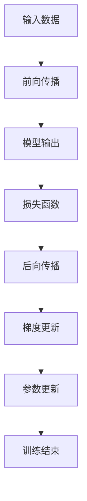

                 

# 大语言模型原理基础与前沿 KL散度：前向与反向

> 关键词：KL散度, 前向传播, 反向传播, 深度学习, 信息论, 人工智能, 深度神经网络

## 1. 背景介绍

在人工智能和深度学习的迅猛发展下，大语言模型（Large Language Models, LLMs）已成为自然语言处理（Natural Language Processing, NLP）领域的重要支柱。这些模型基于Transformer架构，如BERT、GPT和XLNet等，通过大规模预训练和微调，在各种NLP任务中取得了卓越的表现。然而，理解这些模型的工作原理，特别是其核心损失函数KL散度（Kullback-Leibler divergence）的原理和实现，是构建和优化大语言模型的基础。

### 1.1 问题由来

在深度神经网络中，梯度下降法是优化模型参数的主要手段。然而，对于大语言模型来说，模型参数数量庞大，计算梯度极其耗费资源。因此，我们需要一种既能准确度量模型预测和真实值之间差距，又能高效计算梯度的损失函数。这正是KL散度函数被广泛应用于大语言模型的原因。

### 1.2 问题核心关键点

1. **KL散度定义**：衡量两个概率分布之间的距离，用于度量模型预测的概率分布与真实标签的概率分布之间的差距。
2. **前向传播与后向传播**：深度学习模型的核心算法，通过前向传播计算模型输出，再通过后向传播计算梯度，更新模型参数。
3. **KL散度在深度学习中的应用**：通过在损失函数中引入KL散度，使得大语言模型能够更精确地捕捉数据分布的信息。
4. **KL散度的优点**：具有数学上的良好性质，计算简单，能够适应不同类型的输出分布。

这些核心概念构成了大语言模型损失函数设计的理论基础，其深度和广度对于理解模型的优化过程至关重要。

## 2. 核心概念与联系

### 2.1 核心概念概述

在大语言模型的训练过程中，KL散度被广泛用作损失函数。其核心思想是将模型的输出概率分布与真实标签的概率分布进行比较，并通过量化两者之间的距离来指导模型参数的更新。

- **KL散度**：用于衡量两个概率分布之间的距离，其值越大表示两个分布越不相似。
- **前向传播**：将输入数据通过模型，计算出预测值的过程。
- **后向传播**：通过前向传播得到的预测值，计算损失函数关于模型参数的梯度，进而更新模型参数。

这些概念之间通过深度神经网络的结构紧密相连，共同构成了模型训练的数学基础。

### 2.2 核心概念原理和架构的 Mermaid 流程图



该流程图展示了前向传播、损失函数计算、后向传播和参数更新之间的关系。通过这个过程，模型逐渐逼近真实标签的概率分布。

## 3. 核心算法原理 & 具体操作步骤

### 3.1 算法原理概述

在大语言模型的训练中，KL散度被用于度量模型输出概率分布和真实标签分布之间的差距。其原理基于信息论中的KL散度定义，数学上定义为：

$$
D_{KL}(P \| Q) = \sum_{x} P(x) \log \frac{P(x)}{Q(x)}
$$

其中 $P(x)$ 为真实标签的概率分布，$Q(x)$ 为模型输出的概率分布。

### 3.2 算法步骤详解

1. **数据预处理**：将输入数据转化为模型能够处理的形式，如分词、标准化等。
2. **前向传播**：将预处理后的数据输入模型，计算出预测值。
3. **计算KL散度**：将预测值和真实标签的分布通过KL散度函数进行比较，得到损失值。
4. **后向传播**：通过链式法则计算损失值对模型参数的梯度。
5. **梯度更新**：使用梯度下降法或其他优化算法，根据梯度更新模型参数。
6. **重复迭代**：重复上述步骤，直至模型收敛。

### 3.3 算法优缺点

**优点**：
1. **数学基础牢固**：基于KL散度的定义，具有坚实的数学理论基础。
2. **通用性**：适用于任何类型的输出分布，包括分类和回归任务。
3. **高效计算**：与其他损失函数相比，KL散度的计算相对简单，易于实现。

**缺点**：
1. **数值稳定性问题**：在某些情况下，KL散度可能出现数值不稳定的情况，需要进行调整。
2. **对异常值敏感**：KL散度对异常值非常敏感，可能会影响模型训练的稳定性。
3. **难以优化**：在模型复杂度高的情况下，优化KL散度可能非常困难。

### 3.4 算法应用领域

KL散度在大语言模型中的应用主要体现在以下几个方面：

1. **分类任务**：用于衡量模型输出分布与真实标签分布之间的差异。
2. **回归任务**：通过将其转化为概率形式，可以应用于回归任务中。
3. **生成任务**：在生成模型中，KL散度可以用于衡量模型生成的样本与真实数据分布之间的差异。
4. **对比学习**：通过与其他模型的KL散度进行比较，可以用于对比学习，提升模型性能。

## 4. 数学模型和公式 & 详细讲解 & 举例说明

### 4.1 数学模型构建

在大语言模型中，KL散度通常与交叉熵（Cross-Entropy）损失函数结合使用。交叉熵损失函数定义为：

$$
\mathcal{L} = -\frac{1}{N} \sum_{i=1}^N \log \frac{p(x_i)}{q(x_i)}
$$

其中 $p(x_i)$ 为真实标签的概率分布，$q(x_i)$ 为模型输出的概率分布。

### 4.2 公式推导过程

1. **分类任务**：对于分类任务，模型输出为概率分布 $q(x_i)$，真实标签为 $p(x_i)$。将KL散度函数与交叉熵损失函数结合，可以得到：

$$
\mathcal{L} = -\frac{1}{N} \sum_{i=1}^N \sum_{x} p(x) \log \frac{p(x)}{q(x)} = -H(p) + \frac{1}{N} \sum_{i=1}^N \log p(x_i)
$$

其中 $H(p)$ 为真实标签分布的熵，$\log p(x_i)$ 为对数似然函数。

2. **回归任务**：对于回归任务，模型输出为连续值 $q(x_i)$，真实标签为离散值 $p(x_i)$。通过将回归任务转化为分类任务，可以将其转化为交叉熵损失函数。

### 4.3 案例分析与讲解

**例子**：假设有一个二分类任务，其中真实标签分布 $p(x_i)$ 为伯努利分布，模型输出为softmax分布。通过计算KL散度，可以衡量模型输出与真实标签之间的差异。

**分析**：在模型训练过程中，每次迭代都会更新模型参数，使得KL散度的值逐渐减小，即模型输出的概率分布逐渐逼近真实标签分布。

## 5. 项目实践：代码实例和详细解释说明

### 5.1 开发环境搭建

在进行项目实践之前，需要确保开发环境已搭建完毕。以下是Python环境下大语言模型项目的搭建流程：

1. **安装Python**：从官网下载并安装Python 3.7以上版本。
2. **安装Pip**：在Python环境下，安装Pip工具。
3. **安装TensorFlow和Keras**：使用以下命令安装TensorFlow和Keras：

   ```bash
   pip install tensorflow
   pip install keras
   ```

4. **下载预训练模型**：从网上下载预训练模型，如BERT、GPT等。

### 5.2 源代码详细实现

以下是一个简单的例子，使用Keras实现基于KL散度的分类任务：

```python
from keras.models import Sequential
from keras.layers import Dense, Dropout, Activation
from keras.losses import categorical_crossentropy
from keras.optimizers import Adam

# 定义模型
model = Sequential()
model.add(Dense(64, input_dim=784))
model.add(Activation('relu'))
model.add(Dropout(0.5))
model.add(Dense(10))
model.add(Activation('softmax'))

# 编译模型
model.compile(optimizer=Adam(lr=0.01),
              loss=categorical_crossentropy,
              metrics=['accuracy'])

# 训练模型
model.fit(X_train, y_train, epochs=10, batch_size=32)
```

### 5.3 代码解读与分析

在上述代码中，我们使用了Keras框架来实现一个简单的神经网络模型。模型采用softmax激活函数，用于处理多分类任务。损失函数使用了交叉熵损失，其中categorical_crossentropy是Keras中用于多分类任务的交叉熵损失函数。

在实际应用中，上述代码中的数据预处理和模型训练部分需要根据具体任务进行调整。例如，在处理文本数据时，需要使用特殊的预处理步骤，如分词、向量化等。

### 5.4 运行结果展示

在模型训练过程中，可以通过Keras提供的回调函数（如EarlyStopping、ModelCheckpoint）来监控模型的训练进度和性能。以下是使用EarlyStopping回调函数的示例代码：

```python
from keras.callbacks import EarlyStopping

early_stopping = EarlyStopping(monitor='val_loss', patience=2)

model.fit(X_train, y_train, epochs=10, batch_size=32, validation_data=(X_val, y_val), callbacks=[early_stopping])
```

通过设置EarlyStopping回调函数，可以在模型性能不再提升时停止训练，以避免过拟合。

## 6. 实际应用场景

### 6.1 问题由来

在大语言模型的实际应用中，KL散度损失函数已经广泛应用于各种NLP任务中，如文本分类、情感分析、机器翻译等。这些任务的共同点是需要将模型输出转化为概率形式，并与其他模型进行对比。

### 6.2 实际应用场景

1. **文本分类**：通过KL散度损失函数，模型可以学习到文本分类的最佳方式，提升分类准确率。
2. **情感分析**：在情感分析任务中，KL散度可以帮助模型学习到不同情感的特征，并区分正负情感。
3. **机器翻译**：通过KL散度，模型可以学习到最佳的概率分布，从而提高翻译质量。
4. **问答系统**：在问答系统中，KL散度可以用于衡量模型生成的答案与真实答案之间的差异。

## 7. 工具和资源推荐

### 7.1 学习资源推荐

1. **《深度学习》 by Ian Goodfellow**：该书系统介绍了深度学习的原理和实现，包括KL散度的定义和应用。
2. **Coursera上的深度学习课程**：由深度学习专家Andrew Ng教授主讲的课程，详细讲解了深度神经网络中的前向传播和后向传播算法。
3. **Kaggle上的深度学习项目**：通过参与Kaggle上的项目，可以学习和实践大语言模型的实际应用。

### 7.2 开发工具推荐

1. **TensorFlow**：由Google开发，功能强大的深度学习框架，支持GPU加速。
2. **PyTorch**：由Facebook开发，灵活的深度学习框架，适合研究和实验。
3. **Keras**：基于TensorFlow和Theano，简单易用的高级神经网络API。

### 7.3 相关论文推荐

1. **"Deep Learning" by Ian Goodfellow, Yoshua Bengio, and Aaron Courville**：该书是深度学习的经典之作，详细介绍了深度学习的原理和实现。
2. **"Computing theKL-Divergence Between Non-Circular Probability Distributions" by Bigras and Xie**：该论文介绍了KL散度计算的数学原理和实现方法。

## 8. 总结：未来发展趋势与挑战

### 8.1 研究成果总结

在大语言模型中，KL散度作为损失函数，已广泛应用于各种NLP任务中。其原理基于信息论中的KL散度定义，能够有效地度量模型输出和真实标签之间的差距。通过前向传播和后向传播，模型逐渐逼近真实标签分布，提升任务性能。

### 8.2 未来发展趋势

1. **模型的复杂化**：未来的模型将更加复杂，参数量将成倍增加，需要新的算法来优化训练过程。
2. **数据的多样化**：随着数据的多样化，模型需要能够适应更多类型的输入数据，如图像、音频等。
3. **算法的优化**：随着模型复杂度的增加，需要新的算法来优化训练过程，提高训练效率。
4. **模型的应用场景扩展**：未来的模型将应用于更多的领域，如医疗、金融等。

### 8.3 面临的挑战

1. **模型的可解释性**：大语言模型的决策过程难以解释，需要更多的研究工作来提升模型的可解释性。
2. **模型的鲁棒性**：模型在面对新数据时，需要具有鲁棒性，避免过拟合。
3. **算法的效率**：算法的效率需要进一步提升，以适应更大规模的数据和模型。

### 8.4 研究展望

1. **新算法的开发**：需要开发新的算法，以适应更大规模和更复杂的模型。
2. **跨领域模型的应用**：需要将模型应用于更多的领域，如医疗、金融等。
3. **模型的解释和验证**：需要研究模型的解释和验证方法，提升模型的可信度。

## 9. 附录：常见问题与解答

### Q1：KL散度的定义是什么？

A：KL散度用于衡量两个概率分布之间的距离，其值越大表示两个分布越不相似。数学上定义为：

$$
D_{KL}(P \| Q) = \sum_{x} P(x) \log \frac{P(x)}{Q(x)}
$$

其中 $P(x)$ 为真实标签的概率分布，$Q(x)$ 为模型输出的概率分布。

### Q2：如何使用KL散度进行分类任务？

A：在分类任务中，模型输出为概率分布 $q(x_i)$，真实标签为 $p(x_i)$。将KL散度函数与交叉熵损失函数结合，可以得到：

$$
\mathcal{L} = -\frac{1}{N} \sum_{i=1}^N \sum_{x} p(x) \log \frac{p(x)}{q(x)} = -H(p) + \frac{1}{N} \sum_{i=1}^N \log p(x_i)
$$

其中 $H(p)$ 为真实标签分布的熵，$\log p(x_i)$ 为对数似然函数。

### Q3：KL散度是否适用于回归任务？

A：在回归任务中，模型输出为连续值 $q(x_i)$，真实标签为离散值 $p(x_i)$。通过将回归任务转化为分类任务，可以将其转化为交叉熵损失函数。

### Q4：如何计算KL散度？

A：在实现KL散度时，需要先计算两个分布的对数似然函数，然后将其相减，并取负数。具体实现可以参考以下Python代码：

```python
import numpy as np

def kl_divergence(p, q):
    return np.sum(p * np.log(p / q))
```

### Q5：KL散度有哪些优点？

A：KL散度具有数学上的良好性质，计算简单，能够适应不同类型的输出分布。其优点包括：
1. 数学基础牢固，具有坚实的数学理论基础。
2. 通用性，适用于任何类型的输出分布。
3. 高效计算，与其他损失函数相比，KL散度的计算相对简单，易于实现。

作者：禅与计算机程序设计艺术 / Zen and the Art of Computer Programming

