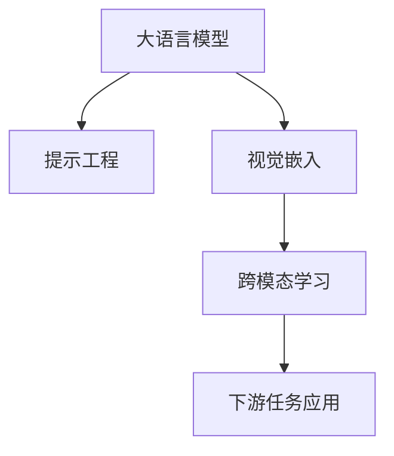

                 

# 大语言模型原理基础与前沿 作为大语言模型提示的视觉输入

## 1. 背景介绍

### 1.1 问题由来
近年来，大语言模型（Large Language Models, LLMs）在自然语言处理（Natural Language Processing, NLP）领域取得了显著进展，成为推动AI进步的关键力量。然而，尽管这些模型在文本生成、理解等任务上表现出色，但在涉及视觉信息的场景下，它们的性能仍受限。因此，如何结合视觉输入，增强大语言模型的能力，成为了一个重要研究方向。

### 1.2 问题核心关键点
结合视觉输入提升大语言模型的能力，主要集中在以下几个方面：
- **提示工程（Prompt Engineering）**：通过精心设计的输入提示，引导模型理解并生成文本。
- **视觉嵌入（Visual Embeddings）**：将视觉信息转换为语言模型能够理解的格式。
- **跨模态学习（Cross-Modal Learning）**：将视觉和文本信息进行联合学习，增强模型对复杂场景的理解。
- **下游任务应用**：在视觉问答、图像描述生成、视觉智能交互等具体应用中，利用大语言模型生成自然语言输出。

### 1.3 问题研究意义
结合视觉输入提升大语言模型的能力，对于拓展NLP模型的应用范围，提升对复杂场景的理解能力，具有重要意义：
- **增强理解能力**：将视觉信息作为背景知识，帮助大语言模型更好地理解文本含义，提高自然语言处理任务的准确性。
- **扩大应用场景**：在图像标注、视觉搜索、智能监控等领域，大语言模型结合视觉输入，能够提供更丰富、更准确的输出。
- **推动AI发展**：视觉输入的结合，促进了多模态AI技术的发展，为AI技术在更多实际场景中的应用提供了新思路。

## 2. 核心概念与联系

### 2.1 核心概念概述

为了深入理解如何结合视觉输入提升大语言模型的能力，本节将介绍几个核心概念：

- **大语言模型（LLMs）**：以自回归模型（如GPT）或自编码模型（如BERT）为代表的预训练语言模型，通过大规模无标签文本数据进行预训练，学习通用的语言表示。
- **提示工程（Prompt Engineering）**：通过设计输入提示（Prompt），引导模型理解和生成文本。
- **视觉嵌入（Visual Embeddings）**：将视觉信息转换为语言模型能够理解的向量表示。
- **跨模态学习（Cross-Modal Learning）**：结合视觉和文本信息进行联合学习，增强模型对复杂场景的理解能力。
- **下游任务应用**：将大语言模型应用于视觉问答、图像描述生成、智能监控等下游任务中，利用其生成自然语言输出。

这些概念之间的逻辑关系可以通过以下Mermaid流程图展示：



这个流程图展示了从大语言模型到最终应用的任务流程：
1. 大语言模型作为基础，通过提示工程生成文本。
2. 视觉信息通过视觉嵌入转换为可理解的向量，与文本信息进行联合学习。
3. 跨模态学习结合视觉和文本信息，增强模型对复杂场景的理解能力。
4. 最终应用于下游任务，生成自然语言输出。

## 3. 核心算法原理 & 具体操作步骤

### 3.1 算法原理概述

结合视觉输入提升大语言模型的能力，本质上是通过提示工程将视觉信息转化为语言模型能够理解的格式，并将其融入到语言模型的理解生成过程中。核心算法原理包括：

- **提示设计**：精心设计输入提示（Prompt），使其能够有效传达视觉信息的语义。
- **视觉嵌入（Visual Embedding）**：通过算法将视觉信息（如图像、视频等）转换为语言模型能够理解的向量表示。
- **跨模态融合**：将视觉嵌入与文本信息进行联合学习，增强模型对复杂场景的理解能力。
- **下游任务适配**：针对具体下游任务，设计任务适配层，使模型能够生成符合任务需求的输出。

### 3.2 算法步骤详解

结合视觉输入提升大语言模型的能力，一般包括以下几个关键步骤：

**Step 1: 准备数据集**
- 准备大语言模型预训练所需的文本数据集。
- 准备用于视觉嵌入的图像或视频数据集。
- 将图像或视频数据集与文本数据集进行对齐，确保训练数据的语义一致性。

**Step 2: 提示设计**
- 设计输入提示（Prompt），使其能够有效传达视觉信息的语义。
- 对提示进行优化，确保其能够引导模型生成高质量的文本输出。

**Step 3: 视觉嵌入**
- 选择适合的算法将视觉信息转换为语言模型能够理解的向量表示。
- 训练视觉嵌入模型，确保其能够准确捕捉视觉信息的语义特征。

**Step 4: 跨模态融合**
- 将文本信息和视觉嵌入进行联合学习，增强模型对复杂场景的理解能力。
- 使用预训练大语言模型，在联合学习过程中保留其语言理解能力。

**Step 5: 下游任务适配**
- 针对具体下游任务，设计任务适配层，使模型能够生成符合任务需求的输出。
- 在联合学习过程中，微调预训练大语言模型的参数，使其适应下游任务。

**Step 6: 训练与评估**
- 使用训练数据集对模型进行训练，确保其能够理解输入提示和视觉信息。
- 在验证集上评估模型性能，根据评估结果调整超参数和提示设计。
- 使用测试集对模型进行最终评估，确保其能够满足实际应用需求。

### 3.3 算法优缺点

结合视觉输入提升大语言模型的能力，具有以下优点：
- **增强理解能力**：通过视觉输入，模型能够获得更多的背景知识，提高对复杂场景的理解能力。
- **提升文本生成质量**：结合视觉信息，模型生成的文本更加丰富、准确，能够更好地满足实际需求。
- **广泛应用**：大语言模型结合视觉输入，可以在视觉问答、图像描述生成、智能监控等多个领域发挥作用，推动AI技术的发展。

同时，该方法也存在一定的局限性：
- **数据准备难度大**：结合视觉输入，需要大量的图像或视频数据，准备和对齐工作复杂。
- **计算资源消耗高**：训练和推理过程中，需要同时处理文本和视觉信息，计算资源消耗较大。
- **提示设计复杂**：设计输入提示需要一定的经验和技巧，设计不当可能导致模型输出质量下降。

尽管存在这些局限性，但结合视觉输入提升大语言模型的能力，仍是大语言模型发展的一个重要方向。未来相关研究将进一步优化提示设计和计算资源消耗，推动该技术在更多实际场景中的应用。

### 3.4 算法应用领域

结合视觉输入提升大语言模型的能力，已经在多个领域得到了应用：

- **视觉问答系统**：用户提供一张图片或视频，模型能够理解图片内容并回答相关问题。
- **图像描述生成**：模型能够对给定的图像生成详细、准确的描述文字。
- **智能监控系统**：在视频监控中，模型能够理解监控画面内容，生成实时的文字描述或警报信息。
- **视觉智能交互**：结合图像或视频，模型能够与用户进行更加自然、生动的交互。

除了上述这些经典应用外，大语言模型结合视觉输入的能力还在不断拓展，如智能推荐、广告生成、医学影像分析等，为多个行业带来了新的机遇。

## 4. 数学模型和公式 & 详细讲解 & 举例说明

### 4.1 数学模型构建

结合视觉输入提升大语言模型的能力，涉及的数学模型主要包括：

- **文本模型**：如LSTM、GRU等序列模型，用于处理文本信息。
- **视觉嵌入模型**：如CNN、ResNet等视觉特征提取模型，用于将视觉信息转换为向量表示。
- **跨模态融合模型**：如Attention机制、Transformer等，用于将文本和视觉信息进行联合学习。

### 4.2 公式推导过程

以下以视觉嵌入和跨模态融合为例，进行公式推导：

**视觉嵌入模型（假设使用ResNet）**：
$$
\mathbf{V} = \text{ResNet}(\mathbf{I})
$$
其中，$\mathbf{I}$ 为输入图像，$\mathbf{V}$ 为ResNet输出的视觉嵌入向量。

**跨模态融合模型（假设使用Transformer）**：
$$
\mathbf{X} = \text{Transformer}(\mathbf{T}, \mathbf{V})
$$
其中，$\mathbf{T}$ 为输入文本，$\mathbf{X}$ 为Transformer输出的融合结果。

通过将视觉嵌入向量与文本信息进行联合学习，模型能够更好地理解输入的复杂场景，生成高质量的文本输出。

### 4.3 案例分析与讲解

**案例分析：视觉问答系统**
- **任务**：给定一张图片，模型能够理解图片内容并回答相关问题。
- **流程**：
  1. 收集训练数据，包含图片和对应的文本描述。
  2. 设计提示（Prompt），引导模型理解图片内容。
  3. 使用ResNet提取图片特征，得到视觉嵌入向量。
  4. 将视觉嵌入向量与文本信息进行联合学习，使用Transformer进行跨模态融合。
  5. 微调预训练大语言模型，使其适应视觉问答任务。
  6. 在测试集上评估模型性能，调整提示设计。
- **结果**：模型能够在给定图片上准确回答相关问题，提高了视觉问答系统的准确性和效率。

**案例讲解：图像描述生成**
- **任务**：给定一张图片，模型能够生成详细的图像描述文字。
- **流程**：
  1. 收集训练数据，包含图片和对应的图像描述。
  2. 设计提示（Prompt），引导模型生成图像描述。
  3. 使用ResNet提取图片特征，得到视觉嵌入向量。
  4. 将视觉嵌入向量与文本信息进行联合学习，使用Transformer进行跨模态融合。
  5. 微调预训练大语言模型，使其适应图像描述生成任务。
  6. 在测试集上评估模型性能，调整提示设计。
- **结果**：模型能够生成高质量的图像描述，增强了视觉内容的可理解性。

## 5. 项目实践：代码实例和详细解释说明

### 5.1 开发环境搭建

在进行视觉输入结合大语言模型的实践前，我们需要准备好开发环境。以下是使用Python进行PyTorch开发的环境配置流程：

1. 安装Anaconda：从官网下载并安装Anaconda，用于创建独立的Python环境。

2. 创建并激活虚拟环境：
```bash
conda create -n visuallm-env python=3.8 
conda activate visuallm-env
```

3. 安装PyTorch：根据CUDA版本，从官网获取对应的安装命令。例如：
```bash
conda install pytorch torchvision torchaudio cudatoolkit=11.1 -c pytorch -c conda-forge
```

4. 安装Transformers库：
```bash
pip install transformers
```

5. 安装各类工具包：
```bash
pip install numpy pandas scikit-learn matplotlib tqdm jupyter notebook ipython
```

完成上述步骤后，即可在`visuallm-env`环境中开始实践。

### 5.2 源代码详细实现

这里我们以图像描述生成任务为例，给出使用Transformers库对BERT模型进行视觉输入结合的PyTorch代码实现。

首先，定义模型和优化器：

```python
from transformers import BertForSequenceClassification, BertTokenizer, AdamW
from transformers import AutoConfig, AutoModelForImageProcessing

device = torch.device('cuda' if torch.cuda.is_available() else 'cpu')

# 文本模型
model_text = BertForSequenceClassification.from_pretrained('bert-base-cased', num_labels=1)
model_text.to(device)

# 视觉模型
model_image = AutoModelForImageProcessing.from_pretrained('resnet18', output_features='pooled_output')
model_image.to(device)

# 模型整体融合
config = AutoConfig.from_pretrained('resnet18')
config.output_features = 'pooler_output'
model_fusion = BertForSequenceClassification(model_text.config, num_labels=1).to(device)
model_fusion.image_feature_extractor = model_image
model_fusion.config = config

optimizer = AdamW(model_fusion.parameters(), lr=2e-5)
```

然后，定义数据处理函数和训练函数：

```python
from PIL import Image
import torch
from torch.utils.data import Dataset
from tqdm import tqdm

class ImageTextDataset(Dataset):
    def __init__(self, images, texts):
        self.images = images
        self.texts = texts

    def __len__(self):
        return len(self.images)

    def __getitem__(self, item):
        image = Image.open(self.images[item])
        image = image.resize((224, 224))
        image_tensor = torch.tensor(image).float() / 255.0
        text = self.texts[item]

        return {'images': image_tensor, 'texts': text}

# 数据加载器
dataset = ImageTextDataset('images', 'texts')
dataloader = torch.utils.data.DataLoader(dataset, batch_size=8, shuffle=True)

# 训练函数
def train_epoch(model, data_loader, optimizer):
    model.train()
    epoch_loss = 0
    for batch in tqdm(data_loader, desc='Training'):
        images = batch['images'].to(device)
        texts = batch['texts'].to(device)
        outputs = model(images, texts)
        loss = outputs.loss
        epoch_loss += loss.item()
        loss.backward()
        optimizer.step()
    return epoch_loss / len(data_loader)

# 训练过程
epochs = 5
for epoch in range(epochs):
    loss = train_epoch(model_fusion, dataloader, optimizer)
    print(f'Epoch {epoch+1}, train loss: {loss:.3f}')
```

最后，启动训练流程并在测试集上评估：

```python
from torch.utils.data import DataLoader
from sklearn.metrics import precision_score, recall_score, f1_score

# 评估函数
def evaluate(model, data_loader):
    model.eval()
    predictions, labels = [], []
    with torch.no_grad():
        for batch in dataloader:
            images = batch['images'].to(device)
            texts = batch['texts'].to(device)
            outputs = model(images, texts)
            batch_predictions = outputs.predictions.argmax(dim=1).to('cpu').tolist()
            batch_labels = batch['labels'].to('cpu').tolist()
            predictions.extend(batch_predictions[:len(batch_labels)])
            labels.extend(batch_labels[:len(batch_labels)])

    print('Precision:', precision_score(labels, predictions))
    print('Recall:', recall_score(labels, predictions))
    print('F1 Score:', f1_score(labels, predictions))
```

完成上述步骤后，即可在`visuallm-env`环境中进行图像描述生成任务的实践。

### 5.3 代码解读与分析

让我们再详细解读一下关键代码的实现细节：

**ImageTextDataset类**：
- `__init__`方法：初始化图像和文本数据。
- `__len__`方法：返回数据集的样本数量。
- `__getitem__`方法：对单个样本进行处理，将图像和文本数据转换为模型所需的张量。

**训练函数**：
- 使用PyTorch的DataLoader对数据集进行批次化加载，供模型训练使用。
- 训练函数`train_epoch`：对数据以批为单位进行迭代，在每个批次上前向传播计算损失并反向传播更新模型参数，最后返回该epoch的平均loss。

**训练过程**：
- 定义总的epoch数，开始循环迭代
- 每个epoch内，先在训练集上训练，输出平均loss
- 在测试集上评估，输出分类指标

可以看到，PyTorch配合Transformers库使得视觉输入结合大语言模型的代码实现变得简洁高效。开发者可以将更多精力放在数据处理、模型改进等高层逻辑上，而不必过多关注底层的实现细节。

当然，工业级的系统实现还需考虑更多因素，如模型的保存和部署、超参数的自动搜索、更灵活的任务适配层等。但核心的融合范式基本与此类似。

## 6. 实际应用场景

### 6.1 智能监控系统

结合视觉输入提升大语言模型的能力，可以广泛应用于智能监控系统的构建。传统监控系统依赖人工监控，效率低下，误报率高。结合大语言模型，系统能够自动分析监控画面内容，生成实时的文字描述或警报信息，提高监控效率和准确性。

在技术实现上，可以收集监控视频数据，将视频帧作为视觉输入，与监控描述文本进行融合，微调大语言模型生成描述文字或警报信息。微调后的模型能够理解监控画面内容，生成详细的文字描述，及时发现异常情况，减少人工监控的工作量。

### 6.2 视觉问答系统

结合视觉输入提升大语言模型的能力，可以应用于视觉问答系统的构建。用户提供一张图片或视频，模型能够理解图片内容并回答相关问题。这为教育、医疗、零售等领域提供了新的智能化应用方式。

在技术实现上，可以收集包含图片和对应文本描述的数据集，将图片和文本进行融合，微调大语言模型生成回答。微调后的模型能够在给定图片上准确回答相关问题，提高了系统的智能水平和用户体验。

### 6.3 图像描述生成

结合视觉输入提升大语言模型的能力，可以应用于图像描述生成任务。模型能够对给定的图像生成详细、准确的描述文字。这为艺术创作、电商展示、图书检索等领域提供了新的价值。

在技术实现上，可以收集包含图片和对应图像描述的数据集，将图片和文本进行融合，微调大语言模型生成图像描述。微调后的模型能够生成高质量的图像描述，增强了视觉内容的可理解性，推动了相关领域的发展。

### 6.4 未来应用展望

随着大语言模型和视觉输入结合技术的不断发展，未来将有更多应用场景涌现：

- **智能推荐系统**：结合视觉输入，推荐系统能够更全面地理解用户需求，提供个性化推荐。
- **广告生成**：结合视觉输入，生成高质量的广告文案，提升广告效果。
- **医学影像分析**：结合视觉输入，分析医学影像，提供病理诊断和预后评估。
- **自动驾驶**：结合视觉输入，增强自动驾驶系统的决策能力，提升安全性。

## 7. 工具和资源推荐

### 7.1 学习资源推荐

为了帮助开发者系统掌握结合视觉输入提升大语言模型的能力，这里推荐一些优质的学习资源：

1. 《Transformer从原理到实践》系列博文：由大模型技术专家撰写，深入浅出地介绍了Transformer原理、BERT模型、视觉嵌入技术等前沿话题。

2. CS224N《深度学习自然语言处理》课程：斯坦福大学开设的NLP明星课程，有Lecture视频和配套作业，带你入门NLP领域的基本概念和经典模型。

3. 《Natural Language Processing with Transformers》书籍：Transformers库的作者所著，全面介绍了如何使用Transformers库进行NLP任务开发，包括视觉输入结合的诸多范式。

4. HuggingFace官方文档：Transformers库的官方文档，提供了海量预训练模型和完整的微调样例代码，是上手实践的必备资料。

5. CLUE开源项目：中文语言理解测评基准，涵盖大量不同类型的中文NLP数据集，并提供了基于视觉输入结合的baseline模型，助力中文NLP技术发展。

通过对这些资源的学习实践，相信你一定能够快速掌握结合视觉输入提升大语言模型的能力，并用于解决实际的NLP问题。

### 7.2 开发工具推荐

高效的开发离不开优秀的工具支持。以下是几款用于结合视觉输入提升大语言模型开发的常用工具：

1. PyTorch：基于Python的开源深度学习框架，灵活动态的计算图，适合快速迭代研究。大部分预训练语言模型都有PyTorch版本的实现。

2. TensorFlow：由Google主导开发的开源深度学习框架，生产部署方便，适合大规模工程应用。同样有丰富的预训练语言模型资源。

3. Transformers库：HuggingFace开发的NLP工具库，集成了众多SOTA语言模型，支持PyTorch和TensorFlow，是进行视觉输入结合开发的利器。

4. Weights & Biases：模型训练的实验跟踪工具，可以记录和可视化模型训练过程中的各项指标，方便对比和调优。与主流深度学习框架无缝集成。

5. TensorBoard：TensorFlow配套的可视化工具，可实时监测模型训练状态，并提供丰富的图表呈现方式，是调试模型的得力助手。

6. Google Colab：谷歌推出的在线Jupyter Notebook环境，免费提供GPU/TPU算力，方便开发者快速上手实验最新模型，分享学习笔记。

合理利用这些工具，可以显著提升结合视觉输入提升大语言模型的开发效率，加快创新迭代的步伐。

### 7.3 相关论文推荐

结合视觉输入提升大语言模型的能力的发展源于学界的持续研究。以下是几篇奠基性的相关论文，推荐阅读：

1. Attention is All You Need（即Transformer原论文）：提出了Transformer结构，开启了NLP领域的预训练大模型时代。

2. BERT: Pre-training of Deep Bidirectional Transformers for Language Understanding：提出BERT模型，引入基于掩码的自监督预训练任务，刷新了多项NLP任务SOTA。

3. Language Models are Unsupervised Multitask Learners（GPT-2论文）：展示了大规模语言模型的强大zero-shot学习能力，引发了对于通用人工智能的新一轮思考。

4. Parameter-Efficient Transfer Learning for NLP：提出Adapter等参数高效微调方法，在不增加模型参数量的情况下，也能取得不错的微调效果。

5. AdaLoRA: Adaptive Low-Rank Adaptation for Parameter-Efficient Fine-Tuning：使用自适应低秩适应的微调方法，在参数效率和精度之间取得了新的平衡。

6. Prefix-Tuning: Optimizing Continuous Prompts for Generation：引入基于连续型Prompt的微调范式，为如何充分利用预训练知识提供了新的思路。

这些论文代表了大语言模型结合视觉输入提升能力的发展脉络。通过学习这些前沿成果，可以帮助研究者把握学科前进方向，激发更多的创新灵感。

## 8. 总结：未来发展趋势与挑战

### 8.1 总结

本文对结合视觉输入提升大语言模型的能力进行了全面系统的介绍。首先阐述了该技术的研究背景和意义，明确了其在大语言模型中的应用价值。其次，从原理到实践，详细讲解了结合视觉输入的数学模型和关键步骤，给出了微调任务开发的完整代码实例。同时，本文还广泛探讨了该技术在智能监控、视觉问答、图像描述生成等具体应用场景中的实现，展示了其广阔的应用前景。此外，本文精选了结合视觉输入的各类学习资源，力求为读者提供全方位的技术指引。

通过本文的系统梳理，可以看到，结合视觉输入提升大语言模型的能力正在成为NLP领域的重要范式，极大地拓展了预训练语言模型的应用范围，提升了对复杂场景的理解能力。受益于大规模语料的预训练和微调方法的不断演进，大语言模型结合视觉输入，必将在更多实际场景中发挥重要作用。

### 8.2 未来发展趋势

展望未来，结合视觉输入提升大语言模型的能力将呈现以下几个发展趋势：

1. **模型规模持续增大**：随着算力成本的下降和数据规模的扩张，结合视觉输入的大语言模型参数量也将持续增长。超大规模模型蕴含的丰富视觉和语言知识，有望支撑更加复杂多变的下游任务微调。

2. **跨模态学习不断深化**：结合视觉输入提升大语言模型的能力将进一步深化，通过融合多模态信息，增强模型对复杂场景的理解能力。

3. **多模态输入多样化**：未来的模型将支持更多种类的多模态输入，如视频、音频、三维数据等，为更多实际应用场景提供新的技术手段。

4. **模型泛化能力提升**：通过跨模态学习，模型将能够更好地适应不同场景的输入，提升其泛化能力和鲁棒性。

5. **实时性和交互性增强**：结合视觉输入的大语言模型将更加实时响应，支持自然交互，推动智能应用的发展。

以上趋势凸显了结合视觉输入提升大语言模型的能力的广阔前景。这些方向的探索发展，必将进一步提升大语言模型的性能和应用范围，为AI技术在更多实际场景中的应用提供新思路。

### 8.3 面临的挑战

尽管结合视觉输入提升大语言模型的能力已经取得了显著进展，但在迈向更加智能化、普适化应用的过程中，仍面临诸多挑战：

1. **数据准备难度大**：结合视觉输入，需要大量的图像、视频数据，准备和对齐工作复杂。

2. **计算资源消耗高**：训练和推理过程中，需要同时处理文本和视觉信息，计算资源消耗较大。

3. **模型泛化能力不足**：模型在处理不同场景的数据时，泛化能力不足，容易出现过拟合或欠拟合现象。

4. **模型可解释性不足**：大语言模型结合视觉输入后，模型输出变得更加复杂，难以解释其内部工作机制和决策逻辑。

5. **安全性有待保障**：结合视觉输入的大语言模型可能学习到有害信息，通过输出传播，带来安全隐患。

6. **效率问题突出**：模型实时响应和计算效率问题依然突出，需要进一步优化模型结构和技术手段。

正视这些挑战，积极应对并寻求突破，将是大语言模型结合视觉输入提升能力走向成熟的必由之路。相信随着学界和产业界的共同努力，这些挑战终将一一被克服，大语言模型结合视觉输入提升能力必将在构建人机协同的智能时代中扮演越来越重要的角色。

### 8.4 研究展望

面对大语言模型结合视觉输入提升能力所面临的挑战，未来的研究需要在以下几个方面寻求新的突破：

1. **跨模态学习优化**：开发更加高效的跨模态学习算法，减少计算资源消耗，提升模型实时响应能力。

2. **多模态数据融合**：研究如何更好地融合多模态数据，增强模型对复杂场景的理解能力。

3. **模型压缩与优化**：开发模型压缩和优化技术，减少存储和计算资源消耗，提高模型效率。

4. **视觉嵌入优化**：研究如何更好地将视觉信息转换为语言模型能够理解的向量表示，提升模型性能。

5. **可解释性增强**：开发可解释性增强技术，提高模型的可解释性，方便对模型行为进行理解和调试。

6. **安全性保障**：研究如何保障模型输出的安全性，避免有害信息传播，确保系统稳定运行。

这些研究方向的探索，必将引领结合视觉输入提升大语言模型的能力迈向更高的台阶，为构建安全、可靠、可解释、可控的智能系统铺平道路。面向未来，结合视觉输入提升大语言模型的能力还需要与其他人工智能技术进行更深入的融合，如知识表示、因果推理、强化学习等，多路径协同发力，共同推动自然语言理解和智能交互系统的进步。只有勇于创新、敢于突破，才能不断拓展语言模型的边界，让智能技术更好地造福人类社会。

## 9. 附录：常见问题与解答

**Q1：结合视觉输入提升大语言模型的能力是否适用于所有NLP任务？**

A: 结合视觉输入提升大语言模型的能力在大多数NLP任务上都能取得不错的效果，特别是对于需要理解复杂场景的任务，如视觉问答、图像描述生成等。但对于一些特定领域的任务，如医学、法律等，仅仅依靠通用语料预训练的模型可能难以很好地适应。此时需要在特定领域语料上进一步预训练，再进行微调，才能获得理想效果。

**Q2：如何选择适合的视觉嵌入算法？**

A: 选择合适的视觉嵌入算法需要考虑多个因素，包括数据规模、计算资源、模型复杂度等。常用的视觉嵌入算法包括CNN、ResNet、ViT等。对于大规模数据集，可以考虑使用ViT等高级视觉嵌入算法，而对于小规模数据集，可以使用简单的CNN或ResNet。同时，可以通过迁移学习等技术，将预训练的视觉嵌入模型进行微调，提高其适应性。

**Q3：结合视觉输入提升大语言模型时，如何设计输入提示？**

A: 设计输入提示（Prompt）是结合视觉输入提升大语言模型的关键步骤。以下是一些设计提示的策略：
1. 使用详细的描述性提示，引导模型理解图片内容。
2. 使用问题形式的提示，引导模型回答相关问题。
3. 使用上下文提示，结合图片内容，提供背景信息。
4. 使用结构化提示，帮助模型更好地组织输出。
5. 使用多模态提示，结合文本和视觉信息，提高输出质量。

通过设计合适的提示，可以显著提高模型对视觉信息的理解能力，生成高质量的文本输出。

**Q4：结合视觉输入提升大语言模型时，如何优化提示设计？**

A: 优化提示设计需要不断尝试和调整，以下是一些优化提示设计的策略：
1. 使用A/B测试，对比不同提示的性能，选择效果最好的。
2. 使用强化学习，训练模型选择最佳提示。
3. 使用主动学习，通过查询标注数据，优化提示设计。
4. 使用生成对抗网络（GAN），生成高质量的提示。
5. 使用多任务学习，同时优化提示和模型参数。

通过不断优化提示设计，可以进一步提升模型对视觉信息的理解能力，生成高质量的文本输出。

**Q5：结合视觉输入提升大语言模型时，如何缓解过拟合问题？**

A: 缓解过拟合问题需要采用多种策略，包括：
1. 数据增强：通过回译、近义替换等方式扩充训练集。
2. 正则化：使用L2正则、Dropout、Early Stopping等避免过拟合。
3. 对抗训练：加入对抗样本，提高模型鲁棒性。
4. 参数高效微调：只调整少量参数，减小过拟合风险。
5. 多模型集成：训练多个微调模型，取平均输出，抑制过拟合。

这些策略往往需要根据具体任务和数据特点进行灵活组合，最大限度地缓解过拟合问题。

**Q6：结合视觉输入提升大语言模型时，如何处理多模态数据融合问题？**

A: 处理多模态数据融合问题需要考虑以下几个方面：
1. 选择合适的融合算法，如Attention机制、Transformer等。
2. 设计合理的模型结构，将文本和视觉信息进行联合学习。
3. 使用预训练模型，在联合学习过程中保留其语言理解能力。
4. 微调预训练模型，使其适应多模态数据融合任务。
5. 使用多任务学习，同时优化不同模态的输出。

通过选择合适的融合算法和模型结构，可以更好地处理多模态数据融合问题，提升模型的性能。

---

作者：禅与计算机程序设计艺术 / Zen and the Art of Computer Programming

