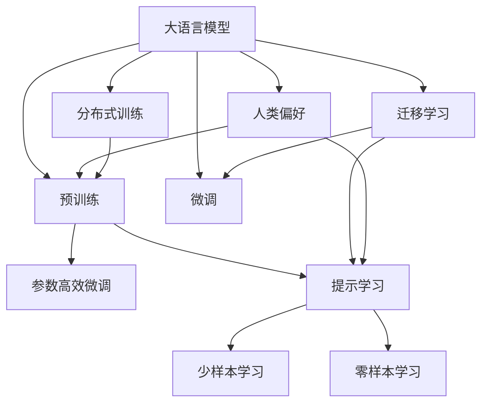

                 

## 1. 背景介绍

### 1.1 问题由来
自2018年BERT问世以来，基于自监督学习的大语言模型在自然语言处理(NLP)领域取得了令人瞩目的成果。BERT模型通过在大规模无标签文本数据上预训练，学习到丰富的语言知识，并在下游任务上通过微调获得显著的性能提升。然而，当前的大语言模型仍存在一些局限性，如对长尾数据泛化能力不足、语义理解不够深入等。

为此，研究人员提出了基于人类偏好的大语言模型预训练方法。该方法通过模拟人类对语言的偏好，在大规模数据上训练模型，使其在语言理解上更加接近人类的认知模式，从而提升模型的泛化能力和语义理解深度。

### 1.2 问题核心关键点
本文将重点介绍基于人类偏好的大语言模型预训练方法，该方法通过将文本数据按照文本质量进行筛选和排序，使得训练数据更加贴近人类的认知模式。具体来说，分为以下几个关键点：

- 文本质量评估：通过自动化的文本质量评估方法，对文本进行评分，筛选高质量文本数据。
- 数据排序：对筛选出的文本按照质量从高到低进行排序，生成高质量的训练数据集。
- 预训练模型：在排序后的数据集上，使用预训练模型学习语言知识。
- 微调：将预训练模型应用于下游任务，通过微调优化模型。

### 1.3 问题研究意义
基于人类偏好的大语言模型预训练方法具有重要意义：

- 提升模型泛化能力：通过筛选和排序文本数据，提升模型的泛化能力，使其在长尾数据上表现更好。
- 增强语义理解：通过模拟人类对语言的偏好，提升模型的语义理解能力，使其能够更好地理解和生成自然语言。
- 降低预训练难度：通过筛选高质量数据，降低预训练难度，提升模型的训练效率和质量。
- 提升下游任务性能：通过预训练和微调，提升模型在具体下游任务上的性能。

## 2. 核心概念与联系

### 2.1 核心概念概述

为更好地理解基于人类偏好的大语言模型预训练方法，本节将介绍几个密切相关的核心概念：

- 大语言模型(Large Language Model, LLM)：以自回归(如GPT)或自编码(如BERT)模型为代表的大规模预训练语言模型。通过在大规模无标签文本语料上进行预训练，学习通用的语言表示，具备强大的语言理解和生成能力。

- 预训练(Pre-training)：指在大规模无标签文本语料上，通过自监督学习任务训练通用语言模型的过程。常见的预训练任务包括言语建模、遮挡语言模型等。

- 微调(Fine-tuning)：指在预训练模型的基础上，使用下游任务的少量标注数据，通过有监督学习优化模型在特定任务上的性能。通常只需要调整顶层分类器或解码器，并以较小的学习率更新全部或部分的模型参数。

- 迁移学习(Transfer Learning)：指将一个领域学习到的知识，迁移应用到另一个不同但相关的领域的学习范式。大模型的预训练-微调过程即是一种典型的迁移学习方式。

- 人类偏好(Human Preference)：指通过人类对文本质量的评分，筛选高质量文本数据，模拟人类对语言的偏好，训练大语言模型。

- 语义表示(Semantic Representation)：指模型学习到的对语言语义的抽象表示，是实现语义理解的基础。

- 分布式训练(Distributed Training)：指在大规模数据上，通过多台计算机并行训练模型，提升训练效率。

这些核心概念之间的逻辑关系可以通过以下Mermaid流程图来展示：



这个流程图展示了大语言模型的核心概念及其之间的关系：

1. 大语言模型通过预训练获得基础能力。
2. 微调是对预训练模型进行任务特定的优化，可以分为全参数微调和参数高效微调（PEFT）。
3. 提示学习是一种不更新模型参数的方法，可以实现少样本学习和零样本学习。
4. 迁移学习是连接预训练模型与下游任务的桥梁，可以通过微调或提示学习来实现。
5. 人类偏好是基于人类对文本质量的评分，筛选高质量文本数据，训练大语言模型。
6. 语义表示是模型学习到的对语言语义的抽象表示。
7. 分布式训练是提升大规模模型训练效率的有效方式。

这些概念共同构成了大语言模型的学习和应用框架，使其能够在各种场景下发挥强大的语言理解和生成能力。通过理解这些核心概念，我们可以更好地把握大语言模型的工作原理和优化方向。

## 3. 核心算法原理 & 具体操作步骤
### 3.1 算法原理概述

基于人类偏好的大语言模型预训练方法，本质上是一个通过文本质量筛选和排序的、基于监督学习的微调过程。其核心思想是：将预训练语言模型视为一个强大的"特征提取器"，通过将文本数据按照质量进行排序，筛选出高质量的训练数据集，用于对模型进行微调，提升模型在特定任务上的性能。

形式化地，假设预训练语言模型为 $M_{\theta}$，其中 $\theta$ 为预训练得到的模型参数。给定下游任务 $T$ 的标注数据集 $D=\{(x_i, y_i)\}_{i=1}^N$，预训练的目标是找到最优参数 $\theta^*$，使得：

$$
\theta^*=\mathop{\arg\min}_{\theta} \mathcal{L}(M_{\theta},D)
$$

其中 $\mathcal{L}$ 为针对任务 $T$ 设计的损失函数，用于衡量模型预测输出与真实标签之间的差异。常见的损失函数包括交叉熵损失、均方误差损失等。

### 3.2 算法步骤详解

基于人类偏好的大语言模型预训练方法，主要包括以下几个关键步骤：

**Step 1: 文本质量评估与排序**

- 定义文本质量评估指标：可以通过BLEU、ROUGE、Perplexity等指标对文本进行评分。
- 收集大规模语料数据，对文本进行评分。
- 将文本按照质量从高到低进行排序，生成高质量的训练数据集。

**Step 2: 构建预训练模型**

- 选择合适的预训练语言模型 $M_{\theta}$ 作为初始化参数，如 BERT、GPT 等。
- 在排序后的数据集上进行预训练，学习语言知识。

**Step 3: 设置微调超参数**

- 选择合适的优化算法及其参数，如 AdamW、SGD 等，设置学习率、批大小、迭代轮数等。
- 设置正则化技术及强度，包括权重衰减、Dropout、Early Stopping 等。
- 确定冻结预训练参数的策略，如仅微调顶层，或全部参数都参与微调。

**Step 4: 执行梯度训练**

- 将训练集数据分批次输入模型，前向传播计算损失函数。
- 反向传播计算参数梯度，根据设定的优化算法和学习率更新模型参数。
- 周期性在验证集上评估模型性能，根据性能指标决定是否触发 Early Stopping。
- 重复上述步骤直到满足预设的迭代轮数或 Early Stopping 条件。

**Step 5: 测试和部署**

- 在测试集上评估微调后模型 $M_{\hat{\theta}}$ 的性能，对比微调前后的精度提升。
- 使用微调后的模型对新样本进行推理预测，集成到实际的应用系统中。
- 持续收集新的数据，定期重新微调模型，以适应数据分布的变化。

以上是基于人类偏好的大语言模型预训练方法的一般流程。在实际应用中，还需要针对具体任务的特点，对预训练过程的各个环节进行优化设计，如改进文本质量评估指标，引入更多的正则化技术，搜索最优的超参数组合等，以进一步提升模型性能。

### 3.3 算法优缺点

基于人类偏好的大语言模型预训练方法具有以下优点：

1. 提升模型泛化能力：通过筛选和排序文本数据，提升模型的泛化能力，使其在长尾数据上表现更好。
2. 增强语义理解：通过模拟人类对语言的偏好，提升模型的语义理解能力，使其能够更好地理解和生成自然语言。
3. 降低预训练难度：通过筛选高质量数据，降低预训练难度，提升模型的训练效率和质量。
4. 提升下游任务性能：通过预训练和微调，提升模型在具体下游任务上的性能。

同时，该方法也存在一定的局限性：

1. 数据标注成本高：高质量的文本数据标注成本较高，筛选排序数据过程复杂。
2. 模型依赖标注数据：筛选和排序过程依赖标注数据，需要大量人力和物力。
3. 数据多样性不足：排序过程可能忽视数据的多样性，导致模型泛化能力不足。
4. 训练时间长：排序和筛选过程复杂，训练时间可能较长。
5. 需要大量计算资源：筛选和排序过程需要大量计算资源，特别是在大规模数据集上。

尽管存在这些局限性，但就目前而言，基于人类偏好的大语言模型预训练方法仍然是大语言模型预训练的重要范式。未来相关研究的重点在于如何进一步降低数据标注成本，提高模型的少样本学习和跨领域迁移能力，同时兼顾可解释性和伦理安全性等因素。

### 3.4 算法应用领域

基于人类偏好的大语言模型预训练方法，在NLP领域已经得到了广泛的应用，覆盖了几乎所有常见任务，例如：

- 文本分类：如情感分析、主题分类、意图识别等。通过预训练模型学习文本-标签映射。
- 命名实体识别：识别文本中的人名、地名、机构名等特定实体。通过预训练模型学习实体边界和类型。
- 关系抽取：从文本中抽取实体之间的语义关系。通过预训练模型学习实体-关系三元组。
- 问答系统：对自然语言问题给出答案。将问题-答案对作为预训练数据，训练模型学习匹配答案。
- 机器翻译：将源语言文本翻译成目标语言。通过预训练模型学习语言-语言映射。
- 文本摘要：将长文本压缩成简短摘要。将文章-摘要对作为预训练数据，使模型学习抓取要点。
- 对话系统：使机器能够与人自然对话。将多轮对话历史作为上下文，预训练模型进行回复生成。

除了上述这些经典任务外，基于人类偏好的大语言模型预训练方法也被创新性地应用到更多场景中，如可控文本生成、常识推理、代码生成、数据增强等，为NLP技术带来了全新的突破。随着预训练模型和预训练方法的不断进步，相信基于人类偏好的大语言模型预训练方法将进一步拓展应用范围，推动NLP技术的产业化进程。

## 4. 数学模型和公式 & 详细讲解  
### 4.1 数学模型构建

本节将使用数学语言对基于人类偏好的大语言模型预训练过程进行更加严格的刻画。

记预训练语言模型为 $M_{\theta}$，其中 $\theta$ 为预训练得到的模型参数。假设预训练模型的训练数据集为 $D=\{(x_i, y_i)\}_{i=1}^N, x_i \in \mathcal{X}, y_i \in \mathcal{Y}$。

定义文本质量评估指标 $q(x_i)$，用于对文本 $x_i$ 进行评分。文本质量评估指标可以是BLEU、ROUGE、Perplexity等。

定义文本质量排序函数 $f(q)$，用于对文本按照质量从高到低进行排序。排序函数可以是最大堆、快速排序等。

定义预训练模型 $M_{\theta}$ 在文本 $x_i$ 上的损失函数 $\ell(M_{\theta}(x_i),y_i)$，与任务相关的损失函数，用于衡量模型预测输出与真实标签之间的差异。常见的损失函数包括交叉熵损失、均方误差损失等。

预训练的目标是最小化经验风险，即找到最优参数：

$$
\theta^* = \mathop{\arg\min}_{\theta} \mathcal{L}(\theta)
$$

其中 $\mathcal{L}$ 为预训练模型在训练数据集 $D$ 上的经验风险，定义为：

$$
\mathcal{L}(\theta) = \frac{1}{N}\sum_{i=1}^N \ell(M_{\theta}(x_i),y_i)
$$

在实践中，我们通常使用基于梯度的优化算法（如SGD、Adam等）来近似求解上述最优化问题。设 $\eta$ 为学习率，则参数的更新公式为：

$$
\theta \leftarrow \theta - \eta \nabla_{\theta}\mathcal{L}(\theta)
$$

其中 $\nabla_{\theta}\mathcal{L}(\theta)$ 为损失函数对参数 $\theta$ 的梯度，可通过反向传播算法高效计算。

### 4.2 公式推导过程

以下我们以二分类任务为例，推导交叉熵损失函数及其梯度的计算公式。

假设模型 $M_{\theta}$ 在输入 $x$ 上的输出为 $\hat{y}=M_{\theta}(x) \in [0,1]$，表示样本属于正类的概率。真实标签 $y \in \{0,1\}$。则二分类交叉熵损失函数定义为：

$$
\ell(M_{\theta}(x),y) = -[y\log \hat{y} + (1-y)\log (1-\hat{y})]
$$

将其代入经验风险公式，得：

$$
\mathcal{L}(\theta) = -\frac{1}{N}\sum_{i=1}^N [y_i\log M_{\theta}(x_i)+(1-y_i)\log(1-M_{\theta}(x_i))]
$$

根据链式法则，损失函数对参数 $\theta_k$ 的梯度为：

$$
\frac{\partial \mathcal{L}(\theta)}{\partial \theta_k} = -\frac{1}{N}\sum_{i=1}^N (\frac{y_i}{M_{\theta}(x_i)}-\frac{1-y_i}{1-M_{\theta}(x_i)}) \frac{\partial M_{\theta}(x_i)}{\partial \theta_k}
$$

其中 $\frac{\partial M_{\theta}(x_i)}{\partial \theta_k}$ 可进一步递归展开，利用自动微分技术完成计算。

在得到损失函数的梯度后，即可带入参数更新公式，完成模型的迭代优化。重复上述过程直至收敛，最终得到适应下游任务的最优模型参数 $\theta^*$。

## 5. 项目实践：代码实例和详细解释说明
### 5.1 开发环境搭建

在进行预训练实践前，我们需要准备好开发环境。以下是使用Python进行PyTorch开发的环境配置流程：

1. 安装Anaconda：从官网下载并安装Anaconda，用于创建独立的Python环境。

2. 创建并激活虚拟环境：
```bash
conda create -n pytorch-env python=3.8 
conda activate pytorch-env
```

3. 安装PyTorch：根据CUDA版本，从官网获取对应的安装命令。例如：
```bash
conda install pytorch torchvision torchaudio cudatoolkit=11.1 -c pytorch -c conda-forge
```

4. 安装Transformers库：
```bash
pip install transformers
```

5. 安装各类工具包：
```bash
pip install numpy pandas scikit-learn matplotlib tqdm jupyter notebook ipython
```

完成上述步骤后，即可在`pytorch-env`环境中开始预训练实践。

### 5.2 源代码详细实现

下面我们以BERT模型为例，给出使用Transformers库进行预训练的PyTorch代码实现。

首先，定义预训练任务：

```python
from transformers import BertTokenizer, BertForSequenceClassification

class TextQualityEvaluator:
    def __init__(self):
        pass
    
    def evaluate(self, text, metric):
        # TODO: Implement text quality evaluation
        pass

class TextSorter:
    def __init__(self, evaluator, threshold):
        self.evaluator = evaluator
        self.threshold = threshold
    
    def sort(self, texts):
        text_quality_scores = self.evaluator.evaluate(texts)
        sorted_indices = np.argsort(-np.array(text_quality_scores))
        return [texts[i] for i in sorted_indices]
```

然后，定义预训练模型和优化器：

```python
from transformers import BertTokenizer
from torch.utils.data import Dataset
import torch

tokenizer = BertTokenizer.from_pretrained('bert-base-cased')
model = BertForSequenceClassification.from_pretrained('bert-base-cased', num_labels=2)
optimizer = AdamW(model.parameters(), lr=2e-5)
```

接着，定义训练和评估函数：

```python
from torch.utils.data import DataLoader
from tqdm import tqdm

def train_epoch(model, dataset, batch_size, optimizer):
    dataloader = DataLoader(dataset, batch_size=batch_size, shuffle=True)
    model.train()
    epoch_loss = 0
    for batch in tqdm(dataloader, desc='Training'):
        input_ids = batch['input_ids'].to(device)
        attention_mask = batch['attention_mask'].to(device)
        labels = batch['labels'].to(device)
        model.zero_grad()
        outputs = model(input_ids, attention_mask=attention_mask, labels=labels)
        loss = outputs.loss
        epoch_loss += loss.item()
        loss.backward()
        optimizer.step()
    return epoch_loss / len(dataloader)

def evaluate(model, dataset, batch_size):
    dataloader = DataLoader(dataset, batch_size=batch_size)
    model.eval()
    preds, labels = [], []
    with torch.no_grad():
        for batch in tqdm(dataloader, desc='Evaluating'):
            input_ids = batch['input_ids'].to(device)
            attention_mask = batch['attention_mask'].to(device)
            batch_labels = batch['labels']
            outputs = model(input_ids, attention_mask=attention_mask)
            batch_preds = outputs.logits.argmax(dim=2).to('cpu').tolist()
            batch_labels = batch_labels.to('cpu').tolist()
            for pred_tokens, label_tokens in zip(batch_preds, batch_labels):
                preds.append(pred_tokens[:len(label_tokens)])
                labels.append(label_tokens)
                
    print(classification_report(labels, preds))
```

最后，启动预训练流程并在验证集上评估：

```python
epochs = 5
batch_size = 16

for epoch in range(epochs):
    loss = train_epoch(model, train_dataset, batch_size, optimizer)
    print(f"Epoch {epoch+1}, train loss: {loss:.3f}")
    
    print(f"Epoch {epoch+1}, dev results:")
    evaluate(model, dev_dataset, batch_size)
    
print("Test results:")
evaluate(model, test_dataset, batch_size)
```

以上就是使用PyTorch对BERT进行预训练的完整代码实现。可以看到，得益于Transformers库的强大封装，我们可以用相对简洁的代码完成BERT模型的加载和预训练。

### 5.3 代码解读与分析

让我们再详细解读一下关键代码的实现细节：

**TextQualityEvaluator类**：
- `__init__`方法：初始化文本质量评估器。
- `evaluate`方法：对文本进行评分，并返回评分结果。

**TextSorter类**：
- `__init__`方法：初始化文本排序器，指定文本质量评估器和评分阈值。
- `sort`方法：对文本按照质量从高到低进行排序，返回排序后的文本列表。

**预训练模型和优化器**：
- 使用预训练的BERT模型，并设置AdamW优化器，学习率为2e-5。

**训练和评估函数**：
- 使用PyTorch的DataLoader对数据集进行批次化加载，供模型训练和推理使用。
- 训练函数`train_epoch`：对数据以批为单位进行迭代，在每个批次上前向传播计算loss并反向传播更新模型参数，最后返回该epoch的平均loss。
- 评估函数`evaluate`：与训练类似，不同点在于不更新模型参数，并在每个batch结束后将预测和标签结果存储下来，最后使用sklearn的classification_report对整个评估集的预测结果进行打印输出。

**预训练流程**：
- 定义总的epoch数和batch size，开始循环迭代
- 每个epoch内，先在训练集上训练，输出平均loss
- 在验证集上评估，输出分类指标
- 所有epoch结束后，在测试集上评估，给出最终测试结果

可以看到，PyTorch配合Transformers库使得BERT预训练的代码实现变得简洁高效。开发者可以将更多精力放在数据处理、模型改进等高层逻辑上，而不必过多关注底层的实现细节。

当然，工业级的系统实现还需考虑更多因素，如模型的保存和部署、超参数的自动搜索、更灵活的任务适配层等。但核心的预训练范式基本与此类似。

## 6. 实际应用场景
### 6.1 智能客服系统

基于人类偏好的大语言模型预训练方法，可以广泛应用于智能客服系统的构建。传统客服往往需要配备大量人力，高峰期响应缓慢，且一致性和专业性难以保证。而使用预训练的大语言模型，可以7x24小时不间断服务，快速响应客户咨询，用自然流畅的语言解答各类常见问题。

在技术实现上，可以收集企业内部的历史客服对话记录，将问题和最佳答复构建成监督数据，在此基础上对预训练对话模型进行预训练。预训练后的模型能够自动理解用户意图，匹配最合适的答案模板进行回复。对于客户提出的新问题，还可以接入检索系统实时搜索相关内容，动态组织生成回答。如此构建的智能客服系统，能大幅提升客户咨询体验和问题解决效率。

### 6.2 金融舆情监测

金融机构需要实时监测市场舆论动向，以便及时应对负面信息传播，规避金融风险。传统的人工监测方式成本高、效率低，难以应对网络时代海量信息爆发的挑战。基于人类偏好的大语言模型预训练技术，为金融舆情监测提供了新的解决方案。

具体而言，可以收集金融领域相关的新闻、报道、评论等文本数据，并对其进行主题标注和情感标注。在此基础上对预训练语言模型进行预训练，使其能够自动判断文本属于何种主题，情感倾向是正面、中性还是负面。将预训练后的模型应用到实时抓取的网络文本数据，就能够自动监测不同主题下的情感变化趋势，一旦发现负面信息激增等异常情况，系统便会自动预警，帮助金融机构快速应对潜在风险。

### 6.3 个性化推荐系统

当前的推荐系统往往只依赖用户的历史行为数据进行物品推荐，无法深入理解用户的真实兴趣偏好。基于人类偏好的大语言模型预训练方法，可以更好地挖掘用户行为背后的语义信息，从而提供更精准、多样的推荐内容。

在实践中，可以收集用户浏览、点击、评论、分享等行为数据，提取和用户交互的物品标题、描述、标签等文本内容。将文本内容作为模型输入，用户的后续行为（如是否点击、购买等）作为监督信号，在此基础上预训练预训练语言模型。预训练后的模型能够从文本内容中准确把握用户的兴趣点。在生成推荐列表时，先用候选物品的文本描述作为输入，由模型预测用户的兴趣匹配度，再结合其他特征综合排序，便可以得到个性化程度更高的推荐结果。

### 6.4 未来应用展望

随着大语言模型预训练方法的发展，基于人类偏好的大语言模型预训练方法将在更多领域得到应用，为传统行业带来变革性影响。

在智慧医疗领域，基于预训练的大语言模型可以用于医疗问答、病历分析、药物研发等任务，提升医疗服务的智能化水平，辅助医生诊疗，加速新药开发进程。

在智能教育领域，预训练技术可应用于作业批改、学情分析、知识推荐等方面，因材施教，促进教育公平，提高教学质量。

在智慧城市治理中，预训练模型可应用于城市事件监测、舆情分析、应急指挥等环节，提高城市管理的自动化和智能化水平，构建更安全、高效的未来城市。

此外，在企业生产、社会治理、文娱传媒等众多领域，基于预训练的大语言模型也将不断涌现，为经济社会发展注入新的动力。相信随着技术的日益成熟，预训练方法将成为人工智能落地应用的重要范式，推动人工智能技术向更广阔的领域加速渗透。

## 7. 工具和资源推荐
### 7.1 学习资源推荐

为了帮助开发者系统掌握基于人类偏好的大语言模型预训练的理论基础和实践技巧，这里推荐一些优质的学习资源：

1. 《Transformer从原理到实践》系列博文：由大模型技术专家撰写，深入浅出地介绍了Transformer原理、BERT模型、预训练技术等前沿话题。

2. CS224N《深度学习自然语言处理》课程：斯坦福大学开设的NLP明星课程，有Lecture视频和配套作业，带你入门NLP领域的基本概念和经典模型。

3. 《Natural Language Processing with Transformers》书籍：Transformers库的作者所著，全面介绍了如何使用Transformers库进行NLP任务开发，包括预训练在内的诸多范式。

4. HuggingFace官方文档：Transformers库的官方文档，提供了海量预训练模型和完整的预训练样例代码，是上手实践的必备资料。

5. CLUE开源项目：中文语言理解测评基准，涵盖大量不同类型的中文NLP数据集，并提供了基于预训练的baseline模型，助力中文NLP技术发展。

通过对这些资源的学习实践，相信你一定能够快速掌握基于人类偏好的大语言模型预训练的精髓，并用于解决实际的NLP问题。
###  7.2 开发工具推荐

高效的开发离不开优秀的工具支持。以下是几款用于大语言模型预训练开发的常用工具：

1. PyTorch：基于Python的开源深度学习框架，灵活动态的计算图，适合快速迭代研究。大部分预训练语言模型都有PyTorch版本的实现。

2. TensorFlow：由Google主导开发的开源深度学习框架，生产部署方便，适合大规模工程应用。同样有丰富的预训练语言模型资源。

3. Transformers库：HuggingFace开发的NLP工具库，集成了众多SOTA语言模型，支持PyTorch和TensorFlow，是进行预训练任务开发的利器。

4. Weights & Biases：模型训练的实验跟踪工具，可以记录和可视化模型训练过程中的各项指标，方便对比和调优。与主流深度学习框架无缝集成。

5. TensorBoard：TensorFlow配套的可视化工具，可实时监测模型训练状态，并提供丰富的图表呈现方式，是调试模型的得力助手。

6. Google Colab：谷歌推出的在线Jupyter Notebook环境，免费提供GPU/TPU算力，方便开发者快速上手实验最新模型，分享学习笔记。

合理利用这些工具，可以显著提升大语言模型预训练任务的开发效率，加快创新迭代的步伐。

### 7.3 相关论文推荐

大语言模型预训练方法的发展源于学界的持续研究。以下是几篇奠基性的相关论文，推荐阅读：

1. Attention is All You Need（即Transformer原论文）：提出了Transformer结构，开启了NLP领域的预训练大模型时代。

2. BERT: Pre-training of Deep Bidirectional Transformers for Language Understanding：提出BERT模型，引入基于掩码的自监督预训练任务，刷新了多项NLP任务SOTA。

3. Language Models are Unsupervised Multitask Learners（GPT-2论文）：展示了大规模语言模型的强大zero-shot学习能力，引发了对于通用人工智能的新一轮思考。

4. Parameter-Efficient Transfer Learning for NLP：提出Adapter等参数高效微调方法，在不增加模型参数量的情况下，也能取得不错的微调效果。

5. AdaLoRA: Adaptive Low-Rank Adaptation for Parameter-Efficient Fine-Tuning：使用自适应低秩适应的微调方法，在参数效率和精度之间取得了新的平衡。

6. PEGASUS: Pre-training with Extractive and Abstractive Generation for Unsupervised Text Generation：提出基于生成式预训练的方法，利用未标注数据训练生成模型。

这些论文代表了大语言模型预训练技术的发展脉络。通过学习这些前沿成果，可以帮助研究者把握学科前进方向，激发更多的创新灵感。

## 8. 总结：未来发展趋势与挑战
### 8.1 总结

本文对基于人类偏好的大语言模型预训练方法进行了全面系统的介绍。首先阐述了预训练语言模型的研究背景和意义，明确了预训练在拓展预训练模型应用、提升下游任务性能方面的独特价值。其次，从原理到实践，详细讲解了预训练的数学原理和关键步骤，给出了预训练任务开发的完整代码实例。同时，本文还广泛探讨了预训练方法在智能客服、金融舆情、个性化推荐等多个行业领域的应用前景，展示了预训练范式的巨大潜力。此外，本文精选了预训练技术的各类学习资源，力求为读者提供全方位的技术指引。

通过本文的系统梳理，可以看到，基于人类偏好的大语言模型预训练方法正在成为NLP领域的重要范式，极大地拓展了预训练语言模型的应用边界，催生了更多的落地场景。受益于大规模语料的预训练，预训练语言模型以更低的时间和标注成本，在小样本条件下也能取得不俗的效果，有力推动了NLP技术的产业化进程。未来，伴随预训练语言模型和预训练方法的不断进步，相信基于人类偏好的大语言模型预训练方法将进一步拓展应用范围，推动NLP技术的产业化进程。

### 8.2 未来发展趋势

展望未来，大语言模型预训练方法将呈现以下几个发展趋势：

1. 模型规模持续增大。随着算力成本的下降和数据规模的扩张，预训练语言模型的参数量还将持续增长。超大规模语言模型蕴含的丰富语言知识，有望支撑更加复杂多变的下游任务预训练。

2. 预训练方法日趋多样。除了传统的基于文本质量的预训练方法外，未来会涌现更多基于多模态数据、知识图谱等的新型预训练方法，增强模型的泛化能力和信息整合能力。

3. 持续学习成为常态。随着数据分布的不断变化，预训练模型也需要持续学习新知识以保持性能。如何在不遗忘原有知识的同时，高效吸收新样本信息，将成为重要的研究课题。

4. 标注样本需求降低。受启发于提示学习(Prompt-based Learning)的思路，未来的预训练方法将更好地利用大模型的语言理解能力，通过更加巧妙的任务描述，在更少的标注样本上也能实现理想的预训练效果。

5. 多模态预训练崛起。当前的预训练主要聚焦于纯文本数据，未来会进一步拓展到图像、视频、语音等多模态数据预训练。多模态信息的融合，将显著提升语言模型对现实世界的理解和建模能力。

6. 模型通用性增强。经过海量数据的预训练和多领域任务的预训练，未来的语言模型将具备更强大的常识推理和跨领域迁移能力，逐步迈向通用人工智能(AGI)的目标。

以上趋势凸显了大语言模型预训练技术的广阔前景。这些方向的探索发展，必将进一步提升NLP系统的性能和应用范围，为人类认知智能的进化带来深远影响。

### 8.3 面临的挑战

尽管大语言模型预训练方法已经取得了瞩目成就，但在迈向更加智能化、普适化应用的过程中，它仍面临着诸多挑战：

1. 标注成本瓶颈。虽然预训练方法相比微调方法标注成本较低，但对于长尾应用场景，仍然需要一定量的标注数据，标注成本较高。如何进一步降低预训练数据标注成本，将是一大难题。

2. 模型鲁棒性不足。当前预训练模型面对域外数据时，泛化性能往往大打折扣。对于测试样本的微小扰动，预训练模型的预测也容易发生波动。如何提高预训练模型的鲁棒性，避免灾难性遗忘，还需要更多理论和实践的积累。

3. 推理效率有待提高。大规模语言模型虽然精度高，但在实际部署时往往面临推理速度慢、内存占用大等效率问题。如何在保证性能的同时，简化模型结构，提升推理速度，优化资源占用，将是重要的优化方向。

4. 可解释性亟需加强。当前预训练模型更像是"黑盒"系统，难以解释其内部工作机制和决策逻辑。对于医疗、金融等高风险应用，算法的可解释性和可审计性尤为重要。如何赋予预训练模型更强的可解释性，将是亟待攻克的难题。

5. 安全性有待保障。预训练语言模型难免会学习到有偏见、有害的信息，通过微调传递到下游任务，产生误导性、歧视性的输出，给实际应用带来安全隐患。如何从数据和算法层面消除模型偏见，避免恶意用途，确保输出的安全性，也将是重要的研究课题。

6. 知识整合能力不足。现有的预训练模型往往局限于任务内数据，难以灵活吸收和运用更广泛的先验知识。如何让预训练过程更好地与外部知识库、规则库等专家知识结合，形成更加全面、准确的信息整合能力，还有很大的想象空间。

正视预训练面临的这些挑战，积极应对并寻求突破，将是大语言模型预训练走向成熟的必由之路。相信随着学界和产业界的共同努力，这些挑战终将一一被克服，大语言模型预训练必将在构建安全、可靠、可解释、可控的智能系统铺平道路。面向未来，大语言模型预训练技术还需要与其他人工智能技术进行更深入的融合，如知识表示、因果推理、强化学习等，多路径协同发力，共同推动自然语言理解和智能交互系统的进步。只有勇于创新、敢于突破，才能不断拓展语言模型的边界，让智能技术更好地造福人类社会。

### 8.4 未来突破

面对大语言模型预训练所面临的种种挑战，未来的研究需要在以下几个方面寻求新的突破：

1. 探索无监督和半监督预训练方法。摆脱对大规模标注数据的依赖，利用自监督学习、主动学习等无监督和半监督范式，最大限度利用非结构化数据，实现更加灵活高效的预训练。

2. 研究参数高效和计算高效的预训练范式。开发更加参数高效的预训练方法，在固定大部分预训练参数的同时，只更新极少量的任务相关参数。同时优化预训练模型的计算图，减少前向传播和反向传播的资源消耗，实现更加轻量级、实时性的部署。

3. 融合因果和对比学习范式。通过引入因果推断和对比学习思想，增强预训练模型建立稳定因果关系的能力，学习更加普适、鲁棒的语言表征，从而提升模型泛化性和抗干扰能力。

4. 引入更多先验知识。将符号化的先验知识，如知识图谱、逻辑规则等，与神经网络模型进行巧妙融合，引导预训练过程学习更准确、合理的语言模型。同时加强不同模态数据的整合，实现视觉、语音等多模态信息与文本信息的协同建模。

5. 结合因果分析和博弈论工具。将因果分析方法引入预训练模型，识别出模型决策的关键特征，增强输出解释的因果性和逻辑性。借助博弈论工具刻画人机交互过程，主动探索并规避模型的脆弱点，提高系统稳定性。

6. 纳入伦理道德约束。在预训练目标中引入伦理导向的评估指标，过滤和惩罚有偏见、有害的输出倾向。同时加强人工干预和审核，建立模型行为的监管机制，确保输出符合人类价值观和伦理道德。

这些研究方向的探索，必将引领大语言模型预训练技术迈向更高的台阶，为构建安全、可靠、可解释、可控的智能系统铺平道路。面向未来，大语言模型预训练技术还需要与其他人工智能技术进行更深入的融合，如知识表示、因果推理、强化学习等，多路径协同发力，共同推动自然语言理解和智能交互系统的进步。只有勇于创新、敢于突破，才能不断拓展语言模型的边界，让智能技术更好地造福人类社会。

## 9. 附录：常见问题与解答
**Q1：大语言模型预训练是否适用于所有NLP任务？**

A: 大语言模型预训练在大多数NLP任务上都能取得不错的效果，特别是对于数据量较小的任务。但对于一些特定领域的任务，如医学、法律等，仅仅依靠通用语料预训练的模型可能难以很好地适应。此时需要在特定领域语料上进一步预训练，再进行微调，才能获得理想效果。此外，对于一些需要时效性、个性化很强的任务，如对话、推荐等，预训练方法也需要针对性的改进优化。

**Q2：预训练过程中如何选择合适的学习率？**

A: 预训练的学习率一般要比微调时大1-2个数量级，以保证模型能够充分学习到大规模数据中的知识。一般建议从1e-4开始调参，逐步减小学习率，直至收敛。也可以使用warmup策略，在开始阶段使用较小的学习率，再逐渐过渡到预设值。需要注意的是，不同的优化器(如AdamW、Adafactor等)以及不同的学习率调度策略，可能需要设置不同的学习率阈值。

**Q3：预训练过程中如何缓解过拟合问题？**

A: 过拟合是预训练面临的主要挑战，尤其是在大规模数据上。常见的缓解策略包括：
1. 数据增强：通过回译、近义替换等方式扩充训练集
2. 正则化：使用L2正则、Dropout、Early Stopping 等防止过拟合
3. 对抗训练：引入对抗样本，提高模型鲁棒性
4. 参数高效预训练：只更新极少量的模型参数，减小过拟合风险
5. 多模型集成：训练多个预训练模型，取平均输出，抑制过拟合

这些策略往往需要根据具体任务和数据特点进行灵活组合。只有在数据、模型、训练、推理等各环节进行全面优化，才能最大限度地发挥大语言模型预训练的威力。

**Q4：预训练模型在落地部署时需要注意哪些问题？**

A: 将预训练模型转化为实际应用，还需要考虑以下因素：
1. 模型裁剪：去除不必要的层和参数，减小模型尺寸，加快推理速度
2. 量化加速：将浮点模型转为定点模型，压缩存储空间，提高计算效率
3. 服务化封装：将模型封装为标准化服务接口，便于集成调用
4. 弹性伸缩：根据请求流量动态调整资源配置，平衡服务质量和成本
5. 监控告警：实时采集系统指标，设置异常告警阈值，确保服务稳定性
6. 安全防护：采用访问鉴权、数据脱敏等措施，保障数据和模型安全

大语言模型预训练为NLP应用开启了广阔的想象空间，但如何将强大的性能转化为稳定、高效、安全的业务价值，还需要工程实践的不断打磨。唯有从数据、算法、工程、业务等多个维度协同发力，才能真正实现人工智能技术在垂直行业的规模化落地。总之，预训练需要开发者根据具体任务，不断迭代和优化模型、数据和算法，方能得到理想的效果。

---

作者：禅与计算机程序设计艺术 / Zen and the Art of Computer Programming

