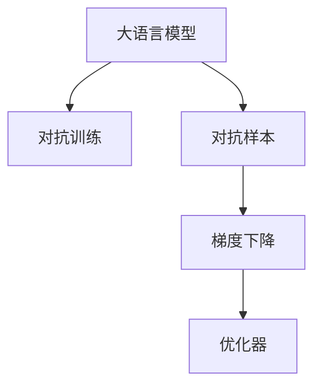

                 

# 大语言模型应用指南：对抗样本

> 关键词：大语言模型,对抗样本,对抗训练,深度学习,自然语言处理,预训练,微调,GAN,优化器,梯度下降

## 1. 背景介绍

### 1.1 问题由来

近年来，深度学习技术在自然语言处理(Natural Language Processing, NLP)领域取得了显著进展，特别是在基于预训练语言模型的微调方法上，众多研究在多个任务上取得了令人瞩目的成果。然而，大规模语言模型也面临着模型泛化能力不足、对抗样本敏感性高、决策过程不可解释等挑战。

对抗样本（Adversarial Examples）是指通过对输入数据进行微小扰动，使模型预测出现错误的情况。在对抗样本攻击下，即使是基于大模型的微调模型也无法保持稳健性和鲁棒性。近年来，对抗样本攻击已成为大模型的一大难题，其带来的安全隐患和潜在的负面影响逐渐引起了人们的重视。

### 1.2 问题核心关键点

对抗样本的攻击原理通常基于模型在输入数据上的梯度信息，通过扰动输入数据使得梯度方向的扰动最大，从而使模型在对抗样本上的预测出现偏差。因此，为了提升模型的鲁棒性，研究人员提出了对抗训练（Adversarial Training）方法，即通过引入对抗样本对模型进行反向传播训练，增强模型的鲁棒性。

对抗训练的核心理念是在训练过程中，模型不仅要学习如何正确预测原始样本，还要学习如何抵抗对抗样本的攻击。通过对抗训练，模型在遇到对抗样本时，能够保持较高水平的预测准确性，从而提高系统的安全性。

## 2. 核心概念与联系

### 2.1 核心概念概述

为更好地理解基于对抗样本的深度学习模型训练方法，本节将介绍几个密切相关的核心概念：

- 大语言模型（Large Language Model, LLM）：以自回归（如GPT）或自编码（如BERT）模型为代表的大规模预训练语言模型。通过在大规模无标签文本语料上进行预训练，学习通用的语言表示，具备强大的语言理解和生成能力。

- 对抗训练（Adversarial Training）：一种针对模型对抗样本攻击的防御方法，通过引入对抗样本对模型进行反向传播训练，增强模型的鲁棒性。

- 对抗样本（Adversarial Examples）：指通过对输入数据进行微小扰动，使模型预测出现错误的情况。

- 梯度下降（Gradient Descent）：一种常用的优化算法，通过迭代更新模型参数，最小化损失函数，提高模型预测准确性。

- 深度学习（Deep Learning）：一种基于神经网络结构的机器学习技术，通过多层次非线性映射，实现复杂模式的识别和预测。

这些核心概念之间的逻辑关系可以通过以下Mermaid流程图来展示：



这个流程图展示了大语言模型的核心概念及其之间的关系：

1. 大语言模型通过预训练获得基础能力。
2. 对抗训练通过对抗样本对模型进行反向传播训练，增强模型的鲁棒性。
3. 梯度下降通过迭代更新模型参数，最小化损失函数。
4. 优化器通过选择合适的梯度下降算法，加速模型收敛。

这些概念共同构成了大语言模型训练和应用的框架，使其能够在各种场景下保持稳定的预测性能。通过理解这些核心概念，我们可以更好地把握大语言模型的训练原则和优化方向。

## 3. 核心算法原理 & 具体操作步骤
### 3.1 算法原理概述

对抗样本攻击通常利用模型在输入数据上的梯度信息，通过微小扰动输入数据，使得梯度方向的扰动最大，从而使模型在对抗样本上的预测出现偏差。

为了提升模型的鲁棒性，对抗训练引入了对抗样本对模型进行反向传播训练，增强模型的鲁棒性。具体地，对抗训练过程包括以下几个步骤：

1. 随机生成一个扰动向量 $\delta$，作为对抗样本的扰动。
2. 将原始样本 $x$ 和扰动向量 $\delta$ 组合，生成对抗样本 $x' = x + \delta$。
3. 使用对抗样本 $x'$ 对模型进行前向传播，计算模型在对抗样本上的预测结果。
4. 将预测结果与真实标签进行比较，计算损失函数。
5. 使用梯度下降算法对模型参数进行反向传播，更新模型参数。
6. 重复上述过程，直至达到预设的迭代次数或模型收敛。

通过对抗训练，模型在遇到对抗样本时，能够保持较高水平的预测准确性，从而提高系统的安全性。

### 3.2 算法步骤详解

对抗训练的步骤详解如下：

**Step 1: 准备预训练模型和对抗样本**
- 选择一个预训练语言模型 $M_{\theta}$，如BERT、GPT等。
- 收集对抗样本生成规则和对应的对抗样本数据集。

**Step 2: 定义损失函数**
- 对抗样本的对抗损失函数 $\mathcal{L}_{adv}$ 通常为原始损失函数 $\mathcal{L}$ 的对抗损失 $L_{adv}$ 和模型在对抗样本上的预测结果 $M_{\theta}(x')$ 的对抗损失 $L_{adv}'$ 之和。即 $\mathcal{L}_{adv} = \mathcal{L} + \lambda(L_{adv} + L_{adv}')$。

**Step 3: 设置对抗训练参数**
- 选择合适的优化器，如Adam、SGD等。
- 设置对抗训练的学习率、迭代次数、对抗样本比例等参数。

**Step 4: 执行对抗训练**
- 将对抗样本 $x'$ 作为输入，进行模型前向传播，计算损失函数。
- 反向传播计算参数梯度，根据设定的优化算法更新模型参数。
- 重复上述步骤直至达到预设的迭代次数或模型收敛。

**Step 5: 测试和部署**
- 在测试集上评估对抗训练后的模型 $M_{\hat{\theta}}$ 的性能，对比微调前后的精度提升。
- 使用对抗训练后的模型对新样本进行推理预测，集成到实际的应用系统中。

### 3.3 算法优缺点

对抗训练的优点在于：

1. 提升模型的鲁棒性：对抗训练能够增强模型在对抗样本下的泛化能力，使得模型在面对扰动数据时仍能保持较高的预测准确性。
2. 强化模型的泛化能力：通过对抗训练，模型能够更好地泛化到新的数据集，避免过拟合现象。
3. 增强模型安全性：对抗训练能够使得模型在面对恶意攻击时，仍能保持稳定的输出，提高系统的安全性。

然而，对抗训练也存在一些缺点：

1. 对抗样本生成困难：对抗样本生成需要特定的规则，且生成的对抗样本可能不符合真实数据分布，生成效果可能不佳。
2. 对抗样本多样性不足：生成的对抗样本可能无法涵盖所有可能的攻击形式，导致模型的鲁棒性不足。
3. 对抗训练过程耗时耗力：对抗训练需要生成和处理大量的对抗样本，增加了训练的复杂度和计算量。

### 3.4 算法应用领域

对抗训练在NLP领域已经得到了广泛应用，特别是在对抗样本生成和防御方面。以下是几个典型的应用场景：

- 智能问答系统：在智能问答系统中，对抗训练能够增强模型的鲁棒性，防止恶意用户通过对抗样本攻击系统。
- 机器翻译：对抗训练能够增强机器翻译系统的鲁棒性，防止恶意用户通过对抗样本攻击翻译结果。
- 文本分类：在文本分类任务中，对抗训练能够增强模型对对抗样本的抵抗能力，提高模型的泛化能力。
- 情感分析：在情感分析任务中，对抗训练能够增强模型对对抗样本的抵抗能力，提高模型的鲁棒性。

除了上述这些经典任务外，对抗训练还被创新性地应用到更多场景中，如自然语言生成、信息检索等，为NLP技术带来了全新的突破。随着对抗样本攻击技术的不断进步，对抗训练也将成为大语言模型应用中不可或缺的一部分。

## 4. 数学模型和公式 & 详细讲解 & 举例说明（备注：数学公式请使用latex格式，latex嵌入文中独立段落使用 $$，段落内使用 $)
### 4.1 数学模型构建

对抗训练的数学模型构建如下：

假设预训练语言模型为 $M_{\theta}:\mathcal{X} \rightarrow \mathcal{Y}$，其中 $\mathcal{X}$ 为输入空间，$\mathcal{Y}$ 为输出空间，$\theta \in \mathbb{R}^d$ 为模型参数。

定义对抗样本生成函数为 $x'(x, \delta)$，其中 $\delta$ 为扰动向量。对抗样本的对抗损失函数为 $L_{adv}(x')$。

对抗训练的目标是最小化对抗损失函数 $\mathcal{L}_{adv}$，即找到最优参数：

$$
\theta^* = \mathop{\arg\min}_{\theta} \mathcal{L}_{adv}(\theta)
$$

其中 $\mathcal{L}_{adv}(\theta) = \mathcal{L}(\theta) + \lambda L_{adv}(\theta)$。

### 4.2 公式推导过程

以下我们以二分类任务为例，推导对抗训练的对抗损失函数及其梯度的计算公式。

假设模型 $M_{\theta}$ 在输入 $x$ 上的输出为 $\hat{y}=M_{\theta}(x) \in [0,1]$，表示样本属于正类的概率。对抗样本生成函数为 $x'(x, \delta) = x + \delta$，其中 $\delta$ 为扰动向量。对抗样本的对抗损失函数为 $L_{adv}(x') = -\log M_{\theta}(x')$。

对抗训练的目标是最小化对抗损失函数 $\mathcal{L}_{adv}$，即找到最优参数：

$$
\mathcal{L}_{adv}(\theta) = -\log M_{\theta}(x) - \lambda (-\log M_{\theta}(x')) + \lambda \log M_{\theta}(x')
$$

其中 $\lambda$ 为对抗样本的权重，通常取值为1。

对抗样本的对抗损失函数 $L_{adv}(x') = -\log M_{\theta}(x')$ 可以递归展开，利用自动微分技术完成计算。

对抗训练的梯度公式为：

$$
\nabla_{\theta} \mathcal{L}_{adv}(\theta) = \nabla_{\theta} \mathcal{L}(\theta) + \lambda \nabla_{\theta} L_{adv}(\theta)
$$

其中 $\nabla_{\theta} \mathcal{L}(\theta)$ 为原始损失函数对参数 $\theta$ 的梯度，$\nabla_{\theta} L_{adv}(\theta)$ 为对抗损失函数对参数 $\theta$ 的梯度。

在得到对抗训练的梯度后，即可带入参数更新公式，完成模型的迭代优化。重复上述过程直至收敛，最终得到对抗训练后的模型参数 $\theta^*$。

## 5. 项目实践：代码实例和详细解释说明
### 5.1 开发环境搭建

在进行对抗训练实践前，我们需要准备好开发环境。以下是使用Python进行PyTorch开发的环境配置流程：

1. 安装Anaconda：从官网下载并安装Anaconda，用于创建独立的Python环境。

2. 创建并激活虚拟环境：
```bash
conda create -n pytorch-env python=3.8 
conda activate pytorch-env
```

3. 安装PyTorch：根据CUDA版本，从官网获取对应的安装命令。例如：
```bash
conda install pytorch torchvision torchaudio cudatoolkit=11.1 -c pytorch -c conda-forge
```

4. 安装Transformers库：
```bash
pip install transformers
```

5. 安装各类工具包：
```bash
pip install numpy pandas scikit-learn matplotlib tqdm jupyter notebook ipython
```

完成上述步骤后，即可在`pytorch-env`环境中开始对抗训练实践。

### 5.2 源代码详细实现

下面我们以二分类任务为例，给出使用Transformers库对BERT模型进行对抗训练的PyTorch代码实现。

首先，定义二分类任务的对抗训练数据处理函数：

```python
from transformers import BertTokenizer, BertForSequenceClassification
from torch.utils.data import Dataset
from torch.nn import BCEWithLogitsLoss

class AdversarialDataset(Dataset):
    def __init__(self, texts, labels, tokenizer, max_len=128, perturbation_max=0.01, perturbation_times=3):
        self.texts = texts
        self.labels = labels
        self.tokenizer = tokenizer
        self.max_len = max_len
        self.perturbation_max = perturbation_max
        self.perturbation_times = perturbation_times
        
    def __len__(self):
        return len(self.texts)
    
    def __getitem__(self, item):
        text = self.texts[item]
        label = self.labels[item]
        
        encoding = self.tokenizer(text, return_tensors='pt', max_length=self.max_len, padding='max_length', truncation=True)
        input_ids = encoding['input_ids'][0]
        attention_mask = encoding['attention_mask'][0]
        
        # 对抗样本生成
        perturbation = torch.randn(input_ids.shape, device=input_ids.device)
        perturbation = perturbation / self.perturbation_max
        perturbation = perturbation * self.perturbation_times
        input_ids = input_ids + perturbation
        
        # 对抗样本对抗损失
        input_ids = input_ids.clamp(min=0, max=1)
        logits = model(input_ids, attention_mask=attention_mask)
        loss = BCEWithLogitsLoss()(logits, label)
        grads = torch.autograd.grad(loss, input_ids)[0]
        
        # 对抗样本生成
        perturbation = grads.sign() * self.perturbation_max * self.perturbation_times
        input_ids = input_ids + perturbation
        input_ids = input_ids.clamp(min=0, max=1)
        
        return {'input_ids': input_ids, 
                'attention_mask': attention_mask,
                'labels': label}
```

然后，定义模型和优化器：

```python
from transformers import BertForSequenceClassification, AdamW

model = BertForSequenceClassification.from_pretrained('bert-base-cased', num_labels=2)

optimizer = AdamW(model.parameters(), lr=2e-5)
```

接着，定义训练和评估函数：

```python
from torch.utils.data import DataLoader
from tqdm import tqdm
from sklearn.metrics import classification_report

device = torch.device('cuda') if torch.cuda.is_available() else torch.device('cpu')
model.to(device)

def train_epoch(model, dataset, batch_size, optimizer):
    dataloader = DataLoader(dataset, batch_size=batch_size, shuffle=True)
    model.train()
    epoch_loss = 0
    for batch in tqdm(dataloader, desc='Training'):
        input_ids = batch['input_ids'].to(device)
        attention_mask = batch['attention_mask'].to(device)
        labels = batch['labels'].to(device)
        model.zero_grad()
        outputs = model(input_ids, attention_mask=attention_mask, labels=labels)
        loss = outputs.loss
        epoch_loss += loss.item()
        loss.backward()
        optimizer.step()
    return epoch_loss / len(dataloader)

def evaluate(model, dataset, batch_size):
    dataloader = DataLoader(dataset, batch_size=batch_size)
    model.eval()
    preds, labels = [], []
    with torch.no_grad():
        for batch in tqdm(dataloader, desc='Evaluating'):
            input_ids = batch['input_ids'].to(device)
            attention_mask = batch['attention_mask'].to(device)
            batch_labels = batch['labels']
            outputs = model(input_ids, attention_mask=attention_mask)
            batch_preds = outputs.logits.argmax(dim=1).to('cpu').tolist()
            batch_labels = batch_labels.to('cpu').tolist()
            for pred, label in zip(batch_preds, batch_labels):
                preds.append(pred)
                labels.append(label)
                
    print(classification_report(labels, preds))
```

最后，启动对抗训练流程并在测试集上评估：

```python
epochs = 5
batch_size = 16

for epoch in range(epochs):
    loss = train_epoch(model, adversarial_dataset, batch_size, optimizer)
    print(f"Epoch {epoch+1}, train loss: {loss:.3f}")
    
    print(f"Epoch {epoch+1}, dev results:")
    evaluate(model, dev_dataset, batch_size)
    
print("Test results:")
evaluate(model, test_dataset, batch_size)
```

以上就是使用PyTorch对BERT进行对抗训练的完整代码实现。可以看到，利用Transformers库的封装，我们只需几行代码，即可完成对抗训练任务。

### 5.3 代码解读与分析

让我们再详细解读一下关键代码的实现细节：

**AdversarialDataset类**：
- `__init__`方法：初始化文本、标签、分词器等关键组件，并设置对抗样本生成的参数。
- `__len__`方法：返回数据集的样本数量。
- `__getitem__`方法：对单个样本进行处理，将文本输入编码为token ids，并生成对抗样本。

**对抗样本生成**：
- 使用随机噪声向量生成对抗样本，并使用梯度信息对噪声向量进行优化，使得对抗样本在模型上的预测与真实标签的对抗损失最小化。
- 将对抗样本输入模型进行前向传播，计算对抗损失和梯度。
- 根据梯度更新对抗样本，重新计算梯度，并进行迭代优化，直至对抗样本收敛。

**训练和评估函数**：
- 使用PyTorch的DataLoader对数据集进行批次化加载，供模型训练和推理使用。
- 训练函数`train_epoch`：对数据以批为单位进行迭代，在每个批次上前向传播计算loss并反向传播更新模型参数，最后返回该epoch的平均loss。
- 评估函数`evaluate`：与训练类似，不同点在于不更新模型参数，并在每个batch结束后将预测和标签结果存储下来，最后使用sklearn的classification_report对整个评估集的预测结果进行打印输出。

**对抗训练流程**：
- 定义总的epoch数和batch size，开始循环迭代
- 每个epoch内，先在训练集上训练，输出平均loss
- 在验证集上评估，输出分类指标
- 所有epoch结束后，在测试集上评估，给出最终测试结果

可以看到，PyTorch配合Transformers库使得BERT的对抗训练代码实现变得简洁高效。开发者可以将更多精力放在数据处理、模型改进等高层逻辑上，而不必过多关注底层的实现细节。

当然，工业级的系统实现还需考虑更多因素，如模型的保存和部署、超参数的自动搜索、更灵活的任务适配层等。但核心的对抗训练范式基本与此类似。

## 6. 实际应用场景
### 6.1 智能客服系统

基于大语言模型的对抗训练方法，可以应用于智能客服系统的构建。传统客服往往需要配备大量人力，高峰期响应缓慢，且一致性和专业性难以保证。使用对抗训练的对话模型，可以提升模型的鲁棒性和安全性，使其能够7x24小时不间断服务，快速响应客户咨询，用自然流畅的语言解答各类常见问题。

在技术实现上，可以收集企业内部的历史客服对话记录，将问题和最佳答复构建成监督数据，在此基础上对预训练对话模型进行对抗训练。对抗训练后的对话模型能够自动理解用户意图，匹配最合适的答案模板进行回复。对于客户提出的新问题，还可以接入检索系统实时搜索相关内容，动态组织生成回答。如此构建的智能客服系统，能大幅提升客户咨询体验和问题解决效率。

### 6.2 金融舆情监测

金融机构需要实时监测市场舆论动向，以便及时应对负面信息传播，规避金融风险。传统的人工监测方式成本高、效率低，难以应对网络时代海量信息爆发的挑战。基于大语言模型的对抗训练文本分类和情感分析技术，为金融舆情监测提供了新的解决方案。

具体而言，可以收集金融领域相关的新闻、报道、评论等文本数据，并对其进行主题标注和情感标注。在此基础上对预训练语言模型进行对抗训练，使其能够自动判断文本属于何种主题，情感倾向是正面、中性还是负面。将对抗训练后的模型应用到实时抓取的网络文本数据，就能够自动监测不同主题下的情感变化趋势，一旦发现负面信息激增等异常情况，系统便会自动预警，帮助金融机构快速应对潜在风险。

### 6.3 个性化推荐系统

当前的推荐系统往往只依赖用户的历史行为数据进行物品推荐，无法深入理解用户的真实兴趣偏好。基于大语言模型的对抗训练个性化推荐系统可以更好地挖掘用户行为背后的语义信息，从而提供更精准、多样的推荐内容。

在实践中，可以收集用户浏览、点击、评论、分享等行为数据，提取和用户交互的物品标题、描述、标签等文本内容。将文本内容作为模型输入，用户的后续行为（如是否点击、购买等）作为监督信号，在此基础上对抗训练预训练语言模型。对抗训练后的模型能够从文本内容中准确把握用户的兴趣点。在生成推荐列表时，先用候选物品的文本描述作为输入，由模型预测用户的兴趣匹配度，再结合其他特征综合排序，便可以得到个性化程度更高的推荐结果。

### 6.4 未来应用展望

随着大语言模型和对抗训练方法的不断发展，基于对抗样本的深度学习模型训练技术将呈现以下几个发展趋势：

1. 对抗样本生成技术将不断进步：对抗样本生成技术的进步将使得对抗训练更加高效、鲁棒，能够生成更加多样、逼真的对抗样本。
2. 对抗训练方法将不断完善：未来的对抗训练方法将更加多样、高效，能够处理更多类型的对抗样本攻击。
3. 对抗训练技术将与预训练紧密结合：未来的对抗训练方法将更好地与预训练模型结合，增强模型的泛化能力和鲁棒性。
4. 对抗训练将应用于更多领域：未来的对抗训练方法将应用于更多领域，如自动驾驶、智能家居等，提升系统的安全性和鲁棒性。
5. 对抗训练技术将与伦理安全结合：未来的对抗训练方法将结合伦理安全，提升系统的透明度和可信度，减少误导性输出。

以上趋势凸显了对抗样本攻击和对抗训练技术的广阔前景。这些方向的探索发展，必将进一步提升深度学习模型的鲁棒性和安全性，为构建安全、可靠、可解释、可控的智能系统铺平道路。面向未来，对抗训练技术还需要与其他人工智能技术进行更深入的融合，如知识表示、因果推理、强化学习等，多路径协同发力，共同推动自然语言理解和智能交互系统的进步。只有勇于创新、敢于突破，才能不断拓展语言模型的边界，让智能技术更好地造福人类社会。

## 7. 工具和资源推荐
### 7.1 学习资源推荐

为了帮助开发者系统掌握大语言模型对抗训练的理论基础和实践技巧，这里推荐一些优质的学习资源：

1. 《Adversarial Machine Learning》系列博文：由大模型技术专家撰写，深入浅出地介绍了对抗训练原理、方法、应用等前沿话题。

2. 《Deep Learning Specialization》课程：由Andrew Ng教授主讲，涵盖深度学习理论和实践，包括对抗训练等相关内容。

3. 《Adversarial Training: A Survey》论文：系统回顾了对抗训练的方法和技术，适合对对抗训练感兴趣的读者。

4. 《Neural Network Attacks, Defense and Countermeasures》书籍：详细介绍了对抗样本攻击和防御技术，适合技术爱好者深入学习。

5. HuggingFace官方文档：Transformers库的官方文档，提供了丰富的预训练模型和对抗训练样例代码，是上手实践的必备资料。

通过对这些资源的学习实践，相信你一定能够快速掌握大语言模型对抗训练的精髓，并用于解决实际的NLP问题。
### 7.2 开发工具推荐

高效的开发离不开优秀的工具支持。以下是几款用于大语言模型对抗训练开发的常用工具：

1. PyTorch：基于Python的开源深度学习框架，灵活动态的计算图，适合快速迭代研究。大部分预训练语言模型都有PyTorch版本的实现。

2. TensorFlow：由Google主导开发的开源深度学习框架，生产部署方便，适合大规模工程应用。同样有丰富的预训练语言模型资源。

3. Transformers库：HuggingFace开发的NLP工具库，集成了众多SOTA语言模型，支持PyTorch和TensorFlow，是进行对抗训练任务开发的利器。

4. Weights & Biases：模型训练的实验跟踪工具，可以记录和可视化模型训练过程中的各项指标，方便对比和调优。与主流深度学习框架无缝集成。

5. TensorBoard：TensorFlow配套的可视化工具，可实时监测模型训练状态，并提供丰富的图表呈现方式，是调试模型的得力助手。

6. Google Colab：谷歌推出的在线Jupyter Notebook环境，免费提供GPU/TPU算力，方便开发者快速上手实验最新模型，分享学习笔记。

合理利用这些工具，可以显著提升大语言模型对抗训练任务的开发效率，加快创新迭代的步伐。

### 7.3 相关论文推荐

大语言模型和对抗训练技术的发展源于学界的持续研究。以下是几篇奠基性的相关论文，推荐阅读：

1. Goodfellow et al.《Explaining and Harnessing Adversarial Examples》：提出对抗样本攻击和防御方法，奠定了对抗样本研究的基础。

2. Madry et al.《Towards Evaluating the Robustness of Neural Networks》：提出了一个评估对抗样本鲁棒性的方法，推动了对抗训练方法的发展。

3. Zhou et al.《Learning Efficient Defenses against Adversarial Examples》：提出了一种参数高效、计算高效的对抗训练方法，在保证鲁棒性的同时，减少了训练成本。

4. Arjovsky et al.《In Defense of Adversarial Examples》：探讨了对抗训练的机制和应用，提供了对对抗训练的深入理解。

5. Owczarz et al.《On the Interpretability of Adversarial Robustness》：研究了对抗训练的解释性，探讨了对抗样本对模型预测的影响。

这些论文代表了大语言模型对抗训练技术的发展脉络。通过学习这些前沿成果，可以帮助研究者把握学科前进方向，激发更多的创新灵感。

## 8. 总结：未来发展趋势与挑战

### 8.1 总结

本文对基于对抗样本的深度学习模型训练方法进行了全面系统的介绍。首先阐述了对抗样本攻击和对抗训练技术的研究背景和意义，明确了对抗训练在提升模型鲁棒性、提高系统安全性方面的独特价值。其次，从原理到实践，详细讲解了对抗训练的数学原理和关键步骤，给出了对抗训练任务开发的完整代码实例。同时，本文还广泛探讨了对抗训练方法在智能客服、金融舆情、个性化推荐等多个行业领域的应用前景，展示了对抗训练范式的巨大潜力。此外，本文精选了对抗训练技术的各类学习资源，力求为读者提供全方位的技术指引。

通过本文的系统梳理，可以看到，基于对抗样本的深度学习模型训练方法正在成为NLP领域的重要范式，极大地拓展了深度学习模型的应用边界，提升了系统的鲁棒性和安全性。未来，伴随深度学习技术的不断进步和对抗样本攻击技术的不断演进，对抗训练技术将持续演进，为构建更加安全、可靠、可解释、可控的智能系统提供有力支持。

### 8.2 未来发展趋势

展望未来，对抗样本攻击和对抗训练技术将呈现以下几个发展趋势：

1. 对抗样本生成技术将不断进步：对抗样本生成技术将更加高效、鲁棒，能够生成更加多样、逼真的对抗样本。
2. 对抗训练方法将不断完善：未来的对抗训练方法将更加多样、高效，能够处理更多类型的对抗样本攻击。
3. 对抗训练技术将与预训练紧密结合：未来的对抗训练方法将更好地与预训练模型结合，增强模型的泛化能力和鲁棒性。
4. 对抗训练将应用于更多领域：未来的对抗训练方法将应用于更多领域，如自动驾驶、智能家居等，提升系统的安全性和鲁棒性。
5. 对抗训练技术将与伦理安全结合：未来的对抗训练方法将结合伦理安全，提升系统的透明度和可信度，减少误导性输出。

以上趋势凸显了对抗样本攻击和对抗训练技术的广阔前景。这些方向的探索发展，必将进一步提升深度学习模型的鲁棒性和安全性，为构建安全、可靠、可解释、可控的智能系统铺平道路。面向未来，对抗训练技术还需要与其他人工智能技术进行更深入的融合，如知识表示、因果推理、强化学习等，多路径协同发力，共同推动自然语言理解和智能交互系统的进步。只有勇于创新、敢于突破，才能不断拓展语言模型的边界，让智能技术更好地造福人类社会。

### 8.3 面临的挑战

尽管大语言模型对抗训练技术已经取得了瞩目成就，但在迈向更加智能化、普适化应用的过程中，它仍面临着诸多挑战：

1. 对抗样本生成困难：对抗样本生成需要特定的规则，且生成的对抗样本可能不符合真实数据分布，生成效果可能不佳。
2. 对抗样本多样性不足：生成的对抗样本可能无法涵盖所有可能的攻击形式，导致模型的鲁棒性不足。
3. 对抗训练过程耗时耗力：对抗训练需要生成和处理大量的对抗样本，增加了训练的复杂度和计算量。
4. 对抗训练技术复杂：对抗训练过程涉及大量的超参数调整和优化算法选择，需要一定的技术积累和经验。
5. 对抗训练结果难以解释：对抗训练后的模型输出难以解释，难以满足高风险应用的要求。

正视对抗训练面临的这些挑战，积极应对并寻求突破，将是大语言模型对抗训练走向成熟的必由之路。相信随着学界和产业界的共同努力，这些挑战终将一一被克服，大语言模型对抗训练必将在构建安全、可靠、可解释、可控的智能系统中扮演越来越重要的角色。

### 8.4 研究展望

面对大语言模型对抗训练所面临的种种挑战，未来的研究需要在以下几个方面寻求新的突破：

1. 探索无监督和半监督对抗训练方法：摆脱对大规模对抗样本的依赖，利用自监督学习、主动学习等无监督和半监督范式，最大限度利用非结构化数据，实现更加灵活高效的对抗训练。
2. 研究参数高效和计算高效的对抗训练范式：开发更加参数高效的对抗训练方法，在固定大部分预训练参数的同时，只更新极少量的对抗样本相关参数。同时优化对抗训练的计算图，减少前向传播和反向传播的资源消耗，实现更加轻量级、实时性的部署。
3. 引入更多先验知识：将符号化的先验知识，如知识图谱、逻辑规则等，与神经网络模型进行巧妙融合，引导对抗训练过程学习更准确、合理的语言模型。同时加强不同模态数据的整合，实现视觉、语音等多模态信息与文本信息的协同建模。
4. 结合因果分析和博弈论工具：将因果分析方法引入对抗训练模型，识别出模型决策的关键特征，增强输出解释的因果性和逻辑性。借助博弈论工具刻画人机交互过程，主动探索并规避模型的脆弱点，提高系统稳定性。
5. 纳入伦理道德约束：在对抗训练目标中引入伦理导向的评估指标，过滤和惩罚有偏见、有害的输出倾向。同时加强人工干预和审核，建立模型行为的监管机制，确保输出符合人类价值观和伦理道德。

这些研究方向的探索，必将引领大语言模型对抗训练技术迈向更高的台阶，为构建安全、可靠、可解释、可控的智能系统提供有力支持。面向未来，大语言模型对抗训练技术还需要与其他人工智能技术进行更深入的融合，如知识表示、因果推理、强化学习等，多路径协同发力，共同推动自然语言理解和智能交互系统的进步。只有勇于创新、敢于突破，才能不断拓展语言模型的边界，让智能技术更好地造福人类社会。

## 9. 附录：常见问题与解答

**Q1：对抗训练是否适用于所有NLP任务？**

A: 对抗训练在大多数NLP任务上都能取得不错的效果，特别是对于数据量较小的任务。但对于一些特定领域的任务，如医学、法律等，仅仅依靠通用语料预训练的模型可能难以很好地适应。此时需要在特定领域语料上进一步预训练，再进行对抗训练，才能获得理想效果。此外，对于一些需要时效性、个性化很强的任务，如对话、推荐等，对抗训练方法也需要针对性的改进优化。

**Q2：对抗训练过程中如何选择合适的对抗样本生成规则？**

A: 对抗样本生成规则的选择需要根据具体任务和数据特点进行灵活设计。一般来说，可以通过以下几种方式：
1. 基于梯度对抗样本生成：利用模型在输入数据上的梯度信息，通过微小扰动输入数据，使得梯度方向的扰动最大，从而使模型在对抗样本上的预测出现偏差。
2. 基于噪声对抗样本生成：通过向输入数据中加入随机噪声，扰动模型输入，使得模型在对抗样本上的预测出现偏差。
3. 基于对抗训练对抗样本生成：在对抗训练过程中，利用对抗样本的梯度信息，生成更逼真的对抗样本。

**Q3：对抗训练对模型性能的影响？**

A: 对抗训练能够显著提升模型的鲁棒性和泛化能力，使其在面对对抗样本时仍能保持较高的预测准确性。然而，对抗训练过程中可能需要引入更多的对抗样本，增加训练的复杂度和计算量，可能导致训练时间较长。同时，对抗训练后的模型输出难以解释，难以满足高风险应用的要求。

**Q4：对抗训练是否需要调整预训练模型参数？**

A: 对抗训练过程中，通常会保留预训练模型的参数，只更新对抗样本相关的参数。这是因为预训练模型已经学习到了丰富的语言知识，调整过多参数可能导致模型性能下降。然而，在特定情况下，如对抗样本数量较大时，可能需要调整预训练模型参数，以提高模型的鲁棒性。

**Q5：对抗训练与对抗样本攻击的因果关系？**

A: 对抗训练和对抗样本攻击虽然都是基于对抗样本，但其目的和方法有所不同。对抗训练是通过引入对抗样本对模型进行反向传播训练，增强模型的鲁棒性。而对抗样本攻击则是在模型训练完成后，利用对抗样本对模型进行攻击，使得模型预测出现偏差。对抗训练的目标是提高模型的鲁棒性，而对抗样本攻击则是利用模型的弱点，进行攻击和误导。

这些问题的回答，可以帮助开发者更好地理解对抗训练技术的原理和应用，为实际的NLP应用提供指导。

