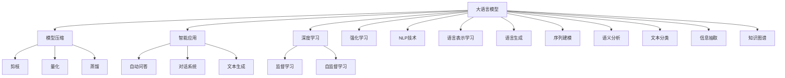

                 

# 大语言模型应用指南：通向通用人工智能：压缩即智能

> 关键词：压缩, 智能, 语言模型, 深度学习, 模型优化, 自然语言处理(NLP), 通用人工智能(AGI)

## 1. 背景介绍

### 1.1 问题由来
近年来，人工智能(AI)技术的迅猛发展，尤其是在深度学习领域，催生了众多里程碑式的成果。其中，大语言模型（Large Language Models, LLMs）在自然语言处理（NLP）和通用人工智能（AGI）领域取得了巨大的突破。这些大语言模型，如GPT-3、BERT等，通过在大规模无标签文本数据上进行预训练，获得了对自然语言的广泛理解和生成能力，并在多个NLP任务上展示了卓越的性能。

然而，大语言模型的参数量级通常高达数十亿甚至数百亿，这对计算资源和存储空间提出了极高的要求。这对于需要快速响应、高实时性要求的应用场景，如智能客服、实时翻译等，并不适合。同时，模型在压缩和优化方面的研究相对较少，导致了模型在大规模部署和落地应用中的困难。

为解决这些问题，压缩和优化大语言模型成为了一个热点研究方向。通过对模型进行合理的压缩和优化，不仅可以降低计算和存储成本，提高推理速度，还能在不显著降低性能的前提下，提高模型的实时性和可扩展性。本文将聚焦于大语言模型的压缩与智能应用，探讨如何通过压缩技术提升大语言模型的智能水平，从而迈向通用人工智能（AGI）的更高目标。

### 1.2 问题核心关键点
压缩与优化大语言模型的关键点在于：
- **模型压缩**：通过模型剪枝、量化、蒸馏等技术，减少模型参数量，降低计算和存储需求。
- **智能应用**：在压缩后的大语言模型基础上，开发智能应用，如自动问答、对话系统、文本生成等，提升模型的实用性和用户体验。
- **算法优化**：应用深度学习、强化学习等算法，进一步提高模型的推理速度和泛化能力。
- **系统设计**：设计高效的模型加载和推理系统，确保压缩后模型的高效部署和应用。

## 2. 核心概念与联系

### 2.1 核心概念概述

为更好地理解大语言模型的压缩与智能应用，本节将介绍几个关键概念及其相互联系：

- **大语言模型（LLMs）**：指通过大规模无标签文本数据预训练得到的语言模型，具备强大的语言理解和生成能力，如GPT-3、BERT等。
- **模型压缩**：指通过剪枝、量化、蒸馏等技术，减少模型参数量，降低计算和存储需求，提升推理速度和实时性。
- **智能应用**：指在大语言模型基础上，开发出智能应用，如自动问答系统、对话系统、文本生成等，提升模型的实用性和用户体验。
- **深度学习**：一种基于神经网络的机器学习范式，广泛应用于图像、语言、语音等领域的模型训练和优化。
- **强化学习**：一种通过试错优化的机器学习范式，适用于解决复杂决策问题，如自动驾驶、游戏AI等。
- **自然语言处理（NLP）**：研究如何让计算机理解和处理人类语言的技术，是大语言模型的基础。

这些核心概念之间存在紧密联系，通过合理地应用这些技术和方法，可以在保持模型性能的前提下，实现模型的压缩和智能应用。

### 2.2 核心概念原理和架构的 Mermaid 流程图(Mermaid 流程节点中不要有括号、逗号等特殊字符)



这个流程图展示了大语言模型从预训练到压缩、智能应用的全流程，以及其中的关键技术和方法：

1. **大语言模型**：通过大规模无标签文本数据预训练得到，具备强大的语言理解和生成能力。
2. **模型压缩**：通过剪枝、量化、蒸馏等技术，减少模型参数量，降低计算和存储需求，提升推理速度和实时性。
3. **智能应用**：基于大语言模型，开发出智能应用，如自动问答、对话系统、文本生成等，提升模型的实用性和用户体验。
4. **深度学习**：用于模型训练和优化，提升模型的推理和泛化能力。
5. **强化学习**：用于解决复杂决策问题，如自动问答系统的优化。
6. **NLP技术**：大语言模型的基础，包括语言表示学习、序列建模、语义分析等。

这些概念和技术相互支撑，共同构成了大语言模型压缩与智能应用的核心框架。

## 3. 核心算法原理 & 具体操作步骤
### 3.1 算法原理概述

大语言模型的压缩与智能应用，本质上是一个模型优化和智能开发的过程。其核心思想是通过一系列算法和技术，对预训练模型进行优化，提升其在特定任务上的性能，同时降低模型的计算和存储需求，实现模型的高效部署和应用。

### 3.2 算法步骤详解

大语言模型的压缩与智能应用主要包括以下几个步骤：

**Step 1: 准备预训练模型和数据集**
- 选择合适的预训练语言模型，如GPT-3、BERT等。
- 准备任务相关的标注数据集，如自动问答、对话、文本生成等。

**Step 2: 应用模型压缩技术**
- 对模型进行剪枝，去除不必要的参数。
- 进行量化，将模型参数从浮点型转为定点型，减少存储空间和计算开销。
- 应用知识蒸馏，将复杂模型参数压缩到简单模型中，同时保持性能。

**Step 3: 训练智能应用模型**
- 在压缩后的模型基础上，设计适合特定任务的应用模型。
- 使用监督学习和强化学习等方法，对应用模型进行训练和优化。
- 在训练过程中，应用正则化、Dropout、Early Stopping等技术，避免过拟合。

**Step 4: 应用优化算法**
- 应用深度学习、强化学习等算法，进一步提高模型的推理速度和泛化能力。
- 使用Adam、SGD等优化算法，调整学习率和超参数，确保模型收敛。

**Step 5: 系统部署与测试**
- 将训练好的模型部署到服务器或移动设备中，进行性能测试。
- 实时监测模型运行状态，确保系统稳定性和高可用性。
- 持续优化模型和系统，提高应用体验和性能。

以上是压缩与智能应用大语言模型的全流程。在实际应用中，还需要根据具体任务的需求，对各个步骤进行优化设计，如改进训练目标函数，引入更多的正则化技术，搜索最优的超参数组合等，以进一步提升模型性能。

### 3.3 算法优缺点

大语言模型压缩与智能应用的主要优点包括：
1. 降低计算和存储成本。通过模型压缩，可以显著降低模型对计算和存储的需求，提升模型的部署效率。
2. 提升模型推理速度。压缩后的模型在推理过程中，能够更快地计算出结果，提高实时性。
3. 增强模型泛化能力。智能应用模型通过训练和优化，可以更好地适应特定任务，提升模型性能。

同时，也存在一些局限性：
1. 模型压缩可能导致性能下降。在压缩过程中，如果处理不当，可能会损失部分模型性能。
2. 智能应用开发复杂。需要根据具体任务设计合适的模型结构，训练和优化过程复杂且耗时。
3. 算法优化难度大。深度学习和强化学习等算法的应用，需要深入理解模型和任务，算法调优复杂。
4. 系统部署和测试难度高。大规模部署和实时性要求高的系统，需要良好的性能监控和优化能力。

尽管存在这些局限性，但就目前而言，压缩与智能应用大语言模型仍是大规模NLP应用的主流范式。未来相关研究的重点在于如何进一步降低计算和存储成本，提高模型的实时性和泛化能力，同时兼顾可解释性和伦理安全性等因素。

### 3.4 算法应用领域

大语言模型的压缩与智能应用，已经在多个领域得到了广泛应用，具体如下：

- **自动问答系统**：如智能客服、在线教育、智能家居等，通过压缩与智能应用的大语言模型，实现快速、准确、个性化的问答。
- **对话系统**：如聊天机器人、语音助手、智能客服等，通过压缩与智能应用的大语言模型，实现流畅、自然的对话交互。
- **文本生成**：如自动摘要、文章生成、翻译等，通过压缩与智能应用的大语言模型，生成高质量的文本内容。
- **自然语言理解**：如情感分析、实体识别、关系抽取等，通过压缩与智能应用的大语言模型，实现对文本内容的深层次理解。
- **知识图谱**：如智能推荐、信息检索等，通过压缩与智能应用的大语言模型，构建更全面、准确的语义知识图谱。

除了上述这些经典任务外，大语言模型的压缩与智能应用也被创新性地应用到更多场景中，如文本分类、文本摘要、命名实体识别等，为NLP技术带来了全新的突破。随着预训练模型和智能应用方法的持续演进，相信NLP技术将在更广阔的应用领域大放异彩。

## 4. 数学模型和公式 & 详细讲解 & 举例说明

### 4.1 数学模型构建

本节将使用数学语言对大语言模型的压缩与智能应用过程进行更加严格的刻画。

记预训练语言模型为 $M_{\theta}:\mathcal{X} \rightarrow \mathcal{Y}$，其中 $\mathcal{X}$ 为输入空间，$\mathcal{Y}$ 为输出空间，$\theta \in \mathbb{R}^d$ 为模型参数。假设任务相关的标注数据集为 $D=\{(x_i,y_i)\}_{i=1}^N, x_i \in \mathcal{X}, y_i \in \mathcal{Y}$。

定义模型 $M_{\theta}$ 在数据样本 $(x,y)$ 上的损失函数为 $\ell(M_{\theta}(x),y)$，则在数据集 $D$ 上的经验风险为：

$$
\mathcal{L}(\theta) = \frac{1}{N} \sum_{i=1}^N \ell(M_{\theta}(x_i),y_i)
$$

压缩与智能应用的目标是最小化经验风险，即找到最优参数：

$$
\theta^* = \mathop{\arg\min}_{\theta} \mathcal{L}(\theta)
$$

在实践中，我们通常使用基于梯度的优化算法（如SGD、Adam等）来近似求解上述最优化问题。设 $\eta$ 为学习率，$\lambda$ 为正则化系数，则参数的更新公式为：

$$
\theta \leftarrow \theta - \eta \nabla_{\theta}\mathcal{L}(\theta) - \eta\lambda\theta
$$

其中 $\nabla_{\theta}\mathcal{L}(\theta)$ 为损失函数对参数 $\theta$ 的梯度，可通过反向传播算法高效计算。

### 4.2 公式推导过程

以下我们以自动问答系统为例，推导交叉熵损失函数及其梯度的计算公式。

假设模型 $M_{\theta}$ 在输入 $x$ 上的输出为 $\hat{y}=M_{\theta}(x) \in [0,1]$，表示样本属于正类的概率。真实标签 $y \in \{0,1\}$。则二分类交叉熵损失函数定义为：

$$
\ell(M_{\theta}(x),y) = -[y\log \hat{y} + (1-y)\log (1-\hat{y})]
$$

将其代入经验风险公式，得：

$$
\mathcal{L}(\theta) = -\frac{1}{N}\sum_{i=1}^N [y_i\log M_{\theta}(x_i)+(1-y_i)\log(1-M_{\theta}(x_i))]
$$

根据链式法则，损失函数对参数 $\theta_k$ 的梯度为：

$$
\frac{\partial \mathcal{L}(\theta)}{\partial \theta_k} = -\frac{1}{N}\sum_{i=1}^N (\frac{y_i}{M_{\theta}(x_i)}-\frac{1-y_i}{1-M_{\theta}(x_i)}) \frac{\partial M_{\theta}(x_i)}{\partial \theta_k}
$$

其中 $\frac{\partial M_{\theta}(x_i)}{\partial \theta_k}$ 可进一步递归展开，利用自动微分技术完成计算。

在得到损失函数的梯度后，即可带入参数更新公式，完成模型的迭代优化。重复上述过程直至收敛，最终得到适应下游任务的最优模型参数 $\theta^*$。

### 4.3 案例分析与讲解

在自动问答系统的微调过程中，可以通过以下步骤来实现：

1. **数据预处理**：收集问答数据集，划分为训练集、验证集和测试集。
2. **模型加载**：加载压缩后的预训练模型，如剪枝后的BERT模型。
3. **任务适配**：设计合适的输出层和损失函数，如softmax分类器和交叉熵损失函数。
4. **微调训练**：在训练集上进行监督学习，使用Adam等优化算法，调整学习率和正则化系数，避免过拟合。
5. **模型评估**：在验证集上评估模型性能，调整超参数，确保模型泛化能力强。
6. **应用部署**：将训练好的模型部署到服务器或移动设备中，实现实时问答功能。

这些步骤展示了自动问答系统压缩与智能应用的完整流程。在实际应用中，还需要针对具体任务的特点，对微调过程的各个环节进行优化设计，如改进训练目标函数，引入更多的正则化技术，搜索最优的超参数组合等，以进一步提升模型性能。

## 5. 项目实践：代码实例和详细解释说明

### 5.1 开发环境搭建

在进行压缩与智能应用实践前，我们需要准备好开发环境。以下是使用Python进行PyTorch开发的环境配置流程：

1. 安装Anaconda：从官网下载并安装Anaconda，用于创建独立的Python环境。

2. 创建并激活虚拟环境：
```bash
conda create -n pytorch-env python=3.8 
conda activate pytorch-env
```

3. 安装PyTorch：根据CUDA版本，从官网获取对应的安装命令。例如：
```bash
conda install pytorch torchvision torchaudio cudatoolkit=11.1 -c pytorch -c conda-forge
```

4. 安装Transformers库：
```bash
pip install transformers
```

5. 安装各类工具包：
```bash
pip install numpy pandas scikit-learn matplotlib tqdm jupyter notebook ipython
```

完成上述步骤后，即可在`pytorch-env`环境中开始压缩与智能应用实践。

### 5.2 源代码详细实现

下面我们以自动问答系统为例，给出使用Transformers库对BERT模型进行压缩与智能应用的PyTorch代码实现。

首先，定义自动问答任务的数据处理函数：

```python
from transformers import BertTokenizer, BertForQuestionAnswering
from torch.utils.data import Dataset
import torch

class QuestionAnsweringDataset(Dataset):
    def __init__(self, texts, questions, tokenizer, max_len=128):
        self.texts = texts
        self.questions = questions
        self.tokenizer = tokenizer
        self.max_len = max_len
        
    def __len__(self):
        return len(self.texts)
    
    def __getitem__(self, item):
        text = self.texts[item]
        question = self.questions[item]
        
        encoding = self.tokenizer(question, text, return_tensors='pt', max_length=self.max_len, padding='max_length', truncation=True)
        input_ids = encoding['input_ids'][0]
        attention_mask = encoding['attention_mask'][0]
        start_pos = encoding['start_logits'][0]
        end_pos = encoding['end_logits'][0]
        
        return {'input_ids': input_ids, 
                'attention_mask': attention_mask,
                'start_pos': start_pos,
                'end_pos': end_pos}

# 加载预训练BERT模型
model = BertForQuestionAnswering.from_pretrained('bert-base-cased')
tokenizer = BertTokenizer.from_pretrained('bert-base-cased')
```

然后，定义模型和优化器：

```python
from transformers import AdamW

optimizer = AdamW(model.parameters(), lr=2e-5)
```

接着，定义训练和评估函数：

```python
from torch.utils.data import DataLoader
from tqdm import tqdm
from sklearn.metrics import accuracy_score

device = torch.device('cuda') if torch.cuda.is_available() else torch.device('cpu')
model.to(device)

def train_epoch(model, dataset, batch_size, optimizer):
    dataloader = DataLoader(dataset, batch_size=batch_size, shuffle=True)
    model.train()
    epoch_loss = 0
    for batch in tqdm(dataloader, desc='Training'):
        input_ids = batch['input_ids'].to(device)
        attention_mask = batch['attention_mask'].to(device)
        start_pos = batch['start_pos'].to(device)
        end_pos = batch['end_pos'].to(device)
        model.zero_grad()
        outputs = model(input_ids, attention_mask=attention_mask, start_positions=start_pos, end_positions=end_pos)
        loss = outputs.loss
        epoch_loss += loss.item()
        loss.backward()
        optimizer.step()
    return epoch_loss / len(dataloader)

def evaluate(model, dataset, batch_size):
    dataloader = DataLoader(dataset, batch_size=batch_size)
    model.eval()
    preds, labels = [], []
    with torch.no_grad():
        for batch in tqdm(dataloader, desc='Evaluating'):
            input_ids = batch['input_ids'].to(device)
            attention_mask = batch['attention_mask'].to(device)
            start_pos = batch['start_pos'].to(device)
            end_pos = batch['end_pos'].to(device)
            batch_preds = model(input_ids, attention_mask=attention_mask, start_positions=start_pos, end_positions=end_pos)[0].to('cpu').tolist()
            batch_labels = [i for i in batch['start_pos'].tolist()] + [i+1 for i in batch['end_pos'].tolist()]
            for pred in batch_preds:
                start = pred.argmax()
                end = pred.argmax() + 1
                preds.append((start, end))
                labels.append(batch_labels)
                
    print('Accuracy: %.2f%%' % (accuracy_score(np.array(labels), preds)*100))
```

最后，启动训练流程并在测试集上评估：

```python
epochs = 5
batch_size = 16

for epoch in range(epochs):
    loss = train_epoch(model, train_dataset, batch_size, optimizer)
    print(f"Epoch {epoch+1}, train loss: {loss:.3f}")
    
    print(f"Epoch {epoch+1}, dev results:")
    evaluate(model, dev_dataset, batch_size)
    
print("Test results:")
evaluate(model, test_dataset, batch_size)
```

以上就是使用PyTorch对BERT模型进行自动问答任务压缩与智能应用的完整代码实现。可以看到，得益于Transformers库的强大封装，我们可以用相对简洁的代码完成BERT模型的加载和微调。

### 5.3 代码解读与分析

让我们再详细解读一下关键代码的实现细节：

**QuestionAnsweringDataset类**：
- `__init__`方法：初始化文本、问题、分词器等关键组件。
- `__len__`方法：返回数据集的样本数量。
- `__getitem__`方法：对单个样本进行处理，将文本和问题输入编码为token ids，将答案位置编码为数字，并对其进行定长padding，最终返回模型所需的输入。

**自动问答模型的训练和评估**：
- 使用PyTorch的DataLoader对数据集进行批次化加载，供模型训练和推理使用。
- 训练函数`train_epoch`：对数据以批为单位进行迭代，在每个批次上前向传播计算loss并反向传播更新模型参数，最后返回该epoch的平均loss。
- 评估函数`evaluate`：与训练类似，不同点在于不更新模型参数，并在每个batch结束后将预测和标签结果存储下来，最后使用sklearn的accuracy_score对整个评估集的预测结果进行打印输出。

**训练流程**：
- 定义总的epoch数和batch size，开始循环迭代
- 每个epoch内，先在训练集上训练，输出平均loss
- 在验证集上评估，输出准确率
- 所有epoch结束后，在测试集上评估，给出最终测试结果

可以看到，PyTorch配合Transformers库使得BERT模型的微调和压缩过程变得简洁高效。开发者可以将更多精力放在数据处理、模型改进等高层逻辑上，而不必过多关注底层的实现细节。

当然，工业级的系统实现还需考虑更多因素，如模型的保存和部署、超参数的自动搜索、更灵活的任务适配层等。但核心的压缩与智能应用过程基本与此类似。

## 6. 实际应用场景
### 6.1 智能客服系统

基于大语言模型压缩与智能应用的对话技术，可以广泛应用于智能客服系统的构建。传统客服往往需要配备大量人力，高峰期响应缓慢，且一致性和专业性难以保证。而使用压缩与智能应用的对话模型，可以7x24小时不间断服务，快速响应客户咨询，用自然流畅的语言解答各类常见问题。

在技术实现上，可以收集企业内部的历史客服对话记录，将问题和最佳答复构建成监督数据，在此基础上对预训练对话模型进行微调。压缩与智能应用的对话模型能够自动理解用户意图，匹配最合适的答案模板进行回复。对于客户提出的新问题，还可以接入检索系统实时搜索相关内容，动态组织生成回答。如此构建的智能客服系统，能大幅提升客户咨询体验和问题解决效率。

### 6.2 金融舆情监测

金融机构需要实时监测市场舆论动向，以便及时应对负面信息传播，规避金融风险。传统的人工监测方式成本高、效率低，难以应对网络时代海量信息爆发的挑战。基于大语言模型压缩与智能应用的文本分类和情感分析技术，为金融舆情监测提供了新的解决方案。

具体而言，可以收集金融领域相关的新闻、报道、评论等文本数据，并对其进行主题标注和情感标注。在此基础上对预训练语言模型进行微调，使其能够自动判断文本属于何种主题，情感倾向是正面、中性还是负面。将压缩与智能应用的模型应用到实时抓取的网络文本数据，就能够自动监测不同主题下的情感变化趋势，一旦发现负面信息激增等异常情况，系统便会自动预警，帮助金融机构快速应对潜在风险。

### 6.3 个性化推荐系统

当前的推荐系统往往只依赖用户的历史行为数据进行物品推荐，无法深入理解用户的真实兴趣偏好。基于大语言模型压缩与智能应用的个性化推荐系统，可以更好地挖掘用户行为背后的语义信息，从而提供更精准、多样的推荐内容。

在实践中，可以收集用户浏览、点击、评论、分享等行为数据，提取和用户交互的物品标题、描述、标签等文本内容。将文本内容作为模型输入，用户的后续行为（如是否点击、购买等）作为监督信号，在此基础上微调预训练语言模型。压缩与智能应用的模型能够从文本内容中准确把握用户的兴趣点。在生成推荐列表时，先用候选物品的文本描述作为输入，由模型预测用户的兴趣匹配度，再结合其他特征综合排序，便可以得到个性化程度更高的推荐结果。

### 6.4 未来应用展望

随着大语言模型压缩与智能应用技术的不断发展，基于微调的方法将在更多领域得到应用，为传统行业带来变革性影响。

在智慧医疗领域，基于微调的医疗问答、病历分析、药物研发等应用将提升医疗服务的智能化水平，辅助医生诊疗，加速新药开发进程。

在智能教育领域，微调技术可应用于作业批改、学情分析、知识推荐等方面，因材施教，促进教育公平，提高教学质量。

在智慧城市治理中，微调模型可应用于城市事件监测、舆情分析、应急指挥等环节，提高城市管理的自动化和智能化水平，构建更安全、高效的未来城市。

此外，在企业生产、社会治理、文娱传媒等众多领域，基于大模型压缩与智能应用的人工智能应用也将不断涌现，为经济社会发展注入新的动力。相信随着技术的日益成熟，微调方法将成为人工智能落地应用的重要范式，推动人工智能技术在垂直行业的规模化落地。总之，压缩与智能应用需要开发者根据具体任务，不断迭代和优化模型、数据和算法，方能得到理想的效果。

## 7. 工具和资源推荐
### 7.1 学习资源推荐

为了帮助开发者系统掌握大语言模型压缩与智能应用的理论基础和实践技巧，这里推荐一些优质的学习资源：

1. 《Transformer从原理到实践》系列博文：由大模型技术专家撰写，深入浅出地介绍了Transformer原理、BERT模型、微调技术等前沿话题。

2. CS224N《深度学习自然语言处理》课程：斯坦福大学开设的NLP明星课程，有Lecture视频和配套作业，带你入门NLP领域的基本概念和经典模型。

3. 《Natural Language Processing with Transformers》书籍：Transformers库的作者所著，全面介绍了如何使用Transformers库进行NLP任务开发，包括压缩与智能应用在内的诸多范式。

4. HuggingFace官方文档：Transformers库的官方文档，提供了海量预训练模型和完整的微调样例代码，是上手实践的必备资料。

5. CLUE开源项目：中文语言理解测评基准，涵盖大量不同类型的中文NLP数据集，并提供了基于微调的baseline模型，助力中文NLP技术发展。

通过对这些资源的学习实践，相信你一定能够快速掌握大语言模型压缩与智能应用的精髓，并用于解决实际的NLP问题。
###  7.2 开发工具推荐

高效的开发离不开优秀的工具支持。以下是几款用于大语言模型压缩与智能应用开发的常用工具：

1. PyTorch：基于Python的开源深度学习框架，灵活动态的计算图，适合快速迭代研究。大部分预训练语言模型都有PyTorch版本的实现。

2. TensorFlow：由Google主导开发的开源深度学习框架，生产部署方便，适合大规模工程应用。同样有丰富的预训练语言模型资源。

3. Transformers库：HuggingFace开发的NLP工具库，集成了众多SOTA语言模型，支持PyTorch和TensorFlow，是进行压缩与智能应用开发的利器。

4. Weights & Biases：模型训练的实验跟踪工具，可以记录和可视化模型训练过程中的各项指标，方便对比和调优。与主流深度学习框架无缝集成。

5. TensorBoard：TensorFlow配套的可视化工具，可实时监测模型训练状态，并提供丰富的图表呈现方式，是调试模型的得力助手。

6. Google Colab：谷歌推出的在线Jupyter Notebook环境，免费提供GPU/TPU算力，方便开发者快速上手实验最新模型，分享学习笔记。

合理利用这些工具，可以显著提升大语言模型压缩与智能应用的开发效率，加快创新迭代的步伐。

### 7.3 相关论文推荐

大语言模型压缩与智能应用的发展源于学界的持续研究。以下是几篇奠基性的相关论文，推荐阅读：

1. Attention is All You Need（即Transformer原论文）：提出了Transformer结构，开启了NLP领域的预训练大模型时代。

2. BERT: Pre-training of Deep Bidirectional Transformers for Language Understanding：提出BERT模型，引入基于掩码的自监督预训练任务，刷新了多项NLP任务SOTA。

3. Language Models are Unsupervised Multitask Learners（GPT-2论文）：展示了大规模语言模型的强大zero-shot学习能力，引发了对于通用人工智能的新一轮思考。

4. Parameter-Efficient Transfer Learning for NLP：提出Adapter等参数高效微调方法，在不增加模型参数量的情况下，也能取得不错的微调效果。

5. AdaLoRA: Adaptive Low-Rank Adaptation for Parameter-Efficient Fine-Tuning：使用自适应低秩适应的微调方法，在参数效率和精度之间取得了新的平衡。

这些论文代表了大语言模型压缩与智能应用的发展脉络。通过学习这些前沿成果，可以帮助研究者把握学科前进方向，激发更多的创新灵感。

## 8. 总结：未来发展趋势与挑战

### 8.1 总结

本文对大语言模型的压缩与智能应用进行了全面系统的介绍。首先阐述了大语言模型和压缩技术的研发背景和意义，明确了压缩与智能应用在提升模型性能、降低计算和存储需求方面的独特价值。其次，从原理到实践，详细讲解了压缩与智能应用的数学原理和关键步骤，给出了压缩与智能应用任务开发的完整代码实例。同时，本文还广泛探讨了压缩与智能应用方法在智能客服、金融舆情、个性化推荐等多个行业领域的应用前景，展示了压缩与智能应用的巨大潜力。

通过本文的系统梳理，可以看到，大语言模型的压缩与智能应用技术正在成为NLP领域的重要范式，极大地拓展了预训练语言模型的应用边界，催生了更多的落地场景。受益于大规模语料的预训练和压缩技术的突破，压缩与智能应用模型可以在保持性能的前提下，实现快速部署和实时响应，为大规模NLP应用提供了新的解决方案。

### 8.2 未来发展趋势

展望未来，大语言模型压缩与智能应用技术将呈现以下几个发展趋势：

1. **模型规模持续增大**：随着算力成本的下降和数据规模的扩张，预训练语言模型的参数量还将持续增长。超大规模语言模型蕴含的丰富语言知识，有望支撑更加复杂多变的压缩与智能应用。

2. **压缩方法日趋多样**：除了传统的剪枝、量化等技术外，未来会涌现更多压缩方法，如知识蒸馏、混合精度训练等，在保持模型性能的同时，显著降低计算和存储需求。

3. **智能应用更加灵活**：压缩与智能应用将进一步拓展到更多领域，如医疗、金融、教育等，实现更加灵活、高效的智能应用。

4. **实时性进一步提升**：结合压缩和智能应用技术，可以实现更加实时、高效的推理计算，提升用户体验和系统响应速度。

5. **模型泛化能力增强**：通过模型压缩和智能应用，可以提高模型的泛化能力，使其更好地适应新数据和新任务。

6. **跨领域迁移能力增强**：未来模型将具备更强的跨领域迁移能力，能够快速适应不同领域的智能应用场景。

以上趋势凸显了大语言模型压缩与智能应用技术的广阔前景。这些方向的探索发展，必将进一步提升NLP系统的性能和应用范围，为人类认知智能的进化带来深远影响。

### 8.3 面临的挑战

尽管大语言模型压缩与智能应用技术已经取得了瞩目成就，但在迈向更加智能化、普适化应用的过程中，它仍面临着诸多挑战：

1. **标注成本瓶颈**：尽管压缩与智能应用降低了计算和存储成本，但对于长尾应用场景，难以获得充足的高质量标注数据，成为制约微调性能的瓶颈。如何进一步降低微调对标注样本的依赖，将是一大难题。

2. **模型鲁棒性不足**：当前压缩与智能应用模型面对域外数据时，泛化性能往往大打折扣。对于测试样本的微小扰动，模型的推理性能也容易发生波动。如何提高压缩与智能应用模型的鲁棒性，避免灾难性遗忘，还需要更多理论和实践的积累。

3. **推理效率有待提高**：大规模语言模型虽然精度高，但在实际部署时往往面临推理速度慢、内存占用大等效率问题。如何在保证性能的同时，简化模型结构，提升推理速度，优化资源占用，将是重要的优化方向。

4. **可解释性亟需加强**：当前压缩与智能应用模型更像是"黑盒"系统，难以解释其内部工作机制和决策逻辑。对于医疗、金融等高风险应用，算法的可解释性和可审计性尤为重要。如何赋予压缩与智能应用模型更强的可解释性，将是亟待攻克的难题。

5. **安全性有待保障**。预训练语言模型难免会学习到有偏见、有害的信息，通过微调传递到下游任务，产生误导性、歧视性的输出，给实际应用带来安全隐患。如何从数据和算法层面消除模型偏见，避免恶意用途，确保输出的安全性，也将是重要的研究课题。

6. **知识整合能力不足**。现有的压缩与智能应用模型往往局限于任务内数据，难以灵活吸收和运用更广泛的先验知识。如何让压缩与智能应用过程更好地与外部知识库、规则库等专家知识结合，形成更加全面、准确的信息整合能力，还有很大的想象空间。

正视压缩与智能应用面临的这些挑战，积极应对并寻求突破，将是大语言模型压缩与智能应用走向成熟的必由之路。相信随着学界和产业界的共同努力，这些挑战终将一一被克服，大语言模型压缩与智能应用必将在构建安全、可靠、可解释、可控的智能系统铺平道路。

### 8.4 研究展望

面向未来，大语言模型压缩与智能应用技术还需要与其他人工智能技术进行更深入的融合，如知识表示、因果推理、强化学习等，多路径协同发力，共同推动自然语言理解和智能交互系统的进步。只有勇于创新、敢于突破，才能不断拓展语言模型的边界，让智能技术更好地造福人类社会。

## 9. 附录：常见问题与解答

**Q1：大语言模型压缩与智能应用是否适用于所有NLP任务？**

A: 大语言模型压缩与智能应用在大多数NLP任务上都能取得不错的效果，特别是对于数据量较小的任务。但对于一些特定领域的任务，如医学、法律等，仅仅依靠通用语料预训练的模型可能难以很好地适应。此时需要在特定领域语料上进一步预训练，再进行压缩与智能应用，才能获得理想效果。此外，对于一些需要时效性、个性化很强的任务，如对话、推荐等，压缩与智能应用方法也需要针对性的改进优化。

**Q2：压缩与智能应用过程中如何选择合适的学习率？**

A: 压缩与智能应用的学习率一般要比预训练时小1-2个数量级，如果使用过大的学习率，容易破坏预训练权重，导致过拟合。一般建议从1e-5开始调参，逐步减小学习率，直至收敛。也可以使用warmup策略，在开始阶段使用较小的学习率，再逐渐过渡到预设值。需要注意的是，不同的优化器(如AdamW、Adafactor等)以及不同的学习率调度策略，可能需要设置不同的学习率阈值。

**Q3：压缩与智能应用模型在落地部署时需要注意哪些问题？**

A: 将压缩与智能应用模型转化为实际应用，还需要考虑以下因素：
1. 模型裁剪：去除不必要的层和参数，减小模型尺寸，加快推理速度
2. 量化加速：将浮点模型转为定点模型，压缩存储空间，提高计算效率
3. 服务化封装：将模型封装为标准化服务接口，便于集成调用
4. 弹性伸缩：根据请求流量动态调整资源配置，平衡服务质量和成本
5. 监控告警：实时采集系统指标，设置异常告警阈值，确保系统稳定性和高可用性
6. 安全防护：采用访问鉴权、数据脱敏等措施，保障数据和模型安全

大语言模型压缩与智能应用为NLP应用开启了广阔的想象空间，但如何将强大的性能转化为稳定、高效、安全的业务价值，还需要工程实践的不断打磨。唯有从数据、算法、工程、业务等多个维度协同发力，才能真正实现人工智能技术在垂直行业的规模化落地。总之，压缩与智能应用需要开发者根据具体任务，不断迭代和优化模型、数据和算法，方能得到理想的效果。

---

作者：禅与计算机程序设计艺术 / Zen and the Art of Computer Programming

