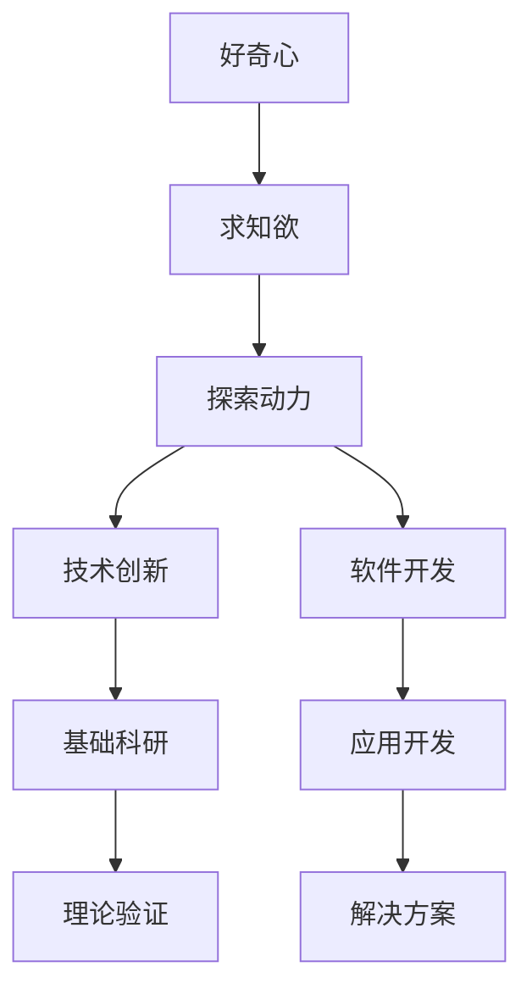

                 

# 好奇心与求知欲：探索的动力

> 关键词：好奇心,求知欲,探索动力,技术创新,软件开发,人工智能

## 1. 背景介绍

### 1.1 问题由来

在当今科技日新月异、信息爆炸的时代，好奇心与求知欲作为探索和创新的重要动力，在推动技术进步和产业发展方面发挥着不可替代的作用。无论是基础科研还是应用开发，都离不开对未知的探索和对知识的渴望。

好奇心推动着人们不断寻求新的知识和技术，求知欲激励着开发者不断解决实际问题。这些内在动力不仅催生了技术革命，也促进了社会进步和人类文明的提升。本文旨在探讨好奇心与求知欲在技术探索中的重要作用，并分析这些动力如何在技术实践中具体体现。

### 1.2 问题核心关键点

好奇心与求知欲的驱动力在于探索未知、追求真理和解决实际问题。在技术创新与开发的过程中，这些动力主要体现在以下几个方面：

- **探索未知领域**：对未知技术和领域的探索，推动了新技术、新方法的产生和发展。
- **追求科学真理**：通过实验验证和理论推导，揭示技术背后的本质规律，提升技术成熟度。
- **解决实际问题**：针对具体应用场景的需求，开发出高效的解决方案，提升用户体验。

## 2. 核心概念与联系

### 2.1 核心概念概述

- **好奇心**：指对未知事物的兴趣和探索欲望。在技术领域，好奇心驱使开发者不断学习新知识，探索新技术。
- **求知欲**：指强烈渴望获取新知识的欲望。在技术开发中，求知欲促使开发者解决实际问题，追求高效和完善的解决方案。
- **探索动力**：好奇心和求知欲共同构成了探索未知、追求真理的动力源泉，推动技术进步和应用创新。

这些核心概念之间的逻辑关系可以通过以下Mermaid流程图来展示：



这个流程图展示了好奇心、求知欲、探索动力和技术创新、软件开发、基础科研、应用开发等概念之间的逻辑关系：

1. 好奇心和求知欲是探索动力的源泉。
2. 探索动力驱使技术创新、软件开发和应用开发等活动。
3. 技术创新和软件开发为解决实际问题提供新的方法和工具。
4. 基础科研和理论验证为技术进步提供科学依据。
5. 应用开发将理论和技术应用于解决具体问题，提升用户体验。

## 3. 核心算法原理 & 具体操作步骤

### 3.1 算法原理概述

在技术探索和开发中，好奇心与求知欲转化为实际的操作过程，即不断地学习和实践。以软件开发为例，这一过程通常包括以下几个关键步骤：

- **需求分析**：基于实际问题，分析用户需求和技术目标。
- **方案设计**：根据需求，设计合理的技术方案。
- **实现与测试**：通过编程实现方案，并进行测试验证。
- **优化与迭代**：根据反馈不断优化方案，进行多次迭代。

这一过程体现了探索动力和技术创新的循环往复，即不断通过实践发现新问题，通过学习新技术解决新问题，从而推动技术进步。

### 3.2 算法步骤详解

以软件开发中的迭代开发模型为例，探索动力和技术创新的操作步骤如下：

1. **需求分析**：
   - 收集用户反馈，明确应用场景和技术目标。
   - 确定项目需求和功能规格。
   - 绘制需求图，描述系统的功能和边界。

2. **方案设计**：
   - 进行技术调研，选择最合适的技术和工具。
   - 设计系统的架构和组件，进行功能模块划分。
   - 制定开发计划和时间表，明确各阶段的目标和任务。

3. **实现与测试**：
   - 按照设计方案进行编码实现。
   - 进行单元测试和集成测试，验证功能的正确性。
   - 修复发现的问题，进行代码优化和性能提升。

4. **优化与迭代**：
   - 收集用户反馈，进行性能和功能的改进。
   - 进行持续集成和持续部署，确保系统稳定运行。
   - 定期回顾项目进展，总结经验教训，进行下一轮迭代。

### 3.3 算法优缺点

探索动力和技术创新在软件开发中的应用具有以下优点：

- **灵活性和适应性**：通过不断迭代，可以灵活应对变化，适应新的需求和技术。
- **高效性和创新性**：通过需求分析和方案设计，可以快速找到最优解决方案，提升开发效率。
- **用户体验优化**：通过用户反馈和测试验证，可以持续优化系统，提升用户体验。

同时，该方法也存在以下局限性：

- **成本和时间投入**：迭代开发需要大量的时间和资源投入，尤其是在初期需求不明晰时。
- **团队协作要求高**：需要团队成员高效协作，进行有效的沟通和任务分配。
- **质量控制难度大**：迭代过程中需要严格的质量控制，否则可能造成系统不稳定和漏洞。

尽管有这些局限性，但迭代开发仍是当前软件开发的主流范式。未来相关研究的重点在于如何进一步优化迭代流程，降低成本和风险，提高开发效率和系统稳定性。

### 3.4 算法应用领域

探索动力和技术创新在软件开发中的应用已经非常广泛，涉及众多领域和行业，例如：

- **企业级应用**：如ERP系统、CRM系统、HR系统等。
- **互联网产品**：如电商网站、社交网络、在线教育等。
- **移动应用**：如手机游戏、智能穿戴设备、移动办公等。
- **物联网设备**：如智能家居、智能交通、工业自动化等。
- **大数据平台**：如数据仓库、数据分析、机器学习等。

这些领域的应用都离不开探索动力和技术创新的驱动，开发者通过不断学习和实践，不断提升系统的性能和用户体验。

## 4. 数学模型和公式 & 详细讲解 & 举例说明

### 4.1 数学模型构建

在软件开发中，探索动力和技术创新主要体现在功能需求和性能需求的定义和实现上。以敏捷开发为例，其数学模型可以表示为：

$$
\begin{aligned}
& \text{功能需求} \rightarrow \text{功能模块} \rightarrow \text{实现代码} \\
& \text{性能需求} \rightarrow \text{性能指标} \rightarrow \text{性能测试}
\end{aligned}
$$

这里，功能需求和性能需求是探索动力的具体体现，功能模块和性能测试是技术创新的具体实现。

### 4.2 公式推导过程

以敏捷开发的Scrum模型为例，其核心公式如下：

$$
\text{Sprint} = \text{Sprint目标} \times \text{Sprint周期} + \text{迭代结果}
$$

其中，Sprint目标是指在每次迭代中需要完成的功能和性能需求，Sprint周期是指迭代的时间长度，迭代结果是每次迭代后新增的功能和性能改进。这一公式展示了通过迭代逐步实现目标的过程。

### 4.3 案例分析与讲解

以一个电子商务网站的开发为例，其探索动力和技术创新的过程如下：

1. **需求分析**：
   - 收集用户反馈，明确网站的核心功能和用户体验目标。
   - 分析市场需求和技术趋势，确定技术方案。

2. **方案设计**：
   - 设计网站的架构和组件，如页面布局、后台逻辑等。
   - 确定技术栈和开发工具，如前端框架、后端语言等。

3. **实现与测试**：
   - 根据设计方案进行编码实现。
   - 进行单元测试和集成测试，验证功能的正确性。

4. **优化与迭代**：
   - 收集用户反馈，进行性能和功能的改进。
   - 进行持续集成和持续部署，确保系统稳定运行。

通过这一过程，不断探索和解决实际问题，网站的功能和性能得以逐步提升，用户体验得到显著改善。

## 5. 项目实践：代码实例和详细解释说明

### 5.1 开发环境搭建

在进行软件开发项目实践前，我们需要准备好开发环境。以下是使用Python进行Django开发的常见环境配置流程：

1. 安装Python：从官网下载并安装Python，确保版本为3.7以上。
2. 安装Django：
```bash
pip install django
```
3. 安装MySQL：
```bash
sudo apt-get install mysql-server
```
4. 安装PgBouncer：
```bash
sudo apt-get install pgbouncer
```
5. 安装SQLite：
```bash
sudo apt-get install sqlite3
```
6. 安装虚拟环境：
```bash
pip install virtualenv
```

### 5.2 源代码详细实现

以下是一个使用Django进行电子商务网站开发的示例代码：

```python
from django.contrib import admin
from django.urls import path, include
from . import views

urlpatterns = [
    path('admin/', admin.site.urls),
    path('product/', include('product.urls')),
    path('', views.index, name='index'),
]
```

### 5.3 代码解读与分析

让我们再详细解读一下关键代码的实现细节：

**views.py文件**：
- `views.index`函数：实现网站的首页展示逻辑。
- `views.product`函数：实现产品详情页展示逻辑。

**urls.py文件**：
- `path('', views.index, name='index')`：将首页URL与`views.index`函数绑定。
- `path('product/', include('product.urls'))`：将产品详情页URL与`product`应用中的URL配置文件绑定。

**admin.py文件**：
- `admin.site.urls`：自动生成后台管理系统的URL配置。

这一代码示例展示了Django开发的基本流程：定义视图函数、配置URL路由、生成后台管理系统。通过这一过程，开发者可以灵活地进行功能开发和性能优化。

### 5.4 运行结果展示

运行上述代码后，生成的网站将展示在首页和产品详情页上。例如，在产品详情页上，展示产品的基本信息、价格和用户评价。用户可以通过点击商品图片或名称，跳转到详细页面，进行详细浏览和购买操作。

## 6. 实际应用场景

### 6.1 企业级应用

探索动力和技术创新在企业级应用中主要体现在系统的扩展和升级上。例如，ERP系统的功能扩展、CRM系统的用户管理和数据分析等方面。企业级应用需要频繁地进行需求变更和性能优化，以适应不断变化的业务需求。

### 6.2 互联网产品

在互联网产品中，探索动力和技术创新主要体现在产品的迭代和新功能的开发上。例如，电商网站的商品推荐系统、社交网络的用户行为分析、在线教育的课程推荐等方面。通过持续探索和创新，互联网产品能够不断提升用户体验，吸引更多用户。

### 6.3 移动应用

移动应用开发同样离不开探索动力和技术创新。例如，手机游戏的角色设计、智能穿戴设备的健康监测、移动办公的文档协同等方面。移动应用的开发需要快速响应市场需求，不断优化性能，提升用户体验。

### 6.4 物联网设备

物联网设备的应用场景多样，如智能家居、智能交通、工业自动化等。在这些领域中，探索动力和技术创新主要体现在设备的网络通信、数据处理和控制算法上。通过持续探索和创新，物联网设备能够更好地融入日常生活，提升生活质量。

### 6.5 大数据平台

在大数据平台中，探索动力和技术创新主要体现在数据挖掘、分析和机器学习等方面。例如，数据仓库的优化、数据分析的算法改进、机器学习模型的训练和调优等。大数据平台的开发需要不断探索新的数据处理技术和算法，提升数据利用效率和系统性能。

## 7. 工具和资源推荐

### 7.1 学习资源推荐

为了帮助开发者系统掌握探索动力和技术创新的理论基础和实践技巧，这里推荐一些优质的学习资源：

1. 《软件工程原理》书籍：深入介绍了软件开发的基础理论和实践方法，适用于初学者和进阶开发者。
2. 《敏捷软件开发》书籍：探讨了敏捷开发的思想和实践方法，帮助开发者提升工作效率和软件质量。
3. 《人工智能基础》课程：涵盖人工智能领域的核心概念和算法，帮助开发者了解前沿技术。
4. Coursera平台：提供了大量高质量的在线课程，涵盖软件开发、人工智能、数据科学等多个领域。
5. GitHub平台：提供了大量的开源项目和代码示例，帮助开发者学习借鉴他人经验。

通过对这些资源的学习实践，相信你一定能够快速掌握探索动力和技术创新的精髓，并用于解决实际的开发问题。

### 7.2 开发工具推荐

高效的开发离不开优秀的工具支持。以下是几款用于软件开发和人工智能开发的常用工具：

1. PyCharm：一款功能强大的Python IDE，集成了代码编辑器、调试器、版本控制等功能，适用于Python和Django开发。
2. Visual Studio Code：一款轻量级的代码编辑器，支持多种编程语言，适用于Python和Django开发。
3. VS Code：一款功能强大的代码编辑器，支持Git、GitHub等版本控制工具，适用于Python和Django开发。
4. Jupyter Notebook：一款交互式的笔记本环境，适用于数据科学和机器学习开发。
5. TensorFlow：由Google主导开发的开源深度学习框架，生产部署方便，适用于机器学习和深度学习开发。
6. PyTorch：基于Python的深度学习框架，灵活动态的计算图，适用于机器学习和深度学习开发。

合理利用这些工具，可以显著提升开发效率，加快创新迭代的步伐。

### 7.3 相关论文推荐

探索动力和技术创新在软件开发中的应用源于学界的持续研究。以下是几篇奠基性的相关论文，推荐阅读：

1. "Agile Software Development" by Martin Fowler：介绍了敏捷开发的思想和实践方法，成为敏捷开发领域的经典之作。
2. "Software Architecture in Practice" by Craig Barron：探讨了软件架构的设计和实现方法，帮助开发者构建高质量的软件系统。
3. "The Lean Startup" by Eric Ries：介绍了精益创业的方法和实践，帮助创业者快速验证市场需求和产品功能。
4. "Deep Learning" by Ian Goodfellow：深入讲解了深度学习的基本原理和实践方法，成为深度学习领域的经典之作。
5. "Machine Learning Yearning" by Andrew Ng：介绍了机器学习的基础知识和实践技巧，适用于机器学习和深度学习开发。

这些论文代表了大数据平台和人工智能技术的发展脉络。通过学习这些前沿成果，可以帮助研究者把握学科前进方向，激发更多的创新灵感。

## 8. 总结：未来发展趋势与挑战

### 8.1 总结

本文对探索动力和技术创新在软件开发中的应用进行了全面系统的介绍。首先阐述了探索动力和技术创新的研究背景和意义，明确了这些动力在软件开发中的具体体现。其次，从原理到实践，详细讲解了软件开发中的探索动力和技术创新的数学模型和操作步骤，给出了软件开发任务开发的完整代码实例。同时，本文还广泛探讨了探索动力和技术创新在企业级应用、互联网产品、移动应用、物联网设备和数据平台等多个领域的应用前景，展示了探索动力和技术创新的广泛影响。此外，本文精选了探索动力和技术创新的各类学习资源，力求为读者提供全方位的技术指引。

通过本文的系统梳理，可以看到，探索动力和技术创新在软件开发中的应用是广泛且深刻的，对提升软件质量和用户体验具有重要意义。这些内在动力的驱使，使得软件开发得以不断创新和优化，推动了整个IT行业的发展。

### 8.2 未来发展趋势

展望未来，探索动力和技术创新在软件开发中的应用将呈现以下几个发展趋势：

1. **自动化开发**：随着AI和ML技术的发展，自动化工具将进一步提高开发效率，减少人为错误，优化开发流程。
2. **跨领域融合**：软件开发与人工智能、大数据、物联网等领域将更紧密地融合，形成更全面的技术生态系统。
3. **云计算和边缘计算**：云计算和边缘计算技术将进一步提升系统性能，优化资源利用率，满足不断增长的数据处理需求。
4. **持续集成和持续部署**：持续集成和持续部署技术将进一步优化开发流程，确保软件质量，提升交付速度。
5. **用户体验优化**：通过数据分析和用户反馈，不断优化用户界面和交互体验，提升用户满意度和粘性。

这些趋势凸显了探索动力和技术创新在软件开发中的巨大潜力和发展方向。未来的研究将更多地关注如何利用这些动力，推动技术的进一步突破和应用。

### 8.3 面临的挑战

尽管探索动力和技术创新在软件开发中的应用已经取得了显著成就，但在迈向更加智能化、普适化应用的过程中，它仍面临着诸多挑战：

1. **市场需求变化快**：市场需求的快速变化要求软件系统能够快速响应和调整，增加了开发难度和成本。
2. **技术复杂度高**：新技术的不断涌现带来了更高的技术门槛和开发难度，需要开发者不断学习和实践。
3. **数据安全问题**：在处理大量数据时，数据安全问题变得尤为突出，需要加强数据保护和隐私管理。
4. **用户体验一致性**：在多平台和设备上保持一致的用户体验，需要开发团队进行多端的适配和优化。
5. **资源优化问题**：在高并发和数据量大的场景下，如何优化资源利用率，确保系统稳定运行，是一大挑战。

尽管有这些挑战，但探索动力和技术创新仍然是软件开发的重要驱动力。通过不断的探索和创新，开发团队将能够克服这些挑战，推动技术的进步和应用的扩展。

### 8.4 研究展望

面向未来，探索动力和技术创新在软件开发中的研究需要在以下几个方面寻求新的突破：

1. **自动化开发工具**：开发更智能、更高效的自动化开发工具，减少人为错误，提升开发效率。
2. **跨领域技术融合**：推动软件开发与人工智能、大数据、物联网等领域的技术融合，形成更强大的技术生态系统。
3. **云计算和边缘计算**：研究和应用云计算和边缘计算技术，优化资源利用率，提升系统性能和稳定性。
4. **数据安全和隐私保护**：研究和应用数据安全技术和隐私保护技术，保障用户数据安全。
5. **用户体验优化**：研究和应用用户体验优化技术，提升用户满意度和粘性。
6. **持续集成和持续部署**：研究和应用持续集成和持续部署技术，优化开发流程，提升交付速度和质量。

这些研究方向将引领探索动力和技术创新在软件开发中的进一步发展，为构建高质量、高效、稳定的软件系统提供新的思路和方法。

## 9. 附录：常见问题与解答

**Q1：探索动力和技术创新在软件开发中的应用是否适用于所有类型的项目？**

A: 探索动力和技术创新在软件开发中的应用具有广泛的适用性，但不同类型的项目需要不同的关注点和优化策略。例如，对于需求变化快、技术复杂度高的项目，需要更灵活的开发流程和团队协作机制；对于数据处理量大的项目，需要更高效的数据管理和处理技术。因此，开发者需要根据项目特点，灵活应用探索动力和技术创新的思想和方法。

**Q2：探索动力和技术创新在软件开发中的应用需要注意哪些关键点？**

A: 探索动力和技术创新在软件开发中的应用需要注意以下关键点：
1. 市场需求和用户反馈：及时获取市场需求和用户反馈，进行功能优化和改进。
2. 技术调研和选型：选择最适合的技术和工具，进行合理的设计和开发。
3. 持续集成和持续部署：建立持续集成和持续部署流程，确保系统稳定运行和快速交付。
4. 数据安全和隐私保护：加强数据保护和隐私管理，确保用户数据安全。
5. 用户体验优化：优化用户界面和交互体验，提升用户满意度和粘性。

通过以上关键点的关注和优化，可以最大限度地发挥探索动力和技术创新的作用，推动软件项目的成功开发和应用。

**Q3：如何提升探索动力和技术创新在软件开发中的应用效果？**

A: 提升探索动力和技术创新在软件开发中的应用效果需要以下几个方面的努力：
1. 团队协作和沟通：建立高效的团队协作和沟通机制，确保信息畅通和任务协调。
2. 持续学习和提升：不断学习新的技术和方法，提升个人和团队的技术水平。
3. 灵活迭代和优化：根据实际需求和反馈，灵活迭代和优化，确保软件质量和用户体验。
4. 数据驱动和分析：利用数据分析和用户反馈，进行科学决策和优化。
5. 多端适配和优化：在不同平台和设备上保持一致的用户体验，进行多端的适配和优化。

这些努力将有助于提升探索动力和技术创新在软件开发中的应用效果，推动软件项目的成功开发和应用。

---

作者：禅与计算机程序设计艺术 / Zen and the Art of Computer Programming

