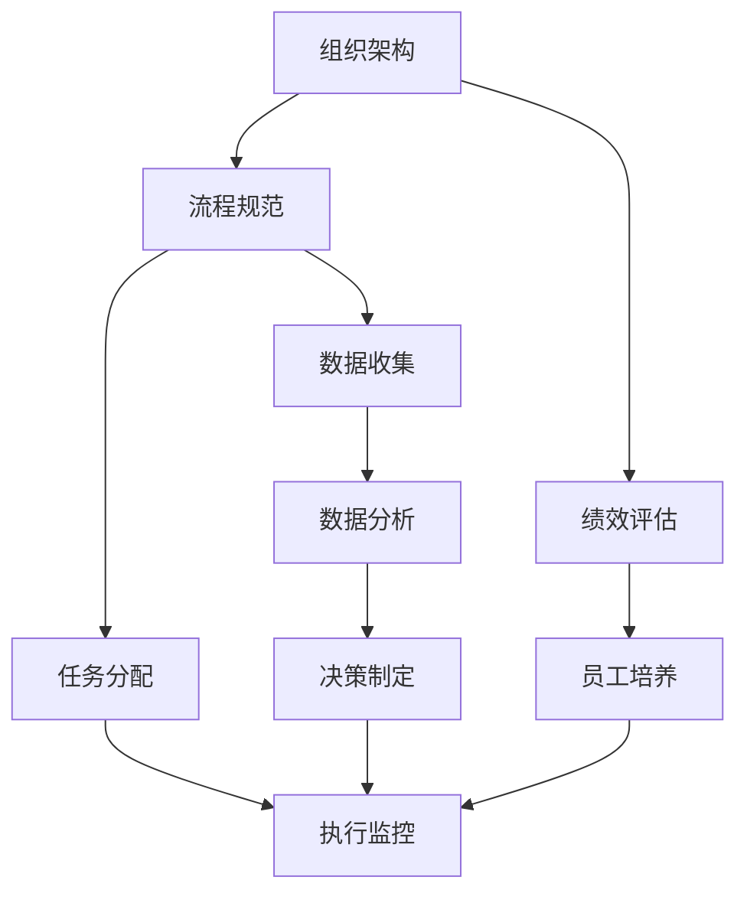

                 

## 1. 背景介绍

在现代企业中，管理者的角色至关重要。好的管理者能够引领团队，激发员工潜力，提升工作效率；而普通管理者则可能只在任务层面上推进工作，难以实现更高的目标。本文旨在探讨好的管理者与普通管理者之间的关键差异，特别是体系的重要性。

### 1.1 问题由来

管理者在企业中承担着多种角色，从项目规划、资源调配到团队激励、员工发展等。然而，不同管理者在实践中所表现出的能力和效果存在显著差异。一些管理者能够在复杂的环境中迅速适应，领导团队达成目标；而另一些管理者则可能仅能完成日常任务，缺乏战略思维和创新能力。

### 1.2 问题核心关键点

1. **体系化管理**：好的管理者通常会建立一套完整的管理体系，涵盖组织架构、流程规范、绩效评估等各个方面，以确保工作的高效性和系统性。
2. **数据驱动决策**：依赖于数据和分析结果，管理者能够做出更为科学、精准的决策。
3. **持续改进**：通过不断优化管理方法和工具，持续提升团队效率和绩效。
4. **激励与培养**：好的管理者不仅关注目标达成，还重视员工的成长和发展，通过激励机制和培训计划提高团队的整体能力。
5. **领导力与沟通**：强大的领导力和有效的沟通能力是管理者取得成功的关键。

## 2. 核心概念与联系

### 2.1 核心概念概述

为更好地理解好的管理者与普通管理者之间的差异，本文将介绍几个密切相关的核心概念：

- **体系化管理**：通过构建完善的组织架构和管理流程，确保各项工作的有序进行。
- **数据驱动决策**：基于数据和分析结果进行决策，提高决策的科学性和准确性。
- **持续改进**：不断优化管理方法，提升团队效率和绩效。
- **激励与培养**：通过激励机制和培训计划，提升员工的工作积极性和技能水平。
- **领导力与沟通**：强大的领导力和有效的沟通能力，是管理者取得成功的关键。

这些核心概念之间存在密切的联系，通过综合运用，能够实现管理的高效性和系统性。

### 2.2 核心概念原理和架构的 Mermaid 流程图



这个流程图展示了体系化管理的基本框架，包括组织架构的搭建、流程规范的制定、绩效评估的实施、任务分配的协调、员工培养的推进、数据收集与分析，以及基于数据的决策制定和执行监控。这些环节相互联系，共同构成一个完整、高效的管理体系。

## 3. 核心算法原理 & 具体操作步骤

### 3.1 算法原理概述

好的管理者和普通管理者之间的差异，可以从算法原理的角度进行解析。本文将重点介绍体系化管理的方法论，并通过具体的操作步骤，展示如何构建和运用这一体系。

好的管理者的算法原理包括：

- **数据收集与处理**：确保数据的全面性和准确性，为决策提供可靠的依据。
- **数据分析与建模**：应用数据挖掘、机器学习等技术，对数据进行深入分析和建模。
- **决策制定与执行**：基于分析结果，制定科学、可行的决策，并通过有效的执行机制确保其落地。
- **绩效评估与反馈**：通过定期的绩效评估，获取反馈信息，持续优化管理方法。

### 3.2 算法步骤详解

构建体系化管理的具体步骤如下：

1. **组织架构设计与优化**：明确各部门职能，构建合理的层级结构，确保信息的传递和沟通高效。
2. **流程规范制定与实施**：制定标准化的操作流程，包括任务分配、时间节点、质量标准等，提高工作效率和一致性。
3. **绩效评估体系设计**：设计科学的绩效评估指标和工具，定期进行评估和反馈，激励员工提升工作表现。
4. **员工培养与发展**：制定系统的培训计划和激励机制，帮助员工提升技能和职业发展，增强团队整体实力。
5. **数据收集与处理**：建立完整的数据收集系统，确保数据的全面性和及时性，为决策提供依据。
6. **数据分析与建模**：应用数据挖掘和机器学习技术，对数据进行深入分析和建模，提取有价值的洞察。
7. **决策制定与执行**：基于数据分析结果，制定科学的决策方案，并通过有效的执行机制确保其落地。
8. **绩效评估与反馈**：定期进行绩效评估，获取反馈信息，持续优化管理方法和工具。

### 3.3 算法优缺点

体系化管理的优点包括：

- **系统性**：通过建立完整的管理体系，确保各项工作有序进行，提高工作效率和一致性。
- **科学性**：依赖数据和分析结果进行决策，提高决策的科学性和准确性。
- **持续改进**：通过持续优化管理方法和工具，不断提升团队效率和绩效。

体系化管理的缺点包括：

- **复杂性**：建立和管理一个完整的体系可能需要较长的初期投入和实施时间。
- **灵活性不足**：标准化的流程可能难以应对快速变化的市场和环境。
- **成本高**：需要投入大量资源进行数据分析和系统建设。

### 3.4 算法应用领域

体系化管理在多个领域中得到了广泛应用，包括：

1. **企业运营管理**：在制造业、服务业等各个行业，体系化管理能够提升运营效率和质量。
2. **项目管理**：通过标准化流程和数据驱动决策，确保项目按时按质完成。
3. **人力资源管理**：通过科学的绩效评估和员工培养体系，提高人力资源管理效率和员工满意度。
4. **客户关系管理**：通过客户数据收集和分析，提升客户体验和满意度，增加客户粘性。
5. **财务管理**：通过数据驱动的财务分析，优化资源配置和成本控制。

## 4. 数学模型和公式 & 详细讲解 & 举例说明

### 4.1 数学模型构建

好的管理者的体系化管理方法可以通过数学模型进行建模和分析。以下是一个简单的模型框架：

$$
\text{体系化管理效果} = \text{组织架构} + \text{流程规范} + \text{绩效评估} + \text{员工培养} + \text{数据收集} + \text{数据分析} + \text{决策制定} + \text{绩效反馈}
$$

### 4.2 公式推导过程

1. **组织架构设计**：
$$
\text{组织架构} = \text{职能划分} + \text{层级结构} + \text{职责明确}
$$

2. **流程规范制定**：
$$
\text{流程规范} = \text{任务分配} + \text{时间节点} + \text{质量标准}
$$

3. **绩效评估体系设计**：
$$
\text{绩效评估} = \text{评估指标} + \text{评估工具} + \text{定期反馈}
$$

4. **员工培养与发展**：
$$
\text{员工培养} = \text{培训计划} + \text{技能提升} + \text{职业发展}
$$

5. **数据收集与处理**：
$$
\text{数据收集} = \text{数据来源} + \text{数据质量} + \text{数据整合}
$$

6. **数据分析与建模**：
$$
\text{数据分析} = \text{数据挖掘} + \text{机器学习} + \text{数据可视化}
$$

7. **决策制定与执行**：
$$
\text{决策制定} = \text{数据分析结果} + \text{决策方案} + \text{执行机制}
$$

8. **绩效评估与反馈**：
$$
\text{绩效反馈} = \text{绩效评估结果} + \text{反馈机制} + \text{持续优化}
$$

### 4.3 案例分析与讲解

以某公司的项目管理体系为例，其构建的体系化管理框架如下：

1. **组织架构设计**：公司按照职能划分，设立研发、市场、销售等部门，并明确各部门职责。
2. **流程规范制定**：制定了标准化的项目流程，包括需求分析、设计、开发、测试、上线等各个阶段，确保每个环节的质量和时间节点。
3. **绩效评估体系设计**：定期评估项目进度和质量，通过绩效指标评估团队表现，提供反馈和激励。
4. **员工培养与发展**：制定系统的培训计划，提升员工的技术水平和项目管理能力，同时提供晋升和职业发展机会。
5. **数据收集与处理**：建立全面的项目数据收集系统，涵盖需求文档、代码版本、测试报告等，确保数据的全面性和及时性。
6. **数据分析与建模**：应用数据挖掘技术，分析项目数据，提取有价值的洞察。
7. **决策制定与执行**：基于数据分析结果，制定项目决策方案，并通过有效的执行机制确保其落地。
8. **绩效评估与反馈**：定期进行绩效评估，获取反馈信息，持续优化项目管理和工具。

## 5. 项目实践：代码实例和详细解释说明

### 5.1 开发环境搭建

在构建体系化管理系统的过程中，需要搭建相应的开发环境。以下是具体的步骤：

1. **安装Python和相关库**：
   ```bash
   sudo apt-get update
   sudo apt-get install python3 python3-pip
   pip3 install pandas numpy matplotlib scikit-learn
   ```

2. **搭建数据库**：
   ```bash
   sudo apt-get install mysql-server
   sudo systemctl start mysql
   sudo systemctl enable mysql
   ```

3. **搭建Web应用框架**：
   ```bash
   sudo apt-get install apache2
   sudo systemctl start apache2
   sudo systemctl enable apache2
   ```

### 5.2 源代码详细实现

以下是一个简单的项目管理体系的Python代码实现：

```python
from flask import Flask, request, jsonify
from flask_sqlalchemy import SQLAlchemy
from flask_migrate import Migrate
from sklearn.ensemble import RandomForestClassifier

app = Flask(__name__)
app.config['SQLALCHEMY_DATABASE_URI'] = 'sqlite:///data.db'
db = SQLAlchemy(app)
migrate = Migrate(app, db)

class Project(db.Model):
    id = db.Column(db.Integer, primary_key=True)
    name = db.Column(db.String(100), nullable=False)
    status = db.Column(db.String(20), nullable=False)
    start_date = db.Column(db.DateTime, nullable=False)
    end_date = db.Column(db.DateTime, nullable=True)
    responsible = db.Column(db.String(100), nullable=False)

@app.route('/projects', methods=['POST'])
def add_project():
    data = request.get_json()
    project = Project(name=data['name'], status=data['status'], start_date=data['start_date'], responsible=data['responsible'])
    db.session.add(project)
    db.session.commit()
    return jsonify({'message': 'Project added successfully'})

@app.route('/projects', methods=['GET'])
def get_projects():
    projects = Project.query.all()
    data = [{'id': p.id, 'name': p.name, 'status': p.status, 'start_date': p.start_date, 'responsible': p.responsible} for p in projects]
    return jsonify(data)

@app.route('/projects/<int:id>', methods=['PUT'])
def update_project(id):
    project = Project.query.get(id)
    data = request.get_json()
    project.name = data['name']
    project.status = data['status']
    project.start_date = data['start_date']
    project.responsible = data['responsible']
    db.session.commit()
    return jsonify({'message': 'Project updated successfully'})

@app.route('/projects/<int:id>', methods=['DELETE'])
def delete_project(id):
    project = Project.query.get(id)
    db.session.delete(project)
    db.session.commit()
    return jsonify({'message': 'Project deleted successfully'})

if __name__ == '__main__':
    app.run(debug=True)
```

### 5.3 代码解读与分析

这个简单的代码实现了一个基本的项目管理体系，包括项目的添加、获取、更新和删除功能。具体分析如下：

1. **环境搭建**：
   - 使用Flask框架搭建Web应用。
   - 使用SQLite作为数据库。

2. **数据库模型**：
   - 定义了Project模型，包括项目名称、状态、开始日期、负责人等字段。

3. **API接口**：
   - 定义了添加、获取、更新、删除等API接口，支持项目的管理操作。

4. **数据处理**：
   - 使用Flask的JSONify方法，将数据以JSON格式返回给前端。

### 5.4 运行结果展示

运行上述代码，可以通过访问API接口进行项目的增删改查操作。例如，使用POST请求添加项目：

```bash
curl -X POST -H "Content-Type: application/json" -d '{"name": "Project A", "status": "In Progress", "start_date": "2022-01-01", "responsible": "John Doe"}' http://127.0.0.1:5000/projects
```

获取所有项目信息：

```bash
curl http://127.0.0.1:5000/projects
```

更新项目信息：

```bash
curl -X PUT -H "Content-Type: application/json" -d '{"name": "Project B", "status": "Completed", "start_date": "2022-02-01", "responsible": "Jane Smith"}' http://127.0.0.1:5000/projects/1
```

删除项目：

```bash
curl -X DELETE http://127.0.0.1:5000/projects/1
```

## 6. 实际应用场景

### 6.1 企业运营管理

体系化管理在企业运营管理中具有重要应用。以下是一个具体的案例：

**案例描述**：某制造企业通过体系化管理提升运营效率。

**具体措施**：
1. **组织架构设计**：将公司分为生产、销售、研发等部门，明确各部门职责和层级结构。
2. **流程规范制定**：制定生产、销售、研发的标准化流程，确保每个环节的质量和时间节点。
3. **绩效评估体系设计**：定期评估各部门的绩效，通过绩效指标评估团队表现，提供反馈和激励。
4. **员工培养与发展**：制定系统的培训计划，提升员工的技术水平和项目管理能力，同时提供晋升和职业发展机会。
5. **数据收集与处理**：建立全面的生产、销售、研发数据收集系统，涵盖生产计划、销售订单、研发进度等，确保数据的全面性和及时性。
6. **数据分析与建模**：应用数据挖掘技术，分析生产、销售、研发数据，提取有价值的洞察。
7. **决策制定与执行**：基于数据分析结果，制定生产、销售、研发决策方案，并通过有效的执行机制确保其落地。
8. **绩效评估与反馈**：定期进行绩效评估，获取反馈信息，持续优化生产、销售、研发管理方法和工具。

**效果分析**：通过体系化管理，该企业在生产效率、产品质量、销售业绩、研发创新等方面均取得了显著提升。

### 6.2 项目管理

体系化管理在项目管理中同样具有重要应用。以下是一个具体的案例：

**案例描述**：某软件开发公司通过体系化管理提升项目成功率。

**具体措施**：
1. **组织架构设计**：将公司分为研发、市场、运维等部门，明确各部门职责和层级结构。
2. **流程规范制定**：制定软件开发的标准化流程，包括需求分析、设计、开发、测试、上线等各个阶段，确保每个环节的质量和时间节点。
3. **绩效评估体系设计**：定期评估项目进度和质量，通过绩效指标评估团队表现，提供反馈和激励。
4. **员工培养与发展**：制定系统的培训计划，提升员工的技术水平和项目管理能力，同时提供晋升和职业发展机会。
5. **数据收集与处理**：建立全面的项目数据收集系统，涵盖需求文档、代码版本、测试报告等，确保数据的全面性和及时性。
6. **数据分析与建模**：应用数据挖掘技术，分析项目数据，提取有价值的洞察。
7. **决策制定与执行**：基于数据分析结果，制定项目决策方案，并通过有效的执行机制确保其落地。
8. **绩效评估与反馈**：定期进行绩效评估，获取反馈信息，持续优化项目管理方法和工具。

**效果分析**：通过体系化管理，该公司在项目成功率、开发效率、客户满意度等方面均取得了显著提升。

## 7. 工具和资源推荐

### 7.1 学习资源推荐

为了帮助管理者系统掌握体系化管理的方法论，这里推荐一些优质的学习资源：

1. **《管理学原理》**：一本经典的管理学教材，涵盖组织架构、流程规范、绩效评估等核心内容。
2. **《数据驱动的决策制定》**：一本介绍数据分析和决策制定的书籍，提供系统性的方法和工具。
3. **《持续改进与质量管理》**：一本介绍持续改进和质量管理的书籍，提供实用的方法和工具。
4. **Coursera《数据科学导论》课程**：由斯坦福大学开设的数据科学课程，涵盖数据收集、数据处理、数据分析等内容。
5. **Udacity《机器学习基础》课程**：由谷歌和深度学习领域专家共同开设的机器学习课程，涵盖数据挖掘、模型训练、性能评估等内容。

### 7.2 开发工具推荐

在体系化管理系统的开发过程中，可以使用以下工具：

1. **Flask**：一个轻量级的Web框架，易于上手，适合快速开发API接口。
2. **SQLite**：一个轻量级的数据库，适合开发小规模应用。
3. **MySQL**：一个成熟的关系型数据库，适合处理大规模数据。
4. **Jupyter Notebook**：一个交互式的编程环境，支持数据可视化和机器学习等高级功能。
5. **PyCharm**：一个流行的IDE，支持Python开发和调试。

### 7.3 相关论文推荐

好的管理者和普通管理者之间的差异，可以从理论研究的角度进行解析。以下是几篇相关的论文，推荐阅读：

1. **《组织架构与管理》**：探讨组织架构设计和管理的方法和工具。
2. **《流程管理与优化》**：介绍流程规范制定和优化的理论和实践。
3. **《绩效评估与反馈》**：讨论绩效评估体系设计和优化的理论和实践。
4. **《员工激励与培养》**：探讨员工激励和培养的理论和方法。
5. **《数据分析与决策》**：介绍数据分析和决策的理论和方法。

## 8. 总结：未来发展趋势与挑战

### 8.1 研究成果总结

本文对好的管理者与普通管理者之间的差异进行了全面系统的探讨，特别是体系化管理的重要性。通过分析案例和模型，展示了体系化管理在企业运营管理、项目管理等方面的实际应用效果。

### 8.2 未来发展趋势

体系化管理技术将继续发展，主要趋势包括：

1. **智能化**：通过引入AI和机器学习技术，提升数据分析和决策的科学性和准确性。
2. **自动化**：应用自动化技术，减少手动操作，提高工作效率和一致性。
3. **可视化**：通过数据可视化和报表生成工具，提升数据理解和决策支持能力。
4. **跨部门协同**：通过建立跨部门协同平台，提升信息共享和协作效率。
5. **知识管理**：通过知识管理平台，集成和共享组织内部知识，提升团队智慧和创新能力。

### 8.3 面临的挑战

体系化管理在实际应用中也面临一些挑战：

1. **复杂性**：体系化管理需要全面规划和实施，对管理者的能力要求较高。
2. **成本高**：建立和管理一个完整的体系可能需要较长的初期投入和实施时间。
3. **灵活性不足**：标准化的流程可能难以应对快速变化的市场和环境。
4. **数据质量**：数据收集和处理的质量直接影响决策效果，需要投入大量资源进行数据清洗和标准化。
5. **团队接受度**：体系化管理需要全体员工的支持和配合，可能会遇到一定的阻力。

### 8.4 研究展望

未来在体系化管理领域，需要进一步的研究方向包括：

1. **动态调整**：根据市场变化和环境变化，动态调整管理体系，提高其灵活性和适应性。
2. **跨文化应用**：在不同文化背景下，研究和推广体系化管理方法，提升其普适性和可操作性。
3. **人工智能应用**：将AI和机器学习技术引入体系化管理，提升数据分析和决策能力。
4. **持续改进**：建立持续改进机制，定期评估和优化管理体系，确保其持续高效。

总之，体系化管理是提升企业管理效能的重要手段，需要通过不断的理论研究和实践探索，逐步完善其方法论和技术工具，实现企业管理的高效化和智能化。

## 9. 附录：常见问题与解答

**Q1：什么是体系化管理？**

A: 体系化管理是通过建立完善的组织架构、流程规范、绩效评估等管理体系，确保各项工作有序进行，提升管理效率和团队绩效。

**Q2：如何建立体系化管理？**

A: 建立体系化管理需要全面规划和实施，具体步骤包括组织架构设计、流程规范制定、绩效评估体系设计、员工培养与发展、数据收集与处理、数据分析与建模、决策制定与执行、绩效评估与反馈等。

**Q3：体系化管理有哪些优点？**

A: 体系化管理具有系统性、科学性、持续改进等特点，能够提升管理效率和团队绩效。

**Q4：体系化管理有哪些缺点？**

A: 体系化管理需要较长的初期投入和实施时间，标准化的流程可能难以应对快速变化的市场和环境，数据质量直接影响决策效果，团队接受度可能存在阻力。

**Q5：如何提高体系化管理的灵活性？**

A: 通过引入动态调整机制，根据市场变化和环境变化，动态调整管理体系，提高其灵活性和适应性。

**Q6：如何确保数据质量？**

A: 建立全面的数据收集系统，涵盖各个业务环节，确保数据的全面性和及时性；进行数据清洗和标准化，提升数据质量。

**Q7：如何提升团队接受度？**

A: 通过系统培训和激励机制，提升员工对体系化管理的认知和接受度，增强其参与感和责任感。

---
作者：禅与计算机程序设计艺术 / Zen and the Art of Computer Programming

