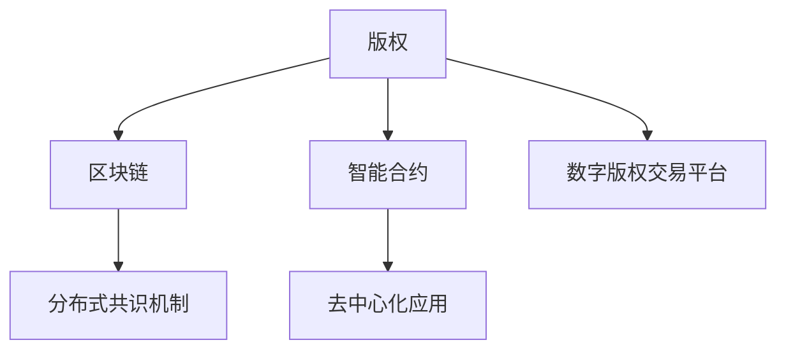

                 

## 1. 背景介绍

在数字化信息时代，知识付费成为一种新兴的商业模式。通过订阅、按需购买等方式，消费者获取各类专业知识和技能，享受专家智囊团的服务。然而，盗版和侵权行为频繁发生，知识付费内容的版权保护成为了一个亟待解决的问题。区块链技术的出现，为保护版权提供了新的思路和技术支持。

### 1.1 问题由来
知识付费市场规模庞大，但也面临着诸多版权侵权的挑战。传统的版权保护方式依赖于版权法律、审查机制、追踪技术等，存在响应慢、成本高、可执行性差等问题。随着版权作品版权权属的不确定性、分发渠道的复杂性、盗版手段的多样性等问题日益突出，传统的版权保护手段显得力不从心。

### 1.2 问题核心关键点
为了应对这些问题，本文聚焦于如何利用区块链技术实现知识付费版权的保护。通过区块链技术，可以实现版权信息的透明化、版权交易的去中心化、版权记录的不可篡改化等优点，为版权保护提供了一种全新的思路和工具。

## 2. 核心概念与联系

### 2.1 核心概念概述

为了深入理解利用区块链技术保护版权的过程，我们首先需要明确几个核心概念：

- **版权**：法律规定的，对知识产权的占有、使用、收益和处分的权利。
- **区块链**：一种分布式账本技术，通过加密链式结构存储数据，实现去中心化、透明化、不可篡改等特性。
- **智能合约**：基于区块链技术的自动化合约，能够在满足特定条件时自动执行。
- **去中心化应用（DApps）**：运行在区块链上的分布式应用，支持不受第三方控制的协议和业务逻辑。
- **分布式共识机制**：如PoW、PoS、DPoS等，用于维护区块链网络的去中心化和数据一致性。
- **数字版权交易平台**：基于区块链技术构建的，用于版权交易、确权、管理的平台。

这些概念之间的逻辑关系可以通过以下Mermaid流程图来展示：



这个流程图展示了大版权保护的相关核心概念及其之间的关系：

1. **版权**：版权保护的核心对象，涉及各类作品的权利。
2. **区块链**：提供去中心化、透明化、不可篡改的数据存储和交换手段。
3. **智能合约**：通过区块链实现版权自动化管理，增强版权执行的确定性和安全性。
4. **去中心化应用**：通过区块链提供分布式应用环境，支持版权的自动化交易和管理。
5. **分布式共识机制**：确保区块链网络的去中心化和数据一致性。
6. **数字版权交易平台**：提供版权交易、确权、管理的在线平台。

这些核心概念共同构成了利用区块链技术保护版权的基础框架，使得版权信息的记录、确权、交易等过程具备了更高的安全性和可靠性。

## 3. 核心算法原理 & 具体操作步骤
### 3.1 算法原理概述

利用区块链技术保护版权的核心算法原理，可以概括为以下几个步骤：

1. **版权信息的登记与确权**：将版权信息登记在区块链上，确权其所有者，形成不可篡改的记录。
2. **版权交易的自动化执行**：通过智能合约，自动执行版权的买卖、授权等交易。
3. **版权状态的透明与可追溯**：利用区块链的透明性，任何版权变动都可以被记录和追溯。
4. **版权冲突的协调与解决**：通过区块链网络中节点的共识，协调和解决版权纠纷。

### 3.2 算法步骤详解

为了更好地理解利用区块链技术保护版权的流程，下面详细介绍具体的步骤：

**步骤1：版权信息的登记与确权**

- **版权登记**：将版权作品的信息、创作时间、创作者信息等关键属性，记录在区块链上。
- **确权操作**：利用智能合约，将版权确权给创作者或其授权的代理人。创作者可以使用自己的私钥进行签名，智能合约验证后确认版权归属。

**步骤2：版权交易的自动化执行**

- **交易发起**：版权所有者或其授权代理人在区块链上发起版权交易，包括买卖、授权、许可等操作。
- **智能合约执行**：智能合约根据交易条件自动执行操作，如转移版权所有权、授权使用权限等。

**步骤3：版权状态的透明与可追溯**

- **状态记录**：每次版权交易都会自动记录在区块链上，形成一条完整的版权交易链。
- **可追溯性**：任何人都可以通过区块链浏览器查看版权交易的完整历史，确保版权状态的透明和可追溯。

**步骤4：版权冲突的协调与解决**

- **冲突检测**：利用区块链的共识机制，检测版权冲突。
- **冲突协调**：通过节点之间的协商，找到最优解决方案。

### 3.3 算法优缺点

利用区块链技术保护版权的优点包括：

1. **去中心化与透明化**：区块链的去中心化特性减少了版权纠纷的中介环节，提高透明度。
2. **不可篡改性**：版权记录不可篡改，增强版权确权的可靠性。
3. **自动化执行**：智能合约可以自动化执行版权交易，提高效率。
4. **可追溯性**：版权交易历史可追溯，便于查询和管理。
5. **安全性**：版权确权和交易通过加密手段保护，安全性高。

但这种技术也存在一些缺点：

1. **性能瓶颈**：区块链网络的交易处理速度有限，可能影响版权交易效率。
2. **成本高**：区块链网络的构建和维护需要高昂的资源和成本。
3. **技术门槛高**：区块链技术复杂，需要专业知识和技能，不易普及。
4. **法律与合规问题**：版权保护涉及法律问题，区块链技术在法律合规性方面还需要进一步完善。

### 3.4 算法应用领域

利用区块链技术保护版权的应用场景非常广泛，涵盖了版权的创作、确权、交易、管理等各个环节。以下是几个具体的领域：

1. **学术与科研**：研究者在区块链上登记其科研成果，确权其版权，方便后续传播与引用。
2. **出版与发行**：作家和出版商在区块链上发布和确权其作品，自动进行版权交易。
3. **知识产权保护**：企业通过区块链保护其知识产权，包括商标、专利、版权等。
4. **版权管理系统**：版权管理平台利用区块链技术，实现版权的自动化管理与追溯。
5. **数字艺术品交易**：艺术家在区块链上确权其数字艺术品版权，方便买卖与展览。

## 4. 数学模型和公式 & 详细讲解 & 举例说明

### 4.1 数学模型构建

利用区块链技术保护版权的数学模型，主要涉及版权确权、交易自动化执行、状态记录和冲突协调等关键过程。

- **版权确权模型**：版权确权通过智能合约实现，可以抽象为一个加权投票模型，其中每个权利持有人有一个权重。确权过程中，智能合约根据所有人的投票结果进行决策。
- **版权交易自动化模型**：版权交易通过智能合约实现，可以抽象为一个触发器模型，当触发条件满足时，自动执行相应的操作。
- **版权状态记录模型**：版权状态记录在区块链上，可以抽象为一个分布式账本模型，每次交易都会生成一个新的账本区块。
- **版权冲突协调模型**：版权冲突协调通过共识算法实现，可以抽象为一个多方协商模型，其中每个节点都是一个参与者，共同决定解决方案。

### 4.2 公式推导过程

- **版权确权模型**：假设版权确权涉及N个权利人，每个权利人有一个权重W_i，版权确权投票模型可以表示为：

$$
\text{确权结果} = \text{多数投票结果}(\sum_{i=1}^N W_i \times \text{投票}_i)
$$

- **版权交易自动化模型**：假设版权交易条件为C，智能合约触发器模型可以表示为：

$$
\text{触发器结果} = \text{IF}\ (C) \ \text{THEN}\ (\text{执行操作})
$$

- **版权状态记录模型**：版权状态记录模型基于区块链技术，每个区块包含一个时间戳T和交易记录R，可以表示为：

$$
\text{区块链状态} = \{\{T_n, R_n\}_{n=1}^N
$$

- **版权冲突协调模型**：假设版权冲突涉及N个节点，共识算法模型可以表示为：

$$
\text{共识结果} = \text{多数投票结果}(\sum_{i=1}^N V_i \times \text{投票}_i)
$$

### 4.3 案例分析与讲解

以数字艺术品交易为例，分析利用区块链技术实现版权保护的过程：

- **版权确权**：艺术家在区块链上发布其数字艺术品，确权自己为版权所有者。
- **版权交易**：收藏家通过智能合约购买该艺术品，合同自动执行，版权转移至收藏家。
- **版权状态记录**：每次交易都在区块链上记录，形成完整的交易链。
- **版权冲突协调**：如果有多个收藏家主张同一件艺术品的版权，通过区块链网络中的共识机制，决定最终版权归属。

## 5. 项目实践：代码实例和详细解释说明
### 5.1 开发环境搭建

要实践利用区块链技术保护版权的过程，需要搭建一个支持智能合约的区块链平台。以下是基于以太坊平台的搭建过程：

1. **安装Geth**：从以太坊官网下载并安装Geth客户端。
2. **创建区块链网络**：在本地计算机或云平台上启动Geth节点，创建区块链网络。
3. **安装Solidity**：从官网下载并安装Solidity编译器。
4. **编写智能合约代码**：编写用于版权确权、交易、状态记录等功能的智能合约。
5. **部署智能合约**：在区块链网络中部署智能合约，并进行测试。

### 5.2 源代码详细实现

以下是一个简单的智能合约代码示例，用于版权确权和交易：

```solidity
pragma solidity ^0.8.0;

contract CopyrightContract {
    struct Copyright {
        uint256 owner;  // 版权所有者地址
        uint256 timestamp;  // 版权创建时间
        bool isConfirmed;  // 版权是否已确认
    }

    mapping(uint256 => Copyright) public copyrights;

    event OwnershipChanged(uint256 indexed previousOwner, uint256 indexed newOwner);
    
    function registerCopyright(uint256 id, uint256 owner, uint256 timestamp) public {
        // 版权确权
        Copyright memory c = Copyright(owner, timestamp, false);
        copyrights[id] = c;
        emit OwnershipChanged(owner, msg.sender);
    }

    function transferCopyright(uint256 id, uint256 newOwner) public {
        // 版权转让
        if (msg.sender == copyrights[id].owner) {
            copyrights[id].owner = newOwner;
            emit OwnershipChanged(copyrights[id].owner, msg.sender);
        }
    }

    function isConfirmed(uint256 id) public view returns (bool) {
        // 版权状态查询
        return copyrights[id].isConfirmed;
    }
}
```

### 5.3 代码解读与分析

以上代码定义了一个简单的版权确权和转让智能合约，包含以下几个关键部分：

- **版权结构体**：用于存储版权信息，包括所有者地址、创建时间、是否确认等属性。
- **版权映射**：用于存储各个版权的详细信息，支持动态添加和查询版权。
- **事件机制**：通过事件机制，记录版权确权和转让操作，增强可追溯性。
- **版权确权函数**：用于登记版权信息，确权版权所有者。
- **版权转让函数**：用于转让版权，需要版权所有者授权。
- **版权状态查询函数**：用于查询版权是否已确认。

### 5.4 运行结果展示

运行以上智能合约，通过Geth客户端部署和测试，验证版权确权和转让功能。以下是一个简单的测试过程：

1. **部署智能合约**：
```bash
echo '0x000000000000000000000000000000000000000001' > keyfile
truffle compile
truffle migrate --network dev
```

2. **确权版权**：
```bash
truffle run scripts/registerCopyright.js --network dev --account 0x000000000000000000000000000000000000000001
```

3. **转让版权**：
```bash
truffle run scripts/transferCopyright.js --network dev --account 0x000000000000000000000000000000000000000002
```

4. **查询版权状态**：
```bash
truffle run scripts/checkConfirmation.js --network dev --account 0x000000000000000000000000000000000000000002
```

以上过程展示了利用区块链技术实现版权确权、转让和状态查询的基本流程。

## 6. 实际应用场景
### 6.1 数字艺术品交易平台

数字艺术品交易平台是区块链技术在版权保护领域的一个重要应用。数字艺术品交易平台利用区块链技术确权和记录艺术品版权，防止盗版和侵权行为，保障艺术品持有者的权益。

### 6.2 学术与科研数据库

学术与科研数据库可以利用区块链技术确权和记录研究成果，确保数据来源的真实性和可信度。研究人员可以通过智能合约自动进行版权交易，提高数据的传播和使用效率。

### 6.3 出版与发行平台

出版与发行平台可以利用区块链技术确权和记录图书、文章等版权信息，方便版权交易和授权使用。读者和作者可以通过智能合约进行版权交易，提高交易透明度和安全性。

### 6.4 未来应用展望

未来，随着区块链技术的不断发展和普及，利用区块链技术保护版权的应用将更加广泛。以下是对未来应用展望的几点思考：

1. **版权去中心化交易平台**：构建去中心化的版权交易市场，提供更加高效、透明、安全的版权交易环境。
2. **版权确权与认证系统**：构建基于区块链的版权确权与认证系统，提供全面的版权保护服务。
3. **版权追溯与证据链**：构建版权追溯与证据链系统，确保版权纠纷中的证据合法有效。
4. **版权市场指数**：构建版权市场指数，实时反映版权市场的活跃度和价值变化。
5. **版权衍生品市场**：构建版权衍生品市场，如版权质押、版权融资等，盘活版权资产。

## 7. 工具和资源推荐
### 7.1 学习资源推荐

为了深入学习区块链技术及其在版权保护中的应用，以下推荐一些优质的学习资源：

1. **《区块链原理与应用》**：一本系统介绍区块链技术的书籍，适合初学者和从业者。
2. **《以太坊智能合约编程实战》**：一本实战性的智能合约编程书籍，详细介绍了Solidity语言和智能合约的开发流程。
3. **Ethereum官网文档**：以太坊官网提供详细的开发文档和API接口，适合技术开发和学习。
4. **IPFS官网文档**：IPFS官网提供IPFS网络的详细文档，适合学习去中心化存储技术。
5. **Blockchain at Berkeley公开课**：加州大学伯克利分校提供的区块链技术公开课，涵盖区块链原理、应用等。

通过对这些资源的学习，可以系统掌握区块链技术和版权保护的相关知识，为实践和应用奠定基础。

### 7.2 开发工具推荐

要构建基于区块链技术的版权保护系统，以下推荐几款常用的开发工具：

1. **Geth**：以太坊官方客户端，支持智能合约开发和部署。
2. **Truffle**：基于Geth的开发框架，提供自动化测试、部署等功能。
3. **Remix**：以太坊智能合约开发平台，支持交互式开发和测试。
4. **IPFS**：去中心化存储网络，支持分布式存储和数据传输。
5. **Hyperledger Fabric**：Hyperledger开源区块链框架，支持联盟链应用开发。
6. **Polkadot**：波卡生态系统，支持跨链互操作和可扩展性。

合理利用这些工具，可以显著提升版权保护系统的开发效率，实现更加灵活、安全的版权管理。

### 7.3 相关论文推荐

区块链技术和版权保护的研究领域不断拓展，以下推荐几篇具有代表性的论文：

1. **"Blockchain: Building Blockchain Applications"**：以太坊官网提供的区块链应用开发手册，涵盖智能合约、区块链平台等方面。
2. **"Copyright Protection with Blockchain"**：一篇关于区块链版权保护的论文，详细讨论了区块链在版权保护中的应用。
3. **"Smart Contracts: Trustless, Traceable, and Timely"**：以太坊创始人Vitalik Buterin撰写的智能合约白皮书，详细介绍了智能合约的设计和应用。
4. **"Blockchain-based Digital Copyright Transaction System"**：一篇关于区块链版权交易系统的研究论文，探讨了版权确权、转让等关键技术。
5. **"Blockchain in Copyright Management"**：一篇关于区块链在版权管理中的应用研究，讨论了版权登记、确权、交易等流程。

通过阅读这些论文，可以深入了解区块链技术在版权保护中的应用，启发更多的创新思路。

## 8. 总结：未来发展趋势与挑战
### 8.1 总结

本文系统介绍了利用区块链技术保护版权的原理和操作步骤，通过数学模型和代码实例，深入解析了版权确权、交易、状态记录和冲突协调等关键过程。通过理论分析和实践案例，展示了区块链技术在版权保护领域的巨大潜力。

通过本文的系统梳理，可以看到，利用区块链技术保护版权为版权保护带来了新的思路和技术手段，使得版权信息的记录、确权、交易等过程具备了更高的安全性和可靠性。未来，随着区块链技术的不断发展和完善，版权保护将更加高效、透明、安全，为版权产业带来更广阔的发展空间。

### 8.2 未来发展趋势

展望未来，区块链技术在版权保护领域的发展趋势包括以下几点：

1. **去中心化与透明化**：区块链技术将继续保持去中心化和透明化的特点，增强版权信息的公开性和可信度。
2. **自动化与智能化**：智能合约将不断优化，实现更加灵活、高效的版权自动化管理。
3. **可扩展性与互操作性**：区块链网络将不断扩展，实现跨链互操作，支持更广泛的应用场景。
4. **共识机制的创新**：新的共识算法将被研究和应用，提高区块链网络的稳定性和安全性。
5. **隐私保护与匿名性**：隐私保护技术将被引入区块链，保护版权交易的匿名性和安全性。

### 8.3 面临的挑战

尽管区块链技术在版权保护领域展现了巨大潜力，但仍然面临以下挑战：

1. **性能瓶颈**：区块链网络的交易处理速度有限，可能影响版权交易效率。
2. **成本高**：区块链网络的构建和维护需要高昂的资源和成本。
3. **技术门槛高**：区块链技术复杂，需要专业知识和技能，不易普及。
4. **法律与合规问题**：版权保护涉及法律问题，区块链技术在法律合规性方面还需要进一步完善。
5. **安全性问题**：区块链网络的安全性仍需进一步提升，防止攻击和滥用。

### 8.4 研究展望

未来，为了解决这些挑战，需要从以下几个方面进行研究：

1. **提高区块链网络性能**：研究新的共识算法和区块链架构，提高网络吞吐量和交易速度。
2. **降低区块链网络成本**：开发更高效、更经济的共识算法和分布式存储技术，降低区块链网络的运行成本。
3. **降低技术门槛**：开发更易用、更直观的区块链开发工具和平台，降低技术使用门槛。
4. **完善法律与合规体系**：研究区块链技术在版权保护中的法律问题，完善版权保护的法律框架。
5. **提升区块链安全性**：研究区块链网络的安全性问题，防止攻击和滥用。

这些研究方向的探索，必将推动区块链技术在版权保护领域的进一步应用，为版权产业带来更广泛的发展空间。

## 9. 附录：常见问题与解答

### Q1：利用区块链技术保护版权是否绝对安全？

A: 区块链技术在版权保护方面具有很多优势，但其安全性并非绝对。区块链网络可能面临共识算法攻击、智能合约漏洞、节点攻击等风险。因此，在使用区块链技术进行版权保护时，还需要结合其他安全措施，如多签名机制、冷存储等，增强系统的安全性。

### Q2：利用区块链技术进行版权交易，是否需要所有的版权持有人都参与？

A: 是的。区块链上的智能合约需要所有权利持有人同意才能执行，因此每个版权持有人都需要参与版权交易的决策。如果版权持有人过多，可能需要通过多个节点代表来达成共识，以提高效率。

### Q3：版权确权函数中的时间戳有什么作用？

A: 版权确权函数中的时间戳用于记录版权的创建时间，确保版权信息的可追溯性和可信度。时间戳可以防止版权信息被篡改或回滚，提高版权确权的可靠性。

### Q4：利用区块链技术进行版权交易，是否需要第三方中介机构？

A: 区块链技术可以实现去中心化的版权交易，不需要第三方中介机构。版权交易通过智能合约自动执行，所有权利持有人通过共识算法达成一致。这种去中心化的交易方式，减少了交易成本和中介环节，提高了版权交易的效率和透明度。

### Q5：如何处理版权冲突？

A: 版权冲突处理可以通过共识算法来实现，如PoW、PoS等。通过节点之间的协商和共识，达成最优的版权归属方案。如果有多个权利持有人同时主张版权，则通过节点间的投票和协商，决定最终的版权归属。

本文通过详细的分析，展示了利用区块链技术保护版权的原理和操作步骤，为版权保护提供了全新的思路和方法。随着区块链技术的不断发展和完善，版权保护将更加高效、透明、安全，为版权产业带来更广阔的发展空间。

