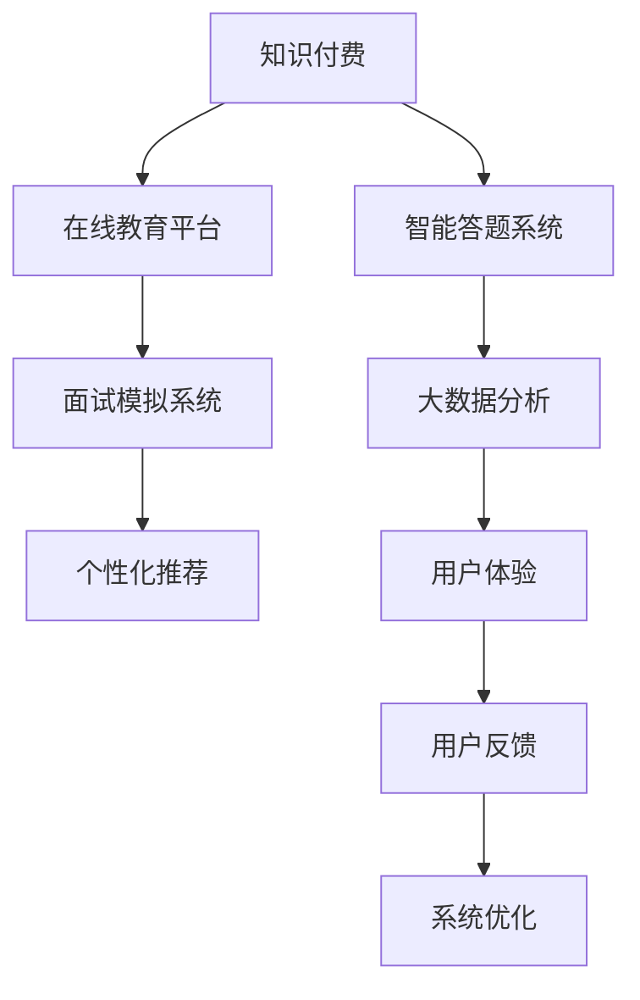

                 

# 如何利用知识付费实现在线公考培训与面试指导？

## 1. 背景介绍

### 1.1 问题由来
随着互联网技术的飞速发展，传统的线下公考培训模式正在逐步向线上迁移，知识付费成为教育行业的新趋势。公考面试指导，作为公务员考试的重要环节，其重要性不言而喻。传统面试指导主要依赖于线下一对一的模拟面试，但这种方式受限于时间和地域，难以大规模推广。在线面试指导的出现，可以充分利用互联网的优势，打破时间和空间的限制，为考生提供更为灵活、高效的备考方案。

### 1.2 问题核心关键点
在线公考培训与面试指导的核心在于如何利用知识付费的模式，构建一个高质量的在线学习平台，满足考生对于公考面试指导的个性化需求。其主要挑战包括：

1. **个性化需求满足**：不同考生的知识背景、答题风格、面试技巧等差异较大，如何提供针对性的教学内容是关键。
2. **实时互动反馈**：面试模拟训练需要及时、准确的反馈，线上指导如何模拟线下的一对一反馈机制，需要深入研究。
3. **数据驱动教学**：利用大数据和AI技术，通过分析考生答题数据，优化教学内容和策略，提升教学效果。
4. **用户体验优化**：在线平台的用户体验需要不断优化，以提高考生的使用粘性和满意度。
5. **内容持续更新**：公考面试题库和题型每年都有所变化，如何确保平台内容的及时更新和维护，是长期运营的重要问题。

## 2. 核心概念与联系

### 2.1 核心概念概述

为了更好地理解在线公考培训与面试指导，本节将介绍几个密切相关的核心概念：

- **知识付费**：通过购买服务或内容，获取专家的知识与指导。知识付费模式有助于资源的高效分配，提升教学质量。
- **在线教育平台**：基于互联网的教育平台，提供实时或异步的在线课程和互动功能，如视频直播、录播、讨论区等。
- **智能答题系统**：通过人工智能技术，对考生的答题过程进行分析和反馈，提高答题质量和效率。
- **面试模拟系统**：模拟真实的面试场景，提供个性化的面试训练和反馈，提升考生的面试表现。
- **大数据分析**：利用大数据技术，分析考生的答题数据和行为数据，优化教学内容和策略。
- **个性化推荐**：根据考生的学习行为和反馈，推荐合适的学习内容和策略，满足个性化需求。
- **用户体验**：平台设计需围绕用户需求，提供良好的界面设计、操作便捷性、互动性等，提升用户体验。

这些核心概念之间的逻辑关系可以通过以下Mermaid流程图来展示：



这个流程图展示了大语言模型的核心概念及其之间的关系：

1. 知识付费为在线教育平台提供了资金支持，使其能够持续运营和升级。
2. 在线教育平台为智能答题系统和面试模拟系统提供技术支撑和展示渠道。
3. 智能答题系统和大数据分析共同构成教学内容优化和个性化推荐的基石。
4. 面试模拟系统提供实时互动反馈，增强学习效果。
5. 用户体验和大数据分析共同驱动平台的优化和迭代。

## 3. 核心算法原理 & 具体操作步骤
### 3.1 算法原理概述

在线公考培训与面试指导的核心算法原理可以概括为以下四个步骤：

1. **知识内容构建**：通过专家资源整合，构建高质量的教学内容库，涵盖面试题库、答题技巧、模拟场景等。
2. **个性化推荐算法**：利用机器学习算法，根据考生的学习行为和答题数据，推荐合适的教学内容和策略。
3. **智能答题反馈**：通过自然语言处理和情感分析技术，对考生的答题过程进行评估，提供及时的反馈和建议。
4. **面试模拟训练**：利用虚拟现实和语音识别技术，构建真实的面试场景，提供个性化的面试训练和实时反馈。

### 3.2 算法步骤详解

#### 3.2.1 知识内容构建
- **专家资源整合**：邀请公考面试专家录制视频课程、编写答题指南、提供模拟面试场景等。
- **内容质量控制**：通过专家评审和用户反馈，确保教学内容的权威性和实用性。
- **内容模块化**：将课程内容划分为不同模块，如基础理论、常见题型、面试礼仪等，便于个性化推荐和搜索。

#### 3.2.2 个性化推荐算法
- **用户画像建立**：根据考生的基本信息和学习行为，建立用户画像，包括知识水平、答题风格、面试偏好等。
- **行为数据分析**：利用大数据技术，分析考生的学习路径、答题时间、错误类型等行为数据，发现学习规律和瓶颈。
- **推荐算法设计**：采用协同过滤、内容推荐、深度学习等算法，设计个性化推荐模型，根据用户画像和行为数据推荐合适的内容。

#### 3.2.3 智能答题反馈
- **自然语言处理**：利用自然语言处理技术，对考生的答题内容进行语义分析和情感判断，识别答题中的问题点。
- **即时反馈生成**：根据答题内容，生成即时反馈，指出问题所在，提供改进建议。
- **答题策略优化**：通过分析答题数据，优化答题策略，提高答题准确性和流畅性。

#### 3.2.4 面试模拟训练
- **虚拟现实环境构建**：利用虚拟现实技术，构建逼真的面试场景，包括面试官提问、考场环境等。
- **语音识别与合成**：利用语音识别和合成技术，实现考生的语音输入和反馈，模拟真实的面试交互。
- **实时互动反馈**：根据考生的回答，提供实时反馈，指出不足之处，并提供改进建议。

### 3.3 算法优缺点

在线公考培训与面试指导的算法具有以下优点：
1. **灵活性高**：通过知识付费模式，考生可以选择适合自己的时间和节奏进行学习，打破了时间和空间的限制。
2. **个性化强**：利用大数据和AI技术，提供个性化的教学内容和学习路径，满足不同考生的需求。
3. **实时互动**：通过面试模拟系统和智能答题系统，提供实时互动反馈，提升学习效果。
4. **效率高**：节省了线下培训的时间和成本，提高了学习效率。

同时，该算法也存在一些局限性：
1. **互动性差**：与线下一对一指导相比，线上指导的互动性仍然存在差距。
2. **数据隐私问题**：在线学习平台需要收集和处理考生的个人信息，存在数据隐私和安全问题。
3. **技术门槛高**：开发和维护高质量的在线平台和智能系统需要较高的技术门槛和资金投入。
4. **内容更新慢**：公考题库和题型每年都有所变化，平台内容的更新和维护需要持续投入。

## 4. 数学模型和公式 & 详细讲解 & 举例说明

### 4.1 数学模型构建

在线公考培训与面试指导的数学模型主要涉及以下几个方面：

- **用户画像模型**：用于描述用户的学习行为和偏好，可以通过协同过滤、深度学习等技术构建。
- **个性化推荐模型**：基于协同过滤、基于内容的推荐等算法，生成个性化推荐列表。
- **智能答题反馈模型**：利用自然语言处理和情感分析技术，对答题内容进行评估和反馈。
- **面试模拟反馈模型**：通过语音识别和自然语言处理技术，提供实时反馈和改进建议。

### 4.2 公式推导过程

#### 4.2.1 用户画像模型
用户画像模型可以通过协同过滤算法（Collaborative Filtering）构建。设用户集合为 $U$，物品集合为 $I$，用户对物品的评分矩阵为 $R$，用户画像向量为 $u$，物品画像向量为 $i$。协同过滤的公式为：

$$
u_i = \frac{\sum_{j\in I} R_{i,j}}{\sqrt{\sum_{j\in I} R_{i,j}^2 + \epsilon}}
$$

其中 $\epsilon$ 为平滑项，避免分母为零。

#### 4.2.2 个性化推荐模型
个性化推荐模型可以采用基于内容的推荐算法（Content-Based Recommendation）。设用户画像向量为 $u$，物品画像向量为 $i$，推荐列表为 $R$。推荐公式为：

$$
R = \{j|u \cdot i_j \geq \max_{k\in I} u \cdot i_k\}
$$

其中 $i_j$ 为物品 $j$ 的特征向量，$u \cdot i_j$ 表示用户画像和物品画像的相似度。

#### 4.2.3 智能答题反馈模型
智能答题反馈模型可以采用情感分析技术。设答题文本为 $T$，情感极性为 $E$，情感极性向量为 $v$。情感分析公式为：

$$
E = \arg\max_{e\in\{positive, negative\}} v_e \cdot T
$$

其中 $v_e$ 为情感极性向量，$T$ 为答题文本。

#### 4.2.4 面试模拟反馈模型
面试模拟反馈模型可以采用语音识别和自然语言处理技术。设考生回答为 $A$，面试官反馈为 $F$，语音识别结果为 $A'$，自然语言处理结果为 $F'$。反馈生成公式为：

$$
F' = \arg\max_{f'\in F'} \text{distance}(A', f')
$$

其中 $\text{distance}$ 为相似度函数，$A'$ 为语音识别结果，$f'$ 为自然语言处理结果。

### 4.3 案例分析与讲解

#### 案例1：个性化推荐
某在线公考平台利用协同过滤算法，为每位考生推荐适合的答题视频和课程。具体步骤如下：
1. 收集考生答题数据，包括答题时间、正确率、答题风格等。
2. 利用协同过滤算法，分析考生之间的相似度，构建用户画像。
3. 根据用户画像，推荐相似用户喜欢的答题视频和课程。

#### 案例2：智能答题反馈
某面试模拟系统利用自然语言处理技术，对考生的答题内容进行情感分析和语义分析。具体步骤如下：
1. 收集考生答题数据，包括答题内容、答题时间、正确率等。
2. 利用情感分析技术，分析答题内容的情感极性，生成情感反馈。
3. 利用自然语言处理技术，分析答题内容的语义，生成语义反馈。
4. 根据情感和语义反馈，生成改进建议，指导考生进行改进。

#### 案例3：面试模拟训练
某面试模拟系统利用虚拟现实技术和语音识别技术，为考生提供真实的面试场景。具体步骤如下：
1. 利用虚拟现实技术，构建逼真的面试场景，包括面试官提问、考场环境等。
2. 利用语音识别技术，将考生的语音输入转化为文字，并进行语义分析。
3. 根据考生的回答，提供实时反馈，指出不足之处，并提供改进建议。

## 5. 项目实践：代码实例和详细解释说明
### 5.1 开发环境搭建

在进行在线公考培训与面试指导的开发前，我们需要准备好开发环境。以下是使用Python进行Flask开发的环境配置流程：

1. 安装Python：从官网下载并安装Python，确保安装版本稳定。
2. 安装Flask：使用pip安装Flask，命令行输入 `pip install Flask`。
3. 安装相关库：安装Flask所需的库，如Gunicorn、Flask-RESTful、Flask-SQLAlchemy等，命令行输入 `pip install Flask-Gunicorn Flask-RESTful Flask-SQLAlchemy`。
4. 安装数据库：安装SQLite数据库，命令行输入 `pip install sqlite3`。
5. 安装虚拟环境：使用Python的虚拟环境工具，创建虚拟环境，确保不同项目之间的依赖隔离，命令行输入 `python -m venv venv`。
6. 激活虚拟环境：进入虚拟环境，命令行输入 `source venv/bin/activate`。
7. 安装开发工具：安装IDE或文本编辑器，如PyCharm、Visual Studio Code等，方便开发和调试。

完成上述步骤后，即可在虚拟环境中开始开发实践。

### 5.2 源代码详细实现

这里我们以一个简化的在线公考面试指导系统为例，给出Flask框架下，实现个性化推荐和智能答题反馈的代码实现。

#### 5.2.1 用户画像模型

```python
from flask import Flask, request, jsonify
from sklearn.neighbors import NearestNeighbors
import sqlite3

app = Flask(__name__)

# 连接SQLite数据库
conn = sqlite3.connect('user_data.db')
c = conn.cursor()

# 创建用户画像表
c.execute('''
    CREATE TABLE IF NOT EXISTS user_profile (
        user_id INT PRIMARY KEY,
        user_age INT,
        user_interests TEXT
    )
''')

# 添加用户画像数据
user_profiles = [
    (1, 25, '公考面试, 基础理论'),
    (2, 28, '面试技巧, 真题解析'),
    (3, 30, '答题策略, 结构化面试')
]
c.executemany('INSERT INTO user_profile VALUES (?, ?, ?)', user_profiles)

# 查询用户画像数据
def get_user_profile(user_id):
    c.execute('SELECT * FROM user_profile WHERE user_id=?', (user_id,))
    return c.fetchone()

# 推荐系统接口
@app.route('/recommend', methods=['POST'])
def recommend():
    user_id = request.json.get('user_id')
    user_age = request.json.get('user_age')
    user_interests = request.json.get('user_interests')
    
    # 获取用户画像数据
    user_profile = get_user_profile(user_id)
    if not user_profile:
        return jsonify({'error': 'User profile not found'}), 404
    
    # 计算相似度
    nn = NearestNeighbors(n_neighbors=5, metric='euclidean')
    nn.fit(user_profiles)
    distances, indices = nn.kneighbors([(user_age, user_interests, user_profile[2])])
    
    # 获取推荐数据
    recommendations = [user_profiles[i] for i in indices[0]]
    
    return jsonify({'recommendations': recommendations})

if __name__ == '__main__':
    app.run(debug=True)
```

#### 5.2.2 智能答题反馈模型

```python
import nltk
from nltk.sentiment import SentimentIntensityAnalyzer
from flask import Flask, request, jsonify

app = Flask(__name__)

# 初始化情感分析器
sia = SentimentIntensityAnalyzer()

# 智能答题反馈接口
@app.route('/feedback', methods=['POST'])
def feedback():
    answer = request.json.get('answer')
    
    # 情感分析
    sentiment = sia.polarity_scores(answer)
    sentiment_str = {
        'positive': sentiment['pos'],
        'negative': sentiment['neg'],
        'neutral': sentiment['neu'],
        'compound': sentiment['compound']
    }
    
    # 生成反馈结果
    feedback = {
        'answer': answer,
        'sentiment': sentiment_str,
        'recommendations': 'Rephrase the answer to make it more positive and specific.'
    }
    
    return jsonify(feedback)

if __name__ == '__main__':
    app.run(debug=True)
```

以上代码展示了如何使用Flask框架实现个性化推荐和智能答题反馈接口。用户画像数据通过SQLite数据库存储，推荐系统利用K近邻算法计算相似度，智能答题反馈模型利用NLTK库中的情感分析器对答题内容进行情感分析，生成反馈结果。

### 5.3 代码解读与分析

#### 5.3.1 用户画像模型

用户画像模型通过SQLite数据库存储用户的基本信息和兴趣，利用K近邻算法计算相似度，推荐用户画像相似的其他用户。其中，用户画像数据包括用户ID、年龄和兴趣标签。推荐系统接口接收用户ID、年龄和兴趣标签作为输入，返回与该用户画像相似的其他用户画像。

#### 5.3.2 智能答题反馈模型

智能答题反馈模型利用NLTK库中的情感分析器对答题内容进行情感分析，生成情感分析结果。情感分析结果包括正面、负面、中性和整体情感极性。反馈接口接收答题内容作为输入，返回情感分析结果和反馈建议。

## 6. 实际应用场景

### 6.1 智能面试指导
在线公考培训与面试指导系统可以应用于智能面试指导，为考生提供个性化的答题指导和实时反馈。系统根据考生的答题内容，生成实时反馈，指出问题所在，并提供改进建议。利用虚拟现实技术和语音识别技术，考生可以在虚拟面试场景中，进行多次模拟训练，不断优化答题策略。

### 6.2 个性化学习计划
系统可以根据考生的学习行为和答题数据，生成个性化的学习计划，推荐适合的课程和答题视频，帮助考生系统学习面试技巧和答题策略。利用大数据技术，系统可以不断优化推荐算法，提升推荐效果。

### 6.3 学习进度跟踪
系统可以记录和分析考生的学习进度和答题数据，生成学习报告，帮助考生了解自己的学习效果和薄弱环节，及时调整学习策略。利用AI技术，系统可以预测考生的学习进度，提前预警学习瓶颈，提供针对性建议。

### 6.4 未来应用展望

随着技术的发展，在线公考培训与面试指导系统将迎来更多的应用场景：

1. **多模态交互**：利用虚拟现实技术和语音识别技术，实现多模态交互，提升用户体验。
2. **智能推断**：利用AI技术，推断考生的学习动机和需求，生成个性化的学习内容和路径。
3. **社会化学习**：利用社交网络技术，促进考生之间的互动和交流，共同进步。
4. **实时学习分析**：利用大数据技术，实时分析考生的学习行为和答题数据，及时调整教学策略。
5. **跨平台协作**：利用云计算技术，实现跨平台协作，提升系统的可扩展性和可用性。

## 7. 工具和资源推荐
### 7.1 学习资源推荐

为了帮助开发者系统掌握在线公考培训与面试指导的理论基础和实践技巧，这里推荐一些优质的学习资源：

1. **在线课程**：Coursera、Udemy、edX等平台提供了丰富的在线课程，涵盖公考面试、面试技巧、智能推荐等主题。
2. **书籍**：《Python数据科学手册》、《深度学习入门》、《机器学习实战》等书籍，深入浅出地介绍了数据科学和机器学习的基本概念和算法。
3. **论文**：arXiv、IEEE Xplore等平台提供了大量公考面试指导、智能推荐系统的最新研究论文，建议关注顶级会议和期刊。
4. **博客**：Medium、CSDN等平台的博客，提供了大量关于在线教育、知识付费、智能推荐等领域的实践经验和思考。
5. **开源项目**：GitHub等平台上有许多优秀的开源项目，如在线教育平台、智能推荐系统等，建议学习并实践这些项目。

通过对这些资源的学习实践，相信你一定能够快速掌握在线公考培训与面试指导的精髓，并用于解决实际的公考问题。

### 7.2 开发工具推荐

高效的开发离不开优秀的工具支持。以下是几款用于在线公考培训与面试指导开发的常用工具：

1. **Flask**：轻量级Web框架，易于上手，适合快速开发原型。
2. **SQLite**：轻量级关系型数据库，适合小规模数据存储。
3. **NLTK**：自然语言处理库，提供了丰富的文本处理和情感分析功能。
4. **Gunicorn**：WSGI服务器，支持Flask应用的部署和扩展。
5. **Jupyter Notebook**：交互式编程环境，适合数据科学和机器学习项目开发。

合理利用这些工具，可以显著提升在线公考培训与面试指导的开发效率，加快创新迭代的步伐。

### 7.3 相关论文推荐

在线公考培训与面试指导的发展源于学界的持续研究。以下是几篇奠基性的相关论文，推荐阅读：

1. **《Knowledge-aware Recommender System》**：研究基于知识图谱的推荐系统，利用知识图谱提升推荐效果。
2. **《Semantic Analysis for Interview Preparation》**：利用自然语言处理技术，对面试答题内容进行语义分析和情感分析。
3. **《Virtual Reality for Interview Simulation》**：研究虚拟现实技术在面试模拟中的应用，提升面试模拟的真实性和互动性。
4. **《Educational Data Mining for Interview Preparation》**：研究教育数据挖掘技术，分析考生的学习行为和答题数据，优化教学策略。

这些论文代表了大语言模型微调技术的发展脉络。通过学习这些前沿成果，可以帮助研究者把握学科前进方向，激发更多的创新灵感。

## 8. 总结：未来发展趋势与挑战

### 8.1 研究成果总结

本文对在线公考培训与面试指导的方法进行了全面系统的介绍。首先阐述了知识付费模式的优势和在线公考面试指导的重要性，明确了在线面试指导的个性化需求、实时互动反馈、数据驱动教学等关键点。其次，从原理到实践，详细讲解了个性化推荐、智能答题反馈、面试模拟训练等核心算法，给出了具体的代码实例和分析。同时，本文还广泛探讨了在线公考面试指导的应用场景，展示了其广阔的前景。最后，本文精选了学习资源、开发工具和相关论文，力求为读者提供全方位的技术指引。

通过本文的系统梳理，可以看到，在线公考培训与面试指导技术正在成为知识付费领域的新的增长点，极大地拓展了公考培训的边界，催生了更多的落地场景。未来，伴随技术的发展，基于大数据和AI技术的在线公考培训与面试指导，将为考生提供更个性化、高效的学习方案，助力公考成功。

### 8.2 未来发展趋势

展望未来，在线公考培训与面试指导技术将呈现以下几个发展趋势：

1. **多模态交互**：利用虚拟现实技术和语音识别技术，实现多模态交互，提升用户体验。
2. **智能推断**：利用AI技术，推断考生的学习动机和需求，生成个性化的学习内容和路径。
3. **社会化学习**：利用社交网络技术，促进考生之间的互动和交流，共同进步。
4. **实时学习分析**：利用大数据技术，实时分析考生的学习行为和答题数据，及时调整教学策略。
5. **跨平台协作**：利用云计算技术，实现跨平台协作，提升系统的可扩展性和可用性。

这些趋势凸显了在线公考培训与面试指导技术的广阔前景。这些方向的探索发展，必将进一步提升公考培训的质量和效率，为考生的成功提供更强大的技术支持。

### 8.3 面临的挑战

尽管在线公考培训与面试指导技术已经取得了瞩目成就，但在迈向更加智能化、普适化应用的过程中，它仍面临着诸多挑战：

1. **互动性差**：与线下一对一指导相比，线上指导的互动性仍然存在差距，需要进一步优化。
2. **数据隐私问题**：在线学习平台需要收集和处理考生的个人信息，存在数据隐私和安全问题，需要制定严格的数据保护政策。
3. **技术门槛高**：开发和维护高质量的在线平台和智能系统需要较高的技术门槛和资金投入，需要更多的资源支持。
4. **内容更新慢**：公考题库和题型每年都有所变化，平台内容的更新和维护需要持续投入，需要更多的资源支持。

正视这些挑战，积极应对并寻求突破，将是在线公考培训与面试指导走向成熟的必由之路。相信随着学界和产业界的共同努力，这些挑战终将一一被克服，在线公考培训与面试指导必将在构建人机协同的智能时代中扮演越来越重要的角色。

### 8.4 研究展望

面对在线公考培训与面试指导所面临的种种挑战，未来的研究需要在以下几个方面寻求新的突破：

1. **互动性增强**：开发更加灵活的互动系统，提供更加真实的学习体验。
2. **数据隐私保护**：制定严格的数据保护政策，保障考生的数据隐私和安全。
3. **技术优化**：利用最新技术，优化推荐算法，提高推荐效果。
4. **内容更新**：利用大数据技术，及时更新公考题库和题型，保持内容的的时效性。
5. **用户体验**：持续优化用户界面和操作体验，提升考生的使用粘性和满意度。

这些研究方向的探索，必将引领在线公考培训与面试指导技术迈向更高的台阶，为考生提供更个性化、高效的学习方案，助力公考成功。面向未来，在线公考培训与面试指导技术还需要与其他人工智能技术进行更深入的融合，如知识表示、因果推理、强化学习等，多路径协同发力，共同推动公考培训和面试指导的进步。只有勇于创新、敢于突破，才能不断拓展在线公考培训与面试指导的边界，让智能技术更好地造福广大考生。

## 9. 附录：常见问题与解答

**Q1：在线公考培训与面试指导技术是否适用于所有考生？**

A: 在线公考培训与面试指导技术适用于大多数考生，特别是那些对时间和空间限制敏感的考生。但对于某些需要特定环境或场所的面试题目，如操作技能测试等，在线指导可能无法完全替代线下指导。

**Q2：如何确保在线公考培训与面试指导的质量？**

A: 确保在线公考培训与面试指导的质量需要从多个方面入手：
1. **专家资源**：邀请公考面试专家参与课程制作和系统开发，确保教学内容的权威性和实用性。
2. **用户反馈**：建立用户反馈机制，及时收集考生的使用体验和建议，持续优化系统。
3. **技术更新**：持续跟进最新的技术和算法，及时更新系统功能和算法模型。
4. **平台监控**：实时监控系统运行状态，及时发现和解决系统问题。

**Q3：如何保护考生的数据隐私？**

A: 保护考生的数据隐私需要从数据收集、存储、传输和使用各个环节进行严格控制：
1. **数据加密**：对考生的数据进行加密处理，确保数据在传输和存储过程中的安全性。
2. **数据匿名化**：对考生数据进行匿名化处理，确保数据无法被反向识别。
3. **访问控制**：对系统管理员和开发者设置严格的数据访问权限，确保数据只能被授权人员访问。
4. **隐私政策**：制定严格的数据隐私政策，告知考生数据的使用方式和保护措施。

**Q4：如何提高在线公考培训与面试指导的互动性？**

A: 提高在线公考培训与面试指导的互动性需要从多个方面入手：
1. **多模态交互**：利用虚拟现实技术和语音识别技术，实现多模态交互，提升用户体验。
2. **实时反馈**：提供实时互动反馈，帮助考生及时调整答题策略。
3. **社交功能**：利用社交网络技术，促进考生之间的互动和交流，共同进步。

**Q5：如何优化在线公考培训与面试指导的推荐系统？**

A: 优化在线公考培训与面试指导的推荐系统需要从多个方面入手：
1. **算法优化**：优化推荐算法，提高推荐效果。
2. **数据质量**：提高数据质量，确保推荐系统的准确性。
3. **实时更新**：利用大数据技术，实时更新公考题库和题型，保持内容的的时效性。
4. **个性化推荐**：利用大数据和AI技术，提供个性化的教学内容和学习路径，满足不同考生的需求。

**Q6：如何确保在线公考培训与面试指导的内容更新？**

A: 确保在线公考培训与面试指导的内容更新需要从多个方面入手：
1. **专家参与**：邀请公考面试专家参与课程制作和系统开发，确保教学内容的权威性和实用性。
2. **数据驱动**：利用大数据技术，分析考生的学习行为和答题数据，生成个性化的学习计划和推荐内容。
3. **持续更新**：持续跟进公考题库和题型的变化，及时更新教学内容和系统功能。
4. **用户反馈**：建立用户反馈机制，及时收集考生的使用体验和建议，持续优化系统。

通过本文的系统梳理，可以看到，在线公考培训与面试指导技术正在成为知识付费领域的新的增长点，极大地拓展了公考培训的边界，催生了更多的落地场景。未来，伴随技术的发展，基于大数据和AI技术的在线公考培训与面试指导，将为考生提供更个性化、高效的学习方案，助力公考成功。

---

作者：禅与计算机程序设计艺术 / Zen and the Art of Computer Programming

